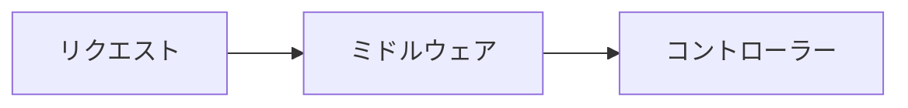

# 本コンテンツへの貢献方法

`ASP.NET Core ハンドブック` への貢献にご関心をお寄せいただきありがとうございます！誤字の修正、新しいコンテンツの追加、既存ページの改善など、どのような形であれ皆さまの貢献を歓迎いたします。このガイドを参考に、ぜひ貢献を始めてみてください。

## 🤔 貢献の種類

本コンテンツへの貢献には、いくつかの種類があります。

- **軽微な修正** - 誤字・脱字、文法の誤り、書式の問題を修正します。
- **コンテンツの追加** - 不足しているトピックをカバーする新しいドキュメントページやセクションを追加します。
- **コンテンツの改善** - 既存のドキュメントをより分かりやすい説明、最新の情報、追加の例などで改善します。
- **コードへの貢献** - サイトのコードベースの改善、バグ修正、新機能の追加を行います。本コンテンツは [Astro](https://astro.build/) + [Starlight](https://starlight.astro.build/) で静的サイトとしてビルドされています。詳しくは [サイトの構成とローカルでの確認](#%EF%B8%8F-サイトの構成とローカルでの確認) を参照してください。

貢献の手段は GitHub 上での Issue を作成するか、Discussion を経て Issue を作成し、その上で Pull Request を作成する形になります。以下のセクションで詳しく説明します。

## ➡️ Git ワークフロー

コンテンツの追加・変更は必ず次の Git ワークフローに従って行ってください。

1. Issue の作成から始める（または Discussion を経て Issue を作成する）
2. リポジトリをフォークする

    `ASP.NET Core ハンドブック` リポジトリを自分の GitHub アカウントにフォークします。
 
3. 変更用の新しいブランチを作成する

    ```bash
    git checkout -b feature/your-feature-name
    ```
    ブランチ名は**必ず feature/ で始めてください**。

4. [ライティングスタイルガイド](#%EF%B8%8F-ライティングスタイルガイド)を考慮しながら変更を行う
5. [ローカルで表示を確認する](#ローカルでの確認手順)
6. 分かりやすいコミットメッセージでコミットする
7. フォーク先にプッシュする
8. Pull Request を作成する
   - Pull Request 作成時の説明は必ずキーワードを使用して Issue のリンクを含める必要があります。例: `fixes #123`、`closes #123` など。詳しくは [GitHub のドキュメント](https://docs.github.com/ja/issues/tracking-your-work-with-issues/using-issues/linking-a-pull-request-to-an-issue#linking-a-pull-request-to-an-issue-using-a-keyword)をご確認ください
   - 必ず [行動規範](CODE_OF_CONDUCT.md) に従ってください
9. GitHub Actions によるビルド検証を確認する
   - Pull Request を作成すると自動的にサイトのビルドが実行されます。ビルドが失敗している場合はマージできませんので、エラー内容を確認して修正してください。よくある失敗の原因は [よくあるビルドエラー](#よくあるビルドエラー) にまとめています。
10. GitHub Copilot code review のレビューに対応する
    - Pull Request を作成すると、自動的に GitHub Copilot code review が起動し、あなたの Pull Request の内容をレビューします。レビューの修正は必須ではありませんが、従うことを推奨します。修正後は該当レビューを解決済みにマークしてください。レビュー内容が不適切だと判断した場合も同様に解決済みとしてください。
11. Pull Request が承認されて `main` にマージされる
    - GitHub Copilot code review による全てのレビューが解決済みであり、CODEOWNERS による手動レビューの後に `main` にマージされます。
    - `main` にマージされると自動的にサイトがビルドされ、GitHub Pages へ公開されます。

## 🏗️ サイトの構成とローカルでの確認

本コンテンツのマークダウンは、GitHub 上でそのまま読めるだけでなく、[Astro](https://astro.build/) + [Starlight](https://starlight.astro.build/) によって静的サイトとしてビルドされ、GitHub Pages で公開されています。

**公開サイト**: <https://microsoft.github.io/aspnetcore-ja-handbook/>

そのため、マークダウンを変更したときは **GitHub 上の表示ではなく、ビルドされたサイトでの表示** が最終的な結果になります。Pull Request を作成する前にローカルで確認してください。

### フォルダ構成

記事は `src/content/docs/` 配下にあります。**1 つの章が 1 つのフォルダ** に対応し、本文は必ず `index.md` という名前になります。

```text
src/content/docs/
├── index.md                        # トップページ（サイトの表紙）
├── 01-setup-dev-env/
│   └── index.md                    # 第1章の本文
├── 02-solutions-and-projects/
│   ├── index.md                    # 第2章の本文
│   └── images/                     # 第2章で使う画像だけを置く
│       ├── 02-01_solution-explorer.png
│       └── 02-02_add-project-reference.png
└── 03-mvc-web-and-api/
    ├── index.md
    └── images/
```

| 決まりごと | 内容 |
|---|---|
| 本文のファイル名 | 必ず `index.md`。フォルダ名が URL になります（`01-setup-dev-env/` → `/aspnetcore-ja-handbook/01-setup-dev-env/`） |
| フォルダ名の連番 | サイドバーの並び順は **フォルダ名の順** で決まります。`01-`、`02-` の連番は並び順を制御しているので必ず付けてください |
| 画像の置き場所 | その章のフォルダ内の `images/` に置きます。他の章の `images/` は参照しないでください |

画像を章ごとに分けているのは、章を削除・移動したときに画像も一緒に扱えるようにするためです。

`src/content/docs/` の外にあるファイル（`README.md`、`CONTRIBUTING.md` など）は **サイトには公開されません**。リポジトリ上でのみ読まれるファイルです。

### ローカルでの確認手順

[Node.js](https://nodejs.org/) の **22.12 以上** が必要です（`node --version` で確認できます）。

```bash
# 1. 依存パッケージをインストールする（初回のみ）
npm ci

# 2. 開発サーバーを起動する
npm run dev
```

起動したら <http://localhost:4321/aspnetcore-ja-handbook/> をブラウザで開いてください。マークダウンを保存すると自動的に画面へ反映されます。

Pull Request を作成する前には、本番と同じ静的ファイルを生成して確認してください。`npm run dev` では気づけない問題（リンク切れなど）を検出できます。

```bash
# 3. 本番と同じ内容をビルドする（ここでエラーが出れば CI でも失敗します）
npm run build

# 4. ビルド結果を表示して最終確認する
npm run preview
```

> [!TIP]
> `npm run dev` を実行したままマークダウンを編集すると、変更がすぐ画面に反映されるため執筆がはかどります。停止するときはターミナルで `Ctrl + C` を押してください。

### よくあるビルドエラー

| エラーの内容 | 原因と対処 |
|---|---|
| `title` に関するエラーでビルドが止まる | 記事の先頭にフロントマターがない、または `title` が書かれていません。[フロントマター](#フロントマター必須) を追加してください |
| 画像が表示されない | 画像のパスが間違っています。画像はその章の `images/` に置き、`./images/ファイル名` の形式で参照してください |
| 他の章へのリンクが 404 になる | リンクの書き方が間違っています。[章の間のリンク](#章の間のリンク) を確認してください |

## ✍️ ライティングスタイルガイド

`ASP.NET Core ハンドブック` に貢献する際は、一貫性と明確さを確保するために以下のライティングガイドラインに従ってください：

- **明確で簡潔な言葉を使う** - シンプルさを心がけてください。専門用語は必要な場合を除き避け、技術用語は初出時に説明してください。
- **一貫性を保つ** - 用語、書式、構成について既存の規則に従ってください。他のドキュメントページを参考にしてください。
- **画像・Mermaidによる図解をする** - コンテンツをわかりやすくするために画像・Mermaid記法によるフロー・図の掲載を強く推奨します。特に IDE での使い方に言及する場合は画面のキャプチャは必須です。
- **インクルーシブな表現を使う** - すべての読者を尊重するインクルーシブな言葉遣いを使用してください。性別を限定する用語やステレオタイプは避けてください。
- **例を示す** - 具体的な実装を説明するためにコードスニペットや例を含めてください。
- **正しい文法とスペルを使う** - 貢献内容を校正し、誤りや誤字がないことを確認してください。
- **論理的にコンテンツを構成する** - 見出し、小見出し、リストを使って、情報を分かりやすく整理してください。
- **関連リソースへのリンクを貼る** - 概念、ツール、関連ドキュメントについて、読者が詳細情報を見つけられるよう参考ドキュメントセクションをコンテンツの最後に作成し、参照リンクを提供してください。
- **既存コンテンツを確認する** - 新しいコンテンツを追加する前に、既存のドキュメントを確認し、重複を避けて一貫性を保ってください。

## 📝 マークダウンの書き方

本コンテンツはマークダウン形式で書かれています。マークダウンの基本的な書き方については以下の GitHub 公式ドキュメントを参照してください。

- [基本的な書き込みと書式設定の構文](https://docs.github.com/ja/get-started/writing-on-github/getting-started-with-writing-and-formatting-on-github/basic-writing-and-formatting-syntax)

以降に本コンテンツ固有の記載方法について説明します。

### フロントマター（必須）

すべての記事はファイルの先頭にフロントマターを書く必要があります。**これがないとビルドが失敗します。**

```markdown
---
title: "第6章：依存性注入 (DI)"
description: "DI の基本概念、サービスの登録スコープ、ファクトリ登録や遅延注入、サービス層の設計パターンを解説します。"
---

## 1. DI とは
```

| 項目 | 必須 | 内容 |
|---|---|---|
| `title` | 必須 | 記事のタイトル。ページの見出し、サイドバーの項目名、ブラウザのタブに使われます |
| `description` | 推奨 | 記事の概要。検索エンジンや SNS でのプレビューに使われます |

> [!IMPORTANT]
> **本文に `# 見出し` （h1）を書かないでください。** `title` から自動的にページ見出しが生成されるため、本文に書くと見出しが二重に表示されます。本文の見出しは `##` から始めてください。

### 見出しの使い方

記事の中の大きな区切りは `##`、その中の小見出しは `###` を使います。ページ右側の目次には `##` と `###` が表示されます。

```markdown
## 1. DI とは

### 1.1 サービスの登録

#### さらに細かい項目（目次には表示されません）
```

### 画像の入れ方

画像はその章のフォルダ内の `images/` に置き、`./images/ファイル名` の形式で参照してください。

```markdown

```

| ルール | 内容 |
|---|---|
| 置き場所 | その章のフォルダ内の `images/`（例: `src/content/docs/02-solutions-and-projects/images/`） |
| 参照の書き方 | 必ず `./images/ファイル名` の相対パス。`/images/...` のような `/` で始まるパスは公開サイトで表示されません |
| ファイル名 | `章番号-連番_内容.png` の形式（例: `02-01_solution-explorer.png`） |
| 代替テキスト | `![]` の中は空にせず、画像の内容が分かる説明を書いてください |

画像はビルド時に自動的に WebP へ変換され、サイズも最適化されます。事前に圧縮する必要はありません。

### 章の間のリンク

他の章へリンクするときは、**移動先の `index.md` までを含む相対パス** で書いてください。

```markdown
<!-- 正しい書き方 -->
[第1章：開発環境セットアップ](../01-setup-dev-env/index.md)

<!-- 章の中の特定の節にリンクする場合 -->
[6. 初回プロジェクト作成](../01-setup-dev-env/index.md#6-初回プロジェクト作成)
```

`.md` は公開サイトの URL へ自動的に変換されるため、そのまま書いて構いません。この書き方であれば、GitHub 上でマークダウンを直接読んだときも公開サイトでも、どちらでもリンクが機能します。

> [!WARNING]
> `/src/content/docs/...` のように `/` で始まるパスは変換されず、公開サイトでリンク切れになります。必ず `../` で始まる相対パスを使ってください。

### 図の書き方（Mermaid）

[Mermaid](https://mermaid.js.org/) 記法で書いた図は、公開サイトで自動的に図として描画されます。

````markdown

````

### 補足情報の書き方（アラート）

GitHub のアラート記法は、公開サイトでは色付きのボックスとして表示されます。

```markdown
> [!NOTE]
> 補足情報や覚えておくとよい情報を書きます。

> [!TIP]
> 役立つヒントや、より良いやり方を書きます。

> [!IMPORTANT]
> 読み飛ばすと困る重要な情報を書きます。

> [!WARNING]
> 注意しないと問題が起きる内容を書きます。

> [!CAUTION]
> 危険な操作や、避けるべき内容を書きます。
```

上記 5 種類が使用できます。ただし公開サイトの表示は 4 種類しかないため、`IMPORTANT` は `NOTE` と同じ見た目になります。

### IDEごとのコンテンツの書き方

.NET CLI と Visual Studio、Visual Studio Code + C# Dev Kit で異なる固有のコンテンツを文書化する場合は、`<details>` タグと `<summary>` タグを使用して、セクションを折りたたみ可能にしてください。

例:

````markdown
<details>
<summary>CLI</summary>

ターミナルで以下のコマンドを実行します。

```bash
dotnet add src/Web/Web.csproj reference src/ApplicationCore/ApplicationCore.csproj
```

</details>
````

この実装は次のように表示されます。
<details>
<summary>CLI</summary>

ターミナルで以下のコマンドを実行します。

```bash
dotnet add src/Web/Web.csproj reference src/ApplicationCore/ApplicationCore.csproj
```

</details>

### 他言語・他フレームワークの経験者向けのコンテンツの書き方

コンテンツ内で他言語・他フレームワークでの似たような機能や概念を説明する場合、`[!TIP]` を使用して、以下のように記載してください。

```
> [!TIP]
> NuGet は .NET 標準のパッケージ管理システムであり、Java における Maven/Gradle、JavaScript における npm、PHP における Composer に近いものです。
```

> [!TIP]
> NuGet は .NET 標準のパッケージ管理システムであり、Java における Maven/Gradle、JavaScript における npm、PHP における Composer に近いものです。

## 📄 新しい章を追加する手順

新しい章を追加する場合は、次の手順で作業してください。

1. **章のフォルダを作る**

    `src/content/docs/` の下に `連番-英語のスラッグ` という名前でフォルダを作ります。連番はサイドバーの並び順になるため、既存の章に続く番号を付けてください。

    ```bash
    mkdir -p src/content/docs/06-dependency-injection
    ```

2. **本文を `index.md` として作る**

    ```bash
    touch src/content/docs/06-dependency-injection/index.md
    ```

    先頭に [フロントマター](#フロントマター必須) を書き、本文は `##` の見出しから始めます。

3. **画像を置く（ある場合）**

    その章のフォルダの中に `images/` を作り、そこに画像を置きます。画像を使わない章では `images/` を作る必要はありません。

    ```bash
    mkdir -p src/content/docs/06-dependency-injection/images
    ```

4. **`README.md` の目次を更新する**

    GitHub 上で表示される目次は `README.md` にあります。新しい章の行を追加してください。

    ```markdown
    | 第 6 章 | [依存性注入 (DI)](src/content/docs/06-dependency-injection/index.md) | <ol><li>DI の基本概念</li>...</ol> |
    ```

    公開サイトのサイドバーは自動生成されるため、更新する必要はありません。

5. **ローカルで確認する**

    [ローカルでの確認手順](#ローカルでの確認手順) に従って、サイドバーに新しい章が表示されること、リンクや画像が正しく機能することを確認してください。

> [!NOTE]
> サイドバーの設定ファイルはありません。`src/content/docs/` にフォルダを追加すれば自動的にサイドバーへ反映されます。並び順はフォルダ名の順、サイドバーに表示される名前はフロントマターの `title` になります。
