# 第1章：ASP.NET Core 開発環境セットアップ

> **対象バージョン**: .NET 10 (LTS) / .NET 9 (STS)  
> **参考**: [Microsoft 公式ドキュメント](https://learn.microsoft.com/ja-jp/dotnet/)

---

## 目次

1. [.NET SDK / ランタイムとは](#1-net-sdk--ランタイムとは)
2. [LTS / STS のサポート期間](#2-lts--sts-のサポート期間)
3. [OS 別セットアップ](#3-os-別セットアップ)
   - [Windows](#31-windows)
   - [macOS](#32-macos)
   - [Linux (Ubuntu)](#33-linux-ubuntu)
4. [IDE 準備](#4-ide-準備)
   - [Visual Studio](#41-visual-studio-windows-のみ)
   - [Visual Studio Code + C# Dev Kit](#42-visual-studio-code--c-dev-kit)
   - [JetBrains Rider](#43-jetbrains-rider)
5. [.NET CLI 基本コマンド](#5-net-cli-基本コマンド)
6. [初回プロジェクト作成](#6-初回プロジェクト作成)

---

## 1. .NET SDK / ランタイムとは

.NET には大きく **SDK** と **ランタイム** の 2 種類のコンポーネントがあります。

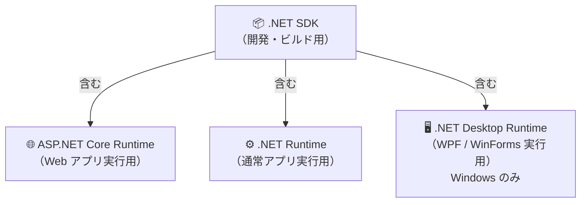

| コンポーネント | 用途 | 含まれるもの |
|---|---|---|
| **.NET SDK** | アプリの開発・ビルド・発行 | .NET Runtime + ASP.NET Core Runtime + CLI ツール |
| **ASP.NET Core Runtime** | Web アプリの実行 | .NET Runtime を含む |
| **.NET Runtime** | 通常の .NET アプリ実行 | 最小構成 |
| **.NET Desktop Runtime** | WPF / WinForms の実行（Windows のみ） | .NET Runtime を含む |

> [!TIP]
> ASP.NET Core アプリを開発するなら **SDK を 1 つインストールするだけで OK** です。SDK には 3 つのランタイムがすべて含まれています。

---

## 2. LTS / STS のサポート期間

.NET のリリースには **LTS (Long Term Support)** と **STS (Standard Term Support)** の 2 種類があり、奇数バージョンが STS、偶数バージョンが LTS となっています。

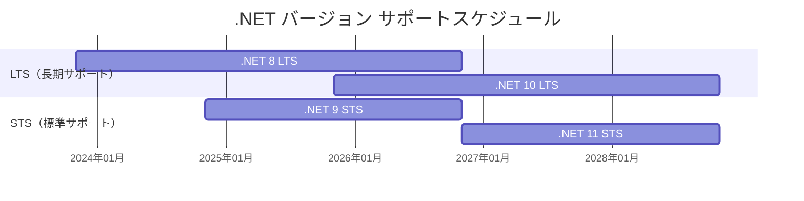

> [!NOTE]
> 以下の情報は **2026年4月現在** のものです。最新情報は [Microsoft 公式サイト](https://learn.microsoft.com/ja-jp/dotnet/core/releases-and-support) をご確認ください。

| バージョン | 種類 | リリース | サポート終了 | 状態 |
|---|---|---|---|---|
| **.NET 10** | **LTS** | 2025年11月 | **2028年11月** | ✅ サポート中 |
| .NET 9 | STS | 2024年11月 | 2026年11月 | ✅ サポート中 |
| .NET 8 | LTS | 2023年11月 | 2026年11月 | ✅ サポート中 |
| .NET 7 | STS | 2022年11月 | 2024年5月 | ❌ サポート終了 |

### どのバージョンを選ぶべきか？

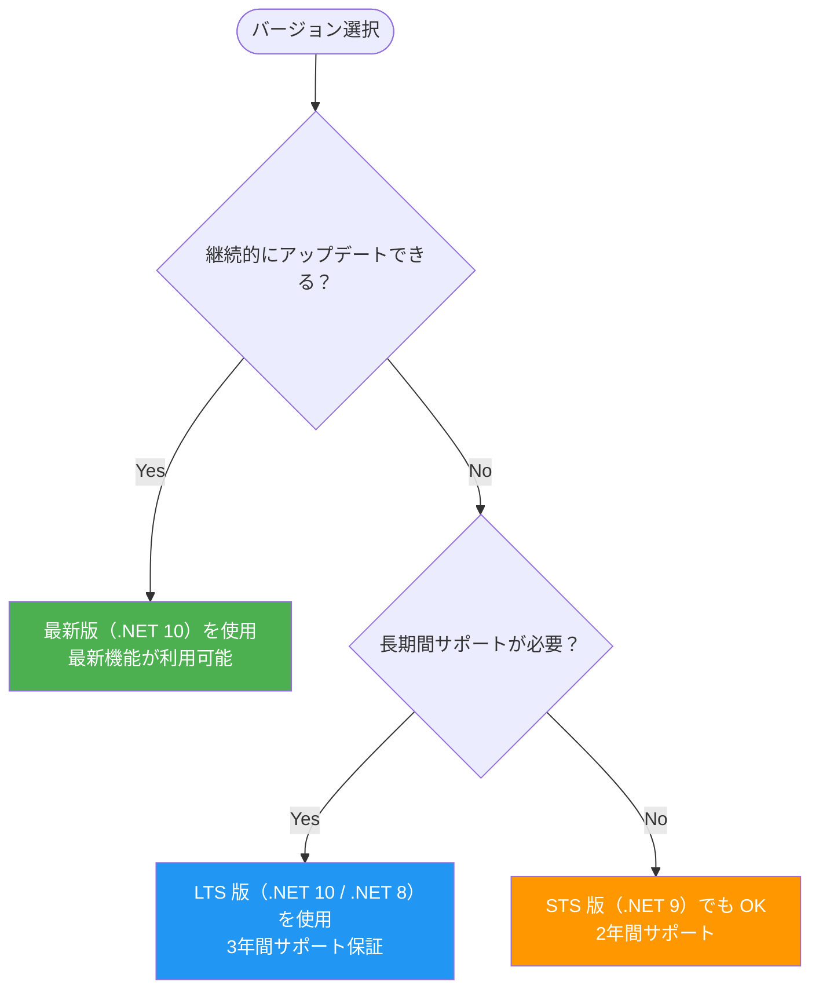

> [!TIP]
> 新規プロジェクトは **LTS 版（.NET 10）** を選択してください。SDK は常に最新版を使用すると、全バージョンのランタイムをターゲットにできます。

---

## 3. OS 別セットアップ

### 3.1 Windows

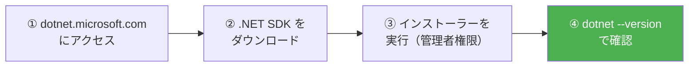

#### 方法 A: インストーラー（推奨）

1. [https://dotnet.microsoft.com/download](https://dotnet.microsoft.com/download) にアクセス
2. **.NET 10.0 (LTS)** の SDK をダウンロード（Intel CPU → `x64`、ARM CPU → `Arm64`）
3. ダウンロードした `.exe` を**管理者として実行**
4. インストール完了後、確認:

```powershell
dotnet --version
# 例: 10.0.201
```

#### 方法 B: WinGet（コマンドラインで一発）

```powershell
# SDK をインストール（開発者向け・推奨）
winget install Microsoft.DotNet.SDK.10

# または ASP.NET Core Runtime のみ（実行環境用）
winget install Microsoft.DotNet.AspNetCore.10

# インストール済み SDK 一覧を確認
dotnet --list-sdks
```

#### 方法 C: PowerShell スクリプト（CI / 非管理者環境向け）

```powershell
# スクリプトをダウンロード
Invoke-WebRequest https://dot.net/v1/dotnet-install.ps1 -OutFile dotnet-install.ps1

# 最新 LTS 版 SDK をインストール
.\dotnet-install.ps1

# バージョンを指定する場合
.\dotnet-install.ps1 -Channel 10.0
```

#### インストール先

| アーキテクチャ | SDK のインストール先 |
|---|---|
| x64 / Arm64 | `C:\Program Files\dotnet\` |
| x64 (ARM PC 上での x64 SDK) | `C:\Program Files\dotnet\x64\` |

---

### 3.2 macOS

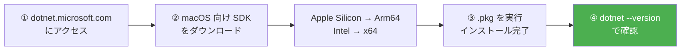

#### 方法 A: インストーラーパッケージ（推奨）

1. [https://dotnet.microsoft.com/download/dotnet](https://dotnet.microsoft.com/download/dotnet) にアクセス
2. **.NET 10.0** を選択し、macOS 向け SDK をダウンロード
   - **Apple Silicon（M1/M2/M3/M4 等）** → `Arm64`
   - **Intel Mac** → `x64`
3. ダウンロードした `.pkg` をダブルクリックしてインストール
4. 確認:

```bash
dotnet --version
# 例: 10.0.201
```

#### 方法 B: インストールスクリプト

```bash
# wget がない場合は Homebrew でインストール
brew install wget

# インストールスクリプトをダウンロード
wget https://dot.net/v1/dotnet-install.sh

# 実行権限を付与
chmod +x dotnet-install.sh

# 最新 LTS 版をインストール
./dotnet-install.sh
```

#### PATH の設定（スクリプトでインストールした場合）

インストールスクリプトを使用した場合、`~/.dotnet` にインストールされます。ターミナルから使えるよう、シェルの設定ファイルに PATH を追加してください。

```bash
# ~/.zshrc（Zsh の場合）または ~/.bash_profile（Bash の場合）に追記
export DOTNET_ROOT=$HOME/.dotnet
export PATH=$PATH:$DOTNET_ROOT:$DOTNET_ROOT/tools
```

設定を反映:

```bash
source ~/.zshrc   # Zsh の場合
# または
source ~/.bash_profile
```

#### Apple Silicon（M シリーズ）の注意点

| バージョン | インストール先 |
|---|---|
| Arm64 版 SDK | `/usr/local/share/dotnet/` |
| x64 版 SDK（Rosetta 2 経由） | `/usr/local/share/dotnet/x64/dotnet/` |

---

### 3.3 Linux (Ubuntu)

Ubuntu の場合、パッケージマネージャーから直接インストールできます。

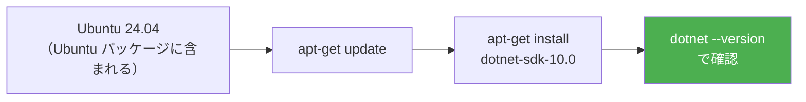

#### Ubuntu 24.04 / 25.04 / 25.10

```bash
# パッケージリストを更新して SDK をインストール
sudo apt-get update && \
  sudo apt-get install -y dotnet-sdk-10.0
```

SDK ではなくランタイムのみが必要な場合（本番環境等）:

```bash
# ASP.NET Core Runtime（Web アプリ実行用・推奨）
sudo apt-get install -y aspnetcore-runtime-10.0

# .NET Runtime のみ（最小構成）
sudo apt-get install -y dotnet-runtime-10.0
```

#### Red Hat / Fedora / CentOS Stream

```bash
# Fedora の場合
sudo dnf install dotnet-sdk-10.0

# RHEL の場合（subscription-manager でリポジトリを有効化後）
sudo dnf install dotnet-sdk-10.0
```

#### スクリプトによるインストール（ディストリビューション共通）

```bash
# インストールスクリプトをダウンロード
curl -O https://dot.net/v1/dotnet-install.sh
chmod +x dotnet-install.sh

# 最新 LTS をインストール
./dotnet-install.sh --channel LTS

# バージョン指定
./dotnet-install.sh --channel 10.0
```

#### インストール確認（全 OS 共通）

```bash
# SDK バージョン確認
dotnet --version

# インストール済み SDK 一覧
dotnet --list-sdks

# インストール済みランタイム一覧
dotnet --list-runtimes

# 詳細情報
dotnet --info
```

出力例:

```
10.0.201
```

```
.NET SDKs installed:
  8.0.415 [/usr/local/share/dotnet/sdk]
  10.0.201 [/usr/local/share/dotnet/sdk]

.NET runtimes installed:
  Microsoft.AspNetCore.App 8.0.15 [/usr/local/share/dotnet/shared/Microsoft.AspNetCore.App]
  Microsoft.AspNetCore.App 10.0.3 [/usr/local/share/dotnet/shared/Microsoft.AspNetCore.App]
```

---

## 4. IDE 準備

ASP.NET Core 開発に対応した主要な IDE を 3 つ紹介します。

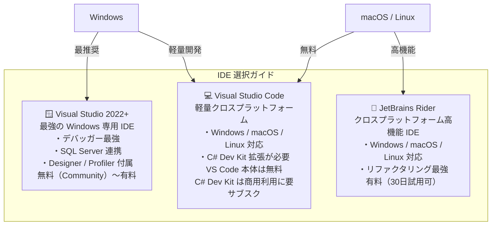

### 4.1 Visual Studio（Windows のみ）

Visual Studio は .NET / ASP.NET Core 開発に最も最適化された Windows 専用 IDE です。

#### 必要バージョン

| .NET バージョン | 最小 Visual Studio バージョン |
|---|---|
| **.NET 10** | Visual Studio 2026 (v18.0+) |
| .NET 9 | Visual Studio 2022 (v17.12+) |
| .NET 8 | Visual Studio 2022 (v17.8+) |

#### インストール手順

1. [Visual Studio ダウンロードページ](https://www.visualstudio.com/downloads/) から **Visual Studio Installer** をダウンロード
2. インストーラーを起動し、**ワークロード**を選択:

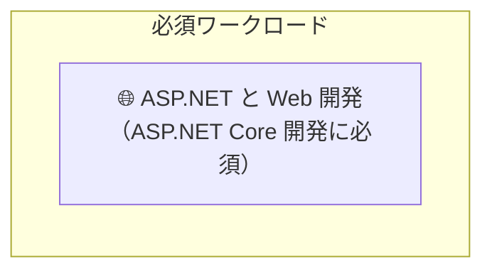

> [!NOTE]
> 以下のワークロードはオプションです。必要に応じて追加してください。
>
> - **🖥️ .NET デスクトップ開発** — WPF / WinForms を開発する場合
> - **☁️ Azure の開発** — Azure サービスと連携する場合

3. インストール完了後、**Visual Studio** を起動
4. 新しいプロジェクトの作成から ASP.NET Core テンプレートを選択

---

### 4.2 Visual Studio Code + C# Dev Kit

VS Code は軽量でクロスプラットフォームなエディターです。C# Dev Kit 拡張を追加することで、Visual Studio に近いエクスペリエンスが得られます。

#### C# Dev Kit のライセンス（重要）

> ⚠️ **C# Dev Kit は完全に無料ではありません。**  
> Visual Studio と同じライセンスモデルが適用されます。

| 利用シナリオ | 利用可否 |
|---|---|
| 個人開発・学習・実験 | ✅ 無料 |
| 学術・教育機関 | ✅ 無料 |
| オープンソース開発 | ✅ 無料 |
| **組織での商用開発** | ⚠️ **Visual Studio Professional / Enterprise サブスクリプションが必要** |
| GitHub Codespaces | ✅ プランに含まれる |

組織での利用には、**Visual Studio Professional または Enterprise のサブスクリプション**が必要です。個人学習や OSS 開発であれば無償で利用できます。詳細は [ライセンス条件（MS 公式）](https://learn.microsoft.com/ja-jp/visualstudio/subscriptions/vs-c-sharp-dev-kit#eligibility) を参照してください。

#### セットアップ手順


1. [Visual Studio Code](https://code.visualstudio.com/) をダウンロードしてインストール

2. VS Code を起動し、拡張機能マーケットプレイスから **C# Dev Kit** (`ms-dotnettools.csdevkit`) をインストール:

   ```
   Ctrl+Shift+X（Windows/Linux）または Cmd+Shift+X（macOS）
   → 検索: "C# Dev Kit"
   → インストール
   ```

3. C# Dev Kit には以下の拡張が含まれます:

   | 拡張 | 役割 |
   |---|---|
   | C# Dev Kit | プロジェクト管理、テスト Explorer、ソリューション Explorer |
   | C# | IntelliSense、コード補完、デバッガー |
   | IntelliCode for C# Dev Kit | AI 補完 |

> [!TIP]
> **Windows ユーザー向けオプション**: WinGet 構成ファイルを使うと、**.NET SDK・Visual Studio Code・C# Dev Kit** をまとめて一括インストールできます。すでにインストール済みのものは自動的にスキップされます。
>
> 1. [WinGet 構成ファイル](https://builds.dotnet.microsoft.com/dotnet/install/dotnet_basic_config_docs.winget) をダウンロードしてダブルクリック
> 2. 使用許諾契約に同意して続行
>
> 詳細は [Windows に .NET をインストールする（MS Learn）](https://learn.microsoft.com/ja-jp/dotnet/core/install/windows) の「Visual Studio Code を使用してインストールする」セクションを参照してください。

---

### 4.3 JetBrains Rider

JetBrains Rider はクロスプラットフォームで動作するフル機能の .NET IDE です。特にリファクタリングや静的解析が強力です。

- **対応 OS**: Windows / macOS / Linux
- **ライセンス**: 有料（30 日間無料トライアルあり）
- **ダウンロード**: [https://www.jetbrains.com/rider/](https://www.jetbrains.com/rider/)

> [!NOTE]
> Rider は .NET SDK が別途インストールされていることを前提としています。先に SDK をインストールしてから Rider をセットアップしてください。

---

## 5. .NET CLI 基本コマンド

.NET CLI（コマンドラインインターフェイス）は、.NET SDK に含まれるクロスプラットフォームツールです。IDEがなくてもアプリの作成・ビルド・実行が可能です。

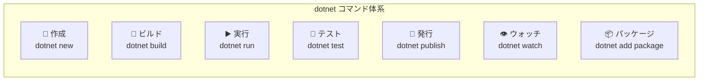

### 基本コマンド一覧

| コマンド | 説明 | 例 |
|---|---|---|
| `dotnet new <テンプレート>` | プロジェクトを作成 | `dotnet new webapi -o MyApi` |
| `dotnet build` | プロジェクトをビルド | `dotnet build` |
| `dotnet run` | アプリを実行 | `dotnet run` |
| `dotnet test` | テストを実行 | `dotnet test` |
| `dotnet publish` | 発行用ファイルを生成 | `dotnet publish -c Release` |
| `dotnet watch` | ファイル変更を監視して自動再起動 | `dotnet watch run` |
| `dotnet clean` | ビルド出力を削除 | `dotnet clean` |
| `dotnet restore` | NuGet パッケージを復元 | `dotnet restore` |
| `dotnet --info` | SDK / Runtime の情報を表示 | `dotnet --info` |
| `dotnet new list` | テンプレート一覧を表示 | `dotnet new list` |

### パッケージ管理コマンド

```bash
# NuGet パッケージを追加
dotnet add package Microsoft.EntityFrameworkCore

# インストール済みパッケージ一覧
dotnet list package

# パッケージを削除
dotnet remove package Microsoft.EntityFrameworkCore

# パッケージを更新
dotnet add package Microsoft.EntityFrameworkCore --version 9.0.0
```

### ビルドと実行の流れ

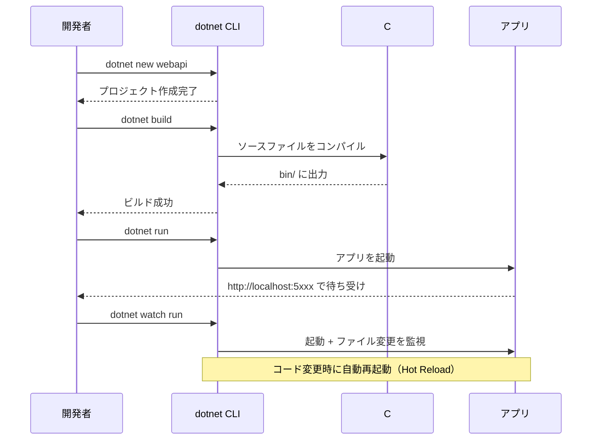

---

## 6. 初回プロジェクト作成

ASP.NET Core の主要なプロジェクトテンプレートを紹介します。

### テンプレート 比較一覧

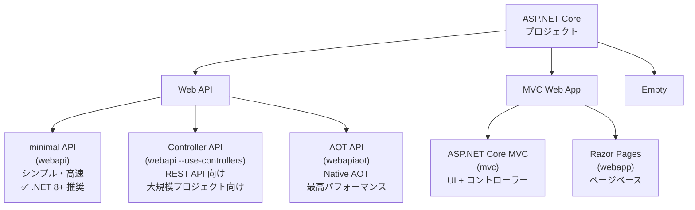

| テンプレート | コマンド | 用途 |
|---|---|---|
| **ASP.NET Core Web API** (Minimal API) | `dotnet new webapi` | REST API・マイクロサービス |
| ASP.NET Core Web API (コントローラー) | `dotnet new webapi --use-controllers` | 大規模 REST API |
| ASP.NET Core API (Native AOT) | `dotnet new webapiaot` | 高パフォーマンス API |
| ASP.NET Core MVC | `dotnet new mvc` | サーバーサイドレンダリング Web アプリ |
| ASP.NET Core Web App (Razor Pages) | `dotnet new webapp` | ページ中心のシンプルな Web アプリ |
| ASP.NET Core gRPC | `dotnet new grpc` | gRPC サービス |
| Worker Service | `dotnet new worker` | バックグラウンドサービス |
| ASP.NET Core Empty | `dotnet new web` | 最小構成（カスタム用途） |

---

### 6.1 Web API プロジェクト（最もよく使う）

```bash
# プロジェクトを作成
dotnet new webapi -n MyWebApi -o MyWebApi

# 作成されたディレクトリに移動
cd MyWebApi

# 実行
dotnet run
```

出力例:

```
Building...
info: Microsoft.Hosting.Lifetime[14]
      Now listening on: http://localhost:5000
info: Microsoft.Hosting.Lifetime[14]
      Now listening on: https://localhost:7000
```

ブラウザで `https://localhost:7000/weatherforecast` にアクセスして動作確認できます。

#### 作成されるプロジェクト構造

```
MyWebApi/
├── Properties/
│   └── launchSettings.json    # 実行プロファイル設定
├── appsettings.json            # アプリ設定（本番環境）
├── appsettings.Development.json # アプリ設定（開発環境）
├── MyWebApi.csproj             # プロジェクトファイル
└── Program.cs                  # エントリポイント（Minimal API）
```

---

### 6.2 MVC プロジェクト

```bash
# MVC プロジェクトを作成
dotnet new mvc -n MyMvcApp -o MyMvcApp
cd MyMvcApp
dotnet run
```

MVC プロジェクトの構造:

```
MyMvcApp/
├── Controllers/
│   └── HomeController.cs      # コントローラー
├── Models/
│   └── ErrorViewModel.cs      # モデル
├── Views/
│   ├── Home/
│   │   ├── Index.cshtml       # ビュー（Razor）
│   │   └── Privacy.cshtml
│   └── Shared/
│       ├── _Layout.cshtml     # レイアウト共通テンプレート
│       └── _ValidationScriptsPartial.cshtml
├── wwwroot/                   # 静的ファイル（CSS/JS/画像）
├── appsettings.json
└── Program.cs
```

#### `dotnet new` のコマンド例

.NET CLI を使用してプロジェクトを作成する際の主なオプションを紹介します。

```bash
# テンプレートを指定してプロジェクト作成
dotnet new webapi                          # Web API（Minimal API）
dotnet new webapi --use-controllers        # Web API（コントローラーベース）
dotnet new mvc                             # MVC
dotnet new webapp                          # Razor Pages

# 名前と出力先を指定
dotnet new webapi -n MyProject -o ./src/MyProject

# フレームワークバージョンを指定
dotnet new webapi -f net10.0
dotnet new webapi -f net8.0

# HTTPS を無効化（開発用）
dotnet new webapi --no-https

# ヘルプを表示
dotnet new webapi --help
```

---

### 6.3 プロジェクトのライフサイクル

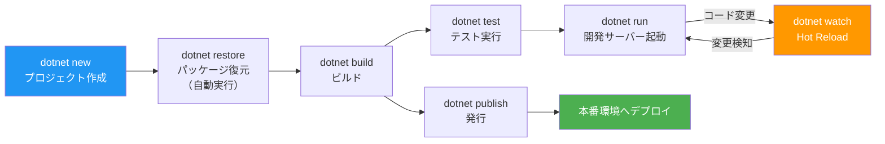

---

### 6.4 開発用 HTTPS 証明書の設定

ASP.NET Core は開発時に自己署名証明書を使用します。初回セットアップ時に次のコマンドを実行してください:

```bash
# 開発用 HTTPS 証明書をインストール・信頼
dotnet dev-certs https --trust
```

macOS / Linux ではパスワード入力を求められる場合があります。Windows ではダイアログが表示されます。

---

## まとめ

> 以下は **.NET 10 (LTS)** を使用する場合の手順です。他のバージョンを使用する場合は、バージョン番号を適宜読み替えてください。

```mermaid
flowchart TB
    Step1["① .NET 10 SDK をインストール\n各 OS のパッケージマネージャー\nまたは公式インストーラー"]
    Step2{"② IDE を選択"}
    Step3["③ dotnet --version で確認\n10.0.xxx が表示されれば OK"]

    VS["Visual Studio"]
    VSC["VS Code + C&#35; Dev Kit"]
    Rider["JetBrains Rider"]

    VS_Create["④ 新しいプロジェクトの作成\nから ASP.NET Core テンプレートを選択"]
    VSC_Create["④ dotnet new webapi で\nプロジェクトを作成"]
    Rider_Create["④ New Solution から\nASP.NET Core テンプレートを選択"]

    VS_Run["⑤ F5 または Ctrl+F5 で\nデバッグ実行"]
    VSC_Run["⑤ dotnet watch run で\n開発サーバーを起動"]
    Rider_Run["⑤ Run / Debug で\nデバッグ実行"]

    Step1 --> Step3 --> Step2
    Step2 --> VS --> VS_Create --> VS_Run
    Step2 --> VSC --> VSC_Create --> VSC_Run
    Step2 --> Rider --> Rider_Create --> Rider_Run

    style Step1 fill:#2196F3,color:#fff
    style VS fill:#68217A,color:#fff
    style VSC fill:#007ACC,color:#fff
    style Rider fill:#000000,color:#fff
    style VS_Run fill:#4CAF50,color:#fff
    style VSC_Run fill:#4CAF50,color:#fff
    style Rider_Run fill:#4CAF50,color:#fff
```

| チェック項目 | 確認コマンド |
|---|---|
| .NET SDK がインストールされている | `dotnet --version` |
| インストール済み SDK 一覧を確認 | `dotnet --list-sdks` |
| インストール済みランタイム一覧を確認 | `dotnet --list-runtimes` |
| HTTPS 証明書が設定済みか | `dotnet dev-certs https --check` |
| プロジェクト作成・実行できるか | `dotnet new webapi && dotnet run` |

---

## 参考リンク（MS 公式）

- [.NET ダウンロード](https://dotnet.microsoft.com/download)
- [.NET のリリースとサポート](https://learn.microsoft.com/ja-jp/dotnet/core/releases-and-support)
- [Windows への .NET インストール](https://learn.microsoft.com/ja-jp/dotnet/core/install/windows)
- [macOS への .NET インストール](https://learn.microsoft.com/ja-jp/dotnet/core/install/macos)
- [Linux への .NET インストール](https://learn.microsoft.com/ja-jp/dotnet/core/install/linux)
- [.NET CLI の概要](https://learn.microsoft.com/ja-jp/dotnet/core/tools/)
- [dotnet new コマンド](https://learn.microsoft.com/ja-jp/dotnet/core/tools/dotnet-new)
- [ASP.NET Core の開始](https://learn.microsoft.com/ja-jp/aspnet/core/getting-started/)

---

*次の章: [第2章：ソリューションとプロジェクト構成](./02-solutions-and-projects.md)*
