# 第2章：ソリューションとプロジェクト構成

## 1. `.sln` と `.csproj` の違いと役割（新形式 `.slnx` について）

### プロジェクト

**プロジェクト** はアプリケーションやクラスライブラリごとの **ビルド単位** です。プロジェクト単位でビルドをかけると、 **アセンブリ**（ `.dll` または `.exe` ファイル）が 1 つ生成されます。  
[アセンブリ](https://learn.microsoft.com/ja-jp/dotnet/standard/assembly/) は .NET における展開・バージョン管理・再利用の基本単位であり、型の実装情報を共通言語ランタイム (CLR) に提供するものです。実行可能なコンソールアプリは `.exe` 形式のアセンブリ、クラスライブラリは `.dll` 形式のアセンブリとして出力されます。

C# のプロジェクトは `.csproj` 拡張子のプロジェクトファイル（XML 形式）で構成されます。.NET では **MSBuild** というビルドエンジンが `.csproj` を読み込み、コンパイル・ビルドを行います。

> [!TIP]
> `.csproj` は、Java の Maven/Gradle における `pom.xml` や `build.gradle` に近い存在です。

`.csproj` には大きく分けて以下の 2 つの情報が定義されています。

**コンパイルセット** （何をコンパイルするか）

- ターゲットフレームワーク（ `<TargetFramework>` ）
- 出力アセンブリの種類（ `<OutputType>` : `Exe` / `Library` ）
- コンパイル対象のソースファイルやリソース（原則フォルダ内の `.cs` ファイルが自動で対象となります）

**依存関係** （何に依存するか）

- NuGet パッケージ参照（ `<PackageReference>` ）および他プロジェクトへの参照（ `<ProjectReference>` ）— **（後述： [3. プロジェクト参照とNuGetパッケージ参照の使い分け](#3-プロジェクト参照とnugetパッケージ参照の使い分け) ）**

#### Hello World の最小構成

最も小さいプロジェクト構成の例として、コンソールアプリの「Hello World」を見てみましょう。

**ディレクトリ構成**

```text
HelloWorld/
├── HelloWorld.csproj
└── Program.cs
```

**HelloWorld.csproj**

```xml
<Project Sdk="Microsoft.NET.Sdk">
  <PropertyGroup>
    <OutputType>Exe</OutputType>
    <TargetFramework>net10.0</TargetFramework>
  </PropertyGroup>
</Project>
```

**Program.cs**

```csharp
Console.WriteLine("Hello, World!");
```

`dotnet build` を実行すると、`bin/Debug/net10.0/` フォルダにビルド成果物が出力されます。

```text
HelloWorld/
├── HelloWorld.csproj
├── Program.cs
└── bin/
    └── Debug/
        └── net10.0/
            ├── HelloWorld.dll        ← アセンブリ本体（IL コードを含む）
            ├── HelloWorld.exe        ← 実行可能ファイル（Windows 向け）
            ├── HelloWorld.pdb        ← デバッグシンボル情報
            ├── HelloWorld.deps.json  ← 依存関係リスト
            └── HelloWorld.runtimeconfig.json  ← ランタイム設定
```

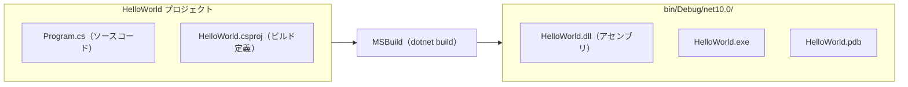

### ソリューション

一方、 **ソリューション（ `.sln` ファイル）** は複数のプロジェクトを **まとめて管理するための最上位コンテナ** です。  
ソリューションファイルはテキスト形式で、所属する各プロジェクトへのパス、プロジェクト固有の GUID、全体のビルド構成 (Debug/Release 等) やプラットフォーム (Any CPU/x64 等) といった情報を持ちます。  
簡単に言えば、 **ソリューションは関連する複数プロジェクトを束ねる「目次」** のような役割を果たし、Visual Studio や `dotnet` CLI で一括ビルド・管理するのに便利です。  

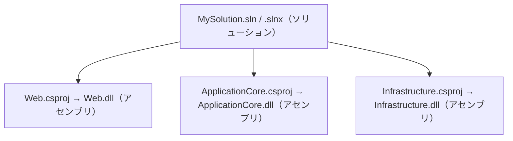

ソリューションに含まれるプロジェクトは **ソリューション エクスプローラー** 上で階層表示されます。  
また、ファイル参照とは別に仮想的なフォルダ階層で整理することもでき、これを「ソリューション フォルダ」と呼びます。ディスク上の実フォルダ構成には影響せず、あくまで表示上のグループとして扱われます。

<details>
<summary>Visual Studio</summary>

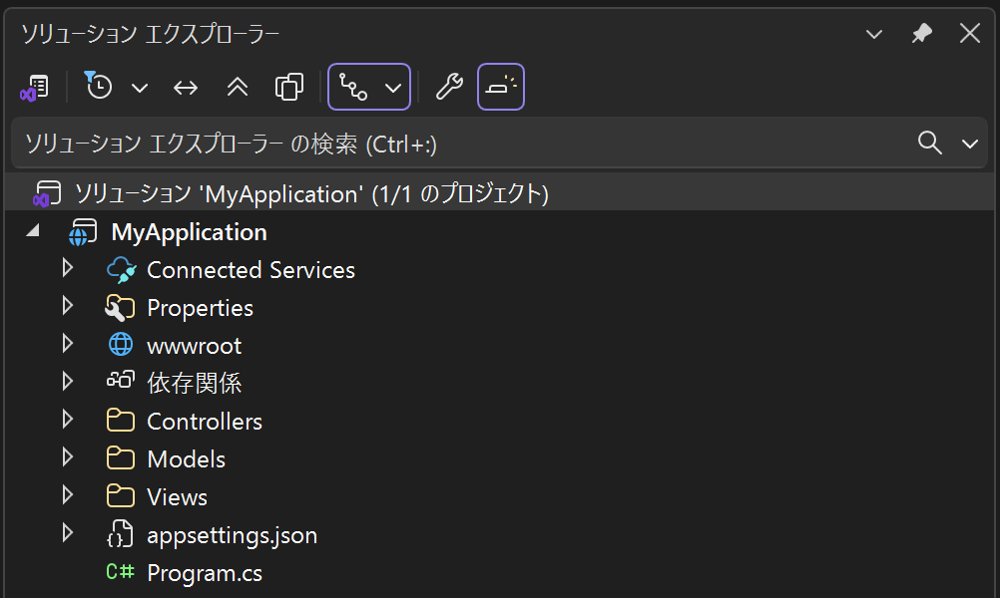

</details>

<details>
<summary>VS Code（C# Dev Kit）</summary>

VS Code の場合は [C# Dev Kit](https://marketplace.visualstudio.com/items?itemName=ms-dotnettools.csdevkit) 拡張機能をインストールすると、VS Code のサイドバーに **ソリューション エクスプローラー** パネルが追加され、Visual Studio と同様の階層表示でソリューション・プロジェクトを管理できます。

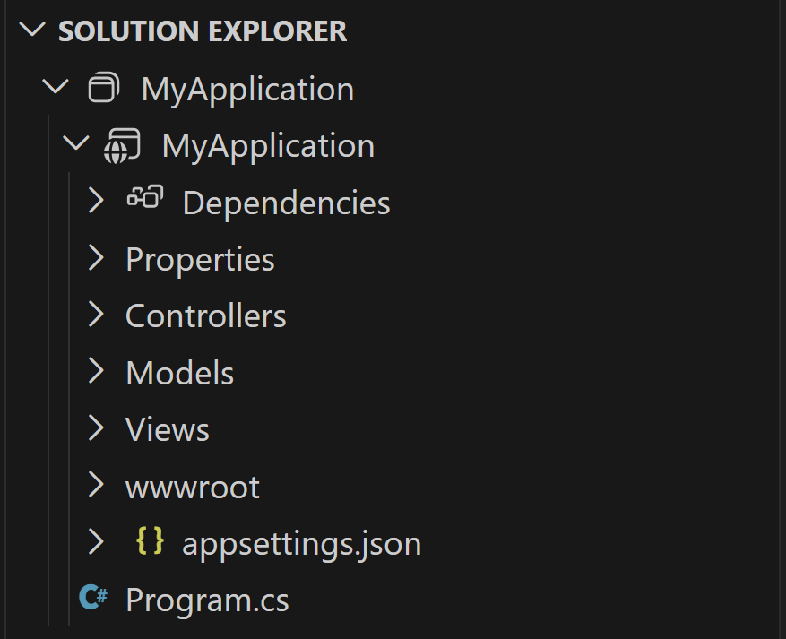

</details>

`.sln` はテキスト形式で記述されますが、 **手動で編集することを意図したものではありません** 。  
新しいプロジェクトをソリューションに追加する場合も、IDE の UI や `dotnet sln add` コマンドを用いて `.sln` ファイルを更新します。

#### 初期ディレクトリ構成例

`ASP.NET Core Webアプリ (Model-View-Controller)` テンプレートを使用してプロジェクトを新規作成すると、以下の構成が生成されます。  
**この構成は、第1章：開発環境セットアップの [6. 初回プロジェクト作成](./01-setup-dev-env.md#6-初回プロジェクト作成) 節で作成します。**

> [!NOTE]
> プロジェクトが 1 つだけの場合でも、ソリューションを作成してプロジェクトを紐づけておくことが .NET 開発の一般的な慣習です。IDE はソリューションファイルを起点に開くため、最初からソリューションを用意しておくことで、後からプロジェクトを追加する際もスムーズに対応できます。

```text
📁 MyWebApplication/
├── 📝 MyWebApplication.sln
└── 📁 MyWebApplication/
    ├── 📝 MyWebApplication.csproj
    ├── 📄 Program.cs
    ├── 📄 appsettings.json
    ├── 📄 appsettings.Development.json
    ├── 📁 Properties/
    │   └── 📄 launchSettings.json
    ├── 📁 Controllers/
    │   └── 📄 HomeController.cs
    ├── 📁 Models/
    │   └── 📄 ErrorViewModel.cs
    ├── 📁 Views/
    │   ├── 📁 Home/
    │   │   ├── 📄 Index.cshtml
    │   │   └── 📄 Privacy.cshtml
    │   ├── 📁 Shared/
    │   │   ├── 📄 Error.cshtml
    │   │   ├── 📄 _Layout.cshtml
    │   │   ├── 📄 _Layout.cshtml.css
    │   │   └── 📄 _ValidationScriptsPartial.cshtml
    │   ├── 📄 _ViewImports.cshtml
    │   └── 📄 _ViewStart.cshtml
    └── 📁 wwwroot/
        ├── 📁 css/
        │   └── 📄 site.css
        ├── 📁 js/
        │   └── 📄 site.js
        ├── 📁 lib/
        │   ├── 📁 bootstrap/
        │   ├── 📁 jquery/
        │   ├── 📁 jquery-validation/
        │   └── 📁 jquery-validation-unobtrusive/
        └── 📄 favicon.ico
```

各ファイル・フォルダの役割は以下の通りです。

| パス | 役割 |
| --- | --- |
| `MyWebApplication.sln` | ソリューションファイル。一元管理する対象のプロジェクト一覧を定義します。 |
| `MyWebApplication.csproj` | プロジェクトファイル。ターゲットフレームワークや依存関係を定義する。 |
| `Program.cs` | アプリケーションのエントリーポイント。DI コンテナへのサービス登録やミドルウェアパイプラインの構成を行う。 |
| `appsettings.json` / `appsettings.Development.json` | アプリケーション設定ファイル（接続文字列やログレベルなど）。環境名に対応したファイルが実行時にマージされる。 |
| `Properties/launchSettings.json` | ローカル実行時の起動プロファイル定義。使用する Web サーバー、ポート、環境変数などをプロファイルごとに設定する。 |
| `Controllers/` | MVC コントローラークラスを配置する。HTTP リクエストの受け取りとレスポンスの返却を担う。 |
| `Models/` | ビューモデルやデータモデルクラスを配置する。 |
| `Views/` | Razor ビュー（`.cshtml`）を配置する。コントローラーと対応したサブフォルダ構成になっている。 |
| `Views/Shared/` | レイアウト（`_Layout.cshtml`）やエラーページなど、複数のビューで共有するファイルを配置する。 |
| `Views/_ViewImports.cshtml` | 全ビューに共通の `@using` 指定や Tag Helpers の登録などを記述する。 |
| `Views/_ViewStart.cshtml` | 全ビューの先頭で自動実行される処理（既定レイアウトの指定など）を記述する。 |
| `wwwroot/` | 静的ファイル（CSS・JavaScript・画像など）を配置するルートフォルダ。このフォルダ内のファイルのみ HTTP で直接公開される。 |
| `wwwroot/lib/` | Bootstrap・jQuery など、クライアントサイドライブラリのファイルが配置される。 |

### 補足：他言語フレームワークとの比較例

> [!TIP]
> .NET の .sln/.csproj の構成は、他言語の Monorepo やマルチモジュール構成と類似しています。  
> 特に Maven や Gradle の親子構成は、.NET のソリューションとプロジェクトの関係に非常に近いです。

| フレームワーク | ソリューションに相当するもの | プロジェクトに相当するもの |
| --- | --- | --- |
| Spring Boot (Java) | Maven: 親 `pom.xml` / Gradle: `settings.gradle` | 各モジュールの `pom.xml` / `build.gradle`（ビルド成果物の `.jar` / `.war` が .NET のアセンブリに相当） |
| Express (Node.js) | Lerna / Nx などの Monorepo ルート設定 | 各パッケージの `package.json`（バンドル方法はツールチェーン（tsc / webpack / esbuild 等）の選択に依存）※ |
| Django (Python) | Django プロジェクトルート（`manage.py` があるディレクトリ） | 各 Django アプリ（`apps.py` を持つフォルダ単位）※ |
| Laravel (PHP) | Composer のルートプロジェクト（`composer.json`） | 各 Composer パッケージ（`composer.json`）※ |
| Ruby on Rails | Rails アプリ全体のディレクトリ（`Gemfile` がルート） | `lib/` 以下のモジュール ※ |

※インタープリター実行のものはコンパイル工程・アセンブリ生成の概念がなく、.NET プロジェクトとの対応はパッケージ管理など部分的な機能に留まる場合がありあくまで概念的な比較です。

#### 新形式 `.slnx` の登場

.NET 9 SDK（Visual Studio 2022 v17.14）以降では、従来の `.sln` に代わる **新しいソリューションファイル形式** として `.slnx` (XML ベース) がプレビュー導入されました。

従来の `.sln` 形式がどのようなものか、Web・ApplicationCore・Infrastructure の 3 プロジェクト構成を例に示します。

**SampleSolution.sln**

```
Microsoft Visual Studio Solution File, Format Version 12.00
# Visual Studio Version 17
VisualStudioVersion = 17.0.0.0
MinimumVisualStudioVersion = 10.0.40219.1
Project("{FAE04EC0-301F-11D3-BF4B-00C04F79EFBC}") = "Web", "src\Web\Web.csproj", "{A1B2C3D4-E5F6-7890-ABCD-EF1234567890}"
EndProject
Project("{FAE04EC0-301F-11D3-BF4B-00C04F79EFBC}") = "ApplicationCore", "src\ApplicationCore\ApplicationCore.csproj", "{B2C3D4E5-F6A7-8901-BCDE-F12345678901}"
EndProject
Project("{FAE04EC0-301F-11D3-BF4B-00C04F79EFBC}") = "Infrastructure", "src\Infrastructure\Infrastructure.csproj", "{C3D4E5F6-A7B8-9012-CDEF-123456789012}"
EndProject
Global
    GlobalSection(SolutionConfigurationPlatforms) = preSolution
        Debug|Any CPU = Debug|Any CPU
        Release|Any CPU = Release|Any CPU
    EndGlobalSection
    GlobalSection(ProjectConfigurationPlatforms) = postSolution
        {A1B2C3D4-E5F6-7890-ABCD-EF1234567890}.Debug|Any CPU.ActiveCfg = Debug|Any CPU
        {A1B2C3D4-E5F6-7890-ABCD-EF1234567890}.Debug|Any CPU.Build.0 = Debug|Any CPU
        {A1B2C3D4-E5F6-7890-ABCD-EF1234567890}.Release|Any CPU.ActiveCfg = Release|Any CPU
        {A1B2C3D4-E5F6-7890-ABCD-EF1234567890}.Release|Any CPU.Build.0 = Release|Any CPU
        {B2C3D4E5-F6A7-8901-BCDE-F12345678901}.Debug|Any CPU.ActiveCfg = Debug|Any CPU
        {B2C3D4E5-F6A7-8901-BCDE-F12345678901}.Debug|Any CPU.Build.0 = Debug|Any CPU
        {B2C3D4E5-F6A7-8901-BCDE-F12345678901}.Release|Any CPU.ActiveCfg = Release|Any CPU
        {B2C3D4E5-F6A7-8901-BCDE-F12345678901}.Release|Any CPU.Build.0 = Release|Any CPU
        {C3D4E5F6-A7B8-9012-CDEF-123456789012}.Debug|Any CPU.ActiveCfg = Debug|Any CPU
        {C3D4E5F6-A7B8-9012-CDEF-123456789012}.Debug|Any CPU.Build.0 = Debug|Any CPU
        {C3D4E5F6-A7B8-9012-CDEF-123456789012}.Release|Any CPU.ActiveCfg = Release|Any CPU
        {C3D4E5F6-A7B8-9012-CDEF-123456789012}.Release|Any CPU.Build.0 = Release|Any CPU
    EndGlobalSection
    GlobalSection(SolutionProperties) = preSolution
        HideSolutionNode = FALSE
    EndGlobalSection
EndGlobal
```

独自のテキスト形式であり、各プロジェクトの **GUID** 、ビルド構成（Debug/Release）× プラットフォーム（Any CPU）の **組み合わせごとの設定行** が列挙されています。プロジェクトが増えるたびにこれらが増加するため、Git でのマージ競合が頻発しやすく、手動での編集も困難です。

これに対し、`.slnx` では **XML 標準** を採用し、同じ 3 プロジェクト構成をわずか 5 行で表現できます。

**SampleSolution.slnx**

```xml
<Solution>
  <Project Path="src\Web\Web.csproj" />
  <Project Path="src\ApplicationCore\ApplicationCore.csproj" />
  <Project Path="src\Infrastructure\Infrastructure.csproj" />
</Solution>
```

GUID や冗長なビルド構成の記述が不要になり、 **ソリューションファイルのサイズや内容が大幅に簡素化** されています。手動で編集・マージする場合も内容が一目瞭然で、誤編集のリスクが大幅に低減されます。  
現在 .NET CLI を使用して新規ソリューション作成 `dotnet new sln` を行った際には既定で `.slnx` が使用されるようになっており、 `dotnet sln <YourSolutionFile.sln> migrate` のように既存ソリューションの移行コマンドも用意されているため、 `.slnx` は今後の標準フォーマットになる見込みです。

## 2. プロジェクト参照とNuGetパッケージ参照の使い分け

複数プロジェクトを扱う際には、あるプロジェクトから別のプロジェクトの機能を利用するために **参照の追加** が必要です。  
ASP.NET Core では、主に **パッケージ参照** と **プロジェクト参照** の 2 種類の参照方法が使われています。

> [!TIP]
> NuGet は .NET 標準のパッケージ管理システムであり、Java における Maven/Gradle 、JavaScript における npm 、PHP における Composer に近いものです。

以下に、 `.csproj` ファイルで **パッケージ参照** と **プロジェクト参照** を記述する例を示します。

```xml
<Project Sdk="Microsoft.NET.Sdk">
  <PropertyGroup>
    <TargetFramework>net10.0</TargetFramework>
  </PropertyGroup>
  <ItemGroup>
    <!-- パッケージ参照 -->
    <PackageReference Include="Microsoft.Extensions.Azure" Version="1.13.1" />
  </ItemGroup>
  <ItemGroup>
    <!-- プロジェクト参照 -->
    <ProjectReference Include="..\ApplicationCore\ApplicationCore.csproj" />
    <ProjectReference Include="..\Infrastructure\Infrastructure.csproj" />
  </ItemGroup>
</Project>
```

上記の例では、Azure SDK の拡張機能を提供する `Microsoft.Extensions.Azure` （NuGet パッケージ）をバージョン指定で参照し、さらにローカルの `ApplicationCore` と `Infrastructure` プロジェクト（別フォルダにある `.csproj` ）を直接参照しています。  

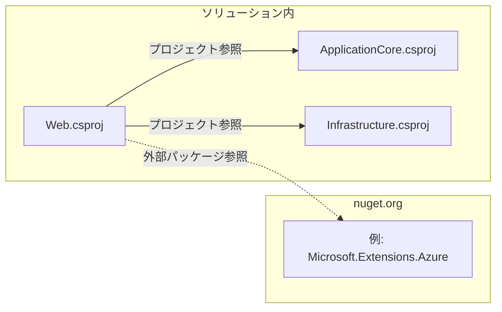

### プロジェクト参照（ProjectReference）

同じソリューション内の **別プロジェクトを直接参照** する方法です。  
参照元プロジェクトの `.csproj` に `<ProjectReference>` 要素を追加することで、ビルド時には参照先プロジェクトも自動的にビルドされます。IDE からは UI 操作で追加でき、あるいは `dotnet add reference` コマンドで追加することもできます。

<details>
<summary>Visual Studio</summary>

ソリューション エクスプローラーで追加先のプロジェクトを右クリックし、「追加」→「プロジェクト参照」を選択します。

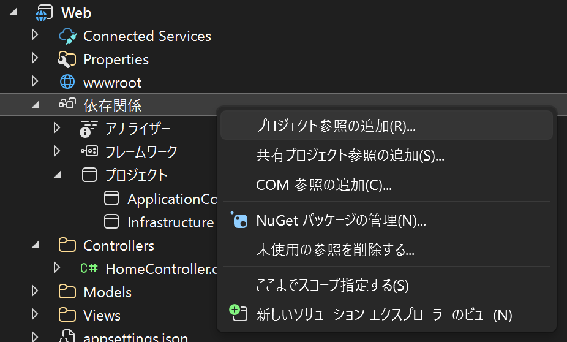

参照マネージャーが開き、ソリューション内のプロジェクト一覧から追加したいプロジェクトにチェックを入れて追加します。

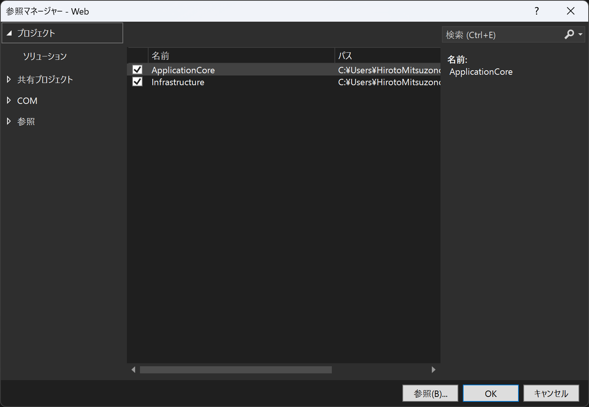

</details>

<details>
<summary>VS Code（C# Dev Kit）</summary>

ソリューション エクスプローラーで追加先のプロジェクトを右クリックし、「Add Project Reference」を選択すると、ソリューション内のプロジェクト一覧から選択できます。

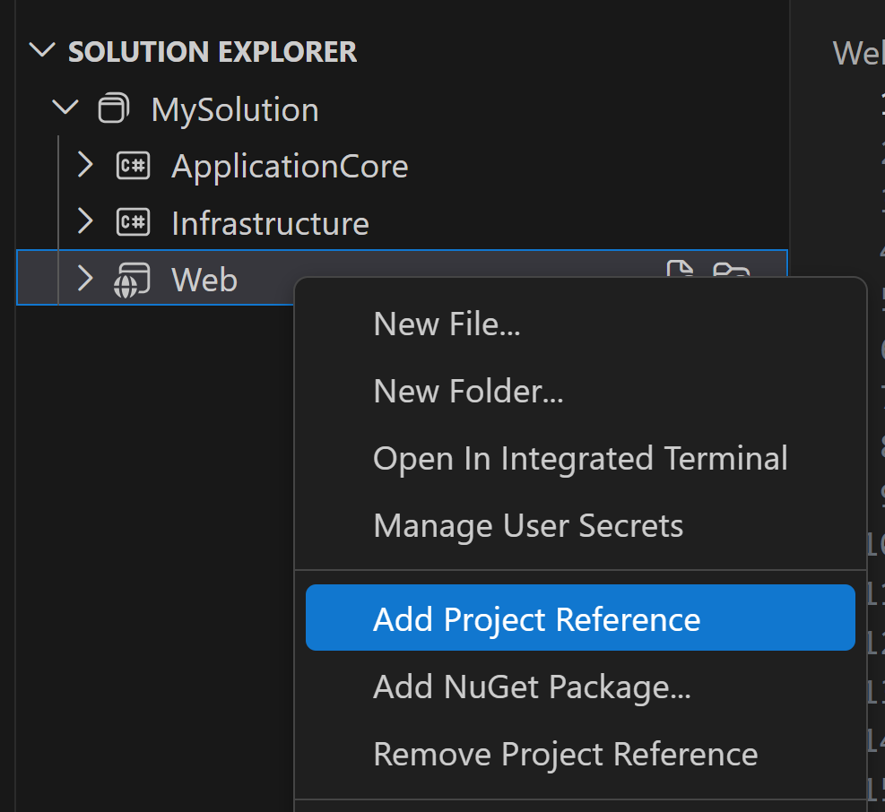

</details>

<details>
<summary>CLI</summary>

ターミナルで以下のコマンドを実行します。

```bash
dotnet add src/Web/Web.csproj reference src/ApplicationCore/ApplicationCore.csproj
```

</details>

これにより以下の 2 つの仕組みが働き、開発中は常に最新のコードで他プロジェクトの機能を呼び出すことができます。

- **ビルドの順序管理**：MSBuild が `<ProjectReference>` を解析して依存グラフを構築し、参照先プロジェクトを参照元より先にビルドする順序を自動決定します。たとえば `Web` が `ApplicationCore` を参照していれば、`ApplicationCore` → `Web` の順でコンパイルが行われます。開発者がビルド順を手動で指定する必要はありません。
- **再ビルドの自動判別**：MSBuild はソースファイルのタイムスタンプとビルド成果物を比較し、変更があったプロジェクトのみを再コンパイルします（インクリメンタルビルド）。変更のないプロジェクトはスキップされるため、ソリューション全体を毎回フルビルドするよりもビルド時間を大幅に短縮できます。

ソース間のナビゲーション（定義元へジャンプする操作など）もシームレスに行えるため、 **単一ソリューション内で同時開発する場合に最適** です。  

### パッケージ参照（PackageReference）

**NuGetパッケージ** として発行・提供されているコンポーネントを参照する方法です。  
`.csproj` 内では `<PackageReference>` 要素を追加し、 `Include` 属性にパッケージ名、 `Version` 属性にバージョン番号を指定します。

パッケージ参照を追加すると、ビルド時に **NuGetパッケージマネージャー** が依存関係を解決して該当パッケージとその依存パッケージを自動的に復元します。  
NuGet Gallery（例: <https://www.nuget.org/>）やプライベートの NuGet フィードから取得でき、各ツールごとに下記操作で追加できます。

<details>
<summary>Visual Studio</summary>

ソリューション エクスプローラーでプロジェクトを右クリックし、「NuGet パッケージの管理」を選択します。  
パッケージ マネージャーが開き、パッケージ名で検索して追加できます。

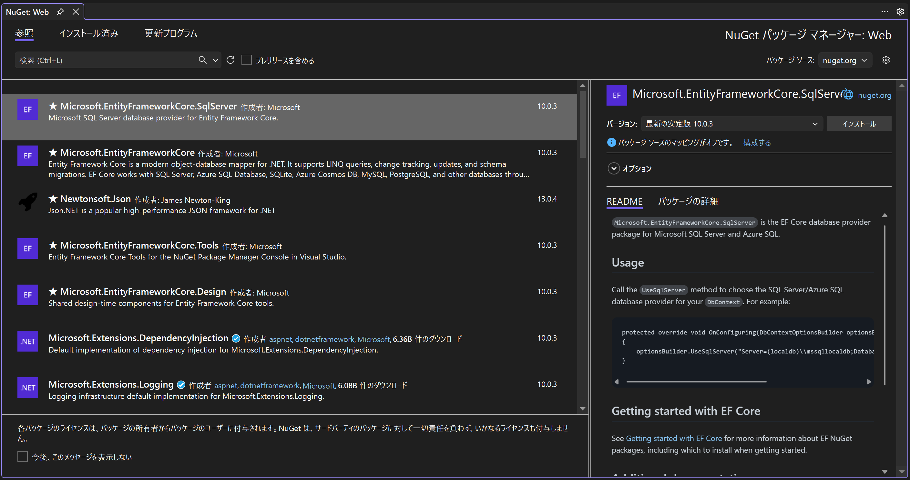

</details>

<details>
<summary>VS Code（C# Dev Kit）</summary>

ソリューション エクスプローラーでプロジェクトを右クリックし「Add NuGet Package...」を選択すると、コマンドパレット上でパッケージ名を検索して追加できます。

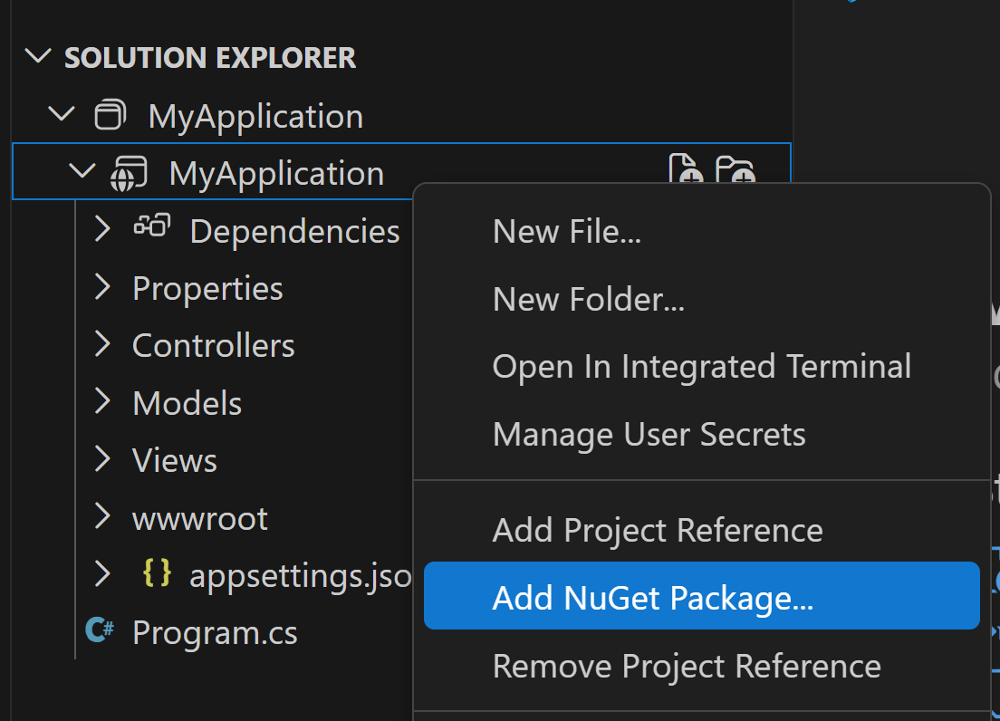

</details>

<details>
<summary>CLI</summary>

以下のコマンドを実行します。

```bash
dotnet add package Microsoft.Extensions.Azure
```

</details>

なお、古い形式の **アセンブリ参照（Reference）** は、特定の DLL ファイルへのパスを直接指定する方法ですが、依存解決やバージョン管理を手動で行う必要があるため、NuGet 経由で入手不能な社内ライブラリを一時的に追加する場合など特殊なケースを除き推奨されません。

## 3. 複数プロジェクト構造のパターン（Web・ドメイン/モデル・インフラ・共通ライブラリ など）

ASP.NET Core のプロジェクトテンプレートも基本的に 1 つのプロジェクトの中でモデル・ビュー・コントローラーやデータアクセス用のフォルダを分けておく形で始まります。  
しかしアプリの規模が大きくなると、単一プロジェクト構成では関心の分離が曖昧になることでスパゲッティコードに陥りやすいという問題があります。

この課題に対処するため、.NET 開発では **複数プロジェクトによるレイヤードアーキテクチャ** がよく採用されます。  
近年では **クリーンアーキテクチャ** や **ドメイン駆動設計 (DDD)** に基づき、 **ドメインモデルを中心に据えて依存関係を逆転させる** 設計も用いられることが増えました。  
例えば、以下のような複数プロジェクト構成が挙げられます。

```text
📁 /  
├── 📝 MySolution.sln（MySolution.slnx）  
├── 📁 src/  
│   ├── 📁 Web/  
│   │   ├── 📝 Web.csproj（ApplicationCore.csproj と Infrastructure.csproj を参照）  
│   │   ├── 📁 Controllers/  
│   │   ├── 📁 Models/  
│   │   ├── 📁 Views/  
│   │   ├── 📁 wwwroot/  
│   │   ├── 📁 Properties/  
│   │   │   └── 📄 launchSettings.json  
│   │   └── 📄 Program.cs  
│   ├── 📁 ApplicationCore/  
│   │   ├── 📝 ApplicationCore.csproj  
│   │   ├── 📁 Interfaces/  
│   │   └── 📁 Services/  
│   └── 📁 Infrastructure/  
│       ├── 📝 Infrastructure.csproj  
│       ├── 📁 Data/  
│       └── 📁 Services/  
└── 📁 tests/  
    ├── 📁 Web.Tests/  
    │   ├── 📝 Web.Tests.csproj（Web.csproj を参照）  
    │   └── 📁 ...  
    ├── 📁 ApplicationCore.Tests/  
    │   ├── 📝 ApplicationCore.Tests.csproj（ApplicationCore.csproj を参照）  
    │   └── 📁 ...  
    └── 📁 Infrastructure.Tests/  
        ├── 📝 Infrastructure.Tests.csproj（Infrastructure.csproj を参照）  
        └── 📁 ...
```

- **Web プロジェクト** – プレゼンテーションとアプリケーションのエントリーポイント。ASP.NET Core MVC や API のコントローラー、UI 用のページなどを含み、ApplicationCore や Infrastructure からビジネス機能を呼び出す。プロジェクト形式は ASP.NET Core Web アプリとして構成。
- **ApplicationCore プロジェクト** – ビジネス上の主体となるドメインモデル、ビジネスルール、インターフェイスなどを定義。UI やインフラに依存しない純粋ロジック。プロジェクト形式はクラスライブラリとして構成。
- **Infrastructure プロジェクト** – ApplicationCore で定義したリポジトリやサービスインターフェイスの実装クラス、データベースアクセス（例: EF Core の `DbContext` ）、ファイルシステムや外部サービスとの連携コードなどを含む。プロジェクト形式はクラスライブラリとして構成。
- **各プロジェクトに対するテストプロジェクト** – ユニットテストや統合テスト用。テスト対象プロジェクト（ApplicationCore や Web など）をプロジェクト参照し、NUnit や xUnit などのテストフレームワークの NuGet パッケージを含む。プロジェクト形式はテストプロジェクトとして構成。

上記例以外にも、 **Shared** といったような共通のヘルパー関数や定数定義、複数のアプリケーションプロジェクトから使われるユーティリティコードをまとめる用途のプロジェクトを追加することも検討できます。  
もし共通ライブラリ化したい用途であれば、NuGet パッケージ化して他のサービスから再利用することもできます（例: 社内共通フレームワークを社内 NuGet フィードでプライベート配布し、各プロジェクトから参照する）。  

ソリューション内のプロジェクトを **プロジェクト参照** で結合することで、ビルドや実行時には一体となって動作します。  
プロジェクト参照は **一方向** であり、例えば A → B の依存を定義した場合、B から A を参照することはできません（循環参照はビルドエラーになります）。  
ビルド時には参照先プロジェクトのアセンブリ（DLL）が **参照元プロジェクトの出力フォルダにコピー** され、参照元のアプリは自身の出力フォルダ内に揃ったアセンブリ群を用いて動作します。  
たとえば上記の例では、エンドユーザーは `Web` という Web アプリケーションを 1 つ起動するだけでよく、その内部で `ApplicationCore` や `Infrastructure` の機能が利用されます。  
ただし物理的にはアセンブリ（DLL）が分かれているため、レイヤー間の依存方向を明確に制御できる利点があります。  

このように、アプリの規模・目的に応じてプロジェクトの切り分け方は柔軟に決められます。  
小規模なうちは 1 プロジェクトで始めておき、必要に応じてクラスライブラリプロジェクトを追加していくことも可能です。

## 4. ビルド／実行フロー

**アプリケーションの実行** は、.NET CLI であれば `dotnet run` コマンドで行います。この時、後述のビルドも同時に実行されます。  
プロジェクトの種類によって起動方法は異なり、コンソールアプリや Azure Functions の場合は、生成された.exe（もしくは.dll）を実行するだけです。  
対して ASP.NET Core Web アプリケーションや API といった Web アプリケーション形式の場合、実行すると組み込みの **Kestrel Web サーバー** が起動し、所定の URL（ポート）でリッスンを開始します。  
IDE でスタートアッププロジェクトとして選択した Web プロジェクトをデバッグ実行すると、自動的にローカル開発用 URL（例: `https://localhost:7001`）が開かれ、ブレークポイントの設定されたコード上で停止・変数ウォッチなどができます。

**`dotnet run` の簡易フロー図**

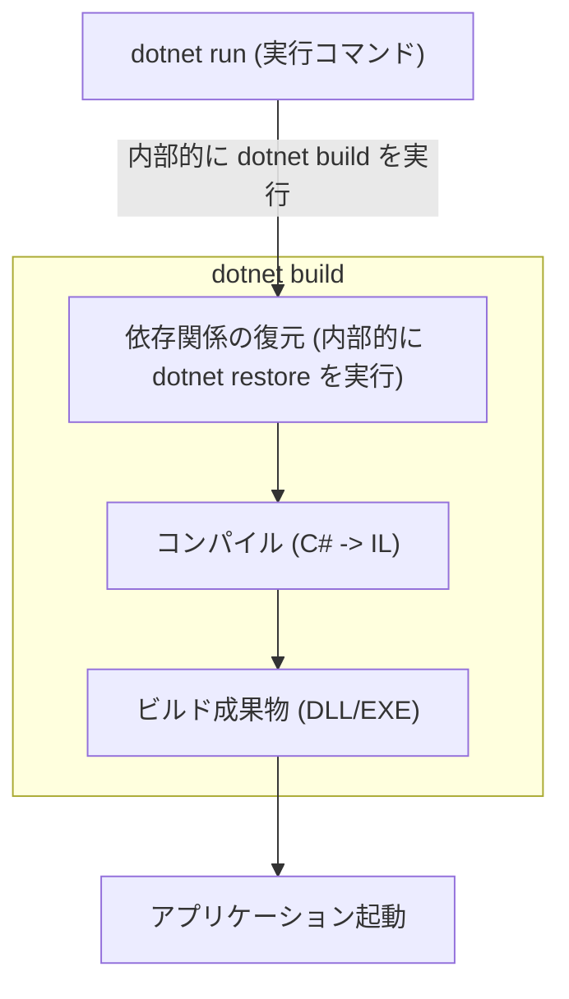

**プロジェクトのビルド** は、Visual Studio では「ビルド」メニュー、VS Code ではコマンドパレットから `Tasks: Run Build Task` 、.NET CLI では `dotnet build` コマンドで行います。  
`dotnet build` は、プロジェクトやソリューション全体、または単一ソースファイルから、プログラムやライブラリをビルド（コンパイル）して **中間言語(IL)のバイナリ** を生成します。  
成果物には、C#プロジェクトの場合 **.dll**（ライブラリ）または **.exe**（実行可能ファイル）が含まれ、デバッグ用の **.pdbファイル** 、依存関係リストの **.deps.json** 、ランタイム設定の **.runtimeconfig.json** といった付随ファイルも出力されます。

ビルドを実行すると、まず **NuGetパッケージの復元 (restore)** が自動的に行われます。  
これはプロジェクト内の PackageReference で指定した依存パッケージを開発マシン上の NuGet グローバルパッケージフォルダ（通常 `%UserProfile%\.nuget\packages`）から参照し、存在しない場合はオンラインの NuGet フィードからダウンロードする処理です。  
.NET Core 2.0 以降、 `dotnet build` や `dotnet run` 実行時にはデフォルトで `dotnet restore` が内部実行されるため、通常は開発者が明示的に復元コマンドを実行する必要はありません。  
なおオフライン環境やビルドの都合で自動復元を抑止したい場合は、 `dotnet build --no-restore` オプションで無効化できます。

**ソリューションをビルドする場合** 、各プロジェクトの **依存関係に応じたビルド順序** を MSBuild が自動で判断します。  
たとえばプロジェクト B がプロジェクト A に ProjectReference していれば、 `dotnet build` 時には A→B の順でコンパイルが行われます。  
このため、開発者はビルド順を意識せずにソリューション全体をビルドできます。  
既定ではソリューション構成として **Debug** と **Release** の 2 つが定義されており（任意で追加可）、Debug 構成ではデバッグシンボルの埋め込みや最適化無効化によってデバッグしやすいバイナリが出力され、Release 構成では最適化された実行用バイナリが出力されます。  
Debug/Release の切り替えは Visual Studio 上部のドロップダウン、VS Code のビルドタスク設定、CLI の場合は `dotnet build -c Release` といった形で指定します。

## 5. デバッグ設定・起動構成の管理

### 起動設定 (Launch Profiles)

ASP.NET Core アプリでは、 `launchSettings.json` という開発用構成ファイルが `Properties` フォルダ内に生成されます。  
この `launchSettings.json` は **ローカル実行時のオプション設定（使用する Web サーバー、デバッグ有無、環境変数、URL など）を複数定義** でき、 **起動プロファイル** と呼びます。

> [!TIP]
> `launchSettings.json` は Java の Maven/Gradle における `application.properties` や `application.yml` 、Python の Django における `settings.py` に近い存在です。

例えば、Visual Studio の既定テンプレート（HTTPS 構成を有効化した場合の例）では `IIS Express` 用と `https` 用のプロファイルが含まれます。  
`IIS Express` プロファイルは Windows 上の開発用 Web サーバー (IIS Express) でアプリを起動します。  
一方、`https` プロファイルでは Kestrel という組み込み Web サーバーでアプリを起動し、 `applicationUrl` に指定したポートでリッスンします。（今後は、クロスプラットフォーム環境で一貫した動作を得られる Kestrel サーバーの使用が推奨されています。VS Code や `dotnet run` を使う場合は Kestrel ( `commandName: "Project"` のプロファイル)を選択します。）

以下は `launchSettings.json` の例です。

```json
{
  "$schema": "http://json.schemastore.org/launchsettings.json",
  "iisSettings": {
    "windowsAuthentication": false,
    "anonymousAuthentication": true,
    "iisExpress": {
      "applicationUrl": "http://localhost:55128",
      "sslPort": 44353
    }
  },
  "profiles": {
    "http": {
      "commandName": "Project",
      "dotnetRunMessages": true,
      "launchBrowser": true,
      "applicationUrl": "http://localhost:5001",
      "environmentVariables": {
        "ASPNETCORE_ENVIRONMENT": "Development"
      }
    },
    "https": {
      "commandName": "Project",
      "dotnetRunMessages": true,
      "launchBrowser": true,
      "applicationUrl": "https://localhost:7001;http://localhost:5001",
      "environmentVariables": {
        "ASPNETCORE_ENVIRONMENT": "Development"
      }
    },
    "IIS Express": {
      "commandName": "IISExpress",
      "launchBrowser": true,
      "environmentVariables": {
        "ASPNETCORE_ENVIRONMENT": "Development"
      }
    }
  }
}
```

また、 `environmentVariables` セクションに環境変数を定義することで、起動プロファイルごとに環境変数値が切り替わる形で実行環境を切り替えられます。  
環境名はコード中で `IWebHostEnvironment.EnvironmentName` プロパティや `IsDevelopment()` / `IsStaging()` / `IsProduction()` といった拡張メソッドを通じて参照でき、実行環境に応じた設定の読み分けや処理の切り替えを実現します。  
ASP.NET Core では **`ASPNETCORE_ENVIRONMENT`** 環境変数がこの切り替えに使用され、 `Development` ・ `Staging` ・ `Production` の 3 値を用いるのが標準的なやり方です。たとえば `Development` に設定するとアプリは **開発モード** で起動し、開発者向けの詳細エラーメッセージやホットリロード等が有効になります。`Production` では逆にこれらが無効となり、パフォーマンス最適化が優先されます。

### IDE での起動構成

複数のプロファイルが定義されている場合、IDE の UI からプロファイルを選択して実行できます。また、**スタートアッププロジェクト** を変更することで、ソリューション内のどのプロジェクトを実行するかも指定できます。

この機能により、マイクロサービス間の連携やフロントエンド＋バックエンドを一括デバッグするといったケースで、 **複数のアプリケーションを並行起動してデバッグ** できます。

<details>
<summary>Visual Studio</summary>

ツールバーの実行ボタン横のドロップダウンから使用するプロファイルを選択できます。  
例えば先ほどの `launchSettings.json` 例を用いてデバッグを行う場合、 `IIS Express` プロファイルを選べば IIS Express で起動し、 `https` プロファイルを選べば Kestrel で起動します。

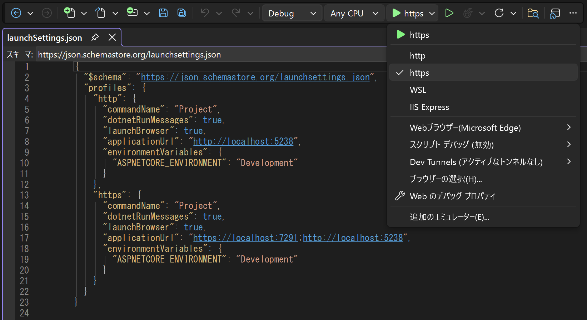

**スタートアッププロジェクト** は、ソリューション エクスプローラーでプロジェクトを右クリックし「スタートアッププロジェクトに設定」を選ぶことで切り替えられます。（既定では最初に作成したプロジェクトが設定されています。）

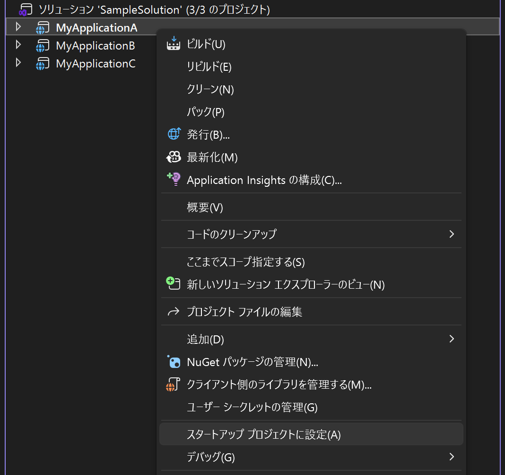

**複数のスタートアッププロジェクト** を同時に実行することも可能で、ソリューションプロパティから「複数のスタートアップ プロジェクト」を選択し、複数のプロジェクトを同時に開始する設定が行えます。

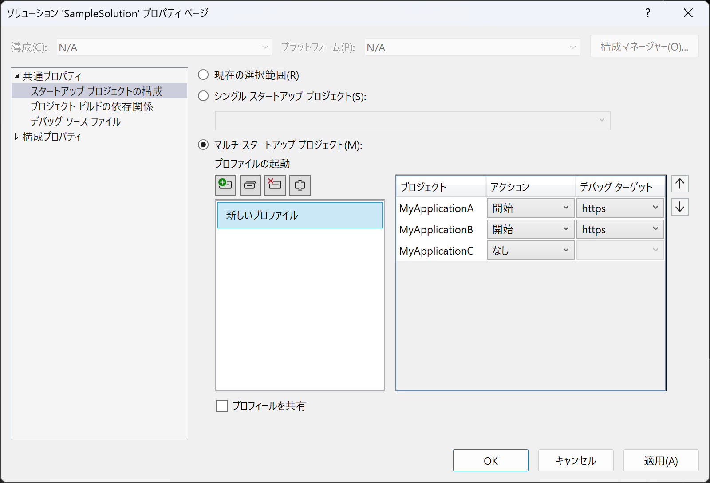

Visual Studio 2022 では **マルチプロジェクトの起動プロファイル** を作成・共有する機能も導入され、複雑な構成のソリューションでも簡単に複数プロジェクトの同時デバッグ環境を再現できます。

</details>

<details>
<summary>VS Code（C# Dev Kit）</summary>

「実行とデバッグ」パネル（`Ctrl+Shift+D`）の「Run and Debug」ボタンまたは上部のドロップダウンから「C#...」を選択することで、`launchSettings.json` に定義された起動プロファイルを選択して実行できます。

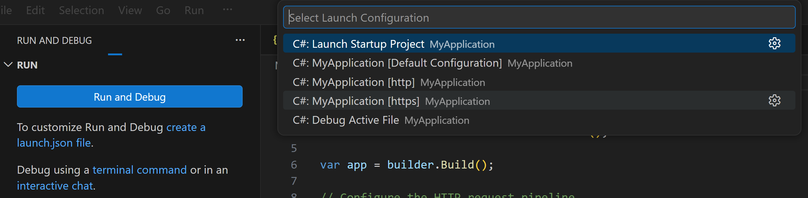

または、VS Code 用の `.vscode/launch.json` を作成することで、定義されたプロファイルをドロップダウンから直接選択できるようになります。

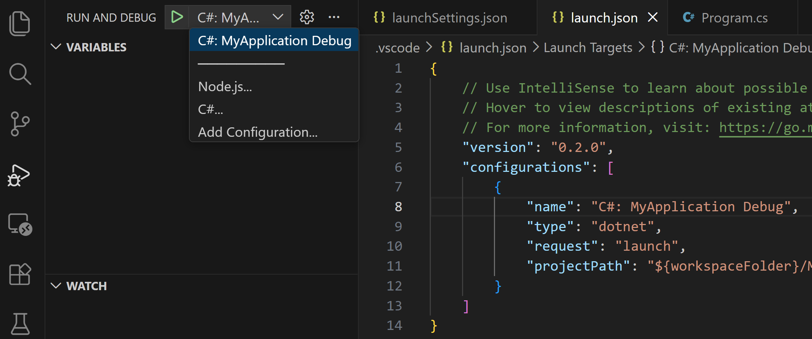

**スタートアッププロジェクト** は、ソリューション エクスプローラーでプロジェクトを右クリックし、「Set as Startup Project」を選択することで切り替えられます。

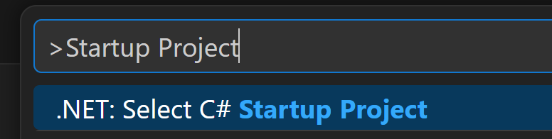

**複数プロジェクトの同時起動** は、`.vscode/launch.json` に `compounds` 設定を追加することで実現できます。

```json
{
  "version": "0.2.0",
  "configurations": [
    {
      "name": "Web",
      "type": "dotnet",
      "request": "launch",
      "projectPath": "${workspaceFolder}/src/Web/Web.csproj"
    },
    {
      "name": "API",
      "type": "dotnet",
      "request": "launch",
      "projectPath": "${workspaceFolder}/src/Api/Api.csproj"
    }
  ],
  "compounds": [
    {
      "name": "Web + API",
      "configurations": ["Web", "API"]
    }
  ]
}
```

`compounds` に追加した構成名（ここでは `"Web + API"`）が「実行とデバッグ」パネルのドロップダウンに表示され、選択するだけで複数のプロジェクトを同時にデバッグ起動できます。

</details>

## 参考ドキュメント

- [Visual Studio ソリューションとプロジェクトとは - Visual Studio (Windows) | Microsoft Learn](https://learn.microsoft.com/ja-jp/visualstudio/ide/solutions-and-projects-in-visual-studio?view=visualstudio)
- [dotnet build コマンド - .NET CLI | Microsoft Learn](https://learn.microsoft.com/ja-jp/dotnet/core/tools/dotnet-build)
- [New, Simpler Solution File Format - Visual Studio Blog](https://devblogs.microsoft.com/visualstudio/new-simpler-solution-file-format/)
- [一般的な Web アプリケーションアーキテクチャ - .NET | Microsoft Learn](https://learn.microsoft.com/ja-jp/dotnet/architecture/modern-web-apps-azure/common-web-application-architectures)
- [ASP.NET Core ランタイム環境 | Microsoft Learn](https://learn.microsoft.com/ja-jp/aspnet/core/fundamentals/environments?view=aspnetcore-10.0)
- [複数のスタートアップ プロジェクトを設定する - Visual Studio (Windows) | Microsoft Learn](https://learn.microsoft.com/ja-jp/visualstudio/ide/how-to-set-multiple-startup-projects?view=visualstudio)
- [C# Dev Kit - Visual Studio Marketplace](https://marketplace.visualstudio.com/items?itemName=ms-dotnettools.csdevkit)
- [VS Code での .NET 開発 | Visual Studio Code ドキュメント](https://code.visualstudio.com/docs/languages/dotnet)
- [VS Code でのデバッグ | Visual Studio Code ドキュメント](https://code.visualstudio.com/docs/editor/debugging)
