# 第3章：MVC モデルによる Web アプリケーション / API 解説

この章では **MVC スタイルのコントローラー** で Web アプリケーション および API を実装する方法を説明します。  
※昨今は **Minimal API** と呼ばれるコントローラーを使わない手法もあり、 [次章](./04-minimal-api.md) で紹介します。

## 1. MVC (Model-View-Controller) 構成の基本

**MVC パターン** はアプリケーションを **モデル (Model)** ・ **ビュー (View)** ・ **コントローラー (Controller)** の 3 つの要素に分けるアーキテクチャスタイルです。  
これは **関心の分離 (Separation of Concerns)** を促し、各要素が単一の役割へ専念できるようにします。  
MVC 各要素の責務を明確に分離することで、アプリケーションの構造が理解しやすくなり、テストや保守も容易になります。

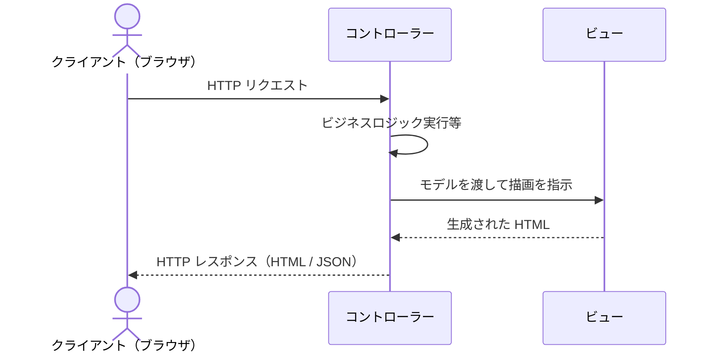

Visual Studio のテンプレートや CLI から ASP.NET Core MVC プロジェクトを作成すると、Controllers・Models・Views フォルダーがそれぞれ作成されることが確認できます。  
**※この構成は、第1章：開発環境セットアップの [6. 初回プロジェクト作成](01-setup-dev-env#6.%20初回プロジェクト作成) 節で作成します。**

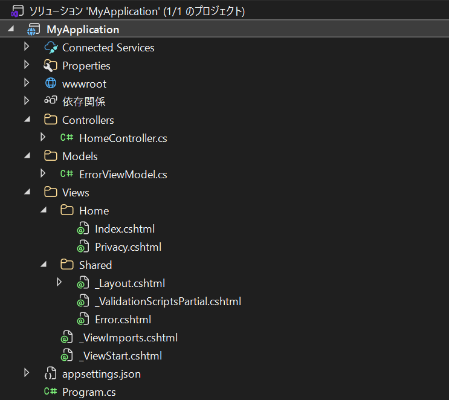

ASP.NET Core における MVC は `Microsoft.AspNetCore.Mvc` 名前空間のアセンブリとして提供されており、 `Program.cs` でサービスを登録することで利用できます。  
ビューを含む Web アプリケーションでは `AddControllersWithViews()` 、JSON を返す Web API のみの構成では `AddControllers()` を呼び出して MVC 機能を有効化します。  
あわせて、コントローラーを使用するには `app.MapControllers()`（API の場合）または `app.MapControllerRoute(...)` （MVC の場合）を呼び出す必要があります。

**Web API のみ構成の Program.cs 例**

```csharp
var builder = WebApplication.CreateBuilder(args);
builder.Services.AddControllers();          // ビュー機能なし・API 向け

var app = builder.Build();
app.MapControllers();                       // 属性ルーティング（後述）を有効化
app.Run();
```

**MVC（ビューあり）構成の Program.cs 例**

```csharp
var builder = WebApplication.CreateBuilder(args);
builder.Services.AddControllersWithViews(); // ビュー機能を含む MVC 向け

var app = builder.Build();
app.MapControllerRoute(                     // 規約ベースルーティング（後述）を登録
    name: "default",
    pattern: "{controller=Home}/{action=Index}/{id?}");
app.Run();
```

上記設定で有効化されるコントローラーに関して、ASP.NET Core MVC は **設定より規約 (Convention over Configuration)** の考え方に基づいているため、次のような規約に従って（下記いずれかの方法で）コントローラーが認識されます。

- クラス名の末尾が「 `Controller` 」で終わるようにします（例: `HomeController` 、 `ProductsController` など）。
- 明示的に `[Controller]` 属性を付与することでコントローラーとして扱うこともできます。
- `ControllerBase` や `Controller` クラス（後述）を継承している場合も、自動的にコントローラーとみなされます。

※ルーティングに関しては同章「3. ルーティング（属性ルーティング / 規約ベースルーティング）」節で解説します。

### モデル (Model)

ASP.NET Core のモデルには特定の基底クラスはなく、通常の C# クラスとして定義します。  
入力検証は後述のデータ注釈（DataAnnotations）属性によりモデルに付加する形が標準的です。

> [!TIP]
> Ruby on Rails の Active Record や Laravel の Eloquent のように、モデルにデータアクセスロジックを直接含める MVC の実装パターンも存在しますが、ASP.NET Core ではこの役割は通常 Entity Framework Core などの ORM が担い、モデルクラス自体はデフォルトではデータ構造の定義に留まります。  
> ASP.NET Core はデータストアへのアクセスをデフォルトではコントローラーで行いますが、コントローラーが膨らむことを避ける用途で別途リポジトリやサービスクラスに分離する設計が用いられることもあります。  
> モデルにビジネスロジックやデータストアへの保存といった責務を持たせるかどうかは、採用するアーキテクチャによります。

```csharp
// エンティティクラス（データ構造を表すモデル）
public class Product
{
    public int Id { get; set; }
    public string Name { get; set; } = string.Empty;
    public decimal Price { get; set; }
}
```

### ビュー (View)

ASP.NET Core MVC は既定では **Razor ビューエンジン** を用いて、HTML マークアップ内に C# などの .NET コードを埋め込む形でビューを記述します。  
ビューには表示のための最小限のロジック（ループや条件分岐程度）は含めますが、ビジネスロジックは含めません。

> [!TIP]
> Razor ビューは Java の Thymeleaf/JSP や Ruby on Rails の ERB、Laravel の Blade テンプレートに相当します。

> [!NOTE]
> 一般的には、ビューに表示するデータを含めるよう設計された **ViewModel** を用意し、コントローラー側でビューに必要なデータだけを持つ ViewModel インスタンスをモデルから作成する実装を行います。

**`ViewModels/ProductIndexViewModel.cs` 例**

```csharp
public class ProductIndexViewModel
{
    public IEnumerable<Product> Products { get; set; } = [];
    public int TotalCount { get; set; }
}
```

**`Views/Products/Index.cshtml` 例**

```razor
@model ProductIndexViewModel

<h2>製品一覧（@Model.TotalCount 件）</h2>
<table>
    <thead>
        <tr>
            <th>製品名</th>
            <th>価格</th>
        </tr>
    </thead>
    <tbody>
        @foreach (var product in Model.Products)
        {
            <tr>
                <td>@product.Name</td>
                <td>@product.Price.ToString("C")</td>
            </tr>
        }
    </tbody>
</table>
```

### コントローラー (Controller)

コントローラーはユーザーからの入力（HTTP リクエスト）を受け取り、適切な処理を行ってレスポンスを生成する司令塔です。  
一般的にコントローラーは、必要なビジネスロジックを実行し、その結果に応じて表示するビューや戻すデータを決定します。

ASP.NET Core ではコントローラークラスの各メソッドが **アクションメソッド** と呼ばれ、個々の HTTP 要求に対応します。

> [!TIP]
> ASP.NET Core におけるコントローラーは、Java の Spring MVC の `@Controller` / `@RestController` や Ruby on Rails のコントローラークラスと同様の役割を担います。

```csharp
// Controllers/ProductsController.cs
public class ProductsController : Controller
{
    private readonly MyDbContext _context;

    public ProductsController(MyDbContext context)
    {
        _context = context;
    }

    // GET /Products または /Products/Index
    public async Task<IActionResult> Index()
    {
        return View(await _context.Product.ToListAsync());  // Views/Products/Index.cshtml にモデルを渡す
    }

    // GET /Products/Details/5
    public async Task<IActionResult> Details(int? id)
    {
        if (id == null)
        {
            return NotFound();
        }

        var product = await _context.Product
            .FirstOrDefaultAsync(m => m.Id == id);
        if (product == null)
        {
            return NotFound();
        }

        return View(product);
    }
}
```

## 2. コントローラー／アクションの書き方

### コントローラー

ASP.NET Core のコントローラーは **アクションメソッド (Action)** と呼ばれる公開メソッドごとに、対応する HTTP リクエストを処理します。  
以下に、シンプルなコントローラーの例を示します（UI 向けと API 向けの例を順に示します）。

```csharp
// UI向けのコントローラー例（MVCビューを返す）
public class ProductsController : Controller  // ControllerクラスはControllerBaseを拡張しView機能を提供
{
    // アクションメソッド: /Products または /Products/Index にマップされる
    public async Task<IActionResult> Index()
    {
        // ビューに渡すモデルデータを準備
        var products = await _context.Product.ToListAsync();
        return View(products);  // "Index"ビューを生成して返す (ビュー名省略時はアクション名と同じビューを探す)
    }

    // アクションメソッド: "/Products/Create" にマップされる
    public IActionResult Create()
    {
        return View();  // モデル無しでビューを返す
    }
}
```

上記 `ProductsController` では、 `Controller` 基底クラスを継承し、ビューを返す典型的なアクションメソッドを定義しています。 `Index` アクションではサービスから製品一覧を取得してモデルとし、 `View(model)` でビューにデータを渡しています。  
これにより `Views/Products/Index.cshtml` ビューがレンダリングされ、ユーザーには HTML ページが表示されます。

### アクション

**アクションメソッド** はコントローラー内の `public` メソッドで、HTTP 要求にマッピングされて実行される処理です。  
`[NonAction]` 属性が付与されていない限り、コントローラー内の `public` メソッドはすべてアクションとして扱われます。  
**アクションの引数** には HTTP リクエストから取得したデータが自動的にバインドされます（詳細は後述のモデルバインディング参照）。

アクションメソッドの戻り値型は極端な例として `string` にすることもでき、その場合は返した文字列がそのままレスポンスボディとして出力されます。

```csharp
// 戻り値が string のアクション（IActionResult 不使用、内部的に ContentResult に変換）
public string Hello() => "Hello, World!";
// → レスポンス: 200 OK, Content-Type: text/plain; charset=utf-8, ボディ: Hello, World!
```

ただし、この方法では HTTP ステータスコードの制御やコンテンツタイプの変更などは行えません。  
そのため、実際のアプリケーションでは **戻り値型** として `IActionResult` インターフェイス（または ASP.NET Core 2.1 以降はジェネリック版の `ActionResult<T>` ）を使用する場面が多く、これが HTTP レスポンスとしてクライアントに送出されます。  
1 つのアクションから HTML ビューや JSON データ、HTTP ステータスコードのみといった多様なレスポンスを返すために、ASP.NET Core では共通して `IActionResult` で抽象化する手法を用います。

また、 `IActionResult` インターフェースを実装した具象クラスを簡単に返せるよう、 `Controller` および `ControllerBase` クラスには多数のヘルパーメソッドが用意されています。  
`IActionResult` インターフェイスを実装した主な具象クラスと、対応するヘルパーメソッドの一覧を以下に示します。

**`IActionResult` 具象クラスとヘルパーメソッド対応表**

> [!NOTE]
> 下記表中の `ViewResult` ・ `JsonResult` に対応するヘルパーメソッド（ `View()` ・ `Json()` ）は、`Controller` クラスにのみ定義されています。  
> `Controller` ではなく `ControllerBase` を直接継承した API コントローラーでは、これらのメソッドを使用できません。  
> `ControllerBase` に関しては、本章の「5. API を MVC コントローラーで実装する方法（ControllerBase, [ApiController] 属性）」節で解説します。

| 具象クラス | ヘルパーメソッド | HTTP ステータスコード | 説明 |
| --- | --- | --- | --- |
| `ViewResult` | `View()` | 200 OK | Razor ビューを描画して HTML を返す |
| `JsonResult` | `Json(value)` | 200 OK | オブジェクトを JSON にシリアライズして返す |
| `OkResult` | `Ok()` | 200 OK | ボディなしで 200 OK を返す |
| `OkObjectResult` | `Ok(value)` | 200 OK | オブジェクト付きで 200 OK を返す |
| `CreatedResult` | `Created(uri, value)` | 201 Created | 作成したリソースの URI とデータを返す |
| `NoContentResult` | `NoContent()` | 204 No Content | ボディなしで 204 を返す |
| `BadRequestResult` | `BadRequest()` | 400 Bad Request | ボディなしで 400 を返す |
| `BadRequestObjectResult` | `BadRequest(error)` | 400 Bad Request | エラー情報付きで 400 を返す |
| `UnauthorizedResult` | `Unauthorized()` | 401 Unauthorized | 401 を返す |
| `ForbidResult` | `Forbid()` | 403 Forbidden | 403 を返す |
| `NotFoundResult` | `NotFound()` | 404 Not Found | ボディなしで 404 を返す |
| `RedirectResult` | `Redirect(url)` | 302 Found | 指定 URL へリダイレクト |
| `RedirectToActionResult` | `RedirectToAction(actionName)` | 302 Found | 指定アクションへリダイレクト |

例えば下記のようなユースケースが挙げられます。

- UI 用のコントローラーアクションでは通常、 `ViewResult` （ビューの描画結果）を返します。コード上は `return View(model);` のように書き、対応する Razor ビューにモデルを渡して HTML を生成します。
- API 用のアクションでは、エンティティや DTO オブジェクトを返すことで、既定では JSON 形式のデータとしてシリアライズされたレスポンスが返されます（コンテンツネゴシエーションにより XML 等も可能ですが、既定は JSON）。また `return Ok(data);` のように `Ok()` ヘルパーメソッドで `200 OK` とデータを同時に返したり、 `NotFound()` で `404 Not Found` レスポンスを返すこともできます。
- リダイレクトやエラーなどの場合、 `RedirectToAction("ActionName")` や `BadRequest()` 等のヘルパーを使って適切なステータスコードや遷移指示を返します。

```csharp
public class ProductsController : Controller
{
    private readonly MyDbContext _context;

    public ProductsController(MyDbContext context)
    {
        _context = context;
    }

    // UI 用: ビューを返すアクション（IActionResult を返す）
    public async Task<IActionResult> Index()
    {
        var products = await _context.Product.ToListAsync();
        return View(products);                  // 200 OK + Razor ビューで HTML を生成
    }

    // API 用: データを返すアクション（ActionResult<T> を返す）
    public async Task<ActionResult<Product>> GetProduct(int? id)
    {
        if (id == null)
            return BadRequest();                // 400 Bad Request

        var product = await _context.Product.FirstOrDefaultAsync(m => m.Id == id);
        if (product is null)
            return NotFound();                  // 404 Not Found

        return product;                         // 200 OK + JSON にシリアライズして返す
    }

    // [NonAction]: public でもアクションとして扱わないヘルパーメソッド
    [NonAction]
    public string BuildDisplayName(Product product) => $"{product.Name} ({product.Price:C})";
}
```

## 3. ルーティング（属性ルーティング / 規約ベースルーティング）

**ルーティング (Routing)** は、受信した HTTP リクエストの URL や HTTP メソッドを、該当するコントローラーのアクションメソッドに結び付ける仕組みです。  
ASP.NET Core では強力なルーティングエンジンが組み込まれており、直感的な URL パターンを定義できます。

ASP.NET Core は **2 通りのルーティング定義方法** をサポートしています。  
1 つは **規約（コンベンション）ベースのルーティング** 、もう 1 つは **属性ルーティング (Attribute Routing)** です。

### 規約ベースルーティング (Convention-based Routing)

規約ベースルーティングでは、アプリケーション全体の URL パターンを一括して定義し、それにマッチするコントローラーとアクションを呼び出します。  
典型的には **既定のルート** として、 `{controller=Home}/{action=Index}/{id?}` のようなテンプレートを用います。  
ASP.NET Core MVC プロジェクトのテンプレートでも、この既定ルートが設定されています。  
例えば既定ルートの場合、HTTP 要求 `/Products/Details/5` が来ると、 `ProductsController` の `Details(int id)` アクションにパラメータ `id=5` を渡して実行する、という動作をします。

> [!TIP]
> 規約ベースルーティングは、URI とコントローラー/アクション名の間に暗黙の対応関係を持たせる点で Ruby on Rails のルーティング（resources ベースの既定ルート）に近い考え方です。

再度 MVC（ビューあり）構成の Program.cs を見てみましょう。

```csharp
// Program.cs (一例)
var builder = WebApplication.CreateBuilder(args);
builder.Services.AddControllersWithViews();    // MVCコントローラーとビューをサービスに追加

var app = builder.Build();
app.MapControllerRoute(
    name: "default",
    pattern: "{controller=Home}/{action=Index}/{id?}"
);
// 他のエンドポイント設定…
app.Run();
```

上記 `MapControllerRoute` でパターン `{controller=Home}/{action=Index}/{id?}` を登録することで、URL とコントローラー/アクションのマッピングが有効になります。  
この規約では、 `controller` プレースホルダーにはコントローラー名（末尾の「Controller」除く）が、 `action` にはアクションメソッド名が、 `id` にはオプションのパラメーターがそれぞれマッチします。  
例えば URL が `/Home/Privacy` なら `HomeController` の `Privacy` アクションが実行されます。

なお、 `=Home` や `=Index` の部分はデフォルト値であり、必須ではありません。  
例えば `{controller}/{action}/{id?}` のようにデフォルト値を省略した記述も有効です。  
ただし、この場合は `/` （ルート URL）へのアクセス時に補完されるコントローラー・アクションがなくなるため、ルートにアクセスしても 404 応答となります。  
**ルート URL へのアクセスが必要なアプリケーションでは、デフォルト値を設定** するようにしてください。

規約ベースルーティングは **一括でパターンを管理** できる利点があります。  
シンプルなサイトで典型的な `Controller/Action/Id` 形式の URL 構造を採用する場合、1 行の設定で済むため簡便です。  
また URL 設計を集中管理できるため、パターン変更も容易です。  
しかし Web API では各エンドポイントが多様なパス構造を持つため、次に述べる属性ルーティングが推奨されます。

### 属性ルーティング (Attribute Routing)

属性ルーティングでは、コントローラーやアクションメソッドに **直接ルートテンプレートを属性で指定** します。  
これによりルート定義がコード上で各アクションと近接するため、URL 構造が分かりやすく、変更もしやすくなります。  
特に RESTful な API を設計する際、各アクションごとに細かなルートを定義できる属性ルーティングは非常に有用です。

> [!TIP]
> 属性ルーティングは、Java の Spring MVC における `@RequestMapping` / `@GetMapping` などを用いた各メソッドへのパス付与に近い方法です。

属性ルーティングを使うには、コントローラークラスに `[Route("...")]` 属性を、アクションメソッドに HTTP メソッドに対応する `[HttpGet]` , `[HttpPost]` 等の属性を付与します。  
属性内では中括弧 `{}` を使ってパラメーターを指定できます。  
また `[controller]` や `[action]` といったトークンを用いると、それぞれクラス名から「Controller」を除いた部分やメソッド名に自動置換されます。  
属性ルーティングを有効にするには、 `Program.cs` で `app.MapControllers();` を呼び出す（ `AddControllers` 登録時）か、 `AddControllersWithViews` を使っている場合も内部的に属性ルートが有効になります。

**属性ルーティングの例:**

```csharp
[Route("api/[controller]")]            // コントローラーのベースURLを定義 ("api/Products")
public class ProductsController : Controller
{
    [HttpGet]             // HTTP GET: ベースURL ("api/Products") に対する要求を処理
    public IActionResult GetAll() { ... }

    [HttpGet("{id}")]     // HTTP GET: "api/Products/◯"（idを指定）に対する要求を処理
    public IActionResult GetProduct(int id) { ... }

    [HttpPost]            // HTTP POST: "api/Products" に対する要求を処理
    public IActionResult Create(Product model) { ... }

    [HttpPut("{id}")]     // HTTP PUT: "api/Products/◯"（idを指定）に対する要求を処理
    public IActionResult Update(int id, Product model) { ... }

    [HttpDelete("{id}")]  // HTTP DELETE: "api/Products/◯"（idを指定）に対する要求を処理
    public IActionResult Delete(int id) { ... }
}
```

上記では、 `ProductsController` に対し `[Route("api/[controller]")]` を指定することで、このクラス内のアクションはすべて `api/Products` プレフィックスを持つ URL にマップされます。  
各アクションには HTTP メソッドごとの属性を付与し、必要に応じてパスに `{id}` のようなパラメーターを定義しています。  
例えば、 `GET api/Products/5` というリクエストが来た場合、 `GetProduct(int id)` メソッドが `id=5` として呼び出されます。  
 `HttpPost` が付いた `Create` メソッドは `POST api/Products` に対応します。

規約ルートと属性ルートは併用可能で、MVC アプリケーションと API が混在する場合には例えば **UI は規約ルート、API は属性ルート** といった使い分けもできます。  
ただし同一 URL へ二重にマッピングが定義されないよう注意が必要です。  
Web API テンプレートでは通常、規約ルートは設定せず属性ルートのみを使う構成になっています。  
一方、MVC ビュー用のテンプレートでは従来通り規約ベースの `{controller}/{action}/{id?}` ルートが設定されています。  
開発するアプリケーションの性質に応じて使い分けましょう。

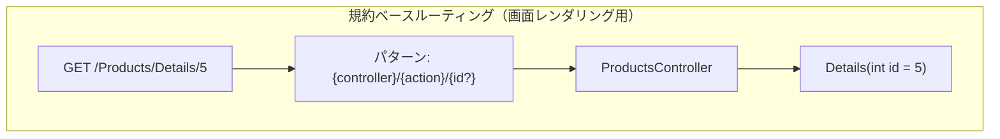

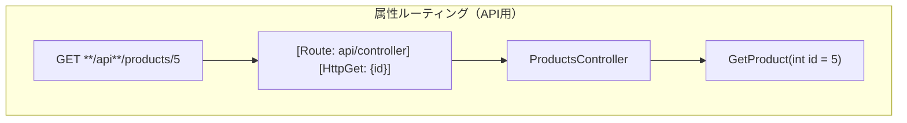

## 4. モデルバインディング / 入力検証 (Validation)

### モデルバインディング

**モデルバインディング** とは、HTTP リクエストの送信データ（ルートの一部、クエリ文字列、フォームフィールド、JSON ボディ、ヘッダーなど）を、コントローラーのアクションメソッドの引数やモデルオブジェクトに自動的に割り当てる仕組みです。  
これにより、開発者は Request オブジェクトから手動で値を取り出す（JSON 文字列のパースなど）処理を書く必要がなく、アクションメソッドの引数を直接利用できます。

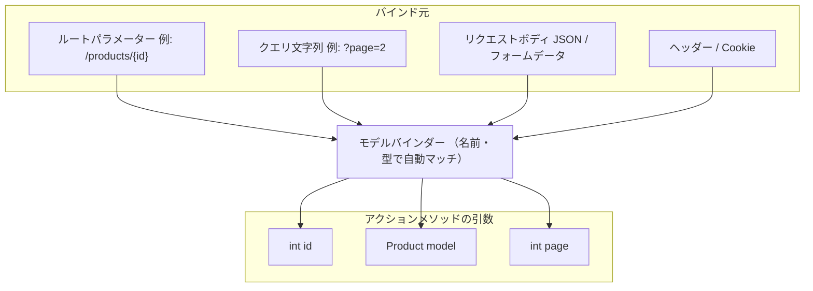

例えば、次のようなモデルとアクションメソッドを考えます。

```csharp
public class Product
{
    public string Name { get; set; } = string.Empty;
    public decimal Price { get; set; }
}
```

```csharp
public IActionResult Create(Product model)
{
    // model.Name, model.Price などに、フォームから送信された値が自動でセットされている
    logger.LogInformation("Create called: Name={Name}, Price={Price}", model.Name, model.Price);

    // 必要に応じて、バリデーションや保存処理などが入ります

    return View(model);
}
```

上記アクションに対応するフォームの Razor ビュー（`.cshtml`）は次のように記述します。

**`Views/Products/Create.cshtml` の例:**

```razor
@model Product

<form asp-action="Create" asp-controller="Products" method="post">
    <div>
        <label asp-for="Name"></label>
        <input asp-for="Name" />
        <span asp-validation-for="Name"></span>
    </div>
    <div>
        <label asp-for="Price"></label>
        <input asp-for="Price" />
        <span asp-validation-for="Price"></span>
    </div>
    <button type="submit">登録</button>
</form>
```

`Product` が `Name` や `Price` プロパティを持つクラスだとすると、クライアントのフォームから POST された対応フィールドの値が、自動的に `model` 引数のプロパティにバインドされます。  
これは ASP.NET Core のモデルバインディング機構が、名称マッチにより適切に値を解析してくれるためです。

> [!TIP]
> このモデルバインディング機能は、Java の Spring MVC の `@ModelAttribute` や Ruby on Rails のストロングパラメータでフォームデータをモデルへ当てはめる仕組みに相当します。

### 補足： `Product` に含まれないリクエスト情報の取得例

POST ボディのうち `Product` に含まれないフィールドの取得方法は、コンテンツタイプによって異なります。

**フォームデータ（`application/x-www-form-urlencoded`）の場合** 、 `Request.Form` コレクションを使います。

```csharp
// Request.Form から名前で直接取得する例
string? value = Request.Form["Key"];
```

**JSON ボディ（`application/json`）の場合** 、 `Request.Body` コンテキストを使用します。

```csharp
// Request.Body から直接取得する例
using (var reader = new StreamReader(Request.Body))
{
    var body = await reader.ReadToEndAsync();
    // JsonDocument や JsonConvert を使用してパース
    var data = JsonDocument.Parse(body);
    var value = data.RootElement.GetProperty("Key").GetString();
}
```

### 補足：文脈に応じたバインド元推論

ASP.NET Core のモデルバインディングは **複雑な型**（クラスなど）の引数であればリクエストボディ（通常は JSON や XML）からデータを取得し、 **シンプルな型**（int や string など）の引数であればルート変数やクエリ文字列、フォームデータから値を取得する、というように **文脈に応じたバインド元推論** が行われます。  
例えば Web API で `[ApiController]` を付与している場合、 `POST` メソッドの複合型パラメーターは自動的に\[FromBody]（リクエストボディから）と解釈され、 `GET` メソッドの int や string パラメーターは\[FromRoute]または\[FromQuery]と解釈されます。必要であれば明示的に属性で指定することも可能です。（ `[ApiController]` 属性に関して詳細は次節「5. API を MVC コントローラーで実装する方法（ControllerBase, \[ApiController] 属性）」で解説します。）

```csharp
[ApiController]
[Route("api/[controller]")]
public class ProductsController : ControllerBase
{
    // POST api/products
    // 複合型 Product は [ApiController] により自動的に [FromBody] と推論される
    [HttpPost]
    public IActionResult Create(Product product) { ... }

    // GET api/products/5?includeDetails=true
    // int id はルートテンプレートに含まれるため [FromRoute] と推論される
    // bool includeDetails はクエリ文字列にマッチするため [FromQuery] と推論される
    [HttpGet("{id}")]
    public IActionResult Get(int id, bool includeDetails = false) { ... }

    // 推論に頼らず明示的に指定することも可能
    [HttpGet("search")]
    public IActionResult Search([FromQuery] string name, [FromHeader(Name = "X-Locale")] string locale = "ja") { ... }
}
```

> [!NOTE]
> クエリ文字列のキー名とアクションパラメーター名の照合は **既定では大文字・小文字を区別しません**（例: `?ReturnUrl=...` と `?returnUrl=...` はどちらも `string returnUrl` にバインドされます）。  
> JSON リクエストボディについても、ASP.NET Core が既定で使用する `System.Text.Json` のデシリアライザーは標準では **大文字・小文字を区別せず** プロパティ名を照合します。  
> そのため `{ "name": "ProductA" }` と `{ "Name": "ProductA" }` はどちらも `Product.Name` にバインドされます。  
> ただし、JSON リクエストボディのデシリアライズ時に `JsonSerializerOptions` で `PropertyNameCaseInsensitive = false` を明示した場合は区別されるようになります。

バインドの際に名前が合致しない場合や、型変換が失敗した場合、その情報は `ModelState` に格納されます。  
`ModelState` はキー（フィールド名）ごとにバインドや検証の状態を持つ辞書で、アクション内で検証に使用されます。  
例えばクエリ文字列 `?price=abc` を int パラメーター `price` にバインドしようとすると、変換エラーで `ModelState` にエラーが追加されます。

このような挙動により、大抵の場合は開発者が特に意識せずとも適切にバインドが行われます。

### 入力検証 (バリデーション)

ASP.NET Core MVC では、モデルに付加した検証属性によってサーバーおよびクライアント側の入力検証をサポートします。  
検証には主に **データ注釈 (DataAnnotations)** による属性を使用します。  
`System.ComponentModel.DataAnnotations` 名前空間に定義された属性（例えば `[Required]` , `[StringLength]` , `[Range]` , `[EmailAddress]` など）をモデルクラスのプロパティに付与するだけで、それらのルールに基づいた検証が自動的に行われます。

**検証属性を付けたモデルの例:**

```csharp
public class Product
{
    [Required]
    public string Name { get; set; } = string.Empty;

    [Required]
    [Range(0, double.MaxValue)]
    public decimal Price { get; set; }
}
```

コントローラーのアクションでは、モデルバインドおよび検証の結果を **`ModelState`** で確認できます。典型的なパターンは次のとおりです。

```csharp
public IActionResult Create(Product model)
{
    if (!ModelState.IsValid)
    {
        // 検証失敗。エラー情報はModelStateに格納されている。
        // 必要に応じてModelState経由でエラーをビューに表示できる。
        return View(model);
    }
    // 検証成功時の処理（製品登録など）
    _productService.Add(model);
    return RedirectToAction(nameof(Index));
}
```

> [!NOTE]
> サーバー側のバリデーションは、HTTP リクエストを受け取った後、 **アクションメソッドが実行される前** にフレームワーク内部で実施されます。  
> 具体的には、モデルバインディング（リクエストデータをモデルオブジェクトへ変換）が完了した直後に検証が走り、その結果が `ModelState` に格納されます。  
> アクションメソッドが呼び出される時点では、 `ModelState` には既にバインドエラーや検証エラーがすべて反映されています。
> 
> このため、アクションメソッドの冒頭で `ModelState.IsValid` を確認するだけで、リクエスト全体の検証結果を把握できます。

上記のように、 `ModelState.IsValid` でサーバー側検証がすべて成功したかを判定し、失敗している場合は再度同じビューを表示します（ビューには `ModelState` のエラーを表示するタグヘルパーを配置しておくことで、ユーザーにフィードバックできます）。検証成功時のみ本来の処理を行い、次画面へ進めるようにします。  
このパターンは **「Post-Redirect-Get」** の原則にも沿ったもので、ASP.NET Core MVC における基本的なフォーム処理フローです。

上記 `Product` では、 `Name` に `[Required]` （未入力は無効）、 `Price` には `[Required]` と `[Range]` （0 以上の値）など、複数の検証ルールを付けています。  
これら属性はまず **サーバー側** でモデルバインド直後に検証され、結果は `ModelState` に反映されます。  
また、ビューで適切なヘルパーを用いてフォームを描画した場合、これらの検証ルールは自動的に HTML の入力フィールドに対する検証スクリプト（ **未入力エラーや形式エラーを表示するための JavaScript** ）として埋め込まれます。  
具体的には、ASP.NET Core MVC は既定で **jQuery Validation** ライブラリを利用したクライアント側検証をサポートしており、データ注釈によるルールが HTML 属性として出力され、ブラウザ上でリアルタイム検証が行われます。  
例えば `[Required]` であれば `required` 属性や対応メッセージが、自作のエラーメッセージを指定すれば `data-val-required` 属性として出力されます。

> [!NOTE]
> クライアント側検証が有効な場合、**フロントエンドでバリデーションエラーが検出されるとフォームの送信自体がブロックされ、サーバーへのリクエストは発生しません**。つまり、標準的なデータ注釈属性を使用している限り、ユーザーの入力は **クライアントとサーバーの両方で検証** します（クライアント側はユーザー体験向上のため即時フィードバックを行い、サーバー側は JavaScript 無効化や悪意ある改ざんへの対策として必ず実行されます）。  
> ただし、この後説明する **カスタム検証属性** （`ValidationAttribute` を継承して作成したもの）や **`IValidatableObject`** による検証ロジックはサーバー側のみで実行されます。クライアント側でも同等のチェックを行うには、`IClientModelValidator` を別途実装する必要があります（実装しない場合、該当ルールはサーバー側サブミット後にしかエラーが表示されません）。

**Product.cs にバリデーションを設定（表示名とエラーメッセージを日本語化）した際のフォーム表示例**

```csharp
public class Product
{
    public int Id { get; set; }

    [Display(Name="製品名")]
    [Required(ErrorMessage = "製品名は必須です")]
    public string Name { get; set; } = string.Empty;

    [Display(Name="価格")]
    [Range(0, double.MaxValue, ErrorMessage = "価格は0より大きい値を入力してください")]
    public decimal Price { get; set; }
}
```

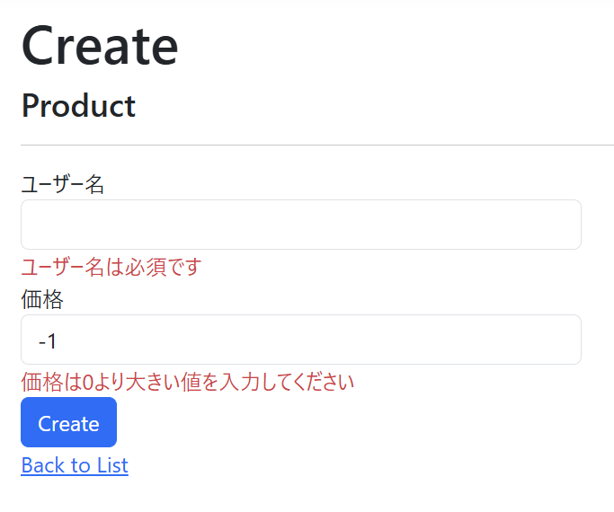

### 入力検証のカスタマイズ

デフォルトの検証ロジックだけでなく、独自の検証属性を作成したり、モデルの `Validate` メソッド（ `IValidatableObject` インターフェイス実装）で複雑な検証を行うことも可能です。

**カスタム検証属性の例:**

```csharp
// ValidationAttribute を継承してカスタム検証属性を作成する
public class FutureDateAttribute : ValidationAttribute
{
    protected override ValidationResult? IsValid(object? value, ValidationContext validationContext)
    {
        if (value is DateTime date && date <= DateTime.Today)
        {
            return new ValidationResult(ErrorMessage ?? "日付は未来の日付を指定してください。");
        }
        return ValidationResult.Success;
    }
}

// モデルへの適用例
public class EventModel
{
    [Required]
    public string Title { get; set; } = string.Empty;

    [FutureDate(ErrorMessage = "イベント日は今日より後の日付を指定してください。")]
    public DateTime EventDate { get; set; }
}
```

**`IValidatableObject` によるモデルレベルの複合検証の例:**

```csharp
// IValidatableObject を実装すると、複数プロパティにまたがる検証が行える
public class Product : IValidatableObject
{
    [Required]
    public DateTime CreatedAt { get; set; }

    [Required]
    public DateTime UpdatedAt { get; set; }

    public IEnumerable<ValidationResult> Validate(ValidationContext validationContext)
    {
        if (UpdatedAt < CreatedAt)
        {
            yield return new ValidationResult(
                "更新日時は作成日時以降の日時を指定してください。",
                [nameof(UpdatedAt)]  // エラーを関連付けるプロパティ名
            );
        }
    }
}
```

さらに、 **Controller.TryValidateModel** メソッドを使えば、任意のオブジェクトに対して手動で検証をトリガーできます。  
こうした拡張により、アプリケーション固有のビジネスルール検証も MVC フレームワークに統合できます。

**`TryValidateModel` による手動検証トリガーの例:**

```csharp
public IActionResult Confirm(Product model)
{
    // 何らかの事情でモデルを書き換えた後、再度検証を走らせる
    model.UpdatedAt = DateTime.UtcNow;

    // TryValidateModel で ModelState を再評価する
    if (!TryValidateModel(model))
    {
        return View(model);     // 再評価後の ModelState にエラーがあれば戻す
    }

    // 検証成功 → 登録確定の処理へ
    return RedirectToAction(nameof(Index));
}
```

## 5. API を MVC コントローラーで実装する方法（ControllerBase, [ApiController] 属性）

ASP.NET Core では、従来の MVC と同じ仕組みを用いて **Web API**（HTTP ベースの JSON などを返すサービス）を構築できます。

> [!TIP]
> この実装方法は、Spring Boot の `@RestController` や Laravel の API リソースコントローラーと同様の **REST コントローラー** に相当します。

### API コントローラー／アクション実装の例

下記 `ProductsController` は Web API 用に設計されたコントローラーです。（先述のビューありの ProductsController とは別で作成することを想定します。）  
`Controller` ではなく `ControllerBase`（ビュー機能を持たない基底クラス）を継承し、代わりに `[ApiController]` 属性を付与して様々な API 向けの利便性を有効にしています。

```csharp
// API向けのコントローラー例（JSONデータを返す）
[ApiController]                      // API用挙動を有効化（後述）
[Route("api/[controller]")]          // ルートURLは "api/コントローラー名"（ここでは api/products）
public class ProductsController : ControllerBase   // ControllerBaseを継承（ビュー機能は使わない）
{
    private readonly IProductRepository _repository;
    public ProductsController(IProductRepository repository)
    {
        _repository = repository;
    }

    // アクション: GET api/products/{id}
    [HttpGet("{id}")]
    public ActionResult<Product> GetProduct(int id)
    {
        var product = _repository.Find(id);
        if (product == null)
            return NotFound();         // 404を返す
        return product;                // 200 OK + Productオブジェクト（JSONとしてシリアライズされる）
    }

    // アクション: POST api/products
    [HttpPost]
    public ActionResult<Product> CreateProduct(Product newProduct)
    {
        _repository.Add(newProduct);
        // 201 Createdを返し、Locationヘッダーに新規リソースのURLを設定
        return CreatedAtAction(nameof(GetProduct), new { id = newProduct.Id }, newProduct);
    }
}
```

`GetProduct` アクションは指定 ID の製品を取得し、存在しなければ `NotFound()` で 404 レスポンス、見つかれば `Product` オブジェクト自体を返しています。  
`ActionResult<Product>` を返すことで、ASP.NET Core は戻り値の `Product` オブジェクトを自動的に JSON にシリアライズし、200 OK レスポンスとして送出します。  
`CreateProduct` アクションでは、新規製品を登録後、 `CreatedAtAction` ヘルパーを使って 201 Created レスポンスを生成しています。  
`CreatedAtAction` は第 1 引数に指定したアクション（ここでは `GetProduct` ）への URI を Location ヘッダーに含め、ボディに新規作成したリソースを含む標準的な HTTP 201 応答を構築します。  
このように、ASP.NET Core MVC のコントローラーでは、少ないコードで HTTP のベストプラクティスに沿ったレスポンスを返すことができます。

加えて、API コントローラーでは **明示的な内容協調 (コンテンツネゴシエーション)** が行われます。  
デフォルトではクライアントからの `Accept` ヘッダーを見て JSON や XML で返すか決定します（標準では JSON シリアライザーが登録済み）。  
`ActionResult<T>` でオブジェクトを返せば、ASP.NET Core が自動で JSON にシリアライズしてくれます。  
例えば前述の `ProductsController.GetProduct` では、戻り値が `ActionResult<Product>` で `return product;` としていますが、これは実際には `return Ok(product);` と同等の効果で、JSON ボディが返っています。

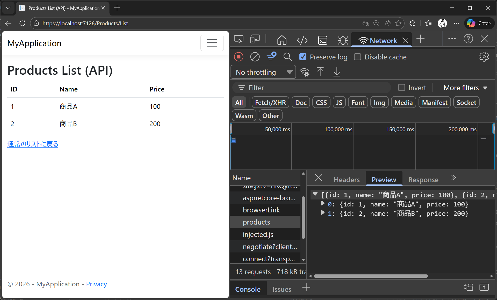

### ControllerBase

Web API 用コントローラークラスは通常、 `ControllerBase` クラスを継承します。  
`ControllerBase` は MVC コントローラーの基本機能（ `User` や `HttpContext` プロパティ、 `NotFound()` や `Ok()` などのヘルパーメソッド。一覧は本章の「2. コントローラー／アクションの書き方」節の表を参照。）を提供しますが、ビュー関連の機能（ `View()` メソッドなど）は持ちません。  
API ではビューは不要なので、 **API 専用コントローラーは `ControllerBase` を使う** ようにしましょう。

### \[ApiController] 属性

API 用コントローラークラスには `[ApiController]` 属性を付与することが推奨されます。  
この属性を付けると、フレームワークがいくつかの **API 向け拡張機能** を自動で有効にします。

主な例は下記のとおりです。

1. **属性ルーティングの必須化** – `[ApiController]` を付けたコントローラーでは **従来の規約ルートによるアクセスが無効** となり、 **明示的に付与したルート属性経由でしかアクションにアクセスできなくなります** 。そのため、API コントローラーは **必ず `[Route]` や `[HttpGet]` 等でルートを定義する必要があります** 。
2. **自動 HTTP 400応答** – モデルバインドや検証でエラーが発生した場合、アクションメソッドへ到達する前に自動的に 400 Bad Request 応答が返されます。開発者が明示的に `if (!ModelState.IsValid) return BadRequest(...);` と書かなくてもよくなります。返される 400 応答のボディは標準化された **ValidationProblemDetails** 型で、どのフィールドでエラーが起きたかを JSON 形式で示す内容になります。
3. **バインド元の自動推論** – アクションメソッドのパラメーターに対し、明示的な `[FromBody]` や `[FromQuery]` を付けなくても **適切なバインド元をフレームワークが推定** します。例えば複合型のパラメーターであればリクエストボディから、 `IFormFile` 型であればフォームデータから、 `int` や `string` でルートテンプレートに含まれていれば URI セグメントから、などです。この推論規則により、コードを簡潔に保てます（必要であれば `[FromQuery]` 等で明示も可能）。
4. **Multipart/form-data の推論** – Content-Type が multipart/form-data の場合の取り扱いも自動化され、ファイルアップロードシナリオで便利になります。例えばアクションに `IFormFile` パラメーターがあれば、 `[FromForm]` と推定されます。
5. **エラー時の ProblemDetails 適用** – 404 や 500 エラーなど、特定のステータスコードでレスポンスを返す際に **RFC7807 に準拠した Problem Details** 形式のボディを既定で生成します。例えば `return NotFound();` とすると空ボディではなくエラー詳細を含む JSON が返ります（カスタマイズも可能）。

> [!TIP]
> Spring Boot でも `@ResponseStatus` や BindingResult によるバリデーションチェック省略が近い機能ですが、ASP.NET Core では `[ApiController]` 属性 1 つで包括的に有効になります。

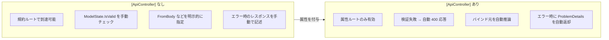

### APIコントローラー実装時の注意

返り値の選択について、いくつかポイントがあります。

- 単にデータを返すだけの場合でも、可能なら `ActionResult<T>` （または `IActionResult` ）を使うことが推奨されます。これにより、必要に応じて `NotFound()` や `BadRequest()` など **HTTP ステータスを明示するレスポンス** も簡単に返せるためです。実際、 `ActionResult<T>` を返すメソッドで `T` 型のオブジェクトを直接返すと、自動的に 200 OK となり、 `NotFound()` を返すと T が `null` でも適切に 404 が返せます。
- エラー応答には標準化された形式（ProblemDetails）を活用しましょう。 `[ApiController]` 適用時は自動で ProblemDetails になりますが、独自エラー構造を返したい場合は `BadRequest(new { ... })` のように匿名オブジェクトやカスタム DTO を渡すこともできます。ただし基本は既定に従う方がクライアントとの整合性がとりやすいです。
- ルーティングは **必ず属性ルーティング** で行います。コントローラーに `[Route("api/[controller]")]` 、各メソッドに `[HttpGet("...")]` 等を付与してください。MVC 用の `MapControllerRoute` による規約ルートは API には適用されない（効かない）ため注意が必要です。

## 6. フィルター（ActionFilter, ExceptionFilter 等）と横断処理

**フィルター (Filter)** は、ASP.NET Core MVC において **リクエスト処理パイプラインの特定のタイミングでカスタムコードを挿入できる仕組み** です。  
フィルターを活用すると、認証やエラーハンドリング、ロギング、キャッシュなど複数のアクションに共通する処理（横断的関心事）を一箇所にまとめて実装できます。

> [!TIP]
> フィルターは、Spring AOP の Advice、Laravel のミドルウェア、Ruby on Rails のコントローラーフィルター（`before_action` や `around_action`）に相当する概念です。

> [!NOTE]
> 「フィルター」という言葉から、データを絞り込む（抽出する）処理を想像するかもしれませんが、ASP.NET Core における **フィルター** は「アクションメソッドの実行前後や例外発生時に、任意のコードを割り込ませる仕組み」を指します。  
> データの抽出・絞り込みではなく、**前処理（アクション実行前）** や **後処理（アクション実行後）** を挿入する設計パターンです。

下図はアクションフィルターの基本的な動作イメージです。

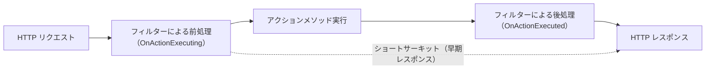

ASP.NET Core にはあらかじめいくつかの **組み込みフィルター** が用意されており、例えば認可(Authorization)のチェックやレスポンスキャッシュの適用などは既定のフィルターで実現されています。  
開発者は必要に応じて **カスタムフィルター** を作成し、自身のアプリに共通の横断処理を実装できます。  
フィルターを使うことで同じコードの繰り返し記述を防ぎ、重要な処理を一元管理できます。

フィルターは実行されるタイミングによっていくつかの種類に分類されます。

- **認可フィルター (Authorization Filter)**: 一番最初に実行され、ユーザーが要求を実行する権限があるか確認します。認可に失敗した場合、後続のパイプラインを中断し（ショートサーキット）、すぐにアクセス拒否の結果を返します。ASP.NET Core では `[Authorize]` 属性が代表的で、コントローラーやアクションに付与するとこのフィルターが働きます。カスタム実装は `IAuthorizationFilter` または `IAsyncAuthorizationFilter` を実装します。
- **リソースフィルター (Resource Filter)**: 認可フィルターの後、モデルバインドが行われる前に実行されます。ここではアクションメソッドの引数がセットされるより前の段階で介入できるため、キャッシュの短絡（キャッシュがあればアクションを実行しない）などに使われます。リソースフィルターはあまり頻繁には使われませんが、例えば大きなファイルのアップロード前に要求をチェックする、といった用途があります。カスタム実装は `IResourceFilter` または `IAsyncResourceFilter` を実装します。
- **アクションフィルター (Action Filter)**: アクションメソッドの **直前および直後** に実行されます。 `OnActionExecuting` と `OnActionExecuted` という 2 つのイベントにフックしており、前者でアクションに渡る引数を書き換えたり、後者でアクションの実行結果（戻り値）を差し替えたりできます。一般的な用途はログの記録（アクションの開始と終了をログ出力）、パフォーマンス計測、また入力変換などです。 **Razor Pages** では Action Filter は直接サポートされませんが、MVC コントローラーや API では有用です。カスタム実装は `IActionFilter` / `IAsyncActionFilter` を実装するか、 `ActionFilterAttribute` を継承します。
- **エンドポイントフィルター (Endpoint Filter)**: これは.NET 7 で導入された新しいフィルターで、MVC コントローラーのアクションだけでなく **Minimal API のハンドラーにも適用できる** 統一的なフィルターです。挙動自体は Action Filter に似ており、アクション実行の前後で処理を行えます。ただしエンドポイントフィルターは新しい機能であり、既存の Action Filter/結果フィルターと併用される場合があります。基本的な考え方は Action Filter と同様ですので、ここでは詳細説明は割愛します。カスタム実装は `IEndpointFilter` を実装します。
- **例外フィルター (Exception Filter)**: **ハンドルされない例外** をキャッチして処理します。コントローラーの生成、モデルバインディング、アクションフィルター、アクションメソッドで発生した例外を処理対象とします。逆に言えば、ミドルウェアやルーティングで発生した例外、またはリソースフィルター・結果フィルター・MVC 結果実行中に発生した例外は処理できません。例外フィルターを使うと、ハンドルされない例外に対する共通のエラーハンドリングロジック（ログ記録やエラーレスポンスの成形）を一箇所にまとめることができます。例えば `ApiExceptionFilter` を実装して登録しておけば、各コントローラー内で try-catch を書くことなく、未処理例外を JSON エラーレスポンスに変換できます。カスタム実装は `IExceptionFilter` または `IAsyncExceptionFilter` を実装します。
- **結果フィルター (Result Filter)**: アクションメソッドが正常に終了した後、ビューや JSON など **アクション結果が実行される直前と直後** に実行されます。ビューの生成前後や、API レスポンスのシリアライズ前後に処理を挿入できるため、例えばレスポンスに共通ヘッダーを追加する、レスポンスデータを加工するといった用途に使えます。結果フィルターはアクションがエラーを投げた場合は呼ばれない点に注意が必要です。カスタム実装は `IResultFilter` または `IAsyncResultFilter` を実装します。

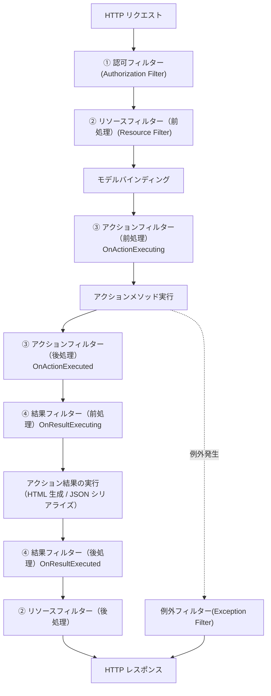

上記のように、フィルターは多段階に分かれていますが、 **基本的な作成方法** は共通しています。  
カスタムフィルターを作るには、それぞれ対応するインターフェイス（ `IActionFilter` , `IExceptionFilter` など）を実装するか、既定の抽象クラス（例えば `ActionFilterAttribute` ）を継承してメソッドをオーバーライドします。  
以下にシンプルなアクションフィルターの実装例を示します。

```csharp
public class SampleActionFilter : IActionFilter
{
    private readonly ILogger<SampleActionFilter> _logger;

    public SampleActionFilter(ILogger<SampleActionFilter> logger)
    {
        _logger = logger;
    }

    public void OnActionExecuting(ActionExecutingContext context)
    {
        // アクションメソッド実行前に実行される処理
        _logger.LogInformation("Before action: {ActionName}", context.ActionDescriptor.DisplayName);
    }

    public void OnActionExecuted(ActionExecutedContext context)
    {
        // アクションメソッド実行後に実行される処理
        _logger.LogInformation("After action: {ActionName}", context.ActionDescriptor.DisplayName);
        if (context.Exception != null)
        {
            // ここでは例外は処理せずスローし続ける（ExceptionFilter で処理予定）
        }
    }
}
```

上記 `SampleActionFilter` は `IActionFilter` インターフェイスを実装し、 `ILogger` を DI で受け取ってアクションの前後にログを出力しています。  
`OnActionExecuted` 内では、 `context.Exception` をチェックすることでアクション中に例外が発生したか判定できます。  
必要に応じてここで例外をハンドルし、 `context.Exception` を `null` に設定すれば、例外が既に処理されたものとみなされます（典型的には Exception Filter で処理するので、Action Filter 内で触らないことも多いです）。

> [!NOTE]
> **DI（依存性の注入）** とは、クラスが必要とする依存オブジェクト（サービスなど）を外部から注入する設計パターンです。  
> ASP.NET Core では DI コンテナが組み込まれており、コンストラクターの引数に型を宣言するだけで自動的にインスタンスが提供されます。  
> **TODO** 詳細は DI の章を参照してください。

作成したフィルターを有効化するには、 **フィルターを適用したい範囲** で登録します。  
ASP.NET Core ではフィルターは **グローバル** （全コントローラー全アクション）、 **コントローラー単位** , **アクション単位** で適用可能です。  
グローバル適用は `Program.cs` の `builder.Services.AddControllers` や `AddControllersWithViews` のオプションで `options.Filters.Add(new SampleActionFilter())` のように追加します。

```csharp
var builder = WebApplication.CreateBuilder(args);

// DI が必要なフィルターは事前にサービスとして登録する
builder.Services.AddScoped<SampleActionFilter>();

builder.Services.AddControllers(options =>
{
    // DI が不要なフィルターはインスタンスを直接渡せる
    // options.Filters.Add(new AnotherFilter());

    // DI が必要なフィルターは Add<T>() を使用（DI コンテナ経由でインスタンスを生成）
    options.Filters.Add<SampleActionFilter>();
});

var app = builder.Build();
app.MapControllers();
app.Run();
```

コントローラーやアクション個別に適用する場合は、対応するクラスやメソッドに属性として付与します。  
例えば上記 `SampleActionFilter` が属性クラス（ `Attribute` を継承）でもある場合、 `[SampleActionFilter]` とデコレートすれば適用されます。

```csharp
// コントローラー全体に適用
[SampleActionFilter]
public class ProductsController : Controller
{
    // アクション単位に適用
    [SampleActionFilter]
    public IActionResult Index() => View();
}
```

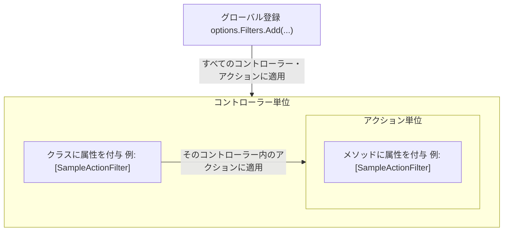

### フィルターの用途とベストプラクティス

フィルターは強力な仕組みですが、使いすぎるとコードの流れが見えにくくなる恐れもあります。  
まずは **「複数のコントローラー/アクションにまたがって繰り返し出現する処理」** に絞って導入すると良いです。  
例えば、全ての API レスポンスに共通ヘッダーを付与する処理を Result Filter で一括実装すると、重複を避けられます。  
また、認証・認可は組み込みの AuthorizeFilter を活用し、ロールベースやポリシーベースのアクセス制御を属性で宣言的に付与できます（ **TODO** 認証認可は第9章で解説 ）。  
逆に、個別のアクションだけで必要な処理はフィルターにせず、アクション内に書いた方が分かりやすい場合もあります。

フィルターはあくまで **MVC（あるいはAPI）レイヤー内部** の前後処理であり、コントローラーに入る前提条件が整った後で動作します。  
そのため、認証のようにリクエストの文脈依存で **早期に短絡させたい処理**（＝未認証なら後工程に進めない）はフィルターに適しています。

## 参考ドキュメント

- [ASP.NET Core MVC の概要 - Microsoft Learn](https://learn.microsoft.com/ja-jp/aspnet/core/mvc/overview?view=aspnetcore-10.0)
- [ASP.NET Core を使って Web API を作成する - Microsoft Learn](https://learn.microsoft.com/ja-jp/aspnet/core/web-api/?view=aspnetcore-10.0)
- [ASP.NET Core のコントローラーアクションへのルーティング - Microsoft Learn](https://learn.microsoft.com/ja-jp/aspnet/core/mvc/controllers/routing?view=aspnetcore-10.0)
- [ASP.NET Core MVC でのモデルバインディング - Microsoft Learn](https://learn.microsoft.com/ja-jp/aspnet/core/mvc/models/model-binding?view=aspnetcore-10.0)
- [ASP.NET Core MVC のモデル検証 - Microsoft Learn](https://learn.microsoft.com/ja-jp/aspnet/core/mvc/models/validation?view=aspnetcore-10.0)
- [ASP.NET Core のフィルター - Microsoft Learn](https://learn.microsoft.com/ja-jp/aspnet/core/mvc/controllers/filters?view=aspnetcore-10.0)
