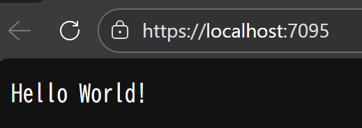
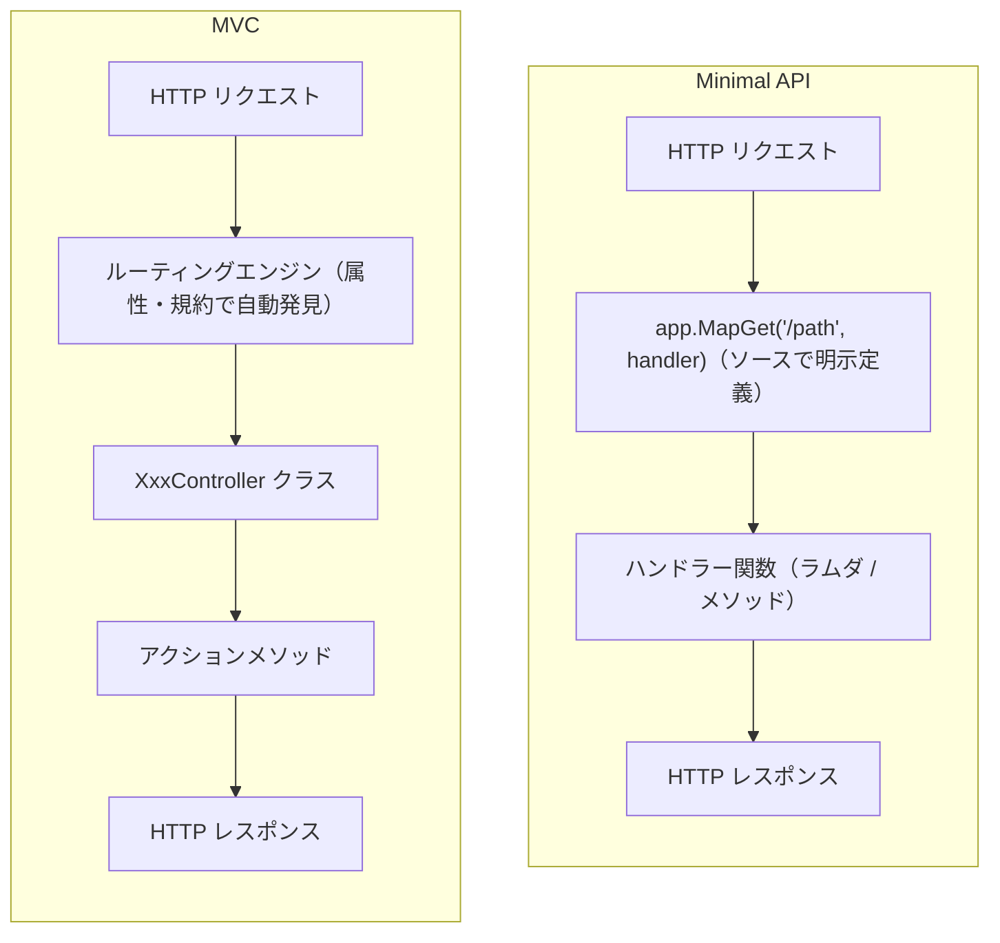
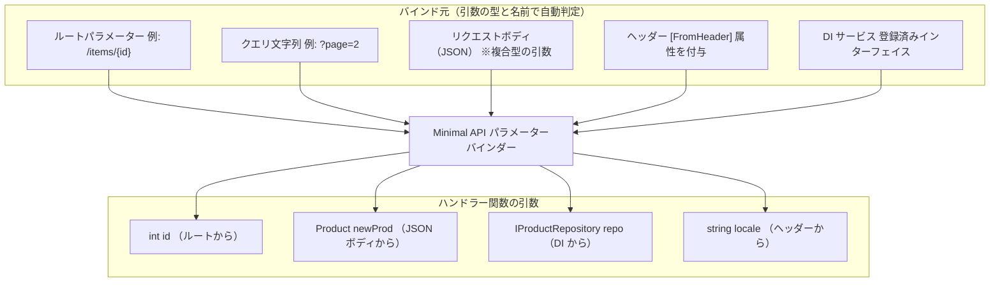
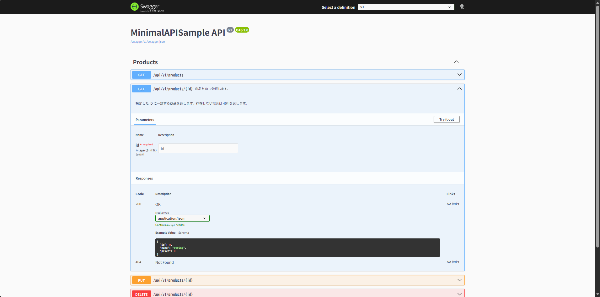
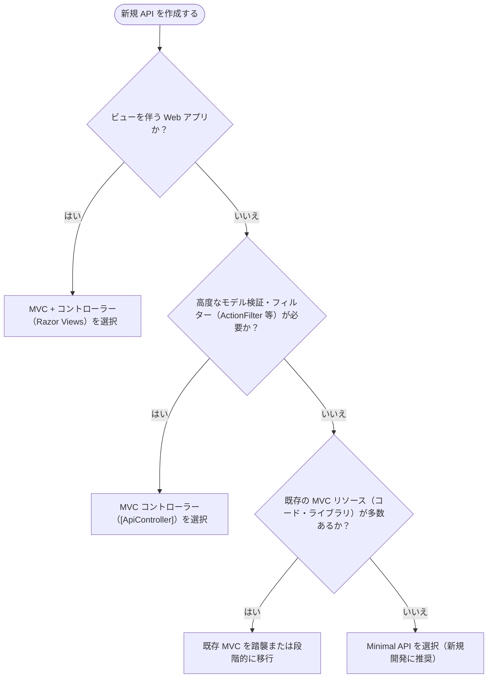

# 第4章：Minimal API の解説と使いどころ

## 1. Minimal API とは何か？（MVC ベースとどう違うか）

**Minimal API** は、ASP.NET Core (.NET 6 以降) で導入された **シンプルな HTTP API 構築手法** です。  
従来の MVC コントローラーを使用せず、 **わずかなコードで REST エンドポイントを定義** できるのが特徴です。  
具体的には、`Program.cs`（エントリポイント）上で **ルートと対応処理（ハンドラー）を直接コードでマッピング** することで、コントローラーやアクションメソッドのボイラープレートを省略できます。

**※この構成は、第1章：開発環境セットアップの [6. 初回プロジェクト作成](01-setup-dev-env#6.%20初回プロジェクト作成) 節で作成します。**

**ASP.NET Core テンプレートから作成した、Minimal API の最小コード例**

```csharp
var builder = WebApplication.CreateBuilder(args);
var app = builder.Build();

app.MapGet("/", () => "Hello World!");

app.Run();
```



各エンドポイントにはラムダ式のほか、 **ローカル関数、静的メソッド、インスタンスメソッドなど任意のデリゲートを指定可能** です。  
例えば外部のクラスに `static string SayHello()` というメソッドがあれば、 `app.MapGet("/hello", SayHello);` のように渡すこともできます。  
※全てのコードを Program.cs に書く必要はありません。より詳細なコード構成パターンに関しては本章の「3. DI を使ったハンドラー注入、MapGroup・エンドポイントグループ化などの構成パターン」節を参照ください。

```csharp
public static class ExternalHandlers
{
    public static string SayHello() => "Hello World!";
}
```

```csharp
// 静的メソッドをそのままハンドラーとして渡す
app.MapGet("/hello", ExternalHandlers.SayHello);
```

**MVC コントローラー** の場合は、クラス（Controller）とその中のメソッド（Action）としてエンドポイントを定義し、属性（例えば `[HttpGet]` など）やルーティング規約で HTTP リクエストに紐付けました。  
一方、 **Minimal API** では **関数（デリゲート）** を直接エンドポイントとしてマッピングします。  



> [!TIP]
> Minimal API は **Node.js の Express や Python の Flask、Ruby の Sinatra** のように **コードによるルート定義** を行うスタイルです。  
> Laravel では `routes/web.php` にクロージャを書く方法が近いです。  
> 言語別に近しいスタイルのフレームワークは概ね下記の通りです。（厳密には各種異なる部分もあるため、あくまで比較のための表となります。）
>
> | 言語 | Minimal API に近いスタイル | MVC コントローラーに近いスタイル |
> | --- | --- | --- |
> | JavaScript | Express (`app.get('/path', handler)`) | NestJS (`@Controller`, `@Get`) |
> | Python | FastAPI (`@app.get('/path')`) / Flask (`@app.route('/path')`) | Django REST Framework (`ViewSet`) |
> | Ruby | Sinatra (`get '/path' { ... }`) | Ruby on Rails (`ActionController`) |
> | Java | JAX-RS / Javalin (`app.get("/path", handler)`) | Spring MVC (`@RestController`, `@GetMapping`) |
> | PHP | Laravel ルートクロージャ (`Route::get('/', fn() => ...)`) | Laravel リソースコントローラー |

## 2. Minimal API の基本構文（MapGet, MapPost 等）

### マッピング定義

Minimal API では、 `WebApplication` オブジェクト（通常 `app` と変数名を付けます）に対し、 `MapGet` や `MapPost` など **HTTP メソッド別のマッピングメソッド** を呼び出すことでエンドポイントを定義します。  
`/hello` エンドポイント定義の例を再度見てみましょう。

```csharp
public static class ExternalHandlers
{
    public static string SayHello() => "Hello World!";
}
```

```csharp
// 静的メソッドをそのままハンドラーとして渡す
app.MapGet("/hello", ExternalHandlers.SayHello);
```

上記は **GET** リクエストのルート `"/hello"` に対し、 `ExternalHandlers.SayHello` を対応付けています。 
ブラウザや HTTP クライアントで `/hello` にアクセスすると、このメソッドが実行され、文字列 `"Hello World!"` が HTTP レスポンスとして返されます。

**パラメーター付きルート** の定義もシンプルです。  
例えば製品 ID を受け取る REST パスを作る場合は以下のように書けます。

```csharp
app.MapGet("/products/{id}", (int id) => $"ProductId: {id}");
```

拡張メソッドとして別途定義したメソッドに渡す場合は以下のように書けます。

```csharp
public static IResult GetById(int id)
{
    var product = ProductStore.Products.FirstOrDefault(p => p.Id == id);
    return product is not null ? Results.Ok(product) : Results.NotFound();
}
```

```csharp
app.MapGet("/products/{id}", GetById);
```

> [!NOTE]
> 本来 `IResult` 型を使用するためには、名前空間の参照のために `using Microsoft.AspNetCore.Http` が必要となります。  
> .NET 6 以降では Implicit using directives の仕組みが導入され、特定の .NET SDK 使用下において既定でいくつかの名前空間は `using` の記載なしに使用することができます。  
> [.NET プロジェクト SDK の概要 | Microsoft Learn](https://learn.microsoft.com/ja-jp/dotnet/core/project-sdk/overview#implicit-using-directives)

`"{id}"` のようなルートパラメータを URL 中に定義すると、対応する型の引数（上記では int 型の `id` ）として受け取れます。  
この **ルート値のバインド** は MVC の Attribute Routing と同様ですが、Minimal API では **引数リストとルートテンプレートを突き合わせて自動バインド** します。  

**HTTP メソッドの種類** も、 `MapGet` 以外に `MapPost` , `MapPut` , `MapDelete` などが用意されています。  
一つの URL パスに対し複数のメソッドを受け付けたい場合は、 `MapMethods("パス", new[] { "PATCH", "HEAD" }, handler)` のような汎用メソッドを使用できます。

```csharp
// PATCH と HEAD の両メソッドを受け付けるエンドポイント
app.MapMethods("/products/{id}", new[] { "PATCH", "HEAD" }, (int id, Product patch, IProductRepository repo) =>
{
    var updated = repo.Patch(id, patch);
    return updated is not null ? Results.Ok(updated) : Results.NotFound();
});
```

### 戻り値とレスポンス

Minimal API では、ハンドラーが返す値をフレームワークが解析し、適切な HTTP レスポンスに変換します。  
例えば **文字列** を返せば `text/plain` で返送され、 **オブジェクト** を返せば JSON にシリアライズされて返送されます（既定では `System.Text.Json` を使用）。  
`void` や `Task` を返すハンドラーで何も返さなければ 204 No Content となります。

コントローラーの `IActionResult` に相当する **汎用結果型** として、Minimal API では `IResult`（および具体実装の `Results` ヘルパー）が用意されています。  
例えば明示的に HTTP ステータスを制御したいときは `Results.NotFound()` や `Results.Ok(data)`、`Results.Created("/resource/123", obj)` といった **ファクトリーメソッド** を return できます。  
再度、先ほどの `GetById` の例を見てみましょう。

```csharp
public static IResult GetById(int id)
{
    var product = ProductStore.Products.FirstOrDefault(p => p.Id == id);
    return product is not null ? Results.Ok(product) : Results.NotFound();
}
```

```csharp
app.MapGet("/products/{id}", GetById);
```

上記では、 `GET /products/{id}` でリストから商品を検索し、見つからなければ 404 を返し、見つかれば 200 と JSON データを返しています。  

また、ASP.NET Core 7 以降ではジェネリック版の `TypedResults.Ok<T>(data)` を利用でき、追加の属性付与などを行うことなく OpenAPI ドキュメントにレスポンス型を反映できます（詳しくは「4. Minimal API の制約・注意点と MVC との比較（構造、可読性、機能面）」節参照）。

```csharp
public static Results<Ok<Product>, NotFound> GetById(int id)
{
    var product = ProductStore.Products.FirstOrDefault(p => p.Id == id);
    return product is not null ? TypedResults.Ok(product) : TypedResults.NotFound();
}
```

## 3. DI を使ったハンドラー注入、MapGroup・エンドポイントグループ化などの構成パターン

### Minimal API における DI

**TODO** DI の詳細は6章で扱います。

ASP.NET Core の DI 機能は Minimal API のハンドラーでもシームレスに利用できます。  
コントローラーではコンストラクタインジェクションで行う形式が一般的ですが、Minimal API では **ハンドラー関数のパラメーター** としてサービスを受け取ります。  
具体的には、`builder.Services` に登録した任意のサービス型をハンドラーの引数に含めれば、実行時に自動解決されます。

たとえば、データアクセス用のリポジトリサービス `IProductRepository` を DI コンテナに登録してある場合のエンドポイント定義は次の通りです。

```csharp
// Program.cs
var builder = WebApplication.CreateBuilder(args);
builder.Services.AddScoped<IProductRepository, ProductRepository>(); // DI 登録

var app = builder.Build();
app.MapGet("/products/{id}", (int id, IProductRepository repo) => // 登録した具象クラスを受け取る
{
    var prod = repo.Find(id);
    return prod is not null ? Results.Ok(prod) : Results.NotFound();
});

app.Run();
```

`IProductRepository repo` という形でパラメーターに宣言するだけで、呼び出し時にフレームワークがコンテナから `repo` インスタンスを供給します。  
この仕組みにより、Minimal API でも **ビジネスロジックをサービスクラスに委譲** し、ハンドラーが膨らむことを防止できます。

> [!TIP]
> 他のフレームワークとの対応関係：MVC コントローラーではコンストラクタにサービスを注入していましたが、Minimal API ではハンドラー関数の引数に直接宣言するだけで同じ DI コンテナが自動解決します。  
> Spring Boot のコンストラクタインジェクションや Laravel の `app()->make(T::class)` に相当します。  
> サービスの登録方法（`builder.Services.AddScoped<T>()` 等）は MVC コントローラーと変わりません。

### 各種入力のバインディング

Minimal API のハンドラー引数にはサービス以外にも、 **HTTP リクエストからの各種データを直接バインド** できます。  
上記の `id` のようにルートからの取得はもちろん、 **クエリ文字列** や **ヘッダー** もパラメータとして受け取れます。

例えば `(int page, [FromHeader(Name="X-Custom")] string customHeader)` とパラメータを書けば、`page` は `?page=` クエリ値から、`customHeader` は HTTP ヘッダー `X-Custom` からそれぞれバインドされます。  

```csharp
// クエリ文字列とヘッダーをバインドする例
app.MapGet("/items", (int page, [FromHeader(Name = "X-Custom")] string customHeader, ILogger<Program> logger) =>
{
    logger.LogInformation("page: {Page}, X-Custom: {CustomHeader}", page, customHeader);
    return Results.Ok();
});
```

複合型（クラス）の引数がある場合、 **JSON リクエストボディ** からマッピングされます。  
例えば下記 `MapPost` の例では `Product` 型のオブジェクト `newProd` として JSON ボディから自動デシリアライズされます。

```csharp
// 複合型の引数は JSON リクエストボディから自動デシリアライズされる
app.MapPost("/products", (Product newProd, IProductRepository repo) =>
{
    repo.Add(newProd);
    return Results.Created($"/products/{newProd.Id}", newProd);
});
```

**フォームデータ** や **ファイルアップロード** （`IFormFile`）にも対応しており、必要に応じて `[FromForm]` 属性を付与して明示的にフォーム由来であることを指定できます。

```csharp
// フォームデータとファイルアップロードをバインドする例
app.MapPost("/upload", ([FromForm] string description, IFormFile file, ILogger<Program> logger) =>
{
    logger.LogInformation("description: {Description}, fileName: {FileName}, fileSize: {FileSize}", description, file.FileName, file.Length);
    return Results.Ok();
});
```



### コード構成パターン

#### エンドポイントのグループ化（MapGroup）・バージョン管理

アプリが大きくなるにつれ、エンドポイントを **論理的にグループ化** したり **共通の設定をまとめて適用** したくなる場合があります。  
Minimal API では .NET 7 から `MapGroup` メソッドが追加され、これにより **ルートパスの共通部分を持つエンドポイントをひとまとめ** にできます。  

```csharp
var group = app.MapGroup("/products");
group.MapGet("/", GetAll);
group.MapGet("/{id}", GetById);
group.MapPost("/", Create);
group.MapPut("/{id}", Update);
group.MapDelete("/{id}", Delete);
```

活用例として、管理者用の API 群 `/admin/...` に認可を必須付与する場合、以下のように実装できます。

```csharp
var adminGroup = app.MapGroup("/admin");         // admin グループを追加
adminGroup.RequireAuthorization("AdminPolicy");  // admin グループに AdminPolicy ポリシーを適用
adminGroup.MapGet("/users", GetUsers);           // グループに登録（GET /admin/users）
```

上記例では `app.MapGroup("/admin")` で `"/admin"` プレフィックスを持つグループを作成し、返ってきた `adminGroup`（`RouteGroupBuilder`）に対して `RequireAuthorization` を呼び出しています。  
これにより、このグループ配下の全エンドポイントに共通して認可ポリシー "AdminPolicy" が適用されます。  
この状態で `adminGroup.MapGet(...)` のように通常通りエンドポイントを定義すれば、URL は自動的に `/admin/users` となり、認可も一括適用されます。

グループには他にも `WithMetadata(...)` で共通のメタデータ（例えば OpenAPI 用のタグや `Deprecated` 指定など）を付与したり、`WithTags("Admin")` で Swagger UI 上の分類名を設定する、といった使い方も可能です。  
**ネストしたグループ** もサポートされており、`var v1 = app.MapGroup("/api/v1"); var products = v1.MapGroup("/products");` のように階層構造でグループを作り、それぞれに設定を与えることもできます。

```csharp
var v1 = app.MapGroup("/api/v1").WithGroupName("v1");          // v1 グループを追加
var products = v1.MapGroup("/products").WithTags("Products");  // Products 分類を v1 下に追加
products.MapGet("/", GetAll);                                  // グループに登録（GET /api/v1/products）
```

#### ディレクトリ構造例

エンドポイントが増えてきたら、機能（ドメイン）単位でフォルダーを分割し、各機能に対応する拡張メソッドクラスを配置します。  
`Program.cs` にはサービス登録とエンドポイントのマッピング呼び出しのみを残すのがポイントです。  
この構成を実現するための一つのディレクトリ構造例を以下に示します。

```text
MyApi/
├── Program.cs                        # エントリポイント（サービス登録・ルート登録の呼び出しのみ）
├── Features/
│   ├── Products/                     # 機能（ドメイン）単位でフォルダを切り、エンドポイント・サービス・モデルをまとめる
│   │   ├── ProductsEndpoints.cs      # MapProducts など拡張メソッド定義
│   │   ├── ProductsService.cs        # ビジネスロジック
│   │   └── ProductModels.cs          # モデル定義（Product レコードなど）
│   └── Orders/
│       ├── OrdersEndpoints.cs
│       ├── OrdersService.cs
│       └── OrderModels.cs
└── MyApi.csproj
```

このとき `Program.cs` は下記のような見通しの良い構成になります。

```csharp
// Program.cs
var builder = WebApplication.CreateBuilder(args);

var app = builder.Build();
app.MapProducts();   // Features/Products/ProductsEndpoints.cs で定義
app.MapOrders();     // Features/Orders/OrdersEndpoints.cs で定義
app.Run();
```

この形を実現するための `ProductsEndpoints.cs` 実装例は下記の通りです。

```csharp
// ProductsEndpoints.cs ─ 商品エンドポイントを拡張メソッドに分離
public static class ProductsEndpoints
{
    public static IEndpointRouteBuilder MapProducts(this IEndpointRouteBuilder app)
    {
        var group = app.MapGroup("/products").WithTags("Products");

        group.MapGet("/", GetAll);
        group.MapGet("/{id}", GetById);
        group.MapPost("/", Create);
        group.MapPut("/{id}", Update);
        group.MapDelete("/{id}", Delete);

        return app;
    }

    private static Ok<List<Product>> GetAll() =>
        TypedResults.Ok(ProductStore.Products);

    ... // 他のエンドポイント用メソッド定義
}
```

MVC でエリアやコントローラークラスに分割していたように、Minimal API でも **関心ごとにコードを分離** することで大規模開発に耐えうる設計が可能です。  
これは **Vertical Slice Architecture** とも呼ばれ、各機能を自己完結的に実装することで、変更の影響範囲を限定しやすくなる利点があります。  
**※このアーキテクチャ採用およびディレクトリ構成は必ずこの通りにしなければならないといったものではなく、あくまで構成の一例となります。参考程度にご活用ください。**

> [!NOTE]
> **Vertical Slice Architecture** とは、コードを技術的なレイヤー（Controller・Service・Repository など水平方向の分割）ではなく、 **機能・ユースケース単位（垂直方向）で分割** するアーキテクチャスタイルです。
>
> 従来の水平レイヤードアーキテクチャでは、1 つの機能を変更する際に複数のレイヤーにまたがる修正が必要になりがちです。  
> 垂直スライスアーキテクチャでは、1 つのエンドポイント（スライス）がリクエストからレスポンスまでの処理をすべて自己完結的に持つため、 **変更の影響範囲を 1 つのスライス内に閉じ込めやすくなります。**
>
> Minimal API の拡張メソッド分割パターン（`MapProductsV1`・`MapProductsV2` など）はこのスタイルを自然に実現できるものです。  

#### 視覚化・API ドキュメント

Minimal API は `Microsoft.AspNetCore.OpenApi` パッケージを使用した **OpenAPI** ドキュメントの自動生成に対応しています。

Minimal API では、メソッドチェーンで OpenAPI メタ情報を明示的に付加します。  
また、戻り値の型に TypedResults を使用することで、レスポンス型が静的に解析され余分な設定を行うことなく OpenAPI 定義にレスポンス情報が反映されます。

```csharp
// Program.cs
builder.Services.AddOpenApi();  // Microsoft.AspNetCore.OpenApi パッケージ

var app = builder.Build();
app.MapOpenApi();  // /openapi/v1.json を公開
```

```csharp
app.MapGet("/api/v1/products/{id}", (int id, IProductRepository repo) =>
    repo.Find(id) is Product p ? TypedResults.Ok(p) : TypedResults.NotFound())  // TypedResults によりレスポンス型が静的に解析される
   .WithName("GetProductById")           // operationId
   .WithSummary("商品を ID で取得します。")
   .WithDescription("指定した ID に一致する商品を返します。存在しない場合は 404 を返します。")
   .WithTags("Products")                 // Swagger UI 上のグループ名
   .Produces<Product>(StatusCodes.Status200OK)
   .Produces(StatusCodes.Status404NotFound);
```

`Swashbuckle.AspNetCore` パッケージを使用して、Swagger UI を確認することも可能です。

```csharp
var builder = WebApplication.CreateBuilder(args);
builder.Services.AddEndpointsApiExplorer();
builder.Services.AddSwaggerGen(options =>
{
    options.SwaggerDoc("v1", new() { Title = "MinimalAPISample API", Version = "v1" });
    options.SwaggerDoc("v2", new() { Title = "MinimalAPISample API", Version = "v2" });
    options.DocInclusionPredicate((version, apiDescription) => apiDescription.GroupName == version);
});

var app = builder.Build();

if (app.Environment.IsDevelopment())
{
    app.UseSwagger();
    app.UseSwaggerUI(options =>
    {
        options.SwaggerEndpoint("/swagger/v1/swagger.json", "v1");
        options.SwaggerEndpoint("/swagger/v2/swagger.json", "v2");
    });
}

app.MapProductsV1();
app.MapProductsV2();

app.Run();
```



## 4. Minimal API の制約・注意点と MVC との比較（構造、可読性、機能面）

### 構造と可読性

Minimal API は少ないコードで動く反面、エンドポイントが増えた場合に **コードがスケーラブルに整理されていないと読みづらくなる** 懸念があります。  
MVC ではコントローラーやフォルダー構成（Areas など）で自然と分類されますが、Minimal API では **開発者自身が意識して整理** する必要があります。  
極端に言うと全エンドポイントを `Program.cs` に直書きするのは非現実的であるため、例えば拡張メソッド（静的クラス＋メソッド）にまとめるといったパターンを取る必要があります。

**整理していない例（すべて Program.cs に直書き）**

```csharp
// Program.cs ─ エンドポイントが増えるにつれファイルが肥大化する
var builder = WebApplication.CreateBuilder(args);
// ... サービス登録 ...
var app = builder.Build();

app.MapGet("/api/v1/products",        (IProductRepository r) => r.GetAll());
app.MapGet("/api/v1/products/{id}",   (int id, IProductRepository r) => r.Find(id));
app.MapPost("/api/v1/products",       (Product p, IProductRepository r) => { r.Add(p); return Results.Created($"/products/{p.Id}", p); });
app.MapPut("/api/v1/products/{id}",   (int id, Product p, IProductRepository r) => { r.Update(id, p); return Results.NoContent(); });
app.MapDelete("/api/v1/products/{id}",(int id, IProductRepository r) => { r.Delete(id); return Results.NoContent(); });

app.MapGet("/api/v2/products",        (string? search, IProductRepository r) => r.GetAll(search));
// ... さらに続く ...

app.Run();
```

**拡張メソッドによるファイル分割例**

拡張メソッドを使って `Program` クラスのエンドポイント定義を複数ファイルに分割できます。

```csharp
// Program.cs ─ エントリポイントのみに絞る
var builder = WebApplication.CreateBuilder(args);
var app = builder.Build();

app.MapProductsV1();  // ProductsV1Handler.cs で定義
app.MapProductsV2();  // ProductsV2Handler.cs で定義

app.Run();
```

```csharp
// ProductsV1Handler.cs ─ 商品 v1 エンドポイントを拡張メソッドに分離
public static class ProductsV1Handler
{
    public static void MapProductsV1(this IEndpointRouteBuilder app)
    {
        var group = app.MapGroup("/api/v1/products").WithGroupName("v1").WithTags("Products");

        group.MapGet("/", GetAll);
        group.MapGet("/{id}", GetById);
        group.MapPost("/", Create);
        group.MapPut("/{id}", Update);
        group.MapDelete("/{id}", Delete);
    }

    private static Ok<List<Product>> GetAll() =>
        TypedResults.Ok(ProductStore.Products);

    ... // 他のエンドポイント用メソッド定義
}
```

```csharp
// ProductsV2Handler.cs ─ 商品 v2 エンドポイントを拡張メソッドに分離
public static class ProductsV2Handler
{
    public static void MapProductsV2(this IEndpointRouteBuilder app)
    {
        var group = app.MapGroup("/api/v2/products").WithGroupName("v2").WithTags("Products");

        group.MapGet("/", GetAll);
        group.MapGet("/{id}", GetById);
        group.MapPost("/", Create);
        group.MapPut("/{id}", Update);
        group.MapDelete("/{id}", Delete);
    }

    private static Ok<ProductListResult> GetAll(string? search)
    {
        var result = string.IsNullOrWhiteSpace(search)
            ? ProductStore.Products
            : ProductStore.Products.Where(p => p.Name.Contains(search, StringComparison.OrdinalIgnoreCase)).ToList();
        return TypedResults.Ok(new ProductListResult(result.Count, result));
    }

    ... // 他のエンドポイント用メソッド定義
}
```

### バリデーション

Minimal API では、 **ASP.NET Core 10 から組み込みのバリデーション（入力検証）機能** が利用可能になりました。  
`System.ComponentModel.DataAnnotations` 名前空間の属性を使って検証ルールを宣言し、`AddValidation()` を呼び出すだけで有効化できます。

#### バリデーションの有効化

`builder.Services.AddValidation()` を呼び出してサービスを登録するだけで、フレームワークが自動的にエンドポイントフィルターを追加し、リクエストごとにバリデーションを実行します。

```csharp
var builder = WebApplication.CreateBuilder(args);

builder.Services.AddValidation();   // 組み込みバリデーションを有効化

var app = builder.Build();
```

#### DataAnnotations によるバリデーション定義

検証ルールは、ハンドラーに渡すモデルクラスやレコードのプロパティに **DataAnnotations 属性** で宣言します。（第3章の「4. モデルバインディング / 入力検証 (Validation)」節で説明したものと同等のものです。）  
ハンドラー引数がクラスまたはレコード型の場合、フレームワークがそのプロパティに付与された属性を自動的に評価します。

```csharp
// バリデーション属性を持つ Product レコード
public record Product(
    [Required] string Name,
    [Range(1, 1000)] int Quantity,
    [MaxLength(200)] string? Description
);

app.MapPost("/products", (Product newProd, IProductRepository repo) =>
{
    repo.Add(newProd);
    return Results.Created($"/products/{newProd.Id}", newProd);
});
```

検証失敗時には、ランタイムが自動的に **400 Bad Request** を返し、どのフィールドがどの理由で失敗したかの詳細がレスポンスボディに含まれます。  
主な DataAnnotations 属性の例は以下の通りです。

| 属性 | 用途 |
| --- | --- |
| `[Required]` | 必須フィールド（null・空文字を許可しない） |
| `[Range(min, max)]` | 数値の最小値と最大値を指定 |
| `[MaxLength(n)]` | 文字列の最大長を指定 |
| `[MinLength(n)]` | 文字列の最小長を指定 |
| `[StringLength(max)]` | 文字列の長さの上限（下限も指定可）を制約 |
| `[EmailAddress]` | メールアドレス形式を検証 |
| `[Url]` | URL 形式を検証 |
| `[RegularExpression(pattern)]` | 正規表現パターンに一致するかを検証 |

#### IValidatableObject によるカスタム検証

複数フィールドをまたいだ複雑な検証ロジックは、`IValidatableObject` インターフェイスを実装することで記述できます。

```csharp
public record CreateOrderRequest(
    [Required] string ProductName,
    [Range(1, 100)] int Quantity,
    DateTime ShipBy
) : IValidatableObject
{
    // 複数フィールドを組み合わせた検証
    public IEnumerable<ValidationResult> Validate(ValidationContext validationContext)
    {
        if (ShipBy < DateTime.UtcNow.AddDays(1))
        {
            yield return new ValidationResult(
                "ShipBy は明日以降の日付を指定してください。",
                [nameof(ShipBy)]);
        }
    }
}
```

#### 検証エラーのレスポンスカスタマイズ

`AddProblemDetails` を使用すると、検証エラー時に返る **400 レスポンスの内容をカスタマイズ**できます。  
`CustomizeProblemDetails` コールバックで、タイトルや追加フィールドを任意に変更できます。

```csharp
builder.Services.AddProblemDetails(options =>
{
    options.CustomizeProblemDetails = context =>
    {
        if (context.ProblemDetails.Status == 400)
        {
            context.ProblemDetails.Title = "入力値に問題があります。";
            context.ProblemDetails.Extensions["traceId"] = Guid.NewGuid().ToString();
        }
    };
});
```

> [!NOTE]
> 組み込みのバリデーションは **.NET 10 で導入された機能** です。  
> それ以前のバージョンでは、`FluentValidation` などのサードパーティライブラリを使用するか、エンドポイントフィルターで手動実装する必要があります。

### フィルター/横断的関心事

MVC の `ActionFilter` や `ExceptionFilter` などによるパイプライン拡張は、Minimal API では直接はありません。しかし .NET 7 で **エンドポイントフィルター（EndpointFilter）** という概念が追加され、 **簡易的なフィルター処理** が可能になりました。  
例えばエンドポイントの前後処理を共通化したり、エラー発生時の処理を一括定義するなど、ActionFilter 相当のことは実現できます。

ただしこちらもコード上でチェーンする形で仕込む必要があり、属性一つで付与できる MVC よりは **能動的な設定** が必要です。

**MVC の ActionFilter 例（前後処理のロギング）**

```csharp
// フィルタークラスの実装
public class LoggingActionFilter : IActionFilter
{
    private readonly ILogger<LoggingActionFilter> _logger;

    public LoggingActionFilter(ILogger<LoggingActionFilter> logger)
    {
        _logger = logger;
    }

    public void OnActionExecuting(ActionExecutingContext context)
    {
        _logger.LogInformation("アクション実行前: {Action}", context.ActionDescriptor.DisplayName);
    }

    public void OnActionExecuted(ActionExecutedContext context)
    {
        _logger.LogInformation("アクション実行後: {Action}", context.ActionDescriptor.DisplayName);
    }
}
```

```csharp
// Program.cs ですべてのコントローラーにグローバル適用
builder.Services.AddControllers(options =>
{
    options.Filters.Add<LoggingActionFilter>();
});
builder.Services.AddScoped<LoggingActionFilter>();
```

```csharp
// 特定のコントローラーのみに属性で適用
[ServiceFilter(typeof(LoggingActionFilter))]
[ApiController]
[Route("[controller]")]
public class ProductsController : ControllerBase
{
    [HttpGet("{id}")]
    public IActionResult Get(int id) { /* ... */ }
}
```

**Minimal API の EndpointFilter 例（前後処理のロギング）**

```csharp
// IEndpointFilter を実装したフィルタークラス
public class LoggingEndpointFilter : IEndpointFilter
{
    private readonly ILogger<LoggingEndpointFilter> _logger;

    public LoggingEndpointFilter(ILogger<LoggingEndpointFilter> logger)
    {
        _logger = logger;
    }

    public async ValueTask<object?> InvokeAsync(
        EndpointFilterInvocationContext context,
        EndpointFilterDelegate next)
    {
        _logger.LogInformation("エンドポイント実行前: {Path}", context.HttpContext.Request.Path);
        var result = await next(context);
        _logger.LogInformation("エンドポイント実行後: {Path}", context.HttpContext.Request.Path);
        return result;
    }
}
```

```csharp
// 特定のエンドポイントへの適用（AddEndpointFilter でチェーン）
app.MapGet("/products/{id}", (int id, IProductRepository repo) =>
    repo.Find(id) is Product p ? TypedResults.Ok(p) : TypedResults.NotFound())
   .AddEndpointFilter<LoggingEndpointFilter>();

// グループ単位での一括適用
var group = app.MapGroup("/api");
group.AddEndpointFilter<LoggingEndpointFilter>();
group.MapGet("/products/{id}", (int id, IProductRepository repo) =>
    repo.Find(id) is Product p ? TypedResults.Ok(p) : TypedResults.NotFound());
group.MapPost("/products", (Product newProd, IProductRepository repo) =>
{
    repo.Add(newProd);
    return Results.Created($"/products/{newProd.Id}", newProd);
});
```

### 性能

Minimal API は **高パフォーマンス** を標榜しており、MVC に比べてわずかにオーバーヘッドが少ないです。  
特に **アプリ起動時間（cold start）** や **メモリ消費** において、コントローラー駆動より Minimal API のほうが有利なケースがあります。  

これは内部的にコントローラー探索や属性解析にリフレクション（実行時に型情報を動的に調べる仕組み）を使わないこと、パイプラインがシンプルであることによります。  
特に .NET の **AOT コンパイル（Ahead-of-Time）** を用いるシナリオでは、Minimal API が選ばれます。

> [!NOTE]
> **ネイティブ AOT（Ahead-of-Time コンパイル）について**
> 
> .NET では、アプリを **ネイティブ AOT（Native AOT）** でパブリッシュできます。  
> 通常の .NET アプリは IL（中間言語）として配布され、実行時に JIT（Just-In-Time）コンパイラがネイティブコードへ変換しますが、Native AOT ではパブリッシュ時点でネイティブコードへの変換まで完了させます。  
> プロジェクトファイルに `<PublishAot>true</PublishAot>` を設定してパブリッシュすることで有効になります。
> 
> **メリット**
> 
> - **起動時間の短縮** : JIT コンパイルが不要なため、アプリがリクエストを受け付けるまでの時間が短縮される。コールドスタートが問題になるコンテナ環境やサーバーレスで特に有効。
> - **メモリ使用量の削減** : JIT コンパイラや関連するランタイムコンポーネントが不要になり、メモリフットプリントが小さくなる。デプロイ密度の向上やスケーラビリティ改善につながる。
> - **実行ファイルのサイズ縮小** : 実際に使用するコードのみを含む単一の自己完結型実行ファイルが生成される。コンテナイメージの軽量化やデプロイ時間の短縮に貢献する。
> - **.NET ランタイム不要** : 実行環境に .NET ランタイムをインストールする必要がない。
> 
> **デメリット・制約**
> 
> - **ビルド時間の増加** : ネイティブコードへのコンパイルは通常ビルドより時間がかかる。
> - **一部の .NET 機能が使用不可** : リフレクションや動的コード生成に依存する機能・ライブラリは AOT 非対応の場合がある。使用するライブラリの対応状況を事前に確認する必要がある。
> - **プラットフォームごとにビルドが必要** : ターゲット OS・アーキテクチャ（linux-x64、win-x64 など）ごとに個別にビルドしなければならない。
> - **デバッグの複雑化** : 通常の JIT アプリに比べてデバッグ体験が制限される。

ASP.NET Core のすべての機能が Native AOT に対応しているわけではありません。  
MVC コントローラーは、内部的にリフレクションを多用するため Native AOT に対応していません。  
したがって、 **Native AOT でパブリッシュする場合は Minimal API を使用する必要があります**。  

.NET 8 以降では **ASP.NET Core Web API (Native AOT)** プロジェクトテンプレート（`webapiaot`）が用意されており、AOT 向けに最適化された `WebApplication.CreateSlimBuilder()` を使用した Minimal API プロジェクトをすぐに作成できます。

## 5. どのようなケースで使うかの判断基準

Minimal API はシンプルさと高速性を重視する代わりに従来 MVC が持っていた高度なテンプレート群のようなものは限られるため、プロジェクト構成から自身で定めることが MVC と大きく異なるポイントとなります。  
以下に比較表を提示します。

> [!TIP]
> 例えば Ruby で Sinatra と Ruby on Rails、Java で JAX-RS と Spring MVC といった違いに似ています。

| 観点 | **Minimal API** | **MVC コントローラー** |
| --- | --- | --- |
| **コード構造** | プロジェクトエントリ内や拡張メソッドで、エンドポイントを関数単位で定義できます。整理された構造を保つために、アーキテクチャやディレクトリ構造を自身で決める必要があります | コントローラークラスとアクションメソッドにより階層的に構造化され定義されます |
| **ルーティング** | `MapGet("/route", handler)` で明示的に定義します。 | 属性（Route, HttpGet 等）や規約に基づきフレームワークが発見します（リフレクションを使用）。 |
| **ボイラープレート** | 特に存在せず、定型コードが不要です。 | テンプレート/スキャフォールドによる雛形を活用できます。 `[ApiController] public class XController : ControllerBase { ... }` といった枠組みが必要です。 |
| **パフォーマンス** | 軽量で起動・処理が高速であり、AOT コンパイル適合性が高いです。 | わずかにオーバーヘッドが増えます（多機能ゆえ）。ネイティブ AOT は非対応の場合があります。 |
| **主な用途** | マイクロサービス、サーバーレス API、シンプルな CRUD サービスに向いています。また、既存のフレームワークにとらわれず最新機能を使いたい場合にも活用できます。 | ビューを伴うアプリケーションに向いています。従来からの MVC 資産や高度な Web API 規約（OData 等）を必要とする場合にも選択されます。 |

この比較を踏まえ、 **Minimal API を採用すべきケース** と **従来の MVC コントローラーを採用すべきケース** の判断についてまとめます。



これから新規に作成するプロジェクトやマイクロサービス群、Python や TypeScript からのスキルトランスファーでは、MVC のような重厚な枠組みよりも軽量かつ柔軟性の高い Minimal API がマッチします。  
**サーバーレス（Azure Functions 等）** との親和性も高く、無駄な処理を省いた Minimal API はコールドスタート時間短縮に寄与します。
一方で、サーバーサイドレンダリングの HTML が必要な場合や、既存資産（認証認可の仕組み、フィルター、一部モデルバインドや O/R マッパーとの連携など）を活かす場合は MVC コントローラーの採用が検討されます。

## 参考ドキュメント

- [ASP.NET Core での Minimal API 概要 - Microsoft Learn](https://learn.microsoft.com/ja-jp/aspnet/core/fundamentals/minimal-apis/overview?view=aspnetcore-10.0)
- [Minimal API のクイック リファレンス - Microsoft Learn](https://learn.microsoft.com/ja-jp/aspnet/core/fundamentals/minimal-apis?view=aspnetcore-10.0)
- [Minimal API アプリのルートハンドラー - Microsoft Learn](https://learn.microsoft.com/ja-jp/aspnet/core/fundamentals/minimal-apis/route-handlers?view=aspnetcore-10.0)
- [Minimal API のパラメーターバインディング - Microsoft Learn](https://learn.microsoft.com/ja-jp/aspnet/core/fundamentals/minimal-apis/parameter-binding?view=aspnetcore-10.0)
- [Minimal API での検証のサポート - Microsoft Learn](https://learn.microsoft.com/ja-jp/aspnet/core/fundamentals/minimal-apis?view=aspnetcore-10.0#validation-support-in-minimal-apis)
- [コントローラーを使った API と Minimal API の選択 - Microsoft Learn](https://learn.microsoft.com/ja-jp/aspnet/core/fundamentals/apis?view=aspnetcore-10.0)
