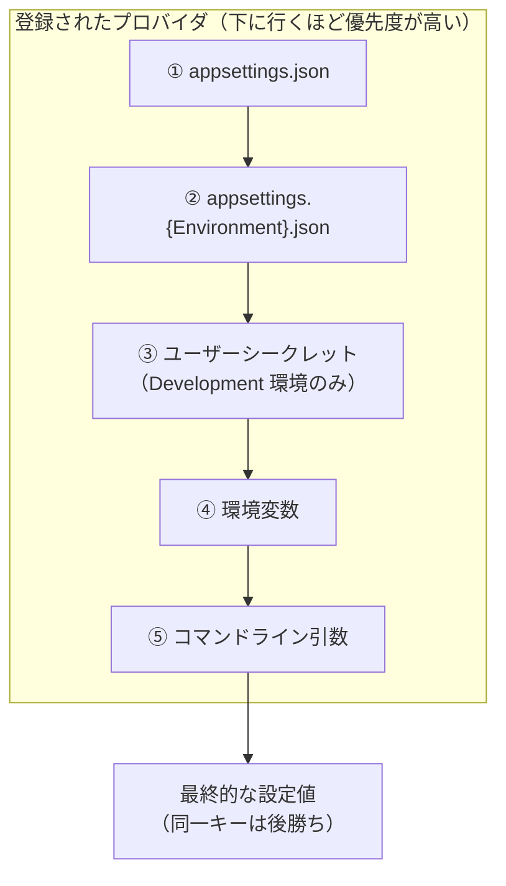
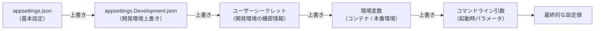

# 第5章：アプリ設定 (Configuration)

---

## 目次

1. [appsettings.json / 環境別設定（Development / Production 等）](#1-appsettingsjson--環境別設定development--production-等)
   - [appsettings.json の基本構造](#appsettingsjson-の基本構造)
   - [IConfiguration による設定値の取得](#iconfiguration-による設定値の取得)
   - [環境別設定ファイル](#環境別設定ファイル)
   - [実行環境の切り替え](#実行環境の切り替え)
2. [環境変数 / コマンドライン引数 / シークレット管理](#2-環境変数--コマンドライン引数--シークレット管理)
   - [環境変数](#環境変数)
   - [コマンドライン引数](#コマンドライン引数)
   - [シークレット管理（User Secrets）](#シークレット管理user-secrets)
3. [IOptions&lt;T&gt; / オプションバインディング](#3-ioptionst--オプションバインディング)
   - [オプションパターンとは](#オプションパターンとは)
   - [オプションクラスの定義と登録](#オプションクラスの定義と登録)
   - [IOptions&lt;T&gt;・IOptionsSnapshot&lt;T&gt;・IOptionsMonitor&lt;T&gt;](#ioptionst-ioptionssnapshott-ioptionsmonitort)
   - [名前付きオプション](#名前付きオプション)
   - [バリデーション](#バリデーション)
   - [DI を使わない直接バインド](#di-を使わない直接バインド)
4. [設定のオーバーライド順序と仕組み](#4-設定のオーバーライド順序と仕組み)
   - [構成プロバイダの仕組み](#構成プロバイダの仕組み)
   - [WebApplication.CreateBuilder() 既定のプロバイダ一覧と優先順位](#webapplicationcreatebuilder-既定のプロバイダ一覧と優先順位)
   - [プロバイダのカスタマイズ](#プロバイダのカスタマイズ)
5. [参考ドキュメント](#5-参考ドキュメント)

---

## 1. appsettings.json / 環境別設定（Development / Production 等）

### appsettings.json の基本構造

ASP.NET Core アプリケーションでは、設定値を **JSON ファイル** や環境変数、コマンドライン引数など複数のソースから読み込む仕組みが標準で組み込まれています。  
最も基本となる設定ファイルが `appsettings.json` であり、ASP.NET Core プロジェクトテンプレートにより最初から生成されています。  
`appsettings.json` は **JSON 形式の階層構造** を持ち、ログレベルや接続文字列、アプリケーション固有の設定値をプロジェクトルートに配置して管理します。

次に示すのは既定で作成される `appsettings.json` です。

```json:appsettings.json
{
  "Logging": {
    "LogLevel": {
      "Default": "Information",
      "Microsoft.AspNetCore": "Warning"
    }
  },
  "AllowedHosts": "*"
}
```

独自の設定値は次のように設定します。

```diff
{
  "Logging": {
    "LogLevel": {
      "Default": "Information",
      "Microsoft.AspNetCore": "Warning"
    }
  },
-  "AllowedHosts": "*"
+  "AllowedHosts": "*",
+  "ConnectionStrings": {
+    "DefaultConnection": "Server=localhost;Database=MyDb;Trusted_Connection=True;"
+  },
+  "MyFeature": {
+    "Title": "Hello",
+    "Enabled": true,
+    "MaxItems": 100
+  }
}
```

`appsettings.json` はアプリケーションの起動時に読み込まれ、変更を検知して自動的に再読み込みを行う `reloadOnChange: true` 設定が既定で有効です。  
なお `appsettings.json` はソースコードリポジトリにコミットされるため、データベースのパスワードや API キーなどの機密情報は記述しないよう注意が必要です（機密情報の管理については「[2. 環境変数 / コマンドライン引数 / シークレット管理](#2-環境変数--コマンドライン引数--シークレット管理)」節を参照）。

> [!TIP]
> `appsettings.json` は、Java の Spring Boot における `application.properties` / `application.yml` 、Ruby on Rails の `config/*.yml` と同様に、アプリケーション設定を一元管理するファイルです。

### IConfiguration による設定値の取得

`appsettings.json` の設定値はアプリケーション内で `IConfiguration` インターフェイスを通じて取得できます。  
階層構造を持つキーは **コロン（ `:` ）区切り** で指定します。  
例えば上記の `appsettings.json` の場合、 `"MyFeature:Title"` で `"Hello"` が取得できます。

再掲
```json
{
  "Logging": {
    "LogLevel": {
      "Default": "Information",
      "Microsoft.AspNetCore": "Warning"
    }
  },
  "AllowedHosts": "*",
  "ConnectionStrings": {
    "DefaultConnection": "Server=localhost;Database=MyDb;Trusted_Connection=True;"
  },
  "MyFeature": {
    "Title": "Hello",
    "Enabled": true,
    "MaxItems": 100
  }
}
```

```csharp
// Program.cs（または DI 経由でサービスやコントローラーに注入して使用）
var builder = WebApplication.CreateBuilder(args);

// IConfiguration には builder.Configuration でアクセスする
var title = builder.Configuration["MyFeature:Title"];                          // "Hello"
var maxItems = builder.Configuration.GetValue<int>("MyFeature:MaxItems");     // 100
var connStr = builder.Configuration.GetConnectionString("DefaultConnection"); // 接続文字列（ConnectionStrings:DefaultConnection の省略形）
```

`GetValue<T>(key)` はキーに対応する値を指定した型で取得するメソッドです。キーが存在しない場合は型の既定値を返します。  
`GetConnectionString(name)` は `appsettings.json` 内の `ConnectionStrings:{name}` を読み込む省略記法です。  
また、 `GetSection(key)` でネストしたセクションを `IConfigurationSection` として取り出し、さらにそのセクション配下のキーを参照することもできます。

```csharp
// セクションを取り出してキーを参照する例
var section = builder.Configuration.GetSection("MyFeature");
var enabled = section.GetValue<bool>("Enabled");  // true
```

> [!TIP]
> `IConfiguration["Key"]` による設定値の直接取得は、Spring Boot の `@Value("${my-feature.title}")` でフィールドに設定値をインジェクトする方法に相当します。  
> ただし ASP.NET Core では DI コンテナを介したコンストラクタインジェクションが主流であり、コントローラーやサービスでは `IConfiguration` を DI で注入して使用するのが一般的です。

> [!TIP]
> 各 IDE では、 `appsettings.json` の編集時に既知のキー（ `Logging` 、 `ConnectionStrings` 、 `AllowedHosts` など）に対する **IntelliSense（補完・型チェック）** が利用できます。`Logging.LogLevel` のキー名や値の候補が自動的に補完され、JSON の構文エラーもリアルタイムで検出されます。
>
> - **Visual Studio** : 組み込みの JSON エディターが ASP.NET Core のスキーマを認識し、補完と構文検証を提供します。
> - **VS Code** : 組み込みの JSON 言語機能（`vscode.json-language-features`）が SchemaStore（`https://json.schemastore.org/appsettings.json`）からスキーマを自動取得することで同様の機能が提供されます。特別な設定や拡張機能のインストールは不要です。

### 環境別設定ファイル

ASP.NET Core では、 `appsettings.json` に加え **`appsettings.{Environment}.json`** という環境別設定ファイルが利用できます。  
例えば `appsettings.Development.json` や `appsettings.Production.json` を用意することで、実行環境ごとに設定値を上書きできます。

```text
📁 プロジェクトルート/
├── 📄 appsettings.json               # 全環境共通の基本設定
├── 📄 appsettings.Development.json   # 開発環境でのみ上書きされる設定
├── 📄 appsettings.Production.json    # 本番環境でのみ上書きされる設定
└── 📄 appsettings.Staging.json       # ステージング環境でのみ上書きされる設定（任意）
```

環境別設定ファイルは基本の `appsettings.json` の **上書き（マージ）** として機能します。  
同じキーがある場合は環境別ファイルの値が優先され、 `appsettings.json` にしかないキーはそのまま維持されます。  
例えば `appsettings.Development.json` で接続文字列だけ開発用 DB に書き換えれば、その他の設定は `appsettings.json` を引き継ぎます。

```json
// appsettings.Development.json（開発環境専用の上書き）
{
  "Logging": {
    "LogLevel": {
      "Default": "Debug"
    }
  },
  "ConnectionStrings": {
    "DefaultConnection": "Server=localhost;Database=MyDb_Dev;Trusted_Connection=True;"
  }
}
```

> [!NOTE]
> `appsettings.Development.json` は、ログレベルの変更など **チーム全員が共有する開発用の既定設定** を記述するファイルであり、通常はリポジトリへのコミット対象になります。  
> 開発者ごとに異なるローカル環境の設定（例：各自の DB 接続先）や機密情報（パスワードなど）は記述しないようにしてください。  
> そのような per-developer の設定や機密情報は後述の **ユーザーシークレット（User Secrets）** で管理します。

### 実行環境の切り替え

読み込む環境別設定ファイルは **`ASPNETCORE_ENVIRONMENT`** 環境変数によって決まります。  
この変数に `Development` / `Staging` / `Production` などの値を設定することで、対応する `appsettings.{Environment}.json` が読み込まれます。  
未設定の場合は `Production` として動作します。

> [!TIP]
> `ASPNETCORE_ENVIRONMENT` は Spring Boot の `spring.profiles.active` 、Laravel の `APP_ENV` 、Node.js の `NODE_ENV` に相当します。

`ASPNETCORE_ENVIRONMENT` はローカル開発では `Properties/launchSettings.json` で管理するのが一般的です（詳しくは [第2章：ソリューションとプロジェクト構成 - デバッグ設定・起動構成の管理](./02-solutions-and-projects.md##5-デバッグ設定起動構成の管理) を参照）。

```json
// Properties/launchSettings.json（抜粋）
{
  "profiles": {
    "https": {
      "commandName": "Project",
      "dotnetRunMessages": true,
      "launchBrowser": true,
      "applicationUrl": "https://localhost:7001;http://localhost:5001",
      "environmentVariables": {
        "ASPNETCORE_ENVIRONMENT": "Development"
      }
    }
  }
}
```

本番環境やコンテナ環境では、OS の環境変数として `ASPNETCORE_ENVIRONMENT` に `Production` を設定します。

```bash
# Linux / macOS の場合
export ASPNETCORE_ENVIRONMENT=Production

# Windows（PowerShell）の場合
$env:ASPNETCORE_ENVIRONMENT = "Production"
```

コード内で現在の実行環境を判定するには `IWebHostEnvironment`（または `IHostEnvironment`）を使用します。

```csharp
// Program.cs でのアクセス例
if (app.Environment.IsDevelopment())
{
    app.UseDeveloperExceptionPage();  // 開発環境専用の詳細エラーページを有効化
}
```

```csharp
// DI 経由でコントローラーやサービスに注入して使う例
public class MyService
{
    private readonly IWebHostEnvironment _env;

    public MyService(IWebHostEnvironment env)
    {
        _env = env;
    }

    public void DoSomething()
    {
        if (_env.IsProduction())
        {
            // 本番環境のみの処理
        }
    }
}
```

| 環境名 | `IsDevelopment()` | `IsStaging()` | `IsProduction()` |
| --- | --- | --- | --- |
| `Development` | `true` | `false` | `false` |
| `Staging` | `false` | `true` | `false` |
| `Production` | `false` | `false` | `true` |
| カスタム（例: `Testing`）| `false` | `false` | `false` |

カスタム環境名（例えば `Testing` や `QA` など）を使用することも可能です。その場合は `app.Environment.IsEnvironment("Testing")` のように `IsEnvironment(name)` で判定します。

---

## 2. 環境変数 / コマンドライン引数 / シークレット管理

### 環境変数

**環境変数** は `appsettings.json` の設定値を上書きするための主要な手段の一つです。  
コンテナ（Docker、Kubernetes）やクラウドプラットフォーム（Azure App Service、AWS など）でのデプロイ時に設定値を外部から注入する場合によく利用されます。

ASP.NET Core では環境変数で設定を定義する際、 **階層的なキーの区切り文字として `__`（アンダースコア 2 つ）** を使用します。  
これは `:` が OS によっては環境変数のキー名として利用できない場合があるためです。

再掲
```json
{
  "Logging": {
    "LogLevel": {
      "Default": "Information",
      "Microsoft.AspNetCore": "Warning"
    }
  },
  "AllowedHosts": "*",
  "ConnectionStrings": {
    "DefaultConnection": "Server=localhost;Database=MyDb;Trusted_Connection=True;"
  },
  "MyFeature": {
    "Title": "Hello",
    "Enabled": true,
    "MaxItems": 100
  }
}
```

Bash

```bash
# appsettings.json の "MyFeature:Title" を上書きする環境変数（Linux / macOS）
export MyFeature__Title=OverrideValue

# 接続文字列を上書きする
export ConnectionStrings__DefaultConnection="Server=prod;Database=MyDb;"
```

PowerShell

```powershell
# Windows（PowerShell）
$env:MyFeature__Title = "OverrideValue"
$env:ConnectionStrings__DefaultConnection = "Server=prod;Database=MyDb;"
```

`AddEnvironmentVariables(prefix: "...")` を使うと、**その呼び出しで追加される環境変数プロバイダ** は、指定したプレフィックスを持つ環境変数だけを対象にします。  
このとき、設定キーとして登録される際にはプレフィックス部分は取り除かれます。これにより、他のアプリケーション向けの環境変数と名前空間を分けやすくなります。

```csharp
// このプロバイダでは "MYAPP_" プレフィックスを持つ環境変数だけを対象にする
builder.Configuration.AddEnvironmentVariables(prefix: "MYAPP_");
// → "MYAPP_MyFeature__Title" という環境変数が "MyFeature:Title" として読み込まれる
```

> [!WARNING]
> `WebApplication.CreateBuilder(args)` は既定で `AddEnvironmentVariables()` （プレフィックスなし）を登録します。したがって、後から `AddEnvironmentVariables(prefix: "MYAPP_")` を追加しても、既定の環境変数プロバイダは削除されません。そのため、最終的な `builder.Configuration` では `MYAPP_` プレフィックスを持たない環境変数（例：`Age`、`ASPNETCORE_ENVIRONMENT` など）も引き続き参照できます。
>
> つまり、`prefix` パラメータは「この呼び出しで追加するプロバイダがどの環境変数を読むか」を制御するものであり、「アプリケーション全体でそのプレフィックス以外の環境変数を無効化する」ものではありません。
>
> もし本当に **アプリケーション全体として特定のプレフィックスの環境変数だけ** を使いたい場合は、既定のプロバイダをクリアしてから新しいプロバイダを登録する必要があります（詳細は [プロバイダのカスタマイズ](#プロバイダのカスタマイズ) を参照）：
>
> ```csharp
> builder.Configuration.Sources.Clear();  // 既定のプロバイダをすべて削除
> builder.Configuration
>     .AddJsonFile("appsettings.json", optional: false, reloadOnChange: true)
>     .AddJsonFile($"appsettings.{builder.Environment.EnvironmentName}.json", optional: true, reloadOnChange: true)
>     .AddEnvironmentVariables(prefix: "MYAPP_")  // これだけが環境変数プロバイダ
>     .AddCommandLine(args);
> ```

> [!TIP]
> 環境変数による設定注入は、Twelve-Factor App の原則「III. Config」で推奨されているアプローチです。  
> Spring Boot でも `SPRING_DATASOURCE_URL` のようにアンダースコア区切りで環境変数を設定する慣習があり、ASP.NET Core の `__` 区切りとは書き方が異なりますが概念は同様です。  
> Docker Compose では `environment:` セクション、Kubernetes では `env:` や `envFrom:` で注入する形が一般的です。

### コマンドライン引数

アプリケーション起動時に **コマンドライン引数** で設定値を渡すことができます。  
コマンドライン引数は既定での優先度が最も高く（詳細は [4. 設定のオーバーライド順序と仕組み](#4-設定のオーバーライド順序と仕組み) を参照）、 `appsettings.json` や環境変数の値を上書きします。  
主にローカルでの試験や CI/CD でのパラメータ渡しに利用します。

```bash
# dotnet run でコマンドライン引数を渡す例（-- の後に引数を指定）
dotnet run -- --MyFeature:Title=OverrideValue

# スラッシュ形式でも記述可能O
dotnet run -- /MyFeature:Title=OverrideValue

# スペース区切りでも記述可能
dotnet run -- --MyFeature:Title OverrideValue
```

また、短いエイリアスを定義したい場合は **スイッチマッピング** を使用できます。

```csharp
// Program.cs でスイッチマッピングを定義する例
var switchMappings = new Dictionary<string, string>
{
    ["-t"] = "MyFeature:Title",
    ["-m"] = "MyFeature:MaxItems"
};
builder.Configuration.AddCommandLine(args, switchMappings);
// → dotnet run -- -t=OverrideValue のように短縮形で指定できる
```

### シークレット管理（User Secrets）

データベースのパスワードや API キーなどの **機密情報** をソースコードやリポジトリに含めることはセキュリティ上のリスクとなります。  
ASP.NET Core では開発環境専用の機密情報管理として **ユーザーシークレット（User Secrets）** が用意されています。

ユーザーシークレットはプロジェクトファイルとは無関係な場所（OS の個人フォルダ配下）に保存されるため、 **ソースコードリポジトリにコミットされることなく** 、開発者の手元だけで機密情報を管理できます。

| OS | 保存場所 |
| --- | --- |
| Windows | `%APPDATA%\Microsoft\UserSecrets\{UserSecretsId}\secrets.json` |
| Linux / macOS | `~/.microsoft/usersecrets/{UserSecretsId}/secrets.json` |

> [!NOTE]
> ユーザーシークレットは **開発環境専用** の仕組みです。ステージングや本番環境では、環境変数または Azure Key Vault、AWS Secrets Manager、HashiCorp Vault などのシークレット管理サービスを利用してください。

#### 初期化と使い方

ユーザーシークレットを使用するには、まず `dotnet user-secrets init` でプロジェクトに `UserSecretsId` を設定します。

<details>
<summary>CLI</summary>

```bash
# プロジェクトフォルダで実行（.csproj がある場所）
dotnet user-secrets init

# シークレットを設定する
dotnet user-secrets set "ConnectionStrings:DefaultConnection" "Server=dev;Database=MyDb_Dev;"
dotnet user-secrets set "ExternalApi:ApiKey" "my-secret-api-key"

# 設定されているシークレット一覧を表示する
dotnet user-secrets list

# 特定のシークレットを削除する
dotnet user-secrets remove "ExternalApi:ApiKey"

# 全シークレットを削除する
dotnet user-secrets clear
```

</details>

`dotnet user-secrets init` を実行すると、プロジェクトファイル（`.csproj`）に `UserSecretsId` が追加されます。

```xml
<!-- dotnet user-secrets init 実行後の .csproj（抜粋） -->
<PropertyGroup>
  <TargetFramework>net10.0</TargetFramework>
  <UserSecretsId>xxxxxxxx-xxxx-xxxx-xxxx-xxxxxxxxxxxx</UserSecretsId>
</PropertyGroup>
```

ユーザーシークレットは `Development` 環境かつ `UserSecretsId` が設定されている場合に自動的に読み込まれます。  
コード上では `appsettings.json` と同じインターフェイスで設定値にアクセスできます。

```csharp
// appsettings.json と同じ方法でシークレットにアクセスできる
var apiKey = builder.Configuration["ExternalApi:ApiKey"];
var connStr = builder.Configuration.GetConnectionString("DefaultConnection");
```

#### IDE での操作

各 IDE では、ユーザーシークレットの編集を GUI から行える機能が提供されています。

<details>
<summary>Visual Studio</summary>

ソリューション エクスプローラーでプロジェクトを右クリックし、「**ユーザー シークレットの管理**」を選択します。  
`secrets.json` ファイルがエディターで直接開かれ、JSON 形式でシークレットを編集できます。  
`dotnet user-secrets init` による初期化も、この操作の初回実行時に自動で行われます。

</details>

<details>
<summary>VS Code（C# Dev Kit）</summary>

VS Code（C# Dev Kit）では専用 GUI はありません。統合ターミナル（`Ctrl+@`）から `dotnet user-secrets` コマンドを実行してシークレットを管理します。

```bash
# VS Code の統合ターミナルから実行する例
dotnet user-secrets set "ExternalApi:ApiKey" "my-secret-api-key"
```

</details>

---

## 3. IOptions&lt;T&gt; / オプションバインディング

### オプションパターンとは

設定値を直接 `IConfiguration["Key"]` で取得する方法は手軽ですが、大規模なアプリケーションでは「どのキーがどこで使われているか分からない」「型の不一致に気付きにくい」といった問題が発生しがちです。  
こうした課題を解決するのが **オプションパターン（Options Pattern）** です。

オプションパターンでは、設定セクションを **POCO（Plain Old CLR Object）クラス** にバインドし、DI コンテナ経由で型安全に設定値を利用します。  
これにより、設定値へのアクセスがクラスのプロパティとして強く型付けされ、IDE の補完やリファクタリングが有効になります。

> [!TIP]
> Spring Boot には設定値を扱う方法が主に 2 種類あります。
> 
> - `@Value("${my-feature.title}")` でフィールドごとに設定値をインジェクトする方法 → `IConfiguration["Key"]` による直接アクセスに相当
> - `@ConfigurationProperties(prefix = "my-feature")` でクラスに設定セクションをバインドする方法 → **オプションパターン**に相当
> 
> 大規模アプリケーションでは `@ConfigurationProperties` が推奨されるのと同様に、ASP.NET Core でもオプションパターンの使用が推奨されています。

### オプションクラスの定義と登録

まず、設定セクションに対応する **オプションクラス（POCO）** を定義します。  
プロパティ名は `appsettings.json` のキー名と一致させます（大文字・小文字は区別されません）。

```csharp
// Options/MyFeatureOptions.cs
public class MyFeatureOptions
{
    // セクション名を定数として持つと登録時に使いやすい
    public const string SectionName = "MyFeature";

    public string Title { get; set; } = string.Empty;
    public bool Enabled { get; set; }
    public int MaxItems { get; set; }
}
```

```json
// appsettings.jsonの一部（再掲）
{
  "MyFeature": {
    "Title": "Hello",
    "Enabled": true,
    "MaxItems": 100
  }
}
```

次に `Program.cs` でオプションクラスを DI コンテナに登録します。

```csharp
// Program.cs
var builder = WebApplication.CreateBuilder(args);

// MyFeature セクションを MyFeatureOptions クラスにバインドして DI に登録する
builder.Services.Configure<MyFeatureOptions>(
    builder.Configuration.GetSection(MyFeatureOptions.SectionName));
```

これだけで、 `IOptions<MyFeatureOptions>` を DI 経由で注入して利用できるようになります。

### IOptions&lt;T&gt;・IOptionsSnapshot&lt;T&gt;・IOptionsMonitor&lt;T&gt;

設定値の注入には `IOptions<T>` 、 `IOptionsSnapshot<T>` 、 `IOptionsMonitor<T>` の 3 種類のインターフェイスが用意されています。  
それぞれ特性が異なるため、用途に合わせて使い分けます。

| インターフェイス | DI ライフタイム | 再読み込み | 主な用途 |
| --- | --- | --- | --- |
| `IOptions<T>` | シングルトン | なし（起動時に 1 回のみ読み込み） | 起動後に変更されない設定値の参照 |
| `IOptionsSnapshot<T>` | スコープ | リクエストごと（HTTP リクエスト間で再読み込み） | HTTP リクエスト単位で最新値を参照したい場合 |
| `IOptionsMonitor<T>` | シングルトン | リアルタイム変更通知あり | シングルトン サービスで常に最新の設定値を参照したい場合 |

```csharp
// IOptions<T>：起動時に一度だけ読み込まれる（シングルトン）
public class MyService
{
    private readonly MyFeatureOptions _options;

    public MyService(IOptions<MyFeatureOptions> options)
    {
        _options = options.Value;  // .Value で設定値にアクセス
    }

    public string GetTitle() => _options.Title;
}
```

```csharp
// Minimal API での IOptions<T> の使用例
// ルートハンドラーのパラメーターに直接 IOptions<T> を宣言すると DI から自動注入される
app.MapGet("/feature", (IOptions<MyFeatureOptions> options) =>
{
    var opt = options.Value;  // .Value で設定値にアクセス
    return Results.Ok(new { opt.Title, opt.MaxItems });
});
```

```csharp
// IOptionsSnapshot<T>：HTTP リクエストごとに最新値を取得（スコープ）
public class MyController : ControllerBase
{
    private readonly MyFeatureOptions _options;

    public MyController(IOptionsSnapshot<MyFeatureOptions> snapshot)
    {
        _options = snapshot.Value;  // リクエストのたびに最新値が取得される
    }
}
```

```csharp
// Minimal API での IOptionsSnapshot<T> の使用例
// Minimal API のルートハンドラーはリクエストスコープ内で実行されるため、IOptionsSnapshot<T> を直接注入できる
app.MapGet("/feature/snapshot", (IOptionsSnapshot<MyFeatureOptions> snapshot) =>
{
    var opt = snapshot.Value;  // リクエストごとに最新値が取得される
    return Results.Ok(new { opt.Title, opt.Enabled });
});
```

```csharp
// IOptionsMonitor<T>：リアルタイムで設定変更を検知できる（シングルトン）
public class MyBackgroundService : BackgroundService
{
    private readonly IOptionsMonitor<MyFeatureOptions> _monitor;

    public MyBackgroundService(IOptionsMonitor<MyFeatureOptions> monitor)
    {
        _monitor = monitor;

        // 設定変更時にコールバックを受け取る
        _monitor.OnChange(options =>
        {
            Console.WriteLine($"設定が変更されました: Title={options.Title}");
        });
    }

    protected override async Task ExecuteAsync(CancellationToken stoppingToken)
    {
        while (!stoppingToken.IsCancellationRequested)
        {
            var current = _monitor.CurrentValue;  // .CurrentValue で常に最新値を参照
            // current.Title などを使った処理
            await Task.Delay(TimeSpan.FromSeconds(5), stoppingToken);
        }
    }
}
```

```csharp
// Minimal API での IOptionsMonitor<T> の使用例
// IOptionsMonitor<T> はシングルトンのため、Minimal API のルートハンドラーにも直接注入できる
app.MapGet("/feature/monitor", (IOptionsMonitor<MyFeatureOptions> monitor) =>
{
    var opt = monitor.CurrentValue;  // .CurrentValue で常に最新値を参照
    return Results.Ok(new { opt.Title, opt.MaxItems });
});
```

> [!NOTE]
> `IOptionsSnapshot<T>` は **スコープ サービス** のため、シングルトン サービスのコンストラクタには注入できません。  
> シングルトン サービスで常に最新の設定値を参照したい場合は `IOptionsMonitor<T>` を使用してください。

### 名前付きオプション

同一のオプション型に複数の設定セクションをバインドする **名前付きオプション** も利用できます。  
例えば複数の外部サービス設定を 1 つのクラスで扱いたい場合に便利です。

```json
// appsettings.json（抜粋）
{
  "Auth": {
    "Google": { "ClientId": "google-client-id", "ClientSecret": "google-secret" },
    "GitHub": { "ClientId": "github-client-id", "ClientSecret": "github-secret" }
  }
}
```

```csharp
// オプションクラス定義
public class OAuthOptions
{
    public string ClientId { get; set; } = string.Empty;
    public string ClientSecret { get; set; } = string.Empty;
}

// 名前付きで登録
builder.Services.Configure<OAuthOptions>("Google", builder.Configuration.GetSection("Auth:Google"));
builder.Services.Configure<OAuthOptions>("GitHub", builder.Configuration.GetSection("Auth:GitHub"));
```

```csharp
// IOptionsMonitor<T>.Get(name) で名前を指定して取得
public class AuthService
{
    private readonly IOptionsMonitor<OAuthOptions> _monitor;

    public AuthService(IOptionsMonitor<OAuthOptions> monitor)
    {
        _monitor = monitor;
    }

    public OAuthOptions GetGoogleOptions() => _monitor.Get("Google");
    public OAuthOptions GetGitHubOptions() => _monitor.Get("GitHub");
}
```

### バリデーション

オプションクラスのプロパティに **DataAnnotations 属性** を付与することで、設定値の検証を行えます。  
`ValidateOnStart()` を指定するとアプリケーション起動時に検証が実行され、設定値が不正な場合は起動時点で例外がスローされます（デプロイ後に問題が顕在化するのを防ぐ効果があります）。

```csharp
// Options/MyFeatureOptions.cs（バリデーション属性を追加）
using System.ComponentModel.DataAnnotations;

public class MyFeatureOptions
{
    public const string SectionName = "MyFeature";

    [Required(ErrorMessage = "Title は必須です")]
    public string Title { get; set; } = string.Empty;

    public bool Enabled { get; set; }

    [Range(1, 1000, ErrorMessage = "MaxItems は 1 から 1000 の範囲で指定してください")]
    public int MaxItems { get; set; }
}
```

```csharp
// Program.cs でバリデーションを有効化する
builder.Services.AddOptions<MyFeatureOptions>()
    .BindConfiguration(MyFeatureOptions.SectionName)  // セクションをバインド
    .ValidateDataAnnotations()                         // DataAnnotations による検証を有効化
    .ValidateOnStart();                                // アプリ起動時に検証を実行（.NET 6 以降）
```

> [!NOTE]
> `AddOptions<T>().BindConfiguration(sectionName)` は `Configure<T>(builder.Configuration.GetSection(sectionName))` と同等ですが、 `.ValidateDataAnnotations()` や `.ValidateOnStart()` をチェーンで続けて記述できるため、バリデーションを追加する場合に適しています。

### DI を使わない直接バインド

DI を使わずにオプションクラスへ直接バインドする方法もあります。  
`Program.cs` の起動処理など、DI コンテナが構築される前の段階で設定値を読みたい場合に便利です。

```csharp
// GetSection().Get<T>() でオプションクラスへ直接取得する（DI 不要）
var options = builder.Configuration
    .GetSection(MyFeatureOptions.SectionName)
    .Get<MyFeatureOptions>();

Console.WriteLine(options?.Title);  // "Hello"
```

```csharp
// Bind() メソッドを使った方法（既存インスタンスに値をセットする）
var options = new MyFeatureOptions();
builder.Configuration.GetSection(MyFeatureOptions.SectionName).Bind(options);
```

---

## 4. 設定のオーバーライド順序と仕組み

### 構成プロバイダの仕組み

ASP.NET Core の設定は **構成プロバイダ（Configuration Provider）** と呼ばれる拡張可能な仕組みで構築されています。  
各プロバイダはキーと値のペアのコレクションを提供し、複数のプロバイダが **登録された順に結合** されます。  
同一キーに複数のプロバイダが値を持つ場合、 **後から登録されたプロバイダの値が優先（上書き）** されます（"last-wins" 方式）。



### WebApplication.CreateBuilder() 既定のプロバイダ一覧と優先順位

`WebApplication.CreateBuilder(args)` を呼び出すと、以下のプロバイダが既定で順番に登録されます。

| 優先度（低→高） | プロバイダ | 説明 |
| --- | --- | --- |
| 1 | `appsettings.json` | プロジェクトルートの基本設定ファイル |
| 2 | `appsettings.{Environment}.json` | 環境別の上書き設定ファイル |
| 3 | ユーザーシークレット | `Development` 環境かつ `UserSecretsId` 設定時のみ |
| 4 | 環境変数 | OS の環境変数（ `__` 区切りで階層を表現） |
| 5 | コマンドライン引数 | 最高優先度（他のすべてのプロバイダを上書き可能） |

この優先順位により、例えば `appsettings.json` に設定されたデータベース接続文字列を、本番環境では環境変数で安全に上書きするといった運用が実現できます。



具体例として、接続文字列が複数のプロバイダで定義されている場合の優先順位を示します。

```json
// appsettings.json
{ "ConnectionStrings": { "DefaultConnection": "Server=default;" } }
```

```json
// appsettings.Development.json
{ "ConnectionStrings": { "DefaultConnection": "Server=dev;" } }
```

```bash
# 環境変数
ConnectionStrings__DefaultConnection=Server=prod;
```

```bash
# コマンドライン引数
dotnet run -- --ConnectionStrings:DefaultConnection="Server=override;"
```

この場合、最終的に使用される接続文字列は `"Server=override;"` （コマンドライン引数の値）になります。

> [!NOTE]
> `DOTNET_ENVIRONMENT` 環境変数も `ASPNETCORE_ENVIRONMENT` と同様に実行環境の切り替えに使用できますが、 `ASPNETCORE_ENVIRONMENT` の方が優先されます。  
> ホスト構成（`ASPNETCORE_` プレフィックスを持つ変数）はアプリケーション構成より前に読み込まれるため、 `ASPNETCORE_ENVIRONMENT` は必ず環境の切り替えに機能します。

### プロバイダのカスタマイズ

既定のプロバイダ構成を変更したい場合は、 `builder.Configuration` の `Sources` を操作します。  
例えば既定プロバイダをすべて削除して独自の順序で再登録したり、独自のプロバイダを追加したりできます。

```csharp
// 既定のプロバイダを削除して順序を明示的に再定義する例
builder.Configuration.Sources.Clear();  // 既定のプロバイダをすべて削除

builder.Configuration
    .AddJsonFile("appsettings.json", optional: false, reloadOnChange: true)
    .AddJsonFile($"appsettings.{builder.Environment.EnvironmentName}.json",
        optional: true, reloadOnChange: true)
    .AddUserSecrets<Program>(optional: true)  // optional: true にすると UserSecretsId 未設定でもエラーにならない
    .AddEnvironmentVariables()
    .AddCommandLine(args);
```

プロバイダ追加時の主なオプションは以下の通りです。

| オプション | 説明 |
| --- | --- |
| `optional: false`（既定） | ファイルが存在しない場合に例外をスロー |
| `optional: true` | ファイルが存在しない場合もスキップ（エラーにしない） |
| `reloadOnChange: true` | ファイルの変更を監視し、変更時に設定を自動再読み込み |

> [!TIP]
> Azure Key Vault、AWS Parameter Store、HashiCorp Vault などのクラウドシークレット管理サービスも、対応する NuGet パッケージを追加することでカスタム構成プロバイダとして登録できます。  
> 例えば Azure Key Vault の場合は `Azure.Extensions.AspNetCore.Configuration.Secrets` パッケージを使い、 `builder.Configuration.AddAzureKeyVault(...)` のように追加します。

また、.NET 8 以降で利用できる `WebApplication.CreateSlimBuilder()` は Web アプリケーションのトリミング（Tree Shaking）や AOT（Ahead of Time）コンパイルに対応した最小構成の `WebApplicationBuilder` です。  
このビルダーでは `appsettings.{Environment}.json` やユーザーシークレットが既定では読み込まれないため、必要に応じて手動で追加する必要があります。  
通常の Web アプリケーション開発では `WebApplication.CreateBuilder()` を使用してください。

---

## 5. 参考ドキュメント

- [ASP.NET Core の構成 | Microsoft Learn](https://learn.microsoft.com/ja-jp/aspnet/core/fundamentals/configuration/?view=aspnetcore-10.0)
- [ASP.NET Core のオプション パターン | Microsoft Learn](https://learn.microsoft.com/ja-jp/aspnet/core/fundamentals/configuration/options?view=aspnetcore-10.0)
- [ASP.NET Core での開発におけるアプリ シークレットの安全な保存 | Microsoft Learn](https://learn.microsoft.com/ja-jp/aspnet/core/security/app-secrets?view=aspnetcore-10.0)
- [ASP.NET Core で複数の環境を使用する | Microsoft Learn](https://learn.microsoft.com/ja-jp/aspnet/core/fundamentals/environments?view=aspnetcore-10.0)
- [.NET の構成 | Microsoft Learn](https://learn.microsoft.com/ja-jp/dotnet/core/extensions/configuration)
- [.NET の構成プロバイダー | Microsoft Learn](https://learn.microsoft.com/ja-jp/dotnet/core/extensions/configuration-providers)
