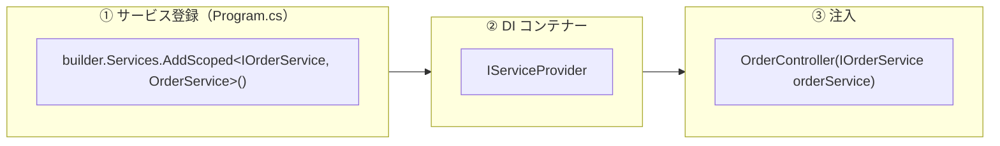
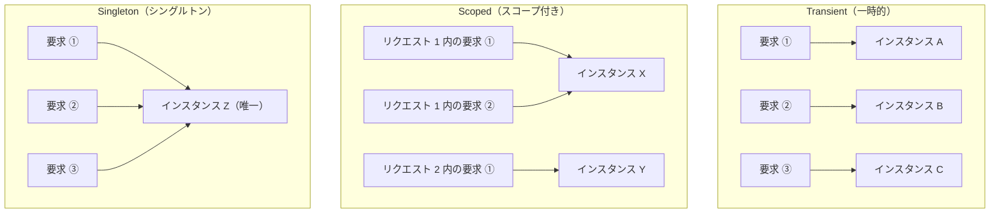
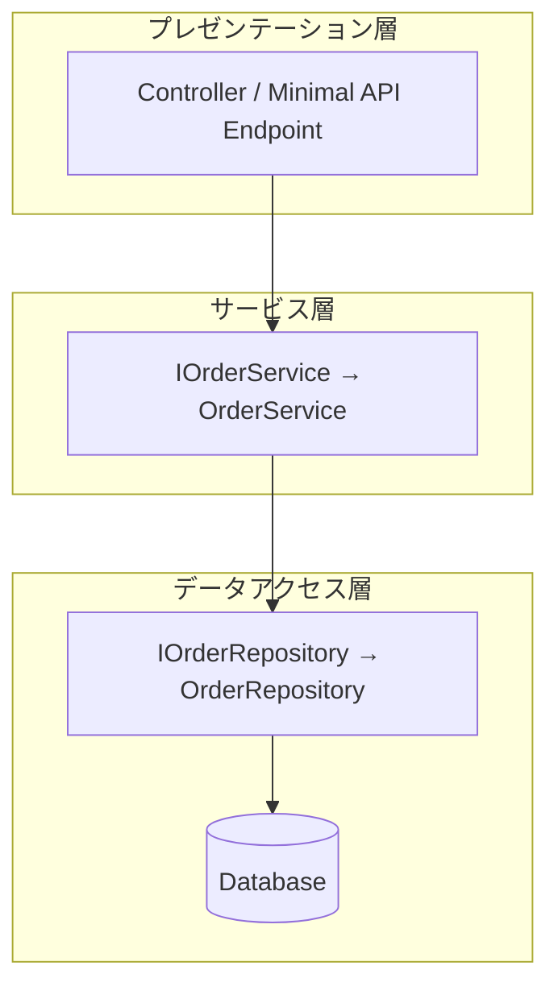
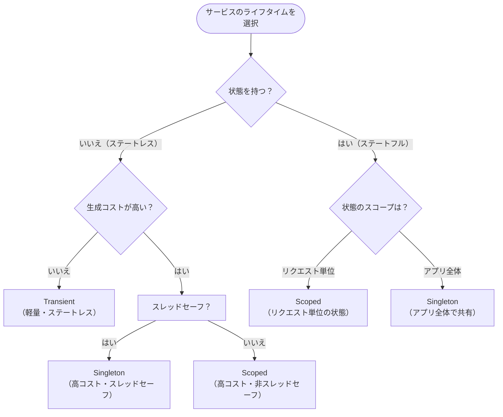

# 第6章：依存性注入 (DI)

---

## 目次

1. [DI の基本概念（Interface と具象クラス）](#1-di-の基本概念interface-と具象クラス)
   - [依存性注入とは](#依存性注入とは)
   - [インターフェースと具象クラスによる抽象化](#インターフェースと具象クラスによる抽象化)
   - [ASP.NET Core 組み込みの DI コンテナー](#aspnet-core-組み込みの-di-コンテナー)
   - [コンストラクターインジェクション](#コンストラクターインジェクション)
   - [プライマリコンストラクターによる注入（C# 12）](#プライマリコンストラクターによる注入c-12)
   - [Minimal API でのサービス注入](#minimal-api-でのサービス注入)
2. [サービスの登録スコープ（Transient / Scoped / Singleton）](#2-サービスの登録スコープtransient--scoped--singleton)
   - [3 つのライフタイムの概要](#3-つのライフタイムの概要)
   - [Transient（一時的）](#transient一時的)
   - [Scoped（スコープ付き）](#scopedスコープ付き)
   - [Singleton（シングルトン）](#singletonシングルトン)
   - [ライフタイムの動作を確認するサンプル](#ライフタイムの動作を確認するサンプル)
   - [スコープバリデーション](#スコープバリデーション)
3. [ファクトリ登録、条件付き登録、手動スコープ](#3-ファクトリ登録条件付き登録手動スコープ)
   - [ファクトリデリゲートによる登録](#ファクトリデリゲートによる登録)
   - [既存インスタンスの登録（Singleton のみ）](#既存インスタンスの登録singleton-のみ)
   - [キー付きサービス（Keyed Services）](#キー付きサービスkeyed-services)
   - [複数実装の登録と解決](#複数実装の登録と解決)
   - [IServiceScopeFactory による手動スコープ作成](#iservicescopefactory-による手動スコープ作成)
4. [サービス層設計パターン](#4-サービス層設計パターン)
   - [サービス層の役割](#サービス層の役割)
   - [基本的なサービス層パターン](#基本的なサービス層パターン)
   - [リポジトリパターンとの組み合わせ](#リポジトリパターンとの組み合わせ)
   - [拡張メソッドによるサービス登録のグルーピング](#拡張メソッドによるサービス登録のグルーピング)
   - [ライフタイム選択のガイドライン](#ライフタイム選択のガイドライン)
5. [参考ドキュメント](#5-参考ドキュメント)

---

## 1. DI の基本概念（Interface と具象クラス）

### 依存性注入とは

**依存性注入 (Dependency Injection: DI)** は、クラスとその依存関係の間で **制御の反転 (Inversion of Control: IoC)** を実現するためのソフトウェア設計パターンです。  
ASP.NET Core には DI が **フレームワークの中核機能** として組み込まれており、アプリケーション全体で一貫した方法でサービスの管理・注入を行えます。

DI を使わない場合、あるクラスが別のクラスに依存するコードは次のようになります。

```csharp
public class OrderController : Controller
{
    // ❌ 具象クラスを直接 new している（密結合）
    private readonly OrderService _orderService = new OrderService();

    public IActionResult Index()
    {
        var orders = _orderService.GetAll();
        return View(orders);
    }
}
```

この実装は、以下の問題を抱えています。

- `OrderService` を別の実装に差し替えるには、`OrderController` のソースコードを変更する必要がある
- `OrderService` 自体がさらに別の依存関係を持っている場合、それらもすべて手動で構成しなければならない
- 単体テスト時にモックへ差し替えることが難しい

DI はこれらの問題を、以下の 3 つのステップで解決します。

1. **インターフェースによる抽象化** — 依存関係をインターフェース（契約）で定義する
2. **サービスコンテナーへの登録** — インターフェースと具象クラスの対応を DI コンテナーに登録する
3. **コンストラクターインジェクション** — フレームワークが依存関係のインスタンスを自動で生成し、コンストラクター経由で注入する



> [!TIP]
> DI パターンは .NET 固有の概念ではなく、多くの言語・フレームワークに採用されています。
>
> | フレームワーク | DI の仕組み |
> | --- | --- |
> | Spring Boot (Java) | `@Autowired` / `@Inject` アノテーションによるフィールド・コンストラクターインジェクション。Spring IoC コンテナーが管理する |
> | NestJS (TypeScript) | `@Injectable()` デコレータと Module の `providers` 配列で登録。コンストラクターインジェクション |
> | Angular (TypeScript) | `@Injectable()` と `providedIn` による登録。コンストラクターインジェクションまたは `inject()` 関数 |
> | Go | 標準的な DI コンテナーは言語仕様に含まれないが、`google/wire` などのコード生成ツールや手動のコンストラクター引数渡しでパターンを実現 |

### インターフェースと具象クラスによる抽象化

DI の第一歩は、依存関係を **インターフェース（抽象）** で表現することです。  
インターフェースは「何ができるか」を定義し、具象クラスは「どのように実現するか」を定義します。

```csharp
// インターフェース — 「注文を取得する」という契約を定義
public interface IOrderService
{
    IReadOnlyList<Order> GetAll();
    Order? GetById(int id);
    void Create(Order order);
}
```

```csharp
// 具象クラス — インターフェースの実装
public class OrderService : IOrderService
{
    private readonly AppDbContext _dbContext;

    public OrderService(AppDbContext dbContext)
    {
        _dbContext = dbContext;
    }

    public IReadOnlyList<Order> GetAll()
        => _dbContext.Orders.ToList();

    public Order? GetById(int id)
        => _dbContext.Orders.Find(id);

    public void Create(Order order)
    {
        _dbContext.Orders.Add(order);
        _dbContext.SaveChanges();
    }
}
```

このようにインターフェースを介して依存関係を定義することで、次のような利点が得られます。

- **疎結合**: 利用側は具象クラスの内部実装を知る必要がない
- **テスト容易性**: テスト時にモック実装を注入できる
- **差し替え容易性**: 例えばデータベースアクセスからインメモリキャッシュに切り替える場合も、登録を変更するだけで対応可能

### ASP.NET Core 組み込みの DI コンテナー

ASP.NET Core は **`IServiceProvider`** を基盤とした組み込みの DI コンテナーを提供しています。  
サービスの登録は `Program.cs` の **`builder.Services`** (`IServiceCollection`) に対して行います。

```csharp
var builder = WebApplication.CreateBuilder(args);

// サービスをDIコンテナーに登録
builder.Services.AddScoped<IOrderService, OrderService>();

var app = builder.Build();
```

`builder.Services` は `IServiceCollection` 型であり、サービスの登録情報を保持するコレクションです。  
すべてのサービスが追加された後、`builder.Build()` が呼ばれると内部で `BuildServiceProvider()` が実行され、サービスコンテナー（`IServiceProvider`）が構築されます。

### コンストラクターインジェクション

ASP.NET Core で最も一般的な注入方法が **コンストラクターインジェクション** です。  
コントローラーやサービスのコンストラクターにインターフェース型のパラメーターを宣言すると、DI コンテナーが対応するインスタンスを自動的に解決し、注入します。

```csharp
public class OrderController : Controller
{
    private readonly IOrderService _orderService;

    // DI コンテナーが IOrderService の実装を自動で注入する
    public OrderController(IOrderService orderService)
    {
        _orderService = orderService;
    }

    public IActionResult Index()
    {
        var orders = _orderService.GetAll();
        return View(orders);
    }
}
```

コンストラクターインジェクションには **public コンストラクター** が必要です。  
複数のコンストラクターが存在する場合、DI で解決可能なパラメーターが最も多いコンストラクターが選択されます。

#### アクションインジェクション（`[FromServices]`）

特定のアクションメソッドでのみ必要なサービスは、コンストラクターではなくメソッドパラメーターに `[FromServices]` 属性を付与して注入することもできます。

```csharp
public class ReportController : Controller
{
    public IActionResult Generate([FromServices] IReportGenerator generator)
    {
        var report = generator.CreateMonthlyReport();
        return View(report);
    }
}
```

### プライマリコンストラクターによる注入（C# 12）

C# 12（.NET 8 以降）で導入された **プライマリコンストラクター** を使うと、フィールド宣言とコンストラクターの記述を簡潔にできます。

```csharp
// C# 12 のプライマリコンストラクターを使用した例
public class OrderController(IOrderService orderService) : Controller
{
    public IActionResult Index()
    {
        var orders = orderService.GetAll();
        return View(orders);
    }

    public IActionResult Details(int id)
    {
        var order = orderService.GetById(id);
        if (order is null) return NotFound();
        return View(order);
    }
}
```

プライマリコンストラクターのパラメーターはクラス全体のスコープで参照できるため、`private readonly` フィールドへの代入が不要になります。

### Minimal API でのサービス注入

Minimal API ではエンドポイントハンドラーのパラメーターに直接サービスを記述することで注入されます。  
ASP.NET Core は DI コンテナーに登録済みの型をパラメーターから自動認識します。

```csharp
var builder = WebApplication.CreateBuilder(args);
builder.Services.AddScoped<IOrderService, OrderService>();

var app = builder.Build();

// IOrderService が自動注入される
app.MapGet("/orders", (IOrderService orderService) =>
{
    return Results.Ok(orderService.GetAll());
});

app.MapGet("/orders/{id}", (int id, IOrderService orderService) =>
{
    var order = orderService.GetById(id);
    return order is not null ? Results.Ok(order) : Results.NotFound();
});

app.Run();
```

---

## 2. サービスの登録スコープ（Transient / Scoped / Singleton）

### 3 つのライフタイムの概要

サービスを DI コンテナーに登録する際は、そのサービスの **ライフタイム（有効期間）** を指定します。  
ライフタイムは、サービスインスタンスの生成タイミングと破棄タイミングを制御する重要な概念です。



| ライフタイム | 登録メソッド | インスタンス生成タイミング | 破棄タイミング |
| --- | --- | --- | --- |
| **Transient** | `AddTransient<TService, TImpl>()` | サービスが要求されるたびに毎回 | リクエスト終了時 |
| **Scoped** | `AddScoped<TService, TImpl>()` | 同一スコープ（HTTPリクエスト）内で最初の要求時 | リクエスト終了時 |
| **Singleton** | `AddSingleton<TService, TImpl>()` | アプリケーション内で最初の要求時 | アプリケーション終了時 |

### Transient（一時的）

**Transient** で登録されたサービスは、DI コンテナーから要求されるたびに **新しいインスタンス** が生成されます。

```csharp
builder.Services.AddTransient<IEmailSender, SmtpEmailSender>();
```

- 同一リクエスト内であっても、複数箇所で注入されればそれぞれ別のインスタンスが生成される
- 状態を持たない軽量なサービスに適している
- リクエストの終了時にコンテナーによって破棄される（`IDisposable` 実装の場合）

**適切な用途**: 軽量かつステートレスなサービス（バリデータ、フォーマッタ、一時的な計算ロジックなど）

### Scoped（スコープ付き）

**Scoped** で登録されたサービスは、同一の **スコープ（通常は HTTP リクエスト）** 内で同一のインスタンスが共有されます。異なるリクエスト間では別のインスタンスが生成されます。

```csharp
builder.Services.AddScoped<IOrderService, OrderService>();
```

- ASP.NET Core では HTTP リクエストごとに自動的にスコープが作成される
- 同一リクエスト内のコントローラー・サービス・リポジトリ間で同じインスタンスを共有できる
- Entity Framework Core の `DbContext` はデフォルトで Scoped として登録される

**適切な用途**: リクエスト単位で状態を共有するサービス（データベースコンテキスト、リクエストごとのユニットオブワーク、ユーザーコンテキストなど）

### Singleton（シングルトン）

**Singleton** で登録されたサービスは、アプリケーション全体で **1 つのインスタンスのみ** が生成されます。

```csharp
builder.Services.AddSingleton<ICacheService, InMemoryCacheService>();
```

- 最初の要求時にインスタンスが生成され、以降はすべてのリクエスト・すべてのスレッドで同じインスタンスが使われる
- アプリケーション終了時に破棄される
- **スレッドセーフ** な実装が必須

**適切な用途**: アプリケーション全体で共有する設定やキャッシュ、HttpClient ファクトリ、ロガーなど

> [!WARNING]
> Singleton サービスから Scoped サービスをコンストラクターインジェクションで直接注入してはいけません。  
> Scoped サービスが Singleton のように振る舞い、後続のリクエストで不正な状態を参照する **Captive Dependency（依存キャプチャ）** 問題が発生します。

### ライフタイムの動作を確認するサンプル

以下のコードは、各ライフタイムの違いを確認するためのサンプルです。

```csharp
// 各ライフタイムの動作確認用インターフェース
public interface IOperationTransient
{
    Guid OperationId { get; }
}

public interface IOperationScoped
{
    Guid OperationId { get; }
}

public interface IOperationSingleton
{
    Guid OperationId { get; }
}

// 実装クラス — コンストラクターで一意の ID を生成
public class Operation : IOperationTransient, IOperationScoped, IOperationSingleton
{
    public Guid OperationId { get; } = Guid.NewGuid();
}
```

```csharp
// Program.cs でのサービス登録
builder.Services.AddTransient<IOperationTransient, Operation>();
builder.Services.AddScoped<IOperationScoped, Operation>();
builder.Services.AddSingleton<IOperationSingleton, Operation>();
```

```csharp
// ライフタイムの違いを確認するコントローラー
public class LifetimeController(
    IOperationTransient transient1,
    IOperationTransient transient2,
    IOperationScoped scoped1,
    IOperationScoped scoped2,
    IOperationSingleton singleton1,
    IOperationSingleton singleton2) : Controller
{
    public IActionResult Index()
    {
        // Transient: 毎回異なるインスタンス → ID が異なる
        ViewData["Transient1"] = transient1.OperationId;
        ViewData["Transient2"] = transient2.OperationId;

        // Scoped: 同一リクエスト内は同じインスタンス → ID が同じ
        ViewData["Scoped1"] = scoped1.OperationId;
        ViewData["Scoped2"] = scoped2.OperationId;

        // Singleton: アプリケーション全体で同じインスタンス → ID が常に同じ
        ViewData["Singleton1"] = singleton1.OperationId;
        ViewData["Singleton2"] = singleton2.OperationId;

        return View();
    }
}
```

このコントローラーにアクセスすると、以下のような結果が得られます。

| サービス | ID 1 | ID 2 | 同一？ |
| --- | --- | --- | --- |
| Transient | `a1b2c3d4-...` | `e5f6a7b8-...` | ❌ 異なる |
| Scoped | `11223344-...` | `11223344-...` | ✅ 同じ |
| Singleton | `aabbccdd-...` | `aabbccdd-...` | ✅ 同じ（リクエストをまたいでも同じ） |

### スコープバリデーション

ASP.NET Core は **Development 環境** でスコープバリデーションをデフォルトで有効化しています。  
この機能は以下を検証し、違反時に例外をスローします。

- Scoped サービスがルートサービスプロバイダーから解決されていないこと
- Scoped サービスが Singleton に注入されていないこと

```csharp
// ❌ 実行時例外が発生する（Development 環境）
builder.Services.AddSingleton<MySingletonService>();
builder.Services.AddScoped<MyScopedService>();

public class MySingletonService
{
    // Scoped サービスを Singleton に注入 → InvalidOperationException
    public MySingletonService(MyScopedService scopedService) { }
}
```

この検証により、ライフタイムの不整合を開発段階で早期発見できます。

---

## 3. ファクトリ登録、条件付き登録、手動スコープ

### ファクトリデリゲートによる登録

サービスのインスタンス生成に追加のロジックが必要な場合、**ファクトリデリゲート**（ラムダ式）を使用して登録できます。  
ファクトリデリゲートは `IServiceProvider` を引数に取り、他の登録済みサービスを利用してインスタンスを生成できます。

```csharp
// ファクトリデリゲートで登録（設定値を使う場合）
builder.Services.AddSingleton<INotificationService>(sp =>
{
    var configuration = sp.GetRequiredService<IConfiguration>();
    var apiKey = configuration["Notification:ApiKey"]
        ?? throw new InvalidOperationException("Notification:ApiKey is not configured.");
    return new SlackNotificationService(apiKey);
});
```

```csharp
// 他のサービスに依存するサービスをファクトリで生成
builder.Services.AddScoped<IOrderService>(sp =>
{
    var dbContext = sp.GetRequiredService<AppDbContext>();
    var logger = sp.GetRequiredService<ILogger<OrderService>>();
    return new OrderService(dbContext, logger);
});
```

> [!NOTE]
> 単純にインターフェースと具象クラスを対応付ける場合（`AddScoped<IOrderService, OrderService>()` ）は、コンテナーが自動的にコンストラクターの依存関係を解決するため、ファクトリデリゲートは不要です。ファクトリデリゲートは **追加の初期化ロジック** や **条件分岐** が必要な場合に使用します。

### 既存インスタンスの登録（Singleton のみ）

`AddSingleton` には、事前に生成したインスタンスをそのまま DI コンテナーに登録するオーバーロードがあります。  
このパターンはインターフェースを介さず具象クラスのインスタンスを直接登録できる、**Singleton 固有** の機能です（Scoped / Transient はリクエストや要求ごとに新しいインスタンスを生成するため、この概念が成立しません）。

```csharp
// 具象クラスのインスタンスをそのまま登録
var settings = new AppSettings { MaxRetries = 3, TimeoutSeconds = 30 };
builder.Services.AddSingleton(settings);
```

```csharp
// インターフェース経由で既存インスタンスを登録
var cache = new InMemoryCacheService();
builder.Services.AddSingleton<ICacheService>(cache);
```

このパターンは、アプリケーション起動時に構成済みのオブジェクトをそのまま DI コンテナーに渡したい場合に使用します。

> [!NOTE]
> インターフェースなしで具象クラスを登録するパターン（`AddSingleton<MyService>()`、`AddScoped<MyService>()`）は全ライフタイムで利用可能です。ただし、テスト時のモック差し替えが難しくなるため、外部依存を持つサービスにはインターフェースを定義することが推奨されます。

> [!NOTE]
> **コラム: 条件付き登録（TryAdd）**
>
> `TryAddSingleton` / `TryAddScoped` / `TryAddTransient` という、指定したサービス型が未登録かどうかを検証し、未登録の場合にのみ登録を行うメソッドもあります。ASP.NET Core フレームワーク内部では `AddControllers()` などの拡張メソッドの実装で多用されており、ユーザーが事前に登録したサービスをフレームワークのデフォルト実装で上書きしない仕組みを実現しています。
>
> 通常のアプリケーション開発で使う機会はほとんどありませんが、再利用可能なライブラリや NuGet パッケージを作成する場合に必要になることがあります。
>
> ```csharp
> using Microsoft.Extensions.DependencyInjection.Extensions;
>
> // IMessageWriter が未登録の場合のみ登録する（ライブラリ側のデフォルト実装）
> builder.Services.TryAddSingleton<IMessageWriter, ConsoleMessageWriter>();
> ```

### キー付きサービス（Keyed Services）

.NET 8 で導入された **キー付きサービス** を使うと、同じインターフェースの複数実装を **キー（名前）で区別** して登録・解決できます。

```csharp
// キー付きサービスの登録
builder.Services.AddKeyedSingleton<ICache, RedisCache>("distributed");
builder.Services.AddKeyedSingleton<ICache, MemoryCache>("local");
```

キー付きサービスの解決には `[FromKeyedServices]` 属性を使用します。

```csharp
// コントローラーのアクションメソッドで解決
[ApiController]
[Route("/cache")]
public class CacheController : Controller
{
    [HttpGet("distributed")]
    public ActionResult<string> GetDistributed(
        [FromKeyedServices("distributed")] ICache cache)
    {
        return cache.Get("key1");
    }

    [HttpGet("local")]
    public ActionResult<string> GetLocal(
        [FromKeyedServices("local")] ICache cache)
    {
        return cache.Get("key1");
    }
}
```

```csharp
// Minimal API で解決
app.MapGet("/cache/distributed",
    ([FromKeyedServices("distributed")] ICache cache) => cache.Get("key1"));

app.MapGet("/cache/local",
    ([FromKeyedServices("local")] ICache cache) => cache.Get("key1"));
```

```csharp
// プライマリコンストラクターで解決
public class OrderProcessor(
    [FromKeyedServices("distributed")] ICache distributedCache,
    [FromKeyedServices("local")] ICache localCache)
{
    public void Process(Order order)
    {
        // ローカルキャッシュを確認してから分散キャッシュにフォールバック
        var cached = localCache.Get(order.Id.ToString())
                     ?? distributedCache.Get(order.Id.ToString());
        // ...
    }
}
```

> [!NOTE]
> **他言語との比較**
> - Spring Boot (Java): `@Qualifier("beanName")` アノテーションで同様の名前ベース解決を実現
> - NestJS (TypeScript): `@Inject('TOKEN_NAME')` でカスタムプロバイダートークンを指定
> - Angular (TypeScript): `InjectionToken` を使用してトークンベースの解決を実現

### 複数実装の登録と解決

同じインターフェースに対して複数の実装を登録し、`IEnumerable<TService>` で一括取得するパターンも利用可能です。

```csharp
// 複数実装の登録
builder.Services.AddSingleton<INotificationChannel, EmailNotificationChannel>();
builder.Services.AddSingleton<INotificationChannel, SmsNotificationChannel>();
builder.Services.AddSingleton<INotificationChannel, PushNotificationChannel>();
```

```csharp
// IEnumerable<T> で全実装を一括注入
public class NotificationService(
    IEnumerable<INotificationChannel> channels,
    ILogger<NotificationService> logger)
{
    public async Task NotifyAllAsync(string message)
    {
        foreach (var channel in channels)
        {
            logger.LogInformation("Sending via {Channel}", channel.GetType().Name);
            await channel.SendAsync(message);
        }
    }
}
```

> [!NOTE]
> 単一の `TService` として解決した場合、**最後に登録された実装** が返されます。すべての実装が必要な場合は `IEnumerable<TService>` で注入してください。

### IServiceScopeFactory による手動スコープ作成

`BackgroundService`（バックグラウンドタスク）のような Singleton ライフタイムで動作するクラスから Scoped サービスを利用する場合は、`IServiceScopeFactory` を使って明示的にスコープを作成します。

```csharp
public sealed class OrderProcessingWorker(
    ILogger<OrderProcessingWorker> logger,
    IServiceScopeFactory serviceScopeFactory) : BackgroundService
{
    protected override async Task ExecuteAsync(CancellationToken stoppingToken)
    {
        while (!stoppingToken.IsCancellationRequested)
        {
            // スコープを明示的に作成して Scoped サービスを安全に利用
            using (var scope = serviceScopeFactory.CreateScope())
            {
                var orderService = scope.ServiceProvider
                    .GetRequiredService<IOrderService>();
                await orderService.ProcessPendingOrdersAsync();
            }

            await Task.Delay(TimeSpan.FromMinutes(1), stoppingToken);
        }
    }
}
```

> [!WARNING]
> `BackgroundService` はシングルトンとして動作するため、Scoped サービスをコンストラクターインジェクションで直接注入してはいけません。必ず `IServiceScopeFactory` でスコープを作成してから解決してください。

---

## 4. サービス層設計パターン

### サービス層の役割

**サービス層** は、コントローラー（プレゼンテーション層）とデータアクセス層の間に位置し、**ビジネスロジックを集約** する層です。  
コントローラーはリクエストの受付とレスポンスの返却に専念し、具体的なビジネスルールの実行はサービス層に委譲します。



### 基本的なサービス層パターン

以下は、インターフェースと実装で構成される典型的なサービス層の実装例です。

**インターフェース定義**

```csharp
public interface IProductService
{
    Task<IReadOnlyList<ProductDto>> GetAllAsync();
    Task<ProductDto?> GetByIdAsync(int id);
    Task<ProductDto> CreateAsync(CreateProductRequest request);
    Task UpdateAsync(int id, UpdateProductRequest request);
    Task DeleteAsync(int id);
}
```

**サービス実装**

```csharp
public class ProductService(
    AppDbContext dbContext,
    ILogger<ProductService> logger) : IProductService
{
    public async Task<IReadOnlyList<ProductDto>> GetAllAsync()
    {
        var products = await dbContext.Products
            .Select(p => new ProductDto(p.Id, p.Name, p.Price))
            .ToListAsync();
        return products;
    }

    public async Task<ProductDto?> GetByIdAsync(int id)
    {
        var product = await dbContext.Products.FindAsync(id);
        return product is null
            ? null
            : new ProductDto(product.Id, product.Name, product.Price);
    }

    public async Task<ProductDto> CreateAsync(CreateProductRequest request)
    {
        var product = new Product
        {
            Name = request.Name,
            Price = request.Price
        };

        dbContext.Products.Add(product);
        await dbContext.SaveChangesAsync();

        logger.LogInformation("Product created: {ProductId}", product.Id);
        return new ProductDto(product.Id, product.Name, product.Price);
    }

    public async Task UpdateAsync(int id, UpdateProductRequest request)
    {
        var product = await dbContext.Products.FindAsync(id)
            ?? throw new KeyNotFoundException($"Product with ID {id} not found.");

        product.Name = request.Name;
        product.Price = request.Price;
        await dbContext.SaveChangesAsync();
    }

    public async Task DeleteAsync(int id)
    {
        var product = await dbContext.Products.FindAsync(id)
            ?? throw new KeyNotFoundException($"Product with ID {id} not found.");

        dbContext.Products.Remove(product);
        await dbContext.SaveChangesAsync();
    }
}
```

**DI コンテナーへの登録と利用**

```csharp
// Program.cs
builder.Services.AddScoped<IProductService, ProductService>();
```

```csharp
// コントローラーでの利用
[ApiController]
[Route("api/[controller]")]
public class ProductsController(IProductService productService) : ControllerBase
{
    [HttpGet]
    public async Task<ActionResult<IReadOnlyList<ProductDto>>> GetAll()
    {
        var products = await productService.GetAllAsync();
        return Ok(products);
    }

    [HttpGet("{id}")]
    public async Task<ActionResult<ProductDto>> GetById(int id)
    {
        var product = await productService.GetByIdAsync(id);
        return product is null ? NotFound() : Ok(product);
    }

    [HttpPost]
    public async Task<ActionResult<ProductDto>> Create(CreateProductRequest request)
    {
        var product = await productService.CreateAsync(request);
        return CreatedAtAction(nameof(GetById), new { id = product.Id }, product);
    }
}
```

### リポジトリパターンとの組み合わせ

規模が大きいアプリケーションでは、サービス層とデータアクセス層の間に **リポジトリ層** を挟むことで、関心をさらに分離できます。

```csharp
// リポジトリインターフェース
public interface IProductRepository
{
    Task<IReadOnlyList<Product>> GetAllAsync();
    Task<Product?> GetByIdAsync(int id);
    Task AddAsync(Product product);
    Task UpdateAsync(Product product);
    Task DeleteAsync(Product product);
}
```

```csharp
// リポジトリ実装
public class ProductRepository(AppDbContext dbContext) : IProductRepository
{
    public async Task<IReadOnlyList<Product>> GetAllAsync()
        => await dbContext.Products.ToListAsync();

    public async Task<Product?> GetByIdAsync(int id)
        => await dbContext.Products.FindAsync(id);

    public async Task AddAsync(Product product)
    {
        dbContext.Products.Add(product);
        await dbContext.SaveChangesAsync();
    }

    public async Task UpdateAsync(Product product)
    {
        dbContext.Products.Update(product);
        await dbContext.SaveChangesAsync();
    }

    public async Task DeleteAsync(Product product)
    {
        dbContext.Products.Remove(product);
        await dbContext.SaveChangesAsync();
    }
}
```

```csharp
// サービスはリポジトリに依存する
public class ProductService(
    IProductRepository repository,
    ILogger<ProductService> logger) : IProductService
{
    public async Task<IReadOnlyList<ProductDto>> GetAllAsync()
    {
        var products = await repository.GetAllAsync();
        return products.Select(p => new ProductDto(p.Id, p.Name, p.Price)).ToList();
    }

    // ...（以下省略）
}
```

```csharp
// Program.cs — リポジトリとサービスの両方を登録
builder.Services.AddScoped<IProductRepository, ProductRepository>();
builder.Services.AddScoped<IProductService, ProductService>();
```

### 拡張メソッドによるサービス登録のグルーピング

ASP.NET Core のフレームワーク規約として、関連するサービス群を **`Add{GroupName}`** という拡張メソッドにまとめて登録するパターンが推奨されています。  
例えば `AddControllers()` や `AddDbContext()` がこのパターンの実例です。  
アプリケーション固有のサービスも同様にグルーピングできます。

```csharp
// ServiceCollectionExtensions.cs
public static class ServiceCollectionExtensions
{
    public static IServiceCollection AddApplicationServices(
        this IServiceCollection services)
    {
        services.AddScoped<IProductService, ProductService>();
        services.AddScoped<IOrderService, OrderService>();
        services.AddScoped<IProductRepository, ProductRepository>();
        services.AddScoped<IOrderRepository, OrderRepository>();
        return services;
    }

    public static IServiceCollection AddInfrastructureServices(
        this IServiceCollection services, IConfiguration configuration)
    {
        services.AddDbContext<AppDbContext>(options =>
            options.UseSqlServer(
                configuration.GetConnectionString("DefaultConnection")));
        services.AddSingleton<ICacheService, RedisCacheService>();
        return services;
    }
}
```

```csharp
// Program.cs — 拡張メソッドによる簡潔な登録
var builder = WebApplication.CreateBuilder(args);

builder.Services.AddApplicationServices();
builder.Services.AddInfrastructureServices(builder.Configuration);
builder.Services.AddControllers();

var app = builder.Build();
```

この方式により、`Program.cs` を簡潔に保ちつつ、各レイヤーのサービス登録を論理的にグルーピングできます。

> [!NOTE]
> **他言語との比較**
> - Spring Boot (Java): `@Configuration` クラスに `@Bean` メソッドを定義し、モジュール単位で Bean 登録をグルーピング
> - NestJS (TypeScript): `@Module()` デコレータの `providers` 配列でモジュール単位のサービス登録を管理
> - Laravel (PHP): `ServiceProvider` クラスの `register()` メソッドにサービスバインディングをグルーピング

### ライフタイム選択のガイドライン

サービスの登録時にどのライフタイムを選択すべきかは、サービスの性質と利用パターンによって判断します。



| 分類 | ライフタイム | 代表的なサービス |
| --- | --- | --- |
| データアクセス | Scoped | `DbContext`、リポジトリ |
| ビジネスロジック | Scoped | アプリケーションサービス |
| キャッシュ | Singleton | インメモリキャッシュ、分散キャッシュクライアント |
| HTTP クライアント | Singleton（`IHttpClientFactory` 経由） | 外部 API クライアント |
| ロギング | Singleton | `ILogger<T>`（フレームワーク登録済み） |
| バリデーション | Transient | バリデータ、フォーマッタ |

> [!WARNING]
> **ライフタイムの依存方向に注意してください。** 長いライフタイムのサービスから短いライフタイムのサービスへの依存は禁止です。
>
> - ✅ Transient → Scoped / Singleton（OK）
> - ✅ Scoped → Singleton（OK）
> - ❌ Singleton → Scoped / Transient（NG — Captive Dependency）
> - ❌ Scoped → Transient で状態を保持（意図しない動作の可能性）

---

## 5. 参考ドキュメント

- [ASP.NET Core での依存関係の挿入 | Microsoft Learn](https://learn.microsoft.com/ja-jp/aspnet/core/fundamentals/dependency-injection?view=aspnetcore-10.0)
- [.NET での依存関係の挿入 | Microsoft Learn](https://learn.microsoft.com/ja-jp/dotnet/core/extensions/dependency-injection/overview)
- [サービスの有効期間 | Microsoft Learn](https://learn.microsoft.com/ja-jp/dotnet/core/extensions/dependency-injection/service-lifetimes)
- [ASP.NET Core のコントローラーへの依存関係の挿入 | Microsoft Learn](https://learn.microsoft.com/ja-jp/aspnet/core/mvc/controllers/dependency-injection?view=aspnetcore-10.0)
- [.NET でのオプションパターン | Microsoft Learn](https://learn.microsoft.com/ja-jp/dotnet/core/extensions/options)
- [ASP.NET Core のミドルウェア | Microsoft Learn](https://learn.microsoft.com/ja-jp/aspnet/core/fundamentals/middleware/?view=aspnetcore-10.0)
- [.NET の Worker サービス — BackgroundService | Microsoft Learn](https://learn.microsoft.com/ja-jp/dotnet/core/extensions/workers)

---

*前の章: [第5章：アプリ設定 (Configuration)](./05-configuration.md)*
