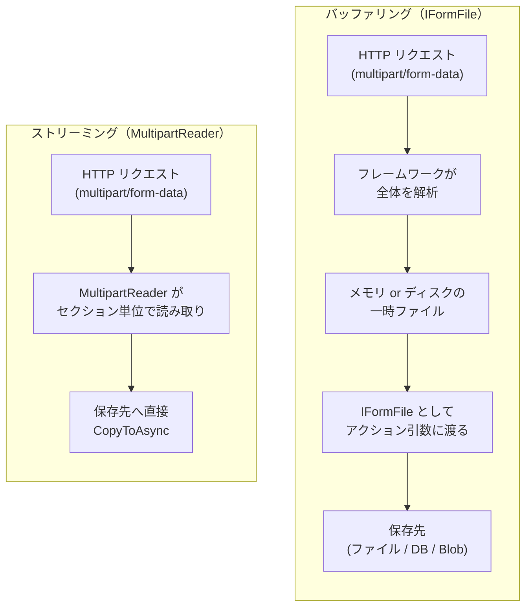
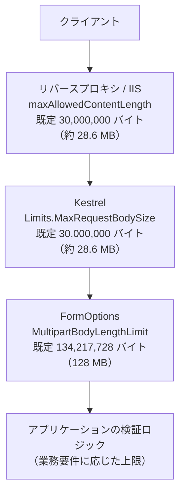
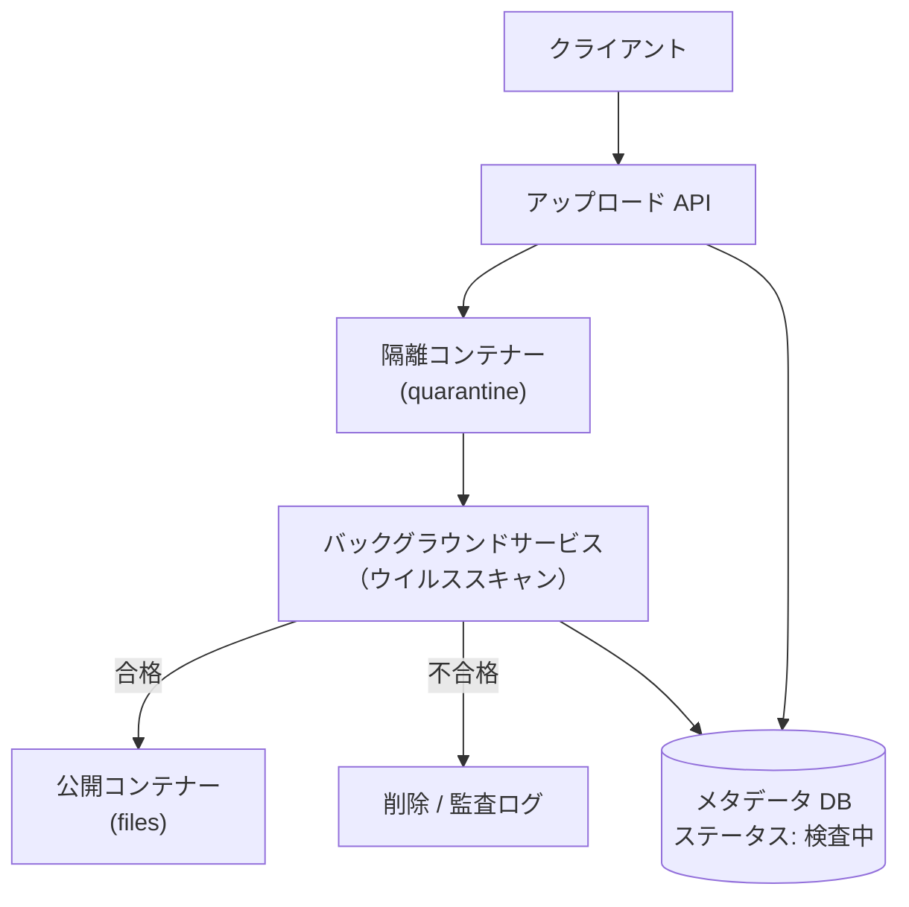

第7章は前編と後編に分かれています。前編では、ブラウザやクライアントから送られてきたファイルを受け取る仕組みと、受け取ったファイルを安全に検証する方法を説明します。受け取ったファイルを Azure Blob Storage へ保存する方法は [第7章（後編）：Azure Blob Storage への保存](../07-2-azure-blob-storage/index.md) で扱います。

---

## 目次

1. [ファイル受信の仕組み](#1-ファイル受信の仕組み)
   - [multipart/form-data の基本](#multipartform-data-の基本)
   - [バッファリングとストリーミング](#バッファリングとストリーミング)
   - [IFormFile によるバッファリング受信](#iformfile-によるバッファリング受信)
   - [Minimal API でのファイル受信](#minimal-api-でのファイル受信)
   - [既定のサイズ制限と設定変更](#既定のサイズ制限と設定変更)
   - [MultipartReader によるストリーミング受信](#multipartreader-によるストリーミング受信)
   - [受信方式の選択指針](#受信方式の選択指針)
2. [アップロードファイルの検証](#2-アップロードファイルの検証)
   - [検証すべき 5 つの観点](#検証すべき-5-つの観点)
   - [拡張子とファイルシグネチャの検証](#拡張子とファイルシグネチャの検証)
   - [ファイル名とサイズの扱い](#ファイル名とサイズの扱い)
   - [Minimal API での検証（.NET 10 の新機能）](#minimal-api-での検証net-10-の新機能)
   - [ウイルススキャンと隔離](#ウイルススキャンと隔離)
3. [参考ドキュメント](#3-参考ドキュメント)

---

## 1. ファイル受信の仕組み

### multipart/form-data の基本

Web ブラウザからファイルを送信する場合、HTML フォームの `enctype` 属性に `multipart/form-data` を指定します。
このとき HTTP リクエストのボディは、**境界文字列 (boundary)** で区切られた複数の **セクション (section)** の並びになります。各セクションは `Content-Disposition` ヘッダーを持ち、通常のフォーム値かファイルかを判別できます。

```html
<form action="/upload" method="post" enctype="multipart/form-data">
    <input type="text" name="title" />
    <input type="file" name="file" />
    <button type="submit">アップロード</button>
</form>
```

上記フォームが送信するリクエストボディは、概念的には次のような構造になります。

```text
POST /upload HTTP/1.1
Content-Type: multipart/form-data; boundary=----Boundary1234

------Boundary1234
Content-Disposition: form-data; name="title"

サンプル画像
------Boundary1234
Content-Disposition: form-data; name="file"; filename="photo.jpg"
Content-Type: image/jpeg

（ここにファイルのバイナリデータ）
------Boundary1234--
```

> [!WARNING]
> `enctype="multipart/form-data"` を指定し忘れると、ファイルは一切送信されません。この場合、サーバー側ではファイルにバインドできず、後述の `[ApiController]` を付けたコントローラーでは HTTP 400 が返ります（`IFormFile?` と null 許容で受け取っている場合は `null` になります）。「ファイルが受け取れない」「引数が `null` になる」という不具合の多くはこれが原因です。なお `IFormFile` は、アップロードされたファイル 1 件を表す ASP.NET Core のインターフェイスです（詳細は [IFormFile によるバッファリング受信](#iformfile-によるバッファリング受信) で後述します）。

> [!NOTE]
> **他言語との比較**
> - Spring Boot (Java): `MultipartFile` インターフェイス（`@RequestParam("file") MultipartFile file`）
> - Django (Python): `request.FILES['file']`（`UploadedFile` オブジェクト）
> - NestJS (TypeScript): `FileInterceptor` と `@UploadedFile()` デコレータ（内部で multer を使用。multer は Express アダプター専用で、Fastify アダプターでは別のライブラリが必要）
> - Laravel (PHP): `$request->file('file')`（`UploadedFile` オブジェクト）
> - Gin (Go): `c.FormFile("file")`（`*multipart.FileHeader`）
>
> いずれも「multipart のセクションをフレームワークが解析し、ファイルオブジェクトとして渡す」という点は共通しています。ASP.NET Core の `IFormFile` もこれに相当します。

### バッファリングとストリーミング

ASP.NET Core には、ファイルを受信する方法が 2 つあります。

| 方式 | 概要 | 代表的な API |
| --- | --- | --- |
| **バッファリング (Buffering)** | リクエスト全体をフレームワークが解析し、ファイル 1 件を `IFormFile` として組み立てる。モデルバインディングで受け取る | `IFormFile` / `IFormFileCollection` |
| **ストリーミング (Streaming)** | multipart のセクションを順に読み進め、ファイルの中身を直接保存先へ流し込む | `MultipartReader` |

ここで登場する `IFormFile` は、**アップロードされた 1 件のファイルを表す ASP.NET Core 標準のインターフェイス**（名前空間 `Microsoft.AspNetCore.Http`）です。フレームワークが multipart のパートを解析し終えた結果として作られるオブジェクトで、ファイル名・サイズ・MIME タイプといったメタデータと、中身を読み取るためのストリームをひとまとめにして公開します。他言語のフレームワークにある「アップロードファイルオブジェクト」に相当するもので、Spring Boot の `MultipartFile`、Django の `UploadedFile`、Laravel の `Illuminate\Http\UploadedFile`、NestJS (Express) の `Express.Multer.File` と同じ役割です。詳細は次の項で説明します。

バッファリングでは、フレームワークがファイル全体を **メモリまたはディスク上の一時ファイル** にいったん保持します。既定では **64 KB (`MemoryBufferThreshold`)** を超えたファイルはメモリからディスクの一時ファイルへ移されます。一時ファイルの出力先は環境変数 `ASPNETCORE_TEMP` で指定でき、未設定の場合は実行ユーザーの一時フォルダーが使われます。



> [!IMPORTANT]
> ストリーミングは **スループットを大きく改善するものではありません**。公式ドキュメント「[ASP.NET Core でファイルをアップロードする](https://learn.microsoft.com/ja-jp/aspnet/core/mvc/models/file-uploads?view=aspnetcore-10.0)」でも「ストリーミングによってパフォーマンスが大幅に向上することはない」と明記されています。ストリーミングの目的は、**アップロード時のメモリ／ディスク消費量を削減すること** です。同時アップロードが多い、あるいは 1 ファイルが大きいアプリケーションで、バッファリングによってサーバーのリソースが枯渇するのを防ぎます。

### IFormFile によるバッファリング受信

小さなファイルを受け取る場合は `IFormFile` を使います。前項で触れたとおり、`IFormFile` はアップロードされたファイル 1 件を表すインターフェイスで、実体はフレームワークが用意する `FormFile` クラスです。ファイルの中身はメモリまたはディスク上の一時ファイルに保持されており、`IFormFile` はそこへのアクセス手段を提供しているにすぎません。したがって、**リクエストが完了した後に `IFormFile` を保持しても中身は読めなくなる** 点に注意してください。読み取りや保存は、必ずリクエスト処理中に行います。

MVC コントローラーでは、フォームフィールド名と一致する名前の引数を宣言するだけでモデルバインディングが機能します（モデルバインディングの仕組み全般は[第3章：モデルバインディング](../03-mvc-web-and-api/index.md#モデルバインディング)を参照）。

```csharp
using Microsoft.AspNetCore.Mvc;

namespace FileUploadSample.Controllers;

[ApiController]
[Route("api/[controller]")]
public class UploadsController : ControllerBase
{
    // フォームの <input name="file"> と引数名 file を一致させる。
    // なお、このコントローラーの URL は [Route] により /api/uploads になるため、
    // 前掲のフォームを使うなら action もそれに合わせる
    [HttpPost]
    public async Task<IActionResult> Post(IFormFile file, CancellationToken cancellationToken)
    {
        if (file.Length == 0)
        {
            return BadRequest("ファイルが空です。");
        }

        // クライアントが送ってきたファイル名は信用しない（後述）
        var safeFileName = $"{Guid.NewGuid():N}{Path.GetExtension(file.FileName).ToLowerInvariant()}";
        var savePath = Path.Combine(Path.GetTempPath(), safeFileName);

        await using var destination = System.IO.File.Create(savePath);
        await file.CopyToAsync(destination, cancellationToken);

        return Ok(new { savedAs = safeFileName, size = file.Length });
    }
}
```

> [!NOTE]
> `[ApiController]` を付けたコントローラーでは、null 許容でない `IFormFile file` は **必須のパラメーター** として扱われます。ファイルが送られてこなかった場合や、フォームのフィールド名が引数名と食い違った場合は、モデル検証の段階で `{"errors":{"file":["The file field is required."]}}` という HTTP 400 が返り、アクションのコードには到達しません。そのため `file is null` を確認する必要はありません。
>
> 一方、`IFormFile? file` と null 許容で宣言した場合や、`[ApiController]` を付けていないコントローラーでは、バインドできなくても `null` が渡された状態でアクションが呼ばれます。この場合は自分で `null` を確認してください。

コード中の `Guid` は、他の多くの言語で **UUID** と呼ばれているものの .NET での名称です。`:N` はハイフンなしの 32 桁の 16 進数として文字列化する書式指定で、ファイル名に使いやすい形になります。

`IFormFile` が公開する主なメンバーは次のとおりです。

| メンバー | 説明 |
| --- | --- |
| `FileName` | クライアントが送信したファイル名。**信用してはいけない値** |
| `Length` | ファイルサイズ（バイト） |
| `ContentType` | クライアントが申告した MIME タイプ。これも信用してはいけない |
| `Name` | フォームフィールド名 |
| `OpenReadStream()` | 内容を読み取る `Stream` を取得する |
| `CopyToAsync(Stream)` | 内容を指定したストリームへコピーする |

複数ファイルを受け取る場合は `IFormFileCollection` または `List<IFormFile>` を使います。

```csharp
// フォーム側も <input type="file" name="files" multiple /> のように
// 引数名 files と一致させる必要がある
[HttpPost("multiple")]
public async Task<IActionResult> PostMultiple(
    IFormFileCollection files,
    CancellationToken cancellationToken)
{
    var results = new List<string>();

    foreach (var file in files)
    {
        var safeFileName = $"{Guid.NewGuid():N}{Path.GetExtension(file.FileName).ToLowerInvariant()}";
        await using var destination = System.IO.File.Create(Path.Combine(Path.GetTempPath(), safeFileName));
        await file.CopyToAsync(destination, cancellationToken);
        results.Add(safeFileName);
    }

    return Ok(results);
}
```

> [!WARNING]
> MVC コントローラーの `IFormFileCollection` は、**引数名と一致するフィールド名で送られたファイルだけ** を集めます。名前が食い違うと、例外も検証エラーも起きずに **空のコレクション** がバインドされるため、原因に気付きにくい不具合になります。
>
> 一方 Minimal API の `IFormFileCollection` は、フィールド名にかかわらず **リクエスト内のすべてのファイル** を返します。同じ型でも挙動が違う点に注意してください。
>
> また、1 リクエストで受け取れるフォーム項目数には `FormOptions.ValueCountLimit`（既定 1,024）の上限があります。ファイルもこの数に含まれるため、**1,025 個以上のファイルを一度に送ると HTTP 400 で拒否されます**。大量のファイルを扱う場合は、クライアント側で分割して送るか、この値を引き上げてください。

ファイル以外のフォーム値と組み合わせる場合は、モデルクラスにまとめると読みやすくなります。

```csharp
public class UploadRequest
{
    public required string Title { get; init; }

    public string? Description { get; init; }

    public required IFormFile File { get; init; }
}

[HttpPost("with-metadata")]
public async Task<IActionResult> PostWithMetadata(
    [FromForm] UploadRequest request,
    CancellationToken cancellationToken)
{
    // request.Title, request.File などにバインドされる
    return Ok();
}
```

> [!TIP]
> HTML フォームを使わず JavaScript の `FormData` から送信する場合も、`FormData.append()` の第 1 引数（フィールド名）とサーバー側の引数名を一致させる必要があります。名前が食い違うとバインドされず、上記のコントローラーでは HTTP 400 が返ります。

### Minimal API でのファイル受信

Minimal API でも `IFormFile` / `IFormFileCollection` をハンドラーの引数に宣言できます（Minimal API のバインディング全般は[第4章：各種入力のバインディング](../04-minimal-api/index.md#各種入力のバインディング)を参照）。ただし **フォームからのバインドには非フォージェリトークン (antiforgery token) の検証が必須** である点が MVC と異なります。

#### 非フォージェリトークンとは

非フォージェリトークン（antiforgery token、アンチフォージェリトークンとも呼ばれます）は、**クロスサイトリクエストフォージェリ (CSRF) 攻撃** を防ぐための仕組みです。

CSRF とは、利用者が正規サイトにログインした状態のまま攻撃者のページを開くと、そのページに仕込まれたフォームが利用者の Cookie を伴って正規サイトへ送信されてしまう、という攻撃です。ブラウザは送信先のドメインに紐づく Cookie を自動的に付けるため、サーバーからは正規の利用者による操作と見分けが付きません。ファイルアップロードのエンドポイントがこれを許すと、意図しないファイルを勝手にアップロードされる恐れがあります。

これを防ぐため、ASP.NET Core は次の 2 つの値をペアで発行します。

| 値 | 送信経路 | 役割 |
| --- | --- | --- |
| Cookie トークン | Cookie | ブラウザが自動的に送信する |
| リクエストトークン | フォームの hidden フィールド、または `RequestVerificationToken` ヘッダー | アプリが明示的に埋め込む |

攻撃者のページは正規サイトの HTML を読み取れないため、**リクエストトークンの値を知り得ません**。サーバーは 2 つの値が対になっているかを検証し、対になっていなければリクエストを HTTP 400 で拒否します。

他言語のフレームワークにも同じ仕組みがあります。Django の `` と `CsrfViewMiddleware`、Laravel の `@csrf` と CSRF 対策ミドルウェア（Laravel 13 の `PreventRequestForgery`、11・12 の `ValidateCsrfToken`、10 以前の `VerifyCsrfToken`）、Spring Security の `CsrfFilter` と `CsrfToken` に相当します。

ASP.NET Core では、`AddAntiforgery()` でサービスを登録し、`UseAntiforgery()` ミドルウェアをパイプラインに追加することで有効になります。Minimal API では、このミドルウェアが `IFormFile` や `[FromForm]` にバインドするエンドポイントを自動的に検証対象とするため、**アプリ側に検証コードを書く必要はありません**。

```csharp
using Microsoft.AspNetCore.Antiforgery;

var builder = WebApplication.CreateBuilder(args);

// (1) 非フォージェリトークンの生成・検証を行うサービスを登録する
builder.Services.AddAntiforgery();

var app = builder.Build();

// (2) このミドルウェアが検証を実行する。
//     IFormFile / [FromForm] にバインドするエンドポイントは自動的に検証対象となり、
//     トークンが無い、または不正な場合はハンドラーに到達せず HTTP 400 が返る。
//     エンドポイントのマッピングより前に置くこと。
app.UseAntiforgery();

// (3) ハンドラー自身には検証コードを書かない。
//     ここに処理が到達している時点で、検証は (2) で成功済み。
app.MapPost("/upload", async (IFormFile file, CancellationToken cancellationToken) =>
{
    var safeFileName = $"{Guid.NewGuid():N}{Path.GetExtension(file.FileName).ToLowerInvariant()}";
    var savePath = Path.Combine(Path.GetTempPath(), safeFileName);

    await using var destination = File.Create(savePath);
    await file.CopyToAsync(destination, cancellationToken);

    return TypedResults.Ok(new { savedAs = safeFileName, size = file.Length });
});

app.Run();
```

> [!WARNING]
> (1) と (2) はどちらも省略できません。省略したときの症状は次のように異なります。
>
> | 抜けているもの | 症状 |
> | --- | --- |
> | `AddAntiforgery()` | `UseAntiforgery()` の呼び出しで `InvalidOperationException` が発生し、**アプリが起動しません**。ただし `AddRazorPages()` を呼んでいる場合は内部で登録されるため発生しません（`AddControllers()` だけでは登録されません） |
> | `UseAntiforgery()` | 起動は成功しますが、`IFormFile` や `[FromForm]` にバインドするエンドポイントへリクエストが届いた時点で `InvalidOperationException` が投げられ、**HTTP 500** が返ります |

ブラウザのフォームから送信する場合は、`IAntiforgery` で生成したリクエストトークンを hidden フィールドとして埋め込みます。これが上記 (2) で検証される値です。

```csharp
app.MapGet("/", (HttpContext context, IAntiforgery antiforgery) =>
{
    // Cookie トークンをレスポンスの Cookie に書き込み、対になるリクエストトークンを取得する
    var token = antiforgery.GetAndStoreTokens(context);
    var html = $"""
      <html>
        <body>
          <form action="/upload" method="post" enctype="multipart/form-data">
            <!-- token.FormFieldName は既定で "__RequestVerificationToken"。
                 この hidden フィールドが無いと POST は HTTP 400 で拒否される -->
            <input name="{token.FormFieldName}" type="hidden" value="{token.RequestToken}" />
            <input type="file" name="file" accept=".jpg,.jpeg,.png" />
            <input type="submit" value="アップロード" />
          </form>
        </body>
      </html>
    """;

    return Results.Content(html, "text/html");
});
```

> [!TIP]
> Razor Pages や MVC の `<form>` タグヘルパーを使う場合、この hidden フィールドは自動的に挿入されます。手書きの HTML や JavaScript から送信する場合のみ、上記のように明示的な埋め込みが必要です。JavaScript の `fetch` から送る場合は、トークンを `RequestVerificationToken` ヘッダーに載せる方法もよく使われます。

Cookie 認証を使わない API（Bearer トークン認証など）で、CSRF の攻撃対象にならないことが明らかなエンドポイントは、`DisableAntiforgery()` で検証を無効化できます。

```csharp
app.MapPost("/api/upload", async (IFormFile file) => { /* ... */ })
   .RequireAuthorization()
   .DisableAntiforgery();
```

> [!WARNING]
> `DisableAntiforgery()` は CSRF 保護そのものを無効化します。ブラウザから Cookie 認証で到達できるエンドポイントには **絶対に使用しないでください**。Bearer トークンやクライアント証明書のように、ブラウザが自動送信しない資格情報でのみ保護されているエンドポイントに限って使用します。

### 既定のサイズ制限と設定変更

ファイルアップロードでは、複数のレイヤーにサイズ制限が存在します。どこで弾かれているのかを把握しておくことが重要です。



| 設定 | 既定値 | 超過時の挙動 |
| --- | --- | --- |
| IIS の `maxAllowedContentLength` | 30,000,000 バイト（約 28.6 MB） | HTTP 404.13 が返る |
| `KestrelServerLimits.MaxRequestBodySize` | 30,000,000 バイト（約 28.6 MB） | `BadHttpRequestException` がスローされ HTTP 413 が返る。クライアントが送信を続けた場合は接続がリセットされることもある |
| `FormOptions.MultipartBodyLengthLimit` | 134,217,728 バイト（128 MB） | `InvalidDataException` がスローされる |
| `FormOptions.MemoryBufferThreshold` | 65,536 バイト（64 KB） | 閾値を超えた時点で、それまでメモリに保持していた分も含めて全量がディスク上の一時ファイルへ退避される |
| `FormOptions.ValueCountLimit` | 1,024 個 | `InvalidDataException` がスローされる。ファイルもこの個数に含まれる |

> [!IMPORTANT]
> `FormOptions` の上限を超えたときにスローされる `InvalidDataException` は、フレームワークが自動的に 400 へ変換してくれるわけではありません。クライアントに返る HTTP ステータスは、フォームを読み取る経路によって変わります。
>
> - **MVC コントローラー**（`[ApiController]` と `[FromForm]` の組み合わせ）では、モデルバインディングの失敗として扱われ、**HTTP 400** と検証エラーの詳細が返ります。
> - **自分で `HttpRequest.ReadFormAsync()` を呼ぶ場合**（Minimal API でフォームを直接読む場合など）は、未処理の例外となり **HTTP 500** が返ります。
>
> 後者で 400 を返したい場合は、`ReadFormAsync()` の呼び出しを `try` / `catch` で囲み、`InvalidDataException` を捕捉して自分でレスポンスを組み立ててください。

アプリケーション全体で上限を変更する場合は `Program.cs` で設定します。

```csharp
using Microsoft.AspNetCore.Http.Features;

var builder = WebApplication.CreateBuilder(args);

// Kestrel のリクエストボディ上限を 100 MB に変更
builder.WebHost.ConfigureKestrel(options =>
{
    options.Limits.MaxRequestBodySize = 100 * 1024 * 1024;
});

// multipart の各セクションの上限を 100 MB に変更
builder.Services.Configure<FormOptions>(options =>
{
    options.MultipartBodyLengthLimit = 100 * 1024 * 1024;
});
```

特定のアクションだけ緩和したい場合は、属性で個別に指定します。

```csharp
[HttpPost("large")]
[RequestSizeLimit(100 * 1024 * 1024)]              // Kestrel のボディ上限
[RequestFormLimits(MultipartBodyLengthLimit = 100 * 1024 * 1024)]  // multipart の上限
public async Task<IActionResult> PostLarge(IFormFile file) { /* ... */ }
```

Minimal API には属性を付ける場所がないため、同じ `RequestSizeLimitAttribute` を **エンドポイントのメタデータとして** 付与します。

```csharp
using Microsoft.AspNetCore.Mvc;

app.MapPost("/upload-large", async (IFormFile file) => { /* ... */ })
   .WithMetadata(new RequestSizeLimitAttribute(100 * 1024 * 1024));

// 上限を撤廃する場合（本当に必要かをよく検討してください）
app.MapPost("/upload-huge", async (IFormFile file) => { /* ... */ })
   .WithMetadata(new DisableRequestSizeLimitAttribute());
```

条件によって上限を変えたい場合は `IHttpMaxRequestBodySizeFeature` を使いますが、**設定できるのはリクエストボディの読み取りが始まる前だけ** です。読み取りが始まった後は `IsReadOnly` が `true` になり、代入すると例外がスローされます。

```csharp
using Microsoft.AspNetCore.Http.Features;

// ルーティングより前に置く。ここではまだボディを読んでいない
app.Use(async (context, next) =>
{
    if (context.Request.Path.StartsWithSegments("/upload-large"))
    {
        var feature = context.Features.Get<IHttpMaxRequestBodySizeFeature>();
        if (feature is { IsReadOnly: false })
        {
            feature.MaxRequestBodySize = 100 * 1024 * 1024;
        }
    }

    await next();
});
```

> [!WARNING]
> この設定を **エンドポイントのハンドラーの中** で行っても効果はありません。ハンドラーが呼び出される時点で `IFormFile` へのバインドは完了しており、ボディはすでに読み取られているためです。このとき `IsReadOnly` は `true` になっているので、上記のような `if (feature is { IsReadOnly: false })` という書き方をすると、**エラーも警告も出ないまま設定が黙って無視されます**。同じ理由で、エンドポイントフィルター (`AddEndpointFilter`) も手遅れです。フィルターはパラメーターのバインドが終わった後に実行されます。

#### IIS でホストする場合の設定

IIS でホストする場合、上記のコードによる設定だけでは不十分です。**`maxAllowedContentLength` は C# のコードからは変更できません**。この値は IIS の要求フィルタリングモジュールが、リクエストが ASP.NET Core アプリに渡される **前** に評価する IIS 自身の設定であり、アプリのコードが実行される時点ではすでに判定が終わっています。そのため、変更するには `web.config`（またはサーバー全体の `applicationHost.config`）に記述するしかありません。

```xml
<system.webServer>
  <security>
    <requestFiltering>
      <!-- 100 MB。この値は C# のコードからは変更できない -->
      <requestLimits maxAllowedContentLength="104857600" />
    </requestFiltering>
  </security>
</system.webServer>
```

一方、IIS でホストする場合の **アプリ側** のボディ上限は、Kestrel ではなく `IISServerOptions.MaxRequestBodySize`（既定 30,000,000 バイト）で制御します。IIS の既定のホスティングモデルであるインプロセスホスティングでは、Kestrel ではなく IIS HTTP サーバーがリクエストを処理するため、`KestrelServerLimits.MaxRequestBodySize` は効きません。

```csharp
builder.Services.Configure<IISServerOptions>(options =>
{
    options.MaxRequestBodySize = 100 * 1024 * 1024;
});
```

つまり、IIS でホストして 100 MB のアップロードを許可したい場合、**両方** の設定が必要です。

| 設定場所 | 設定項目 | 役割 | 超過時の挙動 |
| --- | --- | --- | --- |
| `web.config` | `maxAllowedContentLength` | IIS がアプリにリクエストを渡すかどうかの判定。ここで弾かれるとアプリには一切届かない | HTTP 404.13 が返り、アプリのコードには到達しない |
| C# コード | `IISServerOptions.MaxRequestBodySize` | アプリがボディの読み取りを許可する上限 | `BadHttpRequestException` がスローされ、HTTP 413 が返る |

> [!WARNING]
> **どちらか一方だけを設定した場合、より小さいほうの値が実効的な上限になります。** 上限を引き上げたつもりが効いていないときは、両方の設定を確認してください。

> [!NOTE]
> `maxAllowedContentLength` は IIS 固有の設定です。Kestrel を直接公開する構成、Linux 上のコンテナー、Azure App Service の Linux プランなど IIS を経由しない環境では、この設定自体が存在しないため `web.config` は不要です。Nginx や Apache をリバースプロキシとして使う場合は、それぞれ `client_max_body_size`、`LimitRequestBody` が対応する設定になります。

`<requestLimits>` 要素では、`maxAllowedContentLength` のほかに次の設定も指定できます。ファイルアップロードで直接必要になることは多くありませんが、同じ要素にまとまっているため把握しておくとよいでしょう。

| 属性 / 子要素 | 既定値 | 説明 |
| --- | --- | --- |
| `maxAllowedContentLength` | 30,000,000 | リクエストボディの最大長（バイト） |
| `maxUrl` | 4,096 | URL の最大長（バイト） |
| `maxQueryString` | 2,048 | クエリ文字列の最大長（バイト） |
| `<headerLimits>` | なし | 個々の HTTP ヘッダーごとの最大長を指定する子要素 |

> [!WARNING]
> 上限を安易に大きくすると、**サービス拒否 (Denial of Service: DoS) 攻撃** のリスクが高まります。業務上必要な最小限の値に設定し、あわせて認証・レート制限を組み合わせてください。

#### サイズ以外の制限: 最低データレート

大きなファイルのアップロードでは、サイズ上限だけでなく **転送速度の下限** にも注意が必要です。Kestrel は 1 秒ごとにリクエストボディの受信速度を測り、下限を下回った接続をタイムアウトさせます。これは、極端に遅い速度でリクエストを送り続けて接続を占有する Slowloris 型の攻撃を防ぐための仕組みです。

| プロパティ | 既定値 | 説明 |
| --- | --- | --- |
| `Limits.MinRequestBodyDataRate` | 240 バイト/秒、猶予期間 5 秒 | リクエストボディの受信速度の下限 |
| `Limits.MinResponseDataRate` | 240 バイト/秒、猶予期間 5 秒 | 応答の送信速度の下限 |

猶予期間は、TCP 接続の開始直後は転送速度が徐々にしか上がらない（TCP スロースタート）ことを考慮したもので、この間は速度が測定されません。実際に速度を変えてアップロードすると、次のように挙動が分かれます。

| クライアントの送信速度 | 結果 |
| --- | --- |
| 1,000 バイト/秒（下限以上） | HTTP 200。10 KB の送信に約 10 秒かかっても成功する |
| 200 バイト/秒（下限未満） | **HTTP 408 Request Timeout**。猶予期間の 5 秒を過ぎた直後に接続が切られる |

つまり **時間がかかること自体は問題ではなく、速度が下限を下回ることが問題** です。モバイル回線など低速な環境からの大きなファイルアップロードを想定する場合は、下限を緩めます。

```csharp
using Microsoft.AspNetCore.Server.Kestrel.Core;

builder.WebHost.ConfigureKestrel(options =>
{
    // 100 バイト/秒まで許容し、猶予期間を 30 秒に延ばす
    options.Limits.MinRequestBodyDataRate =
        new MinDataRate(bytesPerSecond: 100, gracePeriod: TimeSpan.FromSeconds(30));
});
```

> [!WARNING]
> 下限を緩めるほど、遅い接続を長時間維持する攻撃を受けやすくなります。`null` を設定すると制限そのものが無効になりますが、DoS 攻撃に対して無防備になるため推奨しません。また Kestrel には同時接続数の上限 `Limits.MaxConcurrentConnections` もあり、**既定では無制限** です。大きなファイルを扱うエンドポイントでは、同時接続数の上限やレート制限とあわせて検討してください。

### MultipartReader によるストリーミング受信

ストリーミング受信のコードは、`IFormFile` に比べると確かに長くなります。ただしこれは「ASP.NET Core がストリーミングをサポートしていない」ということではありません。`MultipartReader` はフレームワークが標準で提供する公式のユーティリティであり、前掲の公式ドキュメントでもストリーミングの推奨手段として案内されています。

長くなる理由は、**モデルバインディングによる自動化と、バッファリングを避けることが原理的に両立しないため** です。モデルバインディングが `IFormFile` という「値」を引数に渡すためには、その時点でファイルの中身がどこかに確保されていなければなりません。バッファリングを避けるということは、フレームワークがボディを読み終える前にアプリのコードへ制御を渡すということであり、その結果「どのセクションをどこへ流すか」の判断はアプリ側の責務になります。

ASP.NET Core がファイル受信のために提供している手段は、抽象度の順に次の 4 つです。

| 手段 | 手書きの解析 | リクエストボディの扱い | 主な用途 |
| --- | --- | --- | --- |
| モデルバインディング (`IFormFile`) | 不要 | 64 KB を超えるとディスク上の一時ファイルへ全量を退避 | 既定の選択肢 |
| `HttpRequest.ReadFormAsync()` | 不要 | 上と同じ（`IFormFile` の内部で使われている API） | フィルターやミドルウェアで動的にフォームを読みたい場合 |
| **`MultipartReader`** | 必要（十数行） | 一時ファイルを作らず、保存先へ直接転送する | 大きなファイル |
| `HttpRequest.BodyReader` | 必要 | `PipeReader` による最も低レベルの読み取り | 特殊な最適化が要る場合 |

つまり自動化を求めるなら選択肢はあり、上 2 つを使えば手書きの解析は不要です。ただしそれらは一時ファイルへの退避を伴います。**ストリーミングの目的はまさにこの一時ファイルの往復をなくすこと** なので、自動化と目的が両立しない、というのが実態です。

> [!NOTE]
> 100 MB のファイルをアップロードして実測すると、`ReadFormAsync()` はマネージドヒープの割り当てを数 MB に抑える一方で、ディスク上に 100 MB の一時ファイルを作成します。つまり「メモリは節約されるがディスク I/O は 2 往復する」状態です。`MultipartReader` はこの一時ファイルを作らないため、ディスク I/O が 1 回で済みます。

最小構成は次のとおりです。この程度であれば、実装コストはさほど高くありません。

```csharp
using Microsoft.AspNetCore.WebUtilities;
using Microsoft.Net.Http.Headers;

app.MapPost("/upload-stream", async (HttpContext context, CancellationToken cancellationToken) =>
{
    // Content-Type ヘッダーから境界文字列を取り出す
    var boundary = HeaderUtilities.RemoveQuotes(
        MediaTypeHeaderValue.Parse(context.Request.ContentType!).Boundary).Value;

    var reader = new MultipartReader(boundary!, context.Request.Body);
    MultipartSection? section;

    while ((section = await reader.ReadNextSectionAsync(cancellationToken)) is not null)
    {
        var contentDisposition = section.GetContentDispositionHeader();

        if (contentDisposition is not null && contentDisposition.IsFileDisposition())
        {
            var savePath = Path.Combine(Path.GetTempPath(), $"{Guid.NewGuid():N}.bin");

            // セクションの本体を保存先へ直接流し込む（一時ファイルを経由しない）
            await using var destination = File.Create(savePath);
            await section.Body.CopyToAsync(destination, cancellationToken);
        }
    }

    return Results.Ok();
});
```

> [!WARNING]
> このエンドポイントには、**非フォージェリトークンの検証が一切かかりません**。`UseAntiforgery()` を追加していても同じです。ミドルウェアは `IFormFile` や `[FromForm]` にバインドするエンドポイントだけを検証対象とするため、`HttpContext` から自力でボディを読むこのハンドラーは対象外と判断されます（したがって `DisableAntiforgery()` を呼ぶ必要もありません）。
>
> Cookie 認証を使うアプリでは、これは CSRF の穴になります。自分で `IAntiforgery.ValidateRequestAsync` を呼んでください。このときトークンは **`RequestVerificationToken` ヘッダー** で受け取るようにします。フォームの hidden フィールドで送ると、検証のためにフォーム全体の読み取りが発生し、ストリーミングの意味がなくなるためです。
>
> ```csharp
> using Microsoft.AspNetCore.Antiforgery;
>
> app.MapPost("/upload-stream", async (HttpContext context, IAntiforgery antiforgery, CancellationToken cancellationToken) =>
> {
>     // ボディを読む前に、ヘッダーのトークンだけで検証する
>     try
>     {
>         await antiforgery.ValidateRequestAsync(context);
>     }
>     catch (AntiforgeryValidationException)
>     {
>         return Results.BadRequest("トークンが不正です。");
>     }
>
>     // 以降は上記と同じストリーミング処理
> });
> ```

ファイル以外のフォーム値も受け取る場合は、`IsFormDisposition()` の分岐を追加します。

```csharp
// 前掲の if (contentDisposition.IsFileDisposition()) { ... } に続けて記述する
else if (contentDisposition is not null && contentDisposition.IsFormDisposition())
{
    var name = contentDisposition.Name.Value;
    using var streamReader = new StreamReader(section.Body);
    var value = await streamReader.ReadToEndAsync(cancellationToken);
    // 必要に応じて辞書などへ蓄積し、すべて読み終えてからモデルへ詰め替える
}
```

実運用では、境界文字列の妥当性チェックも加えます。`MultipartReader` は境界文字列の長さを検証しないため、不正に長い値を送り付けられないよう自前で確認します。

```csharp
if (!MediaTypeHeaderValue.TryParse(context.Request.ContentType, out var mediaType)
    || string.IsNullOrEmpty(mediaType.Boundary.Value)
    || mediaType.Boundary.Value!.Length > 128)   // FormOptions.MultipartBoundaryLengthLimit の既定値
{
    return Results.BadRequest("multipart/form-data で送信してください。");
}
```

> [!TIP]
> そもそもクライアントがフォーム値を一緒に送る必要がないなら、**multipart を使わない** という選択肢もあります。`PUT /files/{id}` のようにファイルの中身だけをリクエストボディとして送ってもらえば、`Request.Body` がそのままファイルのストリームになるため、解析は一切不要です。ファイル名などのメタデータは URL やヘッダーで渡します。ブラウザのフォームからではなく、SPA やモバイルアプリ、他システムからのアップロードであれば、この方式が最も単純です。
>
> ```csharp
> app.MapPut("/files/{id}", async (string id, HttpContext context, CancellationToken cancellationToken) =>
> {
>     await using var destination = File.Create(Path.Combine(Path.GetTempPath(), $"{id}.bin"));
>     await context.Request.Body.CopyToAsync(destination, cancellationToken);
>     return Results.Ok();
> });
> ```

#### 保存先が Azure Blob Storage の場合

ここまでの例では保存先をローカルのファイルシステムにしていますが、**保存先が Azure Blob Storage であれば、実装はさらに短くなります**。Azure SDK の `BlobClient.UploadAsync` が `Stream` を直接受け取り、内部でチャンク分割やブロックの並列アップロードまで面倒を見てくれるためです。`section.Body` をそのまま渡すだけで、ローカルディスクに一切書き込むことなく BLOB へ転送できます。

```csharp
if (contentDisposition is not null && contentDisposition.IsFileDisposition())
{
    // containerClient（BlobContainerClient）の取得方法は後編で解説します
    var blobClient = containerClient.GetBlobClient($"{Guid.NewGuid():N}.bin");

    // 受信ストリームを、そのまま Blob Storage へ流し込む
    await blobClient.UploadAsync(section.Body, overwrite: false, cancellationToken);
}
```

同じことは `IFormFile` でも `file.OpenReadStream()` を渡すだけで実現できます。詳しくは [ストリームをそのままアップロードする](../07-2-azure-blob-storage/index.md#ストリームをそのままアップロードする) で扱います。

MVC コントローラーでストリーミングを行う場合は、フォームのモデルバインディングが先にリクエストボディを読み切ってしまわないよう、フォーム値のバインドを無効化するリソースフィルターを適用します（フィルターの種類と実行順序は[第3章：フィルター（ActionFilter, ExceptionFilter 等）と横断処理](../03-mvc-web-and-api/index.md#6-フィルターactionfilter-exceptionfilter-等と横断処理)を参照）。

```csharp
using Microsoft.AspNetCore.Mvc.Filters;
using Microsoft.AspNetCore.Mvc.ModelBinding;

[AttributeUsage(AttributeTargets.Class | AttributeTargets.Method)]
public sealed class DisableFormValueModelBindingAttribute : Attribute, IResourceFilter
{
    public void OnResourceExecuting(ResourceExecutingContext context)
    {
        var factories = context.ValueProviderFactories;
        factories.RemoveType<FormValueProviderFactory>();
        factories.RemoveType<FormFileValueProviderFactory>();
        factories.RemoveType<JQueryFormValueProviderFactory>();
    }

    public void OnResourceExecuted(ResourceExecutedContext context)
    {
    }
}
```

> [!NOTE]
> このフィルターは省略できません。MVC では、アクションが `Request.Form` や `IFormFile` に触れなくても、**モデルバインディングの段階でフォームの値プロバイダーがボディを読み切ってしまう** ためです。フィルターを外して `MultipartReader` で読もうとすると、`IOException`（`Unexpected end of Stream, the content may have already been read by another component.`）が発生します。
>
> ストリーミングを行うアクションでは、あわせて `Request.Form` や `IFormFile` にも触れないでください。フォーム値が必要な場合は、`MultipartReader` で読み取ったセクションから自前で組み立てます。

適用は、ストリーミングを行うアクション（またはコントローラー）に属性を付けるだけです。`[RequestSizeLimit]` や `[DisableRequestSizeLimit]` と併用する場合も、同じように属性として並べます。

```csharp
[HttpPost("stream")]
[DisableFormValueModelBinding]
[RequestSizeLimit(500 * 1024 * 1024)]
public async Task<IActionResult> UploadStream(CancellationToken cancellationToken)
{
    // Request.Body を MultipartReader で直接読み取る
}
```

### 受信方式の選択指針

| 観点 | バッファリング（`IFormFile`） | ストリーミング（`MultipartReader`） |
| --- | --- | --- |
| 実装の容易さ | ◎ モデルバインディングで完結 | △ 自前でセクションを解析する |
| モデル検証との統合 | ◎ データ注釈が使える（MVC・Minimal API とも） | △ 自前で実装が必要 |
| メモリ／ディスク消費 | △ ファイルサイズと同時実行数に比例 | ◎ 一定のバッファのみ |
| 適したファイルサイズ | 数十 MB 程度まで | 数百 MB 以上 |
| 適した用途 | プロフィール画像、添付書類 | 動画、バックアップ、大量データ |

> [!TIP]
> 最初は `IFormFile` で実装し、ベンチマークでメモリやディスクが問題になった時点でストリーミングへ移行するのが現実的です。同じ公式ドキュメントも「小さい／大きいの境界は環境依存であり、想定サイズでベンチマークすべき」としています。

---

## 2. アップロードファイルの検証

### 検証すべき 5 つの観点

ファイルアップロードは、攻撃者にとって **サーバーへ任意のデータを送り込める入口** です。最低限、次の観点で検証します。

| 観点 | 内容 |
| --- | --- |
| **サイズ** | 業務要件に応じた上限を設け、超過したら拒否する |
| **拡張子** | 許可リスト（ホワイトリスト）方式で判定する |
| **ファイルシグネチャ** | 先頭バイト列を検査し、拡張子と内容の整合を確認する |
| **ファイル名** | クライアント由来の名前をそのまま保存パスに使わない |
| **内容** | ウイルス／マルウェアスキャンを実施する |

> [!WARNING]
> クライアント側（JavaScript）の検証はユーザー体験の向上のためのものであり、**簡単に迂回できます**。必ずサーバー側で同じ検証を実施してください。

### 拡張子とファイルシグネチャの検証

拡張子は許可リストで判定します。禁止リスト（ブラックリスト）方式は漏れが生じやすいため使用しません。

```csharp
private static readonly string[] PermittedExtensions = [".jpg", ".jpeg", ".png", ".pdf"];

private static bool IsPermittedExtension(string fileName)
{
    var extension = Path.GetExtension(fileName).ToLowerInvariant();
    return !string.IsNullOrEmpty(extension) && PermittedExtensions.Contains(extension);
}
```

拡張子はいくらでも詐称できるため、**ファイルの先頭数バイト（ファイルシグネチャ／マジックナンバー）** も検査します。

```csharp
using System.Buffers;

public static class FileSignatureValidator
{
    private static readonly Dictionary<string, byte[][]> Signatures = new()
    {
        // JPEG は SOI マーカー (FF D8) の直後に別のマーカー (FF xx) が続く。
        // xx には APP0 (E0) や APP1 (E1) のほか ED や C0 なども現れるため、
        // 4 バイト目まで固定すると正常な JPEG を取りこぼす
        [".jpg"] = [[0xFF, 0xD8, 0xFF]],
        [".png"] = [[0x89, 0x50, 0x4E, 0x47, 0x0D, 0x0A, 0x1A, 0x0A]],
        [".pdf"] = [[0x25, 0x50, 0x44, 0x46]],
    };

    public static bool IsValidSignature(Stream stream, string extension)
    {
        extension = extension.ToLowerInvariant();
        // .jpeg は .jpg と同じシグネチャで判定する
        var key = extension == ".jpeg" ? ".jpg" : extension;

        if (!Signatures.TryGetValue(key, out var candidates))
        {
            return false;
        }

        var maxLength = candidates.Max(signature => signature.Length);
        var buffer = ArrayPool<byte>.Shared.Rent(maxLength);

        try
        {
            var read = stream.ReadAtLeast(buffer.AsSpan(0, maxLength), maxLength, throwOnEndOfStream: false);
            ReadOnlySpan<byte> header = buffer.AsSpan(0, read);

            // Span はラムダ式の中で使えないため、foreach で判定する
            foreach (var signature in candidates)
            {
                if (header.Length >= signature.Length
                    && header[..signature.Length].SequenceEqual(signature))
                {
                    return true;
                }
            }

            return false;
        }
        finally
        {
            ArrayPool<byte>.Shared.Return(buffer);
            stream.Position = 0;  // 後続の保存処理のために巻き戻す
        }
    }
}
```

> [!WARNING]
> このメソッドは、`IFormFile.OpenReadStream()` のように **シークできるストリーム専用** です。`MultipartReader` によるストリーミング受信で得られる `section.Body` は `CanSeek` が `false` ですが、`Position = 0` や `Seek(0, SeekOrigin.Begin)` を呼んでも **例外は発生しません**。実際に試すと `Position` プロパティの値だけが 0 に戻り、読み取り位置は戻らないため、**先頭の数バイトが欠けたファイルが保存されます**。ストリーミング受信でシグネチャを検証する場合は、先頭バイトを読み取ったバッファを保存先へ書き出してから、残りを `CopyToAsync` で転送してください。

> [!WARNING]
> このメソッドは、**シグネチャ辞書に載っていない拡張子に対して `false` を返します**。したがって、後述の許可拡張子リストに `.txt` や `.csv` のような項目を追加しただけでは、その形式のアップロードはすべて「内容が拡張子と一致しません」で拒否されます。

シグネチャの定義そのものにも注意が必要です。JPEG のシグネチャを `FF D8 FF E0`（JFIF）のように 4 バイトで固定している例をよく見かけますが、4 バイト目は後続のマーカー種別であり、`E1`（Exif）や `EE`（Adobe）、`DB`（量子化テーブル）など多くの値を取ります。

実際に手元の JPEG ファイル 3,000 件の 4 バイト目を集計すると、次のように分布しました。

| 先頭 4 バイト | 意味 | 件数 |
| --- | --- | --- |
| `FF D8 FF E0` | APP0（JFIF） | 2,495 |
| `FF D8 FF E1` | APP1（**Exif**） | 352 |
| `FF D8 FF E2` | APP2（ICC プロファイル） | 142 |
| `FF D8 FF EE` | APP14（Adobe） | 9 |
| `FF D8 FF DB` | DQT（量子化テーブル） | 2 |

> [!WARNING]
> 上の分布のうち、`E0` / `E2` / `E3` の 3 パターンだけを許可する実装（MS Learn のサンプルコードがこの形です）では、**363 件（約 12%）が拒否されます**。しかもそこには、デジタルカメラやスマートフォンで撮影した写真の標準形式である **Exif JPEG が丸ごと含まれます**。写真投稿機能でこの実装を使えば、スマートフォンからのアップロードがことごとく失敗することになります。JPEG は `FF D8 FF` の 3 バイトで判定してください。

> [!WARNING]
> 前述のとおり辞書にない拡張子は拒否されるため、許可リストを増やすときは、**シグネチャ辞書にも対応する定義を追加する**か、**シグネチャを持たない拡張子は検証をスキップする**（`TryGetValue` が失敗したら `true` を返す）かを、形式ごとに決めてください。テキストや CSV のように決まった先頭バイト列を持たない形式は前者を選べないため後者になりますが、その拡張子については中身の検証が効かなくなる点に注意します。

> [!NOTE]
> シグネチャ検証は「拡張子と中身が一致するか」を確かめるだけであり、**ファイルが安全であることを保証しません**。正しい JPEG ヘッダーを持つ悪意あるファイルは作成可能です。ウイルススキャンと併用してください。

> [!WARNING]
> `.zip` のような圧縮ファイルを許可する場合は、受け取ったファイルそのものだけでなく **展開したときに何が起きるか** も考慮してください。同じ値が続くデータは 1,000 倍以上に圧縮できるため、200 KB の書庫が展開後に 200 MB になるといったことが簡単に起こります（ZIP 爆弾）。また、書庫内のエントリ名に `../` を含めて展開先の外へファイルを書き出す **Zip Slip** という攻撃もあります。.NET の `ZipFile.ExtractToDirectory` は展開先の外に出るエントリを `IOException` で拒否しますが、`ZipArchive` からエントリを 1 つずつ取り出して自分で保存先を組み立てる場合、この保護は働きません。展開が必要なら、エントリ名の検証に加えて、展開後の合計サイズとエントリ数にも上限を設けてください。

### ファイル名とサイズの扱い

クライアントが送ってきたファイル名を、そのまま保存パスの構築に使ってはいけません。`../../etc/passwd` のようなパストラバーサル攻撃や、既存ファイルの上書きにつながります。

```csharp
// ❌ 危険: クライアント由来の名前をそのまま使用
// Path.Combine は結合するだけで、".." を解決したり不正な文字を除去したりはしない
var path = Path.Combine(uploadDirectory, file.FileName);

// ✅ 安全: アプリケーションが生成した名前を使用し、拡張子だけを引き継ぐ
// ただし拡張子もクライアント由来なので、許可リストの検証を通したものだけを使う
if (!IsPermittedExtension(file.FileName))
{
    return BadRequest("許可されていない拡張子です。");
}

var extension = Path.GetExtension(file.FileName).ToLowerInvariant();
var storedName = $"{Guid.NewGuid():N}{extension}";
var path = Path.Combine(uploadDirectory, storedName);
```

> [!WARNING]
> `Path.GetExtension` が返すのは最後のピリオド以降の部分だけなので、`../../etc/passwd.jpg` のようなパス区切り文字を含む入力を渡しても、結果は `.jpg` であってパス成分は混ざりません。この戻り値だけを使うかぎりパストラバーサルは起きません。しかし `shell.aspx` や `web.config` のような文字列を渡せば、拡張子として `.aspx` や `.config` がそのまま返ります。**許可リストの検証を省略すると、実行可能なファイルや設定ファイルとして解釈される名前で保存されてしまいます**。

`Path.Combine` にも注意が必要です。名前のとおり「結合するだけ」で、安全な保存先に閉じ込めてくれる関数ではありません。

| `file.FileName` の値 | `Path.Combine("/uploads", ...)` の結果 |
| --- | --- |
| `photo.png` | `/uploads/photo.png` |
| `../../etc/cron.d/job` | `/uploads/../../etc/cron.d/job`（`..` は解決されず、OS が解釈して `/etc/cron.d/job` に到達する） |
| `/etc/cron.d/job` | `/etc/cron.d/job`（**第 2 引数が絶対パスだと、第 1 引数は捨てられる**） |

`Path.Combine` の第 2 引数が絶対パスだったときに第 1 引数を無視するのは、Python の `os.path.join` や Node.js の `path.resolve` と同じ挙動です（名前の似た Node.js の `path.join` は、後続の引数が絶対パスでも前の引数を捨てないため、挙動が異なります）。いずれの言語でも「結合先のディレクトリに収まることを保証する関数」ではないため、保存先の安全性は呼び出し側で担保しなければなりません。前掲の ✅ の例のように、アプリケーションが生成した名前だけを使えばこれらの問題はまとめて回避できます。

> [!WARNING]
> 他の言語の `basename` に相当する `Path.GetFileName` でディレクトリ部分を取り除けば安全になる、と考えるのは危険です。この関数が区切り文字として扱うのは **実行中の OS の区切り文字だけ** です。Linux や macOS 上で動くアプリに `C:\Windows\system32\evil.exe` を渡すと、`\` は区切り文字とみなされないため、**文字列全体がそのまま 1 つのファイル名として返ります**。
>
> ファイル名に含まれる制御文字も取り除かれません。実際に試すと、`evil.php` のうしろに NULL 文字を挟んだ `evil.php\0.jpg` は、`Path.GetExtension` が `.jpg` を返すため拡張子の許可リストを通過し、NULL 文字を含んだままの文字列が `IFormFile.FileName` から読み取れます。同様に、`file.jpg.` のように末尾がピリオドの名前は `Path.GetExtension` が空文字列を返します。
>
> クライアント由来の名前を加工して安全にしようとするのではなく、前掲の ✅ の例のように **アプリケーションが生成した名前を使い、拡張子は許可リストを通ったものだけを引き継ぐ** のが確実です。

ファイル名だけでなく、**保存先ディレクトリの選び方** も重要です。アップロードされたファイルは、`wwwroot` の配下に置いてはいけません。`wwwroot` は `UseStaticFiles()` によって誰でもダウンロードできる公開領域だからです。

実際に `wwwroot/uploads/` へファイルを置いて確認すると、次のようになります。

| 保存したファイル | 応答 | 理由 |
| --- | --- | --- |
| `a.txt` | HTTP 200（`text/plain`） | 既定の MIME 辞書にあるため配信される |
| `x.exe` | HTTP 200（`application/vnd.microsoft.portable-executable`） | **実行可能ファイルも既定の MIME 辞書にあるため配信される** |
| `shell.aspx` | HTTP 404 | MIME 辞書にない拡張子は既定では配信されない |
| `web.config` | HTTP 404 | 同上 |

`.aspx` が 404 になるのは、静的ファイルミドルウェアが既定で未知の拡張子を配信しない（`ServeUnknownFileTypes` が `false`）ためであり、Kestrel が `.aspx` を実行することはありません。しかし `.exe` のようにマルウェアそのものになりうるファイルは、そのまま公開ダウンロードできてしまいます。攻撃者がマルウェアをアップロードし、その URL を第三者に配布すれば、あなたのドメインがマルウェア配布の踏み台になります。

保存先は、アプリケーションの配置ディレクトリの外にある専用領域とし、可能であれば実行権限を外してください。**後編で解説する [Azure Blob Storage への保存](../07-2-azure-blob-storage/index.md)は、そもそもアプリケーションのファイルシステムと切り離されているため、この問題を構造的に回避できます**。

元のファイル名を画面に表示したい場合は、**表示用の名前としてデータベースに保持** し、表示時に HTML エンコードします。Razor は既定で出力を HTML エンコードするため安全ですが、Razor 以外で出力する場合は `WebUtility.HtmlEncode` を明示的に呼び出します。

> [!WARNING]
> 保持する前に、**ファイル名の長さも制限してください**。ASP.NET Core が制限しているのは multipart の各パートのヘッダー全体の大きさ（`FormOptions.MultipartHeadersLengthLimit`、既定 16,384 バイト）だけです。実際に試すと、**16,000 文字のファイル名はそのまま受け付けられ**、20,000 文字でようやく HTTP 400 になります。この値をそのままデータベースへ保存するとレコードが肥大化し、後編の「[SAS による一時的なアクセス許可](../07-2-azure-blob-storage/index.md#sas-による一時的なアクセス許可)」で元のファイル名を `Content-Disposition` に載せる場合は、発行する URL 自体も巨大になります。OWASP は拡張子を含めて 255 文字未満に収めることを推奨しています。上限を超えるものは切り詰めるか、拒否しましょう。

サイズ上限は構成から読み込み、`IOptions<T>` で注入するのが定石です（構成の詳細は[第5章：アプリ設定 (Configuration)](../05-configuration/index.md)、DI の詳細は[第6章：依存性注入 (DI)](../06-dependency-injection/index.md)を参照）。

```json
{
  "FileUpload": {
    "MaxFileSizeBytes": 5242880,
    "PermittedExtensions": [ ".jpg", ".jpeg", ".png", ".pdf" ]
  }
}
```

```csharp
using System.ComponentModel.DataAnnotations;

public class FileUploadOptions
{
    public const string SectionName = "FileUpload";

    [Range(1, 1024L * 1024 * 1024)]
    public long MaxFileSizeBytes { get; set; } = 5 * 1024 * 1024;

    [Required, MinLength(1)]
    public string[] PermittedExtensions { get; set; } = [];
}
```

```csharp
builder.Services
    .AddOptions<FileUploadOptions>()
    .Bind(builder.Configuration.GetSection(FileUploadOptions.SectionName))
    .ValidateDataAnnotations()
    .ValidateOnStart();
```

`ValidateDataAnnotations()` は、`System.ComponentModel.DataAnnotations` の属性による検証を **有効にする** メソッドです。これだけでは検証は実行されず、`IOptions<T>` の `Value` に初めてアクセスした時点まで遅延します。`ValidateOnStart()` を続けて呼ぶことで、その検証がアプリケーションの起動時に実行されるようになり、設定漏れを起動時点で失敗させられます（検証のタイミングについては[第5章：バリデーションのタイミング](../05-configuration/index.md#バリデーションのタイミング)を参照）。上記の例で `PermittedExtensions` が空のまま起動しようとすると、次のように `OptionsValidationException` で停止します。

```text
Microsoft.Extensions.Options.OptionsValidationException: DataAnnotation validation failed for
'FileUploadOptions' members: 'PermittedExtensions' with the error:
'The field PermittedExtensions must be a string or array type with a minimum length of '1'.'.
```

> [!WARNING]
> `ValidateDataAnnotations()` が検証するのは、**`System.ComponentModel.DataAnnotations` の属性が付いたプロパティだけ** です。C# の `required` 修飾子は付けても検証されません。`required` はコンパイル時にオブジェクト初期化子での指定を強制する機能であり、構成バインダーはリフレクションで値を設定するため、この制約は働かないためです。
>
> ```csharp
> // ❌ 検証されない。構成に値が無くても起動は成功し、null が入ったままになる
> public required string[] PermittedExtensions { get; set; }
>
> // ✅ 検証される。値が無ければ起動時に OptionsValidationException で停止する
> [Required, MinLength(1)]
> public string[] PermittedExtensions { get; set; } = [];
> ```
>
> ❌ の書き方をして構成の記述を忘れると、次項の `UploadValidator` で使っている `PermittedExtensions.Contains(extension, StringComparer.OrdinalIgnoreCase)` が常に `false` を返すため、**例外も出ないまま、すべてのファイルが「拡張子が許可されていません」として拒否される** という、原因の分かりにくい不具合になります。`null` の配列に対する呼び出しなので例外になりそうに見えますが、C# 14 では配列が暗黙に `ReadOnlySpan<T>` へ変換され、LINQ の `Enumerable.Contains` ではなく `MemoryExtensions.Contains` が選ばれます。空のスパンとして扱われるため、例外にならず単に `false` が返ります。必須項目には必ず `[Required]` を付けてください。構成の検証方法の全体像は[第5章：バリデーション](../05-configuration/index.md#バリデーション)を参照してください。

検証ロジックをサービスとしてまとめておくと、複数のエンドポイントから再利用できます。

```csharp
using Microsoft.Extensions.Options;

public interface IUploadValidator
{
    UploadValidationResult Validate(IFormFile file);
}

public sealed record UploadValidationResult(bool IsValid, string? ErrorMessage)
{
    public static UploadValidationResult Success { get; } = new(true, null);

    public static UploadValidationResult Failure(string message) => new(false, message);
}

public sealed class UploadValidator(IOptions<FileUploadOptions> options) : IUploadValidator
{
    private readonly FileUploadOptions _options = options.Value;

    public UploadValidationResult Validate(IFormFile file)
    {
        if (file.Length == 0)
        {
            return UploadValidationResult.Failure("ファイルが空です。");
        }

        if (file.Length > _options.MaxFileSizeBytes)
        {
            return UploadValidationResult.Failure(
                $"ファイルサイズが上限（{_options.MaxFileSizeBytes:N0} バイト）を超えています。");
        }

        // ToLower ではなく ToLowerInvariant を使う。
        // ToLower は実行環境のロケールに従うため、たとえばトルコ語環境では
        // ".TIF" が ".tıf"（点のない i）になり、許可リストに一致しなくなる
        var extension = Path.GetExtension(file.FileName).ToLowerInvariant();

        // 比較子を指定する。構成ファイルに ".JPG" と大文字で書かれていても
        // 一致させるため（既定の Contains は大文字小文字を区別する）
        if (string.IsNullOrEmpty(extension)
            || !_options.PermittedExtensions.Contains(extension, StringComparer.OrdinalIgnoreCase))
        {
            // クライアント由来の値をエラーメッセージにそのまま含めない（後述）
            return UploadValidationResult.Failure("許可されていない拡張子です。");
        }

        using var stream = file.OpenReadStream();
        if (!FileSignatureValidator.IsValidSignature(stream, extension))
        {
            return UploadValidationResult.Failure("ファイルの内容が拡張子と一致しません。");
        }

        return UploadValidationResult.Success;
    }
}
```

> [!WARNING]
> 検証に失敗した理由をクライアントへ返すとき、**受け取った値をそのままメッセージに埋め込まないでください**。`file.FileName` は攻撃者が自由に指定でき、`Path.GetExtension` はその内容を検査せずに最後の `.` 以降を返します。たとえば `"a.jpg\">"` というファイル名を送ると、拡張子として `.jpg">` がそのまま返ってきます。これを `$"拡張子 '{extension}' は許可されていません。"` のように応答へ含めると、その応答を `innerHTML` などで画面に描画するクライアントでは **クロスサイトスクリプティング (XSS)** が成立します。300 文字を超える拡張子を送りつけて応答を膨らませることも可能です。メッセージは固定の文言にとどめ、詳しい値はサーバー側のログにだけ記録しましょう。

### Minimal API での検証（.NET 10 の新機能）

MVC コントローラーでは以前からデータ注釈（`[Required]`、`[Range]` など）によるモデル検証が動作しましたが（詳細は[第3章：入力検証 (バリデーション)](../03-mvc-web-and-api/index.md#入力検証-バリデーション)を参照）、Minimal API には同等の仕組みがなく、上記のような検証サービスを自分で呼び出す必要がありました。

**ASP.NET Core 10 では、Minimal API でもデータ注釈による検証が利用できるようになりました。** `AddValidation()` を呼ぶだけで、ハンドラーの引数に付けた検証属性がフレームワークによって評価され、違反があればハンドラーに到達せず HTTP 400 と検証エラーの詳細が返ります。この仕組みの全体像は[第4章：バリデーション](../04-minimal-api/index.md#バリデーション)で扱っています。ここではファイルアップロード特有の使い方に絞って説明します。

```csharp
builder.Services.AddValidation();
```

ファイルサイズのように標準の属性では表現できない条件は、`ValidationAttribute` を継承したカスタム属性を作ります。`IFormFile` に対しても機能します。

```csharp
using System.ComponentModel.DataAnnotations;

[AttributeUsage(AttributeTargets.Property | AttributeTargets.Parameter)]
public sealed class MaxFileSizeAttribute(long maxBytes) : ValidationAttribute
{
    public override bool IsValid(object? value)
        => value is not IFormFile file || file.Length <= maxBytes;

    public override string FormatErrorMessage(string name)
        => $"{name} は {maxBytes:N0} バイト以下にしてください。";
}
```

```csharp
using System.ComponentModel.DataAnnotations;
using Microsoft.AspNetCore.Mvc;

// ① IFormFile を単体の引数として受け取る場合
app.MapPost("/upload", ([MaxFileSize(5 * 1024 * 1024)] IFormFile file) => TypedResults.Ok());

// ② フォーム値とファイルをまとめた複合型で受け取る場合
app.MapPost("/upload-with-title", ([FromForm] ValidatedUploadRequest request) => TypedResults.Ok());

public class ValidatedUploadRequest
{
    [Required, StringLength(100)]
    public string Title { get; set; } = "";

    // [Required] を付けないとファイル未指定のリクエストが検証を通過してしまう（後述）
    [Required, MaxFileSize(5 * 1024 * 1024)]
    public IFormFile? File { get; set; }
}
```

② のエンドポイントに、100 文字を超えるタイトルと上限を超えたファイルを送ると、次のようなレスポンスが返ります。

```json
{
  "title": "One or more validation errors occurred.",
  "errors": {
    "Title": ["The field Title must be a string with a maximum length of 100."],
    "File": ["File は 5,242,880 バイト以下にしてください。"]
  }
}
```

> [!NOTE]
> `AddValidation()` はソースジェネレーターを使って、**呼び出したアセンブリ内** の検証対象の型を検出します。そのため、Minimal API のエンドポイントを別のアセンブリ（クラスライブラリなど）で定義している場合、ホスト側で `AddValidation()` を呼ぶだけでは検証が実行されず、不正なリクエストがそのまま処理されて 400 ではなく 200 が返ります。この場合は、**エンドポイントを定義しているアセンブリ側に `AddValidation()` を呼ぶ拡張メソッドを作り、それをホストアプリから呼び出します**（ホスト側の `AddValidation()` も併せて呼びます）。そのアセンブリが `Microsoft.NET.Sdk.Web` ベースでない素のクラスライブラリの場合は、`Microsoft.Extensions.Validation` パッケージの参照も追加します。
>
> 特定のエンドポイントだけ検証を外したい場合は `DisableValidation()` を使います。

> [!WARNING]
> `ValidationAttribute` を継承したカスタム属性は、**値が `null` のときには呼ばれません**。`MaxFileSizeAttribute` の `IsValid` も、`value` が `IFormFile` でなければ `true` を返す実装になっています。そのため `[MaxFileSize]` だけを付けたプロパティは「ファイルが送られてきた場合にサイズを検査する」という意味にしかならず、**ファイルを一切送らないリクエストは検証を素通りします**（実際に試すと HTTP 200 が返ります）。ファイルを必須にしたい場合は、②の例のように `[Required]` を併せて指定してください。なお①のように `IFormFile` を単体の引数として受け取る場合は、ファイルが送られてこないとバインド自体が失敗するため、`[Required]` がなくても HTTP 400 が返ります。

> [!WARNING]
> この方式で検証できるのは、**ファイルがバッファリングされた後** です。5 MB を上限にしていても、100 MB のファイルが送られてくれば、それを受信し終えてから 400 を返すことになります。悪意ある大容量アップロードを入口で遮断するには、[既定のサイズ制限と設定変更](#既定のサイズ制限と設定変更) で説明した `RequestSizeLimit` を併用してください。データ注釈による検証は業務ルールの表明、`RequestSizeLimit` は資源保護、という役割分担になります。

### ウイルススキャンと隔離

公式ドキュメント「ASP.NET Core でファイルをアップロードする」は、**アップロードされたファイルを保存する前にウイルス／マルウェアスキャナーを通すこと** を強く推奨しています。スキャンはサーバーリソースを消費するため、大量アップロードが発生するアプリケーションでは次のような非同期処理が推奨されます。



1. アップロードされたファイルは、まず **隔離用のコンテナー** に保存する
2. データベースには「検査中」というステータスでレコードを作成する
3. バックグラウンドサービス（`BackgroundService`）がスキャナー API を呼び出す
4. 合格したファイルのみを通常のコンテナーへ移動し、ステータスを更新する

> [!TIP]
> `BackgroundService` は Singleton として動作するため、内部で Scoped サービス（`DbContext` など）を使う場合は `IServiceScopeFactory` でスコープを作成します。詳細は[第6章：IServiceScopeFactory による手動スコープ作成](../06-dependency-injection/index.md#iservicescopefactory-による手動スコープ作成)を参照してください。

---

## 3. 参考ドキュメント

- [ASP.NET Core でファイルをアップロードする | Microsoft Learn](https://learn.microsoft.com/ja-jp/aspnet/core/mvc/models/file-uploads?view=aspnetcore-10.0)
- [Minimal API アプリケーションでのパラメーター バインド | Microsoft Learn](https://learn.microsoft.com/ja-jp/aspnet/core/fundamentals/minimal-apis/parameter-binding?view=aspnetcore-10.0)
- [ASP.NET Core でクロスサイト リクエスト フォージェリ (XSRF/CSRF) 攻撃を防止する | Microsoft Learn](https://learn.microsoft.com/ja-jp/aspnet/core/security/anti-request-forgery?view=aspnetcore-10.0)
- [ASP.NET Core での検証 | Microsoft Learn](https://learn.microsoft.com/ja-jp/aspnet/core/fundamentals/validation?view=aspnetcore-10.0)
- [ASP.NET Core Kestrel Web サーバーのオプションを構成する | Microsoft Learn](https://learn.microsoft.com/ja-jp/aspnet/core/fundamentals/servers/kestrel/options?view=aspnetcore-10.0)
- [Unrestricted File Upload | OWASP](https://owasp.org/www-community/vulnerabilities/Unrestricted_File_Upload)
