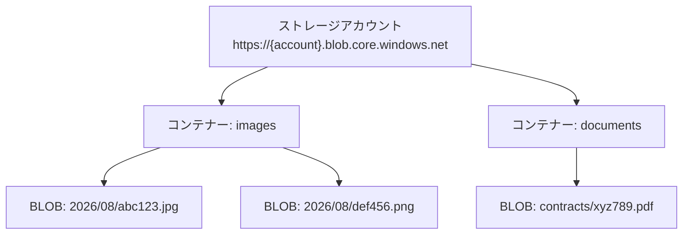
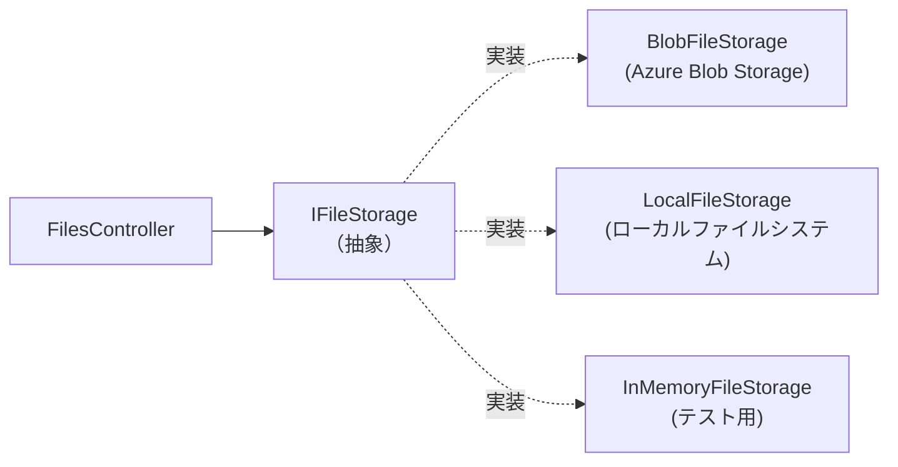
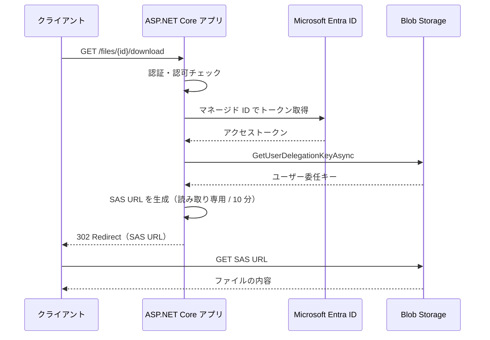
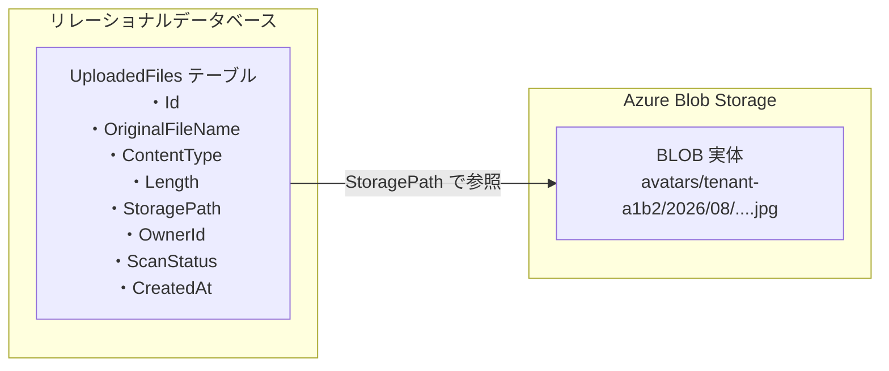
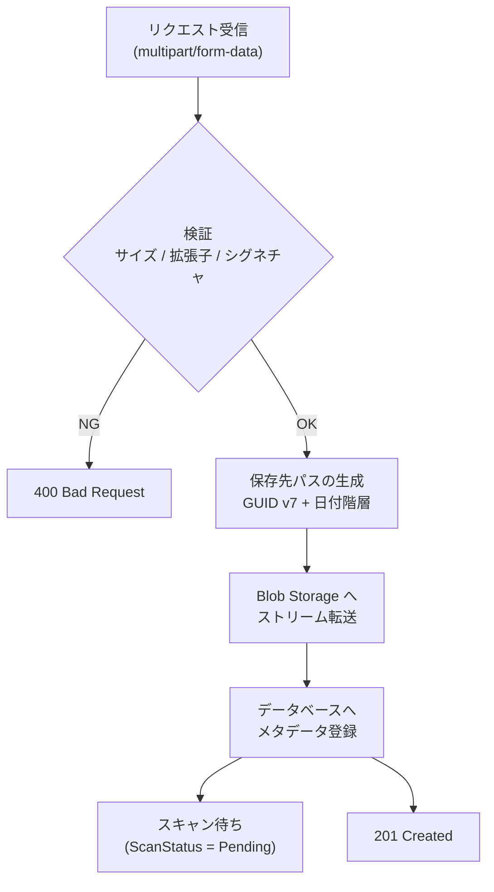

この章は [第7章（前編）：ファイル受信と検証](../07-1-file-upload-and-validation/index.md) の続きです。前編で受け取って検証したファイルを、Azure Blob Storage へ保存する方法を説明します。前編のコード例を前提にしている箇所があるため、先に前編を読んでおくことをおすすめします。

---

## 目次

1. [Azure Blob Storage への保存](#1-azure-blob-storage-への保存)
   - [Blob Storage のオブジェクトモデル](#blob-storage-のオブジェクトモデル)
   - [パッケージの追加と認証](#パッケージの追加と認証)
   - [ストリームをそのままアップロードする](#ストリームをそのままアップロードする)
   - [Content-Type とメタデータの設定](#content-type-とメタデータの設定)
   - [上書き制御](#上書き制御)
   - [Azurite によるローカル開発](#azurite-によるローカル開発)
2. [Blob Storage クライアントの DI 設計とアプリケーションへの組み込み](#2-blob-storage-クライアントの-di-設計とアプリケーションへの組み込み)
   - [AddAzureClients によるクライアント登録](#addazureclients-によるクライアント登録)
   - [ストレージ抽象化インターフェイスの設計](#ストレージ抽象化インターフェイスの設計)
   - [Blob Storage 実装](#blob-storage-実装)
   - [保存先パスの設計](#保存先パスの設計)
   - [公開と非公開のアクセス制御](#公開と非公開のアクセス制御)
   - [SAS による一時的なアクセス許可](#sas-による一時的なアクセス許可)
   - [メタデータ管理とデータベース連携](#メタデータ管理とデータベース連携)
   - [コントローラーからの利用](#コントローラーからの利用)
3. [参考ドキュメント](#3-参考ドキュメント)

---

## 1. Azure Blob Storage への保存

受け取ったファイルの保存先には、アプリケーションサーバーのローカルディスク、リレーショナルデータベースのバイナリ列、外部のオブジェクトストレージという 3 つの選択肢があります。

| 保存先 | 向いている場面 | 注意点 |
| --- | --- | --- |
| ローカルディスク | 単一サーバーで完結する小規模なアプリケーション | サーバーを増やすと他のサーバーからファイルが見えない。コンテナーでは再デプロイのたびに消える |
| データベースのバイナリ列 | ファイルとレコードの一貫性をトランザクションで保証したい場合 | 公式ドキュメントもパフォーマンスへの悪影響に注意を促している。バックアップサイズも膨らむ |
| オブジェクトストレージ | 上記以外のほとんどの場合 | 保存と参照が別のサービスになるため、後述するアクセス制御の設計が必要 |

本章が外部ストレージを扱うのは、Web アプリケーションが複数台構成やコンテナーで動くことが前提になった現在、3 つ目が既定の選択肢になるためです。

### Blob Storage のオブジェクトモデル

Azure Blob Storage は、大量の非構造化データ（画像、動画、ログ、バックアップなど）を保存するためのオブジェクトストレージサービスです。**BLOB (Binary Large Object) とは、ここに保存されるデータ 1 件分の単位** で、実質的には 1 つのファイルに相当します。データは 3 階層で構成されます。



.NET クライアントライブラリ `Azure.Storage.Blobs` は、この階層に対応する 3 つのクライアントクラスを提供します。

| クラス | 対応するリソース | 主な役割 |
| --- | --- | --- |
| `BlobServiceClient` | ストレージアカウント | コンテナーの一覧・作成、ユーザー委任キーの取得 |
| `BlobContainerClient` | コンテナー | コンテナー内の BLOB の一覧・作成・削除 |
| `BlobClient` | 個別の BLOB | アップロード、ダウンロード、プロパティ／メタデータの操作 |

```csharp
BlobServiceClient serviceClient = /* DI から取得 */;
BlobContainerClient containerClient = serviceClient.GetBlobContainerClient("images");
BlobClient blobClient = containerClient.GetBlobClient("2026/08/abc123.jpg");
```

> [!NOTE]
> Blob Storage には「フォルダー」という概念がありません。`2026/08/abc123.jpg` のようにスラッシュを含む名前は、単に BLOB 名の一部として扱われます。ただし Azure ポータルや `GetBlobsByHierarchyAsync` では、スラッシュを区切りとした階層構造として表示・列挙できます。

### パッケージの追加と認証

必要なパッケージを追加します。

```bash
dotnet add package Azure.Storage.Blobs
dotnet add package Azure.Identity
dotnet add package Microsoft.Extensions.Azure
```

| パッケージ | 用途 |
| --- | --- |
| `Azure.Storage.Blobs` | Blob Storage クライアントライブラリ |
| `Azure.Identity` | Microsoft Entra ID による認証（`DefaultAzureCredential` など） |
| `Microsoft.Extensions.Azure` | DI コンテナーへの Azure クライアント登録（`AddAzureClients`） |

認証方式には、接続文字列（アカウントキー）を使う方法と、Microsoft Entra ID を使う方法があります。**アカウントキーはストレージアカウント全体への完全な権限を持つため、Microsoft Entra ID による認証を推奨します**。

```csharp
using Azure.Identity;
using Azure.Storage.Blobs;

// 推奨: Microsoft Entra ID による認証
var serviceClient = new BlobServiceClient(
    new Uri("https://mystorageaccount.blob.core.windows.net"),
    new DefaultAzureCredential());
```

`DefaultAzureCredential` は、実行環境に応じて資格情報を自動的に切り替えます。

| 実行環境 | 使用される資格情報 |
| --- | --- |
| ローカル開発 | Azure CLI (`az login`)、Visual Studio、Azure Developer CLI のサインイン情報 |
| Azure App Service / Container Apps / VM | マネージド ID (Managed Identity) |
| CI/CD | 環境変数に設定されたサービスプリンシパル |

> [!IMPORTANT]
> Microsoft Entra ID で BLOB データを操作するには、**Azure RBAC ロールの割り当てが必要** です。`所有者 (Owner)` や `共同作成者 (Contributor)` といった管理プレーンのロールでは、BLOB データへのアクセス権は付与されません。データ操作には **ストレージ BLOB データ共同作成者 (Storage Blob Data Contributor)** などのデータプレーン用ロールを割り当ててください。
>
> 紛らわしいのは、データ用ロールがなくても **コンテナーの作成だけは成功する** ことです。コンテナーの作成や削除は管理プレーンのロールでも実行できるため、`所有者` の権限で試すと最初の操作が通ってしまいます。「コンテナーが作れたのだから権限は足りている」と考えると、続く BLOB のアップロードで初めて `403 (AuthorizationPermissionMismatch)` に遭遇することになります。

「ロールを割り当てる」と言われても、**誰に** 割り当てればよいのかが分かりにくいところです。割り当て先は `DefaultAzureCredential` が実際に使用する ID であり、それは実行環境ごとに異なります。

| 実行環境 | ロールの割り当て先（セキュリティプリンシパル） | 準備作業 |
| --- | --- | --- |
| ローカル開発 | **開発者本人の Microsoft Entra ID アカウント**（`az login` でサインインしたユーザー） | 開発者のアカウントに対象ストレージアカウントへのロールを割り当てる。チーム開発では、開発者を Entra ID のグループにまとめ、グループに割り当てると管理しやすい |
| Azure App Service | App Service の **マネージド ID** | App Service で「ID」→「システム割り当て済み」を「オン」にすると ID が発行される。その ID に対してロールを割り当てる |
| Azure Container Apps / Azure Functions / Azure VM | 各リソースの **マネージド ID** | App Service と同様に、リソース側でマネージド ID を有効化してからロールを割り当てる |
| GitHub Actions などの CI/CD | **サービスプリンシパル**（アプリ登録）またはフェデレーション ID | Entra ID にアプリを登録し、そのサービスプリンシパルにロールを割り当てる |

割り当てのスコープ（適用範囲）は、**必要最小限にすることが重要** です。サブスクリプション全体ではなく、対象のストレージアカウント、可能であればコンテナー単位まで絞り込んでください。ただし、後述の[ユーザー委任 SAS](#sas-による一時的なアクセス許可) を発行する場合は、コンテナー単位まで絞ると SAS の発行に失敗します（理由は次の表のあとに説明します）。

```bash
# Bash（Linux / macOS）
# 例 1: ローカル開発。サインイン中の開発者アカウントに、
#       特定のストレージアカウントに対する読み書き権限を与える
az role assignment create \
  --assignee-object-id "$(az ad signed-in-user show --query id -o tsv)" \
  --assignee-principal-type User \
  --role "Storage Blob Data Contributor" \
  --scope "/subscriptions/<サブスクリプション ID>/resourceGroups/<リソースグループ名>/providers/Microsoft.Storage/storageAccounts/<ストレージアカウント名>"

# 例 2: Azure App Service。まずシステム割り当てマネージド ID を有効化し、
#       発行されたプリンシパル ID にロールを割り当てる
PRINCIPAL_ID=$(az webapp identity assign \
  --name <アプリ名> --resource-group <リソースグループ名> \
  --query principalId -o tsv)

az role assignment create \
  --assignee-object-id "$PRINCIPAL_ID" \
  --assignee-principal-type ServicePrincipal \
  --role "Storage Blob Data Contributor" \
  --scope "/subscriptions/<サブスクリプション ID>/resourceGroups/<リソースグループ名>/providers/Microsoft.Storage/storageAccounts/<ストレージアカウント名>"
```

Windows の PowerShell では、行継続がバックスラッシュ (`\`) ではなくバッククォート (`` ` ``) である点と、コマンドの出力を変数に受け取る書き方が異なります。また `<` は PowerShell では将来の予約演算子とみなされるため、`<アプリ名>` のような差し替え用の箇所は引用符で囲む必要があります。同じ内容を PowerShell で書くと次のようになります。

```powershell
# PowerShell（Windows）
# 例 1: ローカル開発。サインイン中の開発者アカウントに、
#       特定のストレージアカウントに対する読み書き権限を与える
az role assignment create `
  --assignee-object-id "$(az ad signed-in-user show --query id -o tsv)" `
  --assignee-principal-type User `
  --role "Storage Blob Data Contributor" `
  --scope "/subscriptions/<サブスクリプション ID>/resourceGroups/<リソースグループ名>/providers/Microsoft.Storage/storageAccounts/<ストレージアカウント名>"

# 例 2: Azure App Service。まずシステム割り当てマネージド ID を有効化し、
#       発行されたプリンシパル ID にロールを割り当てる
$PRINCIPAL_ID = az webapp identity assign `
  --name "<アプリ名>" --resource-group "<リソースグループ名>" `
  --query principalId -o tsv

az role assignment create `
  --assignee-object-id "$PRINCIPAL_ID" `
  --assignee-principal-type ServicePrincipal `
  --role "Storage Blob Data Contributor" `
  --scope "/subscriptions/<サブスクリプション ID>/resourceGroups/<リソースグループ名>/providers/Microsoft.Storage/storageAccounts/<ストレージアカウント名>"
```

> [!IMPORTANT]
> 割り当て先の指定に `--assignee` ではなく **`--assignee-object-id` と `--assignee-principal-type` を使っています**。`--assignee` は渡された値をオブジェクト ID かアプリケーション ID か判別するために Microsoft Entra ID へ問い合わせるため、次の 2 つの状況で失敗します。
>
> - **マネージド ID を有効化した直後**。ID の作成が Microsoft Entra ID 全体へ反映されるまでに時間差があり、その間は「まだ存在しない」と判定される
> - **サインイン中のアカウントにディレクトリの読み取り権限がない**、またはネットワークから Microsoft Entra ID へ問い合わせできない
>
> 実際に、存在しないオブジェクト ID を渡して両者を比べると、動作の違いがはっきり出ます。
>
> | 指定方法 | 結果 |
> | --- | --- |
> | `--assignee` | `Cannot find user or service principal in graph database for '...'` で停止する |
> | `--assignee-object-id` + `--assignee-principal-type` | 問い合わせを行わず、次の処理（スコープの解決）まで進む |
>
> 上の例 2 は「マネージド ID を有効化し、その直後に割り当てる」という、まさに時間差が起きやすい流れです。**スクリプトで自動化する場合は必ずこちらを使ってください。** `--assignee-principal-type` には `User` / `Group` / `ServicePrincipal` / `ForeignGroup` を指定します。マネージド ID とアプリ登録はどちらも `ServicePrincipal` です。

用途に応じて、次のようにロールを使い分けます。

| ロール | 権限 | 主な用途 |
| --- | --- | --- |
| ストレージ BLOB データ閲覧者 (Storage Blob Data Reader) | 読み取りのみ | ファイルの配信だけを行うアプリ |
| ストレージ BLOB データ共同作成者 (Storage Blob Data Contributor) | 読み取り・書き込み・削除 | アップロード機能を持つアプリ。本章の例はこれを想定 |
| Storage Blob デリゲータ (Storage Blob Delegator) | ユーザー委任キーの取得のみ（BLOB データへのアクセス権は含まない） | データ用ロールを**コンテナー単位のスコープ**で割り当てているアプリに、ストレージアカウント以上のスコープで追加する |

> [!NOTE]
> 上の表では、Azure ポータルに表示される日本語名を主に、英語名をかっこ内に併記しています。**Azure CLI の `--role` に指定できるのは英語名だけです。** ロール定義そのものが英語名で登録されているため、日本語名を渡すと `Role 'ストレージ BLOB データ共同作成者' doesn't exist.` というエラーになります。次のコマンドで、指定できる正式名を確認できます。
>
> ```bash
> az role definition list --query "[?contains(roleName, 'Storage Blob')].roleName" -o tsv
> ```

> [!IMPORTANT]
> **ユーザー委任 SAS を発行するために、Storage Blob デリゲータを必ず追加する必要はありません。** ユーザー委任キーの取得に必要な `Microsoft.Storage/storageAccounts/blobServices/generateUserDelegationKey/action` は、上の 3 つのデータ用ロール（閲覧者・共同作成者・所有者）にもすべて含まれています。実際に、Storage Blob データ共同作成者だけを割り当てた状態でも `GetUserDelegationKeyAsync` は成功します。
>
> 注意すべきなのは **スコープ** のほうです。このアクションは、ストレージアカウント・リソースグループ・サブスクリプションのいずれかのレベルで付与されている必要があり、**コンテナー単位のスコープでは効きません**。
>
> | データ用ロールのスコープ | ユーザー委任 SAS の発行 | 対応 |
> | --- | --- | --- |
> | ストレージアカウント以上 | できる | 追加のロールは不要 |
> | コンテナー単位 | **できない** | ストレージアカウント以上のスコープで Storage Blob デリゲータを追加する |
>
> つまり Storage Blob デリゲータは、「データへのアクセスはコンテナー単位に絞ったまま、SAS の発行だけを許可したい」場合のためのロールです。

> [!TIP]
> ロールの割り当てが反映されるまで数分かかることがあります。設定直後に `403 Forbidden` が返る場合は、少し待ってから再試行してください。ローカル開発で権限設定が煩雑な場合は、後述の Azurite を使うとロール割り当て自体が不要になります。

#### 本番環境では資格情報を明示する

`DefaultAzureCredential` は「環境に合わせて自動で切り替わる」点が便利な一方、**どの資格情報が採用されるかを事前に保証できません**。これは本番環境では次のような問題を招きます。

たとえば、マネージド ID で稼働していた本番サーバーに、誰かが調査目的で Azure CLI をインストールして `az login` したとします。その後にマネージド ID 側の認証が何らかの理由で失敗すると、`DefaultAzureCredential` は失敗した資格情報を黙って読み飛ばし、次の候補である Azure CLI の資格情報を使い始めます。結果として、意図しない権限でアプリが動き続けることになります。

このため Microsoft は、**本番環境では `DefaultAzureCredential` を使わず、`ManagedIdentityCredential` のように決定的な資格情報へ置き換えること** を推奨しています。開発環境では引き続き利便性を優先し、`ChainedTokenCredential` で候補を明示的に列挙します。

```csharp
using Azure.Core;
using Azure.Identity;
using Microsoft.Extensions.Azure;

builder.Services.AddAzureClients(clientBuilder =>
{
    clientBuilder.AddBlobServiceClient(
        new Uri("https://mystorageaccount.blob.core.windows.net"));

    TokenCredential credential;
    if (builder.Environment.IsProduction() || builder.Environment.IsStaging())
    {
        // 本番・ステージング: マネージド ID だけを使う（フォールバックしない）
        // システム割り当て ID なら new ManagedIdentityCredential() で足りる
        var clientId = builder.Configuration["UserAssignedClientId"];
        credential = new ManagedIdentityCredential(
            ManagedIdentityId.FromUserAssignedClientId(clientId));
    }
    else
    {
        // ローカル開発: 使う可能性のある資格情報だけを明示的に列挙する
        credential = new ChainedTokenCredential(
            new AzureCliCredential(),
            new AzureDeveloperCliCredential());
    }

    clientBuilder.UseCredential(credential);
});
```

> [!TIP]
> `TokenCredential` は `Azure.Core` 名前空間にある、すべての資格情報クラスの基底型です。上記のように変数の型を `TokenCredential` にしておくことで、分岐の両方の結果を 1 つの変数で受け取れます。

資格情報を明示する効果は、セキュリティ面だけではありません。`DefaultAzureCredential` はローカル PC 上でも候補を順番に試すため、その途中でマネージド ID の取得を試みます。マネージド ID は Azure が仮想マシン内部に用意する固定アドレス (`169.254.169.254`) へ問い合わせて取得しますが、Azure 外のローカル PC にはその宛先が存在しません。この宛先への通信が明確に拒否される環境であれば即座に次の候補へ進めるものの、パケットが黙って破棄されるネットワークではタイムアウトを待つことになります。

筆者の環境で実際に計測したところ、`DefaultAzureCredential` のままではトークン取得に **約 180 秒**かかりました。上記のように `ChainedTokenCredential` で候補を絞ると **1 秒未満**で完了します。「アプリの起動が妙に遅い」と感じたら、まずこの点を疑ってください。

本章の以降のコード例では、説明を簡潔にするために `DefaultAzureCredential` を使用します。実際に本番環境へデプロイする際は、上記のように資格情報を明示してください。

### ストリームをそのままアップロードする

Web アプリケーションでのファイルアップロードでは、いったん自前でローカルディスクへ保存せず、受信したストリームを直接 Blob Storage へ流し込むのが基本形です。

```csharp
using Azure.Storage.Blobs;

public static async Task<Uri> UploadAsync(
    BlobContainerClient containerClient,
    IFormFile file,
    string blobName,
    CancellationToken cancellationToken)
{
    var blobClient = containerClient.GetBlobClient(blobName);

    await using var stream = file.OpenReadStream();
    await blobClient.UploadAsync(stream, overwrite: false, cancellationToken);

    return blobClient.Uri;
}
```

`UploadAsync` は、データサイズと転送オプションに応じて、単一の `Put Blob` 操作を行うか、`Put Block` を複数回実行してから `Put Block List` でコミットするかを自動的に選択します。大きなファイルの並列転送を制御したい場合は `StorageTransferOptions` を指定します。

> [!NOTE]
> ここで「ローカルディスクへ保存しない」と言っているのは、**アプリケーションのコードが保存先としてローカルディスクを選ばない** という意味です。`IFormFile` を使っている以上、64 KB を超えたファイルはフレームワークによって一時ファイルへ退避されており、`file.OpenReadStream()` はその一時ファイルを読んでいます。一時ファイルへの書き出しも含めて完全に回避したい場合は、[MultipartReader によるストリーミング受信](../07-1-file-upload-and-validation/index.md#multipartreader-によるストリーミング受信) を使い、受信しながら直接 `UploadAsync` へ渡します。

> [!IMPORTANT]
> **コンテナーは自動では作成されません**。存在しないコンテナーへアップロードすると、`RequestFailedException`（`Status: 404`、`ErrorCode: ContainerNotFound`）が発生します。
>
> コンテナーは Bicep や Terraform などのインフラ定義で事前に作成しておくのが原則です。アプリケーション側で用意したい場合は、**起動時に一度だけ** 作成を試みます。
>
> ```csharp
> // Program.cs（app.Run() の前）
> using (var scope = app.Services.CreateScope())
> {
>     var serviceClient = scope.ServiceProvider.GetRequiredService<BlobServiceClient>();
>     var container = serviceClient.GetBlobContainerClient("uploads");
>     await container.CreateIfNotExistsAsync();
> }
> ```
>
> リクエストのたびに `CreateIfNotExistsAsync` を呼ぶのは避けてください。毎回 `Get Container Properties` 相当のラウンドトリップが増えるうえ、コンテナー作成の権限（`Storage Blob Data Contributor` 以上）を実行時ずっと持ち続けることになります。

コンテナー名には、BLOB 名よりも厳しい命名規則があります。構成ファイルから読み込む値も、この規則を満たしていなければなりません。

| 規則 | ✅ 有効な例 | ❌ 無効な例 |
| --- | --- | --- |
| 使える文字は英小文字・数字・ハイフンのみ | `uploads`／`user-files` | `Uploads`（大文字）／`user_files`（アンダースコア）／`my.files`（ピリオド） |
| 長さは 3 文字以上 63 文字以下 | `img` | `up`（2 文字） |
| 先頭と末尾は英小文字か数字 | `a-b` | `-uploads`／`uploads-` |
| ハイフンを連続させない | `up-loads` | `a--b` |

規則に反する名前を指定すると、コンテナー作成の時点で `RequestFailedException`（`Status: 400`）が発生します。エラーコードは違反の種類で分かれ、**使えない文字を含む場合は `InvalidResourceName`、長さが範囲外の場合は `OutOfRangeInput`** になります。BLOB 名では大文字もスラッシュも使えるため、コンテナー名だけ規則が異なる点に注意してください。

```csharp
using Azure.Storage;
using Azure.Storage.Blobs.Models;

var options = new BlobUploadOptions
{
    TransferOptions = new StorageTransferOptions
    {
        // この値「未満」なら 1 回のリクエストでアップロードする閾値。
        // ちょうど同じサイズのときは分割される
        InitialTransferSize = 8 * 1024 * 1024,
        // 分割する場合の 1 ブロックあたりの最大サイズ
        MaximumTransferSize = 4 * 1024 * 1024,
        // 並列アップロード数
        MaximumConcurrency = 4,
    },
};

await blobClient.UploadAsync(stream, options, cancellationToken);
```

ストリーミング受信（`MultipartReader`）と組み合わせれば、大きなファイルをメモリに載せずに Blob Storage へ転送できます。

```csharp
while ((section = await reader.ReadNextSectionAsync(cancellationToken)) is not null)
{
    var contentDisposition = section.GetContentDispositionHeader();

    if (contentDisposition is not null && contentDisposition.IsFileDisposition())
    {
        var blobClient = containerClient.GetBlobClient($"{Guid.NewGuid():N}.bin");

        // multipart のセクションから Blob Storage へ直接ストリーム転送
        await blobClient.UploadAsync(section.Body, overwrite: false, cancellationToken);
    }
}
```

> [!TIP]
> Blob Storage 側にストリームを開いて少しずつ書き込みたい場合は、`BlockBlobClient.OpenWriteAsync` を使用します。ZIP アーカイブを組み立てながらアップロードするようなシナリオで有用です。内部では、バッファがいっぱいになるたびにブロックを送信し (Put Block)、ストリームを閉じたときにそれらを 1 つの BLOB として確定します (Put Block List)。Put Block はバージョンを作らないため、ブロックを何個送っても途中でバージョンが増えることはありません。
>
> ただし、このメソッドは**呼び出した時点で 0 バイトの BLOB を作成してから**書き込みを始めます。そのため次の点に注意してください。
>
> - 確定前でも BLOB は存在し、他のプロセスからは 0 バイトのファイルとして見えます。途中で処理が失敗すると 0 バイトの BLOB が残ります。
> - バージョン管理が有効な場合、1 回のアップロードで **0 バイトの過去バージョンと確定後の現行バージョンの 2 つ**が作られます。
> - `overwrite: false` は指定できず、`ArgumentException` (`BlockBlobClient.OpenWrite only supports overwriting`) になります。上書きを防ぎたい場合は `BlockBlobOpenWriteOptions.OpenConditions` に `IfNoneMatch = ETag.All` を指定します（既存の BLOB があれば 409 `BlobAlreadyExists` になります）。`ETag` は HTTP がリソースの版を表すために使う識別子で、詳しくは後述の[上書き制御](#上書き制御)で説明します。
>
> ただし、**同じ BLOB を何度も上書きする** 使い方には注意してください。バージョン管理が有効だと上書きのたびに以前の状態がバージョンとして残り、オブジェクトレプリケーションのポリシーを設定している場合はそのすべてがコピー先アカウントへ複製されるため、ストレージコストが膨らみます。Azure Blob の保管型バックアップ (vaulted backup) も内部でオブジェクトレプリケーションを使うため、同じことが起こります。

### Content-Type とメタデータの設定

BLOB には **システムプロパティ** と **ユーザー定義メタデータ** を設定できます。

| 種別 | 説明 | 例 |
| --- | --- | --- |
| システムプロパティ | HTTP ヘッダーに対応する既定のプロパティ | `ContentType`、`CacheControl`、`ContentDisposition` |
| ユーザー定義メタデータ | 任意の名前と値のペア | `uploadedBy`、`originalFileName` |

`Content-Type` を設定しないと、ブラウザが BLOB の URL を直接開いたときに `application/octet-stream` として扱われ、画像が表示されずダウンロードされてしまいます。アップロード時に `BlobUploadOptions.HttpHeaders` で指定します。

```csharp
using System.Text;
using Azure.Storage.Blobs.Models;

var uploadOptions = new BlobUploadOptions
{
    HttpHeaders = new BlobHttpHeaders
    {
        // クライアント申告値をそのまま使わず、拡張子から判定した値を設定する
        ContentType = ResolveContentType(blobName),
        CacheControl = "public, max-age=31536000",
    },
    Metadata = new Dictionary<string, string>
    {
        ["originalFileName"] = Convert.ToBase64String(Encoding.UTF8.GetBytes(file.FileName)),
        ["uploadedBy"] = userId,
        ["uploadedAt"] = DateTimeOffset.UtcNow.ToString("O"),
    },
};

await blobClient.UploadAsync(stream, uploadOptions, cancellationToken);
```

`CacheControl` に指定した値は、BLOB をダウンロードするときの `Cache-Control` 応答ヘッダーとしてそのまま返されます。上の例の `public, max-age=31536000`（1 年）は、BLOB 名に GUID を使い、いったん保存したファイルの内容を後から差し替えない運用を前提とした値です。同じ名前で内容を更新する可能性がある場合は短い期間にするか、`no-cache` を指定してください。また `public` は CDN やプロキシなどの共有キャッシュへの保存を許可する意味を持つため、後述の SAS で限定的に公開するファイルでは `private` を選びます。

`Content-Type` の判定には、`FileExtensionContentTypeProvider` を利用できます。このクラスは `Microsoft.AspNetCore.StaticFiles` アセンブリにありますが、ASP.NET Core の共有フレームワークに同梱されているため、**NuGet パッケージを追加する必要はありません**（同名のパッケージが NuGet に存在しますが、Web アプリケーションで追加すると `NU1510` 警告が出ます）。

拡張子から MIME タイプを引くだけの単純な仕組みで、未知の拡張子では `false` を返します。その場合は汎用の `application/octet-stream` にフォールバックさせます。

```csharp
using Microsoft.AspNetCore.StaticFiles;

private static readonly FileExtensionContentTypeProvider ContentTypeProvider = new();

private static string ResolveContentType(string fileName)
    => ContentTypeProvider.TryGetContentType(fileName, out var contentType)
        ? contentType
        : "application/octet-stream";
```

> [!WARNING]
> メタデータのキー名には、HTTP ヘッダーよりも **厳しい制約** があります。HTTP ヘッダー名では一般的なハイフンが使えない点に注意してください。
>
> | 対象 | 規則 | ✅ 有効な例 | ❌ 無効な例 |
> | --- | --- | --- | --- |
> | キー名 | 英字またはアンダースコアで始まり、以降は英数字とアンダースコアのみ（ASCII）。大文字小文字は区別されず、`uploadedAt` と `UploadedAt` は同じキーとして扱われる | `uploadedAt`／`_uploadedAt` | `uploaded-at`（ハイフン）／`1st`（数字始まり）／`ファイル名`（日本語） |
> | 値 | ASCII のみ | `2026-01-01` | `報告書.pdf`（日本語） |
> | 全体 | 1 つの BLOB につき合計 8 KB まで | — | — |
>
> 大文字小文字が区別されないことには落とし穴があります。`uploadedAt` と `UploadedAt` を **同時に指定しても、コードの側では何のエラーにもなりません**。SDK が送信前に 2 つを 1 つのヘッダーへまとめ、値をカンマ区切りで連結するためです（上の 2 つを指定すると `UploadedAt` の値が `lower, upper` のようになります）。HTTP ヘッダーの仕様上、同名ヘッダーが結合されるためこうなります。意図せず値が壊れるので、**キー名の綴りはコード全体で統一してください**。なお、接続文字列によるアクセスキー認証を使っている場合は、この結合が原因で要求の署名が合わなくなり `403` で失敗します。理由は後述の [Azurite によるローカル開発](#azurite-によるローカル開発) で説明します。
>
> 規則に反するキー名を指定したときの失敗の仕方は、**キーが ASCII かどうかで変わります**。
>
> | キー名の例 | どこで失敗するか | 例外 |
> | --- | --- | --- |
> | `uploaded-at`（ASCII だが規則違反） | サーバーが 400 を返す | `RequestFailedException`（`The metadata specified is invalid. It has characters that are not permitted.`） |
> | `ファイル名`（非 ASCII） | 送信前の HTTP ヘッダー組み立て | `InvalidOperationException`（`Unable to add header ... to header collection.`） |
>
> 非 ASCII のキーはリクエストとして成立しないため、サーバーの検証に到達する前に落ちます。エラーメッセージにキー名が出ないので原因が分かりにくく、**メタデータのキーは必ず ASCII の英数字とアンダースコアだけで組み立ててください**。
>
> 値に ASCII 以外を含めた場合も、同じくヘッダー組み立ての段階で失敗します。ただし落ち方が異なります。キーのときは 1 回で例外になりますが、値のときは **既定のリトライ設定に従って 6 回試行されてから** 諦めます。そのため表に出る例外は `RequestFailedException` ではなく **`AggregateException`** になり、メッセージは `Retry failed after 6 tries.`、その内側に `Request headers must contain only ASCII characters.` という `RequestFailedException` が 6 件入っています。クライアント側の誤りなのでリトライしても直らないうえ、`catch (RequestFailedException)` では捕捉できない点に注意してください。
>
> 日本語のファイル名などは、上記の例のように Base64 エンコードして保存するか、データベース側で管理してください。

アップロード後にメタデータを更新したり読み取ったりする場合は、`SetMetadataAsync` と `GetPropertiesAsync` を使います。

```csharp
// メタデータの更新（既存のメタデータは置き換えられる）
await blobClient.SetMetadataAsync(new Dictionary<string, string>
{
    ["scanStatus"] = "clean",
}, cancellationToken: cancellationToken);

// プロパティとメタデータの取得
BlobProperties properties = await blobClient.GetPropertiesAsync(cancellationToken: cancellationToken);
Console.WriteLine(properties.ContentType);
Console.WriteLine(properties.Metadata["scanStatus"]);
```

#### メタデータでは「検索」ができない

ここで重要な制約があります。**メタデータは、値を指定して BLOB を検索するための手段としては使えません**。

Blob Storage には BLOB を一覧・検索する手段がいくつかありますが、それぞれ役割が異なります。

| 手段 | できること | メタデータで絞り込めるか |
| --- | --- | --- |
| プレフィックス指定の一覧取得 (`GetBlobsAsync`) | 名前が特定の文字列で始まる BLOB を列挙する | できない |
| **BLOB インデックスタグ** (`Tags`) | キーと値の条件式で BLOB を横断的に検索する（例: `"scanStatus" = 'clean'`） | — （タグが検索対象） |
| Azure AI Search などの外部検索サービス | 全文検索や高度な条件検索を行う | 別途インデックスを構築すれば可能 |

> [!WARNING]
> 一覧取得の引数は `GetBlobsOptions` にまとめて渡します。以前は `GetBlobsAsync(prefix: "avatars/")` のように名前付き引数で一部だけを指定できましたが、**Azure.Storage.Blobs 12.27 以降は旧来のオーバーロードから既定値が外れており、この書き方はコンパイルできません**。`GetBlobsByHierarchyAsync` も同様です。Web 上の古い記事のコードをそのまま貼り付けるとビルドが通らないので注意してください。
>
> ```csharp
> using Azure.Storage.Blobs.Models;
>
> await foreach (BlobItem item in containerClient.GetBlobsAsync(
>     new GetBlobsOptions { Prefix = "avatars/tenant-a1b2/", Traits = BlobTraits.Metadata }))
> {
>     Console.WriteLine($"{item.Name} ({item.Properties.ContentLength} バイト)");
> }
> ```

このうち **BLOB インデックスタグ** は、Blob Storage が標準で提供する検索用の索引機能です。タグとして設定したキーと値は Blob Storage 側で索引化され、`FindBlobsByTagsAsync` で「タグの値がこの条件に一致する BLOB」をコンテナーをまたいで探し出せます。「スキャン未完了のファイルを全部拾いたい」「特定のテナントのファイルだけ集めたい」といった用途がこれにあたります。

一方、メタデータには索引が作られません。メタデータの値で BLOB を探そうとすると、全 BLOB を列挙して 1 件ずつクライアント側で条件に合うか確認することになり、件数が増えると現実的ではなくなります（`GetBlobsAsync(new GetBlobsOptions { Traits = BlobTraits.Metadata })` と指定すれば一覧の応答にメタデータを含められるので、BLOB ごとに `GetPropertiesAsync` を呼ぶ必要はありません。それでも全件を取得して絞り込む点は変わりません）。メタデータはあくまで、**BLOB のパスが既に分かっている状態で、その BLOB に付随する補足情報を取り出す** ための機能だと理解してください。

```csharp
// 検索したい属性はタグとして設定する（1 BLOB あたり最大 10 個）
var uploadOptions = new BlobUploadOptions
{
    Tags = new Dictionary<string, string>
    {
        ["scanStatus"] = "pending",
        ["tenantId"] = tenantId,
    },
};

await blobClient.UploadAsync(stream, uploadOptions, cancellationToken);

// タグを条件に BLOB を検索する
await foreach (TaggedBlobItem item in
    serviceClient.FindBlobsByTagsAsync("\"scanStatus\" = 'pending'", cancellationToken))
{
    Console.WriteLine($"{item.BlobContainerName}/{item.BlobName}");
}
```

> [!NOTE]
> タグにも制約があります。上のコメントに書いた個数の上限のほか、キーと値に使えるのは英数字と半角空白、`+`、`-`、`.`、`:`、`=`、`_`、`/` だけです（日本語は不可）。**メタデータと違ってキーの大文字小文字は区別される** ため、検索条件の綴りが 1 文字でも違うと一致しません。また、タグの索引化は非同期に行われるため、設定した直後の検索結果には反映されないことがあります。タグの読み書きにはメタデータとは別の権限が必要です。前掲の `ストレージ BLOB データ共同作成者 (Storage Blob Data Contributor)` にはタグ用の権限が含まれておらず、タグを指定してアップロードするだけで `403 (AuthorizationPermissionMismatch)` になります。`ストレージ BLOB データ所有者 (Storage Blob Data Owner)` のようにタグ操作を含むロールを別途割り当ててください。また、タグの個数に応じた課金も発生します。業務要件として確実な検索や結合が必要な場合は、後述の「[メタデータ管理とデータベース連携](#メタデータ管理とデータベース連携)」で扱うリレーショナルデータベースでの管理を選ぶのが現実的です。

> [!WARNING]
> `SetMetadataAsync` および `SetHttpHeadersAsync` は、指定した内容で **すべて置き換え** ます（部分更新ではありません）。一部の項目だけを変更したい場合も、`GetPropertiesAsync` で現在の値を取得し、変更しない項目を埋め直したうえで呼び出す必要があります。

### 上書き制御

同名の BLOB が既に存在する場合の挙動は、明示的に制御する必要があります。

```csharp
// ① 常に上書きする
await blobClient.UploadAsync(stream, overwrite: true, cancellationToken);

// ② 既存の場合は失敗させる（既定の動作）
//    既に存在すると RequestFailedException（HTTP 409 BlobAlreadyExists）がスローされる
await blobClient.UploadAsync(stream, overwrite: false, cancellationToken);
```

より細かく制御する場合は、`BlobRequestConditions` に条件付きヘッダーを指定します。ここで使う **ETag** は、HTTP がリソースの版を表すために用いる識別子で、Blob Storage では BLOB の内容が変わるたびに新しい値が振られます。`IfNoneMatch = ETag.All` は「どんな ETag とも一致しない場合だけ実行する」、つまり **その BLOB がまだ存在しない場合だけ書き込む** という指定です。

```csharp
using Azure;
using Azure.Storage.Blobs.Models;

// 新規作成のみを許可する（If-None-Match: *）
var createOnly = new BlobUploadOptions
{
    Conditions = new BlobRequestConditions { IfNoneMatch = ETag.All },
};

try
{
    await blobClient.UploadAsync(stream, createOnly, cancellationToken);
}
catch (RequestFailedException ex) when (ex.Status == StatusCodes.Status409Conflict)
{
    // 同名の BLOB が既に存在する
}
```

既存 BLOB の更新時に、取得してから更新するまでの間に他のプロセスが変更していないことを保証するには、**楽観的同時実行制御 (Optimistic Concurrency)** を使います。ダウンロード時に取得した `ETag` を `IfMatch` に指定すると、値が一致しない場合に HTTP 412 (Precondition Failed) が返ります。

```csharp
// 現在の ETag を取得する。GetPropertiesAsync は内容をダウンロードしないため、
// 大きなファイルでもメモリを消費しない
Response<BlobProperties> properties = await blobClient.GetPropertiesAsync(cancellationToken: cancellationToken);
ETag originalETag = properties.Value.ETag;

var conditionalUpdate = new BlobUploadOptions
{
    Conditions = new BlobRequestConditions { IfMatch = originalETag },
};

try
{
    await blobClient.UploadAsync(updatedContent, conditionalUpdate, cancellationToken);
}
catch (RequestFailedException ex) when (ex.Status == StatusCodes.Status412PreconditionFailed)
{
    // 取得後に他のプロセスが BLOB を更新した。再取得してやり直す
}
```

> [!WARNING]
> Azure Storage のクライアントライブラリは、**同一 BLOB への同時書き込みをサポートしていません**。複数のプロセスが同じ BLOB に書き込む可能性がある場合は、上記の楽観的同時実行制御か、次に説明する BLOB リースによる悲観的同時実行制御を実装してください。

**BLOB リース (Lease)** は、BLOB に対して **書き込みの排他ロック** を取得する仕組みです。リースを取得するとリース ID が発行され、以降その BLOB に書き込めるのはリース ID を提示したコードだけになります。楽観的同時実行制御が「衝突したら気付いてやり直す」方式なのに対し、リースは「そもそも他のコードに書かせない」方式です。

```csharp
using Azure.Storage.Blobs.Models;
using Azure.Storage.Blobs.Specialized;

BlobLeaseClient lease = blobClient.GetBlobLeaseClient();

// 期間は 15〜60 秒の範囲で指定する。TimeSpan.FromSeconds(-1) は無期限
string leaseId = (await lease.AcquireAsync(
    TimeSpan.FromSeconds(30), cancellationToken: cancellationToken)).Value.LeaseId;

try
{
    // リース ID を条件に渡した書き込みだけが成功する
    var leasedUpload = new BlobUploadOptions
    {
        Conditions = new BlobRequestConditions { LeaseId = leaseId },
    };

    await blobClient.UploadAsync(updatedContent, leasedUpload, cancellationToken);
}
finally
{
    // 処理が終わったら必ず解放する
    await lease.ReleaseAsync(cancellationToken: cancellationToken);
}
```

リース中の BLOB に対する操作の結果は次のとおりです。**読み取りは制限されない** ため、リースは「書き込みの排他」だと理解してください。

| リース中の操作 | 結果 |
| --- | --- |
| リース ID を渡さずに書き込む | HTTP 412 (`LeaseIdMissing`) |
| 別のコードがリースを取得しようとする | HTTP 409 (`LeaseAlreadyPresent`) |
| 内容を読み取る (`DownloadContentAsync`) | 成功する |
| 15 秒未満または 60 秒を超える期間を指定する | HTTP 400 (`InvalidHeaderValue`) |

処理が 60 秒を超える場合は `RenewAsync` でリースを更新し続けます。**解放を忘れると、期限が切れるまで他のコードがその BLOB を更新できなくなります**。無期限リースを解放し忘れた場合は、`BreakAsync` で強制的に解除するまで書き込めません。`try`／`finally` で確実に `ReleaseAsync` を呼ぶか、そもそも無期限リースを使わない設計にしてください。

| 制御方式 | 条件ヘッダー | 用途 |
| --- | --- | --- |
| 常に上書き | なし | 冪等なアップロード、キャッシュ的な用途 |
| 新規作成のみ | `IfNoneMatch = ETag.All` | 一意な名前を生成して保存する通常のアップロード |
| 楽観的同時実行制御 | `IfMatch = originalETag` | 既存ファイルの更新 |
| 悲観的同時実行制御 | `LeaseId = leaseId`（BLOB リース） | 長時間の排他が必要なバッチ処理 |

### Azurite によるローカル開発

ローカル開発では、Azure Storage のエミュレーターである **Azurite** を使うと、実際のストレージアカウントを作らずに動作を確認できます。

```bash
# Docker で起動する場合
docker run -p 10000:10000 -p 10001:10001 -p 10002:10002 mcr.microsoft.com/azure-storage/azurite

# npm でインストールして起動する場合
npm install -g azurite
azurite --silent --location ./azurite-data
```

> [!WARNING]
> Azurite が対応する Storage REST API のバージョンは、Azure SDK for .NET の更新に追いつかないことがあります。新しい SDK と組み合わせると、最初の操作でいきなり次の例外が発生します。
>
> ```text
> Azure.RequestFailedException: The API version 2026-06-06 is not supported by Azurite.
> Please upgrade Azurite to latest version and retry.
> Status: 400 (InvalidHeaderValue)
> ```
>
> メッセージは「Azurite を最新版に更新せよ」と促しますが、**Azurite が最新版でも解決しません**。実際に Azurite 3.36.0（npm の最新）と `Azure.Storage.Blobs` 12.29.2（NuGet の最新）の組み合わせで発生します。Azurite 側の API バージョンチェックを無効にして起動してください。
>
> ```bash
> azurite --silent --location ./azurite-data --skipApiVersionCheck
> ```
>
> Docker で起動する場合は注意が必要です。Azurite のイメージは `ENTRYPOINT` を持たず `CMD` だけで既定の引数を指定しているため、イメージ名の後ろにオプションを足すと**既定の引数がまるごと置き換わり**、ホストの待ち受け設定まで失われます。コマンド全体を書き直してください。
>
> ```bash
> docker run -p 10000:10000 -p 10001:10001 -p 10002:10002 mcr.microsoft.com/azure-storage/azurite azurite -l /data --blobHost 0.0.0.0 --queueHost 0.0.0.0 --tableHost 0.0.0.0 --skipApiVersionCheck
> ```
>
> 環境変数 `AZURITE_SKIP_API_VERSION_CHECK` は Azurite リポジトリの `main` ブランチの README に記載がありますが、**3.36.0 にはまだ含まれていません**。実際にこの環境変数だけを与えて起動しても、API バージョン検査は無効にならず同じ 400 が返ります。エラーメッセージ自体もコマンドラインパラメーターと Visual Studio Code の設定しか案内していません。

> [!WARNING]
> Azurite はエミュレーターであり、**実際の Azure Storage が拒否する操作を通してしまうことがあります**。ローカルで動いたからといって本番でも同じ結果になるとは限りません。実際に試すと、次のように分かれました。
>
> | 操作 | Azurite | 実際の Azure Storage |
> | --- | --- | --- |
> | 1,024 文字を超える BLOB 名でアップロード | 成功する | `400 (OutOfRangeInput)` |
> | アカウント側で匿名アクセスを許可していない状態でコンテナーを公開に設定 | 成功し、匿名の HTTP GET でも内容が読めてしまう | `409 (PublicAccessNotPermitted)` |
> | 合計 8 KB を超えるメタデータを設定 | 成功する | `400 (MetadataTooLarge)` |
>
> なお、前述の[メタデータのキーの大文字小文字](#content-type-とメタデータの設定)（`uploadedAt` と `UploadedAt` の同時指定）を、接続文字列によるアクセスキー認証で試すと次のエラーになります。
>
> ```text
> Azure.RequestFailedException: Server failed to authenticate the request.
> Make sure the value of the Authorization header is formed correctly including the signature.
> ```
>
> **これは Azurite 固有の制限ではありません。** アクセスキー認証では、要求の署名をクライアント側で計算してサーバーが受信内容から検証し直します。ところが SDK が署名に使う値は結合直後の `lower,upper` であるのに対し、実際に送信されるのは HTTP ヘッダーとして整形された `lower, upper`（カンマの後ろに空白）です。両者が食い違うため、署名の検証は必ず失敗します。したがって **アクセスキー認証を使う限り、実際の Azure Storage でも同じ結果になります**。異なる 2 つのキーや単独のキーで成功するのは、ヘッダーの結合が起きず署名対象と送信内容が一致するためです。
>
> 要求に署名を含まない Microsoft Entra ID 認証では、この問題は起きません。Azurite を OAuth モードで起動して `TokenCredential` で接続すると同じ操作が成功し、メタデータが `UploadedAt` に `lower, upper` として格納されることを確認できます。前掲の「値がカンマ連結される」という挙動は、この認証方式でこそ表面化します。
>
> 一方、コンテナー名の命名規則、メタデータのキー名の制約（`400 InvalidMetadata`）、`overwrite: false` の重複検出（`409 BlobAlreadyExists`）、`IfMatch` による楽観的同時実行制御（`412 ConditionNotMet`）は Azurite でも実際と同じ結果になります。**入力値の上限やアカウントレベルの設定が関わる検証は、実際のストレージアカウントで確認してください**。

Azurite は既知の開発用アカウントキーを持つため、開発環境では接続文字列 `UseDevelopmentStorage=true` を使用します。

```json
// appsettings.Development.json
{
  "Storage": {
    "ConnectionString": "UseDevelopmentStorage=true"
  }
}
```

```json
// appsettings.json（本番環境）
{
  "Storage": {
    "ServiceUri": "https://mystorageaccount.blob.core.windows.net"
  }
}
```

> [!TIP]
> `AddBlobServiceClient` は、構成セクションに `ConnectionString` があれば接続文字列で、`ServiceUri` があれば URI と資格情報でクライアントを生成します。上記のように環境別の JSON ファイルで使い分ければ、コードを変えずに開発環境と本番環境を切り替えられます。構成ファイルの優先順位については[第5章：アプリ設定 (Configuration)](../05-configuration/index.md)を参照してください。
>
> なお、上のコード例で使っている `//` コメントは、実際の `appsettings.json` にそのまま書けます。.NET の JSON 構成プロバイダーは、厳密な JSON では許されない `//` や `/* */` のコメントと末尾のカンマを受け付けます。

---

## 2. Blob Storage クライアントの DI 設計とアプリケーションへの組み込み

「[1. Azure Blob Storage への保存](#1-azure-blob-storage-への保存)」では `BlobServiceClient` を直接 `new` して Blob Storage を操作しました。しかし実際のアプリケーションでは、クライアントを DI コンテナーで管理し、アプリのコードからは抽象化されたインターフェイス越しに使うのが定石です。ここでは、前節で扱った Blob Storage の操作を、そのまま実運用に耐える形へ組み立て直していきます。

### AddAzureClients によるクライアント登録

`BlobServiceClient` は **スレッドセーフであり、再利用が推奨されるクライアント** です。リクエストのたびに `new` すると、コネクションプールの枯渇や認証トークン取得のオーバーヘッドを招きます。`Microsoft.Extensions.Azure` パッケージの `AddAzureClients` を使って、DI コンテナーに Singleton として登録します。

```csharp
using Azure.Identity;
using Microsoft.Extensions.Azure;

var builder = WebApplication.CreateBuilder(args);

builder.Services.AddAzureClients(clientBuilder =>
{
    // 構成セクションからクライアントを生成する
    clientBuilder.AddBlobServiceClient(builder.Configuration.GetSection("Storage"));

    // すべてのクライアントで共有する資格情報を設定する
    clientBuilder.UseCredential(new DefaultAzureCredential());

    // 再試行などの既定の動作を構成する
    clientBuilder.ConfigureDefaults(builder.Configuration.GetSection("AzureDefaults"));
});
```

```json
{
  "AzureDefaults": {
    "Retry": {
      "MaxRetries": 3,
      "Mode": "Exponential"
    }
  },
  "Storage": {
    "ServiceUri": "https://mystorageaccount.blob.core.windows.net"
  }
}
```

複数のストレージアカウントを使い分ける場合は、`WithName` で名前を付けて登録し、`IAzureClientFactory<T>` から取り出します。

```csharp
builder.Services.AddAzureClients(clientBuilder =>
{
    clientBuilder.AddBlobServiceClient(builder.Configuration.GetSection("PublicStorage"))
                 .WithName("public");
    clientBuilder.AddBlobServiceClient(builder.Configuration.GetSection("PrivateStorage"))
                 .WithName("private");
    clientBuilder.UseCredential(new DefaultAzureCredential());
});
```

```csharp
using Azure.Storage.Blobs;
using Microsoft.Extensions.Azure;

namespace FileUploadSample.Storage;

public sealed class ArchiveService(IAzureClientFactory<BlobServiceClient> clientFactory)
{
    private readonly BlobServiceClient _publicClient = clientFactory.CreateClient("public");
    private readonly BlobServiceClient _privateClient = clientFactory.CreateClient("private");
}
```

> [!WARNING]
> **すべてのクライアントに名前を付けると、名前なしの `BlobServiceClient` は DI から解決できなくなります**。この状態で `BlobServiceClient` をコンストラクターで直接受け取ろうとすると、`InvalidOperationException`（`Unable to find client registration with type 'BlobServiceClient' and name 'Default'.`）が発生します。名前を指定しない登録は `Default` という名前で扱われるため、このようなメッセージになります。
>
> なお、これは「型そのものが未登録」という一般的な DI のエラーとは別物です。`AddAzureClients` は `BlobServiceClient` を DI へ登録しており、解決しようとした時点で名前が見つからずに失敗します。そのため `ValidateOnBuild` では検出できません。
>
> 名前付き登録と併用したい場合は、既定として使うものを `WithName` なしで **もう一度登録** するか、後述の `BlobFileStorage` のようなクラス側を `IAzureClientFactory<BlobServiceClient>` を受け取る形に変更してください。

> [!NOTE]
> **他言語との比較**
> - Spring Boot (Java): `spring-cloud-azure-starter-storage-blob` が `BlobServiceClient` を Bean として自動構成する
> - NestJS (TypeScript): カスタムプロバイダーで `BlobServiceClient` を登録し、`@Inject()` で注入する
> - Django (Python): `django-storages` の `STORAGES` 設定でストレージバックエンドを差し替える
>
> いずれも「クライアントの生成と再利用をフレームワーク側に任せ、利用側は注入されたものを使う」という考え方は共通です。

### ストレージ抽象化インターフェイスの設計

アプリケーションのビジネスロジックが `BlobClient` に直接依存すると、ローカルファイルシステムや別のクラウドストレージへ差し替えづらくなり、単体テストも困難になります。**保存先に依存しないインターフェイス** を定義しましょう。



```csharp
namespace FileUploadSample.Storage;

/// <summary>ファイルの保存先を抽象化するインターフェイス。</summary>
public interface IFileStorage
{
    Task<StoredFile> SaveAsync(
        FileUploadDescriptor descriptor,
        CancellationToken cancellationToken = default);

    Task<Stream?> OpenReadAsync(string storagePath, CancellationToken cancellationToken = default);

    Task<bool> DeleteAsync(string storagePath, CancellationToken cancellationToken = default);

    Task<Uri> CreateReadUrlAsync(
        string storagePath,
        TimeSpan lifetime,
        string? downloadFileName = null,
        CancellationToken cancellationToken = default);
}

/// <summary>保存要求を表すレコード。</summary>
public sealed record FileUploadDescriptor(
    Stream Content,
    string StoragePath,
    string ContentType,
    IReadOnlyDictionary<string, string>? Metadata = null,
    bool AllowOverwrite = false);

/// <summary>保存結果を表すレコード。</summary>
public sealed record StoredFile(string StoragePath, long Length, string ETag);
```

> [!NOTE]
> この節以降のコード例では `FileUploadSample.Storage` のような名前空間を明示しています。[前編の第 2 節](../07-1-file-upload-and-validation/index.md#2-アップロードファイルの検証)で作成した `FileUploadOptions`、`UploadValidator`、`FileSignatureValidator` は検証の責務なので、`FileUploadSample.Validation` に置く前提です。名前空間が分かれるため、ストレージ側のコードからこれらを参照するときは `using FileUploadSample.Validation;` が必要です。以降のコード例でこの `using` が付いているのはそのためです。

> [!TIP]
> インターフェイスからは `BlobClient` や `Stream` 以外の Azure 固有の型を排除します。こうすることで、上位のサービス層は Azure SDK への参照を持たずに済み、テストではインメモリ実装に差し替えられます。

> [!NOTE]
> **他言語との比較**
> - Laravel (PHP): Flysystem を基盤とする `Storage` ファサードが同じ役割を担います。`config/filesystems.php` に「ディスク」を定義し、`Storage::disk('s3')` のように名前で切り替えます。公式にサポートされるドライバーはローカル・SFTP・Amazon S3 で、Azure Blob Storage を使う場合はサードパーティ製のパッケージを追加します
> - Go: Go Cloud Development Kit の `gocloud.dev/blob` が `blob.Bucket` という共通型を提供し、`azureblob`、`s3blob`、`gcsblob`、`fileblob`、`memblob` の実装を差し替えられます。テスト用のインメモリ実装が用意されている点も、上図の `InMemoryFileStorage` と同じ発想です
>
> 抽象化の粒度こそ違いますが、「保存先ごとの違いをインターフェイスの裏に隠す」という設計はどの言語でも共通です。

> [!NOTE]
> この抽象化は、他のクラウドストレージへの移行にも効きます。オブジェクトストレージはどれも「キーを指定してストリームを保存し、キーで取得する」という同じモデルなので、`IFileStorage` の実装を差し替えるだけで対応できます。
>
> | サービス | .NET SDK のパッケージ | 「コンテナー」に相当する概念 |
> | --- | --- | --- |
> | Azure Blob Storage | `Azure.Storage.Blobs` | コンテナー |
> | Amazon S3 | `AWSSDK.S3` | バケット |
> | Google Cloud Storage | `Google.Cloud.Storage.V1` | バケット |
> | MinIO（自己ホスト、S3 互換） | `AWSSDK.S3` または `Minio` | バケット |
>
> 一時的なアクセス URL を発行する仕組みも、Azure の SAS、S3 と MinIO の署名付き URL (Presigned URL)、Google Cloud Storage の署名付き URL と、いずれのサービスにも用意されています。そのため `CreateReadUrlAsync` も共通のインターフェイスとして表現できます。

### Blob Storage 実装

```csharp
using Azure;
using Azure.Storage.Blobs;
using Azure.Storage.Blobs.Models;
using Microsoft.Extensions.Options;
using System.ComponentModel.DataAnnotations;

namespace FileUploadSample.Storage;

public sealed class BlobStorageOptions
{
    public const string SectionName = "BlobStorage";

    // required だけでは構成バインド時に検証されないため [Required] を付ける
    [Required(AllowEmptyStrings = false)]
    public required string ContainerName { get; set; }
}

public sealed class BlobFileStorage(
    BlobServiceClient serviceClient,
    // SAS URL の発行役。実装は後述の「SAS による一時的なアクセス許可」で示す
    UserDelegationSasProvider sasProvider,
    IOptions<BlobStorageOptions> options,
    ILogger<BlobFileStorage> logger) : IFileStorage
{
    private readonly BlobContainerClient _container =
        serviceClient.GetBlobContainerClient(options.Value.ContainerName);

    public async Task<StoredFile> SaveAsync(
        FileUploadDescriptor descriptor,
        CancellationToken cancellationToken = default)
    {
        var blobClient = _container.GetBlobClient(descriptor.StoragePath);

        var uploadOptions = new BlobUploadOptions
        {
            HttpHeaders = new BlobHttpHeaders { ContentType = descriptor.ContentType },
            Metadata = descriptor.Metadata?.ToDictionary(pair => pair.Key, pair => pair.Value),
            Conditions = descriptor.AllowOverwrite
                ? null
                : new BlobRequestConditions { IfNoneMatch = ETag.All },
        };

        try
        {
            Response<BlobContentInfo> response =
                await blobClient.UploadAsync(descriptor.Content, uploadOptions, cancellationToken);

            return new StoredFile(
                descriptor.StoragePath,
                // 非シークストリーム（MultipartReader のセクションなど）ではサイズを取得できない。
                // 正確な値が必要なら、呼び出し側で数えるか GetPropertiesAsync で取得する
                descriptor.Content.CanSeek ? descriptor.Content.Length : 0,
                response.Value.ETag.ToString());
        }
        catch (RequestFailedException ex) when (ex.Status == StatusCodes.Status409Conflict)
        {
            logger.LogWarning("BLOB {StoragePath} は既に存在します。", descriptor.StoragePath);
            throw new InvalidOperationException($"'{descriptor.StoragePath}' は既に存在します。", ex);
        }
    }

    public async Task<Stream?> OpenReadAsync(
        string storagePath,
        CancellationToken cancellationToken = default)
    {
        var blobClient = _container.GetBlobClient(storagePath);

        try
        {
            return await blobClient.OpenReadAsync(cancellationToken: cancellationToken);
        }
        catch (RequestFailedException ex) when (ex.Status == StatusCodes.Status404NotFound)
        {
            return null;
        }
    }

    public async Task<bool> DeleteAsync(
        string storagePath,
        CancellationToken cancellationToken = default)
    {
        var blobClient = _container.GetBlobClient(storagePath);
        Response<bool> response = await blobClient.DeleteIfExistsAsync(
            cancellationToken: cancellationToken);

        return response.Value;
    }

    public Task<Uri> CreateReadUrlAsync(
        string storagePath,
        TimeSpan lifetime,
        string? downloadFileName = null,
        CancellationToken cancellationToken = default)
    {
        // SAS の生成は UserDelegationSasProvider へ委譲する。
        // 実装は「SAS による一時的なアクセス許可」を参照
        var blobClient = _container.GetBlobClient(storagePath);

        return sasProvider.CreateReadUrlAsync(
            blobClient, lifetime, downloadFileName, cancellationToken);
    }
}
```

登録はサービス登録用の拡張メソッドにまとめると、`Program.cs` が読みやすくなります。

```csharp
using Azure.Identity;
using FileUploadSample.Validation;
using Microsoft.Extensions.Azure;
using Microsoft.Extensions.DependencyInjection.Extensions;

namespace FileUploadSample.Storage;

public static class StorageServiceCollectionExtensions
{
    public static IServiceCollection AddBlobFileStorage(
        this IServiceCollection services,
        IConfiguration configuration)
    {
        services.AddAzureClients(clientBuilder =>
        {
            clientBuilder.AddBlobServiceClient(configuration.GetSection("Storage"));
            clientBuilder.UseCredential(new DefaultAzureCredential());
        });

        services.AddOptions<BlobStorageOptions>()
                .Bind(configuration.GetSection(BlobStorageOptions.SectionName))
                .ValidateDataAnnotations()
                .ValidateOnStart();

        // StoragePathBuilder と UploadValidator が依存するため、
        // FileUploadOptions の登録もこの拡張メソッドにまとめる
        services.AddOptions<FileUploadOptions>()
                .Bind(configuration.GetSection(FileUploadOptions.SectionName))
                .ValidateDataAnnotations()
                .ValidateOnStart();

        // BlobServiceClient は Singleton、ラッパーは Scoped で登録する
        services.AddScoped<IFileStorage, BlobFileStorage>();

        // 状態を持たず生成コストも低いため Transient で登録する
        // （第6章のライフタイム選択のガイドラインに従う）
        services.AddTransient<IUploadValidator, UploadValidator>();

        // ユーザー委任キーをキャッシュするため Singleton で登録する
        services.AddSingleton<UserDelegationSasProvider>();

        // TimeProvider は既定では登録されていないため、明示的に登録する
        services.TryAddSingleton(TimeProvider.System);
        // 保存先の BLOB 名を組み立てる。実装は後述の「保存先パスの設計」で示す
        services.AddSingleton<IStoragePathBuilder, StoragePathBuilder>();

        return services;
    }
}
```

```csharp
builder.Services.AddBlobFileStorage(builder.Configuration);
```

この拡張メソッドは 3 つの構成セクションを読み込みます。このうち `BlobStorage` と `FileUpload` には `ValidateOnStart()` を付けているため、値が欠けていると起動時に `OptionsValidationException` で停止します。

> [!WARNING]
> `AddBlobServiceClient` に渡す `Storage` セクションは、この仕組みの対象外です。実際に `Storage` セクションを削除して試すと、**アプリは何事もなく起動し**、最初に `BlobServiceClient` を必要とするリクエストが来た時点で `InvalidOperationException`（`Unable to find matching constructor while trying to create an instance of BlobServiceClient.`）になります。構成の書き間違いが本番稼働後まで発覚しない可能性があるため、起動時に確かめたい場合は次のように明示的に解決しておきます。
>
> ```csharp
> // 構成の誤りを起動時に検出する
> using (var scope = app.Services.CreateScope())
> {
>     scope.ServiceProvider.GetRequiredService<BlobServiceClient>();
> }
> ```

```json
{
  "Storage": {
    "ServiceUri": "https://mystorageaccount.blob.core.windows.net"
  },
  "BlobStorage": {
    "ContainerName": "uploads"
  },
  "FileUpload": {
    "MaxFileSizeBytes": 5242880,
    "PermittedExtensions": [ ".jpg", ".jpeg", ".png", ".pdf" ]
  }
}
```

> [!NOTE]
> `AddAzureClients` が登録する `BlobServiceClient` は **Singleton** です。`BlobFileStorage` を Scoped で登録しても、Singleton である `BlobServiceClient` に依存するだけなので Captive Dependency にはなりません（短いライフタイムから長いライフタイムへの依存は問題ありません）。ライフタイムの依存方向については[第6章：ライフタイム選択のガイドライン](../06-dependency-injection/index.md#ライフタイム選択のガイドライン)を参照してください。

### 保存先パスの設計

BLOB 名（保存先パス）の設計は、後からの変更が困難です。次の観点を考慮して決めます。

| 観点 | 指針 |
| --- | --- |
| **一意性** | GUID や ULID（時刻順にソートできる 26 文字の識別子）を含め、衝突しない名前にする |
| **推測困難性** | 連番は避ける。URL を推測して他人のファイルを取得されるリスクを減らす |
| **分散** | 先頭に日付やハッシュを置き、名前が特定のプレフィックスに集中しないようにする |
| **論理的な区分** | テナント ID、ユーザー ID、用途を階層に含めて運用しやすくする |
| **ライフサイクル管理** | 日付をパスに含めると、有効期限に基づく削除ポリシーを適用しやすい |

```text
{用途}/{区分ID}/{yyyy}/{MM}/{一意なID}{拡張子}

例: avatars/tenant-a1b2/2026/08/01a004c1b9c07c2e9d4f6a8b0c1d2e3f.jpg
```

| 部分 | 例の値 | 意味 |
| --- | --- | --- |
| 用途 | `avatars` | ファイルの用途。アプリ内でファイルの種類を分ける |
| 区分 ID | `tenant-a1b2` | テナント ID やユーザー ID など、ファイルを分ける単位 |
| 年 / 月 | `2026/08` | 有効期限に基づく削除ポリシーを適用しやすくする |
| 一意な ID | `01a004c1b9c07c2e9d4f6a8b0c1d2e3f` | `Guid.CreateVersion7()` の `"N"` 書式 |
| 拡張子 | `.jpg` | 検証済みの拡張子をそのまま使う |

```csharp
using FileUploadSample.Validation;
using Microsoft.Extensions.Options;
using System.Globalization;

namespace FileUploadSample.Storage;

public interface IStoragePathBuilder
{
    /// <param name="scopeId">ファイルを区分する単位の識別子。テナント ID やユーザー ID を指定する。</param>
    string Build(string category, string scopeId, string originalFileName);
}

public sealed class StoragePathBuilder(
    TimeProvider timeProvider,
    IOptions<FileUploadOptions> options) : IStoragePathBuilder
{
    public string Build(string category, string scopeId, string originalFileName)
    {
        var now = timeProvider.GetUtcNow();
        var extension = Path.GetExtension(originalFileName).ToLowerInvariant();

        // 拡張子もクライアント由来なので、そのまま BLOB 名に含めてはいけない。
        // 検証済みの値だけを受け入れる（多層防御。通常は上流の UploadValidator で弾かれる）
        if (!options.Value.PermittedExtensions.Contains(extension, StringComparer.OrdinalIgnoreCase))
        {
            throw new ArgumentException(
                $"許可されていない拡張子です: {extension}", nameof(originalFileName));
        }

        var id = Guid.CreateVersion7(now).ToString("N");

        // 日付の書式はカルチャに依存させない。
        // 書式指定子 yyyy は実行環境のカレンダーに従うため、たとえばタイ語環境では
        // 2026 年が 2569 年（仏暦）になり、同じ日時から別のパスが生成されてしまう
        var yearMonth = now.ToString("yyyy/MM", CultureInfo.InvariantCulture);

        // BLOB 名は、アプリケーションが生成した値と検証済みの拡張子だけで組み立てる
        return $"{category}/{scopeId}/{yearMonth}/{id}{extension}";
    }
}
```

> [!WARNING]
> BLOB 名にクライアント由来のファイル名を含めてはいけません。`Path.GetExtension` は最後の `.` 以降をそのまま返すだけなので、`report.b?c` を渡せば `.b?c` が、`report.` の後ろに 300 文字続く名前を渡せば `.` を含む 301 文字が、そのまま「拡張子」として返ります。BLOB 名の上限は 1,024 文字であり、これを超えると `400 (OutOfRangeInput)` でアップロードが失敗します。また、`?` や `#` は SDK が生成する URI では自動的にパーセントエンコードされますが、BLOB 名をデータベースに保存して後から自前で URL を組み立てる運用では、クエリ文字列やフラグメントとして解釈されて壊れます。元のファイル名はメタデータやデータベースに保持し、ダウンロード時に `Content-Disposition` ヘッダーで返してください。

> [!TIP]
> .NET 9 以降では `Guid.CreateVersion7()` が利用できます。UUID v7 は先頭に生成時刻（ミリ秒）を含むため、文字列としてソートするとおおむね時系列順に並び、一覧取得やライフサイクル管理と相性が良くなります。`TimeProvider` を注入しておくと、テストで時刻を固定できます。
>
> ただし、**同一ミリ秒内に生成した値どうしの順序は保証されません**（残りのビットは乱数のため）。実測でも、連続生成した 2 個が昇順になる割合はおよそ半分でした。厳密な生成順が必要な場合は、データベース側の連番やタイムスタンプ列で順序付けしてください。
>
> なお、引数なしの `Guid.CreateVersion7()` は **システムクロックを直接読む** ため、`TimeProvider` を注入しても値の時刻部分は固定できません。テストで時刻を固定したい場合は、`Guid.CreateVersion7(timeProvider.GetUtcNow())` のように時刻を渡すオーバーロードを使います。

### 公開と非公開のアクセス制御

Blob Storage への匿名アクセス（公開読み取り）は、既定で **無効** です。有効化するには、ストレージアカウントとコンテナーの両方で設定を変更する必要があります。

| ストレージアカウントの設定 | コンテナーのアクセスレベル | 結果 |
| --- | --- | --- |
| 匿名アクセスを許可しない | 任意 | すべて非公開。アカウント設定が優先される |
| 匿名アクセスを許可する | プライベート（既定） | 非公開 |
| 匿名アクセスを許可する | BLOB | BLOB は匿名で読めるが、一覧は取得できない |
| 匿名アクセスを許可する | コンテナー | BLOB の読み取りと一覧取得が匿名で可能 |

アカウント側で匿名アクセスを許可していない状態のまま、コンテナーに公開アクセスレベルを設定しようとすると、設定が黙って無視されるのではなく `409 (PublicAccessNotPermitted)` で失敗します。公開が必要な場合は、ストレージアカウントとコンテナーの両方を明示的に設定してください。

> [!WARNING]
> Microsoft は **匿名アクセスを許可しないこと** を推奨しています。公開が必要なファイルであっても、次のいずれかの方式を検討してください。
>
> 1. Azure CDN や Azure Front Door 経由で配信し、オリジンへの直接アクセスは遮断する
> 2. アプリケーションがプロキシとして配信し、認可を適用する
> 3. 有効期限付きの SAS URL を発行する

アプリケーションがプロキシとして配信する実装は次のようになります。認可チェックを挟めるため、非公開ファイルの配信に適しています。

以降のコード例に出てくる `_dbContext.UploadedFiles` は、アップロード時に BLOB 名や元のファイル名を記録しておくテーブルです。BLOB 名だけでは元のファイル名や所有者が分からないため、こうした情報はデータベース側に持ちます。具体的な設計は[メタデータ管理とデータベース連携](#メタデータ管理とデータベース連携)で扱います。

以降のコード例は、いずれもコントローラーのアクション部分だけを抜き出したものです。`_fileStorage` は[ストレージ抽象化インターフェイスの設計](#ストレージ抽象化インターフェイスの設計)で定義した `IFileStorage`、`_authorizationService` は ASP.NET Core 標準の `IAuthorizationService` を、それぞれコンストラクターで受け取っている前提とします。コントローラー全体の姿は[コントローラーからの利用](#コントローラーからの利用)で示します。

```csharp
[HttpGet("{id:guid}/content")]
public async Task<IActionResult> DownloadThroughApp(Guid id, CancellationToken cancellationToken)
{
    var record = await _dbContext.UploadedFiles.FindAsync([id], cancellationToken);
    if (record is null)
    {
        return NotFound();
    }

    // 認可チェック（所有者またはアクセス権を持つユーザーのみ）
    var authorization = await _authorizationService.AuthorizeAsync(User, record, "FileAccess");
    if (!authorization.Succeeded)
    {
        return Forbid();
    }

    var stream = await _fileStorage.OpenReadAsync(record.StoragePath, cancellationToken);
    if (stream is null)
    {
        return NotFound();
    }

    // 元のファイル名でダウンロードさせる。
    // File ヘルパーが Content-Disposition ヘッダーを組み立てるため、
    // 日本語のファイル名もフレームワーク側で正しくエンコードされる。
    return File(stream, record.ContentType, record.OriginalFileName);
}
```

> [!NOTE]
> プロキシ方式では、すべてのトラフィックがアプリケーションサーバーを経由します。大きなファイルや高頻度のダウンロードでは、帯域とサーバー負荷がボトルネックになります。その場合は次に説明する SAS URL へのリダイレクトが有効です。

### SAS による一時的なアクセス許可

**共有アクセス署名 (Shared Access Signature: SAS)** は、有効期限と権限を限定した URL を発行する仕組みです。クライアントはこの URL で Blob Storage へ直接アクセスできるため、アプリケーションサーバーを経由せずに済みます。

SAS には次の 3 種類があります。

| 種別 | 署名に使う鍵 | 特徴 |
| --- | --- | --- |
| **アカウント SAS** | ストレージアカウントキー | BLOB / キュー / テーブル / ファイルの複数サービスや、サービス自体の設定操作まで委任できる。範囲が広く、漏えいしたときの影響が最も大きい |
| **サービス SAS** | ストレージアカウントキー | 単一のサービス内のリソースに限定される。アカウントキーをアプリケーションが保持する必要がある |
| **ユーザー委任 SAS** | ユーザー委任キー（Microsoft Entra ID 由来） | Blob Storage 専用。アカウントキーが不要で、**推奨** |

ユーザー委任 SAS は、`BlobServiceClient.GetUserDelegationKeyAsync` で取得したキーで署名します。キーの有効期間は最大 7 日間で、SAS はキーの有効期限を超えて使えないため、ユーザー委任 SAS の期限も実質的に最大 7 日間です。

> [!IMPORTANT]
> **ユーザー委任キーが期限切れになると、SAS 自体の有効期限が残っていても認可エラーになります。** キーは取得コストがかかるためキャッシュするのが定石ですが、「キャッシュしたキーが、これから発行する SAS の有効期限まで生きているか」を基準に再利用の可否を判断しなければなりません。単に「キーの期限が数分後より先か」だけで判定すると、残り 5 分のキーで 10 分間有効な SAS を発行してしまい、5 分後に突然 403 が返るという再現しにくい不具合になります。

```csharp
using Azure;
using Azure.Storage.Blobs;
using Azure.Storage.Blobs.Models;
using Azure.Storage.Sas;
using Microsoft.Net.Http.Headers;

namespace FileUploadSample.Storage;

public sealed class UserDelegationSasProvider(BlobServiceClient serviceClient, TimeProvider timeProvider)
    : IDisposable
{
    // キーと有効期限を 1 つの参照にまとめる。
    // 参照の代入はアトミックなので、ロックを取らずに読んでも
    // 「キーと期限がちぐはぐな組み合わせ」にはならない
    private sealed record CachedKey(UserDelegationKey Key, DateTimeOffset ExpiresOn);

    // キーは SAS の期限より少し長めに取り、キャッシュ判定の余裕 (5 分) を上回るようにする
    private static readonly TimeSpan KeyMargin = TimeSpan.FromMinutes(10);

    // ユーザー委任キーの有効期間は最大 7 日間。SAS の期限はその余裕分だけ短くなる
    private static readonly TimeSpan MaxLifetime = TimeSpan.FromDays(7) - KeyMargin;

    private CachedKey? _cached;
    private readonly SemaphoreSlim _semaphore = new(1, 1);

    public async Task<Uri> CreateReadUrlAsync(
        BlobClient blobClient,
        TimeSpan lifetime,
        string? downloadFileName = null,
        CancellationToken cancellationToken = default)
    {
        ArgumentOutOfRangeException.ThrowIfLessThanOrEqual(lifetime, TimeSpan.Zero);
        ArgumentOutOfRangeException.ThrowIfGreaterThan(lifetime, MaxLifetime);

        var key = await GetUserDelegationKeyAsync(lifetime, cancellationToken);
        var now = timeProvider.GetUtcNow();

        var sasBuilder = new BlobSasBuilder
        {
            BlobContainerName = blobClient.BlobContainerName,
            BlobName = blobClient.Name,
            Resource = "b",
            // 時計のずれを考慮して開始時刻を少し前倒しする
            StartsOn = now.AddMinutes(-5),
            ExpiresOn = now.Add(lifetime),
        };

        // 読み取り専用の権限のみを付与する
        sasBuilder.SetPermissions(BlobSasPermissions.Read);

        if (downloadFileName is not null)
        {
            // ファイル名をそのまま文字列連結してはいけない。
            // HTTP ヘッダーは ASCII しか運べないため、日本語などを含めると
            // ダウンロード時のファイル名が壊れる。しかもここでは例外が出ない (後述)。
            // SetHttpFileName が RFC 6266 に従って
            // ASCII 版 (filename) と UTF-8 版 (filename*) の両方を組み立ててくれる。
            var contentDisposition = new ContentDispositionHeaderValue("attachment");
            contentDisposition.SetHttpFileName(downloadFileName);
            sasBuilder.ContentDisposition = contentDisposition.ToString();
        }

        var uriBuilder = new BlobUriBuilder(blobClient.Uri)
        {
            Sas = sasBuilder.ToSasQueryParameters(key, blobClient.AccountName),
        };

        return uriBuilder.ToUri();
    }

    private async Task<UserDelegationKey> GetUserDelegationKeyAsync(
        TimeSpan lifetime,
        CancellationToken cancellationToken)
    {
        // ユーザー委任キーが期限切れになると、SAS 自体の有効期限が残っていても
        // 認可エラーになる。そのため「発行する SAS の有効期限まで
        // キーが生きているか」を基準に、キャッシュの再利用可否を判断する
        bool CoversLifetime(CachedKey? cached) =>
            cached is not null
            && cached.ExpiresOn > timeProvider.GetUtcNow().Add(lifetime).AddMinutes(5);

        // フィールドをローカル変数へ 1 度だけ読み出す
        var cached = _cached;
        if (CoversLifetime(cached))
        {
            return cached!.Key;
        }

        await _semaphore.WaitAsync(cancellationToken);
        try
        {
            // 待っている間に他のスレッドが取得済みかもしれないので、もう一度確認する
            cached = _cached;
            if (CoversLifetime(cached))
            {
                return cached!.Key;
            }

            var now = timeProvider.GetUtcNow();

            // これから発行する SAS の期限より確実に長いキーを要求する。
            // 固定値 (たとえば常に 1 時間) にすると、lifetime が長いときに
            // 取得直後のキーでも CoversLifetime を満たさず、
            // 毎回キーを取り直したうえに SAS がキーの期限切れで 403 になる
            var expiresOn = now.Add(lifetime).Add(KeyMargin);
            Response<UserDelegationKey> response = await serviceClient.GetUserDelegationKeyAsync(
                now.AddMinutes(-5), expiresOn, cancellationToken);

            _cached = new CachedKey(response.Value, expiresOn);

            return response.Value;
        }
        finally
        {
            _semaphore.Release();
        }
    }

    // SemaphoreSlim は破棄が必要なため、IDisposable を実装して DI コンテナーに任せる。
    // Singleton として登録した場合、アプリケーション終了時に自動で呼ばれる
    public void Dispose() => _semaphore.Dispose();
}
```

> [!WARNING]
> **SAS に埋め込む `Content-Disposition` は、ファイル名を文字列連結で組み立てても例外が出ません。** `ASP.NET Core` の応答ヘッダーに直接代入した場合は、ASCII 以外を含んだ時点で `InvalidOperationException`（`Invalid non-ASCII or control character in header`）が発生してすぐ気づけます。しかし SAS の場合は値が URL のクエリ文字列（`rscd`）に入るだけなので、`ToSasQueryParameters` は何事もなく URL を返します。壊れるのは、その URL でダウンロードした利用者の手元にファイル名が届いたときです。
>
> 開発中に日本語のファイル名で試さないかぎり気づけないため、`SetHttpFileName` を使う習慣そのものが防御になります。`SetHttpFileName("決算報告書.pdf")` は `attachment; filename=_____.pdf; filename*=UTF-8''%E6%B1%BA...` のように、ASCII しか読めない古いクライアント向けの代替名と、UTF-8 で符号化した本来の名前を併記します。

> [!NOTE]
> `SemaphoreSlim` のように破棄が必要なフィールドを持つクラスは、`IDisposable` を実装しておきます。DI コンテナーは、自分が生成したインスタンスが `IDisposable` を実装していれば、そのスコープ（Singleton ならアプリケーション終了時）で自動的に `Dispose()` を呼びます。実装を忘れると .NET のコード アナライザーが CA1001 で警告します。

コントローラーからは、SAS URL へのリダイレクトを返します。

```csharp
[HttpGet("{id:guid}/download")]
public async Task<IActionResult> RedirectToSasUrl(Guid id, CancellationToken cancellationToken)
{
    var record = await _dbContext.UploadedFiles.FindAsync([id], cancellationToken);
    if (record is null)
    {
        return NotFound();
    }

    // 認可はアプリケーション側で実施し、通過した場合のみ短命な URL を発行する。
    // 元のファイル名を渡すと、SAS 側の Content-Disposition で復元される
    var url = await _fileStorage.CreateReadUrlAsync(
        record.StoragePath, TimeSpan.FromMinutes(10), record.OriginalFileName, cancellationToken);

    return Redirect(url.ToString());
}
```

このダウンロード処理で、クライアント・アプリケーション・Microsoft Entra ID・Blob Storage の間をやり取りが行き来する順序を時系列で表すと、次のようになります。



> [!WARNING]
> SAS URL は **URL を知っていれば誰でもアクセスできます**。有効期限は必要最小限（数分〜数十分）にし、権限は読み取り専用に限定してください。また、SAS URL をログや外部サービスへ送信しないよう注意が必要です。監査のために記録を残したい場合は、URL そのものではなく「いつ、誰が、どのファイルに対して発行したか」を記録します。

> [!NOTE]
> `UserDelegationSasProvider` はユーザー委任キーをフィールドにキャッシュしているため、**Singleton として登録します**（前掲の `AddBlobFileStorage` に含めてあります）。Scoped や Transient で登録すると、リクエストのたびに新しいインスタンスが作られてキャッシュが空になり、毎回 `GetUserDelegationKeyAsync` が呼ばれてしまいます。

> [!NOTE]
> SAS URL をクライアントへ渡す方法には、次の 2 通りがあります。
>
> | 方法 | 応答 | 向いている場面 | 注意点 |
> | --- | --- | --- | --- |
> | リダイレクト（上の例） | 302 + `Location` ヘッダー | `<a href>` や `` から直接参照する場合。ブラウザが自動で追跡する | SAS URL が `Location` ヘッダーに載るため、**リバースプロキシやアクセスログに記録されやすい** |
> | JSON で返す | 200 + `{ "url": "..." }` | SPA やモバイルアプリから `fetch` で取得する場合 | クライアント側で URL を扱うコードが必要 |
>
> 本章の最後に示す完成形のコントローラーでは、API としての利用を想定して後者（JSON で返す）を採用しています。認可チェックの実装を含む全体像は[コントローラーからの利用](#コントローラーからの利用)を参照してください。

> [!TIP]
> アップロードにも SAS を利用できます。書き込み権限 (`BlobSasPermissions.Write`) を持つ SAS URL をクライアントへ発行すれば、大容量ファイルをアプリケーションサーバーを経由せずに直接 Blob Storage へアップロードできます（ダイレクトアップロード）。この場合、サーバー側では検証を行えないため、アップロード完了後にバックグラウンドで検証する設計が必要です。

### メタデータ管理とデータベース連携

BLOB のメタデータは HTTP ヘッダーの制約を受け、検索もできません。実運用では **ファイルの属性はデータベースで管理し、BLOB は実体の保存にのみ使う** 構成が基本です。



```csharp
namespace FileUploadSample.Models;

public class UploadedFile
{
    public Guid Id { get; set; }

    /// <summary>表示用の元ファイル名。出力時は必ず HTML エンコードする。</summary>
    public required string OriginalFileName { get; set; }

    /// <summary>サーバー側で判定した MIME タイプ。</summary>
    public required string ContentType { get; set; }

    public long Length { get; set; }

    /// <summary>BLOB 名（コンテナー内のパス）。</summary>
    public required string StoragePath { get; set; }

    public required string OwnerId { get; set; }

    public ScanStatus ScanStatus { get; set; } = ScanStatus.Pending;

    public DateTimeOffset CreatedAt { get; set; }
}

public enum ScanStatus
{
    Pending,
    Clean,
    Infected,
}
```

> [!IMPORTANT]
> BLOB への保存とデータベースへの登録は、**トランザクションで一体化できません**。次のような不整合が起こり得ます。
>
> | 状況 | 結果 | 対策 |
> | --- | --- | --- |
> | BLOB 保存後、DB 登録前に失敗 | 参照されない BLOB（孤児）が残る | 定期的なクリーンアップジョブ、またはライフサイクル管理ポリシー |
> | DB 登録後、BLOB 保存前に失敗 | 実体のないレコードが残る | 先に BLOB を保存し、成功後に DB へ登録する順序にする |
> | DB のレコード削除後、BLOB 削除前に失敗 | 孤児 BLOB が残る | 論理削除 + バックグラウンド削除にする |
>
> 一般的には「**先に BLOB を保存し、成功したらデータベースへ登録する**」順序とし、孤児 BLOB は許容したうえでクリーンアップジョブで回収します。

### コントローラーからの利用

ここまでの要素を組み合わせた完成形です。

> [!NOTE]
> 以降のコードに登場する `AppDbContext` は、Entity Framework Core の `DbContext` を継承したアプリケーション独自のクラスで、上記の `UploadedFile` を `DbSet<UploadedFile> UploadedFiles` として公開しているものとします。EF Core については本章では扱いません。

```csharp
using System.Security.Claims;
using FileUploadSample.Models;
using FileUploadSample.Storage;
using FileUploadSample.Validation;
using Microsoft.AspNetCore.Authorization;
using Microsoft.AspNetCore.Mvc;
using Microsoft.AspNetCore.StaticFiles;

namespace FileUploadSample.Controllers;

[ApiController]
[Authorize]
[Route("api/files")]
public class FilesController(
    IFileStorage fileStorage,
    IUploadValidator validator,
    IStoragePathBuilder pathBuilder,
    AppDbContext dbContext,
    TimeProvider timeProvider,
    ILogger<FilesController> logger) : ControllerBase
{
    private static readonly FileExtensionContentTypeProvider ContentTypeProvider = new();

    [HttpPost]
    [RequestSizeLimit(10 * 1024 * 1024)]
    public async Task<IActionResult> Upload(IFormFile file, CancellationToken cancellationToken)
    {
        // ① 検証（空ファイル・サイズ・拡張子・シグネチャをまとめて確認する）
        var validation = validator.Validate(file);
        if (!validation.IsValid)
        {
            // 第3章で扱った ProblemDetails 形式でエラーを返す
            return ValidationProblem(detail: validation.ErrorMessage);
        }

        var ownerId = User.FindFirstValue(ClaimTypes.NameIdentifier)
            ?? throw new InvalidOperationException("ユーザー ID を特定できません。");
        // 第 1 引数は用途。コンテナー名 (uploads) とは別の階層になるため、
        // ここに "uploads" を渡すと BLOB 名が uploads/uploads/... と重複する。
        // 第 2 引数はファイルを区分する単位。ここではユーザーごとに分けるため ownerId を渡す
        var storagePath = pathBuilder.Build("attachments", ownerId, file.FileName);
        var contentType = ResolveContentType(file.FileName);

        // ② BLOB へ保存（受信ストリームをそのまま転送）
        await using var content = file.OpenReadStream();
        var descriptor = new FileUploadDescriptor(
            Content: content,
            StoragePath: storagePath,
            ContentType: contentType,
            Metadata: new Dictionary<string, string>
            {
                ["ownerId"] = ownerId,
                ["uploadedAt"] = timeProvider.GetUtcNow().ToString("O"),
            },
            AllowOverwrite: false);

        var stored = await fileStorage.SaveAsync(descriptor, cancellationToken);

        // ③ メタデータをデータベースへ登録
        var now = timeProvider.GetUtcNow();
        var record = new UploadedFile
        {
            Id = Guid.CreateVersion7(now),
            OriginalFileName = file.FileName,
            ContentType = contentType,
            Length = file.Length,
            StoragePath = stored.StoragePath,
            OwnerId = ownerId,
            ScanStatus = ScanStatus.Pending,
            CreatedAt = now,
        };

        dbContext.UploadedFiles.Add(record);
        await dbContext.SaveChangesAsync(cancellationToken);

        logger.LogInformation("ファイル {FileId} を {StoragePath} へ保存しました。", record.Id, stored.StoragePath);

        return CreatedAtAction(nameof(GetDownloadUrl), new { id = record.Id }, new { id = record.Id });
    }

    [HttpGet("{id:guid}/download-url")]
    public async Task<IActionResult> GetDownloadUrl(Guid id, CancellationToken cancellationToken)
    {
        var record = await dbContext.UploadedFiles.FindAsync([id], cancellationToken);

        if (record is null || record.OwnerId != User.FindFirstValue(ClaimTypes.NameIdentifier))
        {
            // 存在の有無を漏らさないよう、権限がない場合も 404 を返す
            return NotFound();
        }

        if (record.ScanStatus != ScanStatus.Clean)
        {
            return Problem(
                detail: "ウイルススキャンが完了していません。",
                statusCode: StatusCodes.Status409Conflict);
        }

        var url = await fileStorage.CreateReadUrlAsync(
            record.StoragePath, TimeSpan.FromMinutes(10), record.OriginalFileName, cancellationToken);

        return Ok(new { url, expiresInSeconds = 600 });
    }

    private static string ResolveContentType(string fileName)
        => ContentTypeProvider.TryGetContentType(fileName, out var contentType)
            ? contentType
            : "application/octet-stream";
}
```

処理の流れは次のとおりです。



> [!TIP]
> `IFileStorage` を抽象化しておけば、単体テストではインメモリ実装に差し替えられ、Azure への接続なしでコントローラーのロジックを検証できます。統合テストでは Azurite を起動して実際の Blob Storage API に対して検証すると、より高い信頼性が得られます。

---

## 3. 参考ドキュメント

- [クイック スタート: .NET 用 Azure Blob Storage クライアント ライブラリ | Microsoft Learn](https://learn.microsoft.com/ja-jp/azure/storage/blobs/storage-quickstart-blobs-dotnet)
- [.NET を使用して BLOB をアップロードする | Microsoft Learn](https://learn.microsoft.com/ja-jp/azure/storage/blobs/storage-blob-upload)
- [.NET を使用して BLOB のプロパティとメタデータを管理する | Microsoft Learn](https://learn.microsoft.com/ja-jp/azure/storage/blobs/storage-blob-properties-metadata)
- [BLOB インデックス タグを使用して Azure BLOB データを管理および検索する | Microsoft Learn](https://learn.microsoft.com/ja-jp/azure/storage/blobs/storage-manage-find-blobs)
- [BLOB ストレージ内でコンカレンシーを管理する | Microsoft Learn](https://learn.microsoft.com/ja-jp/azure/storage/blobs/concurrency-manage)
- [コンテナーと BLOB 用の匿名読み取りアクセスを構成する | Microsoft Learn](https://learn.microsoft.com/ja-jp/azure/storage/blobs/anonymous-read-access-configure)
- [.NET を使用して Azure BLOB、Azure Files、Azure Queue のユーザー委任 SAS を作成する | Microsoft Learn](https://learn.microsoft.com/ja-jp/azure/storage/blobs/storage-blob-user-delegation-sas-create-dotnet)
- [.NET を使用してコンテナーまたは BLOB のサービス SAS を作成する | Microsoft Learn](https://learn.microsoft.com/ja-jp/azure/storage/blobs/sas-service-create-dotnet)
- [Azure SDK for .NET での依存関係の挿入 | Microsoft Learn](https://learn.microsoft.com/ja-jp/dotnet/azure/sdk/dependency-injection)
- [Azure サービスを使用して .NET アプリケーションを認証する方法 | Microsoft Learn](https://learn.microsoft.com/ja-jp/dotnet/azure/sdk/authentication/)
- [.NET 用 Azure Identity ライブラリを使用した認証のベスト プラクティス | Microsoft Learn](https://learn.microsoft.com/ja-jp/dotnet/azure/sdk/authentication/best-practices)
- [.NET 用 Azure Identity ライブラリの資格情報チェーン | Microsoft Learn](https://learn.microsoft.com/ja-jp/dotnet/azure/sdk/authentication/credential-chains)
- [ローカルの Azure Storage 開発に Azurite エミュレーターを使用する | Microsoft Learn](https://learn.microsoft.com/ja-jp/azure/storage/common/storage-use-azurite)
