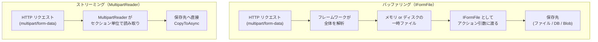
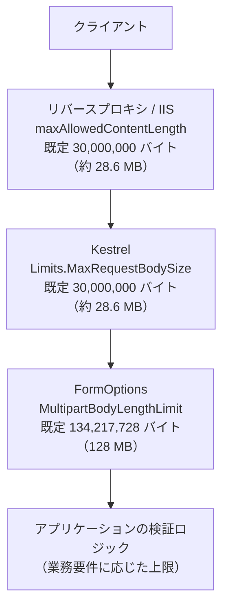
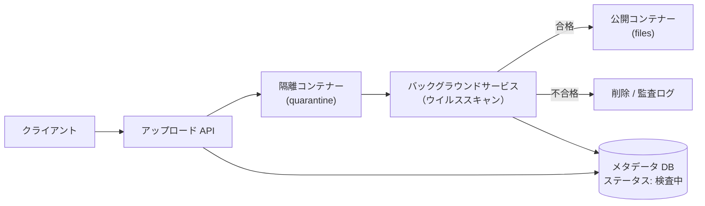
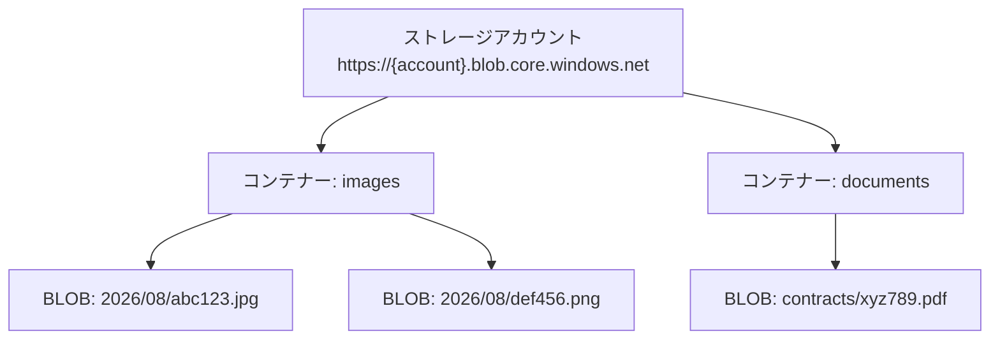
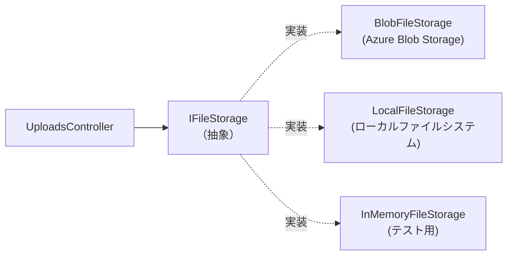
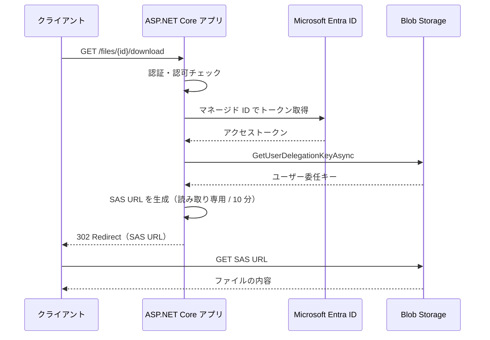
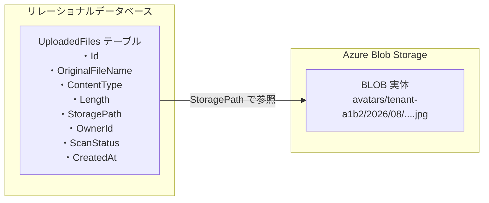
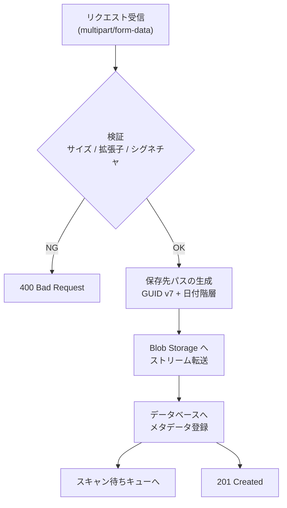

## 目次

1. [ファイル受信の仕組み](#1-ファイル受信の仕組み)
   - [multipart/form-data の基本](#multipartform-data-の基本)
   - [バッファリングとストリーミング](#バッファリングとストリーミング)
   - [IFormFile によるバッファリング受信](#iformfile-によるバッファリング受信)
   - [Minimal API でのファイル受信](#minimal-api-でのファイル受信)
   - [既定のサイズ制限と設定変更](#既定のサイズ制限と設定変更)
   - [MultipartReader によるストリーミング受信](#multipartreader-によるストリーミング受信)
   - [受信方式の選択指針](#受信方式の選択指針)
2. [アップロードファイルの検証](#2-アップロードファイルの検証)
   - [検証すべき 5 つの観点](#検証すべき-5-つの観点)
   - [拡張子とファイルシグネチャの検証](#拡張子とファイルシグネチャの検証)
   - [ファイル名とサイズの扱い](#ファイル名とサイズの扱い)
   - [Minimal API での検証（.NET 10 の新機能）](#minimal-api-での検証net-10-の新機能)
   - [ウイルススキャンと隔離](#ウイルススキャンと隔離)
3. [Azure Blob Storage への保存](#3-azure-blob-storage-への保存)
   - [Blob Storage のオブジェクトモデル](#blob-storage-のオブジェクトモデル)
   - [パッケージの追加と認証](#パッケージの追加と認証)
   - [ストリームをそのままアップロードする](#ストリームをそのままアップロードする)
   - [Content-Type とメタデータの設定](#content-type-とメタデータの設定)
   - [上書き制御](#上書き制御)
   - [Azurite によるローカル開発](#azurite-によるローカル開発)
4. [Blob Storage クライアントの DI 設計とアプリケーションへの組み込み](#4-blob-storage-クライアントの-di-設計とアプリケーションへの組み込み)
   - [AddAzureClients によるクライアント登録](#addazureclients-によるクライアント登録)
   - [ストレージ抽象化インターフェイスの設計](#ストレージ抽象化インターフェイスの設計)
   - [Blob Storage 実装](#blob-storage-実装)
   - [保存先パスの設計](#保存先パスの設計)
   - [公開と非公開のアクセス制御](#公開と非公開のアクセス制御)
   - [SAS による一時的なアクセス許可](#sas-による一時的なアクセス許可)
   - [メタデータ管理とデータベース連携](#メタデータ管理とデータベース連携)
   - [コントローラーからの利用](#コントローラーからの利用)
5. [参考ドキュメント](#5-参考ドキュメント)

---

## 1. ファイル受信の仕組み

### multipart/form-data の基本

Web ブラウザーからファイルを送信する場合、HTML フォームの `enctype` 属性に `multipart/form-data` を指定します。
このとき HTTP リクエストのボディは、**境界文字列 (boundary)** で区切られた複数の **セクション (section)** の並びになります。各セクションは `Content-Disposition` ヘッダーを持ち、通常のフォーム値かファイルかを判別できます。

```html
<form action="/upload" method="post" enctype="multipart/form-data">
    <input type="text" name="title" />
    <input type="file" name="file" />
    <button type="submit">アップロード</button>
</form>
```

上記フォームが送信するリクエストボディは、概念的には次のような構造になります。

```text
POST /upload HTTP/1.1
Content-Type: multipart/form-data; boundary=----Boundary1234

------Boundary1234
Content-Disposition: form-data; name="title"

サンプル画像
------Boundary1234
Content-Disposition: form-data; name="file"; filename="photo.jpg"
Content-Type: image/jpeg

（ここにファイルのバイナリデータ）
------Boundary1234--
```

> [!WARNING]
> `enctype="multipart/form-data"` を指定し忘れると、ファイルは一切送信されません。この場合 `IFormFile` にバインドされる引数は `null` になります。「ファイルが `null` になる」という不具合の多くはこれが原因です。なお `IFormFile` は、アップロードされたファイル 1 件を表す ASP.NET Core のインターフェイスです（詳細は [IFormFile によるバッファリング受信](#iformfile-によるバッファリング受信) で後述します）。

> [!NOTE]
> **他言語との比較**
> - Spring Boot (Java): `MultipartFile` インターフェイス（`@RequestParam("file") MultipartFile file`）
> - Django (Python): `request.FILES['file']`（`UploadedFile` オブジェクト）
> - NestJS (TypeScript): `FileInterceptor` と `@UploadedFile()` デコレーター（内部で multer を使用）
> - Laravel (PHP): `$request->file('file')`（`UploadedFile` オブジェクト）
> - Gin (Go): `c.FormFile("file")`（`*multipart.FileHeader`）
>
> いずれも「multipart のセクションをフレームワークが解析し、ファイルオブジェクトとして渡す」という点は共通しています。ASP.NET Core の `IFormFile` もこれに相当します。

### バッファリングとストリーミング

ASP.NET Core には、ファイルを受信する方法が 2 つあります。

| 方式 | 概要 | 代表的な API |
| --- | --- | --- |
| **バッファリング (Buffering)** | リクエスト全体をフレームワークが解析し、ファイル 1 件を `IFormFile` として組み立てる。モデルバインディングで受け取る | `IFormFile` / `IFormFileCollection` |
| **ストリーミング (Streaming)** | multipart のセクションを順に読み進め、ファイルの中身を直接保存先へ流し込む | `MultipartReader` |

ここで登場する `IFormFile` は、**アップロードされた 1 件のファイルを表す ASP.NET Core 標準のインターフェイス**（名前空間 `Microsoft.AspNetCore.Http`）です。フレームワークが multipart のパートを解析し終えた結果として作られるオブジェクトで、ファイル名・サイズ・MIME タイプといったメタデータと、中身を読み取るためのストリームをひとまとめにして公開します。他言語のフレームワークにある「アップロードファイルオブジェクト」に相当するもので、Spring Boot の `MultipartFile`、Django の `UploadedFile`、Laravel の `Illuminate\Http\UploadedFile`、NestJS (Express) の `Express.Multer.File` と同じ役割です。詳細は次の項で説明します。

バッファリングでは、フレームワークがファイル全体を **メモリまたはディスク上の一時ファイル** にいったん保持します。既定では **64 KB (`MemoryBufferThreshold`)** を超えたファイルはメモリからディスクの一時ファイルへ移されます。一時ファイルの出力先は環境変数 `ASPNETCORE_TEMP` で指定でき、未設定の場合は実行ユーザーの一時フォルダーが使われます。



> [!IMPORTANT]
> ストリーミングは **スループットを大きく改善するものではありません**。公式ドキュメントでも「ストリーミングによってパフォーマンスが大幅に向上することはない」と明記されています。ストリーミングの目的は、**アップロード時のメモリ／ディスク消費量を削減すること** です。同時アップロードが多い、あるいは 1 ファイルが大きいアプリケーションで、バッファリングによってサーバーのリソースが枯渇するのを防ぎます。

### IFormFile によるバッファリング受信

小さなファイルを受け取る場合は `IFormFile` を使います。前項で触れたとおり、`IFormFile` はアップロードされたファイル 1 件を表すインターフェイスで、実体はフレームワークが用意する `FormFile` クラスです。ファイルの中身はメモリまたはディスク上の一時ファイルに保持されており、`IFormFile` はそこへのアクセス手段を提供しているにすぎません。したがって、**リクエストが完了した後に `IFormFile` を保持しても中身は読めなくなる** 点に注意してください。読み取りや保存は、必ずリクエスト処理中に行います。

MVC コントローラーでは、フォームフィールド名と一致する名前の引数を宣言するだけでモデルバインディングが機能します（モデルバインディングの仕組み全般は[第3章：モデルバインディング](../03-mvc-web-and-api/index.md#モデルバインディング)を参照）。

```csharp
using Microsoft.AspNetCore.Mvc;

namespace FileUploadSample.Controllers;

[ApiController]
[Route("api/[controller]")]
public class UploadsController : ControllerBase
{
    // フォームの <input name="file"> と引数名 file を一致させる
    [HttpPost]
    public async Task<IActionResult> Post(IFormFile file, CancellationToken cancellationToken)
    {
        if (file is null || file.Length == 0)
        {
            return BadRequest("ファイルが選択されていません。");
        }

        // クライアントが送ってきたファイル名は信用しない（後述）
        var safeFileName = $"{Guid.NewGuid():N}{Path.GetExtension(file.FileName).ToLowerInvariant()}";
        var savePath = Path.Combine(Path.GetTempPath(), safeFileName);

        await using var destination = System.IO.File.Create(savePath);
        await file.CopyToAsync(destination, cancellationToken);

        return Ok(new { savedAs = safeFileName, size = file.Length });
    }
}
```

`IFormFile` が公開する主なメンバーは次のとおりです。

| メンバー | 説明 |
| --- | --- |
| `FileName` | クライアントが送信したファイル名。**信用してはいけない値** |
| `Length` | ファイルサイズ（バイト） |
| `ContentType` | クライアントが申告した MIME タイプ。これも信用してはいけない |
| `Name` | フォームフィールド名 |
| `OpenReadStream()` | 内容を読み取る `Stream` を取得する |
| `CopyToAsync(Stream)` | 内容を指定したストリームへコピーする |

複数ファイルを受け取る場合は `IFormFileCollection` または `List<IFormFile>` を使います。

```csharp
// フォーム側も <input type="file" name="files" multiple /> のように
// 引数名 files と一致させる必要がある
[HttpPost("multiple")]
public async Task<IActionResult> PostMultiple(
    IFormFileCollection files,
    CancellationToken cancellationToken)
{
    var results = new List<string>();

    foreach (var file in files)
    {
        var safeFileName = $"{Guid.NewGuid():N}{Path.GetExtension(file.FileName).ToLowerInvariant()}";
        await using var destination = System.IO.File.Create(Path.Combine(Path.GetTempPath(), safeFileName));
        await file.CopyToAsync(destination, cancellationToken);
        results.Add(safeFileName);
    }

    return Ok(results);
}
```

> [!WARNING]
> MVC コントローラーの `IFormFileCollection` は、**引数名と一致するフィールド名で送られたファイルだけ** を集めます。名前が食い違うと、例外も検証エラーも起きずに **空のコレクション** がバインドされるため、原因に気付きにくい不具合になります。
>
> 一方 Minimal API の `IFormFileCollection` は、フィールド名にかかわらず **リクエスト内のすべてのファイル** を返します。同じ型でも挙動が違う点に注意してください。

ファイル以外のフォーム値と組み合わせる場合は、モデルクラスにまとめると読みやすくなります。

```csharp
public class UploadRequest
{
    public required string Title { get; init; }

    public string? Description { get; init; }

    public required IFormFile File { get; init; }
}

[HttpPost("with-metadata")]
public async Task<IActionResult> PostWithMetadata(
    [FromForm] UploadRequest request,
    CancellationToken cancellationToken)
{
    // request.Title, request.File などにバインドされる
    return Ok();
}
```

> [!TIP]
> HTML フォームを使わず JavaScript の `FormData` から送信する場合も、`FormData.append()` の第 1 引数（フィールド名）とサーバー側の引数名を一致させる必要があります。名前が食い違うとバインドされず `null` になります。

### Minimal API でのファイル受信

Minimal API でも `IFormFile` / `IFormFileCollection` をハンドラーの引数に宣言できます（Minimal API のバインディング全般は[第4章：各種入力のバインディング](../04-minimal-api/index.md#各種入力のバインディング)を参照）。ただし **フォームからのバインドには非フォージェリトークン (antiforgery token) の検証が必須** である点が MVC と異なります。

#### 非フォージェリトークンとは

非フォージェリトークン（antiforgery token、アンチフォージェリトークンとも呼ばれます）は、**クロスサイトリクエストフォージェリ (CSRF) 攻撃** を防ぐための仕組みです。

CSRF とは、利用者が正規サイトにログインした状態のまま攻撃者のページを開くと、そのページに仕込まれたフォームが利用者の Cookie を伴って正規サイトへ送信されてしまう、という攻撃です。ブラウザーは送信先のドメインに紐づく Cookie を自動的に付けるため、サーバーからは正規の利用者による操作と見分けが付きません。ファイルアップロードのエンドポイントがこれを許すと、意図しないファイルを勝手にアップロードされる恐れがあります。

これを防ぐため、ASP.NET Core は次の 2 つの値をペアで発行します。

| 値 | 送信経路 | 役割 |
| --- | --- | --- |
| Cookie トークン | Cookie | ブラウザーが自動的に送信する |
| リクエストトークン | フォームの hidden フィールド、または `RequestVerificationToken` ヘッダー | アプリが明示的に埋め込む |

攻撃者のページは正規サイトの HTML を読み取れないため、**リクエストトークンの値を知り得ません**。サーバーは 2 つの値が対になっているかを検証し、対になっていなければリクエストを HTTP 400 で拒否します。

他言語のフレームワークにも同じ仕組みがあります。Django の `` と `CsrfViewMiddleware`、Laravel の `@csrf` と `ValidateCsrfToken` ミドルウェア（Laravel 10 以前の `VerifyCsrfToken` が改名されたもの）、Spring Security の `CsrfToken` に相当します。

ASP.NET Core では、`AddAntiforgery()` でサービスを登録し、`UseAntiforgery()` ミドルウェアをパイプラインに追加することで有効になります。Minimal API では、このミドルウェアが `IFormFile` や `[FromForm]` にバインドするエンドポイントを自動的に検証対象とするため、**アプリ側に検証コードを書く必要はありません**。

```csharp
using Microsoft.AspNetCore.Antiforgery;

var builder = WebApplication.CreateBuilder(args);

// (1) 非フォージェリトークンの生成・検証を行うサービスを登録する
builder.Services.AddAntiforgery();

var app = builder.Build();

// (2) このミドルウェアが検証を実行する。
//     IFormFile / [FromForm] にバインドするエンドポイントは自動的に検証対象となり、
//     トークンが無い、または不正な場合はハンドラーに到達せず HTTP 400 が返る。
//     エンドポイントのマッピングより前に置くこと。
app.UseAntiforgery();

// (3) ハンドラー自身には検証コードを書かない。
//     ここに処理が到達している時点で、検証は (2) で成功済み。
app.MapPost("/upload", async (IFormFile file, CancellationToken cancellationToken) =>
{
    var safeFileName = $"{Guid.NewGuid():N}{Path.GetExtension(file.FileName).ToLowerInvariant()}";
    var savePath = Path.Combine(Path.GetTempPath(), safeFileName);

    await using var destination = File.Create(savePath);
    await file.CopyToAsync(destination, cancellationToken);

    return TypedResults.Ok(new { savedAs = safeFileName, size = file.Length });
});

app.Run();
```

ブラウザーのフォームから送信する場合は、`IAntiforgery` で生成したリクエストトークンを hidden フィールドとして埋め込みます。これが上記 (2) で検証される値です。

```csharp
app.MapGet("/", (HttpContext context, IAntiforgery antiforgery) =>
{
    // Cookie トークンをレスポンスの Cookie に書き込み、対になるリクエストトークンを取得する
    var token = antiforgery.GetAndStoreTokens(context);
    var html = $"""
      <html>
        <body>
          <form action="/upload" method="post" enctype="multipart/form-data">
            <!-- token.FormFieldName は既定で "__RequestVerificationToken"。
                 この hidden フィールドが無いと POST は HTTP 400 で拒否される -->
            <input name="{token.FormFieldName}" type="hidden" value="{token.RequestToken}" />
            <input type="file" name="file" accept=".jpg,.jpeg,.png" />
            <input type="submit" value="アップロード" />
          </form>
        </body>
      </html>
    """;

    return Results.Content(html, "text/html");
});
```

> [!TIP]
> Razor Pages や MVC の `<form>` タグヘルパーを使う場合、この hidden フィールドは自動的に挿入されます。手書きの HTML や JavaScript から送信する場合のみ、上記のように明示的な埋め込みが必要です。JavaScript の `fetch` から送る場合は、トークンを `RequestVerificationToken` ヘッダーに載せる方法もよく使われます。

Cookie 認証を使わない API（Bearer トークン認証など）で、CSRF の攻撃対象にならないことが明らかなエンドポイントは、`DisableAntiforgery()` で検証を無効化できます。

```csharp
app.MapPost("/api/upload", async (IFormFile file) => { /* ... */ })
   .RequireAuthorization()
   .DisableAntiforgery();
```

> [!WARNING]
> `DisableAntiforgery()` は CSRF 保護そのものを無効化します。ブラウザーから Cookie 認証で到達できるエンドポイントには **絶対に使用しないでください**。Bearer トークンやクライアント証明書のように、ブラウザーが自動送信しない資格情報でのみ保護されているエンドポイントに限って使用します。

### 既定のサイズ制限と設定変更

ファイルアップロードでは、複数のレイヤーにサイズ制限が存在します。どこで弾かれているのかを把握しておくことが重要です。



| 設定 | 既定値 | 超過時の挙動 |
| --- | --- | --- |
| IIS の `maxAllowedContentLength` | 30,000,000 バイト（約 28.6 MB） | HTTP 404.13 が返る |
| `KestrelServerLimits.MaxRequestBodySize` | 30,000,000 バイト（約 28.6 MB） | `BadHttpRequestException` がスローされ HTTP 413 が返る。クライアントが送信を続けた場合は接続がリセットされることもある |
| `FormOptions.MultipartBodyLengthLimit` | 134,217,728 バイト（128 MB） | `InvalidDataException` がスローされる |
| `FormOptions.MemoryBufferThreshold` | 65,536 バイト（64 KB） | 超過分はディスク上の一時ファイルへ退避される |

アプリケーション全体で上限を変更する場合は `Program.cs` で設定します。

```csharp
using Microsoft.AspNetCore.Http.Features;

var builder = WebApplication.CreateBuilder(args);

// Kestrel のリクエストボディ上限を 100 MB に変更
builder.WebHost.ConfigureKestrel(options =>
{
    options.Limits.MaxRequestBodySize = 100 * 1024 * 1024;
});

// multipart の各セクションの上限を 100 MB に変更
builder.Services.Configure<FormOptions>(options =>
{
    options.MultipartBodyLengthLimit = 100 * 1024 * 1024;
});
```

特定のアクションだけ緩和したい場合は、属性で個別に指定します。

```csharp
[HttpPost("large")]
[RequestSizeLimit(100 * 1024 * 1024)]              // Kestrel のボディ上限
[RequestFormLimits(MultipartBodyLengthLimit = 100 * 1024 * 1024)]  // multipart の上限
public async Task<IActionResult> PostLarge(IFormFile file) { /* ... */ }
```

Minimal API には属性を付ける場所がないため、同じ `RequestSizeLimitAttribute` を **エンドポイントのメタデータとして** 付与します。

```csharp
using Microsoft.AspNetCore.Mvc;

app.MapPost("/upload-large", async (IFormFile file) => { /* ... */ })
   .WithMetadata(new RequestSizeLimitAttribute(100 * 1024 * 1024));

// 上限を撤廃する場合（本当に必要かをよく検討してください）
app.MapPost("/upload-huge", async (IFormFile file) => { /* ... */ })
   .WithMetadata(new DisableRequestSizeLimitAttribute());
```

条件によって上限を変えたい場合は `IHttpMaxRequestBodySizeFeature` を使いますが、**設定できるのはリクエストボディの読み取りが始まる前だけ** です。読み取りが始まった後は `IsReadOnly` が `true` になり、代入すると例外がスローされます。

```csharp
using Microsoft.AspNetCore.Http.Features;

// ルーティングより前に置く。ここではまだボディを読んでいない
app.Use(async (context, next) =>
{
    if (context.Request.Path.StartsWithSegments("/upload-large"))
    {
        var feature = context.Features.Get<IHttpMaxRequestBodySizeFeature>();
        if (feature is { IsReadOnly: false })
        {
            feature.MaxRequestBodySize = 100 * 1024 * 1024;
        }
    }

    await next();
});
```

> [!WARNING]
> この設定を **エンドポイントのハンドラーの中** で行っても効果はありません。ハンドラーが呼び出される時点で `IFormFile` へのバインドは完了しており、ボディはすでに読み取られているためです。このとき `IsReadOnly` は `true` になっているので、上記のような `if (feature is { IsReadOnly: false })` という書き方をすると、**エラーも警告も出ないまま設定が黙って無視されます**。同じ理由で、エンドポイントフィルター (`AddEndpointFilter`) も手遅れです。フィルターはパラメーターのバインドが終わった後に実行されます。

#### IIS でホストする場合の設定

IIS でホストする場合、上記のコードによる設定だけでは不十分です。**`maxAllowedContentLength` は C# のコードからは変更できません**。この値は IIS の要求フィルタリングモジュールが、リクエストが ASP.NET Core アプリに渡される **前** に評価する IIS 自身の設定であり、アプリのコードが実行される時点ではすでに判定が終わっています。そのため、変更するには `web.config`（またはサーバー全体の `applicationHost.config`）に記述するしかありません。

```xml
<system.webServer>
  <security>
    <requestFiltering>
      <!-- 100 MB。この値は C# のコードからは変更できない -->
      <requestLimits maxAllowedContentLength="104857600" />
    </requestFiltering>
  </security>
</system.webServer>
```

一方、IIS でホストする場合の **アプリ側** のボディ上限は、Kestrel ではなく `IISServerOptions.MaxRequestBodySize`（既定 30,000,000 バイト）で制御します。IIS の既定のホスティングモデルであるインプロセスホスティングでは、Kestrel ではなく IIS HTTP サーバーがリクエストを処理するため、`KestrelServerLimits.MaxRequestBodySize` は効きません。

```csharp
builder.Services.Configure<IISServerOptions>(options =>
{
    options.MaxRequestBodySize = 100 * 1024 * 1024;
});
```

つまり、IIS でホストして 100 MB のアップロードを許可したい場合、**両方** の設定が必要です。

| 設定場所 | 設定項目 | 役割 | 超過時の挙動 |
| --- | --- | --- | --- |
| `web.config` | `maxAllowedContentLength` | IIS がアプリにリクエストを渡すかどうかの判定。ここで弾かれるとアプリには一切届かない | HTTP 404.13 が返り、アプリのコードには到達しない |
| C# コード | `IISServerOptions.MaxRequestBodySize` | アプリがボディの読み取りを許可する上限 | `BadHttpRequestException` がスローされ、HTTP 413 が返る |

> [!WARNING]
> **どちらか一方だけを設定した場合、より小さいほうの値が実効的な上限になります。** 上限を引き上げたつもりが効いていないときは、両方の設定を確認してください。

> [!NOTE]
> `maxAllowedContentLength` は IIS 固有の設定です。Kestrel を直接公開する構成、Linux 上のコンテナー、Azure App Service の Linux プランなど IIS を経由しない環境では、この設定自体が存在しないため `web.config` は不要です。Nginx や Apache をリバースプロキシとして使う場合は、それぞれ `client_max_body_size`、`LimitRequestBody` が対応する設定になります。

`<requestLimits>` 要素では、`maxAllowedContentLength` のほかに次の設定も指定できます。ファイルアップロードで直接必要になることは多くありませんが、同じ要素にまとまっているため把握しておくとよいでしょう。

| 属性 / 子要素 | 既定値 | 説明 |
| --- | --- | --- |
| `maxAllowedContentLength` | 30,000,000 | リクエストボディの最大長（バイト） |
| `maxUrl` | 4,096 | URL の最大長（バイト） |
| `maxQueryString` | 2,048 | クエリ文字列の最大長（バイト） |
| `<headerLimits>` | なし | 個々の HTTP ヘッダーごとの最大長を指定する子要素 |

> [!WARNING]
> 上限を安易に大きくすると、**サービス拒否 (Denial of Service: DoS) 攻撃** のリスクが高まります。業務上必要な最小限の値に設定し、あわせて認証・レート制限を組み合わせてください。

### MultipartReader によるストリーミング受信

ストリーミング受信のコードは、`IFormFile` に比べると確かに長くなります。ただしこれは「ASP.NET Core がストリーミングをサポートしていない」ということではありません。`MultipartReader` はフレームワークが標準で提供する公式のユーティリティであり、公式ドキュメントでもストリーミングの推奨手段として案内されています。

長くなる理由は、**モデルバインディングによる自動化と、バッファリングを避けることが原理的に両立しないため** です。モデルバインディングが `IFormFile` という「値」を引数に渡すためには、その時点でファイルの中身がどこかに確保されていなければなりません。バッファリングを避けるということは、フレームワークがボディを読み終える前にアプリのコードへ制御を渡すということであり、その結果「どのセクションをどこへ流すか」の判断はアプリ側の責務になります。

ASP.NET Core がファイル受信のために提供している手段は、抽象度の順に次の 4 つです。

| 手段 | 手書きの解析 | リクエストボディの扱い | 主な用途 |
| --- | --- | --- | --- |
| モデルバインディング (`IFormFile`) | 不要 | 64 KB を超えるとディスク上の一時ファイルへ全量を退避 | 既定の選択肢 |
| `HttpRequest.ReadFormAsync()` | 不要 | 上と同じ（`IFormFile` の内部で使われている API） | フィルターやミドルウェアで動的にフォームを読みたい場合 |
| **`MultipartReader`** | 必要（十数行） | 一時ファイルを作らず、保存先へ直接転送する | 大きなファイル |
| `HttpRequest.BodyReader` | 必要 | `PipeReader` による最も低レベルの読み取り | 特殊な最適化が要る場合 |

つまり自動化を求めるなら選択肢はあり、上 2 つを使えば手書きの解析は不要です。ただしそれらは一時ファイルへの退避を伴います。**ストリーミングの目的はまさにこの一時ファイルの往復をなくすこと** なので、自動化と目的が両立しない、というのが実態です。

> [!NOTE]
> 100 MB のファイルをアップロードして実測すると、`ReadFormAsync()` はマネージドヒープの割り当てを数 MB に抑える一方で、ディスク上に 100 MB の一時ファイルを作成します。つまり「メモリは節約されるがディスク I/O は 2 往復する」状態です。`MultipartReader` はこの一時ファイルを作らないため、ディスク I/O が 1 回で済みます。

最小構成は次のとおりです。この程度であれば、実装コストはさほど高くありません。

```csharp
using Microsoft.AspNetCore.WebUtilities;
using Microsoft.Net.Http.Headers;

app.MapPost("/upload-stream", async (HttpContext context, CancellationToken cancellationToken) =>
{
    // Content-Type ヘッダーから境界文字列を取り出す
    var boundary = HeaderUtilities.RemoveQuotes(
        MediaTypeHeaderValue.Parse(context.Request.ContentType!).Boundary).Value;

    var reader = new MultipartReader(boundary!, context.Request.Body);
    MultipartSection? section;

    while ((section = await reader.ReadNextSectionAsync(cancellationToken)) is not null)
    {
        var contentDisposition = section.GetContentDispositionHeader();

        if (contentDisposition is not null && contentDisposition.IsFileDisposition())
        {
            var savePath = Path.Combine(Path.GetTempPath(), $"{Guid.NewGuid():N}.bin");

            // セクションの本体を保存先へ直接流し込む（一時ファイルを経由しない）
            await using var destination = File.Create(savePath);
            await section.Body.CopyToAsync(destination, cancellationToken);
        }
    }

    return Results.Ok();
});
```

> [!WARNING]
> このエンドポイントには、**非フォージェリトークンの検証が一切かかりません**。`UseAntiforgery()` を追加していても同じです。ミドルウェアは `IFormFile` や `[FromForm]` にバインドするエンドポイントだけを検証対象とするため、`HttpContext` から自力でボディを読むこのハンドラーは対象外と判断されます（したがって `DisableAntiforgery()` を呼ぶ必要もありません）。
>
> Cookie 認証を使うアプリでは、これは CSRF の穴になります。自分で `IAntiforgery.ValidateRequestAsync` を呼んでください。このときトークンは **`RequestVerificationToken` ヘッダー** で受け取るようにします。フォームの hidden フィールドで送ると、検証のためにフォーム全体の読み取りが発生し、ストリーミングの意味がなくなるためです。
>
> ```csharp
> using Microsoft.AspNetCore.Antiforgery;
>
> app.MapPost("/upload-stream", async (HttpContext context, IAntiforgery antiforgery, CancellationToken cancellationToken) =>
> {
>     // ボディを読む前に、ヘッダーのトークンだけで検証する
>     try
>     {
>         await antiforgery.ValidateRequestAsync(context);
>     }
>     catch (AntiforgeryValidationException)
>     {
>         return Results.BadRequest("トークンが不正です。");
>     }
>
>     // 以降は上記と同じストリーミング処理
> });
> ```

ファイル以外のフォーム値も受け取る場合は、`IsFormDisposition()` の分岐を追加します。

```csharp
else if (contentDisposition is not null && contentDisposition.IsFormDisposition())
{
    var name = contentDisposition.Name.Value;
    using var streamReader = new StreamReader(section.Body);
    var value = await streamReader.ReadToEndAsync(cancellationToken);
    // 必要に応じて辞書などへ蓄積し、すべて読み終えてからモデルへ詰め替える
}
```

実運用では、境界文字列の妥当性チェックも加えます。`MultipartReader` は境界文字列の長さを検証しないため、不正に長い値を送り付けられないよう自前で確認します。

```csharp
if (!MediaTypeHeaderValue.TryParse(context.Request.ContentType, out var mediaType)
    || string.IsNullOrEmpty(mediaType.Boundary.Value)
    || mediaType.Boundary.Value!.Length > 128)   // FormOptions.MultipartBoundaryLengthLimit の既定値
{
    return Results.BadRequest("multipart/form-data で送信してください。");
}
```

> [!TIP]
> そもそもクライアントがフォーム値を一緒に送る必要がないなら、**multipart を使わない** という選択肢もあります。`PUT /files/{id}` のようにファイルの中身だけをリクエストボディとして送ってもらえば、`Request.Body` がそのままファイルのストリームになるため、解析は一切不要です。ファイル名などのメタデータは URL やヘッダーで渡します。ブラウザーのフォームからではなく、SPA やモバイルアプリ、他システムからのアップロードであれば、この方式が最も単純です。
>
> ```csharp
> app.MapPut("/files/{id}", async (string id, HttpContext context, CancellationToken cancellationToken) =>
> {
>     await using var destination = File.Create(Path.Combine(Path.GetTempPath(), $"{id}.bin"));
>     await context.Request.Body.CopyToAsync(destination, cancellationToken);
>     return Results.Ok();
> });
> ```

#### 保存先が Azure Blob Storage の場合

ここまでの例では保存先をローカルのファイルシステムにしていますが、**保存先が Azure Blob Storage であれば、実装はさらに短くなります**。Azure SDK の `BlobClient.UploadAsync` が `Stream` を直接受け取り、内部でチャンク分割やブロックの並列アップロードまで面倒を見てくれるためです。`section.Body` をそのまま渡すだけで、ローカルディスクに一切書き込むことなく BLOB へ転送できます。

```csharp
if (contentDisposition is not null && contentDisposition.IsFileDisposition())
{
    var blobClient = containerClient.GetBlobClient($"{Guid.NewGuid():N}.bin");

    // 受信ストリームを、そのまま Blob Storage へ流し込む
    await blobClient.UploadAsync(section.Body, cancellationToken);
}
```

同じことは `IFormFile` でも `file.OpenReadStream()` を渡すだけで実現できます。詳しくは [ストリームをそのままアップロードする](#ストリームをそのままアップロードする) で扱います。

MVC コントローラーでストリーミングを行う場合は、フォームのモデルバインディングが先にリクエストボディを読み切ってしまわないよう、フォーム値のバインドを無効化するリソースフィルターを適用します（フィルターの種類と実行順序は[第3章：フィルター（ActionFilter, ExceptionFilter 等）と横断処理](../03-mvc-web-and-api/index.md#6-フィルターactionfilter-exceptionfilter-等と横断処理)を参照）。

```csharp
using Microsoft.AspNetCore.Mvc.Filters;
using Microsoft.AspNetCore.Mvc.ModelBinding;

[AttributeUsage(AttributeTargets.Class | AttributeTargets.Method)]
public sealed class DisableFormValueModelBindingAttribute : Attribute, IResourceFilter
{
    public void OnResourceExecuting(ResourceExecutingContext context)
    {
        var factories = context.ValueProviderFactories;
        factories.RemoveType<FormValueProviderFactory>();
        factories.RemoveType<FormFileValueProviderFactory>();
        factories.RemoveType<JQueryFormValueProviderFactory>();
    }

    public void OnResourceExecuted(ResourceExecutedContext context)
    {
    }
}
```

> [!NOTE]
> `Request.Form` や `IFormFile` にアクセスした時点でフレームワークがボディ全体を読み込んでしまうため、ストリーミングを行うアクションではこれらに触れてはいけません。フォーム値が必要な場合は、`MultipartReader` で読み取ったセクションから自前で組み立てます。

### 受信方式の選択指針

| 観点 | バッファリング（`IFormFile`） | ストリーミング（`MultipartReader`） |
| --- | --- | --- |
| 実装の容易さ | ◎ モデルバインディングで完結 | △ 自前でセクションを解析する |
| モデル検証との統合 | ◎ データ注釈が使える（MVC・Minimal API とも） | △ 自前で実装が必要 |
| メモリ／ディスク消費 | △ ファイルサイズと同時実行数に比例 | ◎ 一定のバッファーのみ |
| 適したファイルサイズ | 数十 MB 程度まで | 数百 MB 以上 |
| 適した用途 | プロフィール画像、添付書類 | 動画、バックアップ、大量データ |

> [!TIP]
> 最初は `IFormFile` で実装し、ベンチマークでメモリやディスクが問題になった時点でストリーミングへ移行するのが現実的です。公式ドキュメントも「小さい／大きいの境界は環境依存であり、想定サイズでベンチマークすべき」としています。

---

## 2. アップロードファイルの検証

### 検証すべき 5 つの観点

ファイルアップロードは、攻撃者にとって **サーバーへ任意のデータを送り込める入口** です。最低限、次の観点で検証します。

| 観点 | 内容 |
| --- | --- |
| **サイズ** | 業務要件に応じた上限を設け、超過したら拒否する |
| **拡張子** | 許可リスト（ホワイトリスト）方式で判定する |
| **ファイルシグネチャ** | 先頭バイト列を検査し、拡張子と内容の整合を確認する |
| **ファイル名** | クライアント由来の名前をそのまま保存パスに使わない |
| **内容** | ウイルス／マルウェアスキャンを実施する |

> [!WARNING]
> クライアント側（JavaScript）の検証はユーザー体験の向上のためのものであり、**簡単に迂回できます**。必ずサーバー側で同じ検証を実施してください。

### 拡張子とファイルシグネチャの検証

拡張子は許可リストで判定します。禁止リスト（ブラックリスト）方式は漏れが生じやすいため使用しません。

```csharp
private static readonly string[] PermittedExtensions = [".jpg", ".jpeg", ".png", ".pdf"];

private static bool IsPermittedExtension(string fileName)
{
    var extension = Path.GetExtension(fileName).ToLowerInvariant();
    return !string.IsNullOrEmpty(extension) && PermittedExtensions.Contains(extension);
}
```

拡張子はいくらでも詐称できるため、**ファイルの先頭数バイト（ファイルシグネチャ／マジックナンバー）** も検査します。

```csharp
using System.Buffers;

public static class FileSignatureValidator
{
    private static readonly Dictionary<string, byte[][]> Signatures = new()
    {
        [".jpg"] =
        [
            [0xFF, 0xD8, 0xFF, 0xE0],
            [0xFF, 0xD8, 0xFF, 0xE1],
            [0xFF, 0xD8, 0xFF, 0xE8],
        ],
        [".png"] = [[0x89, 0x50, 0x4E, 0x47, 0x0D, 0x0A, 0x1A, 0x0A]],
        [".pdf"] = [[0x25, 0x50, 0x44, 0x46]],
    };

    public static bool IsValidSignature(Stream stream, string extension)
    {
        extension = extension.ToLowerInvariant();
        // .jpeg は .jpg と同じシグネチャで判定する
        var key = extension == ".jpeg" ? ".jpg" : extension;

        if (!Signatures.TryGetValue(key, out var candidates))
        {
            return false;
        }

        var maxLength = candidates.Max(signature => signature.Length);
        var buffer = ArrayPool<byte>.Shared.Rent(maxLength);

        try
        {
            var read = stream.ReadAtLeast(buffer.AsSpan(0, maxLength), maxLength, throwOnEndOfStream: false);
            ReadOnlySpan<byte> header = buffer.AsSpan(0, read);

            // Span はラムダ式の中で使えないため、foreach で判定する
            foreach (var signature in candidates)
            {
                if (header.Length >= signature.Length
                    && header[..signature.Length].SequenceEqual(signature))
                {
                    return true;
                }
            }

            return false;
        }
        finally
        {
            ArrayPool<byte>.Shared.Return(buffer);
            stream.Position = 0;  // 後続の保存処理のために巻き戻す
        }
    }
}
```

> [!WARNING]
> このメソッドは、**シグネチャ辞書に載っていない拡張子に対して `false` を返します**。したがって、後述の許可拡張子リストに `.txt` や `.csv` のような項目を追加しただけでは、その形式のアップロードはすべて「内容が拡張子と一致しません」で拒否されます。
>
> テキスト系のように固定のシグネチャを持たない形式は、そもそもこの方法では判定できません。許可リストを増やすときは、**シグネチャ辞書にも対応する定義を追加する**か、シグネチャを持たない拡張子は検証をスキップする（`TryGetValue` が失敗したら `true` を返す）かを、形式ごとに決めてください。後者を選ぶ場合、その拡張子については中身の検証が効かなくなる点に注意します。

> [!NOTE]
> シグネチャ検証は「拡張子と中身が一致するか」を確かめるだけであり、**ファイルが安全であることを保証しません**。正しい JPEG ヘッダーを持つ悪意あるファイルは作成可能です。ウイルススキャンと併用してください。

### ファイル名とサイズの扱い

クライアントが送ってきたファイル名を、そのまま保存パスの構築に使ってはいけません。`../../etc/passwd` のようなパストラバーサル攻撃や、既存ファイルの上書きにつながります。

```csharp
// ❌ 危険: クライアント由来の名前をそのまま使用
var path = Path.Combine(uploadDirectory, file.FileName);

// ✅ 安全: アプリケーションが生成した名前を使用し、拡張子だけを引き継ぐ
// ただし拡張子もクライアント由来なので、許可リストの検証を通したものだけを使う
if (!IsPermittedExtension(file.FileName))
{
    return BadRequest("許可されていない拡張子です。");
}

var extension = Path.GetExtension(file.FileName).ToLowerInvariant();
var storedName = $"{Guid.NewGuid():N}{extension}";
var path = Path.Combine(uploadDirectory, storedName);
```

> [!WARNING]
> `Path.GetExtension` は `../../etc/passwd` のようなパス区切り文字を含む入力に対しては空文字列を返すため、パストラバーサルは防げます。しかし `shell.aspx` や `web.config` のような文字列を渡せば、拡張子として `.aspx` や `.config` がそのまま返ります。**許可リストの検証を省略すると、実行可能なファイルや設定ファイルとして解釈される名前で保存されてしまいます**。

元のファイル名を画面に表示したい場合は、**表示用の名前としてデータベースに保持** し、表示時に HTML エンコードします。Razor は既定で出力を HTML エンコードするため安全ですが、Razor 以外で出力する場合は `WebUtility.HtmlEncode` を明示的に呼び出します。

サイズ上限は構成から読み込み、`IOptions<T>` で注入するのが定石です（構成の詳細は[第5章：アプリ設定 (Configuration)](../05-configuration/index.md)、DI の詳細は[第6章：依存性注入 (DI)](../06-dependency-injection/index.md)を参照）。

```json
{
  "FileUpload": {
    "MaxFileSizeBytes": 5242880,
    "PermittedExtensions": [ ".jpg", ".jpeg", ".png", ".pdf" ]
  }
}
```

```csharp
using System.ComponentModel.DataAnnotations;

public class FileUploadOptions
{
    public const string SectionName = "FileUpload";

    [Range(1, 1024L * 1024 * 1024)]
    public long MaxFileSizeBytes { get; set; } = 5 * 1024 * 1024;

    [Required, MinLength(1)]
    public string[] PermittedExtensions { get; set; } = [];
}
```

```csharp
builder.Services
    .AddOptions<FileUploadOptions>()
    .Bind(builder.Configuration.GetSection(FileUploadOptions.SectionName))
    .ValidateDataAnnotations()
    .ValidateOnStart();
```

`ValidateDataAnnotations()` は起動時に構成値を検証し、`ValidateOnStart()` と組み合わせることで、設定漏れをアプリの起動時点で失敗させられます。上記の例で `PermittedExtensions` が空のまま起動しようとすると、次のように `OptionsValidationException` で停止します。

```text
Microsoft.Extensions.Options.OptionsValidationException: DataAnnotation validation failed for
'FileUploadOptions' members: 'PermittedExtensions' with the error:
'The field PermittedExtensions must be a string or array type with a minimum length of '1'.'.
```

> [!WARNING]
> `ValidateDataAnnotations()` が検証するのは、**`System.ComponentModel.DataAnnotations` の属性が付いたプロパティだけ** です。C# の `required` 修飾子は付けても検証されません。`required` はコンパイル時にオブジェクト初期化子での指定を強制する機能であり、構成バインダーはリフレクションで値を設定するため、この制約は働かないためです。
>
> ```csharp
> // ❌ 検証されない。構成に値が無くても起動は成功し、null が入ったままになる
> public required string[] PermittedExtensions { get; set; }
>
> // ✅ 検証される。値が無ければ起動時に OptionsValidationException で停止する
> [Required, MinLength(1)]
> public string[] PermittedExtensions { get; set; } = [];
> ```
>
> ❌ の書き方をして構成の記述を忘れると、次項の `UploadValidator` で使っている `PermittedExtensions.Contains(extension)` が常に `false` を返すため、**例外も出ないまま、すべてのファイルが「拡張子が許可されていません」として拒否される** という、原因の分かりにくい不具合になります。必須項目には必ず `[Required]` を付けてください。

検証ロジックをサービスとしてまとめておくと、複数のエンドポイントから再利用できます。

```csharp
using Microsoft.Extensions.Options;

public interface IUploadValidator
{
    UploadValidationResult Validate(IFormFile file);
}

public sealed record UploadValidationResult(bool IsValid, string? ErrorMessage)
{
    public static UploadValidationResult Success { get; } = new(true, null);

    public static UploadValidationResult Failure(string message) => new(false, message);
}

public sealed class UploadValidator(IOptions<FileUploadOptions> options) : IUploadValidator
{
    private readonly FileUploadOptions _options = options.Value;

    public UploadValidationResult Validate(IFormFile file)
    {
        if (file.Length == 0)
        {
            return UploadValidationResult.Failure("ファイルが空です。");
        }

        if (file.Length > _options.MaxFileSizeBytes)
        {
            return UploadValidationResult.Failure(
                $"ファイルサイズが上限（{_options.MaxFileSizeBytes:N0} バイト）を超えています。");
        }

        var extension = Path.GetExtension(file.FileName).ToLowerInvariant();
        if (string.IsNullOrEmpty(extension) || !_options.PermittedExtensions.Contains(extension))
        {
            return UploadValidationResult.Failure($"拡張子 '{extension}' は許可されていません。");
        }

        using var stream = file.OpenReadStream();
        if (!FileSignatureValidator.IsValidSignature(stream, extension))
        {
            return UploadValidationResult.Failure("ファイルの内容が拡張子と一致しません。");
        }

        return UploadValidationResult.Success;
    }
}
```

### Minimal API での検証（.NET 10 の新機能）

MVC コントローラーでは以前からデータ注釈（`[Required]`、`[Range]` など）によるモデル検証が動作しましたが（詳細は[第3章：入力検証 (バリデーション)](../03-mvc-web-and-api/index.md#入力検証-バリデーション)を参照）、Minimal API には同等の仕組みがなく、上記のような検証サービスを自分で呼び出す必要がありました。

**ASP.NET Core 10 では、Minimal API でもデータ注釈による検証が利用できるようになりました。** `AddValidation()` を呼ぶだけで、ハンドラーの引数に付けた検証属性がフレームワークによって評価され、違反があればハンドラーに到達せず HTTP 400 と検証エラーの詳細が返ります。

```csharp
builder.Services.AddValidation();
```

ファイルサイズのように標準の属性では表現できない条件は、`ValidationAttribute` を継承したカスタム属性を作ります。`IFormFile` に対しても機能します。

```csharp
using System.ComponentModel.DataAnnotations;

[AttributeUsage(AttributeTargets.Property | AttributeTargets.Parameter)]
public sealed class MaxFileSizeAttribute(long maxBytes) : ValidationAttribute
{
    public override bool IsValid(object? value)
        => value is not IFormFile file || file.Length <= maxBytes;

    public override string FormatErrorMessage(string name)
        => $"{name} は {maxBytes:N0} バイト以下にしてください。";
}
```

```csharp
using System.ComponentModel.DataAnnotations;
using Microsoft.AspNetCore.Mvc;

// ① IFormFile を単体の引数として受け取る場合
app.MapPost("/upload", ([MaxFileSize(5 * 1024 * 1024)] IFormFile file) => TypedResults.Ok());

// ② フォーム値とファイルをまとめた複合型で受け取る場合
app.MapPost("/upload-with-title", ([FromForm] ValidatedUploadRequest request) => TypedResults.Ok());

public class ValidatedUploadRequest
{
    [Required, StringLength(100)]
    public string Title { get; set; } = "";

    [MaxFileSize(5 * 1024 * 1024)]
    public IFormFile? File { get; set; }
}
```

② のエンドポイントに、100 文字を超えるタイトルと上限を超えたファイルを送ると、次のようなレスポンスが返ります。

```json
{
  "title": "One or more validation errors occurred.",
  "errors": {
    "Title": ["The field Title must be a string with a maximum length of 100."],
    "File": ["File は 5,242,880 バイト以下にしてください。"]
  }
}
```

> [!NOTE]
> `AddValidation()` はソースジェネレーターを使って、**呼び出したアセンブリ内** の検証対象の型を検出します。そのため、Minimal API のエンドポイントを別のアセンブリ（クラスライブラリなど）で定義している場合、ホスト側で `AddValidation()` を呼ぶだけでは検証が実行されず、不正なリクエストがそのまま処理されて 400 ではなく 200 が返ります。この場合は、**エンドポイントを定義しているアセンブリ側に `AddValidation()` を呼ぶ拡張メソッドを作り、それをホストアプリから呼び出します**（ホスト側の `AddValidation()` も併せて呼びます）。そのアセンブリが `Microsoft.NET.Sdk.Web` ベースでない素のクラスライブラリの場合は、`Microsoft.Extensions.Validation` パッケージの参照も追加します。
>
> 特定のエンドポイントだけ検証を外したい場合は `DisableValidation()` を使います。

> [!WARNING]
> この方式で検証できるのは、**ファイルがバッファリングされた後** です。5 MB を上限にしていても、100 MB のファイルが送られてくれば、それを受信し終えてから 400 を返すことになります。悪意ある大容量アップロードを入口で遮断するには、[既定のサイズ制限と設定変更](#既定のサイズ制限と設定変更) で説明した `RequestSizeLimit` を併用してください。データ注釈による検証は業務ルールの表明、`RequestSizeLimit` は資源保護、という役割分担になります。

### ウイルススキャンと隔離

公式ドキュメントは、**アップロードされたファイルを保存する前にウイルス／マルウェアスキャナーを通すこと** を強く推奨しています。スキャンはサーバーリソースを消費するため、大量アップロードが発生するアプリケーションでは次のような非同期処理が推奨されます。



1. アップロードされたファイルは、まず **隔離用のコンテナー** に保存する
2. データベースには「検査中」というステータスでレコードを作成する
3. バックグラウンドサービス（`BackgroundService`）がスキャナー API を呼び出す
4. 合格したファイルのみを通常のコンテナーへ移動し、ステータスを更新する

> [!TIP]
> `BackgroundService` は Singleton として動作するため、内部で Scoped サービス（`DbContext` など）を使う場合は `IServiceScopeFactory` でスコープを作成します。詳細は[第6章：依存性注入 (DI)](../06-dependency-injection/index.md)を参照してください。

---

## 3. Azure Blob Storage への保存

### Blob Storage のオブジェクトモデル

Azure Blob Storage は、大量の非構造化データ（画像、動画、ログ、バックアップなど）を保存するためのオブジェクトストレージサービスです。データは 3 階層で構成されます。



.NET クライアントライブラリ `Azure.Storage.Blobs` は、この階層に対応する 3 つのクライアントクラスを提供します。

| クラス | 対応するリソース | 主な役割 |
| --- | --- | --- |
| `BlobServiceClient` | ストレージアカウント | コンテナーの一覧・作成、ユーザー委任キーの取得 |
| `BlobContainerClient` | コンテナー | コンテナー内の BLOB の一覧・作成・削除 |
| `BlobClient` | 個別の BLOB | アップロード、ダウンロード、プロパティ／メタデータの操作 |

```csharp
BlobServiceClient serviceClient = /* DI から取得 */;
BlobContainerClient containerClient = serviceClient.GetBlobContainerClient("images");
BlobClient blobClient = containerClient.GetBlobClient("2026/08/abc123.jpg");
```

> [!NOTE]
> Blob Storage には「フォルダー」という概念がありません。`2026/08/abc123.jpg` のようにスラッシュを含む名前は、単に BLOB 名の一部として扱われます。ただし Azure ポータルや `GetBlobsByHierarchyAsync` では、スラッシュを区切りとした階層構造として表示・列挙できます。

### パッケージの追加と認証

必要なパッケージを追加します。

```bash
dotnet add package Azure.Storage.Blobs
dotnet add package Azure.Identity
dotnet add package Microsoft.Extensions.Azure
```

| パッケージ | 用途 |
| --- | --- |
| `Azure.Storage.Blobs` | Blob Storage クライアントライブラリ |
| `Azure.Identity` | Microsoft Entra ID による認証（`DefaultAzureCredential` など） |
| `Microsoft.Extensions.Azure` | DI コンテナーへの Azure クライアント登録（`AddAzureClients`） |

認証方式には、接続文字列（アカウントキー）を使う方法と、Microsoft Entra ID を使う方法があります。**アカウントキーはストレージアカウント全体への完全な権限を持つため、Microsoft Entra ID による認証を推奨します**。

```csharp
using Azure.Identity;
using Azure.Storage.Blobs;

// 推奨: Microsoft Entra ID による認証
var serviceClient = new BlobServiceClient(
    new Uri("https://mystorageaccount.blob.core.windows.net"),
    new DefaultAzureCredential());
```

`DefaultAzureCredential` は、実行環境に応じて資格情報を自動的に切り替えます。

| 実行環境 | 使用される資格情報 |
| --- | --- |
| ローカル開発 | Azure CLI (`az login`)、Visual Studio、Azure Developer CLI のサインイン情報 |
| Azure App Service / Container Apps / VM | マネージド ID (Managed Identity) |
| CI/CD | 環境変数に設定されたサービスプリンシパル |

> [!IMPORTANT]
> Microsoft Entra ID で BLOB データを操作するには、**Azure RBAC ロールの割り当てが必要** です。`所有者 (Owner)` や `共同作成者 (Contributor)` といった管理プレーンのロールでは、BLOB データへのアクセス権は付与されません。データ操作には **ストレージ BLOB データ共同作成者 (Storage Blob Data Contributor)** などのデータプレーン用ロールを割り当ててください。

「ロールを割り当てる」と言われても、**誰に** 割り当てればよいのかが分かりにくいところです。割り当て先は `DefaultAzureCredential` が実際に使用する ID であり、それは実行環境ごとに異なります。

| 実行環境 | ロールの割り当て先（セキュリティプリンシパル） | 準備作業 |
| --- | --- | --- |
| ローカル開発 | **開発者本人の Microsoft Entra ID アカウント**（`az login` でサインインしたユーザー） | 開発者のアカウントに対象ストレージアカウントへのロールを割り当てる。チーム開発では、開発者を Entra ID のグループにまとめ、グループに割り当てると管理しやすい |
| Azure App Service | App Service の **マネージド ID** | App Service で「ID」→「システム割り当て済み」を「オン」にすると ID が発行される。その ID に対してロールを割り当てる |
| Azure Container Apps / Azure Functions / Azure VM | 各リソースの **マネージド ID** | App Service と同様に、リソース側でマネージド ID を有効化してからロールを割り当てる |
| GitHub Actions などの CI/CD | **サービスプリンシパル**（アプリ登録）またはフェデレーション ID | Entra ID にアプリを登録し、そのサービスプリンシパルにロールを割り当てる |

割り当てのスコープ（適用範囲）は、**必要最小限にすることが重要** です。サブスクリプション全体ではなく、対象のストレージアカウント、可能であればコンテナー単位まで絞り込んでください。

```bash
# 例 1: ローカル開発。サインイン中の開発者アカウントに、
#       特定のストレージアカウントに対する読み書き権限を与える
az role assignment create \
  --assignee "$(az ad signed-in-user show --query id -o tsv)" \
  --role "Storage Blob Data Contributor" \
  --scope "/subscriptions/<サブスクリプション ID>/resourceGroups/<リソースグループ名>/providers/Microsoft.Storage/storageAccounts/<ストレージアカウント名>"

# 例 2: Azure App Service。まずシステム割り当てマネージド ID を有効化し、
#       発行されたプリンシパル ID にロールを割り当てる
PRINCIPAL_ID=$(az webapp identity assign \
  --name <アプリ名> --resource-group <リソースグループ名> \
  --query principalId -o tsv)

az role assignment create \
  --assignee "$PRINCIPAL_ID" \
  --role "Storage Blob Data Contributor" \
  --scope "/subscriptions/<サブスクリプション ID>/resourceGroups/<リソースグループ名>/providers/Microsoft.Storage/storageAccounts/<ストレージアカウント名>"
```

用途に応じて、次のようにロールを使い分けます。

| ロール | 権限 | 主な用途 |
| --- | --- | --- |
| ストレージ BLOB データ閲覧者 (Storage Blob Data Reader) | 読み取りのみ | ファイルの配信だけを行うアプリ |
| ストレージ BLOB データ共同作成者 (Storage Blob Data Contributor) | 読み取り・書き込み・削除 | アップロード機能を持つアプリ。本章の例はこれを想定 |
| ストレージ BLOB 委任者 (Storage Blob Delegator) | ユーザー委任キーの取得 | 後述のユーザー委任 SAS を発行するアプリ。データ用ロールと併せて割り当てる |

> [!TIP]
> ロールの割り当てが反映されるまで数分かかることがあります。設定直後に `403 Forbidden` が返る場合は、少し待ってから再試行してください。ローカル開発で権限設定が煩雑な場合は、後述の Azurite を使うとロール割り当て自体が不要になります。

#### 本番環境では資格情報を明示する

`DefaultAzureCredential` は「環境に合わせて自動で切り替わる」点が便利な一方、**どの資格情報が採用されるかを事前に保証できません**。これは本番環境では次のような問題を招きます。

たとえば、マネージド ID で稼働していた本番サーバーに、誰かが調査目的で Azure CLI をインストールして `az login` したとします。その後にマネージド ID 側の認証が何らかの理由で失敗すると、`DefaultAzureCredential` は失敗した資格情報を黙って読み飛ばし、次の候補である Azure CLI の資格情報を使い始めます。結果として、意図しない権限でアプリが動き続けることになります。

このため Microsoft は、**本番環境では `DefaultAzureCredential` を使わず、`ManagedIdentityCredential` のように決定的な資格情報へ置き換えること** を推奨しています。開発環境では引き続き利便性を優先し、`ChainedTokenCredential` で候補を明示的に列挙します。

```csharp
using Azure.Core;
using Azure.Identity;
using Microsoft.Extensions.Azure;

builder.Services.AddAzureClients(clientBuilder =>
{
    clientBuilder.AddBlobServiceClient(
        new Uri("https://mystorageaccount.blob.core.windows.net"));

    TokenCredential credential;
    if (builder.Environment.IsProduction() || builder.Environment.IsStaging())
    {
        // 本番・ステージング: マネージド ID だけを使う（フォールバックしない）
        // システム割り当て ID なら new ManagedIdentityCredential() で足りる
        var clientId = builder.Configuration["UserAssignedClientId"];
        credential = new ManagedIdentityCredential(
            ManagedIdentityId.FromUserAssignedClientId(clientId));
    }
    else
    {
        // ローカル開発: 使う可能性のある資格情報だけを明示的に列挙する
        credential = new ChainedTokenCredential(
            new AzureCliCredential(),
            new AzureDeveloperCliCredential());
    }

    clientBuilder.UseCredential(credential);
});
```

> [!TIP]
> `TokenCredential` は `Azure.Core` 名前空間にある、すべての資格情報クラスの基底型です。上記のように変数の型を `TokenCredential` にしておくことで、分岐の両方の結果を 1 つの変数で受け取れます。

本章の以降のコード例では、説明を簡潔にするために `DefaultAzureCredential` を使用します。実際に本番環境へデプロイする際は、上記のように資格情報を明示してください。

### ストリームをそのままアップロードする

Web アプリケーションでのファイルアップロードでは、いったんローカルディスクへ保存せず、受信したストリームを直接 Blob Storage へ流し込むのが基本形です。

```csharp
using Azure.Storage.Blobs;

public static async Task<Uri> UploadAsync(
    BlobContainerClient containerClient,
    IFormFile file,
    string blobName,
    CancellationToken cancellationToken)
{
    var blobClient = containerClient.GetBlobClient(blobName);

    await using var stream = file.OpenReadStream();
    await blobClient.UploadAsync(stream, overwrite: false, cancellationToken);

    return blobClient.Uri;
}
```

`UploadAsync` は、データサイズと転送オプションに応じて、単一の `Put Blob` 操作を行うか、`Put Block` を複数回実行してから `Put Block List` でコミットするかを自動的に選択します。大きなファイルの並列転送を制御したい場合は `StorageTransferOptions` を指定します。

> [!IMPORTANT]
> **コンテナーは自動では作成されません**。存在しないコンテナーへアップロードすると、`RequestFailedException`（`Status: 404`、`ErrorCode: ContainerNotFound`）が発生します。
>
> コンテナーは Bicep や Terraform などのインフラ定義で事前に作成しておくのが原則です。アプリケーション側で用意したい場合は、**起動時に一度だけ** 作成を試みます。
>
> ```csharp
> // Program.cs（app.Run() の前）
> using (var scope = app.Services.CreateScope())
> {
>     var serviceClient = scope.ServiceProvider.GetRequiredService<BlobServiceClient>();
>     var container = serviceClient.GetBlobContainerClient("uploads");
>     await container.CreateIfNotExistsAsync();
> }
> ```
>
> リクエストのたびに `CreateIfNotExistsAsync` を呼ぶのは避けてください。毎回 `Get Container Properties` 相当のラウンドトリップが増えるうえ、コンテナー作成の権限（`Storage Blob Data Contributor` 以上）を実行時ずっと持ち続けることになります。

```csharp
using Azure.Storage;
using Azure.Storage.Blobs.Models;

var options = new BlobUploadOptions
{
    TransferOptions = new StorageTransferOptions
    {
        // これ以下のサイズなら 1 回のリクエストでアップロードする閾値
        InitialTransferSize = 8 * 1024 * 1024,
        // 分割する場合の 1 ブロックあたりの最大サイズ
        MaximumTransferSize = 4 * 1024 * 1024,
        // 並列アップロード数
        MaximumConcurrency = 4,
    },
};

await blobClient.UploadAsync(stream, options, cancellationToken);
```

ストリーミング受信（`MultipartReader`）と組み合わせれば、大きなファイルをメモリに載せずに Blob Storage へ転送できます。

```csharp
while ((section = await reader.ReadNextSectionAsync(cancellationToken)) is not null)
{
    var contentDisposition = section.GetContentDispositionHeader();

    if (contentDisposition is not null && contentDisposition.IsFileDisposition())
    {
        var blobClient = containerClient.GetBlobClient($"{Guid.NewGuid():N}.bin");

        // multipart のセクションから Blob Storage へ直接ストリーム転送
        await blobClient.UploadAsync(section.Body, overwrite: false, cancellationToken);
    }
}
```

> [!TIP]
> Blob Storage 側にストリームを開いて少しずつ書き込みたい場合は、`BlockBlobClient.OpenWriteAsync` を使用します。ZIP アーカイブを組み立てながらアップロードするようなシナリオで有用です。ただし、オブジェクトレプリケーションのポリシーを有効にしている場合、**ストリームへ書き込むたびに新しいバージョンが作成され、そのすべてがコピー先アカウントへ複製される** ため、コストが大きく膨らむ点に注意してください。Azure Blob の保管型バックアップ (vaulted backup) も内部でオブジェクトレプリケーションを使うため、同じ問題が起こります。

### Content-Type とメタデータの設定

BLOB には **システムプロパティ** と **ユーザー定義メタデータ** を設定できます。

| 種別 | 説明 | 例 |
| --- | --- | --- |
| システムプロパティ | HTTP ヘッダーに対応する既定のプロパティ | `ContentType`、`CacheControl`、`ContentDisposition` |
| ユーザー定義メタデータ | 任意の名前と値のペア | `uploadedBy`、`originalFileName` |

`Content-Type` を設定しないと、ブラウザーが BLOB の URL を直接開いたときに `application/octet-stream` として扱われ、画像が表示されずダウンロードされてしまいます。アップロード時に `BlobUploadOptions.HttpHeaders` で指定します。

```csharp
using System.Text;
using Azure.Storage.Blobs.Models;

var uploadOptions = new BlobUploadOptions
{
    HttpHeaders = new BlobHttpHeaders
    {
        // クライアント申告値をそのまま使わず、拡張子から判定した値を設定する
        ContentType = ResolveContentType(blobName),
        CacheControl = "public, max-age=31536000",
    },
    Metadata = new Dictionary<string, string>
    {
        ["originalFileName"] = Convert.ToBase64String(Encoding.UTF8.GetBytes(file.FileName)),
        ["uploadedBy"] = userId,
        ["uploadedAt"] = DateTimeOffset.UtcNow.ToString("O"),
    },
};

await blobClient.UploadAsync(stream, uploadOptions, cancellationToken);
```

`Content-Type` の判定には、`FileExtensionContentTypeProvider` を利用できます。このクラスは `Microsoft.AspNetCore.StaticFiles` アセンブリにありますが、ASP.NET Core の共有フレームワークに同梱されているため、**NuGet パッケージを追加する必要はありません**（同名のパッケージが NuGet に存在しますが、Web アプリケーションで追加すると `NU1510` 警告が出ます）。

拡張子から MIME タイプを引くだけの単純な仕組みで、未知の拡張子では `false` を返します。その場合は汎用の `application/octet-stream` にフォールバックさせます。

```csharp
using Microsoft.AspNetCore.StaticFiles;

private static readonly FileExtensionContentTypeProvider ContentTypeProvider = new();

private static string ResolveContentType(string fileName)
    => ContentTypeProvider.TryGetContentType(fileName, out var contentType)
        ? contentType
        : "application/octet-stream";
```

> [!WARNING]
> メタデータのキー名には、HTTP ヘッダーよりも **厳しい制約** があります。HTTP ヘッダー名では一般的なハイフンが使えない点に注意してください。
>
> | 対象 | 規則 | ✅ 有効な例 | ❌ 無効な例 |
> | --- | --- | --- | --- |
> | キー名 | 英字またはアンダースコアで始まり、以降は英数字とアンダースコアのみ（ASCII） | `uploadedAt`／`_uploadedAt` | `uploaded-at`（ハイフン）／`1st`（数字始まり） |
> | 値 | ASCII のみ | `2026-01-01` | `報告書.pdf`（日本語） |
> | 全体 | 1 つの BLOB につき合計 8 KB まで | — | — |
>
> 規則に反するキー名を指定すると `RequestFailedException`（`The metadata specified is invalid. It has characters that are not permitted.`）が発生し、値に ASCII 以外を含めると HTTP ヘッダーを組み立てる段階で `Request headers must contain only ASCII characters.` となります。日本語のファイル名などは、上記の例のように Base64 エンコードして保存するか、データベース側で管理してください。

アップロード後にメタデータを更新したり読み取ったりする場合は、`SetMetadataAsync` と `GetPropertiesAsync` を使います。

```csharp
// メタデータの更新（既存のメタデータは置き換えられる）
await blobClient.SetMetadataAsync(new Dictionary<string, string>
{
    ["scanStatus"] = "clean",
}, cancellationToken: cancellationToken);

// プロパティとメタデータの取得
BlobProperties properties = await blobClient.GetPropertiesAsync(cancellationToken: cancellationToken);
Console.WriteLine(properties.ContentType);
Console.WriteLine(properties.Metadata["scanStatus"]);
```

#### メタデータでは「検索」ができない

ここで重要な制約があります。**メタデータは、値を指定して BLOB を検索するための手段としては使えません**。

Blob Storage には BLOB を一覧・検索する手段がいくつかありますが、それぞれ役割が異なります。

| 手段 | できること | メタデータで絞り込めるか |
| --- | --- | --- |
| プレフィックス指定の一覧取得 (`GetBlobsAsync(prefix:)`) | 名前が特定の文字列で始まる BLOB を列挙する | できない |
| **BLOB インデックスタグ** (`Tags`) | キーと値の条件式で BLOB を横断的に検索する（例: `"scanStatus" = 'clean'`） | — （タグが検索対象） |
| Azure AI Search などの外部検索サービス | 全文検索や高度な条件検索を行う | 別途インデックスを構築すれば可能 |

このうち **BLOB インデックスタグ** は、Blob Storage が標準で提供する検索用の索引機能です。タグとして設定したキーと値は Blob Storage 側で索引化され、`FindBlobsByTagsAsync` で「タグの値がこの条件に一致する BLOB」をコンテナーをまたいで探し出せます。「スキャン未完了のファイルを全部拾いたい」「特定のテナントのファイルだけ集めたい」といった用途がこれにあたります。

一方、メタデータには索引が作られません。メタデータの値で BLOB を探そうとすると、全 BLOB を列挙して 1 件ずつ `GetPropertiesAsync` で中身を確認することになり、件数が増えると現実的ではなくなります。メタデータはあくまで、**BLOB のパスが既に分かっている状態で、その BLOB に付随する補足情報を取り出す** ための機能だと理解してください。

```csharp
// 検索したい属性はタグとして設定する（1 BLOB あたり最大 10 個）
var uploadOptions = new BlobUploadOptions
{
    Tags = new Dictionary<string, string>
    {
        ["scanStatus"] = "pending",
        ["tenantId"] = tenantId,
    },
};

await blobClient.UploadAsync(stream, uploadOptions, cancellationToken);

// タグを条件に BLOB を検索する
await foreach (TaggedBlobItem item in
    serviceClient.FindBlobsByTagsAsync("\"scanStatus\" = 'pending'", cancellationToken))
{
    Console.WriteLine($"{item.BlobContainerName}/{item.BlobName}");
}
```

> [!NOTE]
> タグにも制約があります。1 つの BLOB に付けられるタグは最大 10 個で、キーと値には英数字とごく限られた記号しか使えません（日本語は不可）。また、タグの索引化は非同期に行われるため、設定した直後の検索結果には反映されないことがあります。業務要件として確実な検索や結合が必要な場合は、後述する **リレーショナルデータベースでのメタデータ管理** を選ぶのが現実的です。

> [!WARNING]
> `SetMetadataAsync` および `SetHttpHeadersAsync` は、指定した内容で **すべて置き換え** ます（部分更新ではありません）。一部の項目だけを変更したい場合も、`GetPropertiesAsync` で現在の値を取得し、変更しない項目を埋め直したうえで呼び出す必要があります。

### 上書き制御

同名の BLOB が既に存在する場合の挙動は、明示的に制御する必要があります。

```csharp
// ① 常に上書きする
await blobClient.UploadAsync(stream, overwrite: true, cancellationToken);

// ② 既存の場合は失敗させる（既定の動作）
//    既に存在すると RequestFailedException（HTTP 409 BlobAlreadyExists）がスローされる
await blobClient.UploadAsync(stream, overwrite: false, cancellationToken);
```

より細かく制御する場合は、`BlobRequestConditions` に条件付きヘッダーを指定します。

```csharp
using Azure;
using Azure.Storage.Blobs.Models;

// 新規作成のみを許可する（If-None-Match: *）
var createOnly = new BlobUploadOptions
{
    Conditions = new BlobRequestConditions { IfNoneMatch = ETag.All },
};

try
{
    await blobClient.UploadAsync(stream, createOnly, cancellationToken);
}
catch (RequestFailedException ex) when (ex.Status == StatusCodes.Status409Conflict)
{
    // 同名の BLOB が既に存在する
}
```

既存 BLOB の更新時に、取得してから更新するまでの間に他のプロセスが変更していないことを保証するには、**楽観的同時実行制御 (Optimistic Concurrency)** を使います。ダウンロード時に取得した `ETag` を `IfMatch` に指定すると、値が一致しない場合に HTTP 412 (Precondition Failed) が返ります。

```csharp
// 現在の内容と ETag を取得する
Response<BlobDownloadResult> response = await blobClient.DownloadContentAsync(cancellationToken);
ETag originalETag = response.Value.Details.ETag;

var conditionalUpdate = new BlobUploadOptions
{
    Conditions = new BlobRequestConditions { IfMatch = originalETag },
};

try
{
    await blobClient.UploadAsync(updatedContent, conditionalUpdate, cancellationToken);
}
catch (RequestFailedException ex) when (ex.Status == StatusCodes.Status412PreconditionFailed)
{
    // 取得後に他のプロセスが BLOB を更新した。再取得してやり直す
}
```

> [!WARNING]
> Azure Storage のクライアントライブラリは、**同一 BLOB への同時書き込みをサポートしていません**。複数のプロセスが同じ BLOB に書き込む可能性がある場合は、上記の楽観的同時実行制御か、BLOB リースによる悲観的同時実行制御を実装してください。

| 制御方式 | 条件ヘッダー | 用途 |
| --- | --- | --- |
| 常に上書き | なし | 冪等なアップロード、キャッシュ的な用途 |
| 新規作成のみ | `IfNoneMatch = ETag.All` | 一意な名前を生成して保存する通常のアップロード |
| 楽観的同時実行制御 | `IfMatch = originalETag` | 既存ファイルの更新 |
| 悲観的同時実行制御 | BLOB リース | 長時間の排他が必要なバッチ処理 |

### Azurite によるローカル開発

ローカル開発では、Azure Storage のエミュレーターである **Azurite** を使うと、実際のストレージアカウントを作らずに動作を確認できます。

```bash
# Docker で起動する場合
docker run -p 10000:10000 -p 10001:10001 -p 10002:10002 \
    mcr.microsoft.com/azure-storage/azurite

# npm でインストールして起動する場合
npm install -g azurite
azurite --silent --location ./azurite-data
```

Azurite は既知の開発用アカウントキーを持つため、開発環境では接続文字列 `UseDevelopmentStorage=true` を使用します。

```json
// appsettings.Development.json
{
  "Storage": {
    "ConnectionString": "UseDevelopmentStorage=true"
  }
}
```

```json
// appsettings.json（本番環境）
{
  "Storage": {
    "ServiceUri": "https://mystorageaccount.blob.core.windows.net"
  }
}
```

> [!TIP]
> `AddBlobServiceClient` は、構成セクションに `ConnectionString` があれば接続文字列で、`ServiceUri` があれば URI と資格情報でクライアントを生成します。上記のように環境別の JSON ファイルで使い分ければ、コードを変えずに開発環境と本番環境を切り替えられます。構成ファイルの優先順位については[第5章：アプリ設定 (Configuration)](../05-configuration/index.md)を参照してください。

---

## 4. Blob Storage クライアントの DI 設計とアプリケーションへの組み込み

「[3. Azure Blob Storage への保存](#3-azure-blob-storage-への保存)」では `BlobServiceClient` を直接 `new` して Blob Storage を操作しました。しかし実際のアプリケーションでは、クライアントを DI コンテナーで管理し、アプリのコードからは抽象化されたインターフェイス越しに使うのが定石です。ここでは、前節で扱った Blob Storage の操作を、そのまま実運用に耐える形へ組み立て直していきます。

### AddAzureClients によるクライアント登録

`BlobServiceClient` は **スレッドセーフであり、再利用が推奨されるクライアント** です。リクエストのたびに `new` すると、コネクションプールの枯渇や認証トークン取得のオーバーヘッドを招きます。`Microsoft.Extensions.Azure` パッケージの `AddAzureClients` を使って、DI コンテナーに Singleton として登録します。

```csharp
using Azure.Identity;
using Microsoft.Extensions.Azure;

var builder = WebApplication.CreateBuilder(args);

builder.Services.AddAzureClients(clientBuilder =>
{
    // 構成セクションからクライアントを生成する
    clientBuilder.AddBlobServiceClient(builder.Configuration.GetSection("Storage"));

    // すべてのクライアントで共有する資格情報を設定する
    clientBuilder.UseCredential(new DefaultAzureCredential());

    // 再試行などの既定の動作を構成する
    clientBuilder.ConfigureDefaults(builder.Configuration.GetSection("AzureDefaults"));
});
```

```json
{
  "AzureDefaults": {
    "Retry": {
      "MaxRetries": 3,
      "Mode": "Exponential"
    }
  },
  "Storage": {
    "ServiceUri": "https://mystorageaccount.blob.core.windows.net"
  }
}
```

複数のストレージアカウントを使い分ける場合は、`WithName` で名前を付けて登録し、`IAzureClientFactory<T>` から取り出します。

```csharp
builder.Services.AddAzureClients(clientBuilder =>
{
    clientBuilder.AddBlobServiceClient(builder.Configuration.GetSection("PublicStorage"))
                 .WithName("public");
    clientBuilder.AddBlobServiceClient(builder.Configuration.GetSection("PrivateStorage"))
                 .WithName("private");
    clientBuilder.UseCredential(new DefaultAzureCredential());
});
```

```csharp
using Azure.Storage.Blobs;
using Microsoft.Extensions.Azure;

public sealed class ArchiveService(IAzureClientFactory<BlobServiceClient> clientFactory)
{
    private readonly BlobServiceClient _publicClient = clientFactory.CreateClient("public");
    private readonly BlobServiceClient _privateClient = clientFactory.CreateClient("private");
}
```

> [!NOTE]
> **他言語との比較**
> - Spring Boot (Java): `spring-cloud-azure-starter-storage-blob` が `BlobServiceClient` を Bean として自動構成する
> - NestJS (TypeScript): カスタムプロバイダーで `BlobServiceClient` を登録し、`@Inject()` で注入する
> - Django (Python): `django-storages` の `STORAGES` 設定でストレージバックエンドを差し替える
>
> いずれも「クライアントを 1 度だけ生成して共有する」という考え方は共通です。

### ストレージ抽象化インターフェイスの設計

アプリケーションのビジネスロジックが `BlobClient` に直接依存すると、ローカルファイルシステムや別のクラウドストレージへ差し替えづらくなり、単体テストも困難になります。**保存先に依存しないインターフェイス** を定義しましょう。



```csharp
namespace FileUploadSample.Storage;

/// <summary>ファイルの保存先を抽象化するインターフェイス。</summary>
public interface IFileStorage
{
    Task<StoredFile> SaveAsync(FileUploadDescriptor descriptor, CancellationToken cancellationToken = default);

    Task<Stream?> OpenReadAsync(string storagePath, CancellationToken cancellationToken = default);

    Task<bool> DeleteAsync(string storagePath, CancellationToken cancellationToken = default);

    Task<Uri> CreateReadUrlAsync(string storagePath, TimeSpan lifetime, string? downloadFileName = null, CancellationToken cancellationToken = default);
}

/// <summary>保存要求を表すレコード。</summary>
public sealed record FileUploadDescriptor(
    Stream Content,
    string StoragePath,
    string ContentType,
    IReadOnlyDictionary<string, string>? Metadata = null,
    bool AllowOverwrite = false);

/// <summary>保存結果を表すレコード。</summary>
public sealed record StoredFile(string StoragePath, long Length, string ETag);
```

> [!TIP]
> インターフェイスからは `BlobClient` や `Stream` 以外の Azure 固有の型を排除します。こうすることで、上位のサービス層は Azure SDK への参照を持たずに済み、テストではインメモリ実装に差し替えられます。

### Blob Storage 実装

```csharp
using Azure;
using Azure.Storage.Blobs;
using Azure.Storage.Blobs.Models;
using Microsoft.Extensions.Options;
using System.ComponentModel.DataAnnotations;

namespace FileUploadSample.Storage;

public sealed class BlobStorageOptions
{
    public const string SectionName = "BlobStorage";

    // required だけでは構成バインド時に検証されないため [Required] を付ける
    [Required(AllowEmptyStrings = false)]
    public required string ContainerName { get; set; }
}

public sealed class BlobFileStorage(
    BlobServiceClient serviceClient,
    IOptions<BlobStorageOptions> options,
    ILogger<BlobFileStorage> logger) : IFileStorage
{
    private readonly BlobContainerClient _container =
        serviceClient.GetBlobContainerClient(options.Value.ContainerName);

    public async Task<StoredFile> SaveAsync(
        FileUploadDescriptor descriptor,
        CancellationToken cancellationToken = default)
    {
        var blobClient = _container.GetBlobClient(descriptor.StoragePath);

        var uploadOptions = new BlobUploadOptions
        {
            HttpHeaders = new BlobHttpHeaders { ContentType = descriptor.ContentType },
            Metadata = descriptor.Metadata?.ToDictionary(pair => pair.Key, pair => pair.Value),
            Conditions = descriptor.AllowOverwrite
                ? null
                : new BlobRequestConditions { IfNoneMatch = ETag.All },
        };

        try
        {
            Response<BlobContentInfo> response =
                await blobClient.UploadAsync(descriptor.Content, uploadOptions, cancellationToken);

            return new StoredFile(
                descriptor.StoragePath,
                descriptor.Content.CanSeek ? descriptor.Content.Length : 0,
                response.Value.ETag.ToString());
        }
        catch (RequestFailedException ex) when (ex.Status == StatusCodes.Status409Conflict)
        {
            logger.LogWarning("BLOB {StoragePath} は既に存在します。", descriptor.StoragePath);
            throw new InvalidOperationException($"'{descriptor.StoragePath}' は既に存在します。", ex);
        }
    }

    public async Task<Stream?> OpenReadAsync(
        string storagePath,
        CancellationToken cancellationToken = default)
    {
        var blobClient = _container.GetBlobClient(storagePath);

        try
        {
            return await blobClient.OpenReadAsync(cancellationToken: cancellationToken);
        }
        catch (RequestFailedException ex) when (ex.Status == StatusCodes.Status404NotFound)
        {
            return null;
        }
    }

    public async Task<bool> DeleteAsync(
        string storagePath,
        CancellationToken cancellationToken = default)
    {
        var blobClient = _container.GetBlobClient(storagePath);
        Response<bool> response = await blobClient.DeleteIfExistsAsync(
            cancellationToken: cancellationToken);

        return response.Value;
    }

    public Task<Uri> CreateReadUrlAsync(
        string storagePath,
        TimeSpan lifetime,
        string? downloadFileName = null,
        CancellationToken cancellationToken = default)
    {
        // 実装は「SAS による一時的なアクセス許可」を参照
        throw new NotImplementedException();
    }
}
```

登録はサービス登録用の拡張メソッドにまとめると、`Program.cs` が読みやすくなります。

```csharp
using Azure.Identity;
using Microsoft.Extensions.Azure;
using Microsoft.Extensions.DependencyInjection.Extensions;

namespace FileUploadSample.Storage;

public static class StorageServiceCollectionExtensions
{
    public static IServiceCollection AddBlobFileStorage(
        this IServiceCollection services,
        IConfiguration configuration)
    {
        services.AddAzureClients(clientBuilder =>
        {
            clientBuilder.AddBlobServiceClient(configuration.GetSection("Storage"));
            clientBuilder.UseCredential(new DefaultAzureCredential());
        });

        services.AddOptions<BlobStorageOptions>()
                .Bind(configuration.GetSection(BlobStorageOptions.SectionName))
                .ValidateDataAnnotations()
                .ValidateOnStart();

        // BlobServiceClient は Singleton、ラッパーは Scoped で登録する
        services.AddScoped<IFileStorage, BlobFileStorage>();

        // TimeProvider は既定では登録されていないため、明示的に登録する
        services.TryAddSingleton(TimeProvider.System);
        services.AddSingleton<IStoragePathBuilder, StoragePathBuilder>();

        return services;
    }
}
```

```csharp
builder.Services.AddBlobFileStorage(builder.Configuration);
```

> [!NOTE]
> `AddAzureClients` が登録する `BlobServiceClient` は **Singleton** です。`BlobFileStorage` を Scoped で登録しても、Singleton である `BlobServiceClient` に依存するだけなので Captive Dependency にはなりません（短いライフタイムから長いライフタイムへの依存は問題ありません）。ライフタイムの依存方向については[第6章：依存性注入 (DI)](../06-dependency-injection/index.md)を参照してください。

### 保存先パスの設計

BLOB 名（保存先パス）の設計は、後からの変更が困難です。次の観点を考慮して決めます。

| 観点 | 指針 |
| --- | --- |
| **一意性** | GUID や ULID を含め、衝突しない名前にする |
| **推測困難性** | 連番は避ける。URL を推測して他人のファイルを取得されるリスクを減らす |
| **分散** | 先頭に日付やハッシュを置き、名前が特定のプレフィックスに集中しないようにする |
| **論理的な区分** | テナント ID、ユーザー ID、用途を階層に含めて運用しやすくする |
| **ライフサイクル管理** | 日付をパスに含めると、有効期限に基づく削除ポリシーを適用しやすい |

```text
{用途}/{テナントID}/{yyyy}/{MM}/{一意なID}{拡張子}

例: avatars/tenant-a1b2/2026/08/0198f3c17a5b7c2e9d4f6a8b0c1d2e3f.jpg

  用途      : avatars
  テナントID : tenant-a1b2
  年/月     : 2026/08
  一意なID   : 0198f3c17a5b7c2e9d4f6a8b0c1d2e3f （Guid.CreateVersion7() の "N" 書式）
  拡張子     : .jpg
```

```csharp
using Microsoft.Extensions.Options;

namespace FileUploadSample.Storage;

public interface IStoragePathBuilder
{
    string Build(string category, string tenantId, string originalFileName);
}

public sealed class StoragePathBuilder(
    TimeProvider timeProvider,
    IOptions<FileUploadOptions> options) : IStoragePathBuilder
{
    public string Build(string category, string tenantId, string originalFileName)
    {
        var now = timeProvider.GetUtcNow();
        var extension = Path.GetExtension(originalFileName).ToLowerInvariant();

        // 拡張子もクライアント由来なので、そのまま BLOB 名に含めてはいけない。
        // 検証済みの値だけを受け入れる（多層防御。通常は上流の UploadValidator で弾かれる）
        if (!options.Value.PermittedExtensions.Contains(extension))
        {
            throw new ArgumentException(
                $"許可されていない拡張子です: {extension}", nameof(originalFileName));
        }

        var id = Guid.CreateVersion7().ToString("N");

        // BLOB 名は、アプリケーションが生成した値と検証済みの拡張子だけで組み立てる
        return $"{category}/{tenantId}/{now:yyyy}/{now:MM}/{id}{extension}";
    }
}
```

> [!WARNING]
> BLOB 名にクライアント由来のファイル名を含めてはいけません。`Path.GetExtension` は最後の `.` 以降をそのまま返すだけなので、`report.b?c` を渡せば `?` が、`report.` + 300 文字を渡せば 300 文字の「拡張子」が返ります。BLOB 名の上限は 1,024 文字であり、これを超えるとアップロードが失敗します。また、`?` や `#` は SDK が生成する URI では自動的にパーセントエンコードされますが、BLOB 名をデータベースに保存して後から自前で URL を組み立てる運用では、クエリ文字列やフラグメントとして解釈されて壊れます。元のファイル名はメタデータやデータベースに保持し、ダウンロード時に `Content-Disposition` ヘッダーで返してください。

> [!TIP]
> .NET 9 以降では `Guid.CreateVersion7()` が利用できます。UUID v7 は生成時刻順にソート可能なため、時系列に沿った BLOB 名になり、一覧取得やライフサイクル管理と相性が良くなります。`TimeProvider` を注入しておくと、テストで時刻を固定できます。

### 公開と非公開のアクセス制御

Blob Storage への匿名アクセス（公開読み取り）は、既定で **無効** です。有効化するには、ストレージアカウントとコンテナーの両方で設定を変更する必要があります。

| ストレージアカウントの設定 | コンテナーのアクセスレベル | 結果 |
| --- | --- | --- |
| 匿名アクセスを許可しない | 任意 | すべて非公開。アカウント設定が優先される |
| 匿名アクセスを許可する | プライベート（既定） | 非公開 |
| 匿名アクセスを許可する | BLOB | BLOB は匿名で読めるが、一覧は取得できない |
| 匿名アクセスを許可する | コンテナー | BLOB の読み取りと一覧取得が匿名で可能 |

> [!WARNING]
> Microsoft は **匿名アクセスを許可しないこと** を推奨しています。公開が必要なファイルであっても、次のいずれかの方式を検討してください。
>
> 1. Azure CDN や Azure Front Door 経由で配信し、オリジンへの直接アクセスは遮断する
> 2. アプリケーションがプロキシとして配信し、認可を適用する
> 3. 有効期限付きの SAS URL を発行する

アプリケーションがプロキシとして配信する実装は次のようになります。認可チェックを挟めるため、非公開ファイルの配信に適しています。

```csharp
[HttpGet("{id:guid}/content")]
public async Task<IActionResult> Download(Guid id, CancellationToken cancellationToken)
{
    var record = await _dbContext.UploadedFiles.FindAsync([id], cancellationToken);
    if (record is null)
    {
        return NotFound();
    }

    // 認可チェック（所有者またはアクセス権を持つユーザーのみ）
    var authorization = await _authorizationService.AuthorizeAsync(User, record, "FileAccess");
    if (!authorization.Succeeded)
    {
        return Forbid();
    }

    var stream = await _fileStorage.OpenReadAsync(record.StoragePath, cancellationToken);
    if (stream is null)
    {
        return NotFound();
    }

    // 元のファイル名でダウンロードさせる。
    // File ヘルパーが Content-Disposition ヘッダーを組み立てるため、
    // 日本語のファイル名もフレームワーク側で正しくエンコードされる。
    return File(stream, record.ContentType, record.OriginalFileName);
}
```

> [!NOTE]
> プロキシ方式では、すべてのトラフィックがアプリケーションサーバーを経由します。大きなファイルや高頻度のダウンロードでは、帯域とサーバー負荷がボトルネックになります。その場合は次に説明する SAS URL へのリダイレクトが有効です。

### SAS による一時的なアクセス許可

**共有アクセス署名 (Shared Access Signature: SAS)** は、有効期限と権限を限定した URL を発行する仕組みです。クライアントはこの URL で Blob Storage へ直接アクセスできるため、アプリケーションサーバーを経由せずに済みます。

SAS には主に 2 種類あります。

| 種別 | 署名に使う鍵 | 特徴 |
| --- | --- | --- |
| **サービス SAS** | ストレージアカウントキー | アカウントキーをアプリケーションが保持する必要がある |
| **ユーザー委任 SAS** | ユーザー委任キー（Microsoft Entra ID 由来） | アカウントキーが不要。**推奨** |

ユーザー委任 SAS は、`BlobServiceClient.GetUserDelegationKeyAsync` で取得したキーで署名します。キーの有効期間は最大 7 日間です。

> [!IMPORTANT]
> **ユーザー委任キーが期限切れになると、SAS 自体の有効期限が残っていても認可エラーになります。** キーは取得コストがかかるためキャッシュするのが定石ですが、「キャッシュしたキーが、これから発行する SAS の有効期限まで生きているか」を基準に再利用の可否を判断しなければなりません。単に「キーの期限が数分後より先か」だけで判定すると、残り 5 分のキーで 10 分間有効な SAS を発行してしまい、5 分後に突然 403 が返るという再現しにくい不具合になります。

```csharp
using Azure;
using Azure.Storage.Blobs;
using Azure.Storage.Blobs.Models;
using Azure.Storage.Sas;
using Microsoft.Net.Http.Headers;

public sealed class UserDelegationSasProvider(BlobServiceClient serviceClient, TimeProvider timeProvider)
{
    // キーと有効期限を 1 つの参照にまとめる。
    // 参照の代入はアトミックなので、ロックを取らずに読んでも
    // 「キーと期限がちぐはぐな組み合わせ」にはならない
    private sealed record CachedKey(UserDelegationKey Key, DateTimeOffset ExpiresOn);

    private CachedKey? _cached;
    private readonly SemaphoreSlim _semaphore = new(1, 1);

    public async Task<Uri> CreateReadUrlAsync(
        BlobClient blobClient,
        TimeSpan lifetime,
        string? downloadFileName = null,
        CancellationToken cancellationToken = default)
    {
        var key = await GetUserDelegationKeyAsync(lifetime, cancellationToken);
        var now = timeProvider.GetUtcNow();

        var sasBuilder = new BlobSasBuilder
        {
            BlobContainerName = blobClient.BlobContainerName,
            BlobName = blobClient.Name,
            Resource = "b",
            // 時計のずれを考慮して開始時刻を少し前倒しする
            StartsOn = now.AddMinutes(-5),
            ExpiresOn = now.Add(lifetime),
        };

        // 読み取り専用の権限のみを付与する
        sasBuilder.SetPermissions(BlobSasPermissions.Read);

        if (downloadFileName is not null)
        {
            // ファイル名をそのまま文字列連結してはいけない。
            // 日本語などの ASCII 以外を含むと不正なヘッダーになり、応答が壊れる。
            // SetHttpFileName が RFC 6266 に従って
            // ASCII 版 (filename) と UTF-8 版 (filename*) の両方を組み立ててくれる。
            var contentDisposition = new ContentDispositionHeaderValue("attachment");
            contentDisposition.SetHttpFileName(downloadFileName);
            sasBuilder.ContentDisposition = contentDisposition.ToString();
        }

        var uriBuilder = new BlobUriBuilder(blobClient.Uri)
        {
            Sas = sasBuilder.ToSasQueryParameters(key, blobClient.AccountName),
        };

        return uriBuilder.ToUri();
    }

    private async Task<UserDelegationKey> GetUserDelegationKeyAsync(
        TimeSpan lifetime,
        CancellationToken cancellationToken)
    {
        // ユーザー委任キーが期限切れになると、SAS 自体の有効期限が残っていても
        // 認可エラーになる。そのため「発行する SAS の有効期限まで
        // キーが生きているか」を基準に、キャッシュの再利用可否を判断する
        bool CoversLifetime(CachedKey? cached) =>
            cached is not null
            && cached.ExpiresOn > timeProvider.GetUtcNow().Add(lifetime).AddMinutes(5);

        // フィールドをローカル変数へ 1 度だけ読み出す
        var cached = _cached;
        if (CoversLifetime(cached))
        {
            return cached!.Key;
        }

        await _semaphore.WaitAsync(cancellationToken);
        try
        {
            // 待っている間に他のスレッドが取得済みかもしれないので、もう一度確認する
            cached = _cached;
            if (CoversLifetime(cached))
            {
                return cached!.Key;
            }

            var now = timeProvider.GetUtcNow();
            var expiresOn = now.AddHours(1);
            Response<UserDelegationKey> response = await serviceClient.GetUserDelegationKeyAsync(
                now.AddMinutes(-5), expiresOn, cancellationToken);

            _cached = new CachedKey(response.Value, expiresOn);

            return response.Value;
        }
        finally
        {
            _semaphore.Release();
        }
    }
}
```

コントローラーからは、SAS URL へのリダイレクトを返します。

```csharp
[HttpGet("{id:guid}/download")]
public async Task<IActionResult> Download(Guid id, CancellationToken cancellationToken)
{
    var record = await _dbContext.UploadedFiles.FindAsync([id], cancellationToken);
    if (record is null)
    {
        return NotFound();
    }

    // 認可はアプリケーション側で実施し、通過した場合のみ短命な URL を発行する。
    // 元のファイル名を渡すと、SAS 側の Content-Disposition で復元される
    var url = await _fileStorage.CreateReadUrlAsync(
        record.StoragePath, TimeSpan.FromMinutes(10), record.OriginalFileName, cancellationToken);

    return Redirect(url.ToString());
}
```



> [!WARNING]
> SAS URL は **URL を知っていれば誰でもアクセスできます**。有効期限は必要最小限（数分〜数十分）にし、権限は読み取り専用に限定してください。また、SAS URL をログや外部サービスへ送信しないよう注意が必要です。

> [!NOTE]
> 上記の `UserDelegationSasProvider` はユーザー委任キーをフィールドにキャッシュしているため、**Singleton として登録してください**（`services.AddSingleton<UserDelegationSasProvider>()`）。Scoped や Transient で登録すると、リクエストのたびに新しいインスタンスが作られてキャッシュが空になり、毎回 `GetUserDelegationKeyAsync` が呼ばれてしまいます。

> [!TIP]
> アップロードにも SAS を利用できます。書き込み権限 (`BlobSasPermissions.Write`) を持つ SAS URL をクライアントへ発行すれば、大容量ファイルをアプリケーションサーバーを経由せずに直接 Blob Storage へアップロードできます（ダイレクトアップロード）。この場合、サーバー側では検証を行えないため、アップロード完了後にバックグラウンドで検証する設計が必要です。

### メタデータ管理とデータベース連携

BLOB のメタデータは HTTP ヘッダーの制約を受け、検索もできません。実運用では **ファイルの属性はデータベースで管理し、BLOB は実体の保存にのみ使う** 構成が基本です。



```csharp
namespace FileUploadSample.Models;

public class UploadedFile
{
    public Guid Id { get; set; }

    /// <summary>表示用の元ファイル名。出力時は必ず HTML エンコードする。</summary>
    public required string OriginalFileName { get; set; }

    /// <summary>サーバー側で判定した MIME タイプ。</summary>
    public required string ContentType { get; set; }

    public long Length { get; set; }

    /// <summary>BLOB 名（コンテナー内のパス）。</summary>
    public required string StoragePath { get; set; }

    public required string OwnerId { get; set; }

    public ScanStatus ScanStatus { get; set; } = ScanStatus.Pending;

    public DateTimeOffset CreatedAt { get; set; }
}

public enum ScanStatus
{
    Pending,
    Clean,
    Infected,
}
```

> [!IMPORTANT]
> BLOB への保存とデータベースへの登録は、**トランザクションで一体化できません**。次のような不整合が起こり得ます。
>
> | 状況 | 結果 | 対策 |
> | --- | --- | --- |
> | BLOB 保存後、DB 登録前に失敗 | 参照されない BLOB（孤児）が残る | 定期的なクリーンアップジョブ、またはライフサイクル管理ポリシー |
> | DB 登録後、BLOB 保存前に失敗 | 実体のないレコードが残る | 先に BLOB を保存し、成功後に DB へ登録する順序にする |
> | DB のレコード削除後、BLOB 削除前に失敗 | 孤児 BLOB が残る | 論理削除 + バックグラウンド削除にする |
>
> 一般的には「**先に BLOB を保存し、成功したらデータベースへ登録する**」順序とし、孤児 BLOB は許容したうえでクリーンアップジョブで回収します。

### コントローラーからの利用

ここまでの要素を組み合わせた完成形です。

> [!NOTE]
> 以降のコードに登場する `AppDbContext` は、Entity Framework Core の `DbContext` を継承したアプリケーション独自のクラスで、上記の `UploadedFile` を `DbSet<UploadedFile> UploadedFiles` として公開しているものとします。EF Core については本章では扱いません。

```csharp
using System.Security.Claims;
using FileUploadSample.Models;
using FileUploadSample.Storage;
using Microsoft.AspNetCore.Authorization;
using Microsoft.AspNetCore.Mvc;
using Microsoft.AspNetCore.StaticFiles;

namespace FileUploadSample.Controllers;

[ApiController]
[Authorize]
[Route("api/files")]
public class FilesController(
    IFileStorage fileStorage,
    IUploadValidator validator,
    IStoragePathBuilder pathBuilder,
    AppDbContext dbContext,
    TimeProvider timeProvider,
    ILogger<FilesController> logger) : ControllerBase
{
    private static readonly FileExtensionContentTypeProvider ContentTypeProvider = new();

    [HttpPost]
    [RequestSizeLimit(10 * 1024 * 1024)]
    public async Task<IActionResult> Upload(IFormFile file, CancellationToken cancellationToken)
    {
        if (file is null || file.Length == 0)
        {
            return BadRequest("ファイルが選択されていません。");
        }

        // ① 検証
        var validation = validator.Validate(file);
        if (!validation.IsValid)
        {
            return BadRequest(validation.ErrorMessage);
        }

        var ownerId = User.FindFirstValue(ClaimTypes.NameIdentifier)
            ?? throw new InvalidOperationException("ユーザー ID を特定できません。");
        var storagePath = pathBuilder.Build("uploads", ownerId, file.FileName);
        var contentType = ResolveContentType(file.FileName);

        // ② BLOB へ保存（受信ストリームをそのまま転送）
        await using var content = file.OpenReadStream();
        var descriptor = new FileUploadDescriptor(
            Content: content,
            StoragePath: storagePath,
            ContentType: contentType,
            Metadata: new Dictionary<string, string>
            {
                ["ownerId"] = ownerId,
                ["uploadedAt"] = timeProvider.GetUtcNow().ToString("O"),
            },
            AllowOverwrite: false);

        var stored = await fileStorage.SaveAsync(descriptor, cancellationToken);

        // ③ メタデータをデータベースへ登録
        var record = new UploadedFile
        {
            Id = Guid.CreateVersion7(),
            OriginalFileName = file.FileName,
            ContentType = contentType,
            Length = file.Length,
            StoragePath = stored.StoragePath,
            OwnerId = ownerId,
            ScanStatus = ScanStatus.Pending,
            CreatedAt = timeProvider.GetUtcNow(),
        };

        dbContext.UploadedFiles.Add(record);
        await dbContext.SaveChangesAsync(cancellationToken);

        logger.LogInformation("ファイル {FileId} を {StoragePath} へ保存しました。", record.Id, stored.StoragePath);

        return CreatedAtAction(nameof(GetDownloadUrl), new { id = record.Id }, new { id = record.Id });
    }

    [HttpGet("{id:guid}/download-url")]
    public async Task<IActionResult> GetDownloadUrl(Guid id, CancellationToken cancellationToken)
    {
        var record = await dbContext.UploadedFiles.FindAsync([id], cancellationToken);

        if (record is null || record.OwnerId != User.FindFirstValue(ClaimTypes.NameIdentifier))
        {
            // 存在の有無を漏らさないよう、権限がない場合も 404 を返す
            return NotFound();
        }

        if (record.ScanStatus != ScanStatus.Clean)
        {
            return StatusCode(StatusCodes.Status409Conflict, "ウイルススキャンが完了していません。");
        }

        var url = await fileStorage.CreateReadUrlAsync(
            record.StoragePath, TimeSpan.FromMinutes(10), record.OriginalFileName, cancellationToken);

        return Ok(new { url, expiresInSeconds = 600 });
    }

    private static string ResolveContentType(string fileName)
        => ContentTypeProvider.TryGetContentType(fileName, out var contentType)
            ? contentType
            : "application/octet-stream";
}
```

処理の流れは次のとおりです。



> [!TIP]
> `IFileStorage` を抽象化しておけば、単体テストではインメモリ実装に差し替えられ、Azure への接続なしでコントローラーのロジックを検証できます。統合テストでは Azurite を起動して実際の Blob Storage API に対して検証すると、より高い信頼性が得られます。

---

## 5. 参考ドキュメント

- [ASP.NET Core でファイルをアップロードする | Microsoft Learn](https://learn.microsoft.com/ja-jp/aspnet/core/mvc/models/file-uploads?view=aspnetcore-10.0)
- [Minimal API アプリでのパラメーターバインド | Microsoft Learn](https://learn.microsoft.com/ja-jp/aspnet/core/fundamentals/minimal-apis/parameter-binding?view=aspnetcore-10.0)
- [ASP.NET Core でのクロスサイト リクエスト フォージェリ攻撃の防止 | Microsoft Learn](https://learn.microsoft.com/ja-jp/aspnet/core/security/anti-request-forgery?view=aspnetcore-10.0)
- [ASP.NET Core での検証 | Microsoft Learn](https://learn.microsoft.com/ja-jp/aspnet/core/fundamentals/validation?view=aspnetcore-10.0)
- [ASP.NET Core の Kestrel Web サーバーのオプション | Microsoft Learn](https://learn.microsoft.com/ja-jp/aspnet/core/fundamentals/servers/kestrel/options?view=aspnetcore-10.0)
- [クイックスタート: .NET 用 Azure Blob Storage クライアント ライブラリ | Microsoft Learn](https://learn.microsoft.com/ja-jp/azure/storage/blobs/storage-quickstart-blobs-dotnet)
- [.NET を使用して BLOB をアップロードする | Microsoft Learn](https://learn.microsoft.com/ja-jp/azure/storage/blobs/storage-blob-upload)
- [.NET を使用して BLOB のプロパティとメタデータを管理する | Microsoft Learn](https://learn.microsoft.com/ja-jp/azure/storage/blobs/storage-blob-properties-metadata)
- [BLOB インデックスタグを使用してデータを管理および検索する | Microsoft Learn](https://learn.microsoft.com/ja-jp/azure/storage/blobs/storage-manage-find-blobs)
- [Blob Storage での同時実行の管理 | Microsoft Learn](https://learn.microsoft.com/ja-jp/azure/storage/blobs/concurrency-manage)
- [コンテナーと BLOB に対する匿名読み取りアクセスを構成する | Microsoft Learn](https://learn.microsoft.com/ja-jp/azure/storage/blobs/anonymous-read-access-configure)
- [.NET を使用してユーザー委任 SAS を作成する | Microsoft Learn](https://learn.microsoft.com/ja-jp/azure/storage/blobs/storage-blob-user-delegation-sas-create-dotnet)
- [.NET を使用してサービス SAS を作成する | Microsoft Learn](https://learn.microsoft.com/ja-jp/azure/storage/blobs/sas-service-create-dotnet)
- [依存関係の挿入を使用した Azure クライアントの登録 | Microsoft Learn](https://learn.microsoft.com/ja-jp/dotnet/azure/sdk/dependency-injection)
- [Azure でホストされる .NET アプリの認証 | Microsoft Learn](https://learn.microsoft.com/ja-jp/dotnet/azure/sdk/authentication/)
- [.NET 用 Azure Identity ライブラリの認証のベストプラクティス | Microsoft Learn](https://learn.microsoft.com/ja-jp/dotnet/azure/sdk/authentication/best-practices)
- [.NET 用 Azure Identity ライブラリの資格情報チェーン | Microsoft Learn](https://learn.microsoft.com/ja-jp/dotnet/azure/sdk/authentication/credential-chains)
- [ローカルでの Azure Storage 開発に Azurite エミュレーターを使用する | Microsoft Learn](https://learn.microsoft.com/ja-jp/azure/storage/common/storage-use-azurite)
- [Unrestricted File Upload | OWASP](https://owasp.org/www-community/vulnerabilities/Unrestricted_File_Upload)
