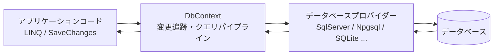
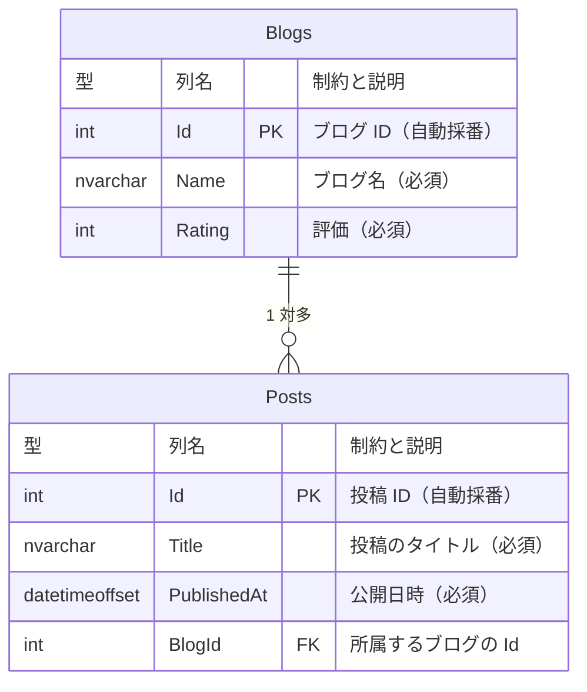
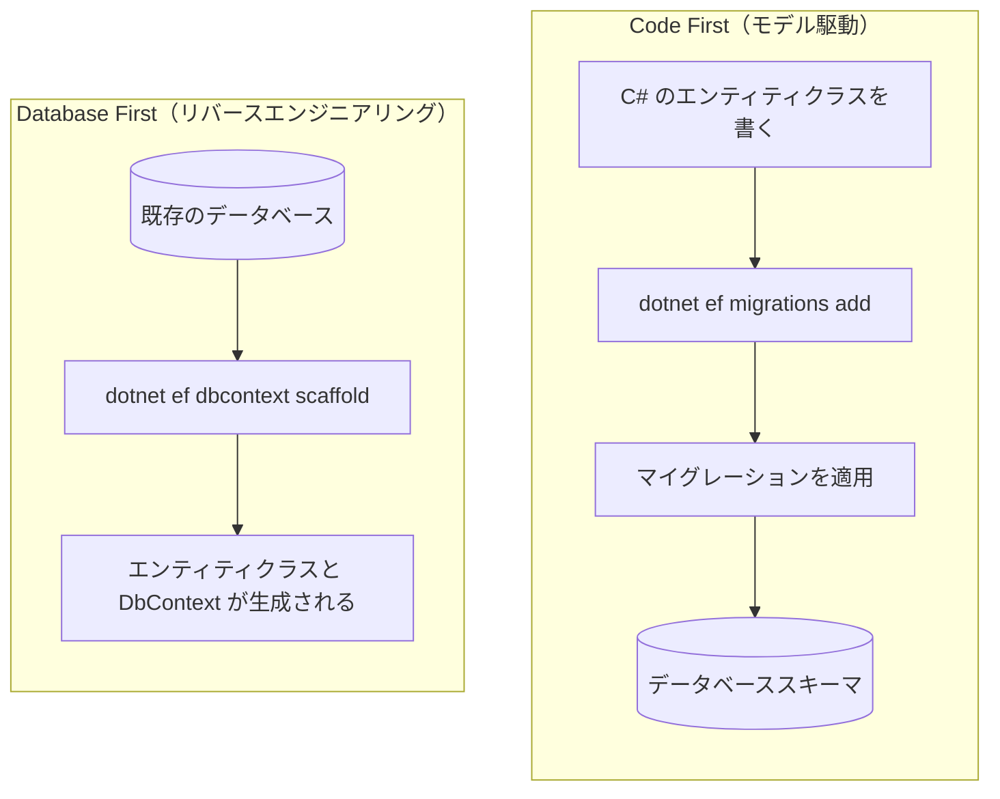
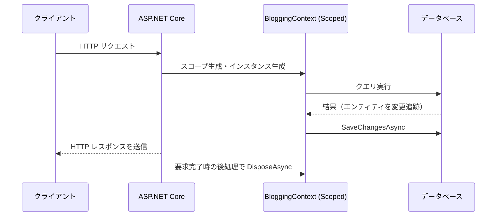
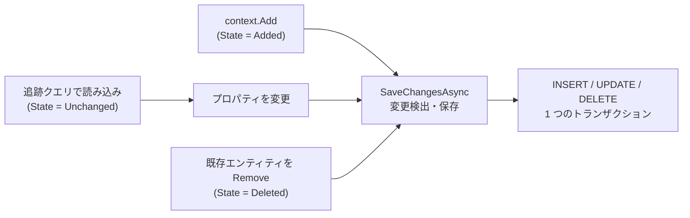
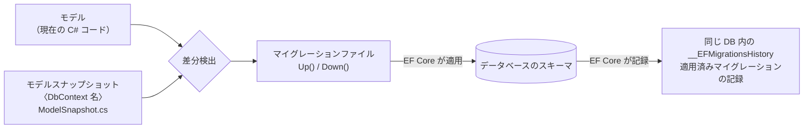
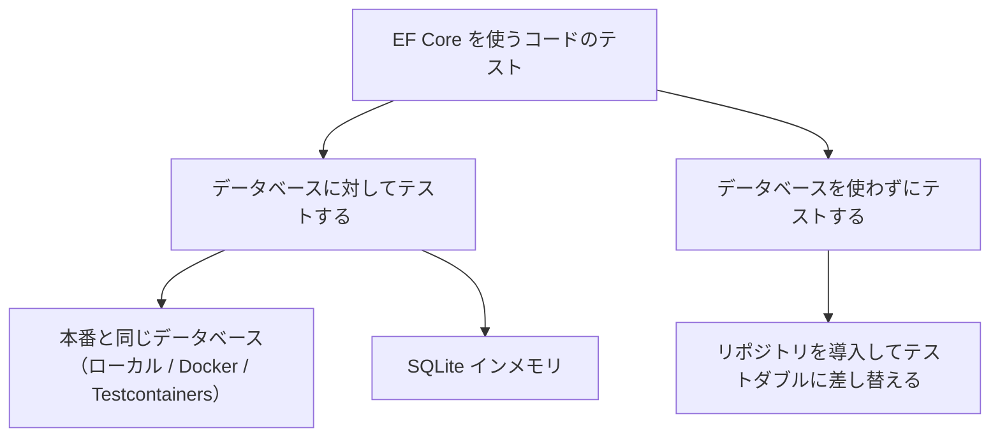
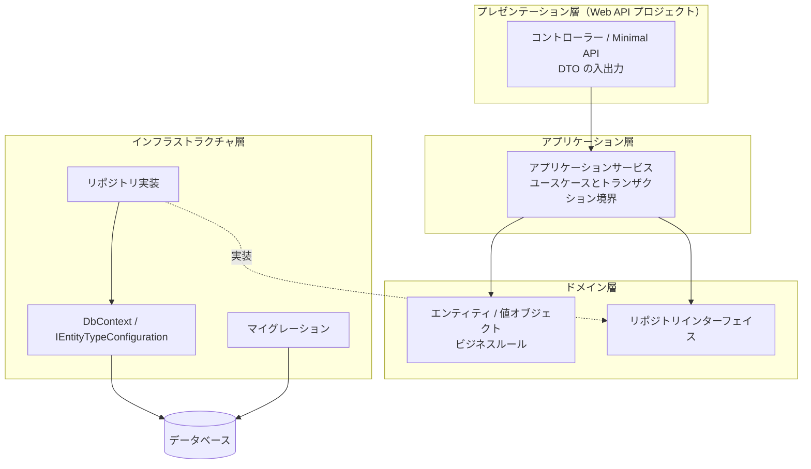

この章では、ASP.NET Core アプリケーションから Entity Framework Core (EF Core) を使ってデータベースにアクセスする方法を扱います。EF Core の基本的な考え方から、DI コンテナーへの登録、クエリと保存、マイグレーションの運用、テストまでを一通り説明します。

EF Core は機能が非常に多いため、この章では **ASP.NET Core から使ううえで必要になる部分**に絞っています。個々の機能の詳細は 6 本の付録に分けています。

| 付録 | 扱う内容 |
| --- | --- |
| [付録 EF Core 1：モデル定義（エンティティとリレーションシップ）](../appendix-efcore-01/index.md) | エンティティの構成、リレーションシップ、値の変換・所有型・複合型、継承 |
| [付録 EF Core 2：モデル定義（キー・採番・SQL Server 固有）](../appendix-efcore-02/index.md) | 代替キー、シャドウプロパティ、シーケンス、テンポラルテーブル、空間データ、hierarchyid、Azure SQL の価格レベル、互換性レベル |
| [付録 EF Core 3：マイグレーションの詳細とクエリ](../appendix-efcore-03/index.md) | マイグレーションの読み方、`dotnet ef` のサブコマンド、履歴テーブルのカスタマイズ、分割クエリ、照合順序、生の SQL、ユーザー定義関数 |
| [付録 EF Core 4：更新・トランザクション・レプリカ](../appendix-efcore-04/index.md) | 切断されたエンティティ、同時実行制御、デッドロック、インターセプター、レプリカ |
| [付録 EF Core 5：パフォーマンス](../appendix-efcore-05/index.md) | 計測と診断、インデックス、コンパイル済みクエリとモデル、NativeAOT、変更検出のコスト |
| [付録 EF Core 6：テスト](../appendix-efcore-06/index.md) | 実データベースに対するテスト、製品コードがトランザクションを使うテスト、SQLite インメモリとその制限、WebApplicationFactory、リポジトリパターン |


---

## 目次

1. [概要と設計方針](#1-概要と設計方針)
   - [EF Core とは](#ef-core-とは)
   - [O/R マッパーの位置づけ](#or-マッパーの位置づけ)
   - [データベースプロバイダーの選択](#データベースプロバイダーの選択)
   - [Code First と Database First](#code-first-と-database-first)
   - [パッケージの追加とツールの準備](#パッケージの追加とツールの準備)
2. [DbContext と ASP.NET Core への組み込み](#2-dbcontext-と-aspnet-core-への組み込み)
   - [エンティティクラスの定義](#エンティティクラスの定義)
   - [DbContext の定義](#dbcontext-の定義)
   - [DI への登録と接続文字列](#di-への登録と接続文字列)
   - [DbContext のライフタイムとスレッド安全性](#dbcontext-のライフタイムとスレッド安全性)
   - [DbContext プーリング](#dbcontext-プーリング)
3. [クエリの基本](#3-クエリの基本)
   - [基本的なクエリ](#基本的なクエリ)
   - [クエリはいつ実行されるか](#クエリはいつ実行されるか)
   - [変更追跡と AsNoTracking](#変更追跡と-asnotracking)
   - [関連データの読み込み](#関連データの読み込み)
   - [遅延読み込みと N+1 問題](#遅延読み込みと-n1-問題)
   - [投影 (Projection) による最適化](#投影-projection-による最適化)
   - [ページング](#ページング)
   - [発行される SQL を確認する](#発行される-sql-を確認する)
4. [保存とトランザクションの基本](#4-保存とトランザクションの基本)
   - [追加・更新・削除の基本](#追加更新削除の基本)
   - [SaveChanges の既定のトランザクション動作](#savechanges-の既定のトランザクション動作)
   - [明示的なトランザクション制御](#明示的なトランザクション制御)
5. [マイグレーションとスキーマ管理](#5-マイグレーションとスキーマ管理)
   - [マイグレーションの仕組み](#マイグレーションの仕組み)
   - [マイグレーションの作成と適用](#マイグレーションの作成と適用)
   - [本番環境への適用戦略](#本番環境への適用戦略)
   - [SQL スクリプトとマイグレーションバンドル](#sql-スクリプトとマイグレーションバンドル)
   - [起動時マイグレーションの是非](#起動時マイグレーションの是非)
6. [本番運用とスケールアウト](#6-本番運用とスケールアウト)
   - [複数インスタンスでも動く理由](#複数インスタンスでも動く理由)
   - [データベースへの接続数](#データベースへの接続数)
   - [起動時マイグレーションの同時実行](#起動時マイグレーションの同時実行)
   - [同じ行への同時更新と一時的な障害](#同じ行への同時更新と一時的な障害)
7. [テストとアーキテクチャ](#7-テストとアーキテクチャ)
   - [テスト戦略の選択](#テスト戦略の選択)
   - [InMemory プロバイダーが推奨されない理由](#inmemory-プロバイダーが推奨されない理由)
   - [WebApplicationFactory を使った統合テスト](#webapplicationfactory-を使った統合テスト)
   - [アーキテクチャ例：レイヤー構成のまとめ](#アーキテクチャ例レイヤー構成のまとめ)
8. [参考ドキュメント](#8-参考ドキュメント)

---

## 1. 概要と設計方針

### EF Core とは

Entity Framework Core (EF Core) は、.NET 向けの軽量かつ拡張可能なオープンソースの **O/R マッパー (Object-Relational Mapper)** です。データベースのテーブルを C# のクラス（エンティティ）にマッピングし、SQL を直接書く代わりに LINQ でクエリを表現できます。

[LINQ (Language Integrated Query: 言語統合クエリ)](https://learn.microsoft.com/ja-jp/dotnet/csharp/linq/) は、データへの問い合わせ機能を C# に統合した仕組みです。

EF Core は大きく次の 3 つの役割を担います。

| 役割 | 内容 |
| --- | --- |
| クエリの変換 | LINQ 式ツリーを解析し、プロバイダーごとの SQL に変換して実行する |
| 変更追跡 (Change Tracking) | 読み込んだエンティティの変更を記録し、`SaveChanges` で INSERT / UPDATE / DELETE に変換する |
| スキーマ管理 | モデルの差分からマイグレーションを生成し、データベーススキーマを更新する |

[式ツリー (Expression Tree)](https://learn.microsoft.com/ja-jp/dotnet/csharp/advanced-topics/expression-trees/) は、コードを木構造のデータとして表したものです。

アプリケーション、`DbContext`、プロバイダー、データベースの関係を図にすると次のようになります。



本章では .NET 10 / EF Core 10 を前提とします。EF Core のバージョンは .NET のバージョンに追随しており、EF Core 10 は .NET 10 と同じく LTS (Long Term Support) リリースです。

#### まずは動くコードを見る

細かい説明はこのあとの節で行いますが、先に「EF Core を使うとどう書けるのか」を見ておきます。ここでは SQL Server に次の 2 つのテーブルがあるものとして、これを EF Core で操作します。



1 つのブログ (`Blogs`) が複数の投稿 (`Posts`) を持ち、投稿は必ずどれか 1 つのブログに属します。図の `PK` は主キー制約 (PRIMARY KEY)、`FK` は外部キー制約 (FOREIGN KEY) を表します。`Posts.BlogId` が `Blogs.Id` を参照する外部キーです。


**1. テーブルに対応するクラスと `DbContext` を用意する**

```csharp
public class Blog
{
    public int Id { get; set; }
    public required string Name { get; set; }
    public int Rating { get; set; }
    public List<Post> Posts { get; set; } = [];
}

public class Post
{
    public int Id { get; set; }
    public required string Title { get; set; }
    public DateTimeOffset PublishedAt { get; set; }
    public int BlogId { get; set; }
    public Blog? Blog { get; set; }
}

public class BloggingContext(DbContextOptions<BloggingContext> options)
    : DbContext(options)
{
    public DbSet<Blog> Blogs => Set<Blog>();
    public DbSet<Post> Posts => Set<Post>();
}
```

**2. 追加する (INSERT)**

オブジェクトを組み立てて `Add` し、`SaveChangesAsync` を呼ぶだけです。

```csharp
var blog = new Blog { Name = ".NET ブログ", Rating = 4 };
blog.Posts.Add(new Post { Title = "EF Core 入門", PublishedAt = DateTimeOffset.UtcNow });

context.Blogs.Add(blog);
await context.SaveChangesAsync();

// 採番された主キーがオブジェクトに書き戻される
Console.WriteLine(blog.Id);      // 1
Console.WriteLine(blog.Posts[0].Id);  // 1
```

公式の[関連データの保存](https://learn.microsoft.com/ja-jp/ef/core/saving/related-data)が説明するとおり、追加したエンティティから参照される新しい関連エンティティも一緒に保存されます。次は、上のコードを SQL Server 2022 で実行したときの確認例です。`Blog` と `Post` の INSERT が発行され、外部キーも設定されています。

```sql
INSERT INTO [Blogs] ([Name], [Rating])
OUTPUT INSERTED.[Id]
VALUES (@p0, @p1);

INSERT INTO [Posts] ([BlogId], [PublishedAt], [Title])
OUTPUT INSERTED.[Id]
VALUES (@p2, @p3, @p4);
```

**3. 問い合わせる (SELECT)**

SQL の代わりに LINQ を書きます。

```csharp
var blogs = await context.Blogs
    .Where(b => b.Rating >= 3)
    .OrderBy(b => b.Name)
    .Select(b => new { b.Name, PostCount = b.Posts.Count })
    .ToListAsync();
```

EF Core は LINQ のクエリをデータベースプロバイダーに渡し、データベース用のクエリへ翻訳します（[公式のデータのクエリの説明](https://learn.microsoft.com/ja-jp/ef/core/querying/)）。次は SQL Server 2022 で確認できている SQL の例です。`Posts.Count` が副問い合わせになっており、この例では件数を数えるために投稿を全件読み込む必要がありません。

```sql
SELECT [b].[Name], (
    SELECT COUNT(*)
    FROM [Posts] AS [p]
    WHERE [b].[Id] = [p].[BlogId]) AS [PostCount]
FROM [Blogs] AS [b]
WHERE [b].[Rating] >= 3
ORDER BY [b].[Name]
```

**4. 更新する (UPDATE)**

更新用のメソッドは呼びません。読み込んだオブジェクトのプロパティを書き換えて `SaveChangesAsync` を呼ぶと、EF Core が変更を検出して UPDATE を組み立てます。

```csharp
var blog = await context.Blogs.FirstAsync(b => b.Name == ".NET ブログ");
blog.Rating = 5;
await context.SaveChangesAsync();
```

公式の[変更追跡の説明](https://learn.microsoft.com/ja-jp/ef/core/change-tracking/)では、プロパティ単位で変更を追跡し、変更された値を更新すると説明しています。次の SQL Server 2022 の確認例でも、変更した `Rating` だけが UPDATE 文に含まれ、書き換えていない `Name` は対象外です。

```sql
UPDATE [Blogs] SET [Rating] = @p0
OUTPUT 1
WHERE [Id] = @p1;
```

> [!NOTE]
> EF Core の**変更追跡 (Change Tracking)** は、追跡中の複数のオブジェクトへの変更を、1 回の `SaveChanges` でまとめて反映します。


### O/R マッパーの位置づけ

.NET でデータベースにアクセスする手段は EF Core だけではありません。用途に応じて選択します。

| 手段 | 特徴 | 向いている場面 |
| --- | --- | --- |
| EF Core | LINQ、変更追跡、マイグレーションを備えたフル機能の O/R マッパー | 一般的な業務アプリケーション。読み書き両方を扱う |
| Dapper などのマイクロ O/R マッパー | SQL を自分で書き、結果をオブジェクトにマッピングするだけ | SQL を完全に制御したい、複雑な集計クエリ |
| ADO.NET (`DbConnection` / `DbCommand`) | 最も低レベルな API | 特殊な最適化や、プロバイダー固有の機能を直接使う場合 |

EF Core でも[付録3の「生の SQL を使う」](../appendix-efcore-03/index.md#生の-sql-を使う)で扱う `FromSql` によって生の SQL を書けるため、「基本は EF Core、一部のクエリだけ SQL を直接書く」という組み合わせが現実的な選択になります。

> [!NOTE]
> [Microsoft の SQL Server 接続ライブラリ一覧](https://learn.microsoft.com/ja-jp/sql/connect/sql-connection-libraries?view=sql-server-ver17)には、Hibernate、Django ORM、Eloquent、GORM、Prisma などが紹介されています。**Django** では `Product.objects.filter(name="Notebook")` のように、モデルの `objects` から条件を指定します（[Microsoft の Django 移行例](https://learn.microsoft.com/ja-jp/sql/connect/python/mssql-django/migrate-from-postgresql?view=sql-server-ver17)にも `objects.filter(...)` の例があります）。Django 6.1.1 と SQLite で、3 件から同名の 2 件が返り、該当しない条件では 0 件になることを確認できています。EF Core では `DbContext` の `DbSet` に対して LINQ で条件を書きます。

### データベースプロバイダーの選択

EF Core 自体はデータベースに依存せず、**プロバイダー** と呼ばれる NuGet パッケージを追加することで各データベースに対応します。

| データベース | パッケージ | 提供元 | 公式一覧の記載 |
| --- | --- | --- | --- |
| SQL Server / Azure SQL / Azure Synapse Analytics | `Microsoft.EntityFrameworkCore.SqlServer` | EF Core プロジェクト (Microsoft) | 8, 9, 10 |
| SQLite | `Microsoft.EntityFrameworkCore.Sqlite` | EF Core プロジェクト (Microsoft) | 8, 9, 10 |
| Azure Cosmos DB for NoSQL | `Microsoft.EntityFrameworkCore.Cosmos` | EF Core プロジェクト (Microsoft) | 8, 9, 10 |
| PostgreSQL | `Npgsql.EntityFrameworkCore.PostgreSQL` | Npgsql Development Team | 8, 9 |
| MySQL / MariaDB | `Pomelo.EntityFrameworkCore.MySql` | Pomelo Foundation Project | 8, 9 |

> [!WARNING]
> **プロバイダーは一般に、対象の EF Core メジャーバージョンに対応したものが必要です。** 公式ドキュメントは、たとえば EF Core 8 向けにリリースされたプロバイダーは EF Core 9 では動作しないと説明しています。EF Core のバージョンを上げるときは、使っているプロバイダーが対応済みかを必ず先に確認してください。
>
> 上の表の最終列は[公式のプロバイダー一覧](https://learn.microsoft.com/ja-jp/ef/core/providers/)に記載されている値です。同ページは、対応バージョンの詳細について各プロバイダーの資料を確認するよう求めています。採用時には、提供元が示す対応バージョンと NuGet の依存関係を確認してください。具体的な確認方法は[付録5の「サードパーティー製プロバイダーはバージョンを実際に確かめる」](../appendix-efcore-05/index.md#サードパーティー製プロバイダーはバージョンを実際に確かめる)にまとめています。

> [!IMPORTANT]
> 1 つの `DbContext` インスタンスに設定できるプロバイダーは 1 つだけです。同じ `DbContext` の型を別々のインスタンスで異なるプロバイダーに接続することは可能ですが、単一のインスタンスが複数のプロバイダーを使うことはできません。

### Code First と Database First

EF Core でモデルとデータベースを対応づけるアプローチは 2 つあります。



| アプローチ | 使いどころ |
| --- | --- |
| Code First | 新規開発。スキーマの変更履歴をソース管理に残せる |
| Database First | 既存データベースがある場合や、DBA がスキーマを管理している場合 |

本章では Code First を中心に説明します。Database First の場合は次のコマンドでエンティティと `DbContext` を生成します。

```bash
dotnet ef dbcontext scaffold "Server=(localdb)\mssqllocaldb;Database=Blogging;Trusted_Connection=True" Microsoft.EntityFrameworkCore.SqlServer --output-dir Models
```

> [!WARNING]
> スキャフォールディングをそのまま実行すると、**生成された `DbContext` の `OnConfiguring` に接続文字列がそのまま埋め込まれます**。`--no-onconfiguring` オプションで抑止できます。詳しくは[付録3の「既存データベースからスキャフォールディングする」](../appendix-efcore-03/index.md#既存データベースからスキャフォールディングする)を参照してください。

### パッケージの追加とツールの準備

Web API プロジェクトに SQL Server プロバイダーを追加します。

```bash
dotnet add package Microsoft.EntityFrameworkCore.SqlServer
dotnet add package Microsoft.EntityFrameworkCore.Design
```

`Microsoft.EntityFrameworkCore.Design` は、マイグレーションの生成やスキャフォールディングといった **設計時 (design-time)** の操作に必要です。実行時には不要ですが、`dotnet ef` コマンドを使うプロジェクトには追加しておきます。

続いて EF Core のコマンドラインツールをインストールします。

```bash
dotnet tool install --global dotnet-ef
```

すでにインストール済みの場合は更新します。

```bash
dotnet tool update --global dotnet-ef
```

インストールを確認します。

```bash
dotnet ef --version
```

> [!TIP]
> チーム開発では、グローバルツールの代わりに **ローカルツール** としてリポジトリに固定すると、開発者間でバージョンを揃えられます。[公式のローカルツールの手順](https://learn.microsoft.com/ja-jp/dotnet/core/tools/local-tools-how-to-use)では、マニフェストをソース管理で共有し、`dotnet tool restore` で復元する方法を説明しています。`dotnet new tool-manifest` を実行してから `dotnet tool install dotnet-ef` を実行すると、ツールマニフェストファイルにバージョンが記録されます。このファイルをリポジトリにコミットしておけば、他の開発者は `dotnet tool restore` を実行するだけで同じバージョンを復元できます。実測では、マニフェストに `"version": "10.0.11"` が記録され、`dotnet tool restore` で復元できることを確認できています。

> [!NOTE]
> [EF Core 10 の公式の破壊的変更](https://learn.microsoft.com/ja-jp/ef/core/what-is-new/ef-core-10.0/breaking-changes#ef-tools-now-require-framework-to-be-specified-for-multi-targeted-projects)にあるとおり、1 つのプロジェクトが複数のターゲットフレームワークを指定している場合、CLI では `--framework` の指定が必要です。`net10.0` / `net10.0-windows` の対照でも、省略時のエラーと、`--framework net10.0` 指定時のコンテキスト情報の取得を確認できています。詳しくは[付録3の「EF Core ツールの使い分け」](../appendix-efcore-03/index.md#ef-core-ツールの使い分け)を参照してください。

---

## 2. DbContext と ASP.NET Core への組み込み

### エンティティクラスの定義

エンティティは特別な基底クラスを継承しない、単なる C# クラス（POCO: Plain Old CLR Object）として定義します。ブログと投稿という典型的な 1 対多の関係を例にします。

ここでの CLR は、.NET のコードを実行する環境である[共通言語ランタイム (Common Language Runtime)](https://learn.microsoft.com/ja-jp/dotnet/standard/clr) を指します。

```csharp
namespace BloggingApi.Models;

public class Blog
{
    public int Id { get; set; }
    public required string Name { get; set; }
    public required string Url { get; set; }
    public int Rating { get; set; }
    public DateTimeOffset CreatedAt { get; set; }

    // ナビゲーションプロパティ（1 対多の「多」側）
    public List<Post> Posts { get; set; } = [];
    public List<Contributor> Contributors { get; set; } = [];
}

public class Post
{
    public int Id { get; set; }
    public required string Title { get; set; }
    public string? Content { get; set; }
    public DateTimeOffset PublishedAt { get; set; }

    // 外部キー
    public int BlogId { get; set; }

    // ナビゲーションプロパティ（1 対多の「1」側）
    public Blog? Blog { get; set; }
}

public class Contributor
{
    public int Id { get; set; }
    public required string DisplayName { get; set; }

    public int BlogId { get; set; }
    public Blog? Blog { get; set; }
}
```

ここで使っている C# の機能を整理します。

| 機能 | 意味 |
| --- | --- |
| `required` 修飾子 | オブジェクト初期化時に値の設定を必須にする。EF Core では非 null の必須列としてマッピングされる |
| `string?` | null 許容参照型。EF Core はこれを NULL 許容列としてマッピングする |
| `= []` | コレクション式による空のリストの初期化 |

> [!IMPORTANT]
> プロジェクトで **null 許容参照型 (Nullable Reference Types)** が有効（`<Nullable>enable</Nullable>`。.NET 6 以降のテンプレートでは既定）になっていると、EF Core は `string` を NOT NULL 列、`string?` を NULL 許容列として扱います。意図しない NOT NULL 制約を避けるため、null を許す列は必ず `?` を付けます。

> [!NOTE]
> ここで示した書き方は、**.NET のコード分析ルールと衝突することがあります。** `List<T>` を公開する `public List<Post> Posts { get; set; }` は CA1002 と CA2227 に、URL を `string` で持つプロパティは CA1056 に該当します。いずれも EF Core では意図した書き方なので、警告をエラーとして扱う設定のプロジェクトでは抑制が必要です。具体的な対処は[付録2の「コード分析ルールがエンティティ定義と衝突する」](../appendix-efcore-02/index.md#コード分析ルールがエンティティ定義と衝突する)を参照してください。

### DbContext の定義

`DbContext` は、エンティティのセット（`DbSet<T>`）を公開し、クエリと保存の起点となるクラスです。

```csharp
using Microsoft.EntityFrameworkCore;
using BloggingApi.Models;

namespace BloggingApi.Data;

public class BloggingContext : DbContext
{
    public BloggingContext(DbContextOptions<BloggingContext> options)
        : base(options)
    {
    }

    public DbSet<Blog> Blogs => Set<Blog>();
    public DbSet<Post> Posts => Set<Post>();

    protected override void OnModelCreating(ModelBuilder modelBuilder)
    {
        // ここでモデルの詳細を構成する（後述）
    }
}
```

> [!TIP]
> `public DbSet<Blog> Blogs { get; set; }` という自動プロパティも使えます。EF Core 7 以降は、EF Core が初期化する `DbSet` プロパティについて、null 許容参照型の未初期化警告を抑制します。本章の `=> Set<Blog>()` という式形式も有効ですが、警告を避けるために必須というわけではありません。

`DbContextOptions<BloggingContext>` を受け取るコンストラクターは、DI から構成を受け取るために必要です。

> [!TIP]
> 上のコードで「後述」とした `OnModelCreating` の中身は、[付録1の「規約・データ注釈・Fluent API」](../appendix-efcore-01/index.md#規約データ注釈fluent-api)で扱います。エンティティが増えて `OnModelCreating` が長くなってきたら、[「IEntityTypeConfiguration による構成の分割」](../appendix-efcore-01/index.md#ientitytypeconfiguration-による構成の分割)でエンティティごとのクラスに分けられます。

### DI への登録と接続文字列

`Program.cs` で `AddDbContext` を呼び出して DI コンテナーに登録します。

```csharp
using Microsoft.EntityFrameworkCore;
using BloggingApi.Data;

var builder = WebApplication.CreateBuilder(args);

var connectionString = builder.Configuration.GetConnectionString("BloggingDatabase")
    ?? throw new InvalidOperationException("接続文字列 'BloggingDatabase' が見つかりません。");

builder.Services.AddDbContext<BloggingContext>(options =>
    options.UseSqlServer(connectionString));

builder.Services.AddControllers();

var app = builder.Build();

app.MapControllers();

app.Run();
```

接続文字列は `appsettings.json` の `ConnectionStrings` セクションに置きます。

```json
{
  "ConnectionStrings": {
    "BloggingDatabase": "Server=(localdb)\\mssqllocaldb;Database=Blogging;Trusted_Connection=True;MultipleActiveResultSets=true"
  }
}
```

> [!WARNING]
> 本番環境の接続文字列に ID とパスワードを直接書かないでください。ローカル開発ではユーザーシークレット、本番環境では環境変数や Azure Key Vault、あるいは Microsoft Entra ID によるパスワードレス認証を使います。構成プロバイダーの優先順位とシークレット管理については [第5章：アプリ設定 (Configuration)](../05-configuration/index.md) を参照してください。

登録した `DbContext` は、コントローラーやサービスにコンストラクターインジェクションで注入します。

```csharp
using Microsoft.AspNetCore.Mvc;
using Microsoft.EntityFrameworkCore;
using BloggingApi.Data;
using BloggingApi.Models;

namespace BloggingApi.Controllers;

[ApiController]
[Route("api/[controller]")]
public class BlogsController(BloggingContext context) : ControllerBase
{
    [HttpGet]
    public async Task<ActionResult<IEnumerable<Blog>>> GetBlogs(CancellationToken cancellationToken)
        => await context.Blogs.AsNoTracking().ToListAsync(cancellationToken);
}
```

> [!TIP]
> 上記は C# 12 の **プライマリコンストラクター** を使った書き方です。フィールドへの代入を書かずに `context` をメソッド内で参照できます。詳細は [第6章：プライマリコンストラクターによる注入（C# 12）](../06-dependency-injection/index.md#プライマリコンストラクターによる注入c-12) を参照してください。

#### 接続の暗号化は既定で有効

SQL Server プロバイダーが使う `Microsoft.Data.SqlClient` は、バージョン 4.0 から **`Encrypt` の既定値が `True` に変わりました。** EF Core の SQL Server プロバイダーでは、[EF Core 7 への更新でこの変更が影響します](https://learn.microsoft.com/ja-jp/ef/core/what-is-new/ef-core-7.0/breaking-changes#encrypt-true)。SqlClient と EF Core のバージョン番号は別です。既定の `TrustServerCertificate=False` と組み合わせると、**サーバー証明書の検証も必要**になります。開発用のコンテナーや自己署名証明書のサーバーに、それまで動いていた接続文字列で接続すると失敗します。

```text
SqlException: サーバーとの接続を正常に確立しましたが、ログイン前のハンドシェイク中に
エラーが発生しました。(provider: TCP プロバイダー, error: 35 - 内部の例外が発生しました)
  → AuthenticationException: 証明書のチェーン検証に失敗しました。
    エラー: 'The certificate was not trusted., [Status: UntrustedRoot]
```

[公式の暗号化と証明書検証の説明](https://learn.microsoft.com/ja-jp/sql/connect/ado-net/encryption-and-certificate-validation)に基づく、開発環境向けの設定の違いは次のとおりです。自己署名証明書を使う SQL Server 2022 のコンテナーでも、両方の設定で接続できることを確認できています。

| 追加する設定 | 意味 |
| --- | --- |
| `TrustServerCertificate=True` | 暗号化はするが、証明書の検証を省略する |
| `Encrypt=False` | クライアント側で接続の暗号化を必須にしない |

> [!WARNING]
> **どちらも本番環境で使ってはいけません。** `TrustServerCertificate=True` は中間者攻撃を防げず、`Encrypt=False` は暗号化しない接続を許容してしまいます。実際の暗号化の有無はサーバー側の構成にも依存するため、「必ず平文になる」という意味ではありません（[公式の暗号化と証明書検証の組み合わせ](https://learn.microsoft.com/ja-jp/sql/connect/ado-net/encryption-and-certificate-validation)）。本番では、サーバーに信頼された証明書を配置してどちらの設定も付けないのが正しい構成です。開発環境だけの回避策として使い、接続文字列を環境ごとに分けてください。

> [!NOTE]
> `dotnet ef` コマンドは、マイグレーションを生成するときに `Program.cs` を実行して `DbContext` の構成を取得します。**そのため、起動時に接続文字列や外部サービスを必要とするアプリケーションでは、ツールがエラーになることがあります。** その場合は[付録3の「設計時 DbContext ファクトリ」](../appendix-efcore-03/index.md#設計時-dbcontext-ファクトリ)で、ツール専用の構成を用意します。

### DbContext のライフタイムとスレッド安全性

`AddDbContext` は `DbContext` を **Scoped** サービスとして登録します。ASP.NET Core では 1 つの HTTP リクエストが 1 つのスコープに対応するため、リクエストごとに `DbContext` インスタンスが作られ、リクエスト終了時に破棄されます。

> [!IMPORTANT]
> 公式の[Scoped サービスの使用上の注意](https://learn.microsoft.com/ja-jp/dotnet/core/extensions/dependency-injection/service-lifetimes#scoped)に従い、**`DbContext` を Singleton サービスのコンストラクターへ直接注入してはいけません。** 開発環境の既定の検証が有効な本章の構成で、Singleton の `MyBackgroundService` に `BloggingContext` を注入する場合は、起動時の `AggregateException` に次の内部例外が含まれ、リクエストを受ける前に検出されます。
>
> ```text
> System.InvalidOperationException: Cannot consume scoped service
> 'BloggingApi.Data.BloggingContext'
> from singleton 'MyBackgroundService'.
> ```
>
> この状況の解決策は後述の `IServiceScopeFactory` か `IDbContextFactory<T>` です。
>
> **ただし、この検証が既定で有効になるのは開発環境です。** 公式の[スコープ検証](https://learn.microsoft.com/ja-jp/dotnet/core/extensions/dependency-injection/overview#scope-validation)の説明でも、開発環境でホストを構築するときの既定の検証として位置づけられています。検証オプションを明示しない本番の既定構成では検出されないため、開発環境での起動確認を省かないでください。本章のコードでも、環境名だけを `Production` に変えると起動時の例外が発生せず、`ValidateOnBuild` と `ValidateScopes` を明示的に有効にすると `Production` でも起動時に検出されることを確認できています。
>
> なお、公式の[DbContext の構成](https://learn.microsoft.com/ja-jp/ef/core/dbcontext-configuration/#configuring-the-database-provider)では、各インスタンスにデータベースプロバイダーの構成が必要とされています。DI の検証だけでは、その構成や実際の接続まで確認できません。`UseSqlServer` などを省略した本章の `BloggingContext` の確認例では、DI コンテナーの構築とインスタンスの解決は成功し、最初のデータベース操作で次の例外が発生することを確認できています。
>
> ```text
> System.InvalidOperationException: No database provider has been configured for this DbContext.
> ```

HTTP リクエスト内で `BloggingContext` を使う処理の流れを示します。



ASP.NET Core 10.0.11 の[公式実装](https://github.com/dotnet/aspnetcore/blob/v10.0.11/src/Http/Http/src/Features/RequestServicesFeature.cs)は、要求スコープを応答完了時の破棄対象として登録します。応答送信後のコールバックを扱う API が [`OnCompleted`](https://learn.microsoft.com/ja-jp/dotnet/api/microsoft.aspnetcore.http.httpresponse.oncompleted?view=aspnetcore-10.0) です。Kestrel の実 HTTP 通信でも、要求完了時の後処理を試験用に一時停止する条件で、`DbContext` がまだ破棄されていなくても応答本文を取得できることを確認できています。図は正常系のサーバー側の処理順を表しており、クライアントの受信完了を待ってから破棄するという保証ではありません。

`DbContext` は 1 つの **作業単位 (unit-of-work)** を表すよう設計されており、公式ドキュメントは次の点を明記しています。

- `DbContext` は **スレッドセーフではない**。複数のスレッドで同じインスタンスを共有してはいけない
- 非同期メソッドは必ず `await` してから、次の操作でインスタンスを使う
- EF Core が投げる `InvalidOperationException` はコンテキストを回復不能な状態にすることがあり、握りつぶして処理を続行してはいけない

> [!WARNING]
> `DbContext` は **スレッドセーフではありません。** 公式ドキュメントは「EF Core は同じ `DbContext` インスタンス上で複数の並行操作が実行されることをサポートしない。これには非同期クエリの並列実行と、複数スレッドからの明示的な同時利用の両方が含まれる」と明記しています。`await` せずに 2 つの操作を同時に走らせる対照でも、次の例外を確認できています。
>
> ```csharp
> // 同じ DbContext で操作を並行に走らせない
> await Task.WhenAll(context.SaveChangesAsync(), context.SaveChangesAsync());
> ```
>
> ```text
> System.InvalidOperationException: A second operation was started on this context instance
> before a previous operation completed. This is usually caused by different threads
> concurrently using the same instance of DbContext.
> ```
>
> さらに公式ドキュメントは「**並行アクセスが検出されなかった場合、未定義の動作、アプリケーションのクラッシュ、データの破損につながる可能性がある**」とも警告しています。例外が出ないことを「安全である証拠」と考えないでください。
>
> 公式の[DbContext のスレッド処理の問題を回避する方法](https://learn.microsoft.com/ja-jp/ef/core/dbcontext-configuration/#avoiding-dbcontext-threading-issues)は、既定の Scoped 登録と並行操作の禁止を区別して説明しています。この章の `AddDbContext` の既定の Scoped 登録でも、要求内では `await` の前後で同じコンテキストが解決され、別の要求では別のインスタンスになることを確認できています。**安全に使うための条件は、要求が特定の物理スレッドに固定されることではなく、同じコンテキストの操作を重ねないことです。** 各操作を `await` してから次へ進んでください。1 つの要求内で `Task.WhenAll` による並列実行が必要なら、後述する `IDbContextFactory<T>` でインスタンスを分けます。

Singleton サービスやバックグラウンドサービスから `DbContext` を使う場合は、`IServiceScopeFactory` でスコープを作り、その中から解決します。1 つの要求の中で複数のクエリを並列に実行したい場合は、`AddDbContextFactory` で登録した `IDbContextFactory<T>` からインスタンスを個別に作ります。どちらの手順も [付録 EF Core 5](../appendix-efcore-05/index.md#singleton-やバックグラウンドサービスから-dbcontext-を使う) で扱います。

> [!NOTE]
> この章では `AddDbContext` の既定の Scoped 登録を使います。`DbContext` の寿命は DI スコープで管理し、追跡中の変更を保存するときに `SaveChangesAsync` を呼びます。

### DbContext プーリング

高スループットのアプリケーションでは、`AddDbContext` の代わりに `AddDbContextPool` を使うと、`DbContext` インスタンスを再利用するプールが有効になり、インスタンスの生成コストを削減できます。ただしプールされたインスタンスは再利用されるため、リクエストごとに変わる状態をフィールドに保持する設計とは相性が悪くなります。詳しくは[付録5の「DbContext プーリングでインスタンスを使い回す」](../appendix-efcore-05/index.md#dbcontext-プーリングでインスタンスを使い回す)を参照してください。

> [!TIP]
> **さらに詳しく**
>
> - [付録 EF Core 1：モデル定義（エンティティとリレーションシップ）](../appendix-efcore-01/index.md) — コンストラクターへのバインド、Null 許容参照型とスキーマ、規約・データ注釈・Fluent API、`IEntityTypeConfiguration` による構成の分割、リレーションシップの詳細、エンティティの等価性、値の変換・所有型・複合型、継承のマッピング
> - [付録 EF Core 2：モデル定義（キー・採番・SQL Server 固有）](../appendix-efcore-02/index.md) — 代替キー、テーブル分割、キーなしエンティティ型、シャドウプロパティ、シーケンス、主キーの採番方法の制御、テンポラルテーブル、空間データ、hierarchyid、計算列、SQL Server 固有の列オプション、Azure SQL の価格レベルの指定、[SQL Server の互換性レベルの明示](../appendix-efcore-02/index.md#sql-server-の互換性レベルを明示する)、コマンドのタイムアウト、一括構成、グローバルクエリフィルター、コード分析ルールとの衝突

## 3. クエリの基本

### 基本的なクエリ

EF Core では LINQ でクエリを記述します。式ツリーが解析され、プロバイダーが SQL に変換します。

```csharp
// すべての行を取得
var blogs = await context.Blogs.ToListAsync(cancellationToken);

// 条件で絞り込む
var dotnetBlogs = await context.Blogs
    .Where(b => b.Url.Contains("dotnet"))
    .OrderBy(b => b.Name)
    .ToListAsync(cancellationToken);

// 単一の行を取得（見つからなければ null）
var blog = await context.Blogs
    .FirstOrDefaultAsync(b => b.Id == id, cancellationToken);

// 主キーで取得（追跡中のインスタンスがあればデータベースに行かない）
var cached = await context.Blogs.FindAsync([id], cancellationToken);

// 集計
var count = await context.Posts.CountAsync(p => p.BlogId == id, cancellationToken);
```

非同期メソッドの対応表です。ASP.NET Core では、スレッドをブロックしないために必ず非同期版を使います。

| 同期 | 非同期 |
| --- | --- |
| `ToList()` | `ToListAsync()` |
| `First()` / `FirstOrDefault()` | `FirstAsync()` / `FirstOrDefaultAsync()` |
| `Single()` / `SingleOrDefault()` | `SingleAsync()` / `SingleOrDefaultAsync()` |
| `Count()` / `Any()` | `CountAsync()` / `AnyAsync()` |
| `SaveChanges()` | `SaveChangesAsync()` |

> [!TIP]
> 「1 件でもあるか」を調べるときは、存在確認の意図を表す **`Any()`** を使います。生成される SQL は式の形やプロバイダーによって異なるため、`Count` を含む式が常に同じ SQL になるとは扱いません。公式の説明と、本章で使用する式の確認例は[付録3の「存在チェックは Count ではなく Any を使う」](../appendix-efcore-03/index.md#存在チェックは-count-ではなく-any-を使う)にまとめています。

> [!TIP]
> 非同期メソッドには `CancellationToken` を渡してください。コントローラーのアクションメソッドや Minimal API のハンドラーは `CancellationToken` を引数に取れます。クライアントが接続を切ったときに、実行中のクエリの中断を要求できます。ただし、要求を受けて停止するかどうかはデータベースプロバイダーによります。実測した範囲と保存状態の確認は[付録5の「非同期 API を使う」](../appendix-efcore-05/index.md#非同期-api-を使う)を参照してください。

> [!IMPORTANT]
> LINQ は C# の意味論で書きますが、実行されるのは SQL です。**注意すべき代表例は、文字列と `null` の比較です。** 上の `Contains("dotnet")` のような文字列比較では、**大文字小文字を区別するかどうかは C# 側ではなくデータベースの照合順序が決めます**。SQL 自体の `null` 比較も三値論理のため C# と異なりますが、EF Core は既定で必要な `null` チェックを SQL に追加して、その違いを補正します。`UseRelationalNulls` で補正を無効にすると、C# と同じ意味にならない場合があります。具体例は、[付録3の「大文字小文字の区別は照合順序が決める」](../appendix-efcore-03/index.md#大文字小文字の区別は照合順序が決める)と[「null の比較は C# と SQL で意味が違う」](../appendix-efcore-03/index.md#null-の比較は-c-と-sql-で意味が違う)を参照してください。

### クエリはいつ実行されるか

`IQueryable<T>` に対する `Where` や `OrderBy` はクエリを組み立てるだけで、データベースへのアクセスは発生しません。実際に実行されるのは次のタイミングです。

- `ToListAsync` / `ToArrayAsync` などで結果を実体化したとき
- `FirstAsync` / `SingleAsync` / `CountAsync` などのスカラー結果を返すメソッドを呼んだとき
- `foreach` / `await foreach` で列挙したとき

```csharp
// ここではまだ SQL は発行されない
IQueryable<Blog> query = context.Blogs.Where(b => b.Name.StartsWith("A"));

if (onlyRecent)
{
    query = query.Where(b => b.CreatedAt > DateTimeOffset.UtcNow.AddDays(-30));
}

// ここで初めて 1 回の SQL が実行される
var result = await query.ToListAsync(cancellationToken);
```

> [!IMPORTANT]
> `ToListAsync()` を呼んだ後に `Where` を書くと、それは LINQ to Objects となり、**データベースからすべての行を取得してからメモリ上で絞り込む** ことになります。絞り込みは必ず実体化の前に行ってください。

### 変更追跡と AsNoTracking

既定では、クエリが返したエンティティは `DbContext` の **チェンジトラッカー** に登録されます。これによりプロパティを変更するだけで `SaveChangesAsync` が UPDATE を発行できますが、追跡そのものにコストがかかります。

読み取り専用のクエリでは `AsNoTracking()` を使います。

```csharp
var blogs = await context.Blogs
    .AsNoTracking()
    .Where(b => b.Url.Contains("dotnet"))
    .ToListAsync(cancellationToken);
```

公式の[非追跡クエリの説明](https://learn.microsoft.com/ja-jp/ef/core/querying/tracking#no-tracking-queries)は、取得したエンティティを更新しない場合に非追跡クエリを使うよう勧めています。ASP.NET Core の GET エンドポイントのように、取得した結果をそのまま返すだけの処理では、`AsNoTracking()` を検討してください。ただし、同一エンティティの重複を解決する必要がある場合など、追跡ありのほうが効率的なケースも公式に説明されています。

補足として、SQLite で 2,000 行を 30 回読み取る条件では、追跡あり／なしの実行時間が 7.48 ミリ秒／2.32 ミリ秒、割り当てバイト数が約 1.99 MB／約 0.77 MB となることを確認できています。これらは同条件での確認値であり、別のクエリでの性能順位や改善倍率を保証するものではありません。

追跡を行わないと、同じ行が複数回結果に現れたときに別々のインスタンスが作られます。同一性を保ちたい場合は `AsNoTrackingWithIdentityResolution()` を使います。

```csharp
var posts = await context.Posts
    .AsNoTrackingWithIdentityResolution()
    .Include(p => p.Blog)
    .ToListAsync(cancellationToken);
```

`DbContext` 全体で既定の追跡動作を変えることもできます。

```csharp
builder.Services.AddDbContext<BloggingContext>(options =>
    options.UseSqlServer(connectionString)
           .UseQueryTrackingBehavior(QueryTrackingBehavior.NoTracking));
```

この場合、追跡したいクエリだけ `AsTracking()` を付けて個別に戻せます。

```csharp
var blog = await context.Blogs
    .AsTracking()
    .FirstAsync(b => b.Id == id, cancellationToken);
```

> [!WARNING]
> 公式の[追跡とカスタム投影](https://learn.microsoft.com/ja-jp/ef/core/querying/tracking#tracking-and-custom-projections)が説明するとおり、`Select` で射影しても、**結果の中にエンティティのインスタンスが含まれていれば既定で追跡されます**。SQL Server 2022 の確認例でも、`Select(b => new { b, b.Name })` は匿名型を返しながら `ChangeTracker` のエントリー数は 1、`Select(b => new { b.Id, b.Name })` のように値だけを取り出す場合は 0 件となることを確認できています。「射影したから追跡されない」とは限りません。

> [!NOTE]
> EF Core では、変更追跡が必要かどうかと、どの列を取得するかを別々に考えます。読み取り専用のクエリでは `AsNoTracking` を使い、必要な列だけを取得したい場合は `Select` で投影します。

> [!TIP]
> 追跡が実際にどれだけのコストになるのかを実測した結果は[付録5の「変更検出のコストを理解する」](../appendix-efcore-05/index.md#変更検出のコストを理解する)に、追跡されたエンティティが同一性でどう解決されるかといった細かい挙動は[付録4の「変更追跡の細かい挙動」](../appendix-efcore-04/index.md#変更追跡の細かい挙動)にまとめています。

### 関連データの読み込み

ナビゲーションプロパティを一緒に読み込むには `Include` を使います（イーガーロード）。

```csharp
var blogs = await context.Blogs
    .Include(b => b.Posts)
    .ToListAsync(cancellationToken);
```

さらに深い階層は `ThenInclude` でたどります。ここでは本編で定義済みの `Post` → `Blog` → `Contributors` を読み込みます。

```csharp
var posts = await context.Posts
    .Include(p => p.Blog)
        .ThenInclude(b => b!.Contributors)
    .ToListAsync(cancellationToken);
```

読み込む関連データを絞り込む **フィルター付き Include** も使えます。

```csharp
var blogs = await context.Blogs
    .Include(b => b.Posts
        .Where(p => p.PublishedAt > DateTimeOffset.UtcNow.AddYears(-1))
        .OrderByDescending(p => p.PublishedAt)
        .Take(5))
    .ToListAsync(cancellationToken);
```

`Include` の中で使えるのは `Where`、`OrderBy`、`OrderByDescending`、`ThenBy`、`ThenByDescending`、`Skip`、`Take` です。

> [!IMPORTANT]
> フィルター付き Include は、追跡クエリの場合に注意が必要です。同じ `DbContext` インスタンス内で先に読み込まれた関連エンティティが残っていると、フィルターの結果と混ざることがあります。読み取り専用の用途では `AsNoTracking()` と組み合わせてください。

すでに読み込んだエンティティに対して、後から関連データを読み込む **明示的読み込み (Explicit Loading)** もあります。

```csharp
var blog = await context.Blogs.FirstAsync(b => b.Id == id, cancellationToken);

await context.Entry(blog)
    .Collection(b => b.Posts)
    .LoadAsync(cancellationToken);
```

関連データを読み込まずに件数だけ数えたり、条件で絞って読み込んだりする方法は[付録 EF Core 3 の「関連データを読み込まずに数える」](../appendix-efcore-03/index.md#関連データを読み込まずに数える)を参照してください。

> [!WARNING]
> **同じ階層の複数のコレクションを `Include` すると、それぞれの子の組合せが返され、結果の行数が大きく増えることがあります**（デカルト爆発）。これは、上の `ThenInclude` のように関連を段階的にたどる場合とは区別します。また、親側の列が子の行ごとに繰り返される「データの重複」も別の問題で、親に大きな列があると転送量が増えます。EF Core はこれを避けるためにクエリを分割する `AsSplitQuery()` を用意しています。どちらを選ぶべきかと、分割した場合に生じる整合性の問題は[付録3の「単一クエリと分割クエリ」](../appendix-efcore-03/index.md#単一クエリと分割クエリ)で扱います。

### 遅延読み込みと N+1 問題

`Microsoft.EntityFrameworkCore.Proxies` パッケージを追加し、`UseLazyLoadingProxies()` を呼ぶと、まだ読み込まれていない関連データをナビゲーションプロパティへのアクセス時に自動的に取得する **遅延読み込み (Lazy Loading)** を有効にできます。パッケージの追加だけでは有効になりません。

> [!IMPORTANT]
> 公式の[プロキシによる遅延読み込み](https://learn.microsoft.com/ja-jp/ef/core/querying/related-data/lazy#lazy-loading-with-proxies)は、継承可能なエンティティクラスと、オーバーライド可能な `virtual` のナビゲーションプロパティを前提としています。この章のエンティティ定義で有効化する場合は、`Blog.Posts`、`Blog.Contributors`、`Post.Blog`、`Contributor.Blog` を `virtual` に変更してください。変更せずに有効化する SQLite / EF Core 10.0.11 の対照でも、モデルの初期化時に `InvalidOperationException` が発生し、クエリまで進まないことを確認できています。

公式の[遅延読み込みに関する注意](https://learn.microsoft.com/ja-jp/ef/core/performance/efficient-querying#beware-of-lazy-loading)では、ナビゲーションへのアクセスで追加クエリが発生するため、**N+1 問題** を引き起こしやすいと説明されています。次はその例です。

```csharp
// 遅延読み込みが有効な場合の悪い例
var blogs = await context.Blogs.ToListAsync(cancellationToken); // 1 回のクエリ

foreach (var blog in blogs)
{
    // ループのたびにクエリが発行される（N 回）
    Console.WriteLine($"{blog.Name}: {blog.Posts.Count}");
}
```

遅延読み込みプロキシを有効にし、関連する子をまだ追跡していない `DbContext` で、Blog 100 件（各 1 Post）を取得して各 `Posts` を参照する SQLite 対照でも、最初の SELECT 1 回と子の SELECT 100 回、合計 101 回の SQL を確認できています。これは上の説明を発行回数で裏付ける例であり、ネットワーク遅延や処理時間の測定ではありません。

> [!TIP]
> EF Core の公式パフォーマンスガイダンスは、遅延読み込みが N+1 問題を非常に起こしやすいことを指摘し、Web アプリケーションでは遅延読み込みを避けることを推奨しています。必要な関連データは `Include` で明示的に読み込むか、後述する投影で必要な列だけを取得してください。

```csharp
// 良い例：1 回のクエリで必要なデータをまとめて取得する
var summaries = await context.Blogs
    .Select(b => new BlogSummary(b.Id, b.Name, b.Posts.Count))
    .ToListAsync(cancellationToken);
```

> [!NOTE]
> EF Core で関連データをまとめて読み込むときは `Include` を使います。必要な列だけを取得する投影については、次の節で説明します。

### 投影 (Projection) による最適化

エンティティ全体ではなく、必要な列だけを取得する **投影** は最も効果的な最適化の 1 つです。

```csharp
public record BlogSummary(int Id, string Name, int PostCount);

var summaries = await context.Blogs
    .Select(b => new BlogSummary(b.Id, b.Name, b.Posts.Count))
    .ToListAsync(cancellationToken);
```

生成される SQL は必要な列だけを SELECT し、`Posts` はサブクエリでカウントされます。エンティティ型ではないため変更追跡も行われません。

> [!WARNING]
> API のレスポンスは、エンティティをそのまま返すのではなく DTO (Data Transfer Object) に投影するのが安全です。エンティティを直接返すと、内部の列や循環参照するナビゲーションプロパティが意図せず公開されてしまいます。**そもそも循環したままシリアル化すると `System.Text.Json` が例外を投げます。** 詳しくは[付録3の「エンティティをそのまま JSON にすると循環参照で失敗する」](../appendix-efcore-03/index.md#エンティティをそのまま-json-にすると循環参照で失敗する)を参照してください。

### ページング

一覧 API では必ず件数を制限します。EF Core の公式パフォーマンスガイダンスは、これを「**結果セットのサイズを制限する**」として独立した指針に挙げています。既定では条件に一致する行がすべて返るため、**返る行数が実際のデータ次第になり、読み込まれるデータ量・消費されるメモリ・ネットワークへの負荷のいずれも事前に見積もれません。** 公式が特に注意を促しているのは、**テスト用のデータベースはデータが少ないことが多く、テスト中は問題なく動くのに、実データで多くの行が返るようになった途端に性能問題が表面化する**という点です。

次は、公式の「結果セットのサイズを制限する」という指針の確認例です。SQL Server 2022 に 100,000 行（`Content` は 500 文字）を用意し、同じ条件のクエリを `Take` の有無で比較した値を示します。

| クエリ | 所要時間 | マネージドヒープの増加 |
| --- | --- | --- |
| `Where(...).ToListAsync()` | 3,320 ミリ秒 | +230 MiB |
| `Where(...).Take(25).ToListAsync()` | 38 ミリ秒 | +0 MiB |

メモリの値は `GC.GetTotalMemory` で求めた実行前後のマネージドヒープの差を、1 MiB（1,048,576 バイト）単位の整数にしたものです。ピーク使用量や総割り当て量ではなく、表示上の +0 MiB も割り当てがなかったことを意味しません。

この表の時間差やメモリの差は、上記のデータとクエリの条件に限った値です。採用判断は倍率ではなく、公式が説明する結果件数の制限の必要性に基づけます。**最低限でも上限を設け**、可能ならページングを実装してください。単純な方法は `Skip` / `Take` による **オフセットページング** です。

```csharp
var page = await context.Posts
    .AsNoTracking()
    .OrderByDescending(p => p.PublishedAt)
    .ThenBy(p => p.Id)
    .Skip((pageNumber - 1) * pageSize)
    .Take(pageSize)
    .ToListAsync(cancellationToken);
```

オフセットページングは実装が簡単ですが、後方のページになるほどデータベースがスキップする行数が増え、性能が劣化します。また、ページの取得中に行が挿入・削除されると、同じ行が 2 度現れたり抜け落ちたりします。

大量データでは **キーセットページング (Keyset Pagination)** が推奨されます。前ページの最後の値を条件に使います。

```csharp
var page = await context.Posts
    .AsNoTracking()
    .OrderBy(p => p.Id)
    .Where(p => p.Id > lastSeenId)
    .Take(pageSize)
    .ToListAsync(cancellationToken);
```

| 方式 | 長所 | 短所 |
| --- | --- | --- |
| オフセット | 任意のページに直接ジャンプできる | 深いページで遅い。行の増減でずれる |
| キーセット | 前ページの最後のキーを条件に、続く範囲を取得する。前方の行の追加・削除で位置がずれにくい | 「10 ページ目へ」のようなランダムアクセスができない |

> [!NOTE]
> 公式ドキュメントは、ランダムアクセスが本当に必要かをよく検討するよう促したうえで、必要な場合の実装として「**次へ／前への移動はキーセット、任意のページへのジャンプはオフセット**」という併用を挙げています。

> [!TIP]
> 上のキーセットページングの例は `Id` の 1 列だけで並べ替えています。**実務では「投稿日の新しい順」のように別の列で並べることが多く、その場合は値が重複しうるため 1 列だけでは位置を特定できません。** 複数の列を使う場合の条件の書き方は[付録3の「複数の列で並べ替えるキーセットページング」](../appendix-efcore-03/index.md#複数の列で並べ替えるキーセットページング)を参照してください。

### 発行される SQL を確認する

LINQ で書いたクエリも、次節で扱う `SaveChangesAsync` も、最終的には SQL に変換されてデータベースへ送られます。この変換は自動で行われるため、**書いたコードからは実際に流れる SQL が見えません**。意図しない結合や全件取得が起きていないかを確かめるために、EF Core は生成された SQL を取り出す手段を用意しています。

| 手段 | 見えるもの | クエリを実行するか |
| --- | --- | --- |
| `ToQueryString()` | クエリの SQL | 実行しない |
| ログ | ログレベル・カテゴリーなどの設定で記録対象となる SQL（クエリ・保存・マイグレーション） | 実行時に記録する |
| インターセプター | 実行直前の `DbCommand` | 実行する |

#### 実行せずにクエリの SQL を見る

`ToQueryString()` は、クエリを実行せずに生成される SQL を文字列で返します。

```csharp
var url = "dotnet";
var query = context.Blogs
    .Where(b => b.Url.Contains(url))
    .OrderBy(b => b.Id);

Console.WriteLine(query.ToQueryString());
```

本章のモデルを SQL Server プロバイダーで構成して `ToQueryString()` を呼ぶと、次の SQL が得られます。データベースへの接続やクエリの実行は行いません。

```sql
DECLARE @url_contains nvarchar(4000) = N'%dotnet%';

SELECT [b].[Id], [b].[CreatedAt], [b].[Name], [b].[Rating], [b].[Url]
FROM [Blogs] AS [b]
WHERE [b].[Url] LIKE @url_contains ESCAPE N'\'
ORDER BY [b].[Id]
```

この SQL Server の出力例には、先頭にパラメーターの `DECLARE` が付いています。ただし、`ToQueryString()` は**デバッグ用であり、出力を常にそのまま実行できるとは限りません**。SQL Server Management Studio などで実行プランを確認する場合は、接続先データベース、パラメーター、SQL の内容を確認してから実行してください。

> [!NOTE]
> 公式の[クエリキャッシュとパラメーター化](https://learn.microsoft.com/ja-jp/ef/core/performance/advanced-performance-topics#query-caching-and-parameterization)は、変わる値をパラメーターにすると、同じクエリ形状のコンパイル結果を再利用できると説明しています。上の例でも、変数 `url` を使う場合は SQL Server 用の出力に `DECLARE` が現れ、`Where(b => b.Url.Contains("dotnet"))` と定数で書く場合は `LIKE N'%dotnet%'` が埋め込まれることを確認できています。値が変わるクエリではパラメーター化を検討してください。この出力比較は、データベース内部の実行計画の再利用を測定したものではありません。

> [!IMPORTANT]
> `ToQueryString()` は `IQueryable` の拡張メソッドであり、**クエリ専用**です。`SaveChangesAsync` が発行する `INSERT` / `UPDATE` / `DELETE` は取得できません。`ExecuteUpdateAsync` / `ExecuteDeleteAsync` も `Task<int>` を返すため対象外です。これらの SQL を見るには、次に説明するログを使います。

#### 実際に実行された SQL をログで見る

公式の[Microsoft.Extensions.Logging との統合](https://learn.microsoft.com/ja-jp/ef/core/logging-events-diagnostics/extensions-logging#aspnet-core-applications)の説明にあるとおり、`AddDbContext` で登録した `DbContext` は、ASP.NET Core のログ構成を使用します。`appsettings.Development.json` で次のカテゴリーを `Information` にする対照でも、保存・クエリの `CommandExecuted` ログを取得でき、`Warning` では出力されないことを確認できています。記録される範囲は、ログレベル、カテゴリー、追加のフィルターなどの構成に依存します。

```json
{
  "Logging": {
    "LogLevel": {
      "Microsoft.EntityFrameworkCore.Database.Command": "Information"
    }
  }
}
```

次は、本章のモデルで既存の `Blog.Name` を更新し、`Post` を 1 件追加する場合のログの**表示形式の例**です。SQL とパラメーター構成は、EF Core 10.0.11 の SQL Server プロバイダーが生成した実行直前のコマンドで確認したものです。ここでは SQL Server での保存を再実行しておらず、実行時間は `<実行時間>` としています。

```text
info: Microsoft.EntityFrameworkCore.Database.Command[20101]
      Executed DbCommand (<実行時間>) [Parameters=[@p1='?' (DbType = Int32), @p0='?' (Size = 4000), @p2='?' (DbType = Int32), @p3='?' (Size = 4000), @p4='?' (DbType = DateTimeOffset), @p5='?' (Size = 4000)], CommandType='Text', CommandTimeout='30']
      SET NOCOUNT ON;
      UPDATE [Blogs] SET [Name] = @p0
      OUTPUT 1
      WHERE [Id] = @p1;
      INSERT INTO [Posts] ([BlogId], [Content], [PublishedAt], [Title])
      OUTPUT INSERTED.[Id]
      VALUES (@p2, @p3, @p4, @p5);
```

公式の[保存のバッチ処理](https://learn.microsoft.com/ja-jp/ef/core/performance/efficient-updating#batching)は、複数の変更をまとめて送信し、ラウンドトリップを減らす仕組みを説明しています。この例でも、`UPDATE` と `INSERT` が 1 つのコマンドにまとめられていることを確認できています。

> [!WARNING]
> ログの `Parameters` に注目してください。値が `'?'` になっています。EF Core は**既定でパラメーターの値をログに出力しません**。個人情報などがログに残るのを防ぐためです。`EnableSensitiveDataLogging()` を呼ぶと実際の値（`@url_contains='%dotnet%'` のような形）が出力されますが、**本番環境では有効にしないでください**。

> [!TIP]
> **さらに詳しく**
>
> - [付録 EF Core 3：マイグレーションの詳細とクエリ](../appendix-efcore-03/index.md) — マイグレーション履歴テーブルのカスタマイズ、単一クエリと分割クエリ、LeftJoin / RightJoin、照合順序と大文字小文字、キーセットページング、生の SQL、ユーザー定義関数とビュー
> - [付録 EF Core 5：パフォーマンス](../appendix-efcore-05/index.md) — ログの出力形式、`CreateDbCommand()` による `DbCommand` の取得、[本番環境でコマンドログを出し続けない](../appendix-efcore-05/index.md#本番環境でコマンドログを出し続けない)、ログとセキュリティ、メトリックの参照、クエリタグでログと LINQ を結びつける、コレクションのパラメーター化と IN 句、バッファリングとストリーミング
> - [付録 EF Core 4：保存の応用とトランザクション](../appendix-efcore-04/index.md) — インターセプターで SQL に割り込む

## 4. 保存とトランザクションの基本

### 追加・更新・削除の基本

EF Core の更新は、チェンジトラッカーが記録した状態をもとに `SaveChangesAsync` がまとめて SQL に変換する、という流れで行われます。既定のスナップショット追跡では、プロパティを代入した瞬間ではなく、変更検出によって `Modified` と認識されます。`SaveChangesAsync` は既定で、この変更検出を行ってから保存します。



```csharp
// 追加
var blog = new Blog { Name = "新しいブログ", Url = "https://example.com" };
context.Blogs.Add(blog);
await context.SaveChangesAsync(cancellationToken);
// 保存後、blog.Id にはデータベースが採番した値が入る

// 更新（追跡されているエンティティのプロパティを変更するだけでよい）
var target = await context.Blogs.FirstAsync(b => b.Id == id, cancellationToken);
target.Name = "変更後の名前";
await context.SaveChangesAsync(cancellationToken);

// 削除
context.Blogs.Remove(target);
await context.SaveChangesAsync(cancellationToken);
```

> [!NOTE]
> 直前のコードの `context.Blogs.Add(blog);` は、`blog` を追加対象としてチェンジトラッカーに登録する処理です。`Blogs` は `DbSet<Blog>` なので `AddAsync` も使えますが、**この例のような通常の追加には同期の `Add` を使ってください。** 通常の `Add` はデータベースにアクセスせず、実際の INSERT は次の `SaveChangesAsync` で行うためです。
>
> 例外となる採番方式に [**HiLo**](https://learn.microsoft.com/ja-jp/dotnet/api/microsoft.entityframeworkcore.valuegeneration.hilovaluegenerator-1?view=efcore-10.0) があります。HiLo は、データベースからキーに使う値の範囲をまとめて確保し、その範囲内で値を 1 つずつ割り当てる方式です。範囲を使い切ると、次の範囲をデータベースへ要求します。このため、**HiLo による採番では `Add` の時点でデータベースへアクセスする場合があります。** HiLo は既定では有効になっていません。
>
> [公式ドキュメント](https://learn.microsoft.com/ja-jp/ef/core/change-tracking/miscellaneous#add-versus-addasync)は、HiLo のような採番を除き、通常は `AddAsync` ではなく `Add` を使うよう説明しています。採番時の動作は[付録2の「シーケンスによる採番」](../appendix-efcore-02/index.md#シーケンスによる採番)で扱います。`Update` / `Remove` / `Attach` には async 版そのものが存在しません。

関連エンティティを一緒に追加すると、EF Core が外部キーを解決して正しい順序で INSERT します。
```csharp
var blog = new Blog
{
    Name = "新しいブログ",
    Url = "https://example.com",
    Posts =
    [
        new Post { Title = "最初の投稿" },
        new Post { Title = "2 番目の投稿" }
    ]
};

context.Blogs.Add(blog);
await context.SaveChangesAsync(cancellationToken);
```

追跡されていないエンティティ（クライアントから受け取った DTO を変換したものなど）を更新する場合は、`Update` または `Attach` と状態設定を使います。以下は全体更新の例で、`dto` が `Name`、`Url`、`Rating`、`CreatedAt` の全更新対象の値を持つ前提です。

```csharp
var blog = new Blog
{
    Id = id,
    Name = dto.Name,
    Url = dto.Url,
    Rating = dto.Rating,
    CreatedAt = dto.CreatedAt
};
context.Blogs.Update(blog); // Id 以外のスカラープロパティが Modified になる
await context.SaveChangesAsync(cancellationToken);
```

> [!TIP]
> 公式の[既存エンティティの更新](https://learn.microsoft.com/ja-jp/ef/core/change-tracking/explicit-tracking#updating-existing-entities)は、`Update` でエンティティを `Modified` として追跡し、キーで対象行を特定して値を更新する例を示しています。値が変わった列だけを判別する操作ではありません。本章のモデルを使った EF Core 10 と SQLite でも、`Name`、`Url`、`Rating`、`CreatedAt` が `UPDATE` の `SET` 句に入り、主キーの `Id` は `WHERE` 句に使われることを確認できています。**`Name` と `Url` だけを設定した新しい `Blog` を渡すと、`Rating` と `CreatedAt` も CLR の既定値で上書きされます。** 一部の列だけを更新したい場合は、いったんデータベースから読み込んで必要なプロパティだけを変更するか、`Attach` で追跡を開始してから `context.Entry(blog).Property(b => b.Name).IsModified = true;` のように個別に指定します。

> [!IMPORTANT]
> 上の `Update` の例は、子エンティティを渡していない単一のエンティティです。**Web API で「ブログとその投稿一覧」をまるごと受け取る場合、子のキーと削除の意図を正しく扱う必要があります。** この章のような自動生成キーでは、`Update` はキーがある子を更新、未設定の子を追加として扱います。既存の子のキーを DTO との変換で落とすと、新しい子として挿入されます。また、受け取った一覧にいない子が自動で削除されるわけではありません。公式の[切断されたエンティティ](https://learn.microsoft.com/ja-jp/ef/core/saving/disconnected-entities#working-with-graphs)と同様、追加・更新・削除を区別して保存する方法は、[付録4の「切断されたエンティティのグラフを保存する」](../appendix-efcore-04/index.md#切断されたエンティティのグラフを保存する)で扱います。

### SaveChanges の既定のトランザクション動作

トランザクションをサポートするデータベースでは、既定で、`SaveChangesAsync` の 1 回の呼び出しによる変更は**すべて適用されるか、すべてロールバックされるか**のどちらかです。単一 SQL 文など、追加のトランザクション開始が不要な場合もあります。次の例の複数の変更も、1 回の保存の単位として扱われます。

```csharp
context.Blogs.Add(new Blog { Name = "A", Url = "https://a.example.com" });
context.Posts.Remove(existingPost);

// 2 つの変更は同一トランザクション内で実行される
await context.SaveChangesAsync(cancellationToken);
```

したがって、単一の作業単位で完結する処理には明示的なトランザクションは不要です。

> [!TIP]
> 正確には、EF Core は「必要なとき」だけトランザクションを作ります。単一の SQL 文はデータベース側で暗黙にトランザクションとして扱われるため、EF Core が明示的に開始しないこともあります。この判断は `AutoTransactionBehavior` で変更でき、実測値とあわせて[付録4の「自動トランザクションの作成を制御する」](../appendix-efcore-04/index.md#自動トランザクションの作成を制御する)にまとめています。

> [!WARNING]
> SQL Server プロバイダーは保存時に `OUTPUT` 句を使う場合があります。`OUTPUT` 句は、SQL Server や Azure SQL で使う **Transact-SQL (T-SQL)** の構文で、`INSERT` / `UPDATE` / `DELETE` などの処理と同時に、対象となった行の値などを取得するためのものです。たとえば、前述の[「実際に実行された SQL をログで見る」](#実際に実行された-sql-をログで見る)のログ例で、`INSERT INTO [Posts]` の直後にある `OUTPUT INSERTED.[Id]` は、挿入された行の `Id` を取得する指定です。
>
> [SQL Server の公式の制約](https://learn.microsoft.com/ja-jp/sql/t-sql/queries/output-clause-transact-sql?view=sql-server-ver17#triggers)により、**`OUTPUT INTO` ではない出力で、実行する DML に対応する有効なトリガーが対象テーブルにある場合**は保存が失敗します。たとえば INSERT トリガーがあるだけで、UPDATE や DELETE まで必ず失敗するわけではありません。INSERT / UPDATE / DELETE の対照でも、該当 DML のトリガーがある場合の例外と、`UseSqlOutputClause(false)` の構成での保存を確認できています。EF Core の公式の構成方法は[付録4の「データベーストリガーがあるテーブルの保存」](../appendix-efcore-04/index.md#データベーストリガーがあるテーブルの保存)、[「保存のバッチ処理」](../appendix-efcore-04/index.md#保存のバッチ処理)を参照してください。

### 明示的なトランザクション制御

複数回の `SaveChangesAsync` や、生の SQL を含む処理を 1 つのトランザクションにまとめたい場合は、明示的にトランザクションを開始します。

```csharp
await using var transaction = await context.Database.BeginTransactionAsync(cancellationToken);

try
{
    context.Blogs.Add(new Blog { Name = "A", Url = "https://a.example.com" });
    await context.SaveChangesAsync(cancellationToken);

    await context.Database.ExecuteSqlAsync(
        $"UPDATE [Statistics] SET [BlogCount] = [BlogCount] + 1",
        cancellationToken);

    await transaction.CommitAsync(cancellationToken);
}
catch
{
    await transaction.RollbackAsync(CancellationToken.None);
    throw;
}
```

> [!TIP]
> `await using` で破棄されるとき、コミットされていないトランザクションは自動的にロールバックされます。そのため `catch` 内の `RollbackAsync` は必須ではありませんが、意図を明示するために書いておくと読みやすくなります。
>
> [`RollbackAsync` 自体もキャンセルの対象です](https://learn.microsoft.com/ja-jp/dotnet/api/microsoft.entityframeworkcore.storage.idbcontexttransaction.rollbackasync?view=efcore-10.0)。要求のキャンセルで後始末まで中断しないよう、ここでは `CancellationToken.None` を渡します。ただし、接続障害などによるロールバックの失敗を防ぐ指定ではありません。

分離レベルを指定することもできます。

```csharp
await using var transaction = await context.Database
    .BeginTransactionAsync(System.Data.IsolationLevel.Serializable, cancellationToken);
```

> [!TIP]
> **さらに詳しく**
>
> - [付録 EF Core 4：更新・トランザクション・レプリカ](../appendix-efcore-04/index.md) — 切断されたエンティティ、保存のバッチ処理、トリガーがあるテーブルの保存、一括更新・一括削除、変更追跡の細かい挙動、セーブポイント、楽観的同時実行制御、分離レベル、接続の回復性、デッドロック、インターセプター、読み取り専用レプリカ

## 5. マイグレーションとスキーマ管理

### マイグレーションの仕組み

マイグレーションは、C# のモデルとデータベーススキーマを同期させる仕組みです。



EF Core は、現在のモデルと直前のマイグレーションが保持する **モデルスナップショット** を比較して差分を検出し、マイグレーションのソースファイルを生成します。適用済みのマイグレーションは `__EFMigrationsHistory` テーブルに記録されるため、次回は未適用のものだけが適用されます。

履歴テーブルの準備や既適用の確認と、今回の適用済み行の記録は別です。公式の[マイグレーションの管理](https://learn.microsoft.com/ja-jp/ef/core/managing-schemas/migrations/managing)では、通常はマイグレーションごとにトランザクションで囲むと説明されています。SQL Server 向けに生成する SQL でも、スキーマ変更、履歴行の `INSERT`、`COMMIT` の順を確認できています。図はスキーマ変更だけが先に別トランザクションで確定する、という意味ではありません。

### マイグレーションの作成と適用

最初のマイグレーションを作成します。

```bash
dotnet ef migrations add InitialCreate
```

プロジェクトに `Migrations` フォルダーが作成され、マイグレーションのソースファイルとモデルスナップショットが生成されます。これらはソース管理にコミットします。`BloggingContext` に対して実行すると、実際には次の 3 ファイルが作られます。

```text
Migrations/
├── 20260831070300_InitialCreate.cs           マイグレーション本体（Up / Down）
├── 20260831070300_InitialCreate.Designer.cs  そのマイグレーション時点のモデル定義
└── BloggingContextModelSnapshot.cs           最新モデルのスナップショット
```

先頭の数字はマイグレーションを作成した日時（UTC、`yyyyMMddHHmmss`）で、これが適用順序を決めます。スナップショットのファイル名は `<DbContext のクラス名>ModelSnapshot.cs` になります。

データベースに適用します。

```bash
dotnet ef database update
```

モデルを変更したら、変更内容が分かる名前でマイグレーションを追加します。

```bash
dotnet ef migrations add AddPostPublishedAt
dotnet ef database update
```

よく使うコマンドを整理します。

| コマンド | 用途 |
| --- | --- |
| `dotnet ef migrations add <Name>` | マイグレーションを追加する |
| `dotnet ef migrations remove` | 未適用の最新マイグレーションを取り消す |
| `dotnet ef migrations list` | マイグレーションの一覧と適用状況を表示する |
| `dotnet ef database update` | 最新まで適用する |
| `dotnet ef database update <Name>` | 指定したマイグレーションの状態にする（間のものはまとめて適用／取り消し） |
| `dotnet ef migrations script` | SQL スクリプトを生成する |
| `dotnet ef migrations bundle` | マイグレーションバンドル（実行可能ファイル）を生成する |

> [!WARNING]
> すでに本番データベースへ適用したマイグレーションを `dotnet ef migrations remove` で削除してはいけません。適用済みの変更を取り消したい場合は、`dotnet ef database update <1 つ前のマイグレーション名>` でロールバックしてから削除するか、打ち消す新しいマイグレーションを追加します。
>
> なお、`dotnet ef` が接続できるデータベースにそのマイグレーションが適用済みであれば、ツール自身が次のように削除を拒否します（SQL Server 2022 で実測）。
>
> ```text
> The migration '20260831053228_InitialCreate' has already been applied to the database.
> Revert it and try again. If the migration has been applied to other databases,
> consider reverting its changes using a new migration instead.
> ```
>
> **危険なのは、ツールが見ている開発用データベースには未適用でも、本番などの別のデータベースには適用済みという状況です。** この場合ツールは何の警告もなく削除できてしまい、本番側にだけ存在する変更が履歴から消えます。メッセージの後半が「他のデータベースに適用済みなら、打ち消す新しいマイグレーションを検討せよ」と述べているのはこのためです。実際に `dotnet ef database update 0` でロールバックしたあとであれば、`remove` は正常に完了します。

> [!TIP]
> 生成されたマイグレーションファイルは、適用前に必ず中身を確認してください。**列の型変更や名前変更は、EF Core が「削除して作り直す」と解釈してデータが失われることがあります。** 読み方は[付録3の「生成されたマイグレーションを読む」](../appendix-efcore-03/index.md#生成されたマイグレーションを読む)で説明します。マスターデータをマイグレーションと一緒に投入したい場合は[「初期データの投入（シード）」](../appendix-efcore-03/index.md#初期データの投入シード)を参照してください。

### 本番環境への適用戦略

公式ドキュメントは、用途に応じて次の 4 つの戦略を挙げています。

| 戦略 | 推奨される用途 | 実行前に SQL を確認できるか | 実行時に SDK とソースが必要か |
| --- | --- | --- | --- |
| SQL スクリプト | DBA による承認・レビューが必要な運用 | できる | 不要 |
| マイグレーションバンドル | 自動デプロイ | できない | 不要 |
| EF コマンドラインツール | ローカル開発とテスト | できない | 必要 |
| 実行時マイグレーション | 起動時マイグレーションの制約を許容できるアプリケーション | できない | 不要 |

> [!IMPORTANT]
> スキーマを変更する権限は、デプロイ専用の ID に与えます。アプリケーションが実行時に使用する ID には、通常はデータの読み書きに必要な権限だけを与えるべきです。

> [!WARNING]
> **複数のマイグレーションをまとめて適用するとき、途中で失敗しても、それ以前にコミット済みのマイグレーションはロールバックされません。** [EF Core 10 の公式の変更説明](https://learn.microsoft.com/ja-jp/ef/core/what-is-new/ef-core-10.0/whatsnew)では、EF Core 9 で導入した「すべてのマイグレーションを 1 つのトランザクションで囲む」変更を取り消したと説明されています。通常は**マイグレーションごとに個別のトランザクション**で実行されます。
>
> 正常な `M1` と、必ず失敗する SQL を含む `M2` を `dotnet ef database update` で適用する対照でも、`M2` がエラーで停止し、`M1` は適用済みのまま残ることを確認できています。次はその確認例です。
>
> ```text
> Error Number: 8134、State: 1、Class: 16
> Divide by zero error encountered.
> ```
>
> ```text
> 20260901081302_M1
> 20260901081308_M2 (Pending)
> ```
>
> このため、失敗後は **どこまで適用済みかを確認してから復旧** します。失敗したマイグレーションを修正して再度適用するか、適用済みの変更も取り消す場合は、戻したい以前のマイグレーションを指定してロールバックします。公式の[マイグレーションの適用](https://learn.microsoft.com/ja-jp/ef/core/managing-schemas/migrations/applying)も、適用・ロールバック時のデータ損失に注意を促しています。本番環境では、復旧に備えて **適用前のバックアップ** を取得してください。

### SQL スクリプトとマイグレーションバンドル

SQL スクリプトは `dotnet ef migrations script` で生成します。`--idempotent` を付けると、各マイグレーションが未適用かどうかを確認してから実行するスクリプトになるため、適用状況が分からないデータベースにも安全に流せます。

自動デプロイには **マイグレーションバンドル** が推奨されます。公式ドキュメントによれば、バンドルは CI で生成でき、実行時に .NET SDK も EF Core ツールもアプリケーションのソースコードも不要な単一の実行可能ファイルです。

```bash
dotnet ef migrations script --idempotent --output artifacts/migrations.sql
dotnet ef migrations bundle --output efbundle
./efbundle --connection "$CONNECTION_STRING"
```

> [!NOTE]
> 公式ドキュメントは、バンドルの制約として「SQL スクリプトと違い、実行される SQL を事前に確認したり、含まれるマイグレーションを一覧したりする手段が現時点ではない」と述べています。デプロイ前に SQL のレビューが必要な運用では、`dotnet ef migrations script` を使ってください。

> [!TIP]
> 適用範囲を絞るスクリプトの生成、`--self-contained` によるバンドルの配布、バンドル実行中のロックの挙動など、どちらをどう使い分けるかは[付録3の「SQL スクリプトとマイグレーションバンドルを使い分ける」](../appendix-efcore-03/index.md#sql-スクリプトとマイグレーションバンドルを使い分ける)で扱います。

### 起動時マイグレーションの是非

アプリケーションの起動時にマイグレーションを適用することもできます。

```csharp
var app = builder.Build();

using (var scope = app.Services.CreateScope())
{
    var context = scope.ServiceProvider.GetRequiredService<BloggingContext>();
    await context.Database.MigrateAsync();
}

app.Run();
```

この方法は手軽ですが、公式ドキュメントは次のトレードオフを挙げています。

- アプリケーションがスキーマ変更のための昇格された権限を必要とする
- 生成される SQL を確認・修正する機会がない
- 問題が起きたときのロールバックが他の戦略ほど容易ではない
- 別のアプリケーションがデータベースにアクセスしている最中にマイグレーションが走ると、深刻な問題を引き起こす可能性がある

> [!WARNING]
> 公式の[実行時マイグレーションの注意事項](https://learn.microsoft.com/ja-jp/ef/core/managing-schemas/migrations/applying#apply-migrations-at-runtime)は、`MigrateAsync()` の前に `EnsureCreatedAsync()` を呼ばないよう求めています。`EnsureCreatedAsync()` はマイグレーションを迂回してスキーマを作成するためです。SQL Server 2022 の対照でも、履歴が記録されていない状態で `Blogs` テーブルが作成され、その後の `MigrateAsync()` が次の `SqlException` で失敗することを確認できています。
>
> ```text
> There is already an object named 'Blogs' in the database.
> ```
>
> `EnsureCreated` はテストやプロトタイプ専用と考えてください。

> [!IMPORTANT]
> **EF Core 9 以降、エンティティを変更したのにマイグレーションを追加していない状態で `MigrateAsync()` を呼ぶと例外になります。** 起動時にマイグレーションを適用する構成では、これはそのままアプリケーションの起動失敗を意味します。`dotnet ef migrations has-pending-model-changes` は保留中の変更があると終了コード 1 を返すので、CI で検出できます。詳しくは[付録3の「モデルとマイグレーションのずれを検出する」](../appendix-efcore-03/index.md#モデルとマイグレーションのずれを検出する)を参照してください。

> [!TIP]
> **さらに詳しく**
>
> - [付録 EF Core 3：マイグレーションの詳細とクエリ](../appendix-efcore-03/index.md) — 生成されたマイグレーションの読み方、EF Core ツールの使い分け、SQL スクリプトとバンドル、制約への命名、モデルとマイグレーションのずれの検出、同時実行の抑止、初期データの投入、設計時 DbContext ファクトリ
> - [付録 EF Core 5：パフォーマンス](../appendix-efcore-05/index.md) — 計測と診断、インデックスの効き方、[実行プランはデータの量で変わる](../appendix-efcore-05/index.md#実行プランはデータの量で変わる)、コンパイル済みクエリ、コンパイル済みモデル、NativeAOT

## 6. 本番運用とスケールアウト

### 複数インスタンスでも動く理由

公式の[変更追跡](https://learn.microsoft.com/ja-jp/ef/core/change-tracking/)は、エンティティを個々の `DbContext` が追跡する仕組みを説明しています。PaaS などで複数のアプリケーションプロセスを動かす場合も、**追跡中のエンティティの状態がプロセス間で自動共有されるわけではありません**。同じデータベースを使う 2 プロセスの対照でも、一方が保存しても他方の追跡済みエンティティは古い値のままで、再読み込みにより新しい値を取得できることを確認できています。共有データベース上の同時更新やキャッシュの整合性は、別途考慮する必要があります。

- 公式ドキュメントは「多くの Web アプリケーションでは HTTP リクエスト 1 回が作業単位 (unit of work) 1 つに対応するため、コンテキストの寿命をリクエストに合わせるのが適切な既定値」と説明しています。`AddDbContext` は `DbContext` を **スコープ付き (scoped)** で登録し、リクエストごとに別の DI スコープ、つまり別の `DbContext` インスタンスが作られます
- したがって変更追跡の内容はリクエスト 1 回分で完結し、リクエストやインスタンスをまたいで持ち越されません
- EF Core がプロセス内にキャッシュするのは **モデルと LINQ クエリのコンパイル結果** です。これは「クエリツリーの形」をキーにしたキャッシュであり、データベースの状態とは無関係です

一方で、**インスタンス数に比例して増えるもの** があります。

### データベースへの接続数

公式の[接続プーリングとコンテキストプーリング](https://learn.microsoft.com/ja-jp/ef/core/performance/advanced-performance-topics#connection-pooling-considerations)の説明にあるとおり、接続プールは EF Core の機能ではなく、**データベースドライバーがクライアント側で持つ仕組み**です。[SqlClient の公式ドキュメント](https://learn.microsoft.com/ja-jp/sql/connect/ado-net/sql-server-connection-pooling?view=sql-server-ver17#pool-creation-and-assignment)は、プールがプロセスや接続文字列などによって分かれると説明しています。そのため、インスタンスを増やすとアプリケーション全体で保持し得る接続数も増えます。ただし、**実際の接続数がインスタンス数に比例するとは限らず**、各インスタンスの負荷・接続の使用時間・プール設定に依存します。

次は、プロセスごとにプールが分かれることの確認例です。Azure Container Apps と Azure SQL Database (S0) を使い、8 秒かかるクエリの同時実行中に `sys.dm_exec_sessions` で確認できている値を示します（EF Core 10.0.11、マネージド ID 認証）。

| レプリカ数 | `Max Pool Size` | データベース側の接続数 | 接続元ホスト数 |
| ---: | ---: | ---: | ---: |
| 1 | 100（既定） | 10 | 1 |
| 3 | 100（既定） | 64 | 3 |
| 3 | 10 | 30（頭打ち） | 3 |

この確認例では、3 レプリカで `Max Pool Size=10` の場合に 30 接続を保持しています。一方、構成時の上限の見積もりは実測値からではなく、プールの分割単位と設定値から行います。公式に記載されているプール上限の既定値は 100 なので、**各インスタンスが 1 プールを使う構成で 10 インスタンスなら、上限の合計は 1,000 接続**です。これは実際に常時 1,000 接続が使われるという意味ではありません。

Azure SQL Database の[公式のリソース制限](https://learn.microsoft.com/ja-jp/azure/azure-sql/database/resource-limits-logical-server?view=azuresql#sessions-workers-and-requests)では、サービスレベルと計算サイズごとにセッション数とワーカー数の上限を定めています。上限に達すると新しい要求が拒否され、クライアントにエラーが返ります。

一方、[SqlClient の公式の接続取得の説明](https://learn.microsoft.com/ja-jp/sql/connect/ado-net/sql-server-connection-pooling?view=sql-server-ver17#add-connections)では、プール上限に達して利用可能な接続がない場合は待機し、タイムアウトまでに取得できなければ例外になるとされています。次は、その場合のメッセージ例です。

```text
タイムアウトに達しました。プールから接続を取得する前にタイムアウト期間が過ぎました。
プールされた接続がすべて使用中で、プール サイズの制限値に達した可能性があります。
```

> [!TIP]
> この例のように各インスタンスが 1 つの接続プールを使う構成では、**「1 インスタンスあたりのプール上限 × 想定インスタンス数」がデータベース側のセッション数の上限を超えないか** を先に計算してください。接続数はドライバー側の設定なので、EF Core ではなく接続文字列（`Max Pool Size` など）で調整します。

> [!NOTE]
> **接続数（セッション）とワーカー数は別の上限です。** [公式の Basic のリソース制限](https://learn.microsoft.com/ja-jp/azure/azure-sql/database/resource-limits-dtu-single-databases?view=azuresql#basic-service-tier)は、セッション 300・ワーカー 30 です。また、[公式のリソース管理エラー一覧](https://learn.microsoft.com/ja-jp/azure/azure-sql/database/troubleshoot-common-errors-issues?view=azuresql#table-of-resource-governance-error-messages)では、エラー `10928` の `Resource ID: 2` はセッション、`Resource ID: 1` はワーカーの上限を表します。SqlClient 6.1.6 から専用の Basic データベースに接続し、接続を返さず 301 回逐次取得する対照でも、`Max Pool Size=299` では残り 2 回がプール取得待ちのタイムアウト、`Max Pool Size=301` では 300 接続の保持後に次の取得が `10928` / `Resource ID: 2` で拒否されることを確認できています。
>
> ワーカー上限の確認例では、1 接続に 1 コマンドを割り当て、60 秒の `WAITFOR` を行う 36 要求を使っています。`Max Pool Size=1` では 1 要求が成功し、35 要求がプール取得待ちで失敗することを確認できています。`Max Pool Size=40` で事前に 36 接続を取得する条件では、30 要求が成功し、6 要求がコマンド実行時に `10928` / `Resource ID: 1` で拒否されることを確認できています。いずれも各対照の終了まで接続を保持した条件での補足例であり、一般的なクエリの同時実行数や性能を保証する数値ではありません。

### 起動時マイグレーションの同時実行

起動時にマイグレーションを適用する構成で複数のインスタンスが同時に起動すると、それぞれが `MigrateAsync()` を呼びます。[公式の適用戦略の説明](https://learn.microsoft.com/ja-jp/ef/core/managing-schemas/migrations/applying#choose-a-deployment-strategy)にあるとおり、EF Core 9 以降はマイグレーションのロックが使われます。

次は、このロックの確認例です。SQL Server 2022 / EF Core 10.0.11 で、10 秒の `WAITFOR` を含むマイグレーションを 2 プロセスから実行する条件を使っています。A が `MigrateAsync` を呼ぶ直前の合図を基準とし、約 5 秒後に B プロセスを起動する条件です。所要時間は各 `MigrateAsync` 呼び出しの経過時間で、数値は 1 回の観測値であり、性能保証ではありません。

| プロセス | 開始の目安（A の合図が基準） | `MigrateAsync` の所要時間 |
| --- | --- | ---: |
| A | 0 秒（呼び出し直前） | 10.6 秒 |
| B | 約 5 秒後にプロセス起動 | 5.3 秒 |

この条件では、B は A のロック解放を待ち、ロックを取得した後は**適用済みと判断して 10 秒の処理を実行せずに終了する**ことを確認できています。公式が説明するロックによる保護を裏付ける例です。

ただし公式ドキュメントは、**レビュー・最小権限の資格情報・協調的なロールアウト・高可用性が重要な場合は、マイグレーションを独立したデプロイ手順として分けるほうが望ましい** としています。スケールアウトする本番環境では、マイグレーションバンドルや SQL スクリプトによる適用を検討してください。

> [!WARNING]
> 公式の[実行時マイグレーションの注意事項](https://learn.microsoft.com/ja-jp/ef/core/managing-schemas/migrations/applying#apply-migrations-at-runtime)は、マイグレーション中に別のアプリケーションがデータベースへアクセスすると、深刻な問題を引き起こす可能性があると説明しています。ロックが守るのはマイグレーションの適用であり、通常のデータアクセスとの競合まで防ぐものではありません。ローリングデプロイでは、新旧どちらのバージョンでも動くスキーマ変更（列の追加のみにするなど）に留める配慮が必要です。

### 同じ行への同時更新と一時的な障害

インスタンスが増えれば、**別々のインスタンスが同じ行をほぼ同時に更新する**可能性も上がります。これは EF Core 固有の問題ではなくデータベースの同時実行制御の話で、対処は[付録 EF Core 4](../appendix-efcore-04/index.md)で扱う楽観的同時実行制御（`IsRowVersion`）です。

また、PaaS のデータベースは計画メンテナンスやフェールオーバーで短時間切断されることがあります。`EnableRetryOnFailure` による再試行の設定は、[付録 EF Core 4「接続の回復性とトランザクションの併用」](../appendix-efcore-04/index.md#接続の回復性とトランザクションの併用)で扱っています。

> [!TIP]
> **さらに詳しく**
>
> - [付録 EF Core 4：更新・トランザクション・レプリカ](../appendix-efcore-04/index.md) — 楽観的同時実行制御、`DbUpdateConcurrencyException` の解決、実行戦略とトランザクションの併用、読み取りスケールアウト
> - [付録 EF Core 5：パフォーマンス](../appendix-efcore-05/index.md) — `DbContext` プーリングと接続プールの違い、計測と診断

## 7. テストとアーキテクチャ

### テスト戦略の選択

EF Core を使うコードのテストには、大きく 2 つのアプローチがあります。



公式ドキュメントは、**本番環境と同じデータベースシステムに対してテストすること** を第一に推奨しています。データベースごとに SQL の方言、型の扱い、大文字小文字の区別、トランザクションの挙動が異なるため、別のデータベースでテストしても本番での動作を保証できないからです。

| 手法 | 忠実度 | 速度 | 主な用途 |
| --- | --- | --- | --- |
| 本番と同じ DB（Docker / Testcontainers） | 高い | やや遅い | 統合テスト、リポジトリやクエリのテスト |
| SQLite インメモリ | 中程度 | 速い | 単純な CRUD の統合テスト |
| リポジトリのテストダブル | 該当なし（DB を使わない） | 非常に速い | ビジネスロジックの単体テスト |
| InMemory プロバイダー | 低い | 速い | 非推奨 |

> [!TIP]
> 公式の[データベースに対するテスト](https://learn.microsoft.com/ja-jp/ef/core/testing/testing-with-the-database#tests-which-explicitly-manage-transactions)は、製品コード自身がトランザクションを管理する場合、テストをトランザクションで囲む方法とは別の分離方法が必要になると説明しています。SQLite の対照でも、テスト側のトランザクションの内側で製品コードが `BeginTransactionAsync` を呼ぶと例外になることを確認できています。テスト専用データベースと明示的なクリーンアップなどの方法は、[付録6の「製品コードがトランザクションを使うテスト」](../appendix-efcore-06/index.md#製品コードがトランザクションを使うテスト)を参照してください。

### InMemory プロバイダーが推奨されない理由

`Microsoft.EntityFrameworkCore.InMemory` は手軽ですが、公式ドキュメントは **テスト用途での使用を強く非推奨 (strongly discouraged)** としています。

- 外部キー制約、一意インデックス、データベースの既定値や計算列など、リレーショナルデータベース固有の動作を再現しない（すべての検証・制約が無効になるという意味ではない）
- トランザクションをサポートしない
- 生の SQL クエリを実行できない
- 大文字小文字の区別や NULL の扱いなど、実データベースとの挙動の差が多い
- パフォーマンスの最適化を目的としていない。公式ドキュメントは、一般に SQLite のインメモリモードより遅く動作すると説明しています。5,000 行に対する絞り込みクエリの比較でも約 1.5 倍遅いことを確認できていますが、この倍率は当該条件の補足値です
- 公式ドキュメントは「インメモリデータベースに新機能は追加されていません」と説明している。この開発方針と現時点の機能差を踏まえて選択する（将来のすべての機能追加を予測する主張ではない）

> [!WARNING]
> InMemory プロバイダーで成功したテストが、本番のリレーショナルデータベースでは失敗するというのは典型的な事故です。新規のアプリケーションで InMemory プロバイダーを選ばないでください。速度を理由にインメモリを選ぶ判断は、多くの場合に誤りです。

代替として、公式は **SQLite のインメモリモード**を紹介しています。リレーショナルデータベースとして制約やトランザクションを検証でき、データベースファイルを作らずメモリ内で保持します。本章の確認例でも、ファイル名が空で、接続を閉じた後の新しい接続にはテーブルが残らないことを確認できています。ただし、速度が常に優位とは限らず、SQL Server との機能差も残ります。詳しくは[付録6の「SQLite インメモリを使ったテスト」](../appendix-efcore-06/index.md#sqlite-インメモリを使ったテスト)、[「SQLite プロバイダーの制限を把握する」](../appendix-efcore-06/index.md#sqlite-プロバイダーの制限を把握する)を参照してください。

### WebApplicationFactory を使った統合テスト

ASP.NET Core の統合テストでは、`WebApplicationFactory<TEntryPoint>` でアプリケーション全体を起動し、`ConfigureServices` で `DbContext` の登録だけをテスト用のデータベースに差し替えます。エンドポイントからデータベースまでを通しで検証できるため、EF Core を使う API の回帰テストに向いています。具体的な実装は[付録6の「WebApplicationFactory で API ごとテストする」](../appendix-efcore-06/index.md#webapplicationfactory-で-api-ごとテストする)を参照してください。

### アーキテクチャ例：レイヤー構成のまとめ

ここまでの内容を踏まえた、標準的なレイヤー構成の例です。



| 層 | 主な責務 | テスト方法 |
| --- | --- | --- |
| プレゼンテーション層 | HTTP の入出力、DTO への変換、認可 | `WebApplicationFactory` による統合テスト |
| アプリケーション層 | ユースケースの調整、トランザクション境界の決定 | リポジトリのテストダブルを使った単体テスト |
| ドメイン層 | ビジネスルール、エンティティの不変条件 | 依存のない単体テスト |
| インフラストラクチャ層 | EF Core によるデータアクセス、外部サービス連携 | 実データベースに対する統合テスト |

小規模なアプリケーションでは、この 4 層をすべて分離する必要はありません。コントローラーから直接 `DbContext` を使う構成でも、投影・`AsNoTracking`・トランザクション境界を意識できていれば十分に保守可能です。層の分離は、テストの必要性やチームの規模に応じて段階的に導入してください。

---

> [!TIP]
> **さらに詳しく**
>
> - [付録 EF Core 6：テスト](../appendix-efcore-06/index.md) — 実データベースに対するテスト、製品コードがトランザクションを使うテスト、テストの効率的なクリーンアップ、SQLite インメモリ、SQLite の制限、`WebApplicationFactory` による統合テスト、リポジトリパターン

## 8. 参考ドキュメント

- [Add と AddAsync の違い | Microsoft Learn](https://learn.microsoft.com/ja-jp/ef/core/change-tracking/miscellaneous#add-versus-addasync)
- [HiLoValueGenerator クラス | Microsoft Learn](https://learn.microsoft.com/ja-jp/dotnet/api/microsoft.entityframeworkcore.valuegeneration.hilovaluegenerator-1?view=efcore-10.0)
- [Entity Framework Core | Microsoft Learn](https://learn.microsoft.com/ja-jp/ef/core/)
- [C# の LINQ | Microsoft Learn](https://learn.microsoft.com/ja-jp/dotnet/csharp/linq/)
- [式ツリー | Microsoft Learn](https://learn.microsoft.com/ja-jp/dotnet/csharp/advanced-topics/expression-trees/)
- [共通言語ランタイム (CLR) | Microsoft Learn](https://learn.microsoft.com/ja-jp/dotnet/standard/clr)
- [EF Core 10 の新機能 | Microsoft Learn](https://learn.microsoft.com/ja-jp/ef/core/what-is-new/ef-core-10.0/whatsnew)
- [EF Core 10 の破壊的変更 | Microsoft Learn](https://learn.microsoft.com/ja-jp/ef/core/what-is-new/ef-core-10.0/breaking-changes)
- [EF Core 9.0 の破壊的変更 | Microsoft Learn](https://learn.microsoft.com/ja-jp/ef/core/what-is-new/ef-core-9.0/breaking-changes)
- [EF Core 8.0 の破壊的変更 | Microsoft Learn](https://learn.microsoft.com/ja-jp/ef/core/what-is-new/ef-core-8.0/breaking-changes)
- [EF Core 7.0 の破壊的変更 | Microsoft Learn](https://learn.microsoft.com/ja-jp/ef/core/what-is-new/ef-core-7.0/breaking-changes)
- [データベースプロバイダー | Microsoft Learn](https://learn.microsoft.com/ja-jp/ef/core/providers/)
- [.NET ローカルツールのインストールと使用 | Microsoft Learn](https://learn.microsoft.com/ja-jp/dotnet/core/tools/local-tools-how-to-use)
- [DbContext の有効期間、構成、初期化 | Microsoft Learn](https://learn.microsoft.com/ja-jp/ef/core/dbcontext-configuration/)
- [依存関係の挿入：スコープ検証 | Microsoft Learn](https://learn.microsoft.com/ja-jp/dotnet/core/extensions/dependency-injection/overview#scope-validation)
- [要求サービスのスコープ管理（ASP.NET Core 10.0.11） | GitHub](https://github.com/dotnet/aspnetcore/blob/v10.0.11/src/Http/Http/src/Features/RequestServicesFeature.cs)
- [接続文字列 | Microsoft Learn](https://learn.microsoft.com/ja-jp/ef/core/miscellaneous/connection-strings)
- [マイグレーションの概要 | Microsoft Learn](https://learn.microsoft.com/ja-jp/ef/core/managing-schemas/migrations/)
- [マイグレーションの管理 | Microsoft Learn](https://learn.microsoft.com/ja-jp/ef/core/managing-schemas/migrations/managing)
- [マイグレーションの適用 | Microsoft Learn](https://learn.microsoft.com/ja-jp/ef/core/managing-schemas/migrations/applying)
- [EF Core ツールのリファレンス (.NET CLI) | Microsoft Learn](https://learn.microsoft.com/ja-jp/ef/core/cli/dotnet)
- [リバースエンジニアリング | Microsoft Learn](https://learn.microsoft.com/ja-jp/ef/core/managing-schemas/scaffolding/)
- [データのクエリ | Microsoft Learn](https://learn.microsoft.com/ja-jp/ef/core/querying/)
- [ログ、イベント、診断 | Microsoft Learn](https://learn.microsoft.com/ja-jp/ef/core/logging-events-diagnostics/)
- [Microsoft.Extensions.Logging の使用 | Microsoft Learn](https://learn.microsoft.com/ja-jp/ef/core/logging-events-diagnostics/extensions-logging)
- [EntityFrameworkQueryableExtensions.ToQueryString メソッド | Microsoft Learn](https://learn.microsoft.com/ja-jp/dotnet/api/microsoft.entityframeworkcore.entityframeworkqueryableextensions.toquerystring?view=efcore-10.0)
- [追跡クエリと非追跡クエリ | Microsoft Learn](https://learn.microsoft.com/ja-jp/ef/core/querying/tracking)
- [関連データの読み込み | Microsoft Learn](https://learn.microsoft.com/ja-jp/ef/core/querying/related-data/)
- [遅延読み込み | Microsoft Learn](https://learn.microsoft.com/ja-jp/ef/core/querying/related-data/lazy)
- [ページネーション | Microsoft Learn](https://learn.microsoft.com/ja-jp/ef/core/querying/pagination)
- [データの保存 | Microsoft Learn](https://learn.microsoft.com/ja-jp/ef/core/saving/)
- [関連データの保存 | Microsoft Learn](https://learn.microsoft.com/ja-jp/ef/core/saving/related-data)
- [変更追跡 | Microsoft Learn](https://learn.microsoft.com/ja-jp/ef/core/change-tracking/)
- [トランザクションの使用 | Microsoft Learn](https://learn.microsoft.com/ja-jp/ef/core/saving/transactions)
- [効率的なクエリ | Microsoft Learn](https://learn.microsoft.com/ja-jp/ef/core/performance/efficient-querying)
- [効率的な更新 | Microsoft Learn](https://learn.microsoft.com/ja-jp/ef/core/performance/efficient-updating)
- [OUTPUT 句 | Microsoft Learn](https://learn.microsoft.com/ja-jp/sql/t-sql/queries/output-clause-transact-sql?view=sql-server-ver17)
- [高度なパフォーマンストピック | Microsoft Learn](https://learn.microsoft.com/ja-jp/ef/core/performance/advanced-performance-topics)
- [Azure SQL Database の論理サーバーのリソース制限 | Microsoft Learn](https://learn.microsoft.com/ja-jp/azure/azure-sql/database/resource-limits-logical-server?view=azuresql)
- [単一データベースの DTU リソース制限 | Microsoft Learn](https://learn.microsoft.com/ja-jp/azure/azure-sql/database/resource-limits-dtu-single-databases?view=azuresql)
- [Azure SQL Database のリソース管理エラー | Microsoft Learn](https://learn.microsoft.com/ja-jp/azure/azure-sql/database/troubleshoot-common-errors-issues?view=azuresql#table-of-resource-governance-error-messages)
- [SQL Server の接続プール | Microsoft Learn](https://learn.microsoft.com/ja-jp/sql/connect/ado-net/sql-server-connection-pooling?view=sql-server-ver17)
- [EF Core アプリケーションのテスト | Microsoft Learn](https://learn.microsoft.com/ja-jp/ef/core/testing/)
- [ASP.NET Core での統合テスト | Microsoft Learn](https://learn.microsoft.com/ja-jp/aspnet/core/test/integration-tests?view=aspnetcore-10.0)
