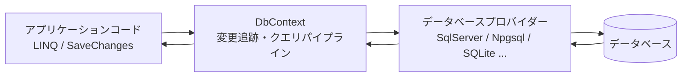
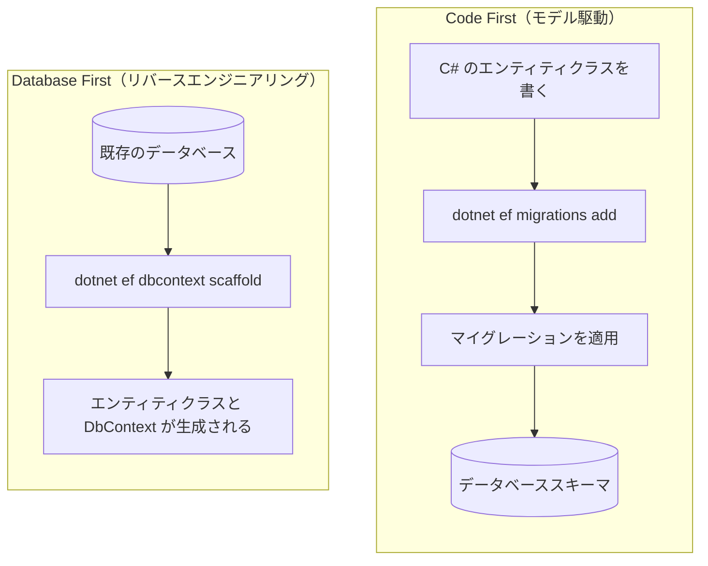
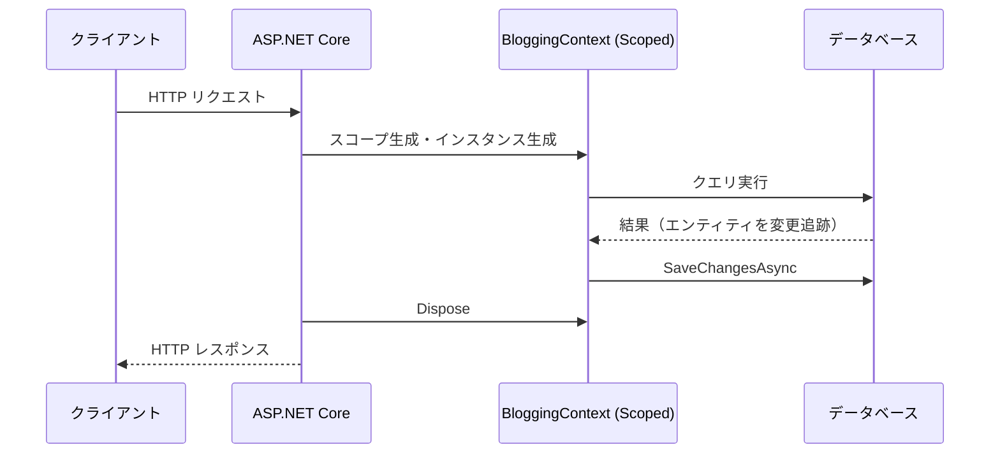
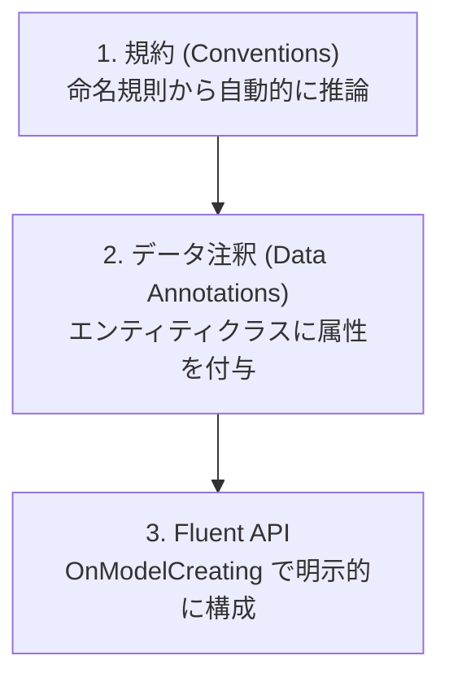
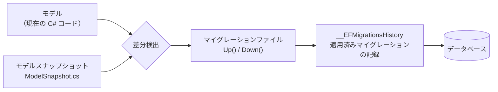
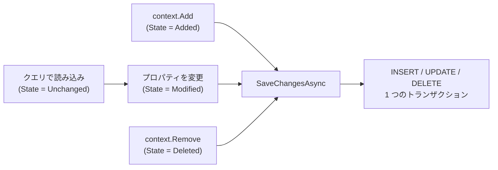
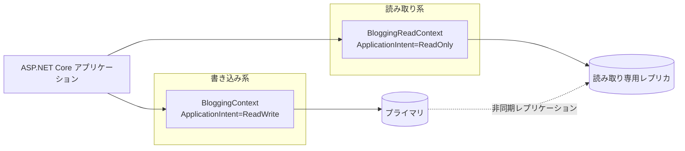
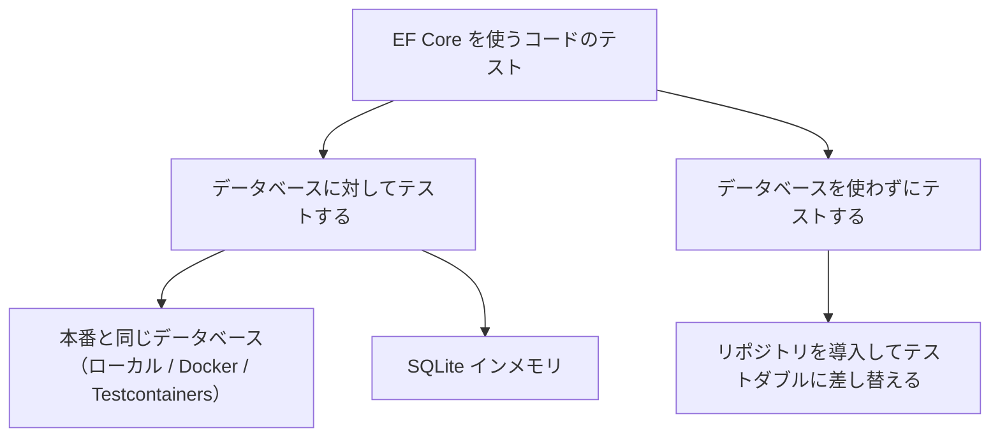
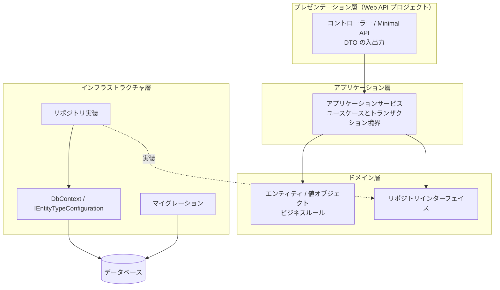

この章では、ASP.NET Core アプリケーションからリレーショナルデータベースにアクセスする標準的な方法である **Entity Framework Core (EF Core)** を扱います。モデルの定義からクエリ、更新、トランザクション、パフォーマンス最適化、そしてテスト戦略までを順に見ていきます。

DI コンテナーへの登録やライフタイムの考え方は [第6章：依存性注入 (DI)](../06-dependency-injection/index.md)、接続文字列の管理は [第5章：アプリ設定 (Configuration)](../05-configuration/index.md) を前提としています。

---

## 目次

1. [概要と設計方針](#1-概要と設計方針)
   - [EF Core とは](#ef-core-とは)
   - [O/R マッパーの位置づけ](#or-マッパーの位置づけ)
   - [データベースプロバイダーの選択](#データベースプロバイダーの選択)
   - [Code First と Database First](#code-first-と-database-first)
   - [パッケージの追加とツールの準備](#パッケージの追加とツールの準備)
2. [モデル定義と DbContext 設計](#2-モデル定義と-dbcontext-設計)
   - [エンティティクラスの定義](#エンティティクラスの定義)
   - [DbContext の定義](#dbcontext-の定義)
   - [DI への登録と接続文字列](#di-への登録と接続文字列)
   - [DbContext のライフタイムとスレッド安全性](#dbcontext-のライフタイムとスレッド安全性)
   - [規約・データ注釈・Fluent API](#規約データ注釈fluent-api)
   - [IEntityTypeConfiguration による構成の分割](#ientitytypeconfiguration-による構成の分割)
   - [リレーションシップの定義](#リレーションシップの定義)
   - [値の変換・所有型・複合型](#値の変換所有型複合型)
   - [グローバルクエリフィルターと名前付きクエリフィルター](#グローバルクエリフィルターと名前付きクエリフィルター)
3. [マイグレーションとスキーマ管理](#3-マイグレーションとスキーマ管理)
   - [マイグレーションの仕組み](#マイグレーションの仕組み)
   - [マイグレーションの作成と適用](#マイグレーションの作成と適用)
   - [生成されたマイグレーションを読む](#生成されたマイグレーションを読む)
   - [本番環境への適用戦略](#本番環境への適用戦略)
   - [SQL スクリプトとマイグレーションバンドル](#sql-スクリプトとマイグレーションバンドル)
   - [起動時マイグレーションの是非](#起動時マイグレーションの是非)
   - [初期データの投入（シード）](#初期データの投入シード)
   - [設計時 DbContext ファクトリ](#設計時-dbcontext-ファクトリ)
4. [クエリ操作と LINQ](#4-クエリ操作と-linq)
   - [基本的なクエリ](#基本的なクエリ)
   - [クエリはいつ実行されるか](#クエリはいつ実行されるか)
   - [変更追跡と AsNoTracking](#変更追跡と-asnotracking)
   - [関連データの読み込み](#関連データの読み込み)
   - [遅延読み込みと N+1 問題](#遅延読み込みと-n1-問題)
   - [単一クエリと分割クエリ](#単一クエリと分割クエリ)
   - [投影 (Projection) による最適化](#投影-projection-による最適化)
   - [ページング](#ページング)
   - [LeftJoin / RightJoin 演算子](#leftjoin--rightjoin-演算子)
   - [生の SQL を使う](#生の-sql-を使う)
5. [更新／変更操作とトランザクション](#5-更新変更操作とトランザクション)
   - [追加・更新・削除の基本](#追加更新削除の基本)
   - [SaveChanges の既定のトランザクション動作](#savechanges-の既定のトランザクション動作)
   - [明示的なトランザクション制御](#明示的なトランザクション制御)
   - [セーブポイント](#セーブポイント)
   - [一括更新・一括削除](#一括更新一括削除)
   - [楽観的同時実行制御](#楽観的同時実行制御)
   - [接続の回復性とトランザクションの併用](#接続の回復性とトランザクションの併用)
6. [パフォーマンス最適化](#6-パフォーマンス最適化)
   - [まず計測する](#まず計測する)
   - [インデックスを正しく張る](#インデックスを正しく張る)
   - [DbContext プーリング](#dbcontext-プーリング)
   - [コレクションのパラメーター化と IN 句の翻訳](#コレクションのパラメーター化と-in-句の翻訳)
   - [コンパイル済みクエリ](#コンパイル済みクエリ)
   - [コンパイル済みモデル](#コンパイル済みモデル)
   - [バッファリングとストリーミング](#バッファリングとストリーミング)
   - [非同期 API を使う](#非同期-api-を使う)
   - [ログとセキュリティ](#ログとセキュリティ)
7. [読み取り専用レプリカ (Read-Only Replica) の扱い](#7-読み取り専用レプリカ-read-only-replica-の扱い)
   - [読み取りスケールアウトの仕組み](#読み取りスケールアウトの仕組み)
   - [データ整合性と遅延の制約](#データ整合性と遅延の制約)
   - [EF Core 側での読み書き分離](#ef-core-側での読み書き分離)
   - [読み取り専用 DbContext の設計](#読み取り専用-dbcontext-の設計)
   - [どのクエリをレプリカに流すか](#どのクエリをレプリカに流すか)
8. [テスト戦略とアーキテクチャ例](#8-テスト戦略とアーキテクチャ例)
   - [テスト戦略の選択](#テスト戦略の選択)
   - [InMemory プロバイダーが推奨されない理由](#inmemory-プロバイダーが推奨されない理由)
   - [実データベースに対するテスト](#実データベースに対するテスト)
   - [SQLite インメモリを使ったテスト](#sqlite-インメモリを使ったテスト)
   - [リポジトリパターンとモック](#リポジトリパターンとモック)
   - [WebApplicationFactory を使った統合テスト](#webapplicationfactory-を使った統合テスト)
   - [アーキテクチャ例：レイヤー構成のまとめ](#アーキテクチャ例レイヤー構成のまとめ)
9. [参考ドキュメント](#9-参考ドキュメント)

---

## 1. 概要と設計方針

### EF Core とは

Entity Framework Core (EF Core) は、.NET 向けの軽量かつ拡張可能なオープンソースの **O/R マッパー (Object-Relational Mapper)** です。データベースのテーブルを C# のクラス（エンティティ）にマッピングし、SQL を直接書く代わりに LINQ でクエリを表現できます。

EF Core は大きく次の 3 つの役割を担います。

| 役割 | 内容 |
| --- | --- |
| クエリの変換 | LINQ 式ツリーを解析し、プロバイダーごとの SQL に変換して実行する |
| 変更追跡 (Change Tracking) | 読み込んだエンティティの変更を記録し、`SaveChanges` で INSERT / UPDATE / DELETE に変換する |
| スキーマ管理 | モデルの差分からマイグレーションを生成し、データベーススキーマを更新する |



本章では .NET 10 / EF Core 10 を前提とします。EF Core のバージョンは .NET のバージョンに追随しており、EF Core 10 は .NET 10 と同じく LTS (Long Term Support) リリースです。

### O/R マッパーの位置づけ

.NET でデータベースにアクセスする手段は EF Core だけではありません。用途に応じて選択します。

| 手段 | 特徴 | 向いている場面 |
| --- | --- | --- |
| EF Core | LINQ、変更追跡、マイグレーションを備えたフル機能の O/R マッパー | 一般的な業務アプリケーション。読み書き両方を扱う |
| Dapper などのマイクロ O/R マッパー | SQL を自分で書き、結果をオブジェクトにマッピングするだけ | SQL を完全に制御したい、複雑な集計クエリ |
| ADO.NET (`DbConnection` / `DbCommand`) | 最も低レベルな API | 特殊な最適化や、プロバイダー固有の機能を直接使う場合 |

EF Core でも後述する `FromSql` によって生の SQL を書けるため、「基本は EF Core、一部のクエリだけ SQL を直接書く」という組み合わせが現実的な選択になります。

> [!NOTE]
> 他言語の O/R マッパーと比較すると、EF Core は **Java の Spring Data JPA / Hibernate** に最も近い位置づけです。エンティティクラスの定義、変更追跡（Hibernate の永続化コンテキストに相当）、スキーマ生成といった考え方が共通しています。**Python の Django ORM** はモデルクラスとマイグレーションを備える点が似ていますが、Django ORM がモデルクラス自身にクエリ API を持たせる (`Blog.objects.filter(...)`) のに対し、EF Core は `DbContext` を経由します。**TypeScript の NestJS** では TypeORM や Prisma、**PHP の Laravel** では Eloquent、**Go の Gin / Echo** では GORM が同種の役割を担います。

### データベースプロバイダーの選択

EF Core 自体はデータベースに依存せず、**プロバイダー** と呼ばれる NuGet パッケージを追加することで各データベースに対応します。

| データベース | パッケージ | 提供元 |
| --- | --- | --- |
| SQL Server / Azure SQL | `Microsoft.EntityFrameworkCore.SqlServer` | Microsoft |
| SQLite | `Microsoft.EntityFrameworkCore.Sqlite` | Microsoft |
| Azure Cosmos DB for NoSQL | `Microsoft.EntityFrameworkCore.Cosmos` | Microsoft |
| PostgreSQL | `Npgsql.EntityFrameworkCore.PostgreSQL` | Npgsql 開発チーム |
| MySQL | `Pomelo.EntityFrameworkCore.MySql` | Pomelo プロジェクト |

> [!IMPORTANT]
> 1 つの `DbContext` インスタンスに設定できるプロバイダーは 1 つだけです。同じ `DbContext` の型を別々のインスタンスで異なるプロバイダーに接続することは可能ですが、単一のインスタンスが複数のプロバイダーを使うことはできません。

### Code First と Database First

EF Core でモデルとデータベースを対応づけるアプローチは 2 つあります。



| アプローチ | 使いどころ |
| --- | --- |
| Code First | 新規開発。スキーマの変更履歴をソース管理に残せる |
| Database First | 既存データベースがある場合や、DBA がスキーマを管理している場合 |

本章では Code First を中心に説明します。Database First の場合は次のコマンドでエンティティと `DbContext` を生成します。

```bash
dotnet ef dbcontext scaffold "Server=(localdb)\mssqllocaldb;Database=Blogging;Trusted_Connection=True" Microsoft.EntityFrameworkCore.SqlServer --output-dir Models
```

### パッケージの追加とツールの準備

Web API プロジェクトに SQL Server プロバイダーを追加します。

```bash
dotnet add package Microsoft.EntityFrameworkCore.SqlServer
dotnet add package Microsoft.EntityFrameworkCore.Design
```

`Microsoft.EntityFrameworkCore.Design` は、マイグレーションの生成やスキャフォールディングといった **設計時 (design-time)** の操作に必要です。実行時には不要ですが、`dotnet ef` コマンドを使うプロジェクトには追加しておきます。

続いて EF Core のコマンドラインツールをインストールします。

```bash
dotnet tool install --global dotnet-ef
```

すでにインストール済みの場合は更新します。

```bash
dotnet tool update --global dotnet-ef
```

インストールを確認します。

```bash
dotnet ef --version
```

> [!TIP]
> チーム開発では、グローバルツールの代わりに **ローカルツール** としてリポジトリに固定すると、開発者間でバージョンを揃えられます。`dotnet new tool-manifest` を実行してから `dotnet tool install dotnet-ef` を実行すると、`.config/dotnet-tools.json` にバージョンが記録され、`dotnet tool restore` で復元できます。

<details>
<summary>Visual Studio のパッケージマネージャーコンソールを使う場合</summary>

Visual Studio では、`Microsoft.EntityFrameworkCore.Tools` パッケージを追加すると、パッケージマネージャーコンソールから PowerShell コマンドを使用できます。

```powershell
Install-Package Microsoft.EntityFrameworkCore.Tools
```

以降、本章で紹介する `dotnet ef` コマンドは、次のように読み替えられます。

| .NET CLI | パッケージマネージャーコンソール |
| --- | --- |
| `dotnet ef migrations add <Name>` | `Add-Migration <Name>` |
| `dotnet ef database update` | `Update-Database` |
| `dotnet ef migrations script` | `Script-Migration` |
| `dotnet ef migrations remove` | `Remove-Migration` |

</details>

---

## 2. モデル定義と DbContext 設計

### エンティティクラスの定義

エンティティは特別な基底クラスを継承しない、単なる C# クラス（POCO: Plain Old CLR Object）として定義します。ブログと投稿という典型的な 1 対多の関係を例にします。

```csharp
namespace BloggingApi.Models;

public class Blog
{
    public int Id { get; set; }
    public required string Name { get; set; }
    public required string Url { get; set; }
    public int Rating { get; set; }
    public DateTimeOffset CreatedAt { get; set; }

    // ナビゲーションプロパティ（1 対多の「多」側）
    public List<Post> Posts { get; set; } = [];
    public List<Contributor> Contributors { get; set; } = [];
}

public class Post
{
    public int Id { get; set; }
    public required string Title { get; set; }
    public string? Content { get; set; }
    public DateTimeOffset PublishedAt { get; set; }

    // 外部キー
    public int BlogId { get; set; }

    // ナビゲーションプロパティ（1 対多の「1」側）
    public Blog? Blog { get; set; }
}

public class Contributor
{
    public int Id { get; set; }
    public required string DisplayName { get; set; }

    public int BlogId { get; set; }
    public Blog? Blog { get; set; }
}
```

ここで使っている C# の機能を整理します。

| 機能 | 意味 |
| --- | --- |
| `required` 修飾子 | オブジェクト初期化時に値の設定を必須にする。EF Core では非 null の必須列としてマッピングされる |
| `string?` | null 許容参照型。EF Core はこれを NULL 許容列としてマッピングする |
| `= []` | コレクション式による空のリストの初期化 |

> [!IMPORTANT]
> プロジェクトで **null 許容参照型 (Nullable Reference Types)** が有効（`<Nullable>enable</Nullable>`。.NET 6 以降のテンプレートでは既定）になっていると、EF Core は `string` を NOT NULL 列、`string?` を NULL 許容列として扱います。意図しない NOT NULL 制約を避けるため、null を許す列は必ず `?` を付けます。

> [!TIP]
> **コード分析ルールとの衝突について。** プロジェクトで `<AnalysisLevel>latest-all</AnalysisLevel>` のように厳しいコード分析を有効にすると、上のエンティティ定義に対して次のような警告が出ます（実測で確認）。
>
> | ルール | 内容 |
> | --- | --- |
> | `CA1002` | `List<Post>` ではなく `Collection<T>` を公開すべき |
> | `CA2227` | コレクションプロパティのセッターを削除して読み取り専用にすべき |
> | `CA1056` | `Url` プロパティは `string` ではなく `Uri` にすべき |
>
> これらは汎用のライブラリ設計を想定したルールであり、**EF Core のエンティティには当てはまりません。** EF Core はコレクションナビゲーションの設定やリレーションシップの修正のためにセッターを利用しますし、`Uri` 型は標準では列にマッピングされません。エンティティを置いたフォルダーに対して、`.editorconfig` でこれらのルールを無効化するのが実務上の対応です。
>
> ```ini
> # プロジェクト直下の Models フォルダーを対象にする場合
> [Models/*.cs]
> dotnet_diagnostic.CA1002.severity = none
> dotnet_diagnostic.CA2227.severity = none
> dotnet_diagnostic.CA1056.severity = none
> ```
>
> パスは **`.editorconfig` を置いた場所からの相対パス** で解釈されます。`Models` がプロジェクト直下にあるとき、`[**/Models/*.cs]` と書くと**マッチせず抑制されません**（実測で確認）。意図したファイルに効いているかどうかは、ビルドして警告が消えることで必ず確かめてください。

### DbContext の定義

`DbContext` は、エンティティのセット（`DbSet<T>`）を公開し、クエリと保存の起点となるクラスです。

```csharp
using Microsoft.EntityFrameworkCore;
using BloggingApi.Models;

namespace BloggingApi.Data;

public class BloggingContext : DbContext
{
    public BloggingContext(DbContextOptions<BloggingContext> options)
        : base(options)
    {
    }

    public DbSet<Blog> Blogs => Set<Blog>();
    public DbSet<Post> Posts => Set<Post>();

    protected override void OnModelCreating(ModelBuilder modelBuilder)
    {
        // ここでモデルの詳細を構成する（後述）
    }
}
```

> [!TIP]
> `public DbSet<Blog> Blogs { get; set; }` と書く例も多く見られますが、`=> Set<Blog>()` の式形式にしておくと、null 許容参照型が有効な環境で「初期化されていない」という警告を避けられます。動作はどちらも同じです。

`DbContextOptions<BloggingContext>` を受け取るコンストラクターは、DI から構成を受け取るために必要です。

### DI への登録と接続文字列

`Program.cs` で `AddDbContext` を呼び出して DI コンテナーに登録します。

```csharp
using Microsoft.EntityFrameworkCore;
using BloggingApi.Data;

var builder = WebApplication.CreateBuilder(args);

var connectionString = builder.Configuration.GetConnectionString("BloggingDatabase")
    ?? throw new InvalidOperationException("接続文字列 'BloggingDatabase' が見つかりません。");

builder.Services.AddDbContext<BloggingContext>(options =>
    options.UseSqlServer(connectionString));

builder.Services.AddControllers();

var app = builder.Build();

app.MapControllers();

app.Run();
```

接続文字列は `appsettings.json` の `ConnectionStrings` セクションに置きます。

```json
{
  "ConnectionStrings": {
    "BloggingDatabase": "Server=(localdb)\\mssqllocaldb;Database=Blogging;Trusted_Connection=True;MultipleActiveResultSets=true"
  }
}
```

> [!WARNING]
> 本番環境の接続文字列に ID とパスワードを直接書かないでください。ローカル開発ではユーザーシークレット、本番環境では環境変数や Azure Key Vault、あるいは Microsoft Entra ID によるパスワードレス認証を使います。構成プロバイダーの優先順位とシークレット管理については [第5章：アプリ設定 (Configuration)](../05-configuration/index.md) を参照してください。

登録した `DbContext` は、コントローラーやサービスにコンストラクターインジェクションで注入します。

```csharp
using Microsoft.AspNetCore.Mvc;
using Microsoft.EntityFrameworkCore;
using BloggingApi.Data;
using BloggingApi.Models;

namespace BloggingApi.Controllers;

[ApiController]
[Route("api/[controller]")]
public class BlogsController(BloggingContext context) : ControllerBase
{
    [HttpGet]
    public async Task<ActionResult<IEnumerable<Blog>>> GetBlogs(CancellationToken cancellationToken)
        => await context.Blogs.AsNoTracking().ToListAsync(cancellationToken);
}
```

> [!TIP]
> 上記は C# 12 の **プライマリコンストラクター** を使った書き方です。フィールドへの代入を書かずに `context` をメソッド内で参照できます。詳細は [第6章：プライマリコンストラクターによる注入（C# 12）](../06-dependency-injection/index.md#プライマリコンストラクターによる注入c-12) を参照してください。

#### EF Core 10 は接続文字列に Application Name を追加する

EF Core 10 からは、接続文字列に `Application Name` が指定されていない場合、EF Core が自身と SqlClient のバージョン情報を含む値を **自動的に追加** します。実際に SQL Server プロバイダーで確認すると、次のように書き換えられます。

```text
渡した接続文字列   : Server=localhost;Database=Test;Trusted_Connection=True;TrustServerCertificate=True
EF Core が使う文字列: Data Source=localhost;Initial Catalog=Test;Integrated Security=True;
                     Trust Server Certificate=True;Application Name="EFCore/10.0.11 (macOS 26.6.2 Arm64)"
```

ほとんどの場合は影響しませんが、**同じデータベースに EF Core と Dapper や ADO.NET などを併用している場合は注意が必要です。** SqlClient は接続文字列が異なると別の接続プールを使うため、両者が別々のプールに分かれます。この状態で `TransactionScope` を使うと、SqlClient が 2 つの異なるデータベースとみなして、これまで不要だった **分散トランザクションへの昇格** が発生することがあります。

回避するには、接続文字列に `Application Name` を明示的に指定します。一度指定すると EF Core は上書きせず、渡した接続文字列がそのまま使われます（実測で確認済み）。

```json
{
  "ConnectionStrings": {
    "BloggingDatabase": "Server=...;Database=Blogging;Trusted_Connection=True;Application Name=BloggingApi"
  }
}
```

### DbContext のライフタイムとスレッド安全性

`AddDbContext` は `DbContext` を **Scoped** サービスとして登録します。ASP.NET Core では 1 つの HTTP リクエストが 1 つのスコープに対応するため、リクエストごとに `DbContext` インスタンスが作られ、リクエスト終了時に破棄されます。

> [!IMPORTANT]
> Scoped であることの帰結として、**`DbContext` を Singleton サービスのコンストラクターで受け取ることはできません。** そうすると、アプリケーションの起動時に次の例外が発生します（開発環境ではスコープの検証が既定で有効になっているため、リクエストを受ける前に検出されます）。
>
> ```text
> System.InvalidOperationException: Cannot consume scoped service
> 'Microsoft.EntityFrameworkCore.DbContextOptions`1[BloggingContext]'
> from singleton 'MyBackgroundService'.
> ```
>
> この状況の解決策は後述の `IServiceScopeFactory` か `IDbContextFactory<T>` です。なお、`AddDbContext` でプロバイダー（`UseSqlServer` など）の指定を忘れた場合は、解決時に別の例外になります。
>
> ```text
> System.InvalidOperationException: No database provider has been configured for this DbContext.
> ```



`DbContext` は 1 つの **作業単位 (unit-of-work)** を表すよう設計されており、公式ドキュメントは次の点を明記しています。

- `DbContext` は **スレッドセーフではない**。複数のスレッドで同じインスタンスを共有してはいけない
- 非同期メソッドは必ず `await` してから、次の操作でインスタンスを使う
- EF Core が投げる `InvalidOperationException` はコンテキストを回復不能な状態にすることがあり、握りつぶして処理を続行してはいけない

> [!WARNING]
> `DbContext` は **スレッドセーフではありません。** 同じインスタンスに対して複数の操作を同時に実行すると、次の例外が発生します。
>
> ```text
> System.InvalidOperationException: A second operation was started on this context instance
> before a previous operation completed. This is usually caused by different threads
> concurrently using the same instance of DbContext.
> ```
>
> 並列にクエリを実行したい場合は、後述する `IDbContextFactory<T>` でインスタンスを分けます。

> [!WARNING]
> やっかいなのは、**この例外がいつも出るとは限らない**ことです。SQLite のように同期的な I/O を行うプロバイダーでは、`Task.WhenAll(context.Blogs.ToListAsync(), context.Posts.ToListAsync())` のような書き方をしても各クエリが順番に完了してしまい、例外が発生しないことがあります（実際に 20 回試行して 1 度も発生しませんでした）。一方、`Task.Run` で明確に別スレッドから実行すると確実に例外になります。
>
> つまり **SQLite を使った単体テストでは問題が表面化せず、本番の SQL Server で初めて落ちる**、ということが起こり得ます。「テストが通ったから安全」と考えず、1 つの `DbContext` インスタンスを複数の処理で共有しない設計を徹底してください。

Singleton サービスやバックグラウンドサービスから `DbContext` を使う場合は、`IServiceScopeFactory` でスコープを作るか、`IDbContextFactory<T>` を使います。

```csharp
builder.Services.AddDbContextFactory<BloggingContext>(options =>
    options.UseSqlServer(connectionString));
```

> [!IMPORTANT]
> `AddDbContextFactory` は、`IDbContextFactory<BloggingContext>` を **Singleton** として登録すると同時に、`BloggingContext` そのものも **Scoped** で登録します（実測で確認）。したがって、コントローラーで `BloggingContext` を直接受け取ることも、バックグラウンドサービスでファクトリーからインスタンスを作ることも、両方できます。ただし **ファクトリーで作ったインスタンスは DI コンテナーが破棄してくれない**ため、下の例のように `await using` で必ず自分で破棄してください。

```csharp
public class ReportGenerator(IDbContextFactory<BloggingContext> contextFactory)
{
    public async Task<int> CountBlogsAsync(CancellationToken cancellationToken)
    {
        // ファクトリで作成したインスタンスはアプリケーション側で破棄する
        await using var context = await contextFactory.CreateDbContextAsync(cancellationToken);
        return await context.Blogs.CountAsync(cancellationToken);
    }
}
```

> [!NOTE]
> **Spring Boot** の `EntityManager` は `@PersistenceContext` によって注入されますが、そのスコープはリクエスト単位ではなく **トランザクションスコープ** です（Jakarta Persistence の仕様が「特に指定しなければトランザクションスコープの永続化コンテキストが使われる」と定めています）。EF Core の `DbContext` は明示的に Scoped として登録され、`SaveChangesAsync` の呼び出しが保存の契機になる点が異なります。**Django** の ORM は 1 つのスレッドが 1 つの接続を保持する形で暗黙的に接続を管理しますが、EF Core はインスタンスの寿命を DI コンテナーが管理します。

### 規約・データ注釈・Fluent API

EF Core はモデルを 3 段階で構成します。優先順位は下にあるものほど強くなります。



| 段階 | 例 | 特徴 |
| --- | --- | --- |
| 規約 | `Id` または `<型名>Id` という名前のプロパティが主キーになる | 記述不要。既定の動作 |
| データ注釈 | `[MaxLength(200)]`、`[Required]` | エンティティクラスを見れば制約が分かる |
| Fluent API | `modelBuilder.Entity<Blog>().Property(b => b.Name).HasMaxLength(200)` | 最も表現力が高く、エンティティクラスを変更せずに構成できる |

データ注釈による例です。

```csharp
using System.ComponentModel.DataAnnotations;
using System.ComponentModel.DataAnnotations.Schema;

public class Blog
{
    public int Id { get; set; }

    [MaxLength(200)]
    public required string Name { get; set; }

    [MaxLength(2000)]
    public required string Url { get; set; }

    [Column(TypeName = "datetimeoffset(0)")]
    public DateTimeOffset CreatedAt { get; set; }
}
```

同じ構成を Fluent API で書くと次のようになります。

```csharp
protected override void OnModelCreating(ModelBuilder modelBuilder)
{
    modelBuilder.Entity<Blog>(entity =>
    {
        entity.ToTable("Blogs");
        entity.HasKey(b => b.Id);

        entity.Property(b => b.Name)
            .IsRequired()
            .HasMaxLength(200);

        entity.Property(b => b.Url)
            .IsRequired()
            .HasMaxLength(2000);

        entity.Property(b => b.CreatedAt)
            .HasColumnType("datetimeoffset(0)");

        entity.HasIndex(b => b.Url).IsUnique();
    });
}
```

> [!TIP]
> データ注釈は検証（`System.ComponentModel.DataAnnotations`）とマッピングの両方で使われる属性が混在しており、意味が重なって分かりにくくなることがあります。永続化に関する構成は Fluent API に寄せ、エンティティクラスをドメインモデルとして保つ設計が扱いやすくなります。

### IEntityTypeConfiguration による構成の分割

エンティティが増えると `OnModelCreating` が肥大化します。エンティティごとに `IEntityTypeConfiguration<T>` を実装したクラスへ切り出せます。

```csharp
using Microsoft.EntityFrameworkCore;
using Microsoft.EntityFrameworkCore.Metadata.Builders;
using BloggingApi.Models;

namespace BloggingApi.Data.Configurations;

public class BlogConfiguration : IEntityTypeConfiguration<Blog>
{
    public void Configure(EntityTypeBuilder<Blog> builder)
    {
        builder.ToTable("Blogs");
        builder.HasKey(b => b.Id);

        builder.Property(b => b.Name)
            .IsRequired()
            .HasMaxLength(200);

        builder.Property(b => b.Url)
            .IsRequired()
            .HasMaxLength(2000);

        builder.HasIndex(b => b.Url).IsUnique();

        builder.HasMany(b => b.Posts)
            .WithOne(p => p.Blog)
            .HasForeignKey(p => p.BlogId)
            .OnDelete(DeleteBehavior.Cascade);
    }
}
```

アセンブリ内のすべての構成クラスをまとめて適用します。

```csharp
protected override void OnModelCreating(ModelBuilder modelBuilder)
{
    modelBuilder.ApplyConfigurationsFromAssembly(typeof(BloggingContext).Assembly);
}
```

> [!NOTE]
> `ApplyConfigurationsFromAssembly` が適用する順序は未定義です。構成の適用順に依存する記述は避けてください。また、パラメーターなしのコンストラクターを持つ型だけがインスタンス化され、引数が必要な型はスキップされて `SkippedEntityTypeConfigurationWarning` がログに記録されます。そのような構成クラスは `ApplyConfiguration` に手動で渡します。

### リレーションシップの定義

EF Core は、ナビゲーションプロパティと外部キープロパティの命名規約からリレーションシップを推論します。明示的に指定する場合は Fluent API を使います。

| 関係 | Fluent API | 例 |
| --- | --- | --- |
| 1 対多 | `HasMany(...).WithOne(...)` | Blog 1 件に Post が複数 |
| 1 対 1 | `HasOne(...).WithOne(...)` | Blog 1 件に BlogImage が 1 件 |
| 多対多 | `HasMany(...).WithMany(...)` | Post と Tag |

多対多は結合エンティティを定義しなくても構成できます。

```csharp
public class Post
{
    public int Id { get; set; }
    public required string Title { get; set; }
    public List<Tag> Tags { get; set; } = [];
}

public class Tag
{
    public int Id { get; set; }
    public required string Name { get; set; }
    public List<Post> Posts { get; set; } = [];
}
```

```csharp
modelBuilder.Entity<Post>()
    .HasMany(p => p.Tags)
    .WithMany(t => t.Posts)
    .UsingEntity(join => join.ToTable("PostTags"));
```

削除時の動作は `OnDelete` で指定します。

| `DeleteBehavior` | 動作 |
| --- | --- |
| `Cascade` | 親を削除すると子も削除される |
| `Restrict` | 子が存在する場合、親の削除を拒否する |
| `SetNull` | 子の外部キーを NULL にする（外部キーが NULL 許容である必要がある） |
| `NoAction` | データベースに制約の判断を委ねる |

### 値の変換・所有型・複合型

列の型とプロパティの型が一致しない場合は **値の変換 (Value Conversion)** を使います。列挙型を文字列として保存する例です。

```csharp
public enum PostStatus
{
    Draft,
    Published,
    Archived
}

public class Post
{
    public int Id { get; set; }
    public required string Title { get; set; }
    public PostStatus Status { get; set; }

    // この章の後半（一括更新・一括削除、関連データの読み込み）で使う
    public DateTimeOffset CreatedAt { get; set; }
    public DateTimeOffset? ArchivedAt { get; set; }
    public List<Comment> Comments { get; set; } = [];
}

public class Comment
{
    public int Id { get; set; }
    public required string Body { get; set; }

    public int PostId { get; set; }
    public Post? Post { get; set; }

    public int AuthorId { get; set; }
    public Author? Author { get; set; }
}
```

> [!NOTE]
> 「エンティティクラスの定義」で示した `Post` に、`Status` と後続の節で使うプロパティを追加した形です。この章では、説明する内容に応じてエンティティへプロパティを足しながら進めます。

`IEntityTypeConfiguration<Post>` の `Configure` メソッド（引数名 `builder`）の中で、次のように構成します。

```csharp
builder.Property(p => p.Status)
    .HasConversion<string>()
    .HasMaxLength(20);
```

これにより `Status` 列は `int` ではなく `"Draft"` のような文字列として保存され、SQL を直接見たときにも意味が分かるようになります。

エンティティの一部を別のテーブルや別の型として切り出したい場合は **所有型 (Owned Entity Type)** を使います。所有型は独自の主キーを持たず、常に所有側のエンティティを通じてのみアクセスされます。

```csharp
modelBuilder.Entity<Author>()
    .OwnsOne(a => a.Address);
```

住所のように、それ自体は識別子を持たず、親エンティティのテーブルに展開したい値の集まりには **複合型 (Complex Type)** を使います。

```csharp
public class Address
{
    public required string PostalCode { get; set; }
    public required string Prefecture { get; set; }
    public required string Line1 { get; set; }
}

public class Author
{
    public int Id { get; set; }
    public required string Name { get; set; }
    public required Address Address { get; set; }
}
```

```csharp
modelBuilder.Entity<Author>()
    .ComplexProperty(a => a.Address);
```

これにより `Authors` テーブルに `Address_PostalCode`、`Address_Prefecture`、`Address_Line1` という列が作られます。

> [!NOTE]
> EF Core 10 では複合型のサポートが大きく拡張され、`struct` や `record struct` を複合型として使えるようになったほか、JSON 列へのマッピングやテーブル分割にも対応しました。所有型と複合型はどちらも「エンティティの一部を別の型に切り出す」ものですが、所有型は内部的に独立したエンティティ型として扱われる（隠しキーを持つ）のに対し、複合型は識別子を持たない純粋な値です。**公式ドキュメントは、値としてのセマンティクスが欲しい用途ではすでに所有型を使っている場合も複合型への移行を推奨しています。**

#### EF Core 10 の JSON 列は `json` 型になる（Azure SQL の破壊的変更）

`OwnsMany(...).ToJson()` のように所有型を JSON として保存する場合や、`string[]` のようなプリミティブコレクションを保存する場合、EF Core 9 までの SQL Server プロバイダーはこれを `nvarchar(max)` 列に格納していました。

EF Core 10 では、`UseAzureSql` を使っているか、**互換性レベル 170 以上**を構成している場合に限り、SQL Server の新しい `json` データ型にマッピングされます。

```sql
-- EF Core 9 まで
[Tags] nvarchar(max)

-- EF Core 10（UseAzureSql または互換性レベル 170 以上）
[Tags] json
```

> [!WARNING]
> **既存のテーブルがある状態で `UseAzureSql` を使って EF Core 10 にアップグレードすると、既存の `nvarchar(max)` の JSON 列をすべて `json` に変更するマイグレーションが生成されます。** 公式ドキュメントはこの変更操作自体は問題なく適用できるとしていますが、データベースに対する小さくない変更である点に注意してください。
>
> また、`json` 型には `nvarchar(max)` との**動作の違い**があります。たとえば SQL Server は JSON 配列に対する `DISTINCT` 演算子をサポートしていないため、それを行おうとするクエリは失敗します。
>
> 従来どおり `nvarchar(max)` を使いたい場合は、`UseAzureSql` ではなく `UseSqlServer` を使うか、次のように互換性レベルを明示的に 170 未満に構成します。
>
> ```csharp
> options.UseSqlServer(connectionString, o => o.UseCompatibilityLevel(160));
> ```

### グローバルクエリフィルターと名前付きクエリフィルター

論理削除（ソフトデリート）やマルチテナントのように、「すべてのクエリに自動的に適用したい条件」はグローバルクエリフィルターで表現します。

```csharp
public class Blog
{
    public int Id { get; set; }
    public required string Name { get; set; }
    public bool IsDeleted { get; set; }
    public int TenantId { get; set; }
}
```

```csharp
modelBuilder.Entity<Blog>().HasQueryFilter(b => !b.IsDeleted);
```

これ以降、`context.Blogs` に対するクエリはすべて `WHERE [b].[IsDeleted] = CAST(0 AS bit)` が自動的に付与されます。フィルターを無効にしたい特定のクエリでは `IgnoreQueryFilters()` を呼びます。

EF Core 10 では **名前付きクエリフィルター (Named Query Filters)** が導入され、1 つのエンティティ型に複数のフィルターを設定して個別に無効化できるようになりました。

```csharp
modelBuilder.Entity<Blog>()
    .HasQueryFilter("SoftDeletionFilter", b => !b.IsDeleted)
    .HasQueryFilter("TenantFilter", b => b.TenantId == tenantId);
```

```csharp
// 論理削除のフィルターだけを無効化し、テナントのフィルターは維持する
var allBlogs = await context.Blogs
    .IgnoreQueryFilters(["SoftDeletionFilter"])
    .ToListAsync(cancellationToken);
```

`DbSet.Remove` を呼んだときに実際の削除ではなく `IsDeleted` を立てたい場合は、`SaveChangesAsync` をオーバーライドします。

```csharp
public override async Task<int> SaveChangesAsync(CancellationToken cancellationToken = default)
{
    ChangeTracker.DetectChanges();

    foreach (var entry in ChangeTracker.Entries<Blog>().Where(e => e.State == EntityState.Deleted))
    {
        entry.State = EntityState.Modified;
        entry.CurrentValues[nameof(Blog.IsDeleted)] = true;
    }

    return await base.SaveChangesAsync(cancellationToken);
}
```

> [!WARNING]
> クエリフィルターを設定したエンティティが、必須のリレーションシップ（外部キーが NULL を許さない関係）の「1」側になっている場合、EF Core はモデル検証時に次の警告を出します。
>
> ```text
> Entity 'Blog' has a global query filter defined and is the required end of a relationship
> with the entity 'Post'. This may lead to unexpected results when the required entity is
> filtered out.
> ```
>
> 親 (`Blog`) がフィルターで除外されているのに子 (`Post`) が除外されないと、`Post` を起点にしたクエリで親が読み込めず、予期しない結果になります。ナビゲーションを省略可能にするか、関係する両方のエンティティに対応するフィルターを定義してください。

> [!NOTE]
> **Django** の `Manager` によるデフォルトクエリセットの絞り込みや、**Laravel** の Eloquent におけるグローバルスコープが同種の機能に相当します。**Hibernate** では、常に適用される静的な制約が `@SQLRestriction`（`@Where` は Hibernate 6.3 で非推奨になりました）、セッション単位で有効・無効を切り替えられる動的なフィルターが `@FilterDef` / `@Filter` と、2 つの仕組みに分かれています。EF Core 10 の名前付きフィルターは、後者の `@FilterDef` / `@Filter` に近い粒度の制御を提供します。

---

## 3. マイグレーションとスキーマ管理

### マイグレーションの仕組み

マイグレーションは、C# のモデルとデータベーススキーマを同期させる仕組みです。



EF Core は、現在のモデルと直前のマイグレーションが保持する **モデルスナップショット** を比較して差分を検出し、マイグレーションのソースファイルを生成します。適用済みのマイグレーションは `__EFMigrationsHistory` テーブルに記録されるため、次回は未適用のものだけが適用されます。

### マイグレーションの作成と適用

最初のマイグレーションを作成します。

```bash
dotnet ef migrations add InitialCreate
```

プロジェクトに `Migrations` フォルダーが作成され、マイグレーションのソースファイルとモデルスナップショットが生成されます。これらはソース管理にコミットします。

データベースに適用します。

```bash
dotnet ef database update
```

モデルを変更したら、変更内容が分かる名前でマイグレーションを追加します。

```bash
dotnet ef migrations add AddPostPublishedAt
dotnet ef database update
```

よく使うコマンドを整理します。

| コマンド | 用途 |
| --- | --- |
| `dotnet ef migrations add <Name>` | マイグレーションを追加する |
| `dotnet ef migrations remove` | 未適用の最新マイグレーションを取り消す |
| `dotnet ef migrations list` | マイグレーションの一覧と適用状況を表示する |
| `dotnet ef database update` | 最新まで適用する |
| `dotnet ef database update <Name>` | 指定したマイグレーションの状態まで進める／戻す |
| `dotnet ef migrations script` | SQL スクリプトを生成する |
| `dotnet ef migrations bundle` | マイグレーションバンドル（実行可能ファイル）を生成する |

> [!WARNING]
> すでに本番データベースへ適用したマイグレーションを `dotnet ef migrations remove` で削除してはいけません。適用済みの変更を取り消したい場合は、`dotnet ef database update <1 つ前のマイグレーション名>` でロールバックしてから削除するか、打ち消す新しいマイグレーションを追加します。

> [!IMPORTANT]
> EF Core 10 では、プロジェクトが `<TargetFramework>` ではなく **`<TargetFrameworks>`（複数形）で複数のフレームワークを対象にしている場合、`--framework` オプションの指定が必須** になりました。指定しないと `dotnet ef` は次のエラーで停止します（実測で確認済み）。
>
> ```text
> The project targets multiple frameworks. Use the --framework option to specify which target framework to use.
> ```
>
> ライブラリープロジェクトに `DbContext` を置いていて複数ターゲットにしている場合など、EF Core 9 から移行すると CI が突然失敗します。次のようにフレームワークを明示してください。
>
> ```bash
> dotnet ef migrations add AddPostPublishedAt --framework net10.0
> dotnet ef database update --framework net10.0
> ```

### 生成されたマイグレーションを読む

生成されるマイグレーションは通常の C# コードです。内容を確認し、必要なら手を入れられます。

```csharp
public partial class AddPostPublishedAt : Migration
{
    protected override void Up(MigrationBuilder migrationBuilder)
    {
        migrationBuilder.AddColumn<DateTimeOffset>(
            name: "PublishedAt",
            table: "Posts",
            type: "datetimeoffset",
            nullable: false,
            defaultValue: new DateTimeOffset(2026, 1, 1, 0, 0, 0, TimeSpan.Zero));

        migrationBuilder.CreateIndex(
            name: "IX_Posts_PublishedAt",
            table: "Posts",
            column: "PublishedAt");
    }

    protected override void Down(MigrationBuilder migrationBuilder)
    {
        migrationBuilder.DropIndex(name: "IX_Posts_PublishedAt", table: "Posts");
        migrationBuilder.DropColumn(name: "PublishedAt", table: "Posts");
    }
}
```

`Up` が適用時、`Down` がロールバック時の処理です。データの移行が必要な場合は `migrationBuilder.Sql("...")` で任意の SQL を挟めます。

```csharp
migrationBuilder.Sql("UPDATE [Posts] SET [PublishedAt] = [CreatedAt] WHERE [PublishedAt] IS NULL;");
```

> [!WARNING]
> プロパティ名を変更した場合、EF Core は「列の削除」と「列の追加」として差分を検出することがあります。そのまま適用するとデータが失われるため、生成されたマイグレーションを確認し、必要に応じて `migrationBuilder.RenameColumn(...)` に書き換えてください。公式ドキュメントも「どの適用方法を選ぶ場合でも、必ず生成されたマイグレーションを検査し、本番データベースに適用する前にテストすること」と明記しています。

### 本番環境への適用戦略

公式ドキュメントは、用途に応じて次の 4 つの戦略を挙げています。

| 戦略 | 推奨される用途 | 実行前に SQL を確認できるか | 実行時に SDK とソースが必要か |
| --- | --- | --- | --- |
| SQL スクリプト | DBA による承認・レビューが必要な運用 | できる | 不要 |
| マイグレーションバンドル | 自動デプロイ | できない | 不要 |
| EF コマンドラインツール | ローカル開発とテスト | できない | 必要 |
| 実行時マイグレーション | 起動時マイグレーションの制約を許容できるアプリケーション | できない | 不要 |

> [!IMPORTANT]
> スキーマを変更する権限は、デプロイ専用の ID に与えます。アプリケーションが実行時に使用する ID には、通常はデータの読み書きに必要な権限だけを与えるべきです。

### SQL スクリプトとマイグレーションバンドル

SQL スクリプトは、DBA によるレビューやアーカイブが必要な場合に適しています。

```bash
# 空のデータベースから最新までのスクリプトを生成
dotnet ef migrations script

# 冪等 (idempotent) なスクリプトをファイルに出力
dotnet ef migrations script --idempotent --output artifacts/migrations.sql

# 特定のマイグレーション間のスクリプトを生成
dotnet ef migrations script AddNewTables AddAuditTable
```

`--idempotent` を付けると、各マイグレーションが未適用かどうかを確認してから実行するスクリプトが生成されるため、現在の適用状況が分からないデータベースにも安全に流せます。

自動デプロイには **マイグレーションバンドル** が推奨されます。バンドルは CI で生成でき、実行時に .NET SDK も EF Core ツールもアプリケーションのソースコードも必要としない単一の実行可能ファイルです。

```bash
dotnet ef migrations bundle --self-contained --runtime linux-x64 --output efbundle
```

```bash
# デプロイ先で実行
./efbundle --connection "$CONNECTION_STRING"
```

> [!TIP]
> EF Core 9 以降、マイグレーションの実行はデータベース全体のロックで保護されます（SQL スクリプトによる適用は除く）。これにより、複数のインスタンスが同時にマイグレーションを試みても、実行は 1 つに直列化されます。

### 起動時マイグレーションの是非

アプリケーションの起動時にマイグレーションを適用することもできます。

```csharp
var app = builder.Build();

using (var scope = app.Services.CreateScope())
{
    var context = scope.ServiceProvider.GetRequiredService<BloggingContext>();
    await context.Database.MigrateAsync();
}

app.Run();
```

この方法は手軽ですが、公式ドキュメントは次のトレードオフを挙げています。

- アプリケーションがスキーマ変更のための昇格された権限を必要とする
- 生成される SQL を確認・修正する機会がない
- 問題が起きたときのロールバックが他の戦略ほど容易ではない
- 別のアプリケーションがデータベースにアクセスしている最中にマイグレーションが走ると、深刻な問題を引き起こす可能性がある

> [!WARNING]
> `MigrateAsync()` の前に `EnsureCreatedAsync()` を呼び出してはいけません。`EnsureCreatedAsync()` はマイグレーションを迂回してスキーマを作成するため、その後の `MigrateAsync()` が失敗します。`EnsureCreated` はテストやプロトタイプ専用と考えてください。

### 初期データの投入（シード）

マスターデータや動作確認用の初期データを投入する方法は 2 つあります。

1 つ目は `HasData` です。モデルの一部として宣言し、マイグレーションの中に `InsertData` として埋め込まれます。主キーを明示的に指定する必要があります。

```csharp
protected override void OnModelCreating(ModelBuilder modelBuilder)
{
    modelBuilder.Entity<Blog>().HasData(
        new Blog { Id = 1, Name = "既定のブログ", Url = "https://example.com" });
}
```

`HasData` はマイグレーションの差分計算に組み込まれるため、値を書き換えると次のマイグレーションで `UpdateData` が生成されます。一方で、実行時にしか決まらない値（現在時刻や外部 API から取得する値）は扱えません。

2 つ目は EF Core 9 で追加された `UseSeeding` / `UseAsyncSeeding` です。こちらは通常の `DbContext` 操作としてデータを投入するため、任意のロジックを書けます。`MigrateAsync()` や `EnsureCreatedAsync()` の実行時に呼び出されます。

```csharp
builder.Services.AddDbContext<BloggingContext>(options =>
    options.UseSqlServer(connectionString)
           .UseSeeding((context, _) =>
           {
               if (!context.Set<Blog>().Any(b => b.Name == "既定のブログ"))
               {
                   context.Set<Blog>().Add(new Blog { Name = "既定のブログ" });
                   context.SaveChanges();
               }
           })
           .UseAsyncSeeding(async (context, _, cancellationToken) =>
           {
               if (!await context.Set<Blog>().AnyAsync(b => b.Name == "既定のブログ", cancellationToken))
               {
                   context.Set<Blog>().Add(new Blog { Name = "既定のブログ" });
                   await context.SaveChangesAsync(cancellationToken);
               }
           }));
```

> [!WARNING]
> `UseSeeding` と `UseAsyncSeeding` は **両方を登録してください**。実際に SQLite で試したところ、`EnsureCreated()`（同期）では `UseSeeding` だけが呼ばれ、`EnsureCreatedAsync()`（非同期）では `UseAsyncSeeding` だけが呼ばれました。片方しか登録していないと、呼び出し側の API によってシードが実行されません。
>
> また、これらのデリゲートは毎回の実行で呼ばれる可能性があるため、上記のように **既に存在するかを確認してから追加** してください。この点は `HasData` と異なり、EF Core が重複を防いでくれません。

### 設計時 DbContext ファクトリ

`dotnet ef` コマンドは、設計時に `DbContext` のインスタンスを生成する必要があります。通常はアプリケーションの `Program.cs` からホストを構築して解決しますが、それが難しい構成（クラスライブラリーにマイグレーションを置く場合など）では `IDesignTimeDbContextFactory<T>` を実装します。

```csharp
using Microsoft.EntityFrameworkCore;
using Microsoft.EntityFrameworkCore.Design;

namespace BloggingApi.Data;

public class BloggingContextFactory : IDesignTimeDbContextFactory<BloggingContext>
{
    public BloggingContext CreateDbContext(string[] args)
    {
        var optionsBuilder = new DbContextOptionsBuilder<BloggingContext>();
        optionsBuilder.UseSqlServer(
            Environment.GetEnvironmentVariable("BLOGGING_CONNECTION")
                ?? @"Server=(localdb)\mssqllocaldb;Database=Blogging;Trusted_Connection=True");

        return new BloggingContext(optionsBuilder.Options);
    }
}
```

マイグレーションを別プロジェクトに置く場合は、コマンドで対象を指定します。

```bash
dotnet ef migrations add InitialCreate --project BloggingApi.Data --startup-project BloggingApi
```

> [!NOTE]
> **Spring Boot** では Flyway や Liquibase がマイグレーションを担い、SQL または XML/YAML でスキーマ変更を記述します。**Django** の `makemigrations` / `migrate` は、EF Core と同じく **モデルの差分を自動検出してマイグレーションファイルを生成する** 方式です。一方 **Laravel** の `php artisan make:migration` / `migrate` は、適用状況の管理とロールバックの仕組みこそ似ていますが、生成されるのは空のマイグレーションであり、`Schema` ファサードを使って変更内容を **自分で記述します**。モデルからの差分検出は行われません。

---

## 4. クエリ操作と LINQ

### 基本的なクエリ

EF Core では LINQ でクエリを記述します。式ツリーが解析され、プロバイダーが SQL に変換します。

```csharp
// すべての行を取得
var blogs = await context.Blogs.ToListAsync(cancellationToken);

// 条件で絞り込む
var dotnetBlogs = await context.Blogs
    .Where(b => b.Url.Contains("dotnet"))
    .OrderBy(b => b.Name)
    .ToListAsync(cancellationToken);

// 単一の行を取得（見つからなければ null）
var blog = await context.Blogs
    .FirstOrDefaultAsync(b => b.Id == id, cancellationToken);

// 主キーで取得（追跡中のインスタンスがあればデータベースに行かない）
var cached = await context.Blogs.FindAsync([id], cancellationToken);

// 集計
var count = await context.Posts.CountAsync(p => p.BlogId == id, cancellationToken);
```

非同期メソッドの対応表です。ASP.NET Core では、スレッドをブロックしないために必ず非同期版を使います。

| 同期 | 非同期 |
| --- | --- |
| `ToList()` | `ToListAsync()` |
| `First()` / `FirstOrDefault()` | `FirstAsync()` / `FirstOrDefaultAsync()` |
| `Single()` / `SingleOrDefault()` | `SingleAsync()` / `SingleOrDefaultAsync()` |
| `Count()` / `Any()` | `CountAsync()` / `AnyAsync()` |
| `SaveChanges()` | `SaveChangesAsync()` |

> [!TIP]
> 非同期メソッドには `CancellationToken` を渡してください。コントローラーのアクションメソッドや Minimal API のハンドラーは `CancellationToken` を引数に取れます。クライアントが接続を切ったときに、実行中のクエリを中断できます。

### クエリはいつ実行されるか

`IQueryable<T>` に対する `Where` や `OrderBy` はクエリを組み立てるだけで、データベースへのアクセスは発生しません。実際に実行されるのは次のタイミングです。

- `ToListAsync` / `ToArrayAsync` などで結果を実体化したとき
- `FirstAsync` / `SingleAsync` / `CountAsync` などのスカラー結果を返すメソッドを呼んだとき
- `foreach` / `await foreach` で列挙したとき

```csharp
// ここではまだ SQL は発行されない
IQueryable<Blog> query = context.Blogs.Where(b => b.Name.StartsWith("A"));

if (onlyRecent)
{
    query = query.Where(b => b.CreatedAt > DateTimeOffset.UtcNow.AddDays(-30));
}

// ここで初めて 1 回の SQL が実行される
var result = await query.ToListAsync(cancellationToken);
```

> [!WARNING]
> `ToListAsync()` を呼んだ後に `Where` を書くと、それは LINQ to Objects となり、**データベースからすべての行を取得してからメモリ上で絞り込む** ことになります。絞り込みは必ず実体化の前に行ってください。

### 変更追跡と AsNoTracking

既定では、クエリが返したエンティティは `DbContext` の **チェンジトラッカー** に登録されます。これによりプロパティを変更するだけで `SaveChangesAsync` が UPDATE を発行できますが、追跡そのものにコストがかかります。

読み取り専用のクエリでは `AsNoTracking()` を使います。

```csharp
var blogs = await context.Blogs
    .AsNoTracking()
    .Where(b => b.Url.Contains("dotnet"))
    .ToListAsync(cancellationToken);
```

公式のベンチマークでは、追跡ありのクエリに比べて追跡なしのクエリは実行時間・メモリ割り当ての両方で明確に有利な結果が示されています。ASP.NET Core の GET エンドポイントのように、取得した結果をそのまま返すだけの処理では、既定で `AsNoTracking()` を付けることを検討してください。

追跡を行わないと、同じ行が複数回結果に現れたときに別々のインスタンスが作られます。同一性を保ちたい場合は `AsNoTrackingWithIdentityResolution()` を使います。

```csharp
var posts = await context.Posts
    .AsNoTrackingWithIdentityResolution()
    .Include(p => p.Blog)
    .ToListAsync(cancellationToken);
```

`DbContext` 全体で既定の追跡動作を変えることもできます。

```csharp
builder.Services.AddDbContext<BloggingContext>(options =>
    options.UseSqlServer(connectionString)
           .UseQueryTrackingBehavior(QueryTrackingBehavior.NoTracking));
```

> [!NOTE]
> **Hibernate** の「デタッチ状態」や、`@Transactional(readOnly = true)` による読み取り専用セッションが近い考え方です。**Django** の `.values()` / `.only()`、**Prisma** の `select` も、必要なデータだけを取り出してオーバーヘッドを減らすという意味で目的が共通します。

### 関連データの読み込み

ナビゲーションプロパティを一緒に読み込むには `Include` を使います（イーガーロード）。

```csharp
var blogs = await context.Blogs
    .Include(b => b.Posts)
    .ToListAsync(cancellationToken);
```

さらに深い階層は `ThenInclude` でたどります。

```csharp
var blogs = await context.Blogs
    .Include(b => b.Posts)
        .ThenInclude(p => p.Comments)
            .ThenInclude(c => c.Author)
    .ToListAsync(cancellationToken);
```

読み込む関連データを絞り込む **フィルター付き Include** も使えます。

```csharp
var blogs = await context.Blogs
    .Include(b => b.Posts
        .Where(p => p.PublishedAt > DateTimeOffset.UtcNow.AddYears(-1))
        .OrderByDescending(p => p.PublishedAt)
        .Take(5))
    .ToListAsync(cancellationToken);
```

`Include` の中で使えるのは `Where`、`OrderBy`、`OrderByDescending`、`ThenBy`、`ThenByDescending`、`Skip`、`Take` です。

> [!IMPORTANT]
> フィルター付き Include は、追跡クエリの場合に注意が必要です。同じ `DbContext` インスタンス内で先に読み込まれた関連エンティティが残っていると、フィルターの結果と混ざることがあります。読み取り専用の用途では `AsNoTracking()` と組み合わせてください。

すでに読み込んだエンティティに対して、後から関連データを読み込む **明示的読み込み (Explicit Loading)** もあります。

```csharp
var blog = await context.Blogs.FirstAsync(b => b.Id == id, cancellationToken);

await context.Entry(blog)
    .Collection(b => b.Posts)
    .LoadAsync(cancellationToken);
```

### 遅延読み込みと N+1 問題

`Microsoft.EntityFrameworkCore.Proxies` パッケージと `UseLazyLoadingProxies()` を使うと、ナビゲーションプロパティに初めてアクセスしたタイミングで自動的にクエリが発行される **遅延読み込み (Lazy Loading)** を有効にできます。

しかし、これは典型的な **N+1 問題** を引き起こします。

```csharp
// 遅延読み込みが有効な場合の悪い例
var blogs = await context.Blogs.ToListAsync(cancellationToken); // 1 回のクエリ

foreach (var blog in blogs)
{
    // ループのたびにクエリが発行される（N 回）
    Console.WriteLine($"{blog.Name}: {blog.Posts.Count}");
}
```

ブログが 100 件あれば 101 回のデータベースアクセスが発生します。ネットワーク遅延が 1 ミリ秒でも、これだけで 100 ミリ秒が失われます。

> [!WARNING]
> EF Core の公式パフォーマンスガイダンスは、遅延読み込みが N+1 問題を非常に起こしやすいことを指摘し、Web アプリケーションでは遅延読み込みを避けることを推奨しています。必要な関連データは `Include` で明示的に読み込むか、後述する投影で必要な列だけを取得してください。

```csharp
// 良い例：1 回のクエリで必要なデータをまとめて取得する
var summaries = await context.Blogs
    .Select(b => new BlogSummary(b.Id, b.Name, b.Posts.Count))
    .ToListAsync(cancellationToken);
```

> [!NOTE]
> N+1 問題は O/R マッパー全般に共通する課題です。**Hibernate** では `JOIN FETCH` や `@BatchSize`、**Django** では `select_related()` / `prefetch_related()`、**Laravel** の Eloquent では `with()`、**Prisma** では `include` が、EF Core の `Include` に相当します。

### 単一クエリと分割クエリ

複数のコレクションナビゲーションを `Include` すると、EF Core は既定で 1 つの SQL に JOIN してまとめます。このとき、結果セットに同じ行が繰り返し現れる **カルテシアン爆発 (Cartesian Explosion)** が起こります。

```csharp
var blogs = await context.Blogs
    .Include(b => b.Posts)
    .Include(b => b.Contributors)
    .ToListAsync(cancellationToken);
```

Post が 10 件、Contributor が 10 件あるブログでは、JOIN の結果は 100 行になり、ブログの列がすべての行に重複して転送されます。

これを避けるには `AsSplitQuery()` を使い、コレクションごとに別々のクエリを発行させます。

```csharp
var blogs = await context.Blogs
    .Include(b => b.Posts)
    .Include(b => b.Contributors)
    .AsSplitQuery()
    .ToListAsync(cancellationToken);
```

アプリケーション全体の既定を分割クエリにすることもできます。

```csharp
builder.Services.AddDbContext<BloggingContext>(options =>
    options.UseSqlServer(connectionString,
        sqlOptions => sqlOptions.UseQuerySplittingBehavior(QuerySplittingBehavior.SplitQuery)));
```

個別のクエリで単一クエリに戻したい場合は `AsSingleQuery()` を呼びます。

| 観点 | 単一クエリ（既定） | 分割クエリ |
| --- | --- | --- |
| ラウンドトリップ数 | 1 回 | コレクションの数だけ増える |
| データ転送量 | 重複により増える可能性がある | 重複がない |
| 整合性 | 1 回のクエリなので一貫している | クエリ間で他のトランザクションによる変更が入り得る |

> [!WARNING]
> 分割クエリは既定では 1 つのトランザクションで実行されないため、クエリの合間に他のトランザクションがデータを変更すると、整合性のない結果になる可能性があります。整合性が重要な場合は明示的にトランザクションを開始するか、単一クエリを使ってください。なお 1 対 1 のナビゲーションは行が重複しないため、常に JOIN されます。

### 投影 (Projection) による最適化

エンティティ全体ではなく、必要な列だけを取得する **投影** は最も効果的な最適化の 1 つです。

```csharp
public record BlogSummary(int Id, string Name, int PostCount);

var summaries = await context.Blogs
    .Select(b => new BlogSummary(b.Id, b.Name, b.Posts.Count))
    .ToListAsync(cancellationToken);
```

生成される SQL は必要な列だけを SELECT し、`Posts` はサブクエリでカウントされます。エンティティ型ではないため変更追跡も行われません。

> [!TIP]
> API のレスポンスは、エンティティをそのまま返すのではなく DTO (Data Transfer Object) に投影するのが安全です。エンティティを直接返すと、内部の列や循環参照するナビゲーションプロパティが意図せず公開されてしまいます。

### ページング

一覧 API では必ず件数を制限します。単純な方法は `Skip` / `Take` による **オフセットページング** です。

```csharp
var page = await context.Posts
    .AsNoTracking()
    .OrderByDescending(p => p.PublishedAt)
    .ThenBy(p => p.Id)
    .Skip((pageNumber - 1) * pageSize)
    .Take(pageSize)
    .ToListAsync(cancellationToken);
```

オフセットページングは実装が簡単ですが、後方のページになるほどデータベースがスキップする行数が増え、性能が劣化します。また、ページの取得中に行が挿入・削除されると、同じ行が 2 度現れたり抜け落ちたりします。

大量データでは **キーセットページング (Keyset Pagination)** が推奨されます。前ページの最後の値を条件に使います。

```csharp
var page = await context.Posts
    .AsNoTracking()
    .OrderBy(p => p.Id)
    .Where(p => p.Id > lastSeenId)
    .Take(pageSize)
    .ToListAsync(cancellationToken);
```

| 方式 | 長所 | 短所 |
| --- | --- | --- |
| オフセット | 任意のページに直接ジャンプできる | 深いページで遅い。行の増減でずれる |
| キーセット | ページ位置に関係なく高速。ずれにくい | 「10 ページ目へ」のようなランダムアクセスができない |

> [!IMPORTANT]
> ページングでは、並び順が一意になるようにしてください。並び順が同値の行があると、ページ間で行の順序が不定になります。上の例のように、末尾に主キーを加えるのが確実です。

### LeftJoin / RightJoin 演算子

.NET 10 では LINQ に `LeftJoin` と `RightJoin` の演算子が追加され、EF Core 10 はこれを SQL の `LEFT JOIN` / `RIGHT JOIN` に変換します。

```csharp
var results = await context.Students
    .LeftJoin(
        context.Departments,
        student => student.DepartmentId,
        department => department.Id,
        (student, department) => new
        {
            student.Name,
            DepartmentName = department != null ? department.Name : "所属なし"
        })
    .ToListAsync(cancellationToken);
```

従来は `SelectMany` と `GroupJoin`、`DefaultIfEmpty` を組み合わせる必要がありましたが、意図が明確に表現できるようになりました。

### 生の SQL を使う

LINQ で表現できないクエリや、ストアドプロシージャの呼び出しには生の SQL を使います。

```csharp
var blogs = await context.Blogs
    .FromSql($"SELECT * FROM [Blogs] WHERE [Url] LIKE {pattern}")
    .AsNoTracking()
    .ToListAsync(cancellationToken);
```

`FromSql` は **補間文字列 (FormattableString)** を受け取り、埋め込まれた値を自動的に SQL パラメーターに変換します。文字列としてそのまま連結されるわけではないため、SQL インジェクションの心配がありません。

エンティティ型を返さないスカラークエリには `SqlQuery` を使います。

```csharp
var ids = await context.Database
    .SqlQuery<int>($"SELECT [Id] FROM [Blogs] WHERE [CreatedAt] > {threshold}")
    .ToListAsync(cancellationToken);
```

> [!IMPORTANT]
> `SqlQuery` の結果に LINQ 演算子を続けて適用する場合、EF Core は指定した SQL をサブクエリとして包み、その出力列を `Value` という名前で参照します。そのため、**出力列に `AS [Value]` という別名を付ける必要があります**。別名を付けずに `FirstAsync` や `Where` を続けると、「`Value` という列がない」という実行時エラーになります。
>
> ```csharp
> // LINQ を合成する場合は AS [Value] が必要
> var recentIds = await context.Database
>     .SqlQuery<int>($"SELECT [Id] AS [Value] FROM [Blogs] WHERE [CreatedAt] > {threshold}")
>     .Where(id => id > 100)
>     .ToListAsync(cancellationToken);
> ```

更新系の SQL は `ExecuteSqlAsync` です。

```csharp
await context.Database.ExecuteSqlAsync(
    $"UPDATE [Blogs] SET [Name] = {newName} WHERE [Id] = {id}",
    cancellationToken);
```

> [!WARNING]
> `FromSqlRaw` / `ExecuteSqlRaw` は文字列をそのまま SQL として扱うため、ユーザー入力を連結すると **SQL インジェクション** の脆弱性になります。可変値は必ずパラメーターとして渡し、どうしても `Raw` 系を使う場合は `new SqlParameter(...)` を明示的に指定してください。
>
> EF Core 10 では、生の SQL API に連結された文字列を渡すコードに対してコンパイル時のアナライザー警告 **`EF1003`** が出るようになりました。実際に文字列連結を渡してビルドすると、次の警告が報告されます（実測で確認済み）。
>
> ```text
> warning EF1003: Method 'FromSqlRaw' inserts concatenated strings directly into the SQL,
> without any protection against SQL injection. Consider using 'FromSql' instead...
> ```
>
> CI では `<WarningsAsErrors>EF1003</WarningsAsErrors>` を設定して、この警告をビルドエラーに昇格させておくと確実です。

```csharp
// 危険：絶対に書かない（EF1003 警告が出る）
var unsafeBlogs = await context.Blogs
    .FromSqlRaw("SELECT * FROM [Blogs] WHERE [Url] = '" + userInput + "'")
    .ToListAsync(cancellationToken);

// 安全：パラメーター化する
var safeBlogs = await context.Blogs
    .FromSqlRaw("SELECT * FROM [Blogs] WHERE [Url] = {0}", userInput)
    .ToListAsync(cancellationToken);
```

`FromSql` の結果には LINQ を続けて適用できるため、共通部分だけ SQL で書き、絞り込みや並べ替えは LINQ に任せるといった使い分けが可能です。

```csharp
var blogs = await context.Blogs
    .FromSql($"SELECT * FROM [Blogs] WHERE [Rating] > {minRating}")
    .Where(b => b.Url.Contains("dotnet"))
    .OrderBy(b => b.Name)
    .ToListAsync(cancellationToken);
```

---

## 5. 更新／変更操作とトランザクション

### 追加・更新・削除の基本

EF Core の更新は、チェンジトラッカーが記録した状態をもとに `SaveChangesAsync` がまとめて SQL に変換する、という流れで行われます。



```csharp
// 追加
var blog = new Blog { Name = "新しいブログ", Url = "https://example.com" };
context.Blogs.Add(blog);
await context.SaveChangesAsync(cancellationToken);
// 保存後、blog.Id にはデータベースが採番した値が入る

// 更新（追跡されているエンティティのプロパティを変更するだけでよい）
var target = await context.Blogs.FirstAsync(b => b.Id == id, cancellationToken);
target.Name = "変更後の名前";
await context.SaveChangesAsync(cancellationToken);

// 削除
context.Blogs.Remove(target);
await context.SaveChangesAsync(cancellationToken);
```

> [!NOTE]
> `DbSet` には `AddAsync` もありますが、**通常は同期の `Add` を使ってください。** `Add` はデータベースにアクセスせず、チェンジトラッカーに状態を登録するだけだからです。公式ドキュメントは `AddAsync` について「このメソッドが async なのは、SQL Server の `SequenceHiLo` のように**データベースへ非同期にアクセスする特殊な値ジェネレーター**を使えるようにするためだけであり、それ以外のすべてのケースでは非 async のメソッドを使うべき」と明記しています。`Update` / `Remove` / `Attach` には async 版そのものが存在しません。

関連エンティティを一緒に追加すると、EF Core が外部キーを解決して正しい順序で INSERT します。
```csharp
var blog = new Blog
{
    Name = "新しいブログ",
    Url = "https://example.com",
    Posts =
    [
        new Post { Title = "最初の投稿" },
        new Post { Title = "2 番目の投稿" }
    ]
};

context.Blogs.Add(blog);
await context.SaveChangesAsync(cancellationToken);
```

追跡されていないエンティティ（クライアントから受け取った DTO を変換したものなど）を更新する場合は、`Update` または `Attach` と状態設定を使います。

```csharp
var blog = new Blog { Id = id, Name = dto.Name, Url = dto.Url };
context.Blogs.Update(blog); // すべてのプロパティが Modified になる
await context.SaveChangesAsync(cancellationToken);
```

> [!TIP]
> `Update` はすべての列を UPDATE 文に含めます。一部の列だけを更新したい場合は、いったんデータベースから読み込んで必要なプロパティだけを変更するか、`context.Entry(blog).Property(b => b.Name).IsModified = true;` のように個別に指定します。

### SaveChanges の既定のトランザクション動作

`SaveChangesAsync` の 1 回の呼び出しは、**1 つのトランザクション** で実行されます。複数のエンティティを変更していても、すべて成功するか、すべてロールバックされるかのどちらかです。

```csharp
context.Blogs.Add(new Blog { Name = "A", Url = "https://a.example.com" });
context.Posts.Remove(existingPost);

// 2 つの変更は同一トランザクション内で実行される
await context.SaveChangesAsync(cancellationToken);
```

したがって、単一の作業単位で完結する処理には明示的なトランザクションは不要です。

### 明示的なトランザクション制御

複数回の `SaveChangesAsync` や、生の SQL を含む処理を 1 つのトランザクションにまとめたい場合は、明示的にトランザクションを開始します。

```csharp
await using var transaction = await context.Database.BeginTransactionAsync(cancellationToken);

try
{
    context.Blogs.Add(new Blog { Name = "A", Url = "https://a.example.com" });
    await context.SaveChangesAsync(cancellationToken);

    await context.Database.ExecuteSqlAsync(
        $"UPDATE [Statistics] SET [BlogCount] = [BlogCount] + 1",
        cancellationToken);

    await transaction.CommitAsync(cancellationToken);
}
catch
{
    await transaction.RollbackAsync(cancellationToken);
    throw;
}
```

> [!TIP]
> `await using` で破棄されるとき、コミットされていないトランザクションは自動的にロールバックされます。そのため `catch` 内の `RollbackAsync` は必須ではありませんが、意図を明示するために書いておくと読みやすくなります。

分離レベルを指定することもできます。

```csharp
await using var transaction = await context.Database
    .BeginTransactionAsync(System.Data.IsolationLevel.Serializable, cancellationToken);
```

### セーブポイント

`SaveChangesAsync` は、すでにトランザクションが開始されている場合、自動的に **セーブポイント** を作成します。保存中にエラーが起きると、そのセーブポイントまでロールバックされ、トランザクション全体は維持されます。

セーブポイントは手動でも作成できます。

```csharp
await using var transaction = await context.Database.BeginTransactionAsync(cancellationToken);

context.Blogs.Add(new Blog { Name = "A", Url = "https://a.example.com" });
await context.SaveChangesAsync(cancellationToken);

await transaction.CreateSavepointAsync("BeforeOptionalWork", cancellationToken);

try
{
    await ImportOptionalDataAsync(context, cancellationToken);
    await context.SaveChangesAsync(cancellationToken);
}
catch
{
    // 任意処理だけを取り消し、それまでの変更は残す
    await transaction.RollbackToSavepointAsync("BeforeOptionalWork", cancellationToken);
}

await transaction.CommitAsync(cancellationToken);
```

> [!WARNING]
> SQL Server では **MARS (Multiple Active Result Sets)** が有効な接続でセーブポイントを使用できません。接続文字列に `MultipleActiveResultSets=true` を指定している場合は注意してください。

### 一括更新・一括削除

多数の行を更新・削除する場合、すべてのエンティティを読み込んで変更追跡させるのは非効率です。`ExecuteUpdateAsync` / `ExecuteDeleteAsync` は、エンティティを読み込まずに単一の SQL 文を発行します。

```csharp
// 1 年以上前の下書きを一括削除
var deleted = await context.Posts
    .Where(p => p.Status == PostStatus.Draft && p.CreatedAt < threshold)
    .ExecuteDeleteAsync(cancellationToken);

// 特定ブログの投稿をまとめてアーカイブ
var updated = await context.Posts
    .Where(p => p.BlogId == blogId)
    .ExecuteUpdateAsync(
        setters => setters
            .SetProperty(p => p.Status, PostStatus.Archived)
            .SetProperty(p => p.ArchivedAt, DateTimeOffset.UtcNow),
        cancellationToken);
```

EF Core 10 では `ExecuteUpdateAsync` が通常のラムダ（式ツリーでないもの）を受け付けるようになり、条件分岐を含む構築が書けるようになりました。

```csharp
await context.Posts
    .Where(p => p.BlogId == blogId)
    .ExecuteUpdateAsync(setters =>
    {
        setters.SetProperty(p => p.Status, PostStatus.Archived);

        if (includeTimestamp)
        {
            setters.SetProperty(p => p.ArchivedAt, DateTimeOffset.UtcNow);
        }
    },
    cancellationToken);
```

> [!IMPORTANT]
> `ExecuteUpdateAsync` / `ExecuteDeleteAsync` はチェンジトラッカーを経由しません。そのため、`DbContext` がすでに追跡しているエンティティの状態は更新されず、`SaveChangesAsync` によるカスケード削除や監査ログ（`SaveChangesAsync` のオーバーライド）も動作しません。実行後は `ChangeTracker.Clear()` を呼ぶか、新しい `DbContext` を使って読み直してください。

### 楽観的同時実行制御

複数のユーザーが同じ行を同時に更新する状況では、後から保存した内容が先の変更を上書きしてしまう「ロストアップデート」が起こります。EF Core では **同時実行トークン** を使った楽観的同時実行制御で検出します。

SQL Server では `rowversion` 列を使うのが一般的です。

```csharp
using System.ComponentModel.DataAnnotations;

public class Blog
{
    public int Id { get; set; }
    public required string Name { get; set; }
    public required string Url { get; set; }

    [Timestamp]
    public byte[]? Version { get; set; }
}
```

Fluent API では次のように書きます。

```csharp
builder.Property(b => b.Version).IsRowVersion();
```

これにより、UPDATE 文の WHERE 句に読み込み時の `Version` が含まれ、更新対象の行が 0 行だった場合に `DbUpdateConcurrencyException` が発生します。

```sql
UPDATE [Blogs] SET [Name] = @p0
WHERE [Id] = @p1 AND [Version] = @p2;
```

例外の処理例です。ここでは「クライアント側の変更を採用して保存し直す」戦略 (Client Wins) を示します。

```csharp
public async Task<bool> UpdateBlogAsync(int id, string newName, CancellationToken cancellationToken)
{
    var blog = await context.Blogs.FirstAsync(b => b.Id == id, cancellationToken);
    blog.Name = newName;

    try
    {
        await context.SaveChangesAsync(cancellationToken);
        return true;
    }
    catch (DbUpdateConcurrencyException ex)
    {
        foreach (var entry in ex.Entries)
        {
            var databaseValues = await entry.GetDatabaseValuesAsync(cancellationToken);

            if (databaseValues is null)
            {
                // 他のユーザーによって削除されていた
                return false;
            }

            // 「元の値」だけをデータベースの現在値に差し替える。
            // 変更後の値 (CurrentValues) はクライアントのものが残るため、
            // 次の SaveChanges でクライアントの変更が採用される (Client Wins)
            entry.OriginalValues.SetValues(databaseValues);
        }

        await context.SaveChangesAsync(cancellationToken);
        return true;
    }
}
```

競合解決の方針は 3 つに整理できます。

| 戦略 | 内容 |
| --- | --- |
| Client Wins | クライアント側の値で上書きする。`entry.OriginalValues.SetValues(databaseValues)` の後にそのまま保存 |
| Store Wins | データベース側の値を採用し、クライアントの変更を破棄する。`entry.Reload()` |
| ユーザーに提示 | 現在値と変更値を画面に表示し、ユーザーに選択させる |

> [!WARNING]
> `OriginalValues.SetValues(databaseValues)` と `Reload()` は名前が似ていますが結果は正反対です。前者は「元の値」だけを差し替えるため、変更後の値 (`CurrentValues`) はクライアントのものが残り、保存するとデータベース側の変更が **上書きされて失われます**。後者は現在値ごと読み直すため、クライアントの変更が破棄されます。取り違えるとデータを失うため、どちらの動作を意図しているかを必ず確認してください。
>
> なお、この 2 つの挙動は SQLite に `IsConcurrencyToken` を設定したエンティティで実際に競合させ、最終的にデータベースへ残る値が入れ替わることを確認しています。

Store Wins にしたい場合は、`OriginalValues.SetValues` の代わりに `ReloadAsync` を呼びます。エンティティの現在値がデータベースの値で置き換わるため、クライアントの変更は失われます。

```csharp
foreach (var entry in ex.Entries)
{
    // 現在値ごとデータベースから読み直す (Store Wins)
    await entry.ReloadAsync(cancellationToken);
}
```

`rowversion` が使えないプロバイダーでは、任意のプロパティを同時実行トークンにできます。次の例は、エンティティに `LastUpdatedAt` プロパティを追加したうえで、それをトークンとして使う想定です。

```csharp
builder.Property(b => b.LastUpdatedAt).IsConcurrencyToken();
```

> [!WARNING]
> `rowversion` と違い、この方式では **値の更新はアプリケーション側の責任** です。`SaveChanges` をオーバーライドするなどして、更新のたびに必ず新しい値（現在時刻や新しい `Guid`）を設定してください。設定を忘れるとトークンが変化せず、競合が検出されないまま上書きが起こります。

> [!NOTE]
> **Hibernate / JPA** の `@Version` と `jakarta.persistence.OptimisticLockException`（Hibernate 固有の例外ではなく Jakarta Persistence 仕様の標準例外です）、**Django** の `select_for_update()`（こちらは悲観的ロック）が対応する仕組みです。EF Core が既定で提供するのは楽観的同時実行制御であり、悲観的ロックが必要な場合は `FromSql` で `WITH (UPDLOCK)` などのヒントを指定するか、明示的なトランザクションと分離レベルで制御します。

### 接続の回復性とトランザクションの併用

クラウド上のデータベースでは、一時的な接続エラー（トランジェントエラー）が避けられません。SQL Server プロバイダーの `EnableRetryOnFailure` を有効にすると、EF Core が自動的に再試行します。

```csharp
builder.Services.AddDbContext<BloggingContext>(options =>
    options.UseSqlServer(connectionString, sqlOptions =>
        sqlOptions.EnableRetryOnFailure(
            maxRetryCount: 5,
            maxRetryDelay: TimeSpan.FromSeconds(30),
            errorNumbersToAdd: null)));

```

> [!WARNING]
> 再試行を有効にした状態で `BeginTransactionAsync` による明示的トランザクションを使うと、`InvalidOperationException` が発生します。再試行戦略は個々の操作を再実行するため、トランザクション全体をやり直す必要があることを EF Core が判断できないためです。
>
> 注意したいのは **例外が出るタイミング** です。`BeginTransactionAsync` の時点では何も起きず、その後の `SaveChangesAsync` で初めて次の例外になります（実測で確認）。
>
> ```text
> System.InvalidOperationException: The configured execution strategy 'SqlServerRetryingExecutionStrategy'
> does not support user-initiated transactions. Use the execution strategy returned by
> 'DbContext.Database.CreateExecutionStrategy()' to execute all the operations in the transaction
> as a retriable unit.
> ```

この場合は、実行戦略を取得してトランザクション全体をその中で実行します。

```csharp
var strategy = context.Database.CreateExecutionStrategy();

await strategy.ExecuteAsync(async () =>
{
    await using var transaction = await context.Database.BeginTransactionAsync(cancellationToken);

    context.Blogs.Add(new Blog { Name = "A", Url = "https://a.example.com" });
    await context.SaveChangesAsync(cancellationToken);

    await context.Database.ExecuteSqlAsync(
        $"UPDATE [Statistics] SET [BlogCount] = [BlogCount] + 1",
        cancellationToken);

    await transaction.CommitAsync(cancellationToken);
});
```

> [!IMPORTANT]
> 再試行によってブロック全体が再実行されるため、その中の処理は **冪等 (idempotent)** である必要があります。ブロック内で外部 API の呼び出しやメール送信などの副作用を伴う処理を行わないでください。

---

## 6. パフォーマンス最適化

### まず計測する

最適化の前に、どのクエリが遅いのかを特定します。EF Core は実行した SQL をログに出力できます。

```csharp
builder.Services.AddDbContext<BloggingContext>(options =>
    options.UseSqlServer(connectionString)
           .LogTo(Console.WriteLine, LogLevel.Information));
```

開発環境では、しきい値を超えたコマンドだけを警告として記録すると、遅いクエリを見つけやすくなります。実運用では Application Insights などの APM (Application Performance Monitoring) ツールでデータベース依存関係を追跡します。

`ToQueryString()` を使うと、実行せずに生成される SQL を確認できます。

```csharp
var query = context.Blogs.Where(b => b.Url.Contains("dotnet"));
Console.WriteLine(query.ToQueryString());
```

> [!TIP]
> パフォーマンス問題の多くは、EF Core 自体ではなく「不要な列を取りすぎている」「N+1 が起きている」「インデックスがない」という設計上の問題に起因します。ここまでで説明した `AsNoTracking`、投影、`Include`、`AsSplitQuery`、ページングを先に見直してください。

#### メトリクスで全体像をつかむ

個々のクエリを見る前に、アプリケーション全体の傾向を数値で押さえます。EF Core は `Microsoft.EntityFrameworkCore` という名前の [`Meter`](https://learn.microsoft.com/ja-jp/dotnet/core/diagnostics/metrics)（.NET の計測 API の単位。詳しくは「メトリックの概要」を参照）を通じて次のカウンターを公開しています（EF Core 10.0.11 で実際に列挙して確認）。

| メトリクス名 | 意味 |
| --- | --- |
| `microsoft.entityframeworkcore.active_dbcontexts` | 生存している `DbContext` の数 |
| `microsoft.entityframeworkcore.queries` | 実行されたクエリの累計 |
| `microsoft.entityframeworkcore.savechanges` | `SaveChanges` の累計 |
| `microsoft.entityframeworkcore.compiled_query_cache_hits` | クエリキャッシュにヒットした回数 |
| `microsoft.entityframeworkcore.compiled_query_cache_misses` | クエリキャッシュを外した回数 |
| `microsoft.entityframeworkcore.execution_strategy_operation_failures` | 再試行戦略が捉えた失敗の回数 |
| `microsoft.entityframeworkcore.optimistic_concurrency_failures` | 楽観的同時実行制御の競合回数 |

特に重要なのが **クエリキャッシュのヒット率** です。EF Core は LINQ 式から SQL への変換結果をキャッシュしており、起動直後を過ぎればヒット率はほぼ 100% になるはずです。`compiled_query_cache_misses` が増え続ける場合は、クエリの形が毎回変わってキャッシュが効いていないことを示します。値を `EF.Constant()` でインライン化している箇所や、クエリを文字列連結で組み立てている箇所を疑ってください。

`active_dbcontexts` が想定より多いままなら `DbContext` が破棄されずに残っている可能性があり、`optimistic_concurrency_failures` の増加は同時更新の競合が実際に起きていることを示します。これらは OpenTelemetry や Application Insights にそのまま送れます。

### インデックスを正しく張る

クエリの絞り込みや並べ替えに使う列にはインデックスを作成します。

```csharp
// 単一列
builder.HasIndex(p => p.PublishedAt);

// 複合インデックス（列の順序が重要）
builder.HasIndex(p => new { p.BlogId, p.PublishedAt });

// 一意インデックス
builder.HasIndex(b => b.Url).IsUnique();

// フィルター選択されたインデックス
builder.HasIndex(p => p.Title).HasFilter("[Title] IS NOT NULL");
```

> [!IMPORTANT]
> インデックスは読み取りを高速化する一方で、書き込み時のコストとストレージを増やします。すべての列にインデックスを張るのではなく、実際のクエリパターンに基づいて必要なものだけを作成してください。

### DbContext プーリング

`AddDbContext` の代わりに `AddDbContextPool` を使うと、`DbContext` インスタンスを再利用するプールが有効になります。インスタンスの生成と内部サービスの初期化コストが削減され、高スループットのアプリケーションでは有意な差が出ます。

```csharp
builder.Services.AddDbContextPool<BloggingContext>(
    options => options.UseSqlServer(connectionString),
    poolSize: 1024);
```

`poolSize` は保持するインスタンスの最大数で、既定は 1024 です。プールが空の場合は新しいインスタンスが生成されるため、上限を超えても動作は継続します。

> [!WARNING]
> プールされた `DbContext` インスタンスは再利用されるため、実質的に Singleton のように扱われます。`OnConfiguring` は最初の 1 回しか呼ばれず、リクエストごとに変化する状態（テナント ID や現在のユーザーなど）をコンストラクターやフィールドに保持する設計とは相性が悪くなります。そのような場合は、`AddDbContext` を使うか、状態をリセットするフックを実装してください。

### コレクションのパラメーター化と IN 句の翻訳

`Contains` でコレクションを絞り込み条件に使うと、EF Core はそれを `IN` 句へ変換します。**この変換方法は EF Core 10 で既定値が変わりました。**

```csharp
int[] ids = [1, 2, 3];
var blogs = await context.Blogs.Where(b => ids.Contains(b.Id)).ToListAsync();
```

| バージョン | 既定の翻訳 | 生成される SQL |
| --- | --- | --- |
| EF Core 9 まで | JSON 配列を 1 つのパラメーターとして送る | `WHERE [b].[Id] IN (SELECT [value] FROM OPENJSON(@ids))` |
| EF Core 10 以降 | 要素ごとに個別のパラメーターを送る | `WHERE [b].[Id] IN (@ids1, @ids2, @ids3)` |

新しい既定はデータベースのクエリプランナーに件数の情報を渡せるため、多くの場合はより良い実行プランが選ばれます。一方で、**要素数が毎回変わるとパラメーターの個数も変わり、SQL の形が変化するためクエリプランのキャッシュが効きにくくなります。** 要素数が数百から数千に及ぶコレクションを扱う場合は、以前の方式のほうが有利なこともあります。

翻訳方法は `DbContext` 全体でも、クエリ単位でも切り替えられます。

```csharp
// DbContext 全体で切り替える
options.UseSqlServer(connectionString,
    o => o.UseParameterizedCollectionMode(ParameterTranslationMode.Parameter));
```

```csharp
// クエリ単位で切り替える
await context.Blogs.Where(b => EF.Parameter(ids).Contains(b.Id)).ToListAsync();          // JSON 配列パラメーター 1 つ
await context.Blogs.Where(b => EF.MultipleParameters(ids).Contains(b.Id)).ToListAsync(); // 個別パラメーター（EF Core 10 の既定）
await context.Blogs.Where(b => EF.Constant(ids).Contains(b.Id)).ToListAsync();           // 定数としてインライン化
```

| `ParameterTranslationMode` | 動作 |
| --- | --- |
| `MultipleParameters` | 要素ごとのパラメーター。EF Core 10 の既定 |
| `Parameter` | JSON 配列パラメーター 1 つ。EF Core 8・9 の既定 |
| `Constant` | 値を SQL に直接埋め込む。EF Core 7 までの既定 |

> [!WARNING]
> `ParameterTranslationMode.Constant` と `EF.Constant()` は値を SQL に埋め込むため、要素数の組み合わせだけ異なる SQL が生成されます。プランキャッシュを圧迫するうえ、クエリキャッシュのヒット率も下がります。値の種類が少ないと分かっている場合に限って使ってください。

### コンパイル済みクエリ

EF Core は同じ形のクエリに対して内部でクエリプランをキャッシュしますが、LINQ 式ツリーの走査とキャッシュキーの計算コストは毎回発生します。ホットパスのクエリでは **コンパイル済みクエリ** によりこのコストを削減できます。

```csharp
public class BlogQueries
{
    private static readonly Func<BloggingContext, int, IAsyncEnumerable<Blog>> GetBlogsByRating =
        EF.CompileAsyncQuery((BloggingContext context, int rating) =>
            context.Blogs.Where(b => b.Rating == rating));

    public async Task<List<Blog>> FindAsync(BloggingContext context, int rating)
    {
        var results = new List<Blog>();

        await foreach (var blog in GetBlogsByRating(context, rating))
        {
            results.Add(blog);
        }

        return results;
    }
}
```

コンパイル済みクエリは `static` な読み取り専用フィールドとして保持し、アプリケーションの寿命を通じて再利用します。パラメーターとして渡せるのはスカラー型のみで、コレクションを `Contains` に渡すような可変のクエリには使えません。

### コンパイル済みモデル

エンティティ数が数百に及ぶ大規模なモデルでは、起動時のモデル構築に時間がかかります。**コンパイル済みモデル** はモデル構築をビルド時に済ませ、起動時間を短縮します。

```bash
dotnet ef dbcontext optimize
```

生成されたモデルを使うように設定します。

```csharp
builder.Services.AddDbContext<BloggingContext>(options =>
    options.UseSqlServer(connectionString)
           .UseModel(BloggingContextModel.Instance));
```

> [!WARNING]
> コンパイル済みモデルにはいくつかの制限があります。グローバルクエリフィルター、遅延読み込みプロキシ、変更追跡プロキシ、カスタムの `IModelCacheKeyFactory` はサポートされません。また、モデルを変更するたびに再生成が必要で、再生成を忘れると実行時に古いモデルが使われます。エンティティが数十個程度のアプリケーションでは効果が小さいため、起動時間が実測で問題になっている場合にのみ検討してください。
>
> グローバルクエリフィルターを設定したモデルに対して `dotnet ef dbcontext optimize` を実行すると、実際に次のエラーで失敗することを確認しています。
>
> ```text
> System.InvalidOperationException: The entity type 'Blog' has a query filter configured.
> Compiled model can't be generated, because query filters are not supported.
> ```
>
> つまり「生成はできたが一部の機能が無視される」のではなく、**生成そのものが失敗します**。前述したグローバルクエリフィルターを使っている場合は、コンパイル済みモデルを併用できない点に注意してください。

### バッファリングとストリーミング

`ToListAsync` は結果をすべてメモリに読み込みます（バッファリング）。大量の行を順次処理するだけなら、`await foreach` によるストリーミングでメモリ使用量を抑えられます。

```csharp
await foreach (var post in context.Posts.AsNoTracking().AsAsyncEnumerable()
    .WithCancellation(cancellationToken))
{
    await ProcessAsync(post, cancellationToken);
}
```

> [!IMPORTANT]
> ストリーミング中は接続とデータリーダーが開いたままになります。ループの中で同じ `DbContext` に対して別のクエリを実行しないでください。
>
> また、`EnableRetryOnFailure` を有効にしている場合、公式ドキュメントは「再試行を有効にすると EF が結果セットを内部でバッファリングするため、大量の行を返すクエリではメモリ使用量が大きく増える可能性がある」と明記しています（[接続の回復性](https://learn.microsoft.com/ja-jp/ef/core/miscellaneous/connection-resiliency)）。つまり、再試行と併用するとストリーミングによるメモリ削減効果は得られません。この挙動は内部実装によるものでアプリケーション側から直接観測することが難しいため、本書では実測ではなく公式ドキュメントの記述として紹介しています。

### 非同期 API を使う

同期版の `ToList()` や `SaveChanges()` は、データベースの応答を待つ間スレッドをブロックします。ASP.NET Core ではスレッドプールが枯渇し、スループットが大きく低下する原因になります。必ず非同期版を使い、`.Result` や `.Wait()` によるブロッキングを避けてください。

### ログとセキュリティ

EF Core は、既定ではパラメーター値をログに出力しません。ログには `@p0` のようなプレースホルダーだけが残ります。

```text
SELECT [b].[Id], [b].[Name] FROM [Blogs] AS [b] WHERE [b].[Name] = @p0
```

ただし EF Core は、状況によってはパラメーターを送らずに値を SQL に **インライン化** することがあります。`EF.Constant()` を明示的に使った場合が代表例です。EF Core 9 まではインライン化された値がログにそのまま出力されていましたが、EF Core 10 以降は既定で `?` に置き換えられるようになりました。

```text
-- EF.Constant(name) を使ったクエリ
-- EF Core 9 まで
... WHERE [b].[Name] = N'Contoso'

-- EF Core 10 以降（既定）
... WHERE [b].[Name] = ?
```

> [!IMPORTANT]
> このリダクションの対象は **本来パラメーターになるはずの値がインライン化されたもの** に限られます。`Where(b => b.Name == "Contoso")` のように LINQ 式へ直接書いたリテラルは、クエリごとに変化しない真の定数として扱われるため **リダクションされず、ログにそのまま出力されます**（EF Core 10.0.11 で実測）。ログに出したくない値をクエリへ直接埋め込まないでください。

デバッグのために実際のパラメーター値を見たい場合は `EnableSensitiveDataLogging()` を有効にします。

```csharp
builder.Services.AddDbContext<BloggingContext>(options =>
{
    options.UseSqlServer(connectionString);

    if (builder.Environment.IsDevelopment())
    {
        options.EnableSensitiveDataLogging();
        options.EnableDetailedErrors();
    }
});
```

> [!WARNING]
> `EnableSensitiveDataLogging` は、パラメーター値やエンティティのキー値をログに出力します。個人情報や資格情報が漏えいする可能性があるため、本番環境では絶対に有効にしないでください。上の例のように、開発環境に限定して有効化します。

---

## 7. 読み取り専用レプリカ (Read-Only Replica) の扱い

参照系のトラフィックが書き込みを大きく上回るアプリケーションでは、読み取りを **レプリカ** に逃がすことでプライマリの負荷を下げられます。

> [!IMPORTANT]
> EF Core には「読み取りはレプリカ、書き込みはプライマリ」を自動的に振り分ける組み込み機能はありません。この分離は、**データベース側の機能（接続文字列）と、アプリケーション側の DbContext の使い分け** の組み合わせで実現します。以下はその設計パターンの一例です。

### 読み取りスケールアウトの仕組み

Azure SQL Database の **読み取りスケールアウト (Read Scale-Out)** では、高可用性のために維持されているレプリカを読み取り専用ワークロードに開放できます。接続文字列に `ApplicationIntent=ReadOnly` を指定すると、読み取り専用レプリカにルーティングされます。



```text
Server=tcp:myserver.database.windows.net,1433;Database=Blogging;Authentication=Active Directory Default;ApplicationIntent=ReadOnly;
```

読み取りスケールアウトが利用できるサービスレベルには制限があります。

| サービスレベル | 読み取りスケールアウト |
| --- | --- |
| Business Critical / Premium | 利用可能（Business Critical では既定で有効） |
| Hyperscale | 利用可能（読み取り専用のセカンダリレプリカを追加できる） |
| General Purpose / Standard / Basic | 利用不可（代替として geo レプリケーションを検討する） |

接続先がレプリカであることは、次のクエリで確認できます。

```csharp
var updateability = await context.Database
    .SqlQuery<string>($"SELECT CAST(DATABASEPROPERTYEX(DB_NAME(), 'Updateability') AS nvarchar(128)) AS [Value]")
    .FirstAsync(cancellationToken);

// 読み取り専用レプリカに接続していれば "READ_ONLY" が返る
```

> [!NOTE]
> オンプレミスの SQL Server では Always On 可用性グループの読み取り可能セカンダリと読み取り専用ルーティング、PostgreSQL ではストリーミングレプリケーションのホットスタンバイ、MySQL ではリードレプリカが同様の役割を果たします。いずれの場合も、アプリケーション側から見れば「別の接続文字列で読み取り専用のエンドポイントに接続する」という点は共通です。

### データ整合性と遅延の制約

レプリケーションは非同期に行われるため、レプリカのデータはプライマリより遅れます。

> [!WARNING]
> レプリカへの反映遅延には上限の保証がありません。通常は数ミリ秒から数秒ですが、負荷状況によってはそれ以上になり得ます。「書き込んだ直後に自分の変更を読み返す」処理をレプリカに向けると、古いデータが返る可能性があります。また、複数のレプリカがある構成では、連続したリクエストが別々のレプリカに振り分けられ、時間が巻き戻ったように見えることもあります。

| ユースケース | 接続先 |
| --- | --- |
| 更新処理と、その直後の再読み込み | プライマリ |
| 同時実行トークンの検証を伴う読み取り | プライマリ |
| 一覧・検索・ダッシュボード・レポート | レプリカ |
| 分析・集計バッチ | レプリカ |

また、読み取り専用レプリカ上のトランザクションは常にスナップショット分離レベルで実行され、書き込みはできません。レプリカに接続した `DbContext` で `SaveChangesAsync` を呼ぶとエラーになります。

### EF Core 側での読み書き分離

最も分かりやすいのは、**読み取り専用の DbContext 型を別に定義する** 方法です。型が分かれていれば、どちらに接続しているかがコード上で明確になり、レプリカに向けた `DbContext` で誤って書き込むことを設計で防げます。

```csharp
using Microsoft.EntityFrameworkCore;

namespace BloggingApi.Data;

// 書き込みを含む通常のコンテキスト（プライマリに接続）
public class BloggingContext(DbContextOptions<BloggingContext> options) : DbContext(options)
{
    public DbSet<Blog> Blogs => Set<Blog>();
    public DbSet<Post> Posts => Set<Post>();

    protected override void OnModelCreating(ModelBuilder modelBuilder)
        => modelBuilder.ApplyConfigurationsFromAssembly(typeof(BloggingContext).Assembly);
}

// 読み取り専用コンテキスト（レプリカに接続）
public class BloggingReadContext(DbContextOptions<BloggingReadContext> options) : DbContext(options)
{
    public DbSet<Blog> Blogs => Set<Blog>();
    public DbSet<Post> Posts => Set<Post>();

    protected override void OnModelCreating(ModelBuilder modelBuilder)
        => modelBuilder.ApplyConfigurationsFromAssembly(typeof(BloggingContext).Assembly);
}
```

### 読み取り専用 DbContext の設計

読み取り専用コンテキストでは、追跡を既定で無効化し、`SaveChangesAsync` を封じておくと事故を防げます。

```csharp
public class BloggingReadContext(DbContextOptions<BloggingReadContext> options) : DbContext(options)
{
    public DbSet<Blog> Blogs => Set<Blog>();
    public DbSet<Post> Posts => Set<Post>();

    protected override void OnModelCreating(ModelBuilder modelBuilder)
        => modelBuilder.ApplyConfigurationsFromAssembly(typeof(BloggingContext).Assembly);

    public override int SaveChanges()
        => throw new InvalidOperationException("読み取り専用コンテキストでは保存できません。");

    public override Task<int> SaveChangesAsync(CancellationToken cancellationToken = default)
        => throw new InvalidOperationException("読み取り専用コンテキストでは保存できません。");
}
```

DI への登録では、それぞれ別の接続文字列を割り当てます。

```csharp
var writeConnection = builder.Configuration.GetConnectionString("BloggingPrimary")
    ?? throw new InvalidOperationException("接続文字列 'BloggingPrimary' が見つかりません。");
var readConnection = builder.Configuration.GetConnectionString("BloggingReplica")
    ?? writeConnection; // レプリカ未構成の環境ではプライマリにフォールバックする

builder.Services.AddDbContext<BloggingContext>(options =>
    options.UseSqlServer(writeConnection, sql => sql.EnableRetryOnFailure()));

builder.Services.AddDbContext<BloggingReadContext>(options =>
    options.UseSqlServer(readConnection, sql => sql.EnableRetryOnFailure())
           .UseQueryTrackingBehavior(QueryTrackingBehavior.NoTracking));
```

```json
{
  "ConnectionStrings": {
    "BloggingPrimary": "Server=tcp:myserver.database.windows.net,1433;Database=Blogging;Authentication=Active Directory Default;",
    "BloggingReplica": "Server=tcp:myserver.database.windows.net,1433;Database=Blogging;Authentication=Active Directory Default;ApplicationIntent=ReadOnly;"
  }
}
```

利用側では、目的に応じてコンテキストを注入します。

```csharp
[ApiController]
[Route("api/blogs")]
public class BlogsController(
    BloggingContext writeContext,
    BloggingReadContext readContext) : ControllerBase
{
    // 一覧はレプリカから読む
    [HttpGet]
    public async Task<ActionResult<IEnumerable<BlogSummary>>> GetBlogs(CancellationToken cancellationToken)
        => await readContext.Blogs
            .Select(b => new BlogSummary(b.Id, b.Name, b.Posts.Count))
            .ToListAsync(cancellationToken);

    // 書き込みと、その直後の応答はプライマリを使う
    [HttpPost]
    public async Task<ActionResult<Blog>> CreateBlog(CreateBlogRequest request, CancellationToken cancellationToken)
    {
        var blog = new Blog { Name = request.Name, Url = request.Url };
        writeContext.Blogs.Add(blog);
        await writeContext.SaveChangesAsync(cancellationToken);

        return CreatedAtAction(nameof(GetBlogs), new { id = blog.Id }, blog);
    }
}
```

> [!TIP]
> ローカル開発やテスト環境ではレプリカが存在しないことがほとんどです。上の例のように、レプリカの接続文字列が未設定ならプライマリにフォールバックしておくと、環境ごとの分岐をコードに書かずに済みます。

### どのクエリをレプリカに流すか

読み書き分離は「導入すればすべてが速くなる」仕組みではありません。次の点を踏まえて対象を選びます。

- **書き込み直後の読み取りは対象外にする** — POST / PUT のレスポンスとして返す内容は、プライマリから取得する
- **ユーザーが自分の操作結果を確認する画面は慎重に** — 「保存しました」の直後に一覧へ戻るような導線では、古いデータが見えると不具合として認識される
- **集計・レポート・全文検索のような重いクエリを優先的に移す** — プライマリの負荷低減効果が最も大きい
- **レプリカ障害時のフォールバックを用意する** — レプリカに接続できない場合にプライマリへ切り替えるか、機能を縮退させるかをあらかじめ決めておく

> [!NOTE]
> 読み書きの経路を分離する設計は、より一般的には **CQRS (Command Query Responsibility Segregation)** と呼ばれるパターンにつながります。この章で扱ったのは同じスキーマに対する物理的な接続の分離ですが、読み取り専用のモデルやデータストアそのものを分ける発展形もあります。

---

## 8. テスト戦略とアーキテクチャ例

### テスト戦略の選択

EF Core を使うコードのテストには、大きく 2 つのアプローチがあります。



公式ドキュメントは、**本番環境と同じデータベースシステムに対してテストすること** を第一に推奨しています。データベースごとに SQL の方言、型の扱い、大文字小文字の区別、トランザクションの挙動が異なるため、別のデータベースでテストしても本番での動作を保証できないからです。

| 手法 | 忠実度 | 速度 | 主な用途 |
| --- | --- | --- | --- |
| 本番と同じ DB（Docker / Testcontainers） | 高い | やや遅い | 統合テスト、リポジトリやクエリのテスト |
| SQLite インメモリ | 中程度 | 速い | 単純な CRUD の統合テスト |
| リポジトリのテストダブル | 該当なし（DB を使わない） | 非常に速い | ビジネスロジックの単体テスト |
| InMemory プロバイダー | 低い | 速い | 非推奨 |

### InMemory プロバイダーが推奨されない理由

`Microsoft.EntityFrameworkCore.InMemory` は手軽ですが、公式ドキュメントは **テスト用途での使用を強く非推奨 (strongly discouraged)** としています。

- リレーショナルデータベースではないため、参照整合性制約、一意制約、既定値、生成列などが機能しない
- トランザクションをサポートしない
- 生の SQL クエリを実行できない
- 大文字小文字の区別や NULL の扱いなど、実データベースとの挙動の差が多い
- 実際には SQLite のインメモリモードより遅いケースがある

> [!WARNING]
> InMemory プロバイダーで成功したテストが、本番のリレーショナルデータベースでは失敗するというのは典型的な事故です。新規のアプリケーションで InMemory プロバイダーを選ばないでください。速度を理由にインメモリを選ぶ判断は、多くの場合に誤りです。

### 実データベースに対するテスト

xUnit では、テストクラス間でデータベースのセットアップを共有するために **フィクスチャ** を使います。

```csharp
public class TestDatabaseFixture
{
    private const string ConnectionString =
        @"Server=(localdb)\mssqllocaldb;Database=BloggingTest;Trusted_Connection=True";

    private static readonly object Lock = new();
    private static bool _databaseInitialized;

    public TestDatabaseFixture()
    {
        lock (Lock)
        {
            if (_databaseInitialized)
            {
                return;
            }

            using var context = CreateContext();
            context.Database.EnsureDeleted();
            context.Database.Migrate();
            SeedData(context);

            _databaseInitialized = true;
        }
    }

    public BloggingContext CreateContext()
        => new(new DbContextOptionsBuilder<BloggingContext>()
            .UseSqlServer(ConnectionString)
            .Options);

    private static void SeedData(BloggingContext context)
    {
        context.Blogs.AddRange(
            new Blog { Name = "Blog A", Url = "https://a.example.com" },
            new Blog { Name = "Blog B", Url = "https://b.example.com" });
        context.SaveChanges();
    }
}
```

読み取りのテストはそのまま書けます。

```csharp
public class BlogQueryTests(TestDatabaseFixture fixture) : IClassFixture<TestDatabaseFixture>
{
    [Fact]
    public async Task Blogs_are_ordered_by_name()
    {
        await using var context = fixture.CreateContext();

        var blogs = await context.Blogs
            .AsNoTracking()
            .OrderBy(b => b.Name)
            .ToListAsync();

        Assert.Equal(["Blog A", "Blog B"], blogs.Select(b => b.Name));
    }
}
```

書き込みを伴うテストは、トランザクションを開始してコミットしないことで、テスト間の独立性を保てます。

```csharp
[Fact]
public async Task Can_add_blog()
{
    await using var context = fixture.CreateContext();
    await using var transaction = await context.Database
        .BeginTransactionAsync();

    context.Blogs.Add(new Blog { Name = "Blog C", Url = "https://c.example.com" });
    await context.SaveChangesAsync();

    var count = await context.Blogs.CountAsync();
    Assert.Equal(3, count);

    // コミットしないため、破棄時にロールバックされる
}
```

> [!TIP]
> CI 環境で本番と同じデータベースを用意するには、**Testcontainers** のようなライブラリーで Docker コンテナーを起動する方法が便利です。テストの開始時にコンテナーを起動し、終了時に破棄することで、環境に依存しない再現性の高いテストを構築できます。

### SQLite インメモリを使ったテスト

より軽量に済ませたい場合は、SQLite のインメモリモードが選択肢になります。リレーショナルデータベースとして動作するため、InMemory プロバイダーより挙動が本番に近くなります。

```csharp
public sealed class SqliteContextFactory : IDisposable
{
    private readonly SqliteConnection _connection;

    public SqliteContextFactory()
    {
        // 接続を開いている間だけデータベースが存在する
        _connection = new SqliteConnection("DataSource=:memory:");
        _connection.Open();

        using var context = CreateContext();
        context.Database.EnsureCreated();
    }

    public BloggingContext CreateContext()
        => new(new DbContextOptionsBuilder<BloggingContext>()
            .UseSqlite(_connection)
            .Options);

    public void Dispose() => _connection.Dispose();
}
```

> [!IMPORTANT]
> SQLite のインメモリデータベースは、接続が閉じられた時点で破棄されます。そのため `SqliteConnection` をテストの寿命の間開いたまま保持し、複数の `DbContext` インスタンスで共有する必要があります。
>
> また、SQLite には SQL Server と異なる制約があります。特に次の点は実際に踏みやすいため注意してください。
>
> - **`DateTimeOffset` を比較や `ORDER BY` に使えません。** SQLite プロバイダーは `DateTimeOffset` の値を格納できますが、クエリでの比較や並べ替えは翻訳できず、実行時に次の例外になります（実測で確認）。エンティティで `DateTimeOffset` を使っている場合、その列に対する絞り込みや並べ替えは SQLite ではテストできません。
>
>   ```text
>   System.InvalidOperationException: The LINQ expression 'DbSet<Ev>()
>       .Where(e => e.At > @pivot)' could not be translated. Either rewrite the query in a form
>   that can be translated, or switch to client evaluation explicitly by inserting a call to
>   'AsEnumerable', 'AsAsyncEnumerable', 'ToList', or 'ToListAsync'.
>   ```
> - `rowversion` による同時実行トークンは SQL Server 固有の機能で、SQLite では自動的に更新されません。
> - `decimal` の精度、`ALTER TABLE` の対応範囲、スキーマ（名前空間）の扱いが異なります。
> - `dotnet ef migrations script --idempotent` は SQLite ではサポートされません。
>
> SQL Server 固有の機能を使っている箇所は、実データベースに対する統合テストで確認してください。

> [!WARNING]
> **EF Core 10（Microsoft.Data.Sqlite 10.0）では、SQLite のタイムゾーンの扱いに重大度「高」の破壊的変更が入りました。** オフセットを持たないテキストのタイムスタンプ（例: `2026-08-31 12:00:00`）を `DateTimeOffset` として読み出したとき、以前は **ローカルタイムゾーン** の値とみなしていましたが、EF Core 10 からは **UTC** とみなすようになりました。
>
> 実際に日本時間（UTC+9）の環境で、オフセットなしの値が入った列を読み出して比較すると、次のように解釈が 9 時間ずれます（実測で確認）。
>
> ```text
> EF Core 10 の既定 : 2026-08-31T12:00:00+00:00 （UTC 12:00 とみなす）
> EF Core 9 までの挙動: 2026-08-31T12:00:00+09:00 （UTC 03:00 とみなす）
> ```
>
> EF Core が書き込んだ値にはオフセットが付くため往復は一致しますが、**他のシステムや旧バージョンが書き込んだオフセットなしのデータを読む場合は結果が変わります。** すぐに修正できない場合の一時的な回避策として、次の `AppContext` スイッチで従来の挙動に戻せます（公式は「最後の手段」と位置づけています）。
>
> ```csharp
> AppContext.SetSwitch("Microsoft.Data.Sqlite.Pre10TimeZoneHandling", isEnabled: true);
> ```

### リポジトリパターンとモック

データベースをまったく使わずにビジネスロジックだけをテストしたい場合は、データアクセスをインターフェイスの背後に隠します。

```csharp
public interface IBlogRepository
{
    Task<IReadOnlyList<Blog>> GetPopularBlogsAsync(int minRating, CancellationToken cancellationToken);
    Task AddAsync(Blog blog, CancellationToken cancellationToken);
    Task SaveChangesAsync(CancellationToken cancellationToken);
}

public class BlogRepository(BloggingContext context) : IBlogRepository
{
    public async Task<IReadOnlyList<Blog>> GetPopularBlogsAsync(
        int minRating, CancellationToken cancellationToken)
        => await context.Blogs
            .AsNoTracking()
            .Where(b => b.Rating >= minRating)
            .OrderByDescending(b => b.Rating)
            .ToListAsync(cancellationToken);

    public Task AddAsync(Blog blog, CancellationToken cancellationToken)
    {
        context.Blogs.Add(blog);
        return Task.CompletedTask;
    }

    public async Task SaveChangesAsync(CancellationToken cancellationToken)
        => await context.SaveChangesAsync(cancellationToken);
}
```

テストではインターフェイスの実装を差し替えます。

```csharp
public class FakeBlogRepository : IBlogRepository
{
    private readonly List<Blog> _blogs = [];

    public Task<IReadOnlyList<Blog>> GetPopularBlogsAsync(int minRating, CancellationToken cancellationToken)
        => Task.FromResult<IReadOnlyList<Blog>>(
            _blogs.Where(b => b.Rating >= minRating).OrderByDescending(b => b.Rating).ToList());

    public Task AddAsync(Blog blog, CancellationToken cancellationToken)
    {
        _blogs.Add(blog);
        return Task.CompletedTask;
    }

    public Task SaveChangesAsync(CancellationToken cancellationToken) => Task.CompletedTask;
}
```

> [!WARNING]
> `DbSet<T>` や `IQueryable<T>` を直接モックすることは避けてください。LINQ to Objects と LINQ to Entities では、`string.Compare` の挙動、`GroupBy` の変換可否、NULL の比較などの挙動が異なり、モックでは成功したクエリが実データベースで失敗することがあります。リポジトリのメソッドは `IQueryable` ではなく `IEnumerable` や `IAsyncEnumerable`、あるいは具体的なコレクションを返すようにします。

> [!NOTE]
> リポジトリを挟むと単体テストは容易になりますが、EF Core の `DbSet` はすでにリポジトリパターンの実装であり、層をもう 1 つ追加することになります。プロジェクトの規模とテスト方針を踏まえ、「データベースに対する統合テストで十分か」「ロジックの単体テストを高速に回したいか」を判断してください。

> [!TIP]
> [第6章](../06-dependency-injection/index.md) では DI の説明としてリポジトリを取り上げ、各メソッドの中で `SaveChangesAsync` を呼ぶ形を示しました。実際のデータアクセス層では、上の例のように **`SaveChangesAsync` をリポジトリの外（あるいは専用のメソッド）に切り出すことを推奨します。** 1 回の処理で複数のリポジトリを更新したいとき、メソッドごとに保存してしまうと、それぞれが別のトランザクションになり、途中で失敗したときに一部だけ反映された状態が残るからです。トランザクションの境界は、リポジトリではなく呼び出し側（アプリケーション層）が決めるべきものです。

### WebApplicationFactory を使った統合テスト

ASP.NET Core の統合テストでは、`WebApplicationFactory<TEntryPoint>` でアプリケーション全体を起動し、テスト用のデータベースに差し替えます。

```csharp
using System.Data.Common;
using Microsoft.AspNetCore.Hosting;
using Microsoft.AspNetCore.Mvc.Testing;
using Microsoft.Data.Sqlite;
using Microsoft.EntityFrameworkCore;
using Microsoft.Extensions.DependencyInjection;
using Microsoft.Extensions.DependencyInjection.Extensions;

public class BloggingApiFactory : WebApplicationFactory<Program>
{
    protected override void ConfigureWebHost(IWebHostBuilder builder)
    {
        builder.ConfigureServices(services =>
        {
            // 既定の DbContext 構成を取り除く
            services.RemoveAll<DbContextOptions<BloggingContext>>();
            services.RemoveAll<DbContextOptions>();

            // 接続を開いたままにしてインメモリデータベースを保持する
            services.AddSingleton<DbConnection>(_ =>
            {
                var connection = new SqliteConnection("DataSource=:memory:");
                connection.Open();
                return connection;
            });

            services.AddDbContext<BloggingContext>((serviceProvider, options) =>
            {
                var connection = serviceProvider.GetRequiredService<DbConnection>();
                options.UseSqlite(connection);
            });
        });

        builder.UseEnvironment("Testing");
    }
}
```

テスト側では `HttpClient` を取得してエンドポイントを呼び出します。

```csharp
public class BlogsApiTests(BloggingApiFactory factory) : IClassFixture<BloggingApiFactory>
{
    [Fact]
    public async Task Get_blogs_returns_ok()
    {
        using var scope = factory.Services.CreateScope();
        var context = scope.ServiceProvider.GetRequiredService<BloggingContext>();
        await context.Database.EnsureCreatedAsync();

        var client = factory.CreateClient();
        var response = await client.GetAsync("/api/blogs");

        response.EnsureSuccessStatusCode();
    }
}
```

> [!TIP]
> `Program.cs` がトップレベルステートメントで書かれている場合、テストプロジェクトから `Program` クラスを参照するために、Web プロジェクト側に `public partial class Program { }` を追加するか、テストプロジェクトから `InternalsVisibleTo` を設定する必要があります。

### アーキテクチャ例：レイヤー構成のまとめ

ここまでの内容を踏まえた、標準的なレイヤー構成の例です。



| 層 | 主な責務 | テスト方法 |
| --- | --- | --- |
| プレゼンテーション層 | HTTP の入出力、DTO への変換、認可 | `WebApplicationFactory` による統合テスト |
| アプリケーション層 | ユースケースの調整、トランザクション境界の決定 | リポジトリのテストダブルを使った単体テスト |
| ドメイン層 | ビジネスルール、エンティティの不変条件 | 依存のない単体テスト |
| インフラストラクチャ層 | EF Core によるデータアクセス、外部サービス連携 | 実データベースに対する統合テスト |

小規模なアプリケーションでは、この 4 層をすべて分離する必要はありません。コントローラーから直接 `DbContext` を使う構成でも、投影・`AsNoTracking`・トランザクション境界を意識できていれば十分に保守可能です。層の分離は、テストの必要性やチームの規模に応じて段階的に導入してください。

---

## 9. 参考ドキュメント

### EF Core の基礎

- [Entity Framework Core | Microsoft Learn](https://learn.microsoft.com/ja-jp/ef/core/)
- [EF Core 10 の新機能 | Microsoft Learn](https://learn.microsoft.com/ja-jp/ef/core/what-is-new/ef-core-10.0/whatsnew)
- [EF Core 10 の破壊的変更 | Microsoft Learn](https://learn.microsoft.com/ja-jp/ef/core/what-is-new/ef-core-10.0/breaking-changes)
- [データベースプロバイダー | Microsoft Learn](https://learn.microsoft.com/ja-jp/ef/core/providers/)
- [DbContext の有効期間、構成、初期化 | Microsoft Learn](https://learn.microsoft.com/ja-jp/ef/core/dbcontext-configuration/)
- [接続文字列 | Microsoft Learn](https://learn.microsoft.com/ja-jp/ef/core/miscellaneous/connection-strings)

### モデルの作成

- [モデルの作成 | Microsoft Learn](https://learn.microsoft.com/ja-jp/ef/core/modeling/)
- [エンティティのプロパティ | Microsoft Learn](https://learn.microsoft.com/ja-jp/ef/core/modeling/entity-properties)
- [リレーションシップ | Microsoft Learn](https://learn.microsoft.com/ja-jp/ef/core/modeling/relationships)
- [値の変換 | Microsoft Learn](https://learn.microsoft.com/ja-jp/ef/core/modeling/value-conversions)
- [グローバルクエリフィルター | Microsoft Learn](https://learn.microsoft.com/ja-jp/ef/core/querying/filters)

### スキーマ管理

- [マイグレーションの概要 | Microsoft Learn](https://learn.microsoft.com/ja-jp/ef/core/managing-schemas/migrations/)
- [マイグレーションの適用 | Microsoft Learn](https://learn.microsoft.com/ja-jp/ef/core/managing-schemas/migrations/applying)
- [EF Core ツールのリファレンス (.NET CLI) | Microsoft Learn](https://learn.microsoft.com/ja-jp/ef/core/cli/dotnet)
- [リバースエンジニアリング | Microsoft Learn](https://learn.microsoft.com/ja-jp/ef/core/managing-schemas/scaffolding)

### クエリと保存

- [データのクエリ | Microsoft Learn](https://learn.microsoft.com/ja-jp/ef/core/querying/)
- [追跡クエリと非追跡クエリ | Microsoft Learn](https://learn.microsoft.com/ja-jp/ef/core/querying/tracking)
- [関連データの読み込み | Microsoft Learn](https://learn.microsoft.com/ja-jp/ef/core/querying/related-data/)
- [単一クエリと分割クエリ | Microsoft Learn](https://learn.microsoft.com/ja-jp/ef/core/querying/single-split-queries)
- [ページネーション | Microsoft Learn](https://learn.microsoft.com/ja-jp/ef/core/querying/pagination)
- [SQL クエリ | Microsoft Learn](https://learn.microsoft.com/ja-jp/ef/core/querying/sql-queries)
- [データの保存 | Microsoft Learn](https://learn.microsoft.com/ja-jp/ef/core/saving/)
- [トランザクションの使用 | Microsoft Learn](https://learn.microsoft.com/ja-jp/ef/core/saving/transactions)
- [同時実行の競合の処理 | Microsoft Learn](https://learn.microsoft.com/ja-jp/ef/core/saving/concurrency)

### パフォーマンス

- [パフォーマンスの概要 | Microsoft Learn](https://learn.microsoft.com/ja-jp/ef/core/performance/)
- [効率的なクエリ | Microsoft Learn](https://learn.microsoft.com/ja-jp/ef/core/performance/efficient-querying)
- [高度なパフォーマンストピック | Microsoft Learn](https://learn.microsoft.com/ja-jp/ef/core/performance/advanced-performance-topics)
- [接続の回復性 | Microsoft Learn](https://learn.microsoft.com/ja-jp/ef/core/miscellaneous/connection-resiliency)

### 読み取り専用レプリカ

- [レプリカからのクエリ読み取り | Microsoft Learn](https://learn.microsoft.com/ja-jp/azure/azure-sql/database/read-scale-out)
- [アクティブ geo レプリケーション | Microsoft Learn](https://learn.microsoft.com/ja-jp/azure/azure-sql/database/active-geo-replication-overview)
- [ワークロードをセカンダリ可用性グループレプリカにオフロードする | Microsoft Learn](https://learn.microsoft.com/ja-jp/sql/database-engine/availability-groups/windows/active-secondaries-readable-secondary-replicas-always-on-availability-groups)

### テスト

- [EF Core アプリケーションのテスト | Microsoft Learn](https://learn.microsoft.com/ja-jp/ef/core/testing/)
- [運用データベースシステムに対するテスト | Microsoft Learn](https://learn.microsoft.com/ja-jp/ef/core/testing/testing-with-the-database)
- [運用データベースシステムを使用しないテスト | Microsoft Learn](https://learn.microsoft.com/ja-jp/ef/core/testing/testing-without-the-database)
- [ASP.NET Core での統合テスト | Microsoft Learn](https://learn.microsoft.com/ja-jp/aspnet/core/test/integration-tests?view=aspnetcore-10.0)
