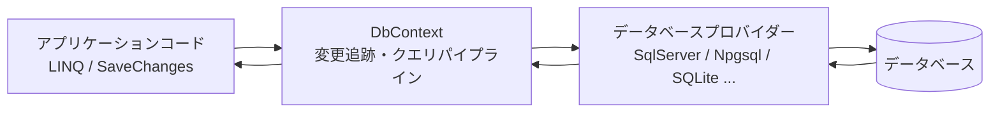
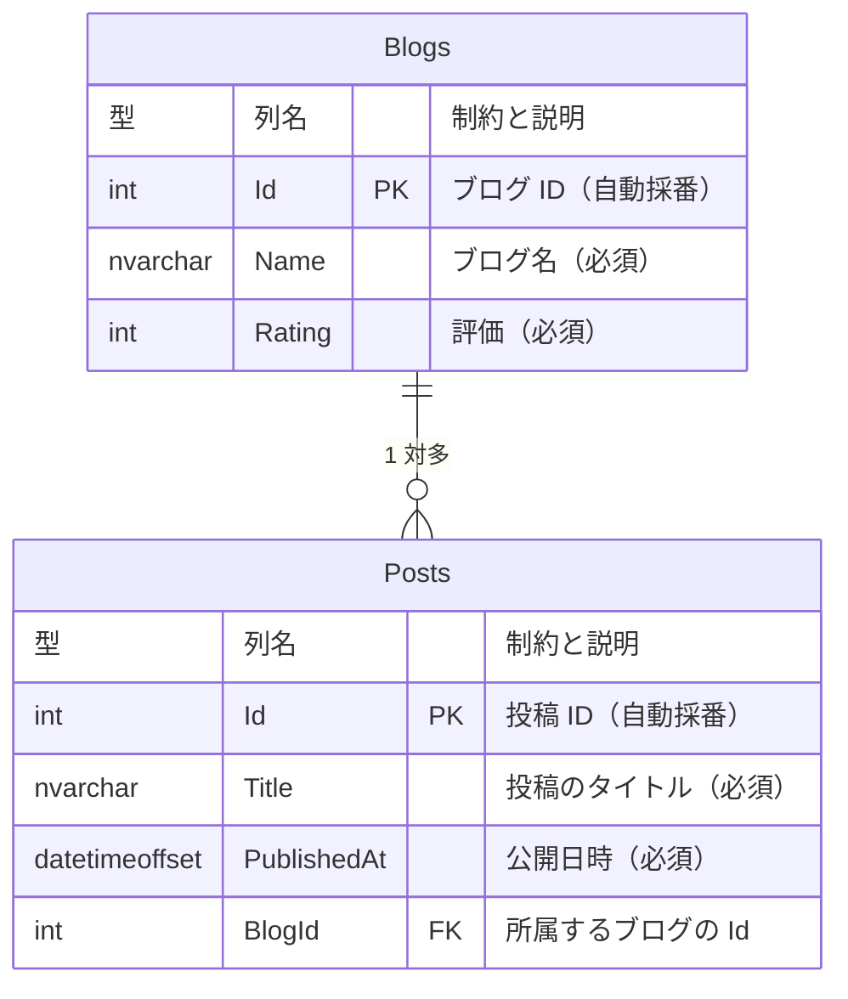
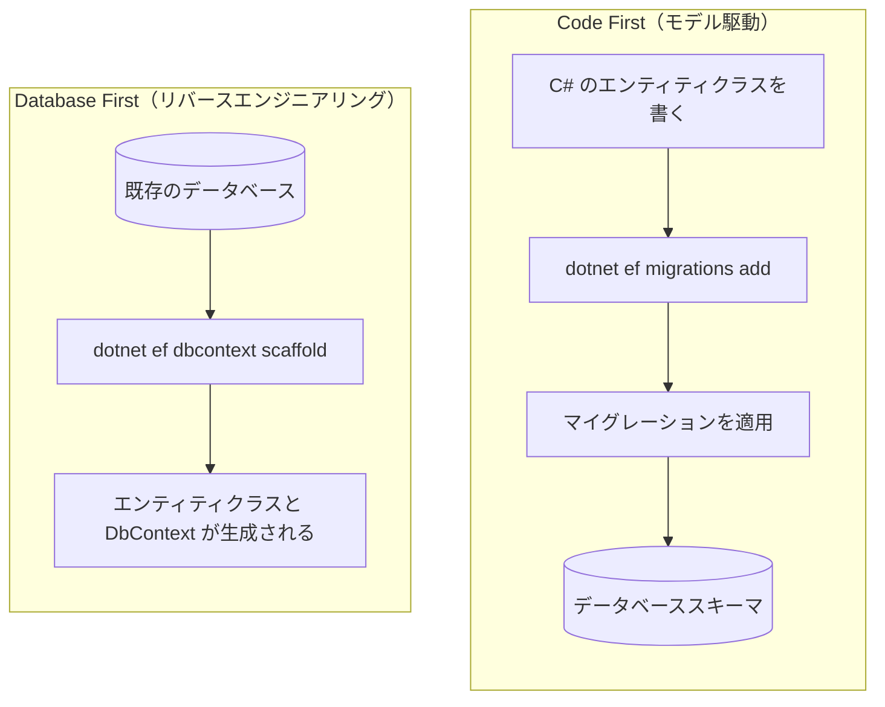
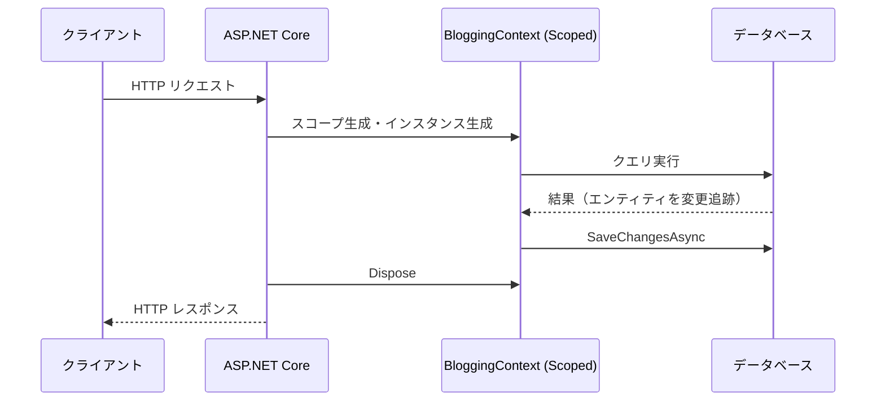
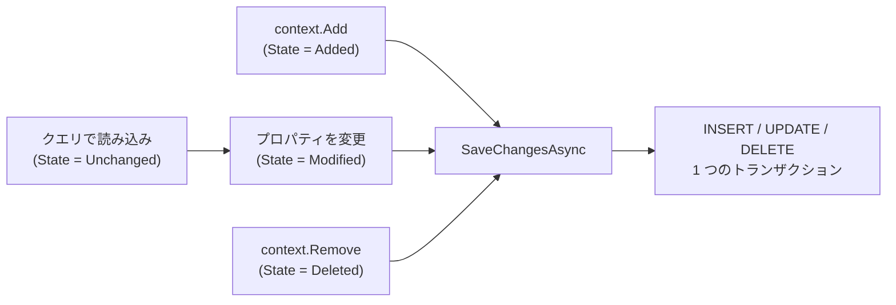
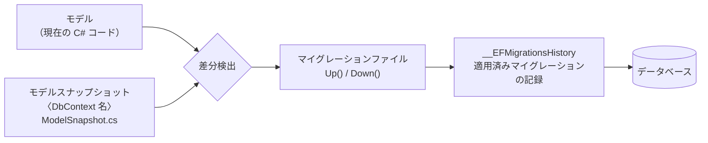
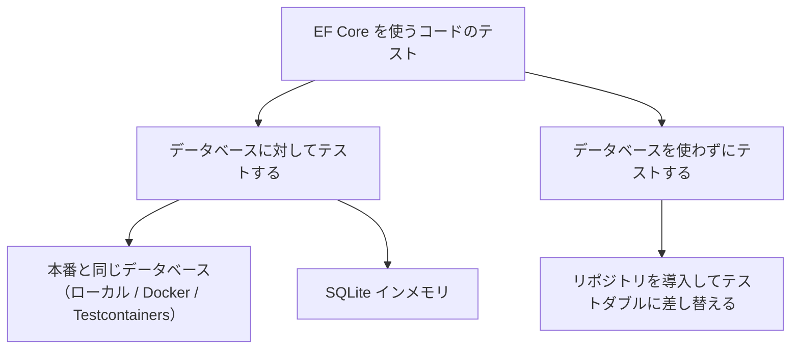
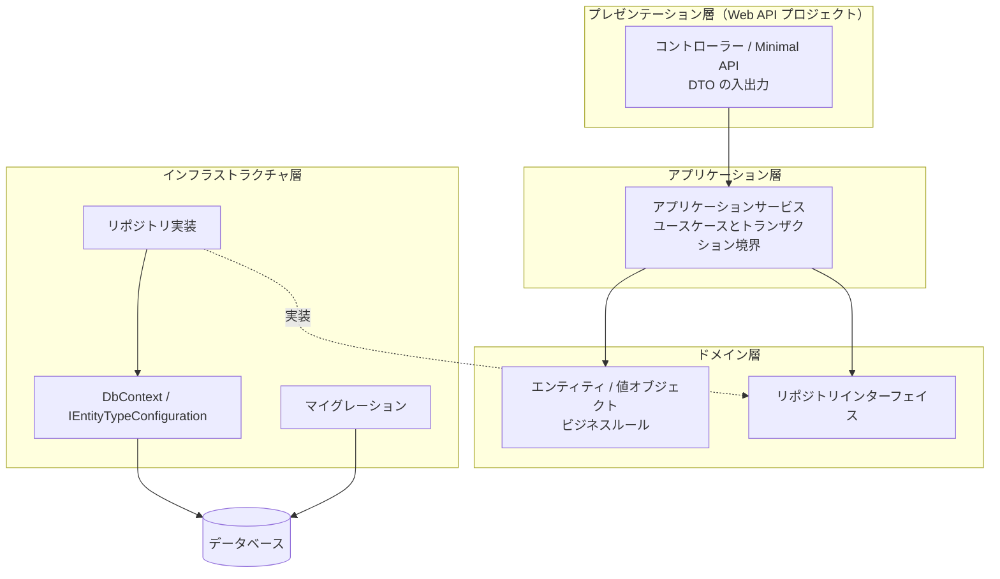

この章では、ASP.NET Core アプリケーションから Entity Framework Core (EF Core) を使ってデータベースにアクセスする方法を扱います。EF Core の基本的な考え方から、DI コンテナーへの登録、クエリと保存、マイグレーションの運用、テストまでを一通り説明します。

EF Core は機能が非常に多いため、この章では **ASP.NET Core から使ううえで必要になる部分**に絞っています。個々の機能の詳細は 5 本の付録に分けました。

| 付録 | 扱う内容 |
| --- | --- |
| [付録 EF Core 1：モデル定義（エンティティとリレーションシップ）](../appendix-efcore-01/index.md) | エンティティの構成、リレーションシップ、値の変換・所有型・複合型、継承 |
| [付録 EF Core 2：モデル定義（キー・採番・SQL Server 固有）](../appendix-efcore-02/index.md) | 代替キー、シャドウプロパティ、シーケンス、テンポラルテーブル、空間データ、hierarchyid |
| [付録 EF Core 3：マイグレーションの詳細とクエリ](../appendix-efcore-03/index.md) | マイグレーションの読み方、分割クエリ、照合順序、生の SQL、ユーザー定義関数 |
| [付録 EF Core 4：更新・トランザクション・レプリカ](../appendix-efcore-04/index.md) | 切断されたエンティティ、同時実行制御、デッドロック、インターセプター、レプリカ |
| [付録 EF Core 5：パフォーマンス](../appendix-efcore-05/index.md) | 計測と診断、インデックス、コンパイル済みクエリとモデル、NativeAOT、変更検出のコスト |
| [付録 EF Core 6：テスト](../appendix-efcore-06/index.md) | 実データベースに対するテスト、SQLite インメモリとその制限、WebApplicationFactory、リポジトリパターン |


---

## 目次

1. [概要と設計方針](#1-概要と設計方針)
   - [EF Core とは](#ef-core-とは)
   - [O/R マッパーの位置づけ](#or-マッパーの位置づけ)
   - [データベースプロバイダーの選択](#データベースプロバイダーの選択)
   - [Code First と Database First](#code-first-と-database-first)
   - [パッケージの追加とツールの準備](#パッケージの追加とツールの準備)
2. [DbContext と ASP.NET Core への組み込み](#2-dbcontext-と-aspnet-core-への組み込み)
   - [エンティティクラスの定義](#エンティティクラスの定義)
   - [DbContext の定義](#dbcontext-の定義)
   - [DI への登録と接続文字列](#di-への登録と接続文字列)
   - [DbContext のライフタイムとスレッド安全性](#dbcontext-のライフタイムとスレッド安全性)
   - [DbContext プーリング](#dbcontext-プーリング)
3. [クエリの基本](#3-クエリの基本)
   - [基本的なクエリ](#基本的なクエリ)
   - [クエリはいつ実行されるか](#クエリはいつ実行されるか)
   - [変更追跡と AsNoTracking](#変更追跡と-asnotracking)
   - [関連データの読み込み](#関連データの読み込み)
   - [遅延読み込みと N+1 問題](#遅延読み込みと-n1-問題)
   - [投影 (Projection) による最適化](#投影-projection-による最適化)
   - [ページング](#ページング)
   - [発行される SQL を確認する](#発行される-sql-を確認する)
4. [保存とトランザクションの基本](#4-保存とトランザクションの基本)
   - [追加・更新・削除の基本](#追加更新削除の基本)
   - [SaveChanges の既定のトランザクション動作](#savechanges-の既定のトランザクション動作)
   - [明示的なトランザクション制御](#明示的なトランザクション制御)
5. [マイグレーションとスキーマ管理](#5-マイグレーションとスキーマ管理)
   - [マイグレーションの仕組み](#マイグレーションの仕組み)
   - [マイグレーションの作成と適用](#マイグレーションの作成と適用)
   - [本番環境への適用戦略](#本番環境への適用戦略)
   - [SQL スクリプトとマイグレーションバンドル](#sql-スクリプトとマイグレーションバンドル)
   - [起動時マイグレーションの是非](#起動時マイグレーションの是非)
6. [本番運用とスケールアウト](#6-本番運用とスケールアウト)
   - [複数インスタンスでも動く理由](#複数インスタンスでも動く理由)
   - [データベースへの接続数](#データベースへの接続数)
   - [起動時マイグレーションの同時実行](#起動時マイグレーションの同時実行)
   - [同じ行への同時更新と一時的な障害](#同じ行への同時更新と一時的な障害)
7. [テストとアーキテクチャ](#7-テストとアーキテクチャ)
   - [テスト戦略の選択](#テスト戦略の選択)
   - [InMemory プロバイダーが推奨されない理由](#inmemory-プロバイダーが推奨されない理由)
   - [WebApplicationFactory を使った統合テスト](#webapplicationfactory-を使った統合テスト)
   - [アーキテクチャ例：レイヤー構成のまとめ](#アーキテクチャ例レイヤー構成のまとめ)
8. [参考ドキュメント](#8-参考ドキュメント)

---

## 1. 概要と設計方針

### EF Core とは

Entity Framework Core (EF Core) は、.NET 向けの軽量かつ拡張可能なオープンソースの **O/R マッパー (Object-Relational Mapper)** です。データベースのテーブルを C# のクラス（エンティティ）にマッピングし、SQL を直接書く代わりに LINQ でクエリを表現できます。

EF Core は大きく次の 3 つの役割を担います。

| 役割 | 内容 |
| --- | --- |
| クエリの変換 | LINQ 式ツリーを解析し、プロバイダーごとの SQL に変換して実行する |
| 変更追跡 (Change Tracking) | 読み込んだエンティティの変更を記録し、`SaveChanges` で INSERT / UPDATE / DELETE に変換する |
| スキーマ管理 | モデルの差分からマイグレーションを生成し、データベーススキーマを更新する |



本章では .NET 10 / EF Core 10 を前提とします。EF Core のバージョンは .NET のバージョンに追随しており、EF Core 10 は .NET 10 と同じく LTS (Long Term Support) リリースです。

#### まずは動くコードを見る

細かい説明はこのあとの節で行いますが、先に「EF Core を使うとどう書けるのか」を見ておきます。ここでは SQL Server に次の 2 つのテーブルがあるものとして、これを EF Core で操作します。



1 つのブログ (`Blogs`) が複数の投稿 (`Posts`) を持ち、投稿は必ずどれか 1 つのブログに属します。図の `PK` は主キー制約 (PRIMARY KEY)、`FK` は外部キー制約 (FOREIGN KEY) を表します。`Posts.BlogId` が `Blogs.Id` を参照する外部キーです。


**1. テーブルに対応するクラスと `DbContext` を用意する**

```csharp
public class Blog
{
    public int Id { get; set; }
    public required string Name { get; set; }
    public int Rating { get; set; }
    public List<Post> Posts { get; set; } = [];
}

public class Post
{
    public int Id { get; set; }
    public required string Title { get; set; }
    public DateTimeOffset PublishedAt { get; set; }
    public int BlogId { get; set; }
    public Blog? Blog { get; set; }
}

public class BloggingContext(DbContextOptions<BloggingContext> options)
    : DbContext(options)
{
    public DbSet<Blog> Blogs => Set<Blog>();
    public DbSet<Post> Posts => Set<Post>();
}
```

**2. 追加する (INSERT)**

オブジェクトを組み立てて `Add` し、`SaveChangesAsync` を呼ぶだけです。

```csharp
var blog = new Blog { Name = ".NET ブログ", Rating = 4 };
blog.Posts.Add(new Post { Title = "EF Core 入門", PublishedAt = DateTimeOffset.UtcNow });

context.Blogs.Add(blog);
await context.SaveChangesAsync();

// 採番された主キーがオブジェクトに書き戻される
Console.WriteLine(blog.Id);      // 1
Console.WriteLine(blog.Posts[0].Id);  // 1
```

`Blog` と `Post` の 2 つの INSERT が発行され、外部キーも自動的に設定されます（SQL Server 2022 で実測）。

```sql
INSERT INTO [Blogs] ([Name], [Rating])
OUTPUT INSERTED.[Id]
VALUES (@p0, @p1);

INSERT INTO [Posts] ([BlogId], [PublishedAt], [Title])
OUTPUT INSERTED.[Id]
VALUES (@p2, @p3, @p4);
```

**3. 問い合わせる (SELECT)**

SQL の代わりに LINQ を書きます。

```csharp
var blogs = await context.Blogs
    .Where(b => b.Rating >= 3)
    .OrderBy(b => b.Name)
    .Select(b => new { b.Name, PostCount = b.Posts.Count })
    .ToListAsync();
```

これが次の SQL に変換されます（SQL Server 2022 で実測）。`Posts.Count` が副問い合わせになっている点に注目してください。件数を数えるためだけに投稿を全件読み込むことはしません。

```sql
SELECT [b].[Name], (
    SELECT COUNT(*)
    FROM [Posts] AS [p]
    WHERE [b].[Id] = [p].[BlogId]) AS [PostCount]
FROM [Blogs] AS [b]
WHERE [b].[Rating] >= 3
ORDER BY [b].[Name]
```

**4. 更新する (UPDATE)**

更新用のメソッドは呼びません。読み込んだオブジェクトのプロパティを書き換えて `SaveChangesAsync` を呼ぶと、EF Core が変更を検出して UPDATE を組み立てます。

```csharp
var blog = await context.Blogs.FirstAsync(b => b.Name == ".NET ブログ");
blog.Rating = 5;
await context.SaveChangesAsync();
```

変更した列だけが UPDATE 文に含まれます（SQL Server 2022 で実測）。`Name` は書き換えていないため対象外です。

```sql
UPDATE [Blogs] SET [Rating] = @p0
OUTPUT 1
WHERE [Id] = @p1;
```

> [!NOTE]
> 「オブジェクトを書き換えるだけで UPDATE が発行される」という動作が、EF Core を特徴づける**変更追跡 (Change Tracking)** です。Java の Spring Data JPA / Hibernate が永続化コンテキスト内で行うダーティチェックに最も近い考え方です。一方、Django ORM の `Model.save()`、Laravel Eloquent の `$model->save()`、Go の GORM の `db.Save()` のように、オブジェクトごとに保存を指示するスタイルとは異なります。EF Core では**複数のオブジェクトへの変更をまとめて 1 回の `SaveChanges` で反映**します。


### O/R マッパーの位置づけ

.NET でデータベースにアクセスする手段は EF Core だけではありません。用途に応じて選択します。

| 手段 | 特徴 | 向いている場面 |
| --- | --- | --- |
| EF Core | LINQ、変更追跡、マイグレーションを備えたフル機能の O/R マッパー | 一般的な業務アプリケーション。読み書き両方を扱う |
| Dapper などのマイクロ O/R マッパー | SQL を自分で書き、結果をオブジェクトにマッピングするだけ | SQL を完全に制御したい、複雑な集計クエリ |
| ADO.NET (`DbConnection` / `DbCommand`) | 最も低レベルな API | 特殊な最適化や、プロバイダー固有の機能を直接使う場合 |

EF Core でも後述する `FromSql` によって生の SQL を書けるため、「基本は EF Core、一部のクエリだけ SQL を直接書く」という組み合わせが現実的な選択になります。

> [!NOTE]
> 他言語の O/R マッパーと比較すると、EF Core は **Java の Spring Data JPA / Hibernate** に最も近い位置づけです。エンティティクラスの定義、変更追跡（Hibernate の永続化コンテキストに相当）、スキーマ生成といった考え方が共通しています。**Python の Django ORM** はモデルクラスとマイグレーションを備える点が似ていますが、Django ORM がモデルクラス自身にクエリ API を持たせる (`Blog.objects.filter(...)`) のに対し、EF Core は `DbContext` を経由します。**TypeScript の NestJS** では TypeORM や Prisma、**PHP の Laravel** では Eloquent、**Go の Gin / Echo** では GORM が同種の役割を担います。

### データベースプロバイダーの選択

EF Core 自体はデータベースに依存せず、**プロバイダー** と呼ばれる NuGet パッケージを追加することで各データベースに対応します。

| データベース | パッケージ | 提供元 | 公式一覧の記載 |
| --- | --- | --- | --- |
| SQL Server / Azure SQL / Azure Synapse Analytics | `Microsoft.EntityFrameworkCore.SqlServer` | EF Core プロジェクト (Microsoft) | 8, 9, 10 |
| SQLite | `Microsoft.EntityFrameworkCore.Sqlite` | EF Core プロジェクト (Microsoft) | 8, 9, 10 |
| Azure Cosmos DB for NoSQL | `Microsoft.EntityFrameworkCore.Cosmos` | EF Core プロジェクト (Microsoft) | 8, 9, 10 |
| PostgreSQL | `Npgsql.EntityFrameworkCore.PostgreSQL` | Npgsql Development Team | 8, 9 |
| MySQL / MariaDB | `Pomelo.EntityFrameworkCore.MySql` | Pomelo Foundation Project | 8, 9 |

> [!WARNING]
> **プロバイダーは EF Core のメジャーバージョンをまたいで動作しません。** 公式ドキュメントは「EF Core 8 向けにリリースされたプロバイダーは EF Core 9 では動作しない」と明記しています。EF Core のバージョンを上げるときは、使っているプロバイダーが対応済みかを必ず先に確認してください。
>
> 上の表の最終列は公式のプロバイダー一覧に記載されている値ですが、この一覧は Microsoft 以外が提供するプロバイダーの最新状況に追いついていないことがあります。**公式一覧だけでも NuGet だけでも判断せず、両方を確認してください。** 実際に NuGet の安定版で確かめた結果は[付録5の「サードパーティー製プロバイダーはバージョンを実際に確かめる」](/appendix-efcore-05/#サードパーティー製プロバイダーはバージョンを実際に確かめる)にまとめています。

> [!IMPORTANT]
> 1 つの `DbContext` インスタンスに設定できるプロバイダーは 1 つだけです。同じ `DbContext` の型を別々のインスタンスで異なるプロバイダーに接続することは可能ですが、単一のインスタンスが複数のプロバイダーを使うことはできません。

### Code First と Database First

EF Core でモデルとデータベースを対応づけるアプローチは 2 つあります。



| アプローチ | 使いどころ |
| --- | --- |
| Code First | 新規開発。スキーマの変更履歴をソース管理に残せる |
| Database First | 既存データベースがある場合や、DBA がスキーマを管理している場合 |

本章では Code First を中心に説明します。Database First の場合は次のコマンドでエンティティと `DbContext` を生成します。

```bash
dotnet ef dbcontext scaffold "Server=(localdb)\mssqllocaldb;Database=Blogging;Trusted_Connection=True" Microsoft.EntityFrameworkCore.SqlServer --output-dir Models
```

> [!WARNING]
> スキャフォールディングをそのまま実行すると、**生成された `DbContext` の `OnConfiguring` に接続文字列がそのまま埋め込まれます**。`--no-onconfiguring` オプションで抑止できます。詳しくは[付録3の「既存データベースからスキャフォールディングする」](/appendix-efcore-03/#既存データベースからスキャフォールディングする)を参照してください。

### パッケージの追加とツールの準備

Web API プロジェクトに SQL Server プロバイダーを追加します。

```bash
dotnet add package Microsoft.EntityFrameworkCore.SqlServer
dotnet add package Microsoft.EntityFrameworkCore.Design
```

`Microsoft.EntityFrameworkCore.Design` は、マイグレーションの生成やスキャフォールディングといった **設計時 (design-time)** の操作に必要です。実行時には不要ですが、`dotnet ef` コマンドを使うプロジェクトには追加しておきます。

続いて EF Core のコマンドラインツールをインストールします。

```bash
dotnet tool install --global dotnet-ef
```

すでにインストール済みの場合は更新します。

```bash
dotnet tool update --global dotnet-ef
```

インストールを確認します。

```bash
dotnet ef --version
```

> [!TIP]
> チーム開発では、グローバルツールの代わりに **ローカルツール** としてリポジトリに固定すると、開発者間でバージョンを揃えられます。`dotnet new tool-manifest` を実行してから `dotnet tool install dotnet-ef` を実行すると、ツールマニフェストファイルにバージョンが記録されます。このファイルをリポジトリにコミットしておけば、他の開発者は `dotnet tool restore` を実行するだけで同じバージョンを復元できます。実測では、マニフェストに `"version": "10.0.11"` が記録され、`dotnet tool restore` で復元できることを確認しました。

<details>
<summary>Visual Studio のパッケージマネージャーコンソールを使う場合</summary>

Visual Studio では、`Microsoft.EntityFrameworkCore.Tools` パッケージを追加すると、パッケージマネージャーコンソールから PowerShell コマンドを使用できます。

```powershell
Install-Package Microsoft.EntityFrameworkCore.Tools
```

以降、本章で紹介する `dotnet ef` コマンドは、次のように読み替えられます。

| .NET CLI | パッケージマネージャーコンソール |
| --- | --- |
| `dotnet ef migrations add <Name>` | `Add-Migration <Name>` |
| `dotnet ef database update` | `Update-Database` |
| `dotnet ef migrations script` | `Script-Migration` |
| `dotnet ef migrations remove` | `Remove-Migration` |

</details>

---

## 2. DbContext と ASP.NET Core への組み込み

### エンティティクラスの定義

エンティティは特別な基底クラスを継承しない、単なる C# クラス（POCO: Plain Old CLR Object）として定義します。ブログと投稿という典型的な 1 対多の関係を例にします。

```csharp
namespace BloggingApi.Models;

public class Blog
{
    public int Id { get; set; }
    public required string Name { get; set; }
    public required string Url { get; set; }
    public int Rating { get; set; }
    public DateTimeOffset CreatedAt { get; set; }

    // ナビゲーションプロパティ（1 対多の「多」側）
    public List<Post> Posts { get; set; } = [];
    public List<Contributor> Contributors { get; set; } = [];
}

public class Post
{
    public int Id { get; set; }
    public required string Title { get; set; }
    public string? Content { get; set; }
    public DateTimeOffset PublishedAt { get; set; }

    // 外部キー
    public int BlogId { get; set; }

    // ナビゲーションプロパティ（1 対多の「1」側）
    public Blog? Blog { get; set; }
}

public class Contributor
{
    public int Id { get; set; }
    public required string DisplayName { get; set; }

    public int BlogId { get; set; }
    public Blog? Blog { get; set; }
}
```

ここで使っている C# の機能を整理します。

| 機能 | 意味 |
| --- | --- |
| `required` 修飾子 | オブジェクト初期化時に値の設定を必須にする。EF Core では非 null の必須列としてマッピングされる |
| `string?` | null 許容参照型。EF Core はこれを NULL 許容列としてマッピングする |
| `= []` | コレクション式による空のリストの初期化 |

> [!IMPORTANT]
> プロジェクトで **null 許容参照型 (Nullable Reference Types)** が有効（`<Nullable>enable</Nullable>`。.NET 6 以降のテンプレートでは既定）になっていると、EF Core は `string` を NOT NULL 列、`string?` を NULL 許容列として扱います。意図しない NOT NULL 制約を避けるため、null を許す列は必ず `?` を付けます。

> [!TIP]
> **コード分析ルールとの衝突について。** プロジェクトで `<AnalysisLevel>latest-all</AnalysisLevel>` のように厳しいコード分析を有効にすると、上のエンティティ定義に対して次のような警告が出ます（実測で確認）。
>
> | ルール | 内容 |
> | --- | --- |
> | `CA1002` | `List<Post>` ではなく `Collection<T>` を公開すべき |
> | `CA2227` | コレクションプロパティのセッターを削除して読み取り専用にすべき |
> | `CA1056` | `Url` プロパティは `string` ではなく `Uri` にすべき |
>
> これらは汎用のライブラリ設計を想定したルールであり、**EF Core のエンティティには当てはまりません。** EF Core はコレクションナビゲーションの設定やリレーションシップの修正のためにセッターを利用しますし、`Uri` 型は標準では列にマッピングされません。エンティティを置いたフォルダーに対して、`.editorconfig` でこれらのルールを無効化するのが実務上の対応です。
>
> ```ini
> # プロジェクト直下の Models フォルダーを対象にする場合
> [Models/*.cs]
> dotnet_diagnostic.CA1002.severity = none
> dotnet_diagnostic.CA2227.severity = none
> dotnet_diagnostic.CA1056.severity = none
> ```
>
> パスは **`.editorconfig` を置いた場所からの相対パス** で解釈されます。`Models` がプロジェクト直下にあるとき、`[**/Models/*.cs]` と書くと**マッチせず抑制されません**（実測で確認）。意図したファイルに効いているかどうかは、ビルドして警告が消えることで必ず確かめてください。

### DbContext の定義

`DbContext` は、エンティティのセット（`DbSet<T>`）を公開し、クエリと保存の起点となるクラスです。

```csharp
using Microsoft.EntityFrameworkCore;
using BloggingApi.Models;

namespace BloggingApi.Data;

public class BloggingContext : DbContext
{
    public BloggingContext(DbContextOptions<BloggingContext> options)
        : base(options)
    {
    }

    public DbSet<Blog> Blogs => Set<Blog>();
    public DbSet<Post> Posts => Set<Post>();

    protected override void OnModelCreating(ModelBuilder modelBuilder)
    {
        // ここでモデルの詳細を構成する（後述）
    }
}
```

> [!TIP]
> `public DbSet<Blog> Blogs { get; set; }` と書く例も多く見られますが、`=> Set<Blog>()` の式形式にしておくと、null 許容参照型が有効な環境で「初期化されていない」という警告を避けられます。動作はどちらも同じです。

`DbContextOptions<BloggingContext>` を受け取るコンストラクターは、DI から構成を受け取るために必要です。

### DI への登録と接続文字列

`Program.cs` で `AddDbContext` を呼び出して DI コンテナーに登録します。

```csharp
using Microsoft.EntityFrameworkCore;
using BloggingApi.Data;

var builder = WebApplication.CreateBuilder(args);

var connectionString = builder.Configuration.GetConnectionString("BloggingDatabase")
    ?? throw new InvalidOperationException("接続文字列 'BloggingDatabase' が見つかりません。");

builder.Services.AddDbContext<BloggingContext>(options =>
    options.UseSqlServer(connectionString));

builder.Services.AddControllers();

var app = builder.Build();

app.MapControllers();

app.Run();
```

接続文字列は `appsettings.json` の `ConnectionStrings` セクションに置きます。

```json
{
  "ConnectionStrings": {
    "BloggingDatabase": "Server=(localdb)\\mssqllocaldb;Database=Blogging;Trusted_Connection=True;MultipleActiveResultSets=true"
  }
}
```

> [!WARNING]
> 本番環境の接続文字列に ID とパスワードを直接書かないでください。ローカル開発ではユーザーシークレット、本番環境では環境変数や Azure Key Vault、あるいは Microsoft Entra ID によるパスワードレス認証を使います。構成プロバイダーの優先順位とシークレット管理については [第5章：アプリ設定 (Configuration)](../05-configuration/index.md) を参照してください。

登録した `DbContext` は、コントローラーやサービスにコンストラクターインジェクションで注入します。

```csharp
using Microsoft.AspNetCore.Mvc;
using Microsoft.EntityFrameworkCore;
using BloggingApi.Data;
using BloggingApi.Models;

namespace BloggingApi.Controllers;

[ApiController]
[Route("api/[controller]")]
public class BlogsController(BloggingContext context) : ControllerBase
{
    [HttpGet]
    public async Task<ActionResult<IEnumerable<Blog>>> GetBlogs(CancellationToken cancellationToken)
        => await context.Blogs.AsNoTracking().ToListAsync(cancellationToken);
}
```

> [!TIP]
> 上記は C# 12 の **プライマリコンストラクター** を使った書き方です。フィールドへの代入を書かずに `context` をメソッド内で参照できます。詳細は [第6章：プライマリコンストラクターによる注入（C# 12）](../06-dependency-injection/index.md#プライマリコンストラクターによる注入c-12) を参照してください。

#### 接続の暗号化は既定で有効

SQL Server プロバイダーが使う `Microsoft.Data.SqlClient` は、バージョン 4.0（EF Core 7）から **`Encrypt` の既定値が `True` に変わりました。** 暗号化が必須になるということは、**サーバー証明書の検証も必須になる**ということです。開発用のコンテナーや自己署名証明書のサーバーに、それまで動いていた接続文字列で接続すると失敗します。

```text
SqlException: サーバーとの接続を正常に確立しましたが、ログイン前のハンドシェイク中に
エラーが発生しました。(provider: TCP プロバイダー, error: 35 - 内部の例外が発生しました)
  → AuthenticationException: 証明書のチェーン検証に失敗しました。
    エラー: 'The certificate was not trusted., [Status: UntrustedRoot]
```

SQL Server 2022 のコンテナーに対して実測したところ、次の 2 つはどちらも接続に成功しました。

| 追加する設定 | 意味 |
| --- | --- |
| `TrustServerCertificate=True` | 暗号化はするが、証明書の検証を省略する |
| `Encrypt=False` | 暗号化そのものを行わない |

> [!WARNING]
> **どちらも本番環境で使ってはいけません。** `TrustServerCertificate=True` は中間者攻撃を防げず、`Encrypt=False` は通信内容が平文で流れます。本番では、サーバーに信頼された証明書を配置してどちらの設定も付けないのが正しい構成です。開発環境だけの回避策として使い、接続文字列を環境ごとに分けてください。

### DbContext のライフタイムとスレッド安全性

`AddDbContext` は `DbContext` を **Scoped** サービスとして登録します。ASP.NET Core では 1 つの HTTP リクエストが 1 つのスコープに対応するため、リクエストごとに `DbContext` インスタンスが作られ、リクエスト終了時に破棄されます。

> [!IMPORTANT]
> Scoped であることの帰結として、**`DbContext` を Singleton サービスのコンストラクターで受け取ることはできません。** そうすると、アプリケーションの起動時に次の例外が発生します（開発環境ではスコープの検証が既定で有効になっているため、リクエストを受ける前に検出されます）。
>
> ```text
> System.InvalidOperationException: Cannot consume scoped service
> 'Microsoft.EntityFrameworkCore.DbContextOptions`1[BloggingContext]'
> from singleton 'MyBackgroundService'.
> ```
>
> この状況の解決策は後述の `IServiceScopeFactory` か `IDbContextFactory<T>` です。
>
> **ただし、この検証が働くのは開発環境だけです。** 同じコードの環境名だけを `Production` に変えて起動したところ、**例外は発生せずアプリケーションはそのまま起動しました**。公式ドキュメントも、この検証は「アプリケーションが開発環境で実行され、`CreateApplicationBuilder` でホストを構築したとき」に既定のサービスプロバイダーが行うものと説明しています。本番環境では検出されないため、開発環境での起動確認を省かないでください。
>
> なお、`AddDbContext` でプロバイダー（`UseSqlServer` など）の指定を忘れた場合は、解決時に別の例外になります。
>
> ```text
> System.InvalidOperationException: No database provider has been configured for this DbContext.
> ```



`DbContext` は 1 つの **作業単位 (unit-of-work)** を表すよう設計されており、公式ドキュメントは次の点を明記しています。

- `DbContext` は **スレッドセーフではない**。複数のスレッドで同じインスタンスを共有してはいけない
- 非同期メソッドは必ず `await` してから、次の操作でインスタンスを使う
- EF Core が投げる `InvalidOperationException` はコンテキストを回復不能な状態にすることがあり、握りつぶして処理を続行してはいけない

> [!WARNING]
> `DbContext` は **スレッドセーフではありません。** 公式ドキュメントは「EF Core は同じ `DbContext` インスタンス上で複数の並行操作が実行されることをサポートしない。これには非同期クエリの並列実行と、複数スレッドからの明示的な同時利用の両方が含まれる」と明記しています。`await` せずに 2 つの操作を同時に走らせると、実測でも例外になりました。
>
> ```csharp
> // これは動かない
> await Task.WhenAll(context.SaveChangesAsync(), context.SaveChangesAsync());
> ```
>
> ```text
> System.InvalidOperationException: A second operation was started on this context instance
> before a previous operation completed. This is usually caused by different threads
> concurrently using the same instance of DbContext.
> ```
>
> さらに公式ドキュメントは「**並行アクセスが検出されなかった場合、未定義の動作、アプリケーションのクラッシュ、データの破損につながる可能性がある**」とも警告しています。例外が出ないことを「安全である証拠」と考えないでください。
>
> ASP.NET Core では、1 つのクライアント要求を実行するスレッドが常に 1 つで、要求ごとに別の DI スコープ（したがって別の `DbContext` インスタンス）が割り当てられるため、ほとんどのアプリケーションではこの問題から守られています。危険になるのは、1 つの要求の中で複数のクエリを `Task.WhenAll` で並列に走らせるような書き方をしたときです。並列にクエリを実行したい場合は、後述する `IDbContextFactory<T>` でインスタンスを分けます。

Singleton サービスやバックグラウンドサービスから `DbContext` を使う場合は、`IServiceScopeFactory` でスコープを作るか、`IDbContextFactory<T>` を使います。

公式ドキュメントは `BackgroundService` のようなホステッドサービスについて、**依存関係をコンストラクター注入せず、`IServiceScopeFactory` を注入してスコープを作り、そのスコープから解決する**よう案内しています。EF Core 側の公式ドキュメントも、複数のスレッドから使う場合の手段として `IServiceScopeFactory` によるスコープ作成を挙げています。

```csharp
public class ReportWorker(
    IServiceScopeFactory scopeFactory,
    ILogger<ReportWorker> logger) : BackgroundService
{
    protected override async Task ExecuteAsync(CancellationToken stoppingToken)
    {
        // スコープを作り、その中から DbContext を解決する
        using var scope = scopeFactory.CreateScope();
        var context = scope.ServiceProvider.GetRequiredService<BloggingContext>();

        logger.LogInformation(
            "ブログ件数={Count}",
            await context.Blogs.CountAsync(stoppingToken));
    }
}
```

`DbContext` を直接コンストラクターで受け取る形と、この形の実測結果は次のとおりです。

| 実装 | 環境 | 結果 |
| --- | --- | --- |
| `BackgroundService(BloggingContext ctx)` | Development | `AggregateException` → `Cannot consume scoped service 'BloggingContext' from singleton 'Microsoft.Extensions.Hosting.IHostedService'.` |
| 同上 | Production | **例外なく起動してしまう** |
| `IServiceScopeFactory` でスコープを作る | Development | 正常に動作し、クエリが実行された |

```csharp
builder.Services.AddDbContextFactory<BloggingContext>(options =>
    options.UseSqlServer(connectionString));
```

> [!IMPORTANT]
> `AddDbContextFactory` は、`IDbContextFactory<BloggingContext>` を **Singleton** として登録すると同時に、`BloggingContext` そのものも **Scoped** で登録します（実測で確認）。したがって、コントローラーで `BloggingContext` を直接受け取ることも、バックグラウンドサービスでファクトリーからインスタンスを作ることも、両方できます。ただし **ファクトリーで作ったインスタンスは DI コンテナーが破棄してくれない**ため、下の例のように `await using` で必ず自分で破棄してください。

```csharp
public class ReportGenerator(IDbContextFactory<BloggingContext> contextFactory)
{
    public async Task<int> CountBlogsAsync(CancellationToken cancellationToken)
    {
        // ファクトリで作成したインスタンスはアプリケーション側で破棄する
        await using var context = await contextFactory.CreateDbContextAsync(cancellationToken);
        return await context.Blogs.CountAsync(cancellationToken);
    }
}
```

> [!NOTE]
> **Spring Boot** の `EntityManager` は `@PersistenceContext` によって注入されますが、そのスコープはリクエスト単位ではなく **トランザクションスコープ** です（Jakarta Persistence の仕様が「特に指定しなければトランザクションスコープの永続化コンテキストが使われる」と定めています）。EF Core の `DbContext` は明示的に Scoped として登録され、`SaveChangesAsync` の呼び出しが保存の契機になる点が異なります。**Django** の ORM は 1 つのスレッドが 1 つの接続を保持する形で暗黙的に接続を管理しますが、EF Core はインスタンスの寿命を DI コンテナーが管理します。

### DbContext プーリング

高スループットのアプリケーションでは、`AddDbContext` の代わりに `AddDbContextPool` を使うと、`DbContext` インスタンスを再利用するプールが有効になり、インスタンスの生成コストを削減できます。ただしプールされたインスタンスは再利用されるため、リクエストごとに変わる状態をフィールドに保持する設計とは相性が悪くなります。詳しくは[付録5の「DbContext プーリングでインスタンスを使い回す」](/appendix-efcore-05/#dbcontext-プーリングでインスタンスを使い回す)を参照してください。

> [!TIP]
> **さらに詳しく**
>
> - [付録 EF Core 1：モデル定義（エンティティとリレーションシップ）](../appendix-efcore-01/index.md) — コンストラクターへのバインド、Null 許容参照型とスキーマ、規約・データ注釈・Fluent API、リレーションシップの詳細、値の変換・所有型・複合型、継承のマッピング
> - [付録 EF Core 2：モデル定義（キー・採番・SQL Server 固有）](../appendix-efcore-02/index.md) — 代替キー、テーブル分割、キーなしエンティティ型、シャドウプロパティ、シーケンス、テンポラルテーブル、空間データ、hierarchyid、計算列、グローバルクエリフィルター

## 3. クエリの基本

### 基本的なクエリ

EF Core では LINQ でクエリを記述します。式ツリーが解析され、プロバイダーが SQL に変換します。

```csharp
// すべての行を取得
var blogs = await context.Blogs.ToListAsync(cancellationToken);

// 条件で絞り込む
var dotnetBlogs = await context.Blogs
    .Where(b => b.Url.Contains("dotnet"))
    .OrderBy(b => b.Name)
    .ToListAsync(cancellationToken);

// 単一の行を取得（見つからなければ null）
var blog = await context.Blogs
    .FirstOrDefaultAsync(b => b.Id == id, cancellationToken);

// 主キーで取得（追跡中のインスタンスがあればデータベースに行かない）
var cached = await context.Blogs.FindAsync([id], cancellationToken);

// 集計
var count = await context.Posts.CountAsync(p => p.BlogId == id, cancellationToken);
```

非同期メソッドの対応表です。ASP.NET Core では、スレッドをブロックしないために必ず非同期版を使います。

| 同期 | 非同期 |
| --- | --- |
| `ToList()` | `ToListAsync()` |
| `First()` / `FirstOrDefault()` | `FirstAsync()` / `FirstOrDefaultAsync()` |
| `Single()` / `SingleOrDefault()` | `SingleAsync()` / `SingleOrDefaultAsync()` |
| `Count()` / `Any()` | `CountAsync()` / `AnyAsync()` |
| `SaveChanges()` | `SaveChangesAsync()` |

> [!TIP]
> 非同期メソッドには `CancellationToken` を渡してください。コントローラーのアクションメソッドや Minimal API のハンドラーは `CancellationToken` を引数に取れます。クライアントが接続を切ったときに、実行中のクエリを中断できます。

### クエリはいつ実行されるか

`IQueryable<T>` に対する `Where` や `OrderBy` はクエリを組み立てるだけで、データベースへのアクセスは発生しません。実際に実行されるのは次のタイミングです。

- `ToListAsync` / `ToArrayAsync` などで結果を実体化したとき
- `FirstAsync` / `SingleAsync` / `CountAsync` などのスカラー結果を返すメソッドを呼んだとき
- `foreach` / `await foreach` で列挙したとき

```csharp
// ここではまだ SQL は発行されない
IQueryable<Blog> query = context.Blogs.Where(b => b.Name.StartsWith("A"));

if (onlyRecent)
{
    query = query.Where(b => b.CreatedAt > DateTimeOffset.UtcNow.AddDays(-30));
}

// ここで初めて 1 回の SQL が実行される
var result = await query.ToListAsync(cancellationToken);
```

> [!IMPORTANT]
> `ToListAsync()` を呼んだ後に `Where` を書くと、それは LINQ to Objects となり、**データベースからすべての行を取得してからメモリ上で絞り込む** ことになります。絞り込みは必ず実体化の前に行ってください。

### 変更追跡と AsNoTracking

既定では、クエリが返したエンティティは `DbContext` の **チェンジトラッカー** に登録されます。これによりプロパティを変更するだけで `SaveChangesAsync` が UPDATE を発行できますが、追跡そのものにコストがかかります。

読み取り専用のクエリでは `AsNoTracking()` を使います。

```csharp
var blogs = await context.Blogs
    .AsNoTracking()
    .Where(b => b.Url.Contains("dotnet"))
    .ToListAsync(cancellationToken);
```

公式のベンチマークでは、追跡ありのクエリに比べて追跡なしのクエリは実行時間・メモリ割り当ての両方で明確に有利な結果が示されています。手元の SQLite で 2,000 行を 30 回読み取って測ったところ、実行時間は 7.48 ミリ秒から 2.32 ミリ秒（約 3.2 倍速）、割り当てバイト数は約 1.99 MB から約 0.77 MB（約 2.6 分の 1）になりました。ASP.NET Core の GET エンドポイントのように、取得した結果をそのまま返すだけの処理では、既定で `AsNoTracking()` を付けることを検討してください。

追跡を行わないと、同じ行が複数回結果に現れたときに別々のインスタンスが作られます。同一性を保ちたい場合は `AsNoTrackingWithIdentityResolution()` を使います。

```csharp
var posts = await context.Posts
    .AsNoTrackingWithIdentityResolution()
    .Include(p => p.Blog)
    .ToListAsync(cancellationToken);
```

`DbContext` 全体で既定の追跡動作を変えることもできます。

```csharp
builder.Services.AddDbContext<BloggingContext>(options =>
    options.UseSqlServer(connectionString)
           .UseQueryTrackingBehavior(QueryTrackingBehavior.NoTracking));
```

この場合、追跡したいクエリだけ `AsTracking()` を付けて個別に戻せます。

```csharp
var blog = await context.Blogs
    .AsTracking()
    .FirstAsync(b => b.Id == id, cancellationToken);
```

> [!WARNING]
> `Select` で射影しても、**結果の中にエンティティのインスタンスが含まれていれば追跡されます**。SQL Server 2022 で実測すると、`Select(b => new { b, b.Name })` は匿名型を返しますが `ChangeTracker` のエントリー数は 1 でした。一方 `Select(b => new { b.Id, b.Name })` のように値だけを取り出した場合は 0 件です。「射影したから追跡されない」とは限りません。

> [!NOTE]
> **Hibernate** の「デタッチ状態」や、`@Transactional(readOnly = true)` による読み取り専用セッションが近い考え方です。**Django** の `.values()` / `.only()`、**Prisma** の `select` も、必要なデータだけを取り出してオーバーヘッドを減らすという意味で目的が共通します。

### 関連データの読み込み

ナビゲーションプロパティを一緒に読み込むには `Include` を使います（イーガーロード）。

```csharp
var blogs = await context.Blogs
    .Include(b => b.Posts)
    .ToListAsync(cancellationToken);
```

さらに深い階層は `ThenInclude` でたどります。

```csharp
var blogs = await context.Blogs
    .Include(b => b.Posts)
        .ThenInclude(p => p.Comments)
            .ThenInclude(c => c.Author)
    .ToListAsync(cancellationToken);
```

読み込む関連データを絞り込む **フィルター付き Include** も使えます。

```csharp
var blogs = await context.Blogs
    .Include(b => b.Posts
        .Where(p => p.PublishedAt > DateTimeOffset.UtcNow.AddYears(-1))
        .OrderByDescending(p => p.PublishedAt)
        .Take(5))
    .ToListAsync(cancellationToken);
```

`Include` の中で使えるのは `Where`、`OrderBy`、`OrderByDescending`、`ThenBy`、`ThenByDescending`、`Skip`、`Take` です。

> [!IMPORTANT]
> フィルター付き Include は、追跡クエリの場合に注意が必要です。同じ `DbContext` インスタンス内で先に読み込まれた関連エンティティが残っていると、フィルターの結果と混ざることがあります。読み取り専用の用途では `AsNoTracking()` と組み合わせてください。

すでに読み込んだエンティティに対して、後から関連データを読み込む **明示的読み込み (Explicit Loading)** もあります。

```csharp
var blog = await context.Blogs.FirstAsync(b => b.Id == id, cancellationToken);

await context.Entry(blog)
    .Collection(b => b.Posts)
    .LoadAsync(cancellationToken);
```

関連データを読み込まずに件数だけ数えたり、条件で絞って読み込んだりする方法は[付録 EF Core 3 の「関連データを読み込まずに数える」](../appendix-efcore-03/index.md#関連データを読み込まずに数える)を参照してください。

### 遅延読み込みと N+1 問題

`Microsoft.EntityFrameworkCore.Proxies` パッケージと `UseLazyLoadingProxies()` を使うと、ナビゲーションプロパティに初めてアクセスしたタイミングで自動的にクエリが発行される **遅延読み込み (Lazy Loading)** を有効にできます。

しかし、これは典型的な **N+1 問題** を引き起こします。

```csharp
// 遅延読み込みが有効な場合の悪い例
var blogs = await context.Blogs.ToListAsync(cancellationToken); // 1 回のクエリ

foreach (var blog in blogs)
{
    // ループのたびにクエリが発行される（N 回）
    Console.WriteLine($"{blog.Name}: {blog.Posts.Count}");
}
```

ブログが 100 件あれば 101 回のデータベースアクセスが発生します。ネットワーク遅延が 1 ミリ秒でも、これだけで 100 ミリ秒が失われます。

> [!TIP]
> EF Core の公式パフォーマンスガイダンスは、遅延読み込みが N+1 問題を非常に起こしやすいことを指摘し、Web アプリケーションでは遅延読み込みを避けることを推奨しています。必要な関連データは `Include` で明示的に読み込むか、後述する投影で必要な列だけを取得してください。

```csharp
// 良い例：1 回のクエリで必要なデータをまとめて取得する
var summaries = await context.Blogs
    .Select(b => new BlogSummary(b.Id, b.Name, b.Posts.Count))
    .ToListAsync(cancellationToken);
```

> [!NOTE]
> N+1 問題は O/R マッパー全般に共通する課題です。**Hibernate** では `JOIN FETCH` や `@BatchSize`、**Django** では `select_related()` / `prefetch_related()`、**Laravel** の Eloquent では `with()`、**Prisma** では `include` が、EF Core の `Include` に相当します。

### 投影 (Projection) による最適化

エンティティ全体ではなく、必要な列だけを取得する **投影** は最も効果的な最適化の 1 つです。

```csharp
public record BlogSummary(int Id, string Name, int PostCount);

var summaries = await context.Blogs
    .Select(b => new BlogSummary(b.Id, b.Name, b.Posts.Count))
    .ToListAsync(cancellationToken);
```

生成される SQL は必要な列だけを SELECT し、`Posts` はサブクエリでカウントされます。エンティティ型ではないため変更追跡も行われません。

> [!WARNING]
> API のレスポンスは、エンティティをそのまま返すのではなく DTO (Data Transfer Object) に投影するのが安全です。エンティティを直接返すと、内部の列や循環参照するナビゲーションプロパティが意図せず公開されてしまいます。**そもそも循環したままシリアル化すると `System.Text.Json` が例外を投げます。** 詳しくは[付録3の「エンティティをそのまま JSON にすると循環参照で失敗する」](/appendix-efcore-03/#エンティティをそのまま-json-にすると循環参照で失敗する)を参照してください。

### ページング

一覧 API では必ず件数を制限します。EF Core の公式パフォーマンスガイダンスは、これを「**結果セットのサイズを制限する**」として独立した指針に挙げています。既定では条件に一致する行がすべて返るため、**返る行数が実際のデータ次第になり、読み込まれるデータ量・消費されるメモリ・ネットワークへの負荷のいずれも事前に見積もれません。** 公式が特に注意を促しているのは、**テスト用のデータベースはデータが少ないことが多く、テスト中は問題なく動くのに、実データで多くの行が返るようになった途端に性能問題が表面化する**という点です。

実際に SQL Server 2022 に 100,000 行（`Content` は 500 文字）を用意し、同じ条件のクエリを `Take` の有無で比較しました。

| クエリ | 所要時間 | マネージドヒープの増加 |
| --- | --- | --- |
| `Where(...).ToListAsync()` | 3,320 ミリ秒 | +230 MB |
| `Where(...).Take(25).ToListAsync()` | 38 ミリ秒 | +0 MB |

行数が増えるほど差は開きます。**最低限でも上限を設け**、可能ならページングを実装してください。単純な方法は `Skip` / `Take` による **オフセットページング** です。

```csharp
var page = await context.Posts
    .AsNoTracking()
    .OrderByDescending(p => p.PublishedAt)
    .ThenBy(p => p.Id)
    .Skip((pageNumber - 1) * pageSize)
    .Take(pageSize)
    .ToListAsync(cancellationToken);
```

オフセットページングは実装が簡単ですが、後方のページになるほどデータベースがスキップする行数が増え、性能が劣化します。また、ページの取得中に行が挿入・削除されると、同じ行が 2 度現れたり抜け落ちたりします。

大量データでは **キーセットページング (Keyset Pagination)** が推奨されます。前ページの最後の値を条件に使います。

```csharp
var page = await context.Posts
    .AsNoTracking()
    .OrderBy(p => p.Id)
    .Where(p => p.Id > lastSeenId)
    .Take(pageSize)
    .ToListAsync(cancellationToken);
```

| 方式 | 長所 | 短所 |
| --- | --- | --- |
| オフセット | 任意のページに直接ジャンプできる | 深いページで遅い。行の増減でずれる |
| キーセット | ページ位置に関係なく高速。ずれにくい | 「10 ページ目へ」のようなランダムアクセスができない |

> [!NOTE]
> 公式ドキュメントは、ランダムアクセスが本当に必要かをよく検討するよう促したうえで、必要な場合の実装として「**次へ／前への移動はキーセット、任意のページへのジャンプはオフセット**」という併用を挙げています。

### 発行される SQL を確認する

LINQ で書いたクエリも、次節で扱う `SaveChangesAsync` も、最終的には SQL に変換されてデータベースへ送られます。この変換は自動で行われるため、**書いたコードからは実際に流れる SQL が見えません**。意図しない結合や全件取得が起きていないかを確かめるために、EF Core は生成された SQL を取り出す手段を用意しています。

| 手段 | 見えるもの | クエリを実行するか |
| --- | --- | --- |
| `ToQueryString()` | クエリの SQL | 実行しない |
| ログ | 実際に実行されたすべての SQL（クエリ・保存・マイグレーション） | 実行する |
| インターセプター | 実行直前の `DbCommand` | 実行する |

#### 実行せずにクエリの SQL を見る

`ToQueryString()` は、クエリを実行せずに生成される SQL を文字列で返します。

```csharp
var url = "dotnet";
var query = context.Blogs
    .Where(b => b.Url.Contains(url))
    .OrderBy(b => b.Id);

Console.WriteLine(query.ToQueryString());
```

SQL Server 2022 に対して実行すると、次の SQL が得られます。

```sql
DECLARE @url_contains nvarchar(4000) = N'%dotnet%';

SELECT [b].[Id], [b].[Name], [b].[Url]
FROM [Blogs] AS [b]
WHERE [b].[Url] LIKE @url_contains ESCAPE N'\'
ORDER BY [b].[Id]
```

先頭にパラメーターの `DECLARE` が付くため、**この出力をそのまま SQL Server Management Studio などに貼り付けて実行できます**。実行計画を確認したいときに便利です。

> [!NOTE]
> 上の例で `DECLARE` が現れたのは、条件に**変数** `url` を使ったからです。`Where(b => b.Url.Contains("dotnet"))` のように定数を直接書くと、EF Core はパラメーターにせず `WHERE [b].[Url] LIKE N'%dotnet%'` のように SQL へ埋め込みます。公式パフォーマンスガイダンスは、定数を使うと**クエリごとに異なる SQL が生成されるため、データベース側も実行計画を再利用できない**と説明しています。変わる値は変数に入れてください。

> [!IMPORTANT]
> `ToQueryString()` は `IQueryable` の拡張メソッドであり、**クエリ専用**です。`SaveChangesAsync` が発行する `INSERT` / `UPDATE` / `DELETE` は取得できません。`ExecuteUpdateAsync` / `ExecuteDeleteAsync` も `Task<int>` を返すため対象外です。これらの SQL を見るには、次に説明するログを使います。

#### 実際に実行された SQL をログで見る

`AddDbContext` で登録した `DbContext` は、ASP.NET Core のログ設定をそのまま使います。`appsettings.Development.json` で次のカテゴリーを `Information` にすると、実行されたすべての SQL がログに流れます。

```json
{
  "Logging": {
    "LogLevel": {
      "Microsoft.EntityFrameworkCore.Database.Command": "Information"
    }
  }
}
```

`SaveChangesAsync` で 1 件の追加と 1 件の更新を行ったときに、SQL Server 2022 に対して実際に出力されたログは次のとおりです。

```text
info: Microsoft.EntityFrameworkCore.Database.Command[20101]
      Executed DbCommand (8ms) [Parameters=[@p1='?' (DbType = Int32), @p0='?' (Size = 4000), @p2='?' (DbType = Int32), @p3='?' (Size = 4000)], CommandType='Text', CommandTimeout='30']
      SET NOCOUNT ON;
      UPDATE [Blogs] SET [Name] = @p0
      OUTPUT 1
      WHERE [Id] = @p1;
      INSERT INTO [Posts] ([BlogId], [Title])
      OUTPUT INSERTED.[Id]
      VALUES (@p2, @p3);
```

`UPDATE` と `INSERT` が 1 つのコマンドにまとめられており、`SaveChangesAsync` が変更をバッチにして送っていることが読み取れます。

> [!WARNING]
> ログの `Parameters` に注目してください。値が `'?'` になっています。EF Core は**既定でパラメーターの値をログに出力しません**。個人情報などがログに残るのを防ぐためです。`EnableSensitiveDataLogging()` を呼ぶと実際の値（`@url_contains='%dotnet%'` のような形）が出力されますが、**本番環境では有効にしないでください**。

> [!TIP]
> **さらに詳しく**
>
> - [付録 EF Core 3：マイグレーションの詳細とクエリ](../appendix-efcore-03/index.md) — 単一クエリと分割クエリ、LeftJoin / RightJoin、照合順序と大文字小文字、キーセットページング、生の SQL、ユーザー定義関数とビュー
> - [付録 EF Core 5：パフォーマンス](../appendix-efcore-05/index.md) — ログの出力形式、`CreateDbCommand()` による `DbCommand` の取得、ログとセキュリティ
> - [付録 EF Core 4：保存の応用とトランザクション](../appendix-efcore-04/index.md) — インターセプターで SQL に割り込む

## 4. 保存とトランザクションの基本

### 追加・更新・削除の基本

EF Core の更新は、チェンジトラッカーが記録した状態をもとに `SaveChangesAsync` がまとめて SQL に変換する、という流れで行われます。



```csharp
// 追加
var blog = new Blog { Name = "新しいブログ", Url = "https://example.com" };
context.Blogs.Add(blog);
await context.SaveChangesAsync(cancellationToken);
// 保存後、blog.Id にはデータベースが採番した値が入る

// 更新（追跡されているエンティティのプロパティを変更するだけでよい）
var target = await context.Blogs.FirstAsync(b => b.Id == id, cancellationToken);
target.Name = "変更後の名前";
await context.SaveChangesAsync(cancellationToken);

// 削除
context.Blogs.Remove(target);
await context.SaveChangesAsync(cancellationToken);
```

> [!NOTE]
> `DbSet` には `AddAsync` もありますが、**通常は同期の `Add` を使ってください。** `Add` はデータベースにアクセスせず、チェンジトラッカーに状態を登録するだけだからです。公式ドキュメントは `AddAsync` について「このメソッドが async なのは、SQL Server の `SequenceHiLo` のように**データベースへ非同期にアクセスする特殊な値ジェネレーター**を使えるようにするためだけであり、それ以外のすべてのケースでは非 async のメソッドを使うべき」と明記しています。`Update` / `Remove` / `Attach` には async 版そのものが存在しません。

関連エンティティを一緒に追加すると、EF Core が外部キーを解決して正しい順序で INSERT します。
```csharp
var blog = new Blog
{
    Name = "新しいブログ",
    Url = "https://example.com",
    Posts =
    [
        new Post { Title = "最初の投稿" },
        new Post { Title = "2 番目の投稿" }
    ]
};

context.Blogs.Add(blog);
await context.SaveChangesAsync(cancellationToken);
```

追跡されていないエンティティ（クライアントから受け取った DTO を変換したものなど）を更新する場合は、`Update` または `Attach` と状態設定を使います。

```csharp
var blog = new Blog { Id = id, Name = dto.Name, Url = dto.Url };
context.Blogs.Update(blog); // すべてのプロパティが Modified になる
await context.SaveChangesAsync(cancellationToken);
```

> [!TIP]
> `Update` はすべての列を UPDATE 文に含めます。一部の列だけを更新したい場合は、いったんデータベースから読み込んで必要なプロパティだけを変更するか、`context.Entry(blog).Property(b => b.Name).IsModified = true;` のように個別に指定します。

### SaveChanges の既定のトランザクション動作

`SaveChangesAsync` の 1 回の呼び出しは、**1 つのトランザクション** で実行されます。複数のエンティティを変更していても、すべて成功するか、すべてロールバックされるかのどちらかです。

```csharp
context.Blogs.Add(new Blog { Name = "A", Url = "https://a.example.com" });
context.Posts.Remove(existingPost);

// 2 つの変更は同一トランザクション内で実行される
await context.SaveChangesAsync(cancellationToken);
```

したがって、単一の作業単位で完結する処理には明示的なトランザクションは不要です。

### 明示的なトランザクション制御

複数回の `SaveChangesAsync` や、生の SQL を含む処理を 1 つのトランザクションにまとめたい場合は、明示的にトランザクションを開始します。

```csharp
await using var transaction = await context.Database.BeginTransactionAsync(cancellationToken);

try
{
    context.Blogs.Add(new Blog { Name = "A", Url = "https://a.example.com" });
    await context.SaveChangesAsync(cancellationToken);

    await context.Database.ExecuteSqlAsync(
        $"UPDATE [Statistics] SET [BlogCount] = [BlogCount] + 1",
        cancellationToken);

    await transaction.CommitAsync(cancellationToken);
}
catch
{
    await transaction.RollbackAsync(cancellationToken);
    throw;
}
```

> [!TIP]
> `await using` で破棄されるとき、コミットされていないトランザクションは自動的にロールバックされます。そのため `catch` 内の `RollbackAsync` は必須ではありませんが、意図を明示するために書いておくと読みやすくなります。

分離レベルを指定することもできます。

```csharp
await using var transaction = await context.Database
    .BeginTransactionAsync(System.Data.IsolationLevel.Serializable, cancellationToken);
```

> [!TIP]
> **さらに詳しく**
>
> - [付録 EF Core 4：更新・トランザクション・レプリカ](../appendix-efcore-04/index.md) — 切断されたエンティティ、一括更新・一括削除、楽観的同時実行制御、デッドロック、インターセプター、読み取り専用レプリカ

## 5. マイグレーションとスキーマ管理

### マイグレーションの仕組み

マイグレーションは、C# のモデルとデータベーススキーマを同期させる仕組みです。



EF Core は、現在のモデルと直前のマイグレーションが保持する **モデルスナップショット** を比較して差分を検出し、マイグレーションのソースファイルを生成します。適用済みのマイグレーションは `__EFMigrationsHistory` テーブルに記録されるため、次回は未適用のものだけが適用されます。

### マイグレーションの作成と適用

最初のマイグレーションを作成します。

```bash
dotnet ef migrations add InitialCreate
```

プロジェクトに `Migrations` フォルダーが作成され、マイグレーションのソースファイルとモデルスナップショットが生成されます。これらはソース管理にコミットします。`BloggingContext` に対して実行すると、実際には次の 3 ファイルが作られます。

```text
Migrations/
├── 20260831070300_InitialCreate.cs           マイグレーション本体（Up / Down）
├── 20260831070300_InitialCreate.Designer.cs  そのマイグレーション時点のモデル定義
└── BloggingContextModelSnapshot.cs           最新モデルのスナップショット
```

先頭の数字はマイグレーションを作成した日時（UTC、`yyyyMMddHHmmss`）で、これが適用順序を決めます。スナップショットのファイル名は `<DbContext のクラス名>ModelSnapshot.cs` になります。

データベースに適用します。

```bash
dotnet ef database update
```

モデルを変更したら、変更内容が分かる名前でマイグレーションを追加します。

```bash
dotnet ef migrations add AddPostPublishedAt
dotnet ef database update
```

よく使うコマンドを整理します。

| コマンド | 用途 |
| --- | --- |
| `dotnet ef migrations add <Name>` | マイグレーションを追加する |
| `dotnet ef migrations remove` | 未適用の最新マイグレーションを取り消す |
| `dotnet ef migrations list` | マイグレーションの一覧と適用状況を表示する |
| `dotnet ef database update` | 最新まで適用する |
| `dotnet ef database update <Name>` | 指定したマイグレーションの状態まで進める／戻す |
| `dotnet ef migrations script` | SQL スクリプトを生成する |
| `dotnet ef migrations bundle` | マイグレーションバンドル（実行可能ファイル）を生成する |

> [!WARNING]
> すでに本番データベースへ適用したマイグレーションを `dotnet ef migrations remove` で削除してはいけません。適用済みの変更を取り消したい場合は、`dotnet ef database update <1 つ前のマイグレーション名>` でロールバックしてから削除するか、打ち消す新しいマイグレーションを追加します。
>
> なお、`dotnet ef` が接続できるデータベースにそのマイグレーションが適用済みであれば、ツール自身が次のように削除を拒否します（SQL Server 2022 で実測）。
>
> ```text
> The migration '20260831053228_InitialCreate' has already been applied to the database.
> Revert it and try again. If the migration has been applied to other databases,
> consider reverting its changes using a new migration instead.
> ```
>
> **危険なのは、ツールが見ている開発用データベースには未適用でも、本番などの別のデータベースには適用済みという状況です。** この場合ツールは何の警告もなく削除できてしまい、本番側にだけ存在する変更が履歴から消えます。メッセージの後半が「他のデータベースに適用済みなら、打ち消す新しいマイグレーションを検討せよ」と述べているのはこのためです。実際に `dotnet ef database update 0` でロールバックしたあとであれば、`remove` は正常に完了します。


> [!IMPORTANT]
> EF Core 10 では、プロジェクトが `<TargetFramework>` ではなく **`<TargetFrameworks>`（複数形）で複数のフレームワークを対象にしている場合、`--framework` オプションの指定が必須** になりました。指定しないと `dotnet ef` は次のエラーで停止します（実測で確認済み）。
>
> ```text
> The project targets multiple frameworks. Use the --framework option to specify which target framework to use.
> ```
>
> ライブラリプロジェクトに `DbContext` を置いていて複数ターゲットにしている場合など、EF Core 9 から移行すると CI が突然失敗します。次のようにフレームワークを明示してください。
>
> ```bash
> dotnet ef migrations add AddPostPublishedAt --framework net10.0
> dotnet ef database update --framework net10.0
> ```

### 本番環境への適用戦略

公式ドキュメントは、用途に応じて次の 4 つの戦略を挙げています。

| 戦略 | 推奨される用途 | 実行前に SQL を確認できるか | 実行時に SDK とソースが必要か |
| --- | --- | --- | --- |
| SQL スクリプト | DBA による承認・レビューが必要な運用 | できる | 不要 |
| マイグレーションバンドル | 自動デプロイ | できない | 不要 |
| EF コマンドラインツール | ローカル開発とテスト | できない | 必要 |
| 実行時マイグレーション | 起動時マイグレーションの制約を許容できるアプリケーション | できない | 不要 |

> [!IMPORTANT]
> スキーマを変更する権限は、デプロイ専用の ID に与えます。アプリケーションが実行時に使用する ID には、通常はデータの読み書きに必要な権限だけを与えるべきです。

> [!WARNING]
> **複数のマイグレーションをまとめて適用するとき、途中で失敗しても「そこまで成功した分」はロールバックされません。** EF Core 10 では、マイグレーション全体を 1 つのトランザクションで囲む挙動（EF Core 9 で導入され、さまざまな問題を起こしたため取り消された）がなくなり、**マイグレーションごとに個別のトランザクション** で実行されます。
>
> 実際に、正常な `M1` と、必ず失敗する SQL を含む `M2` を用意して `dotnet ef database update` を実行したところ、`M2` はエラーで停止しましたが、`M1` は適用済みのまま残りました。
>
> ```text
> Error Number: 8134、State: 1、Class: 16
> Divide by zero error encountered.
> ```
>
> ```text
> 20260901081302_M1
> 20260901081308_M2 (Pending)
> ```
>
> つまり、失敗後のデータベースは **一部のマイグレーションだけが適用された中途半端な状態** になります。復旧するには、失敗したマイグレーションを修正して再度適用するか、`dotnet ef database update M1` のように戻したい地点を指定してロールバックします。本番環境では、この状態から確実に復旧できるよう **適用前のバックアップ** を必ず取得してください。

### SQL スクリプトとマイグレーションバンドル

SQL スクリプトは、DBA によるレビューやアーカイブが必要な場合に適しています。

```bash
# 空のデータベースから最新までのスクリプトを生成
dotnet ef migrations script

# 冪等 (idempotent) なスクリプトをファイルに出力
dotnet ef migrations script --idempotent --output artifacts/migrations.sql

# 特定のマイグレーション間のスクリプトを生成
dotnet ef migrations script AddNewTables AddAuditTable
```

`--idempotent` を付けると、各マイグレーションが未適用かどうかを確認してから実行するスクリプトが生成されるため、現在の適用状況が分からないデータベースにも安全に流せます。

自動デプロイには **マイグレーションバンドル** が推奨されます。公式ドキュメントによれば、バンドルは CI で生成でき、実行時に .NET SDK も EF Core ツールもアプリケーションのソースコードも不要で、**自己完結型にすれば .NET ランタイムすら不要**な単一の実行可能ファイルです。EF Core のマイグレーションロックも機能します。

```bash
# .NET ランタイムがインストール済みの環境向け
dotnet ef migrations bundle --output efbundle

# .NET ランタイムごと同梱する（Linux x64 向け）
dotnet ef migrations bundle --self-contained --target-runtime linux-x64 --output efbundle
```

生成したバンドルは、デプロイ先で実行可能ファイルとして起動します。

```bash
# デプロイ先で実行
./efbundle --connection "$CONNECTION_STRING"
```

> [!NOTE]
> 公式ドキュメントは、バンドルの制約として「SQL スクリプトと違い、実行される SQL を事前に確認したり、含まれるマイグレーションを一覧したりする手段が現時点ではない」と述べています。デプロイ前に SQL のレビューが必要な運用では、バンドルではなく `dotnet ef migrations script` でスクリプトを生成してください。

> [!TIP]
> EF Core 9 以降、マイグレーションの実行はデータベース全体のロックで保護されます（SQL スクリプトによる適用は除く）。これにより、複数のインスタンスが同時にマイグレーションを試みても、実行は 1 つに直列化されます。実際に SQL Server 2022 へ `dotnet ef database update` を実行すると、適用の前に次のメッセージが表示され、ロックの取得が行われていることが確認できます。
>
> ```text
> Acquiring an exclusive lock for migration application.
> See https://aka.ms/efcore-docs-migrations-lock for more information if this takes too long.
> ```

### 起動時マイグレーションの是非

アプリケーションの起動時にマイグレーションを適用することもできます。

```csharp
var app = builder.Build();

using (var scope = app.Services.CreateScope())
{
    var context = scope.ServiceProvider.GetRequiredService<BloggingContext>();
    await context.Database.MigrateAsync();
}

app.Run();
```

この方法は手軽ですが、公式ドキュメントは次のトレードオフを挙げています。

- アプリケーションがスキーマ変更のための昇格された権限を必要とする
- 生成される SQL を確認・修正する機会がない
- 問題が起きたときのロールバックが他の戦略ほど容易ではない
- 別のアプリケーションがデータベースにアクセスしている最中にマイグレーションが走ると、深刻な問題を引き起こす可能性がある

> [!WARNING]
> `MigrateAsync()` の前に `EnsureCreatedAsync()` を呼び出してはいけません。`EnsureCreatedAsync()` はマイグレーションを迂回してスキーマを作成するため、その後の `MigrateAsync()` が失敗します。SQL Server 2022 で実際に順番に呼び出したところ、`__EFMigrationsHistory` には何も記録されていないまま `Blogs` テーブルだけが存在する状態になり、`MigrateAsync()` は次の `SqlException` で失敗しました。
>
> ```text
> There is already an object named 'Blogs' in the database.
> ```
>
> `EnsureCreated` はテストやプロトタイプ専用と考えてください。

> [!TIP]
> **さらに詳しく**
>
> - [付録 EF Core 3：マイグレーションの詳細とクエリ](../appendix-efcore-03/index.md) — 生成されたマイグレーションの読み方、制約への命名、同時実行の抑止、初期データの投入、設計時 DbContext ファクトリ
> - [付録 EF Core 5：パフォーマンス](../appendix-efcore-05/index.md) — 計測と診断、インデックスの効き方、コンパイル済みクエリ、コンパイル済みモデル、NativeAOT

## 6. 本番運用とスケールアウト

### 複数インスタンスでも動く理由

Azure App Service や Azure Container Apps のような PaaS では、負荷に応じてアプリケーションのインスタンス（レプリカ）が増えます。EF Core を使うアプリケーションは基本的にそのままスケールアウトできますが、それは **EF Core がインスタンスをまたぐ状態を持たない** ように設計されているからです。

- 公式ドキュメントは「多くの Web アプリケーションでは HTTP リクエスト 1 回が作業単位 (unit of work) 1 つに対応するため、コンテキストの寿命をリクエストに合わせるのが適切な既定値」と説明しています。`AddDbContext` は `DbContext` を **スコープ付き (scoped)** で登録し、リクエストごとに別の DI スコープ、つまり別の `DbContext` インスタンスが作られます
- したがって変更追跡の内容はリクエスト 1 回分で完結し、リクエストやインスタンスをまたいで持ち越されません
- EF Core がプロセス内にキャッシュするのは **モデルと LINQ クエリのコンパイル結果** です。これは「クエリツリーの形」をキーにしたキャッシュであり、データベースの状態とは無関係です

一方で、**インスタンス数に比例して増えるもの** があります。

### データベースへの接続数

接続プールは EF Core の機能ではなく、**データベースドライバーがクライアント側で持つ仕組み** です。公式ドキュメントは「EF は接続プールを自前で実装せず、基盤のデータベースドライバーに任せている」「接続プールはクライアント側の仕組みである」と明記しています。プールはプロセス単位なので、**インスタンスが増えれば接続数もその分だけ増えます**。

Azure Container Apps（3 レプリカ）と Azure SQL Database (S0) を実際に作成し、8 秒かかるクエリを同時に投げて `sys.dm_exec_sessions` を数えました（EF Core 10.0.11、マネージド ID 認証）。

| レプリカ数 | `Max Pool Size` | データベース側の接続数 | 接続元ホスト数 |
| ---: | ---: | ---: | ---: |
| 1 | 100（既定） | 10 | 1 |
| 3 | 100（既定） | 64 | 3 |
| 3 | 10 | 30（頭打ち） | 3 |

3 レプリカで `Max Pool Size=10` にした場合、接続数は **レプリカ数 × プール上限 = 30** でぴたりと頭打ちになりました。既定値は 100 なので、**10 インスタンスまで増えると最大 1,000 接続** に達しうる計算になります。

Azure SQL Database はサービスレベルと計算サイズごとにセッション数とワーカー数の上限が決まっており、公式ドキュメントは「セッションまたはワーカーの上限に達すると新しい要求は拒否され、クライアントはエラーメッセージを受け取る」と明記しています。

プール側が先に埋まった場合は、待たされたうえで次の例外になります。

```text
タイムアウトに達しました。プールから接続を取得する前にタイムアウト期間が過ぎました。
プールされた接続がすべて使用中で、プール サイズの制限値に達した可能性があります。
```

上の 3 レプリカ・`Max Pool Size=10` の実測では、投げた 300 件の同時クエリのうち成功は 60 件で、**残り 240 件がこの例外で失敗** しました。

> [!TIP]
> インスタンス数を増やす予定があるなら、**「1 インスタンスあたりのプール上限 × 想定インスタンス数」がデータベース側の上限を超えないか** を先に計算してください。接続数はドライバー側の設定なので、EF Core ではなく接続文字列（`Max Pool Size` など）で調整します。

### 起動時マイグレーションの同時実行

複数のインスタンスが同時に起動すると、それぞれが `MigrateAsync()` を呼びます。[起動時マイグレーションの是非](#起動時マイグレーションの是非)で触れたとおり、EF Core 9 以降はデータベース全体のロックで保護されます。

実際に SQL Server 2022 に対して、10 秒かかるマイグレーションを 2 つのプロセスから実行し、片方を 5 秒遅らせて起動しました。

| プロセス | 起動 | 完了までの時間 |
| --- | --- | ---: |
| A | 0 秒 | 10.8 秒 |
| B | 5 秒後 | 6.1 秒 |

B は A の完了を待ってからロックを取得し、**適用済みと判断して 10 秒の処理を実行せずに終了** しました。ロックが直列化していることが確認できます。

ただし公式ドキュメントは、**レビュー・最小権限の資格情報・協調的なロールアウト・高可用性が重要な場合は、マイグレーションを独立したデプロイ手順として分けるほうが望ましい** としています。スケールアウトする本番環境では、マイグレーションバンドルや SQL スクリプトによる適用を検討してください。

> [!WARNING]
> ロックが守るのはマイグレーションの適用だけです。**あるインスタンスがマイグレーションしている最中に別のインスタンスがデータベースを使っている状況**は保護されません。公式ドキュメントもこれを「深刻な問題を引き起こす可能性がある」と明記しています。ローリングデプロイでは、新旧どちらのバージョンでも動くスキーマ変更（列の追加のみにするなど）に留める配慮が必要です。

### 同じ行への同時更新と一時的な障害

インスタンスが増えれば、**別々のインスタンスが同じ行をほぼ同時に更新する**可能性も上がります。これは EF Core 固有の問題ではなくデータベースの同時実行制御の話で、対処は[付録 EF Core 4](../appendix-efcore-04/index.md)で扱う楽観的同時実行制御（`IsRowVersion`）です。

また、PaaS のデータベースは計画メンテナンスやフェールオーバーで短時間切断されることがあります。`EnableRetryOnFailure` による再試行の設定は[DI への登録と接続文字列](#di-への登録と接続文字列)で扱っています。

> [!TIP]
> **さらに詳しく**
>
> - [付録 EF Core 4：更新・トランザクション・レプリカ](../appendix-efcore-04/index.md) — 楽観的同時実行制御、`DbUpdateConcurrencyException` の解決、実行戦略とトランザクションの併用、読み取りスケールアウト
> - [付録 EF Core 5：パフォーマンス](../appendix-efcore-05/index.md) — `DbContext` プーリングと接続プールの違い、計測と診断

## 7. テストとアーキテクチャ

### テスト戦略の選択

EF Core を使うコードのテストには、大きく 2 つのアプローチがあります。



公式ドキュメントは、**本番環境と同じデータベースシステムに対してテストすること** を第一に推奨しています。データベースごとに SQL の方言、型の扱い、大文字小文字の区別、トランザクションの挙動が異なるため、別のデータベースでテストしても本番での動作を保証できないからです。

| 手法 | 忠実度 | 速度 | 主な用途 |
| --- | --- | --- | --- |
| 本番と同じ DB（Docker / Testcontainers） | 高い | やや遅い | 統合テスト、リポジトリやクエリのテスト |
| SQLite インメモリ | 中程度 | 速い | 単純な CRUD の統合テスト |
| リポジトリのテストダブル | 該当なし（DB を使わない） | 非常に速い | ビジネスロジックの単体テスト |
| InMemory プロバイダー | 低い | 速い | 非推奨 |

### InMemory プロバイダーが推奨されない理由

`Microsoft.EntityFrameworkCore.InMemory` は手軽ですが、公式ドキュメントは **テスト用途での使用を強く非推奨 (strongly discouraged)** としています。

- リレーショナルデータベースではないため、参照整合性制約、一意制約、既定値、生成列などが機能しない
- トランザクションをサポートしない
- 生の SQL クエリを実行できない
- 大文字小文字の区別や NULL の扱いなど、実データベースとの挙動の差が多い
- 実際には SQLite のインメモリモードより遅いケースがある（公式ドキュメントは「パフォーマンスの最適化がされておらず、一般に SQLite のインメモリモードより遅く動作する」と述べています。実際に 5,000 行に対する絞り込みクエリで比較すると、InMemory プロバイダーのほうが約 1.5 倍遅くなりました）

> [!WARNING]
> InMemory プロバイダーで成功したテストが、本番のリレーショナルデータベースでは失敗するというのは典型的な事故です。新規のアプリケーションで InMemory プロバイダーを選ばないでください。速度を理由にインメモリを選ぶ判断は、多くの場合に誤りです。

### WebApplicationFactory を使った統合テスト

ASP.NET Core の統合テストでは、`WebApplicationFactory<TEntryPoint>` でアプリケーション全体を起動し、`ConfigureServices` で `DbContext` の登録だけをテスト用のデータベースに差し替えます。エンドポイントからデータベースまでを通しで検証できるため、EF Core を使う API の回帰テストに向いています。具体的な実装は[付録6の「WebApplicationFactory で API ごとテストする」](/appendix-efcore-06/#webapplicationfactory-で-api-ごとテストする)を参照してください。

### アーキテクチャ例：レイヤー構成のまとめ

ここまでの内容を踏まえた、標準的なレイヤー構成の例です。



| 層 | 主な責務 | テスト方法 |
| --- | --- | --- |
| プレゼンテーション層 | HTTP の入出力、DTO への変換、認可 | `WebApplicationFactory` による統合テスト |
| アプリケーション層 | ユースケースの調整、トランザクション境界の決定 | リポジトリのテストダブルを使った単体テスト |
| ドメイン層 | ビジネスルール、エンティティの不変条件 | 依存のない単体テスト |
| インフラストラクチャ層 | EF Core によるデータアクセス、外部サービス連携 | 実データベースに対する統合テスト |

小規模なアプリケーションでは、この 4 層をすべて分離する必要はありません。コントローラーから直接 `DbContext` を使う構成でも、投影・`AsNoTracking`・トランザクション境界を意識できていれば十分に保守可能です。層の分離は、テストの必要性やチームの規模に応じて段階的に導入してください。

---

> [!TIP]
> **さらに詳しく**
>
> - [付録 EF Core 6：テスト](../appendix-efcore-06/index.md) — 実データベースに対するテスト、SQLite インメモリ、SQLite の制限、`WebApplicationFactory` による統合テスト、リポジトリパターン

## 8. 参考ドキュメント

- [Entity Framework Core | Microsoft Learn](https://learn.microsoft.com/ja-jp/ef/core/)
- [EF Core 10 の新機能 | Microsoft Learn](https://learn.microsoft.com/ja-jp/ef/core/what-is-new/ef-core-10.0/whatsnew)
- [EF Core 10 の破壊的変更 | Microsoft Learn](https://learn.microsoft.com/ja-jp/ef/core/what-is-new/ef-core-10.0/breaking-changes)
- [EF Core 9.0 の破壊的変更 | Microsoft Learn](https://learn.microsoft.com/ja-jp/ef/core/what-is-new/ef-core-9.0/breaking-changes)
- [EF Core 8.0 の破壊的変更 | Microsoft Learn](https://learn.microsoft.com/ja-jp/ef/core/what-is-new/ef-core-8.0/breaking-changes)
- [EF Core 7.0 の破壊的変更 | Microsoft Learn](https://learn.microsoft.com/ja-jp/ef/core/what-is-new/ef-core-7.0/breaking-changes)
- [データベースプロバイダー | Microsoft Learn](https://learn.microsoft.com/ja-jp/ef/core/providers/)
- [DbContext の有効期間、構成、初期化 | Microsoft Learn](https://learn.microsoft.com/ja-jp/ef/core/dbcontext-configuration/)
- [接続文字列 | Microsoft Learn](https://learn.microsoft.com/ja-jp/ef/core/miscellaneous/connection-strings)
- [マイグレーションの概要 | Microsoft Learn](https://learn.microsoft.com/ja-jp/ef/core/managing-schemas/migrations/)
- [マイグレーションの適用 | Microsoft Learn](https://learn.microsoft.com/ja-jp/ef/core/managing-schemas/migrations/applying)
- [EF Core ツールのリファレンス (.NET CLI) | Microsoft Learn](https://learn.microsoft.com/ja-jp/ef/core/cli/dotnet)
- [リバースエンジニアリング | Microsoft Learn](https://learn.microsoft.com/ja-jp/ef/core/managing-schemas/scaffolding/)
- [データのクエリ | Microsoft Learn](https://learn.microsoft.com/ja-jp/ef/core/querying/)
- [ログ、イベント、診断 | Microsoft Learn](https://learn.microsoft.com/ja-jp/ef/core/logging-events-diagnostics/)
- [EntityFrameworkQueryableExtensions.ToQueryString メソッド | Microsoft Learn](https://learn.microsoft.com/ja-jp/dotnet/api/microsoft.entityframeworkcore.entityframeworkqueryableextensions.toquerystring?view=efcore-10.0)
- [追跡クエリと非追跡クエリ | Microsoft Learn](https://learn.microsoft.com/ja-jp/ef/core/querying/tracking)
- [関連データの読み込み | Microsoft Learn](https://learn.microsoft.com/ja-jp/ef/core/querying/related-data/)
- [ページネーション | Microsoft Learn](https://learn.microsoft.com/ja-jp/ef/core/querying/pagination)
- [データの保存 | Microsoft Learn](https://learn.microsoft.com/ja-jp/ef/core/saving/)
- [トランザクションの使用 | Microsoft Learn](https://learn.microsoft.com/ja-jp/ef/core/saving/transactions)
- [高度なパフォーマンストピック | Microsoft Learn](https://learn.microsoft.com/ja-jp/ef/core/performance/advanced-performance-topics)
- [Azure SQL Database の論理サーバーのリソース制限 | Microsoft Learn](https://learn.microsoft.com/ja-jp/azure/azure-sql/database/resource-limits-logical-server?view=azuresql)
- [EF Core アプリケーションのテスト | Microsoft Learn](https://learn.microsoft.com/ja-jp/ef/core/testing/)
- [ASP.NET Core での統合テスト | Microsoft Learn](https://learn.microsoft.com/ja-jp/aspnet/core/test/integration-tests?view=aspnetcore-10.0)
