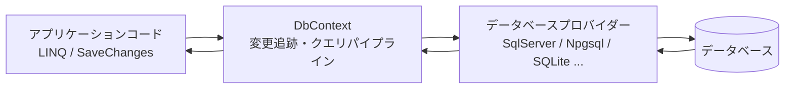
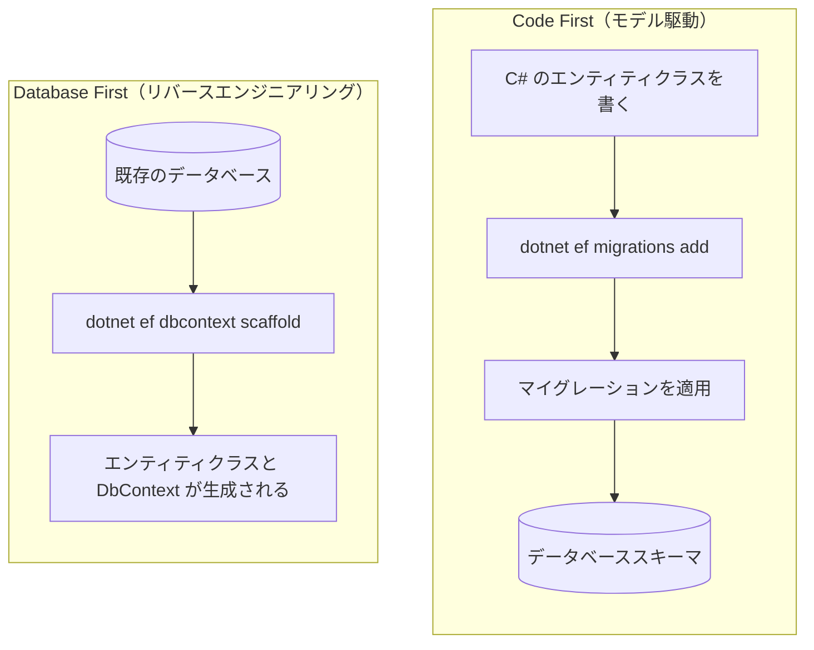
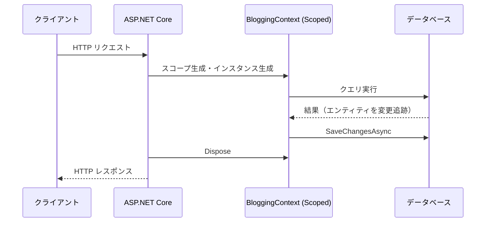
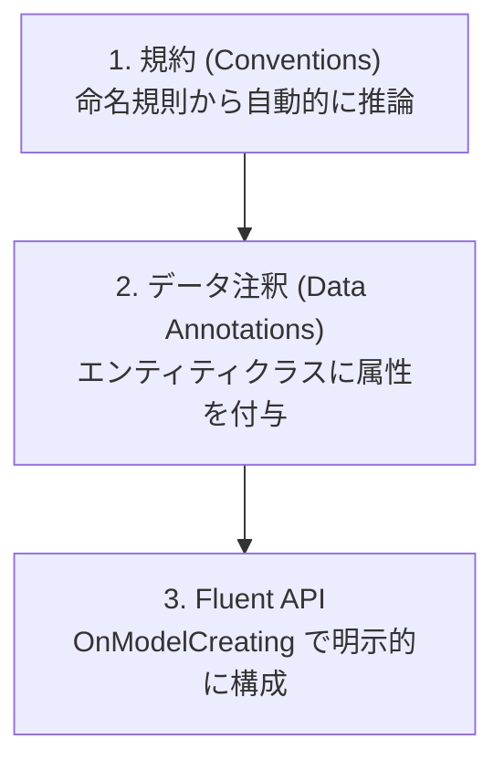
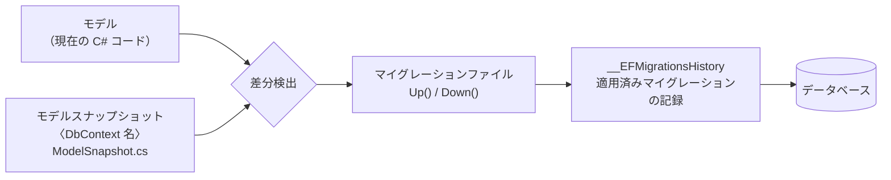
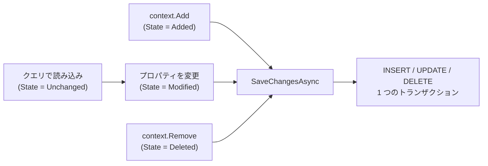
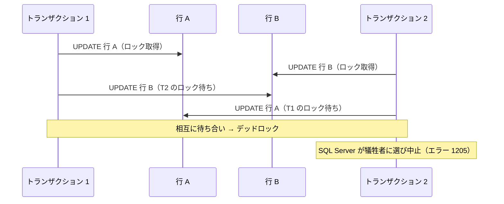
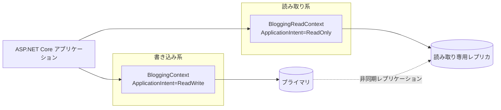
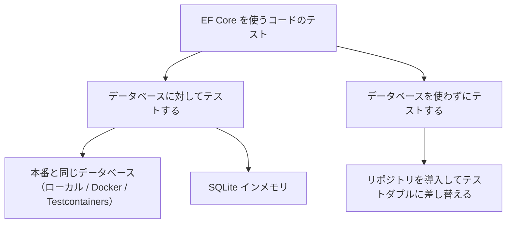
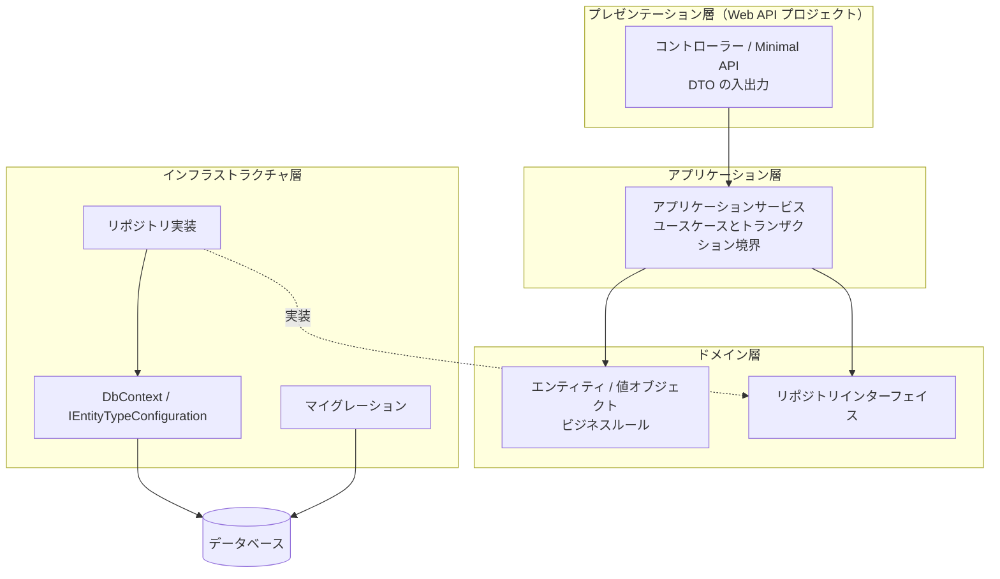

この章では、ASP.NET Core アプリケーションからリレーショナルデータベースにアクセスする標準的な方法である **Entity Framework Core (EF Core)** を扱います。モデルの定義からクエリ、更新、トランザクション、パフォーマンス最適化、そしてテスト戦略までを順に見ていきます。

DI コンテナーへの登録やライフタイムの考え方は [第6章：依存性注入 (DI)](../06-dependency-injection/index.md)、接続文字列の管理は [第5章：アプリ設定 (Configuration)](../05-configuration/index.md) を前提としています。

---

## 目次

1. [概要と設計方針](#1-概要と設計方針)
   - [EF Core とは](#ef-core-とは)
   - [O/R マッパーの位置づけ](#or-マッパーの位置づけ)
   - [データベースプロバイダーの選択](#データベースプロバイダーの選択)
   - [Code First と Database First](#code-first-と-database-first)
   - [パッケージの追加とツールの準備](#パッケージの追加とツールの準備)
2. [モデル定義と DbContext 設計](#2-モデル定義と-dbcontext-設計)
   - [エンティティクラスの定義](#エンティティクラスの定義)
   - [DbContext の定義](#dbcontext-の定義)
   - [DI への登録と接続文字列](#di-への登録と接続文字列)
   - [DbContext のライフタイムとスレッド安全性](#dbcontext-のライフタイムとスレッド安全性)
   - [規約・データ注釈・Fluent API](#規約データ注釈fluent-api)
   - [IEntityTypeConfiguration による構成の分割](#ientitytypeconfiguration-による構成の分割)
   - [リレーションシップの定義](#リレーションシップの定義)
   - [値の変換・所有型・複合型](#値の変換所有型複合型)
   - [継承のマッピング](#継承のマッピング)
   - [シャドウプロパティとバッキングフィールド](#シャドウプロパティとバッキングフィールド)
   - [シーケンスによる採番](#シーケンスによる採番)
   - [計算列](#計算列)
   - [コマンドのタイムアウト](#コマンドのタイムアウト)
   - [一括構成規約前の構成](#一括構成規約前の構成)
   - [グローバルクエリフィルターと名前付きクエリフィルター](#グローバルクエリフィルターと名前付きクエリフィルター)
3. [マイグレーションとスキーマ管理](#3-マイグレーションとスキーマ管理)
   - [マイグレーションの仕組み](#マイグレーションの仕組み)
   - [マイグレーションの作成と適用](#マイグレーションの作成と適用)
   - [生成されたマイグレーションを読む](#生成されたマイグレーションを読む)
   - [既定値の制約に名前を付ける](#既定値の制約に名前を付ける)
   - [本番環境への適用戦略](#本番環境への適用戦略)
   - [SQL スクリプトとマイグレーションバンドル](#sql-スクリプトとマイグレーションバンドル)
   - [起動時マイグレーションの是非](#起動時マイグレーションの是非)
   - [初期データの投入（シード）](#初期データの投入シード)
   - [設計時 DbContext ファクトリ](#設計時-dbcontext-ファクトリ)
4. [クエリ操作と LINQ](#4-クエリ操作と-linq)
   - [基本的なクエリ](#基本的なクエリ)
   - [クエリはいつ実行されるか](#クエリはいつ実行されるか)
   - [変更追跡と AsNoTracking](#変更追跡と-asnotracking)
   - [関連データの読み込み](#関連データの読み込み)
   - [遅延読み込みと N+1 問題](#遅延読み込みと-n1-問題)
   - [単一クエリと分割クエリ](#単一クエリと分割クエリ)
   - [投影 (Projection) による最適化](#投影-projection-による最適化)
   - [ページング](#ページング)
   - [LeftJoin / RightJoin 演算子](#leftjoin--rightjoin-演算子)
   - [生の SQL を使う](#生の-sql-を使う)
5. [更新／変更操作とトランザクション](#5-更新変更操作とトランザクション)
   - [追加・更新・削除の基本](#追加更新削除の基本)
   - [SaveChanges の既定のトランザクション動作](#savechanges-の既定のトランザクション動作)
   - [保存のバッチ処理](#保存のバッチ処理)
   - [データベーストリガーがあるテーブルの保存](#データベーストリガーがあるテーブルの保存)
   - [明示的なトランザクション制御](#明示的なトランザクション制御)
   - [セーブポイント](#セーブポイント)
   - [一括更新・一括削除](#一括更新一括削除)
   - [楽観的同時実行制御](#楽観的同時実行制御)
   - [分離レベルによる同時実行制御](#分離レベルによる同時実行制御)
   - [接続の回復性とトランザクションの併用](#接続の回復性とトランザクションの併用)
   - [デッドロックへの対処](#デッドロックへの対処)
   - [インターセプターによる横断的な処理](#インターセプターによる横断的な処理)
6. [パフォーマンス最適化](#6-パフォーマンス最適化)
   - [まず計測する](#まず計測する)
   - [クエリタグでログと LINQ を結びつける](#クエリタグでログと-linq-を結びつける)
   - [インデックスを正しく張る](#インデックスを正しく張る)
   - [DbContext プーリング](#dbcontext-プーリング)
   - [コレクションのパラメーター化と IN 句の翻訳](#コレクションのパラメーター化と-in-句の翻訳)
   - [コンパイル済みクエリ](#コンパイル済みクエリ)
   - [コンパイル済みモデル](#コンパイル済みモデル)
   - [バッファリングとストリーミング](#バッファリングとストリーミング)
   - [非同期 API を使う](#非同期-api-を使う)
   - [ログとセキュリティ](#ログとセキュリティ)
7. [読み取り専用レプリカ (Read-Only Replica) の扱い](#7-読み取り専用レプリカ-read-only-replica-の扱い)
   - [読み取りスケールアウトの仕組み](#読み取りスケールアウトの仕組み)
   - [データ整合性と遅延の制約](#データ整合性と遅延の制約)
   - [EF Core 側での読み書き分離](#ef-core-側での読み書き分離)
   - [読み取り専用 DbContext の設計](#読み取り専用-dbcontext-の設計)
   - [どのクエリをレプリカに流すか](#どのクエリをレプリカに流すか)
8. [テスト戦略とアーキテクチャ例](#8-テスト戦略とアーキテクチャ例)
   - [テスト戦略の選択](#テスト戦略の選択)
   - [InMemory プロバイダーが推奨されない理由](#inmemory-プロバイダーが推奨されない理由)
   - [実データベースに対するテスト](#実データベースに対するテスト)
   - [SQLite インメモリを使ったテスト](#sqlite-インメモリを使ったテスト)
   - [リポジトリパターンとモック](#リポジトリパターンとモック)
   - [WebApplicationFactory を使った統合テスト](#webapplicationfactory-を使った統合テスト)
   - [アーキテクチャ例：レイヤー構成のまとめ](#アーキテクチャ例レイヤー構成のまとめ)
9. [参考ドキュメント](#9-参考ドキュメント)

---

## 1. 概要と設計方針

### EF Core とは

Entity Framework Core (EF Core) は、.NET 向けの軽量かつ拡張可能なオープンソースの **O/R マッパー (Object-Relational Mapper)** です。データベースのテーブルを C# のクラス（エンティティ）にマッピングし、SQL を直接書く代わりに LINQ でクエリを表現できます。

EF Core は大きく次の 3 つの役割を担います。

| 役割 | 内容 |
| --- | --- |
| クエリの変換 | LINQ 式ツリーを解析し、プロバイダーごとの SQL に変換して実行する |
| 変更追跡 (Change Tracking) | 読み込んだエンティティの変更を記録し、`SaveChanges` で INSERT / UPDATE / DELETE に変換する |
| スキーマ管理 | モデルの差分からマイグレーションを生成し、データベーススキーマを更新する |



本章では .NET 10 / EF Core 10 を前提とします。EF Core のバージョンは .NET のバージョンに追随しており、EF Core 10 は .NET 10 と同じく LTS (Long Term Support) リリースです。

### O/R マッパーの位置づけ

.NET でデータベースにアクセスする手段は EF Core だけではありません。用途に応じて選択します。

| 手段 | 特徴 | 向いている場面 |
| --- | --- | --- |
| EF Core | LINQ、変更追跡、マイグレーションを備えたフル機能の O/R マッパー | 一般的な業務アプリケーション。読み書き両方を扱う |
| Dapper などのマイクロ O/R マッパー | SQL を自分で書き、結果をオブジェクトにマッピングするだけ | SQL を完全に制御したい、複雑な集計クエリ |
| ADO.NET (`DbConnection` / `DbCommand`) | 最も低レベルな API | 特殊な最適化や、プロバイダー固有の機能を直接使う場合 |

EF Core でも後述する `FromSql` によって生の SQL を書けるため、「基本は EF Core、一部のクエリだけ SQL を直接書く」という組み合わせが現実的な選択になります。

> [!NOTE]
> 他言語の O/R マッパーと比較すると、EF Core は **Java の Spring Data JPA / Hibernate** に最も近い位置づけです。エンティティクラスの定義、変更追跡（Hibernate の永続化コンテキストに相当）、スキーマ生成といった考え方が共通しています。**Python の Django ORM** はモデルクラスとマイグレーションを備える点が似ていますが、Django ORM がモデルクラス自身にクエリ API を持たせる (`Blog.objects.filter(...)`) のに対し、EF Core は `DbContext` を経由します。**TypeScript の NestJS** では TypeORM や Prisma、**PHP の Laravel** では Eloquent、**Go の Gin / Echo** では GORM が同種の役割を担います。

### データベースプロバイダーの選択

EF Core 自体はデータベースに依存せず、**プロバイダー** と呼ばれる NuGet パッケージを追加することで各データベースに対応します。

| データベース | パッケージ | 提供元 | 公式一覧の記載 |
| --- | --- | --- | --- |
| SQL Server / Azure SQL / Azure Synapse Analytics | `Microsoft.EntityFrameworkCore.SqlServer` | EF Core プロジェクト (Microsoft) | 8, 9, 10 |
| SQLite | `Microsoft.EntityFrameworkCore.Sqlite` | EF Core プロジェクト (Microsoft) | 8, 9, 10 |
| Azure Cosmos DB for NoSQL | `Microsoft.EntityFrameworkCore.Cosmos` | EF Core プロジェクト (Microsoft) | 8, 9, 10 |
| PostgreSQL | `Npgsql.EntityFrameworkCore.PostgreSQL` | Npgsql Development Team | 8, 9 |
| MySQL / MariaDB | `Pomelo.EntityFrameworkCore.MySql` | Pomelo Foundation Project | 8, 9 |

> [!WARNING]
> **プロバイダーは EF Core のメジャーバージョンをまたいで動作しません。** 公式ドキュメントは「EF Core 8 向けにリリースされたプロバイダーは EF Core 9 では動作しない」と明記しています。EF Core のバージョンを上げるときは、使っているプロバイダーが対応済みかを必ず先に確認してください。
>
> 上の表の最終列は **公式のプロバイダー一覧に記載されている値** です。ただし、この一覧は Microsoft 以外が提供するプロバイダーの最新状況に追いついていないことがあります。実際に NuGet の安定版を復元して確かめると、執筆時点では次のようになりました。
>
> | パッケージ | 復元された安定版 | EF Core 10 のプロジェクトに追加した結果 |
> | --- | --- | --- |
> | `Npgsql.EntityFrameworkCore.PostgreSQL` | 10.0.3 | 警告なし。実際に PostgreSQL 16 へ接続してクエリと保存が動作 |
> | `Pomelo.EntityFrameworkCore.MySql` | 9.0.0 | **`NU1608` 警告**（下記）。ビルドは通るが、実行すると例外で落ちる |
>
> ```text
> warning NU1608: 依存関係の制約外で検出されたパッケージのバージョン:
> Pomelo.EntityFrameworkCore.MySql 9.0.0 では
> Microsoft.EntityFrameworkCore.Relational (>= 9.0.0 && <= 9.0.999) が必要ですが、
> バージョン Microsoft.EntityFrameworkCore.Relational 10.0.11 は解決されました。
> ```
>
> この警告を無視してそのまま MySQL 8 に接続すると、実行時に次の例外になります。**ビルドが通ることは動作の保証になりません。**
>
> ```text
> System.MissingMethodException: Method not found:
> 'System.String Microsoft.EntityFrameworkCore.Diagnostics.AbstractionsStrings.ArgumentIsEmpty(System.Object)'.
> ```
>
> つまり **公式一覧だけでも NuGet だけでも判断せず、両方を確認してください。** サードパーティー製プロバイダーを使うプロジェクトでは、EF Core のバージョンをプロバイダーの対応状況に合わせて決めるのが安全です。

> [!IMPORTANT]
> 1 つの `DbContext` インスタンスに設定できるプロバイダーは 1 つだけです。同じ `DbContext` の型を別々のインスタンスで異なるプロバイダーに接続することは可能ですが、単一のインスタンスが複数のプロバイダーを使うことはできません。

### Code First と Database First

EF Core でモデルとデータベースを対応づけるアプローチは 2 つあります。



| アプローチ | 使いどころ |
| --- | --- |
| Code First | 新規開発。スキーマの変更履歴をソース管理に残せる |
| Database First | 既存データベースがある場合や、DBA がスキーマを管理している場合 |

本章では Code First を中心に説明します。Database First の場合は次のコマンドでエンティティと `DbContext` を生成します。

```bash
dotnet ef dbcontext scaffold "Server=(localdb)\mssqllocaldb;Database=Blogging;Trusted_Connection=True" Microsoft.EntityFrameworkCore.SqlServer --output-dir Models
```

> [!WARNING]
> このコマンドをそのまま実行すると、**生成された `DbContext` の `OnConfiguring` に接続文字列がそのまま埋め込まれます**。SQL Server 2022 に対して実際に実行したところ、パスワードを含む接続文字列がソースコードに書き出され、あわせて次の `#warning` が生成されました。
>
> ```csharp
> protected override void OnConfiguring(DbContextOptionsBuilder optionsBuilder)
> #warning To protect potentially sensitive information in your connection string, you should move it out of source code.
>     => optionsBuilder.UseSqlServer("Server=...;User Id=sa;Password=...");
> ```
>
> 公式ドキュメントは、これは「生成されたコードが最初に使うときにいきなり動かないという体験を避けるため」であり、**接続文字列が製品コードに存在してはならない**と明記しています。`--no-onconfiguring` オプションを付けると `OnConfiguring` の生成そのものを抑止でき、実測でも接続文字列を含まない、DI 用のコンストラクターだけを持つクラスが生成されました。
>
> ```bash
> dotnet ef dbcontext scaffold "<接続文字列>" Microsoft.EntityFrameworkCore.SqlServer \
>     --output-dir Models --no-onconfiguring
> ```

### パッケージの追加とツールの準備

Web API プロジェクトに SQL Server プロバイダーを追加します。

```bash
dotnet add package Microsoft.EntityFrameworkCore.SqlServer
dotnet add package Microsoft.EntityFrameworkCore.Design
```

`Microsoft.EntityFrameworkCore.Design` は、マイグレーションの生成やスキャフォールディングといった **設計時 (design-time)** の操作に必要です。実行時には不要ですが、`dotnet ef` コマンドを使うプロジェクトには追加しておきます。

続いて EF Core のコマンドラインツールをインストールします。

```bash
dotnet tool install --global dotnet-ef
```

すでにインストール済みの場合は更新します。

```bash
dotnet tool update --global dotnet-ef
```

インストールを確認します。

```bash
dotnet ef --version
```

> [!TIP]
> チーム開発では、グローバルツールの代わりに **ローカルツール** としてリポジトリに固定すると、開発者間でバージョンを揃えられます。`dotnet new tool-manifest` を実行してから `dotnet tool install dotnet-ef` を実行すると、ツールマニフェストファイルにバージョンが記録されます。このファイルをリポジトリにコミットしておけば、他の開発者は `dotnet tool restore` を実行するだけで同じバージョンを復元できます。実測では、マニフェストに `"version": "10.0.11"` が記録され、`dotnet tool restore` で復元できることを確認しました。

<details>
<summary>Visual Studio のパッケージマネージャーコンソールを使う場合</summary>

Visual Studio では、`Microsoft.EntityFrameworkCore.Tools` パッケージを追加すると、パッケージマネージャーコンソールから PowerShell コマンドを使用できます。

```powershell
Install-Package Microsoft.EntityFrameworkCore.Tools
```

以降、本章で紹介する `dotnet ef` コマンドは、次のように読み替えられます。

| .NET CLI | パッケージマネージャーコンソール |
| --- | --- |
| `dotnet ef migrations add <Name>` | `Add-Migration <Name>` |
| `dotnet ef database update` | `Update-Database` |
| `dotnet ef migrations script` | `Script-Migration` |
| `dotnet ef migrations remove` | `Remove-Migration` |

</details>

---

## 2. モデル定義と DbContext 設計

### エンティティクラスの定義

エンティティは特別な基底クラスを継承しない、単なる C# クラス（POCO: Plain Old CLR Object）として定義します。ブログと投稿という典型的な 1 対多の関係を例にします。

```csharp
namespace BloggingApi.Models;

public class Blog
{
    public int Id { get; set; }
    public required string Name { get; set; }
    public required string Url { get; set; }
    public int Rating { get; set; }
    public DateTimeOffset CreatedAt { get; set; }

    // ナビゲーションプロパティ（1 対多の「多」側）
    public List<Post> Posts { get; set; } = [];
    public List<Contributor> Contributors { get; set; } = [];
}

public class Post
{
    public int Id { get; set; }
    public required string Title { get; set; }
    public string? Content { get; set; }
    public DateTimeOffset PublishedAt { get; set; }

    // 外部キー
    public int BlogId { get; set; }

    // ナビゲーションプロパティ（1 対多の「1」側）
    public Blog? Blog { get; set; }
}

public class Contributor
{
    public int Id { get; set; }
    public required string DisplayName { get; set; }

    public int BlogId { get; set; }
    public Blog? Blog { get; set; }
}
```

ここで使っている C# の機能を整理します。

| 機能 | 意味 |
| --- | --- |
| `required` 修飾子 | オブジェクト初期化時に値の設定を必須にする。EF Core では非 null の必須列としてマッピングされる |
| `string?` | null 許容参照型。EF Core はこれを NULL 許容列としてマッピングする |
| `= []` | コレクション式による空のリストの初期化 |

> [!IMPORTANT]
> プロジェクトで **null 許容参照型 (Nullable Reference Types)** が有効（`<Nullable>enable</Nullable>`。.NET 6 以降のテンプレートでは既定）になっていると、EF Core は `string` を NOT NULL 列、`string?` を NULL 許容列として扱います。意図しない NOT NULL 制約を避けるため、null を許す列は必ず `?` を付けます。

> [!TIP]
> **コード分析ルールとの衝突について。** プロジェクトで `<AnalysisLevel>latest-all</AnalysisLevel>` のように厳しいコード分析を有効にすると、上のエンティティ定義に対して次のような警告が出ます（実測で確認）。
>
> | ルール | 内容 |
> | --- | --- |
> | `CA1002` | `List<Post>` ではなく `Collection<T>` を公開すべき |
> | `CA2227` | コレクションプロパティのセッターを削除して読み取り専用にすべき |
> | `CA1056` | `Url` プロパティは `string` ではなく `Uri` にすべき |
>
> これらは汎用のライブラリ設計を想定したルールであり、**EF Core のエンティティには当てはまりません。** EF Core はコレクションナビゲーションの設定やリレーションシップの修正のためにセッターを利用しますし、`Uri` 型は標準では列にマッピングされません。エンティティを置いたフォルダーに対して、`.editorconfig` でこれらのルールを無効化するのが実務上の対応です。
>
> ```ini
> # プロジェクト直下の Models フォルダーを対象にする場合
> [Models/*.cs]
> dotnet_diagnostic.CA1002.severity = none
> dotnet_diagnostic.CA2227.severity = none
> dotnet_diagnostic.CA1056.severity = none
> ```
>
> パスは **`.editorconfig` を置いた場所からの相対パス** で解釈されます。`Models` がプロジェクト直下にあるとき、`[**/Models/*.cs]` と書くと**マッチせず抑制されません**（実測で確認）。意図したファイルに効いているかどうかは、ビルドして警告が消えることで必ず確かめてください。

### DbContext の定義

`DbContext` は、エンティティのセット（`DbSet<T>`）を公開し、クエリと保存の起点となるクラスです。

```csharp
using Microsoft.EntityFrameworkCore;
using BloggingApi.Models;

namespace BloggingApi.Data;

public class BloggingContext : DbContext
{
    public BloggingContext(DbContextOptions<BloggingContext> options)
        : base(options)
    {
    }

    public DbSet<Blog> Blogs => Set<Blog>();
    public DbSet<Post> Posts => Set<Post>();

    protected override void OnModelCreating(ModelBuilder modelBuilder)
    {
        // ここでモデルの詳細を構成する（後述）
    }
}
```

> [!TIP]
> `public DbSet<Blog> Blogs { get; set; }` と書く例も多く見られますが、`=> Set<Blog>()` の式形式にしておくと、null 許容参照型が有効な環境で「初期化されていない」という警告を避けられます。動作はどちらも同じです。

`DbContextOptions<BloggingContext>` を受け取るコンストラクターは、DI から構成を受け取るために必要です。

### DI への登録と接続文字列

`Program.cs` で `AddDbContext` を呼び出して DI コンテナーに登録します。

```csharp
using Microsoft.EntityFrameworkCore;
using BloggingApi.Data;

var builder = WebApplication.CreateBuilder(args);

var connectionString = builder.Configuration.GetConnectionString("BloggingDatabase")
    ?? throw new InvalidOperationException("接続文字列 'BloggingDatabase' が見つかりません。");

builder.Services.AddDbContext<BloggingContext>(options =>
    options.UseSqlServer(connectionString));

builder.Services.AddControllers();

var app = builder.Build();

app.MapControllers();

app.Run();
```

接続文字列は `appsettings.json` の `ConnectionStrings` セクションに置きます。

```json
{
  "ConnectionStrings": {
    "BloggingDatabase": "Server=(localdb)\\mssqllocaldb;Database=Blogging;Trusted_Connection=True;MultipleActiveResultSets=true"
  }
}
```

> [!WARNING]
> 本番環境の接続文字列に ID とパスワードを直接書かないでください。ローカル開発ではユーザーシークレット、本番環境では環境変数や Azure Key Vault、あるいは Microsoft Entra ID によるパスワードレス認証を使います。構成プロバイダーの優先順位とシークレット管理については [第5章：アプリ設定 (Configuration)](../05-configuration/index.md) を参照してください。

登録した `DbContext` は、コントローラーやサービスにコンストラクターインジェクションで注入します。

```csharp
using Microsoft.AspNetCore.Mvc;
using Microsoft.EntityFrameworkCore;
using BloggingApi.Data;
using BloggingApi.Models;

namespace BloggingApi.Controllers;

[ApiController]
[Route("api/[controller]")]
public class BlogsController(BloggingContext context) : ControllerBase
{
    [HttpGet]
    public async Task<ActionResult<IEnumerable<Blog>>> GetBlogs(CancellationToken cancellationToken)
        => await context.Blogs.AsNoTracking().ToListAsync(cancellationToken);
}
```

> [!TIP]
> 上記は C# 12 の **プライマリコンストラクター** を使った書き方です。フィールドへの代入を書かずに `context` をメソッド内で参照できます。詳細は [第6章：プライマリコンストラクターによる注入（C# 12）](../06-dependency-injection/index.md#プライマリコンストラクターによる注入c-12) を参照してください。

#### EF Core 10 は接続文字列に Application Name を追加する

EF Core 10 からは、接続文字列に `Application Name` が指定されていない場合、EF Core が自身と SqlClient のバージョン情報を含む値を **自動的に追加** します。実際に SQL Server プロバイダーで確認すると、次のように書き換えられます。

```text
[渡した接続文字列]
Server=localhost;Database=Test;Trusted_Connection=True;TrustServerCertificate=True

[EF Core が使う文字列]
Data Source=localhost;Initial Catalog=Test;Integrated Security=True;
Trust Server Certificate=True;Application Name="EFCore/10.0.11 (macOS 26.6.2 Arm64)"
```

ほとんどの場合は影響しませんが、**同じデータベースに EF Core と Dapper や ADO.NET などを併用している場合は注意が必要です。** SqlClient は接続文字列が異なると別の接続プールを使うため、両者が別々のプールに分かれます。この状態で `TransactionScope` を使うと、SqlClient が 2 つの異なるリソースとみなして、これまで不要だった **分散トランザクションへの昇格** を試みます。

> [!WARNING]
> **.NET 7 以降、暗黙の昇格は既定で無効化されています。** そのため実際に起きるのは「昇格して動き続ける」ことではなく、**その場で例外が投げられてアプリケーションが止まる** ことです。Windows Server 2022 + SQL Server 2022 + .NET 10 で `TransactionScope` の中から接続文字列の違う接続を 2 本開いたところ、2 本目の `Open()` で次の例外が発生しました。
>
> ```text
> System.NotSupportedException: Implicit distributed transactions have not been enabled.
> If you're intentionally starting a distributed transaction, set
> TransactionManager.ImplicitDistributedTransactions to true.
> ```
>
> `TransactionManager.ImplicitDistributedTransactions = true`（Windows 専用の API です）を設定したうえで同じコードを実行すると、2 本目の `Open()` の直後に `Transaction.Current.TransactionInformation.DistributedIdentifier` が `Guid.Empty` から実際の GUID に変わり、MSDTC (Microsoft Distributed Transaction Coordinator) への昇格が起きたことを確認できました。Linux や macOS では MSDTC 自体が存在しないため、この設定を有効にしても昇格はできません。

同じ環境で条件を変えて測ったところ、昇格するかどうかは次のように分かれました。

| `TransactionScope` 内での操作 | 昇格するか |
| --- | --- |
| 同じ接続文字列の接続を 2 本 **同時に** 開く | 昇格する |
| 同じ接続文字列で、1 本目を閉じてから 2 本目を開く | **昇格しない** |
| `Application Name` だけが違う接続を 2 本同時に開く | 昇格する |
| `Application Name` だけが違う接続を、1 本目を閉じてから 2 本目を開く | **昇格する** |

つまり、接続を律儀に閉じてから次を開く書き方をしていれば以前は昇格しなかったのに、EF Core 10 が `Application Name` を自動で足したことで昇格するようになる、というのがこの破壊的変更の実害です。

回避するには、接続文字列に `Application Name` を明示的に指定します。一度指定すると EF Core は上書きせず、渡した接続文字列がそのまま使われます。SQL Server 2022 に接続して `sys.dm_exec_sessions` の `program_name` を確認したところ、指定しない場合は `EFCore/10.0.11 (macOS 26.6.2 Arm64)`、明示した場合は `BloggingApi` となり、サーバー側から見える値も切り替わることを確認しています。

```json
{
  "ConnectionStrings": {
    "BloggingDatabase": "Server=...;Database=Blogging;Trusted_Connection=True;Application Name=BloggingApi"
  }
}
```

### DbContext のライフタイムとスレッド安全性

`AddDbContext` は `DbContext` を **Scoped** サービスとして登録します。ASP.NET Core では 1 つの HTTP リクエストが 1 つのスコープに対応するため、リクエストごとに `DbContext` インスタンスが作られ、リクエスト終了時に破棄されます。

> [!IMPORTANT]
> Scoped であることの帰結として、**`DbContext` を Singleton サービスのコンストラクターで受け取ることはできません。** そうすると、アプリケーションの起動時に次の例外が発生します（開発環境ではスコープの検証が既定で有効になっているため、リクエストを受ける前に検出されます）。
>
> ```text
> System.InvalidOperationException: Cannot consume scoped service
> 'Microsoft.EntityFrameworkCore.DbContextOptions`1[BloggingContext]'
> from singleton 'MyBackgroundService'.
> ```
>
> この状況の解決策は後述の `IServiceScopeFactory` か `IDbContextFactory<T>` です。なお、`AddDbContext` でプロバイダー（`UseSqlServer` など）の指定を忘れた場合は、解決時に別の例外になります。
>
> ```text
> System.InvalidOperationException: No database provider has been configured for this DbContext.
> ```



`DbContext` は 1 つの **作業単位 (unit-of-work)** を表すよう設計されており、公式ドキュメントは次の点を明記しています。

- `DbContext` は **スレッドセーフではない**。複数のスレッドで同じインスタンスを共有してはいけない
- 非同期メソッドは必ず `await` してから、次の操作でインスタンスを使う
- EF Core が投げる `InvalidOperationException` はコンテキストを回復不能な状態にすることがあり、握りつぶして処理を続行してはいけない

> [!WARNING]
> `DbContext` は **スレッドセーフではありません。** 同じインスタンスに対して複数の操作を同時に実行すると、次の例外が発生します。
>
> ```text
> System.InvalidOperationException: A second operation was started on this context instance
> before a previous operation completed. This is usually caused by different threads
> concurrently using the same instance of DbContext.
> ```
>
> 並列にクエリを実行したい場合は、後述する `IDbContextFactory<T>` でインスタンスを分けます。

> [!WARNING]
> やっかいなのは、**この例外がいつも出るとは限らない**ことです。SQLite のように同期的な I/O を行うプロバイダーでは、`Task.WhenAll(context.Blogs.ToListAsync(), context.Posts.ToListAsync())` のような書き方をしても各クエリが順番に完了してしまい、例外が発生しないことがあります（実際に 20 回試行して 1 度も発生しませんでした）。一方、`Task.Run` で明確に別スレッドから実行すると確実に例外になります。
>
> つまり **SQLite を使った単体テストでは問題が表面化せず、本番の SQL Server で初めて落ちる**、ということが起こり得ます。「テストが通ったから安全」と考えず、1 つの `DbContext` インスタンスを複数の処理で共有しない設計を徹底してください。

> [!WARNING]
> 上の例外を出しているのは EF Core の **同時実行検出 (concurrency detection)** という仕組みで、`DbContextOptionsBuilder.EnableThreadSafetyChecks(false)` で無効にできます。公式ドキュメントは「わずかな性能向上が得られるが、`DbContext` インスタンスが同時に使われた場合の **動作は未定義になり、プログラムは予測できない形で失敗する可能性がある**」と説明し、「性能向上が相当なものであることを確認し、アプリケーションを同時実行のバグについて十分にテストしたうえでのみ無効化すること」と釘を刺しています。
>
> 実際に SQL Server 2022 に対して、同じ `DbContext` インスタンスから 2 本のクエリを `Task.Run` で並行実行する処理を、検出の有無を変えて 3 回ずつ試したところ、次の結果になりました（実測で確認）。
>
> | 同時実行検出 | 発生した例外 |
> | --- | --- |
> | 有効（既定） | 3 回とも `InvalidOperationException: A second operation was started on this context instance before a previous operation completed.`（原因と対処ページへのリンク付き） |
> | 無効 | 1 回目: `InvalidOperationException`（接続が閉じられていない旨）<br>2 回目: `InvalidOperationException`（同上、接続状態の表示だけが異なる）<br>3 回目: `InvalidCastException: Unable to cast object of type 'Microsoft.Data.ProviderBase.DbConnectionClosedConnecting' to type 'Microsoft.Data.SqlClient.SqlInternalConnectionTds'.` |
>
> 検出を無効にすると、**実行のたびに違う低レベルの例外が出て、原因にたどり着けなくなります。** 公式が言う「予測できない形で失敗する」とはこのことです。この設定は原則として既定のままにしてください。

Singleton サービスやバックグラウンドサービスから `DbContext` を使う場合は、`IServiceScopeFactory` でスコープを作るか、`IDbContextFactory<T>` を使います。

```csharp
builder.Services.AddDbContextFactory<BloggingContext>(options =>
    options.UseSqlServer(connectionString));
```

> [!IMPORTANT]
> `AddDbContextFactory` は、`IDbContextFactory<BloggingContext>` を **Singleton** として登録すると同時に、`BloggingContext` そのものも **Scoped** で登録します（実測で確認）。したがって、コントローラーで `BloggingContext` を直接受け取ることも、バックグラウンドサービスでファクトリーからインスタンスを作ることも、両方できます。ただし **ファクトリーで作ったインスタンスは DI コンテナーが破棄してくれない**ため、下の例のように `await using` で必ず自分で破棄してください。

```csharp
public class ReportGenerator(IDbContextFactory<BloggingContext> contextFactory)
{
    public async Task<int> CountBlogsAsync(CancellationToken cancellationToken)
    {
        // ファクトリで作成したインスタンスはアプリケーション側で破棄する
        await using var context = await contextFactory.CreateDbContextAsync(cancellationToken);
        return await context.Blogs.CountAsync(cancellationToken);
    }
}
```

> [!NOTE]
> **Spring Boot** の `EntityManager` は `@PersistenceContext` によって注入されますが、そのスコープはリクエスト単位ではなく **トランザクションスコープ** です（Jakarta Persistence の仕様が「特に指定しなければトランザクションスコープの永続化コンテキストが使われる」と定めています）。EF Core の `DbContext` は明示的に Scoped として登録され、`SaveChangesAsync` の呼び出しが保存の契機になる点が異なります。**Django** の ORM は 1 つのスレッドが 1 つの接続を保持する形で暗黙的に接続を管理しますが、EF Core はインスタンスの寿命を DI コンテナーが管理します。

### 規約・データ注釈・Fluent API

EF Core はモデルを 3 段階で構成します。優先順位は下にあるものほど強くなります。



| 段階 | 例 | 特徴 |
| --- | --- | --- |
| 規約 | `Id` または `<型名>Id` という名前のプロパティが主キーになる | 記述不要。既定の動作 |
| データ注釈 | `[MaxLength(200)]`、`[Required]` | エンティティクラスを見れば制約が分かる |
| Fluent API | `modelBuilder.Entity<Blog>().Property(b => b.Name).HasMaxLength(200)` | 最も表現力が高く、エンティティクラスを変更せずに構成できる |

データ注釈による例です。

```csharp
using System.ComponentModel.DataAnnotations;
using System.ComponentModel.DataAnnotations.Schema;

public class Blog
{
    public int Id { get; set; }

    [MaxLength(200)]
    public required string Name { get; set; }

    [MaxLength(2000)]
    public required string Url { get; set; }

    [Column(TypeName = "datetimeoffset(0)")]
    public DateTimeOffset CreatedAt { get; set; }
}
```

同じ構成を Fluent API で書くと次のようになります。

```csharp
protected override void OnModelCreating(ModelBuilder modelBuilder)
{
    modelBuilder.Entity<Blog>(entity =>
    {
        entity.ToTable("Blogs");
        entity.HasKey(b => b.Id);

        entity.Property(b => b.Name)
            .IsRequired()
            .HasMaxLength(200);

        entity.Property(b => b.Url)
            .IsRequired()
            .HasMaxLength(2000);

        entity.Property(b => b.CreatedAt)
            .HasColumnType("datetimeoffset(0)");

        entity.HasIndex(b => b.Url).IsUnique();
    });
}
```

> [!TIP]
> データ注釈は検証（`System.ComponentModel.DataAnnotations`）とマッピングの両方で使われる属性が混在しており、意味が重なって分かりにくくなることがあります。永続化に関する構成は Fluent API に寄せ、エンティティクラスをドメインモデルとして保つ設計が扱いやすくなります。

### IEntityTypeConfiguration による構成の分割

エンティティが増えると `OnModelCreating` が肥大化します。エンティティごとに `IEntityTypeConfiguration<T>` を実装したクラスへ切り出せます。

```csharp
using Microsoft.EntityFrameworkCore;
using Microsoft.EntityFrameworkCore.Metadata.Builders;
using BloggingApi.Models;

namespace BloggingApi.Data.Configurations;

public class BlogConfiguration : IEntityTypeConfiguration<Blog>
{
    public void Configure(EntityTypeBuilder<Blog> builder)
    {
        builder.ToTable("Blogs");
        builder.HasKey(b => b.Id);

        builder.Property(b => b.Name)
            .IsRequired()
            .HasMaxLength(200);

        builder.Property(b => b.Url)
            .IsRequired()
            .HasMaxLength(2000);

        builder.HasIndex(b => b.Url).IsUnique();

        builder.HasMany(b => b.Posts)
            .WithOne(p => p.Blog)
            .HasForeignKey(p => p.BlogId)
            .OnDelete(DeleteBehavior.Cascade);
    }
}
```

アセンブリ内のすべての構成クラスをまとめて適用します。

```csharp
protected override void OnModelCreating(ModelBuilder modelBuilder)
{
    modelBuilder.ApplyConfigurationsFromAssembly(typeof(BloggingContext).Assembly);
}
```

> [!NOTE]
> `ApplyConfigurationsFromAssembly` が適用する順序は未定義です。構成の適用順に依存する記述は避けてください。また、パラメーターなしのコンストラクターを持つ型だけがインスタンス化され、引数が必要な型はスキップされて `SkippedEntityTypeConfigurationWarning` がログに記録されます。そのような構成クラスは `ApplyConfiguration` に手動で渡します。

### リレーションシップの定義

EF Core は、ナビゲーションプロパティと外部キープロパティの命名規約からリレーションシップを推論します。明示的に指定する場合は Fluent API を使います。

| 関係 | Fluent API | 例 |
| --- | --- | --- |
| 1 対多 | `HasMany(...).WithOne(...)` | Blog 1 件に Post が複数 |
| 1 対 1 | `HasOne(...).WithOne(...)` | Blog 1 件に BlogImage が 1 件 |
| 多対多 | `HasMany(...).WithMany(...)` | Post と Tag |

多対多は結合エンティティを定義しなくても構成できます。

```csharp
public class Post
{
    public int Id { get; set; }
    public required string Title { get; set; }
    public List<Tag> Tags { get; set; } = [];
}

public class Tag
{
    public int Id { get; set; }
    public required string Name { get; set; }
    public List<Post> Posts { get; set; } = [];
}
```

結合テーブルの名前を明示したい場合は、`UsingEntity` で指定します。指定しない場合、EF Core は規約に従って `PostTag` という名前のテーブルを生成します。

```csharp
modelBuilder.Entity<Post>()
    .HasMany(p => p.Tags)
    .WithMany(t => t.Posts)
    .UsingEntity(join => join.ToTable("PostTags"));
```

削除時の動作は `OnDelete` で指定します。

| `DeleteBehavior` | 動作 |
| --- | --- |
| `Cascade` | 親を削除すると子も削除される |
| `Restrict` | 子が存在する場合、親の削除を拒否する |
| `SetNull` | 子の外部キーを NULL にする（外部キーが NULL 許容である必要がある） |
| `NoAction` | データベースに制約の判断を委ねる |

### 値の変換・所有型・複合型

列の型とプロパティの型が一致しない場合は **値の変換 (Value Conversion)** を使います。列挙型を文字列として保存する例です。

```csharp
public enum PostStatus
{
    Draft,
    Published,
    Archived
}

public class Post
{
    public int Id { get; set; }
    public required string Title { get; set; }
    public PostStatus Status { get; set; }

    // この章の後半（一括更新・一括削除、関連データの読み込み）で使う
    public DateTimeOffset CreatedAt { get; set; }
    public DateTimeOffset? ArchivedAt { get; set; }
    public List<Comment> Comments { get; set; } = [];
}

public class Comment
{
    public int Id { get; set; }
    public required string Body { get; set; }

    public int PostId { get; set; }
    public Post? Post { get; set; }

    public int AuthorId { get; set; }
    public Author? Author { get; set; }
}
```

> [!NOTE]
> 「エンティティクラスの定義」で示した `Post` に、`Status` と後続の節で使うプロパティを追加した形です。この章では、説明する内容に応じてエンティティへプロパティを足しながら進めます。

`IEntityTypeConfiguration<Post>` の `Configure` メソッド（引数名 `builder`）の中で、次のように構成します。

```csharp
builder.Property(p => p.Status)
    .HasConversion<string>()
    .HasMaxLength(20);
```

これにより `Status` 列は `int` ではなく `"Draft"` のような文字列として保存され、SQL を直接見たときにも意味が分かるようになります。

> [!WARNING]
> **ミュータブルな型を値変換すると、変更が検知されずに失われます。** `List<string>` のようなコレクションを JSON に変換するケースがこれに当たります。EF Core は変更追跡のためにスナップショットを取りますが、`List<T>` は参照等価性を持ち、かつ内容を書き換えられるため、既定では「変更されていない」と判定されてしまいます。
>
> ここでは `Post` に、別テーブルにするほどではない検索キーワードの一覧を持たせる例で説明します。
>
> ```csharp
> public class Post
> {
>     // ...既存のプロパティ...
>     public List<string> Keywords { get; set; } = [];
> }
> ```
>
> ```csharp
> // 危険: 比較子を指定していない
> builder.Property(p => p.Keywords)
>     .HasConversion(
>         v => JsonSerializer.Serialize(v, (JsonSerializerOptions?)null),
>         v => JsonSerializer.Deserialize<List<string>>(v, (JsonSerializerOptions?)null)!);
> ```
>
> この状態で `post.Keywords.Add("csharp")` を実行し `SaveChanges` を呼んでも、実測では次のようになりました。
>
> | 構成 | `Entry(post).State` | `SaveChanges` の戻り値 | 再読み込みした結果 |
> | --- | --- | --- | --- |
> | 比較子なし | `Unchanged` | `0` | 追加した要素が**消える** |
> | 比較子あり | `Modified` | `1` | 追加した要素が保存される |
>
> 解決するには `HasConversion` の第 3 引数に `ValueComparer<T>`（`Microsoft.EntityFrameworkCore.ChangeTracking` 名前空間）を渡し、「等価判定」「ハッシュ計算」「スナップショット（複製）」の 3 つを指定します。
>
> ```csharp
> builder.Property(p => p.Keywords)
>     .HasConversion(
>         v => JsonSerializer.Serialize(v, (JsonSerializerOptions?)null),
>         v => JsonSerializer.Deserialize<List<string>>(v, (JsonSerializerOptions?)null)!,
>         new ValueComparer<List<string>>(
>             (a, b) => a!.SequenceEqual(b!),                                    // 中身で比較する
>             v => v.Aggregate(0, (acc, s) => HashCode.Combine(acc, s.GetHashCode())),
>             v => v.ToList()));                                                 // 複製してスナップショットを取る
> ```
>
> 公式ドキュメントは、そもそも**値変換には不変 (immutable) な型を使うことを推奨**しています。なお `HasConversion<string>()` のような列挙型から文字列への変換は、`string` も列挙型も不変なので比較子は不要です。

エンティティの一部を別のテーブルや別の型として切り出したい場合は **所有型 (Owned Entity Type)** を使います。所有型は独自の主キーを持たず、常に所有側のエンティティを通じてのみアクセスされます。

```csharp
modelBuilder.Entity<Author>()
    .OwnsOne(a => a.Address);
```

住所のように、それ自体は識別子を持たず、親エンティティのテーブルに展開したい値の集まりには **複合型 (Complex Type)** を使います。

```csharp
public class Address
{
    public required string PostalCode { get; set; }
    public required string Prefecture { get; set; }
    public required string Line1 { get; set; }
}

public class Author
{
    public int Id { get; set; }
    public required string Name { get; set; }
    public required Address Address { get; set; }
}
```

複合型は所有型と違って独立したエンティティにならないため、`OwnsOne` ではなく `ComplexProperty` で構成します。

```csharp
modelBuilder.Entity<Author>()
    .ComplexProperty(a => a.Address);
```

これにより `Authors` テーブルに `Address_PostalCode`、`Address_Prefecture`、`Address_Line1` という列が作られます。

> [!NOTE]
> EF Core 10 では複合型のサポートが大きく拡張され、`struct` や `record struct` を複合型として使えるようになったほか、JSON 列へのマッピングやテーブル分割にも対応しました。所有型と複合型はどちらも「エンティティの一部を別の型に切り出す」ものですが、所有型は内部的に独立したエンティティ型として扱われる（隠しキーを持つ）のに対し、複合型は識別子を持たない純粋な値です。**公式ドキュメントは、値としてのセマンティクスが欲しい用途ではすでに所有型を使っている場合も複合型への移行を推奨しています。**

> [!WARNING]
> EF Core 9 以前から複合型を使っている場合、**EF Core 10 へのアップグレードで列名が変わることがあります。** 公式の破壊的変更として次の 2 点が挙げられています。
>
> **1. ネストした複合型の列名がフルパスになる**
>
> `Entity.Complex.NestedComplex.Property` は、EF Core 9 までは直近の型名だけを使って `NestedComplex_Property` にマッピングされていましたが、EF Core 10 では途中の複合型もすべて含めた `Complex_NestedComplex_Property` になります。実際に SQL Server 2022 に対して生成された DDL は次のとおりでした（実測で確認）。
>
> ```sql
> CREATE TABLE [Holders] (
>     [Id] int NOT NULL IDENTITY,
>     [Complex_Own] nvarchar(max) NOT NULL,
>     [Complex_NestedComplex_Value] nvarchar(max) NOT NULL,
>     CONSTRAINT [PK_Holders] PRIMARY KEY ([Id])
> );
> ```
>
> **2. 複合型の列名が一意化される**
>
> 別々の複合型のプロパティが同じ列名になる場合、EF Core 9 までは何も言わずに同じ列を共有していました。EF Core 10 では末尾に数字を付けて一意化します。**意図せず同じ列にマッピングされてデータが壊れるのを防ぐため**の変更です。
>
> どちらも、旧来の列名を維持したい場合は `Property(...).HasColumnName(...)` で明示します。逆に「複数のプロパティで意図的に同じ列を共有したい」場合も同じ方法で指定でき、実測では両方の複合型に `HasColumnName("Street")` を指定すると `Street` 列 1 本だけが生成されました。
>
> ```csharp
> modelBuilder.Entity<Customer>(b =>
> {
>     b.ComplexProperty(c => c.ShippingAddress, p => p.Property(a => a.Street).HasColumnName("Street"));
>     b.ComplexProperty(c => c.BillingAddress, p => p.Property(a => a.Street).HasColumnName("Street"));
> });
> ```
>
> アップグレード時は `dotnet ef migrations add` で生成されるマイグレーションに `RenameColumn` が含まれていないかを必ず確認してください。

#### EF Core 10 の JSON 列は `json` 型になる（Azure SQL の破壊的変更）

`OwnsMany(...).ToJson()` のように所有型を JSON として保存する場合や、`string[]` のようなプリミティブコレクションを保存する場合、EF Core 9 までの SQL Server プロバイダーはこれを `nvarchar(max)` 列に格納していました。

EF Core 10 では、`UseAzureSql` を使っているか、**互換性レベル 170 以上**を構成している場合に限り、SQL Server の新しい `json` データ型にマッピングされます。逆に言えば、この条件を満たさない環境では EF Core 10 でも従来どおり `nvarchar(max)` のままです。実際に SQL Server 2022（互換性レベル 160）に対して `ToJson()` を使った所有型を作成したところ、列は `nvarchar(max)` になり、`{"Author":"x","Tags":["t1","t2"]}` という JSON がそのまま格納されることを確認しています。

一方、Azure SQL Database（Business Critical、互換性レベル 170）に対して `UseAzureSql` で同じモデルを作成すると、生成される DDL と `sys.columns` の両方で `json` 型になりました。JSON 内のプロパティを条件にした `Where(d => d.Meta.Author == "x")` もそのまま動作します。

```sql
-- Azure SQL に UseAzureSql で作成したときの実際の DDL
CREATE TABLE [Docs] (
    [Id] int NOT NULL IDENTITY,
    [Title] nvarchar(max) NOT NULL,
    [Meta] json NOT NULL,
    CONSTRAINT [PK_Docs] PRIMARY KEY ([Id])
);
```

```sql
-- EF Core 9 まで
[Tags] nvarchar(max)

-- EF Core 10（UseAzureSql または互換性レベル 170 以上）
[Tags] json
```

> [!WARNING]
> **既存のテーブルがある状態で `UseAzureSql` を使って EF Core 10 にアップグレードすると、既存の `nvarchar(max)` の JSON 列をすべて `json` に変更するマイグレーションが生成されます。** 公式ドキュメントはこの変更操作自体は問題なく適用できるとしていますが、データベースに対する小さくない変更である点に注意してください。
>
> また、`json` 型には `nvarchar(max)` との**動作の違い**があります。たとえば SQL Server は JSON 配列に対する `DISTINCT` 演算子をサポートしていないため、それを行おうとするクエリは失敗します。
>
> 従来どおり `nvarchar(max)` を使いたい場合は、`UseAzureSql` ではなく `UseSqlServer` を使うか、次のように互換性レベルを明示的に 170 未満に構成します。
>
> ```csharp
> options.UseSqlServer(connectionString, o => o.UseCompatibilityLevel(160));
> ```

> [!NOTE]
> 同じく EF Core 10 では、Azure SQL Database と SQL Server 2025 の `vector` データ型がサポートされました。エンティティに `SqlVector<float>` 型のプロパティを持たせると埋め込み (embedding) を保存でき、`EF.Functions.VectorDistance` で類似度検索を書けます。セマンティック検索や RAG のような AI ワークロードで使う機能で、本章の範囲を超えるためここでは紹介にとどめます。
>
> ```csharp
> public class Doc
> {
>     public int Id { get; set; }
>
>     [Column(TypeName = "vector(1536)")]
>     public SqlVector<float> Embedding { get; set; }
> }
>
> // コサイン距離が近い順に取得する
> var similar = await context.Docs
>     .OrderBy(d => EF.Functions.VectorDistance("cosine", d.Embedding, queryVector))
>     .Take(10)
>     .ToListAsync(cancellationToken);
> ```
>
> `SqlVector<T>` は `Microsoft.Data.SqlTypes` 名前空間にあります。Azure SQL Database に対して実際に動かしたところ、`vector(3)` 型の列が作られ、`VectorDistance("cosine", ...)` が距離を返して並べ替えが機能することを確認しました。

### 継承のマッピング

エンティティに継承関係がある場合、EF Core は 3 つのマッピング方法を提供します。既定は **TPH (table-per-hierarchy)** で、階層全体を 1 つのテーブルに格納し、行がどの型かを示す **識別子列 (discriminator)** を暗黙的に追加します。

```csharp
public abstract class Payment
{
    public int Id { get; set; }
    public decimal Amount { get; set; }
}

public class CreditCardPayment : Payment
{
    public string CardNumber { get; set; } = "";
}

public class BankTransferPayment : Payment
{
    public string BankName { get; set; } = "";
}
```

TPH では次の DDL が生成されます（SQL Server プロバイダーでの実測）。

```sql
CREATE TABLE [Payments] (
    [Id] int NOT NULL IDENTITY,
    [Amount] decimal(18,2) NOT NULL,
    [Discriminator] nvarchar(21) NOT NULL,
    [BankName] nvarchar(max) NULL,
    [CardNumber] nvarchar(max) NULL,
    CONSTRAINT [PK_Payments] PRIMARY KEY ([Id])
);
```

派生型だけが持つ列は自動的に NULL 許容になります。公式ドキュメントにも「TPH マッピングを使う場合、データベースの列は必要に応じて自動的に NULL 許容になる」と記載されています。

`UseTptMappingStrategy()` を指定すると **TPT (table-per-type)** になり、基底型と派生型がそれぞれのテーブルに分かれます。派生テーブルの主キーは基底テーブルへの外部キーを兼ねます。

```csharp
protected override void OnModelCreating(ModelBuilder modelBuilder)
    => modelBuilder.Entity<Payment>().UseTptMappingStrategy();
```

```sql
CREATE TABLE [Payments] (
    [Id] int NOT NULL IDENTITY,
    [Amount] decimal(18,2) NOT NULL,
    CONSTRAINT [PK_Payments] PRIMARY KEY ([Id])
);

CREATE TABLE [CreditCardPayments] (
    [Id] int NOT NULL,
    [CardNumber] nvarchar(max) NOT NULL,
    CONSTRAINT [PK_CreditCardPayments] PRIMARY KEY ([Id]),
    CONSTRAINT [FK_CreditCardPayments_Payments_Id] FOREIGN KEY ([Id])
        REFERENCES [Payments] ([Id]) ON DELETE CASCADE
);
```

`UseTpcMappingStrategy()` による **TPC (table-per-concrete-type)** では、具象型ごとに独立したテーブルを作り、それぞれが基底型の列も持ちます。主キーが階層全体で一意になるよう、EF Core は共有シーケンスを作成します。

```sql
CREATE SEQUENCE [PaymentSequence] START WITH 1 INCREMENT BY 1 NO CYCLE;

CREATE TABLE [CreditCardPayments] (
    [Id] int NOT NULL DEFAULT (NEXT VALUE FOR [PaymentSequence]),
    [Amount] decimal(18,2) NOT NULL,
    [CardNumber] nvarchar(max) NOT NULL,
    CONSTRAINT [PK_CreditCardPayments] PRIMARY KEY ([Id])
);
```

| 方式 | テーブル数 | 特徴 |
| --- | --- | --- |
| TPH（既定） | 1 | 結合が不要で最も速い。派生型固有の列は NULL 許容になる |
| TPT | 型の数だけ | 正規化されるが、取得のたびに結合が必要 |
| TPC | 具象型の数だけ | 結合が不要。公式は「TPT で起きがちな性能問題に対処するもの」と説明 |

> [!WARNING]
> 基底型だけを `DbSet` に登録し、派生型をモデルに含めないと、次の実行時エラーになります（実測で確認済み）。
>
> ```text
> The entity type 'Payment' cannot be instantiated because its corresponding CLR type is
> abstract and there is no derived entity type in the model that corresponds to a concrete
> CLR type. Add a concrete derived entity type to the model or change the entity type to
> use a concrete CLR type.
> ```
>
> 派生型ごとに `DbSet` を用意するか、`OnModelCreating` で `modelBuilder.Entity<CreditCardPayment>()` のように明示的に登録してください。

> [!TIP]
> Ruby on Rails の単一テーブル継承 (STI) は EF Core の TPH に、Django の多テーブル継承は TPT に相当します。Rails の STI が `type` 列を規約とするのに対し、EF Core の識別子列は既定で `Discriminator` という名前のシャドウプロパティになり、値には **CLR のクラス名がそのまま入ります**（実測でも `CreditCardPayment` / `BankTransferPayment` が格納されました）。`HasDiscriminator<string>("payment_type").HasValue<CreditCardPayment>("card")` のように列名と値を変更でき、エンティティの実プロパティにマッピングすることもできます。

派生型を絞り込むクエリでは、EF Core が識別子列の条件を自動的に付け加えます。実測した SQL は次のとおりです。

```sql
-- context.Payments.OfType<CreditCardPayment>() が生成する SQL
SELECT [p].[Id], [p].[Amount], [p].[Discriminator], [p].[CardNumber]
FROM [Payments] AS [p]
WHERE [p].[Discriminator] = N'CreditCardPayment'
```

### シャドウプロパティとバッキングフィールド

エンティティクラスに書きたくない情報や、外部に公開したくない情報をデータベースに持たせたい場面があります。EF Core はそのための仕組みを 2 つ用意しています。

#### シャドウプロパティ

**シャドウプロパティ (Shadow Property)** は、C# のエンティティクラスには存在せず、EF Core のモデルにだけ存在するプロパティです。公式ドキュメントは「値と状態は変更追跡機能の中だけで保持される」と説明しています。監査用の更新日時のように、ドメインモデルには出したくないがテーブルには持たせたい列に向いています。

```csharp
modelBuilder.Entity<Blog>()
    .Property<DateTime>("LastUpdated");
```

生成される DDL には、通常のプロパティと同じように列が現れます（実測）。

```sql
CREATE TABLE "Blogs" (
    "Id" INTEGER NOT NULL CONSTRAINT "PK_Blogs" PRIMARY KEY AUTOINCREMENT,
    "Name" TEXT NOT NULL,
    "LastUpdated" TEXT NOT NULL
);
```

C# のクラスにプロパティがないため、読み書きは `ChangeTracker` 経由で行います。クエリでは `EF.Property<T>` を使います。

```csharp
// 書き込み
context.Entry(blog).Property("LastUpdated").CurrentValue = DateTime.UtcNow;

// クエリ
var recent = await context.Blogs
    .Where(b => EF.Property<DateTime>(b, "LastUpdated") > threshold)
    .ToListAsync(cancellationToken);
```

> [!TIP]
> 実は、**外部キーを明示的に書かなかった場合の外部キーもシャドウプロパティ**です。公式ドキュメントは「シャドウプロパティは外部キーに最もよく使われる」と述べています。本章では `Post` に `BlogId` を明示していますが、あえてこれを省略して `Blog` 側の `List<Post> Posts` だけでモデルを作ったところ、実測では `Posts` テーブルに `BlogId` 列と外部キー制約、インデックスが生成され、そのプロパティは `IsShadowProperty() == true` でした。
>
> ```sql
> CREATE TABLE "Posts" (
>     "Id" INTEGER NOT NULL CONSTRAINT "PK_Posts" PRIMARY KEY AUTOINCREMENT,
>     "Title" TEXT NOT NULL,
>     "BlogId" INTEGER NULL,
>     CONSTRAINT "FK_Posts_Blogs_BlogId" FOREIGN KEY ("BlogId") REFERENCES "Blogs" ("Id")
> );
> ```
>
> ここで注目したいのは `BlogId` が **NULL 許容**になっている点です。公式ドキュメントは「規約では、シャドウ外部キーは関連する主キーから型を受け継ぎ、**リレーションシップが必須と判定または構成されない限り NULL 許容になる**」と説明しています。投稿が必ずブログに属するのであれば、`BlogId` を明示的に定義するか、`IsRequired()` で必須に構成してください。
>
> なお公式ドキュメントは、シャドウ外部キーを使う動機を「外部キーというリレーショナルな概念を、業務ロジックが使うドメインモデルから隠したい場合」と位置づけています。一方で「エンティティをシリアル化して送信する場合は、外部キーの値がリレーションシップの情報を保つのに役立つ」ため、外部キープロパティを `private` にして型の中には残す、という折衷案も紹介されています。

#### バッキングフィールド

**バッキングフィールド (Backing Field)** は、プロパティではなくフィールドを直接読み書きするように EF Core を構成する機能です。公式ドキュメントは「クラス側のカプセル化でアクセスを制限・拡張している場合に、その制限を経由せずにデータベースと読み書きしたいときに有用」と説明しています。

```csharp
public class Product
{
    private decimal _price;

    public int Id { get; set; }
    public decimal Price => _price;          // 読み取り専用

    public void SetPrice(decimal value)      // 変更は必ずこのメソッド経由
    {
        if (value < 0) throw new ArgumentOutOfRangeException(nameof(value));
        _price = value;
    }
}
```

```csharp
modelBuilder.Entity<Product>()
    .Property(p => p.Price)
    .HasField("_price");
```

これにより、データベースから読み込むときは `SetPrice` を経由せずに `_price` へ直接書き込まれます。実測でも、データベースから 1 件読み出したあとの `SetPrice` の呼び出し回数は、保存時の 1 回のままで増えませんでした。ドメインの不変条件を守るための検証は「アプリケーションからの変更」にだけ適用され、「データベースからの復元」では走らない、ということです。

> [!WARNING]
> **`HasField` を省略すると、この例では列そのものが作られません。** 公式ドキュメントは規約で `_price` のようなフィールドが発見されると説明していますが、その前提として「**getter と setter を持つ public プロパティ**が規約でモデルに含まれる」という規約があります。上の `Price` は getter しか持たないため、そもそもモデルに含まれず、実測でも `Products` テーブルには `Id` 列しか生成されませんでした。読み取り専用プロパティを永続化したい場合は、`HasField` で明示的に構成してください。

### シーケンスによる採番

`IDENTITY` はテーブルごとに独立した採番です。**複数のテーブルで連番を共有したい**場合は **シーケンス (Sequence)** を使います。公式ドキュメントは「シーケンスは特定のテーブルに結び付いておらず、複数のテーブルが同じシーケンスから値を引くように構成できる」と説明しています。

```csharp
protected override void OnModelCreating(ModelBuilder modelBuilder)
{
    modelBuilder.HasSequence<int>("DocumentNumbers")
        .StartsAt(1000)
        .IncrementsBy(5);

    modelBuilder.Entity<Order>()
        .Property(o => o.OrderNo)
        .HasDefaultValueSql("NEXT VALUE FOR DocumentNumbers");

    modelBuilder.Entity<Invoice>()
        .Property(i => i.DocNo)
        .HasDefaultValueSql("NEXT VALUE FOR DocumentNumbers");
}
```

SQL Server 2022 に対して実行したところ、次の DDL が生成されました（実測）。

```sql
CREATE SEQUENCE [DocumentNumbers] AS int START WITH 1000 INCREMENT BY 5 NO CYCLE;

CREATE TABLE [Orders] (
    [Id] int NOT NULL IDENTITY,
    [OrderNo] int NOT NULL DEFAULT (NEXT VALUE FOR DocumentNumbers),
    CONSTRAINT [PK_Orders] PRIMARY KEY ([Id])
);
```

主キーの `Id` は従来どおり `IDENTITY` で、`OrderNo` だけがシーケンスから採番されます。`Invoice` を 1 件、`Order` を 3 件保存した実測結果は次のとおりで、**2 つのテーブルにまたがって連番が振られている**ことが確認できます。

| テーブル | Id | 採番された番号 |
| --- | --- | --- |
| Invoice | 1 | 1000 |
| Order | 1 | 1005 |
| Order | 2 | 1010 |
| Order | 3 | 1015 |

> [!WARNING]
> `NEXT VALUE FOR` は SQL Server の構文です。公式ドキュメントも「シーケンスから値を生成する SQL はデータベース固有であり、上の例は SQL Server では動くが他のデータベースでは失敗する」と明記しています。PostgreSQL では `nextval('...')` のように書き換える必要があり、SQLite にはシーケンス自体がありません。

### 計算列

データベース側で他の列から値を導出する **計算列 (computed column)** は、`HasComputedColumnSql` で構成します。

```csharp
protected override void OnModelCreating(ModelBuilder modelBuilder)
{
    modelBuilder.Entity<Person>()
        .Property(p => p.DisplayName)
        .HasComputedColumnSql("[FirstName] + ' ' + [LastName]");

    modelBuilder.Entity<Person>()
        .Property(p => p.PersistedName)
        .HasComputedColumnSql("[LastName] + ', ' + [FirstName]", stored: true);
}
```

第 2 引数 `stored` を省略すると **仮想 (virtual) 計算列** になり、値は取得のたびに計算されます。`stored: true` を指定すると **格納 (stored / persisted) 計算列** になり、行の更新のたびに計算されて他の列と同じようにディスクに保存されます。SQL Server 2022 に対して生成された DDL は次のとおりです（実測）。

```sql
CREATE TABLE [People] (
    [Id] int NOT NULL IDENTITY,
    [FirstName] nvarchar(max) NOT NULL,
    [LastName] nvarchar(max) NOT NULL,
    [DisplayName] AS [FirstName] + ' ' + [LastName],
    [PersistedName] AS [LastName] + ', ' + [FirstName] PERSISTED,
    CONSTRAINT [PK_People] PRIMARY KEY ([Id])
);
```

`FirstName = "Taro"` / `LastName = "Yamada"` を保存して読み直すと、`DisplayName` は `Taro Yamada`、`PersistedName` は `Yamada, Taro` になりました（実測）。

> [!WARNING]
> 計算列のプロパティに C# 側で値を代入しても、その値はデータベースに書き込まれません。実測では例外も発生せず `SaveChanges` が成功し、値は無視されました。公式ドキュメントも「既定値の代わりに明示的な値を指定することはできるが、計算列に対して同じことはできない」と述べています。**アプリケーションから書き換えたい値には計算列を使わないでください。**

> [!NOTE]
> 「最終更新日時」を格納計算列で管理したくなりますが、多くのデータベースは計算列に `GETDATE()` のような関数を指定できません。公式ドキュメントはこの用途にはデータベーストリガーを使うよう案内しています。

### コマンドのタイムアウト

EF Core の `CommandTimeout` は **既定では未設定 (`null`)** です。実測でも `db.Database.GetCommandTimeout()` は `null` を返しました。この場合は ADO.NET プロバイダーの既定値が使われ、`Microsoft.Data.SqlClient` の `SqlCommand.CommandTimeout` は公式ドキュメントに「既定は 30 秒」と記載されています。ログに `CommandTimeout='30'` と出るのはこのためです。

設定方法は 2 つあります。

```csharp
// 1. DbContext 全体の既定として構成する
builder.Services.AddDbContext<BloggingContext>(options =>
    options.UseSqlServer(connectionString, sqlOptions => sqlOptions.CommandTimeout(120)));

// 2. 特定の処理だけ実行時に変更する
context.Database.SetCommandTimeout(180);
```

実測では、`CommandTimeout` を 3 秒に設定して 10 秒かかるコマンドを実行すると、約 3.2 秒で `SqlException` が発生しました。エラー番号は `-2`（タイムアウト）です。

```text
SqlException Number=-2: 実行タイムアウトの期限が切れました。
操作完了前にタイムアウト期間が過ぎたか、サーバーが応答していません。
```

> [!TIP]
> `CommandTimeout` は 1 つのコマンドの実行時間の上限で、接続の確立を待つ時間の上限である接続文字列の `Connect Timeout` とは別物です。レポート生成や一括更新のような長時間かかる処理だけを対象に `SetCommandTimeout` で個別に延ばすほうが、全体の既定値を大きくするより安全です。

### 一括構成（規約前の構成）

`HasMaxLength` や `HasPrecision` を全エンティティのプロパティに個別に書いていくのは現実的ではありません。EF Core には、CLR の型ごとにマッピング設定を一度だけ指定し、モデルの構築時にその型のすべてのプロパティへ自動適用する仕組みがあります。公式ドキュメントではこれを **規約前のモデル構成 (pre-convention model configuration)** と呼び、`DbContext` の `ConfigureConventions` をオーバーライドして記述します。

```csharp
protected override void ConfigureConventions(ModelConfigurationBuilder configurationBuilder)
{
    // すべての string プロパティを nvarchar(200) にする
    configurationBuilder.Properties<string>()
        .HaveMaxLength(200);

    // すべての decimal プロパティの精度を固定する
    configurationBuilder.Properties<decimal>()
        .HavePrecision(18, 2);
}
```

`OnModelCreating` の `Property(...)` 系メソッドが `Has` で始まるのに対し、`ConfigureConventions` 側は **`Have` で始まる** 点に注意してください（`HasMaxLength` ではなく `HaveMaxLength`）。

実際に SQL Server 向けの DDL を生成して比較すると、文字列列の型が変わることを確認できます。

```sql
-- ConfigureConventions なし
[Url] nvarchar(max) NOT NULL,
[Title] nvarchar(max) NOT NULL,

-- ConfigureConventions で HaveMaxLength(200) を指定
[Url] nvarchar(200) NOT NULL,
[Title] nvarchar(200) NOT NULL,
```

> [!NOTE]
> 指定する型には、具体的な型だけでなく基底型・インターフェイス・ジェネリック型定義も使えます。複数の構成が一致する場合は、公式ドキュメントによると「インターフェイス → 基底型 → ジェネリック型定義 → 非 NULL 許容の値型 → 完全一致の型」の順に、**具体性の低いものから順に適用**されます。したがって、より具体的な指定が後勝ちになります。

> [!TIP]
> Ruby on Rails や Django のように、モデル定義側で列長を宣言する ORM に慣れていると「毎回 `HasMaxLength` を書くのか」と感じるかもしれません。EF Core では `ConfigureConventions` がその役割を担い、プロジェクト全体の既定値をコード 1 か所で決められます。

### グローバルクエリフィルターと名前付きクエリフィルター

論理削除（ソフトデリート）やマルチテナントのように、「すべてのクエリに自動的に適用したい条件」はグローバルクエリフィルターで表現します。

```csharp
public class Blog
{
    public int Id { get; set; }
    public required string Name { get; set; }
    public bool IsDeleted { get; set; }
    public int TenantId { get; set; }
}
```

このエンティティに対して、論理削除された行を除外するフィルターを設定します。

```csharp
modelBuilder.Entity<Blog>().HasQueryFilter(b => !b.IsDeleted);
```

これ以降、`context.Blogs` に対するクエリはすべて `WHERE [b].[IsDeleted] = CAST(0 AS bit)` が自動的に付与されます。フィルターを無効にしたい特定のクエリでは `IgnoreQueryFilters()` を呼びます。

EF Core 10 では **名前付きクエリフィルター (Named Query Filters)** が導入され、1 つのエンティティ型に複数のフィルターを設定して個別に無効化できるようになりました。

```csharp
modelBuilder.Entity<Blog>()
    .HasQueryFilter("SoftDeletionFilter", b => !b.IsDeleted)
    .HasQueryFilter("TenantFilter", b => b.TenantId == tenantId);
```

名前を付けておくと、無効化したいフィルターだけを個別に選べます。

```csharp
// 論理削除のフィルターだけを無効化し、テナントのフィルターは維持する
var allBlogs = await context.Blogs
    .IgnoreQueryFilters(["SoftDeletionFilter"])
    .ToListAsync(cancellationToken);
```

`DbSet.Remove` を呼んだときに実際の削除ではなく `IsDeleted` を立てたい場合は、`SaveChangesAsync` をオーバーライドします。

```csharp
public override async Task<int> SaveChangesAsync(CancellationToken cancellationToken = default)
{
    ChangeTracker.DetectChanges();

    foreach (var entry in ChangeTracker.Entries<Blog>().Where(e => e.State == EntityState.Deleted))
    {
        entry.State = EntityState.Modified;
        entry.CurrentValues[nameof(Blog.IsDeleted)] = true;
    }

    return await base.SaveChangesAsync(cancellationToken);
}
```

> [!WARNING]
> クエリフィルターを設定したエンティティが、必須のリレーションシップ（外部キーが NULL を許さない関係）の「1」側になっている場合、EF Core はモデル検証時に次の警告を出します。
>
> ```text
> Entity 'Blog' has a global query filter defined and is the required end of a relationship
> with the entity 'Post'. This may lead to unexpected results when the required entity is
> filtered out.
> ```
>
> 親 (`Blog`) がフィルターで除外されているのに子 (`Post`) が除外されないと、`Post` を起点にしたクエリで親が読み込めず、予期しない結果になります。ナビゲーションを省略可能にするか、関係する両方のエンティティに対応するフィルターを定義してください。

> [!NOTE]
> **Django** の `Manager` によるデフォルトクエリセットの絞り込みや、**Laravel** の Eloquent におけるグローバルスコープが同種の機能に相当します。**Hibernate** では、常に適用される静的な制約が `@SQLRestriction`（`@Where` は Hibernate 6.3 で非推奨になり、Hibernate 7 で削除されました）、セッション単位で有効・無効を切り替えられる動的なフィルターが `@FilterDef` / `@Filter` と、2 つの仕組みに分かれています。EF Core 10 の名前付きフィルターは、後者の `@FilterDef` / `@Filter` に近い粒度の制御を提供します。

---

## 3. マイグレーションとスキーマ管理

### マイグレーションの仕組み

マイグレーションは、C# のモデルとデータベーススキーマを同期させる仕組みです。



EF Core は、現在のモデルと直前のマイグレーションが保持する **モデルスナップショット** を比較して差分を検出し、マイグレーションのソースファイルを生成します。適用済みのマイグレーションは `__EFMigrationsHistory` テーブルに記録されるため、次回は未適用のものだけが適用されます。

### マイグレーションの作成と適用

最初のマイグレーションを作成します。

```bash
dotnet ef migrations add InitialCreate
```

プロジェクトに `Migrations` フォルダーが作成され、マイグレーションのソースファイルとモデルスナップショットが生成されます。これらはソース管理にコミットします。`BloggingContext` に対して実行すると、実際には次の 3 ファイルが作られます。

```text
Migrations/
├── 20260831070300_InitialCreate.cs           マイグレーション本体（Up / Down）
├── 20260831070300_InitialCreate.Designer.cs  そのマイグレーション時点のモデル定義
└── BloggingContextModelSnapshot.cs           最新モデルのスナップショット
```

先頭の数字はマイグレーションを作成した日時（UTC、`yyyyMMddHHmmss`）で、これが適用順序を決めます。スナップショットのファイル名は `<DbContext のクラス名>ModelSnapshot.cs` になります。

データベースに適用します。

```bash
dotnet ef database update
```

モデルを変更したら、変更内容が分かる名前でマイグレーションを追加します。

```bash
dotnet ef migrations add AddPostPublishedAt
dotnet ef database update
```

よく使うコマンドを整理します。

| コマンド | 用途 |
| --- | --- |
| `dotnet ef migrations add <Name>` | マイグレーションを追加する |
| `dotnet ef migrations remove` | 未適用の最新マイグレーションを取り消す |
| `dotnet ef migrations list` | マイグレーションの一覧と適用状況を表示する |
| `dotnet ef database update` | 最新まで適用する |
| `dotnet ef database update <Name>` | 指定したマイグレーションの状態まで進める／戻す |
| `dotnet ef migrations script` | SQL スクリプトを生成する |
| `dotnet ef migrations bundle` | マイグレーションバンドル（実行可能ファイル）を生成する |

> [!WARNING]
> すでに本番データベースへ適用したマイグレーションを `dotnet ef migrations remove` で削除してはいけません。適用済みの変更を取り消したい場合は、`dotnet ef database update <1 つ前のマイグレーション名>` でロールバックしてから削除するか、打ち消す新しいマイグレーションを追加します。
>
> なお、`dotnet ef` が接続できるデータベースにそのマイグレーションが適用済みであれば、ツール自身が次のように削除を拒否します（SQL Server 2022 で実測）。
>
> ```text
> The migration '20260831053228_InitialCreate' has already been applied to the database.
> Revert it and try again. If the migration has been applied to other databases,
> consider reverting its changes using a new migration instead.
> ```
>
> **危険なのは、ツールが見ている開発用データベースには未適用でも、本番などの別のデータベースには適用済みという状況です。** この場合ツールは何の警告もなく削除できてしまい、本番側にだけ存在する変更が履歴から消えます。メッセージの後半が「他のデータベースに適用済みなら、打ち消す新しいマイグレーションを検討せよ」と述べているのはこのためです。実際に `dotnet ef database update 0` でロールバックしたあとであれば、`remove` は正常に完了します。


> [!IMPORTANT]
> EF Core 10 では、プロジェクトが `<TargetFramework>` ではなく **`<TargetFrameworks>`（複数形）で複数のフレームワークを対象にしている場合、`--framework` オプションの指定が必須** になりました。指定しないと `dotnet ef` は次のエラーで停止します（実測で確認済み）。
>
> ```text
> The project targets multiple frameworks. Use the --framework option to specify which target framework to use.
> ```
>
> ライブラリプロジェクトに `DbContext` を置いていて複数ターゲットにしている場合など、EF Core 9 から移行すると CI が突然失敗します。次のようにフレームワークを明示してください。
>
> ```bash
> dotnet ef migrations add AddPostPublishedAt --framework net10.0
> dotnet ef database update --framework net10.0
> ```

### 生成されたマイグレーションを読む

生成されるマイグレーションは通常の C# コードです。内容を確認し、必要なら手を入れられます。

```csharp
public partial class AddPostPublishedAt : Migration
{
    protected override void Up(MigrationBuilder migrationBuilder)
    {
        migrationBuilder.AddColumn<DateTimeOffset>(
            name: "PublishedAt",
            table: "Posts",
            type: "datetimeoffset",
            nullable: false,
            defaultValue: new DateTimeOffset(2026, 1, 1, 0, 0, 0, TimeSpan.Zero));

        migrationBuilder.CreateIndex(
            name: "IX_Posts_PublishedAt",
            table: "Posts",
            column: "PublishedAt");
    }

    protected override void Down(MigrationBuilder migrationBuilder)
    {
        migrationBuilder.DropIndex(name: "IX_Posts_PublishedAt", table: "Posts");
        migrationBuilder.DropColumn(name: "PublishedAt", table: "Posts");
    }
}
```

`Up` が適用時、`Down` がロールバック時の処理です。データの移行が必要な場合は `migrationBuilder.Sql("...")` で任意の SQL を挟めます。

```csharp
migrationBuilder.Sql("UPDATE [Posts] SET [PublishedAt] = [CreatedAt] WHERE [PublishedAt] IS NULL;");
```

> [!WARNING]
> プロパティ名を変更した場合、EF Core は「列の削除」と「列の追加」として差分を検出することがあります。そのまま適用するとデータが失われるため、生成されたマイグレーションを確認し、必要に応じて `migrationBuilder.RenameColumn(...)` に書き換えてください。公式ドキュメントも「どの適用方法を選ぶ場合でも、必ず生成されたマイグレーションを検査し、本番データベースに適用する前にテストすること」と明記しています。

### 既定値の制約に名前を付ける

列に既定値を設定すると、SQL Server 側には **既定値制約 (default constraint)** が作られます。名前を指定しない場合、制約名はデータベースが自動生成します。実際に名前を指定せずテーブルを作り、`sys.default_constraints` を引いたところ、次の名前が付いていました。

```text
DF__Posts__CreatedDa__49C3F6B7
DF__Posts__Views__4AB81AF0
```

末尾は毎回変わるため、名前が分からないと後から `ALTER TABLE ... DROP CONSTRAINT` で外すのが面倒になります。

EF Core 10 では、`HasDefaultValueSql` / `HasDefaultValue` の第 2 引数で制約名を指定できるようになりました。

```csharp
protected override void OnModelCreating(ModelBuilder modelBuilder)
{
    modelBuilder.Entity<Post>()
        .Property(p => p.CreatedDate)
        .HasDefaultValueSql("GETDATE()", "DF_Post_CreatedDate");
}
```

生成されるマイグレーションには注釈として制約名が入り、SQL では `CONSTRAINT` 句として出力されます。

```sql
CREATE TABLE [Posts] (
    [Id] int NOT NULL IDENTITY,
    [CreatedDate] datetime2 NOT NULL CONSTRAINT [DF_Post_CreatedDate] DEFAULT (GETDATE()),
    [Views] int NOT NULL DEFAULT 0,
    CONSTRAINT [PK_Posts] PRIMARY KEY ([Id])
);
```

名前を指定しなかった `Views` 列には `CONSTRAINT` 句が付いていない点に注目してください。列ごとに名前を付けて回るのが面倒な場合は、`UseNamedDefaultConstraints()` でモデル全体の既定値制約に EF Core が自動で名前を付けられます。

```csharp
protected override void OnModelCreating(ModelBuilder modelBuilder)
{
    modelBuilder.UseNamedDefaultConstraints();
}
```

これを有効にして同じモデルからマイグレーションを生成し直すと、両方の列に名前が付きました。

```sql
[CreatedDate] datetime2 NOT NULL CONSTRAINT [DF_Posts_CreatedDate] DEFAULT (GETDATE()),
[Views] int NOT NULL CONSTRAINT [DF_Posts_Views] DEFAULT 0,
```

> [!WARNING]
> 公式ドキュメントは「**既存のマイグレーションがある状態で `UseNamedDefaultConstraints()` を有効にすると、次に追加するマイグレーションでモデル内のすべての既定値制約がリネームされる**」と注意しています。稼働中のデータベースに対して有効化する場合は、生成されたマイグレーションの差分を必ず確認してください。

### 本番環境への適用戦略

公式ドキュメントは、用途に応じて次の 4 つの戦略を挙げています。

| 戦略 | 推奨される用途 | 実行前に SQL を確認できるか | 実行時に SDK とソースが必要か |
| --- | --- | --- | --- |
| SQL スクリプト | DBA による承認・レビューが必要な運用 | できる | 不要 |
| マイグレーションバンドル | 自動デプロイ | できない | 不要 |
| EF コマンドラインツール | ローカル開発とテスト | できない | 必要 |
| 実行時マイグレーション | 起動時マイグレーションの制約を許容できるアプリケーション | できない | 不要 |

> [!IMPORTANT]
> スキーマを変更する権限は、デプロイ専用の ID に与えます。アプリケーションが実行時に使用する ID には、通常はデータの読み書きに必要な権限だけを与えるべきです。

> [!WARNING]
> **複数のマイグレーションをまとめて適用するとき、途中で失敗しても「そこまで成功した分」はロールバックされません。** EF Core 10 では、マイグレーション全体を 1 つのトランザクションで囲む挙動（EF Core 9 で導入され、さまざまな問題を起こしたため取り消された）がなくなり、**マイグレーションごとに個別のトランザクション** で実行されます。
>
> 実際に、正常な `M1` と、必ず失敗する SQL を含む `M2` を用意して `dotnet ef database update` を実行したところ、`M2` はエラーで停止しましたが、`M1` は適用済みのまま残りました。
>
> ```text
> Error Number: 8134、State: 1、Class: 16
> Divide by zero error encountered.
> ```
>
> ```text
> 20260901081302_M1
> 20260901081308_M2 (Pending)
> ```
>
> つまり、失敗後のデータベースは **一部のマイグレーションだけが適用された中途半端な状態** になります。復旧するには、失敗したマイグレーションを修正して再度適用するか、`dotnet ef database update M1` のように戻したい地点を指定してロールバックします。本番環境では、この状態から確実に復旧できるよう **適用前のバックアップ** を必ず取得してください。

### SQL スクリプトとマイグレーションバンドル

SQL スクリプトは、DBA によるレビューやアーカイブが必要な場合に適しています。

```bash
# 空のデータベースから最新までのスクリプトを生成
dotnet ef migrations script

# 冪等 (idempotent) なスクリプトをファイルに出力
dotnet ef migrations script --idempotent --output artifacts/migrations.sql

# 特定のマイグレーション間のスクリプトを生成
dotnet ef migrations script AddNewTables AddAuditTable
```

`--idempotent` を付けると、各マイグレーションが未適用かどうかを確認してから実行するスクリプトが生成されるため、現在の適用状況が分からないデータベースにも安全に流せます。

自動デプロイには **マイグレーションバンドル** が推奨されます。公式ドキュメントによれば、バンドルは CI で生成でき、実行時に .NET SDK も EF Core ツールもアプリケーションのソースコードも不要で、**自己完結型にすれば .NET ランタイムすら不要**な単一の実行可能ファイルです。EF Core のマイグレーションロックも機能します。

```bash
# .NET ランタイムがインストール済みの環境向け
dotnet ef migrations bundle --output efbundle

# .NET ランタイムごと同梱する（Linux x64 向け）
dotnet ef migrations bundle --self-contained --target-runtime linux-x64 --output efbundle
```

生成したバンドルは、デプロイ先で実行可能ファイルとして起動します。

```bash
# デプロイ先で実行
./efbundle --connection "$CONNECTION_STRING"
```

> [!WARNING]
> 対象ランタイムを指定するオプションは **`--target-runtime`（短縮形 `-r`）** です。よく似た `--runtime` というオプションも存在しますが、こちらは「ツールがビルドに使うランタイム」を指す別のオプションで、`--self-contained` と組み合わせると次のエラーで失敗することがあります（実測）。
>
> ```text
> error NETSDK1047: 資産ファイル 'obj/project.assets.json' に 'net10.0/linux-x64' のターゲットがありません。
> ```
>
> `--target-runtime` を使えば、プロジェクトに `RuntimeIdentifiers` を追加しなくても生成できます。実測では macOS 上から `--target-runtime linux-x64` でバンドルを生成し、Linux 向けの実行可能ファイル（ELF 64-bit）が出力されることを確認しました。生成したバンドルを実際に SQL Server 2022 に対して実行し、マイグレーションが適用されることも確認済みです。

> [!NOTE]
> 公式ドキュメントは、バンドルの制約として「SQL スクリプトと違い、実行される SQL を事前に確認したり、含まれるマイグレーションを一覧したりする手段が現時点ではない」と述べています。デプロイ前に SQL のレビューが必要な運用では、バンドルではなく `dotnet ef migrations script` でスクリプトを生成してください。

> [!TIP]
> EF Core 9 以降、マイグレーションの実行はデータベース全体のロックで保護されます（SQL スクリプトによる適用は除く）。これにより、複数のインスタンスが同時にマイグレーションを試みても、実行は 1 つに直列化されます。実際に SQL Server 2022 へ `dotnet ef database update` を実行すると、適用の前に次のメッセージが表示され、ロックの取得が行われていることが確認できます。
>
> ```text
> Acquiring an exclusive lock for migration application.
> See https://aka.ms/efcore-docs-migrations-lock for more information if this takes too long.
> ```

### 起動時マイグレーションの是非

アプリケーションの起動時にマイグレーションを適用することもできます。

```csharp
var app = builder.Build();

using (var scope = app.Services.CreateScope())
{
    var context = scope.ServiceProvider.GetRequiredService<BloggingContext>();
    await context.Database.MigrateAsync();
}

app.Run();
```

この方法は手軽ですが、公式ドキュメントは次のトレードオフを挙げています。

- アプリケーションがスキーマ変更のための昇格された権限を必要とする
- 生成される SQL を確認・修正する機会がない
- 問題が起きたときのロールバックが他の戦略ほど容易ではない
- 別のアプリケーションがデータベースにアクセスしている最中にマイグレーションが走ると、深刻な問題を引き起こす可能性がある

> [!WARNING]
> `MigrateAsync()` の前に `EnsureCreatedAsync()` を呼び出してはいけません。`EnsureCreatedAsync()` はマイグレーションを迂回してスキーマを作成するため、その後の `MigrateAsync()` が失敗します。SQL Server 2022 で実際に順番に呼び出したところ、`__EFMigrationsHistory` には何も記録されていないまま `Blogs` テーブルだけが存在する状態になり、`MigrateAsync()` は次の `SqlException` で失敗しました。
>
> ```text
> There is already an object named 'Blogs' in the database.
> ```
>
> `EnsureCreated` はテストやプロトタイプ専用と考えてください。

### 初期データの投入（シード）

マスターデータや動作確認用の初期データを投入する方法は 2 つあります。

1 つ目は `HasData` です。モデルの一部として宣言し、マイグレーションの中に `InsertData` として埋め込まれます。主キーを明示的に指定する必要があります。

```csharp
protected override void OnModelCreating(ModelBuilder modelBuilder)
{
    modelBuilder.Entity<Blog>().HasData(
        new Blog { Id = 1, Name = "既定のブログ", Url = "https://example.com" });
}
```

`HasData` はマイグレーションの差分計算に組み込まれるため、値を書き換えると次のマイグレーションで `UpdateData` が生成されます。一方で、実行時にしか決まらない値（現在時刻や外部 API から取得する値）は扱えません。

2 つ目は EF Core 9 で追加された `UseSeeding` / `UseAsyncSeeding` です。こちらは通常の `DbContext` 操作としてデータを投入するため、任意のロジックを書けます。`MigrateAsync()` や `EnsureCreatedAsync()` の実行時に呼び出されます。

```csharp
builder.Services.AddDbContext<BloggingContext>(options =>
    options.UseSqlServer(connectionString)
           .UseSeeding((context, _) =>
           {
               if (!context.Set<Blog>().Any(b => b.Name == "既定のブログ"))
               {
                  context.Set<Blog>().Add(new Blog
                  {
                      Name = "既定のブログ",
                      Url = "https://example.com"
                  });
                  context.SaveChanges();
              }
           })
           .UseAsyncSeeding(async (context, _, cancellationToken) =>
           {
              if (!await context.Set<Blog>()
                      .AnyAsync(b => b.Name == "既定のブログ", cancellationToken))
              {
                  context.Set<Blog>().Add(new Blog
                  {
                      Name = "既定のブログ",
                      Url = "https://example.com"
                  });
                  await context.SaveChangesAsync(cancellationToken);
              }
           }));
```

> [!IMPORTANT]
> `UseSeeding` と `UseAsyncSeeding` は **両方を登録してください**。実際に SQLite で試したところ、`EnsureCreated()`（同期）では `UseSeeding` だけが呼ばれ、`EnsureCreatedAsync()`（非同期）では `UseAsyncSeeding` だけが呼ばれました。片方しか登録していないと、呼び出し側の API によってシードが実行されません。
>
> また、これらのデリゲートは毎回の実行で呼ばれる可能性があるため、上記のように **既に存在するかを確認してから追加** してください。この点は `HasData` と異なり、EF Core が重複を防いでくれません。

### 設計時 DbContext ファクトリ

`dotnet ef` コマンドは、設計時に `DbContext` のインスタンスを生成する必要があります。通常はアプリケーションの `Program.cs` からホストを構築して解決しますが、それが難しい構成（クラスライブラリにマイグレーションを置く場合など）では `IDesignTimeDbContextFactory<T>` を実装します。

```csharp
using Microsoft.EntityFrameworkCore;
using Microsoft.EntityFrameworkCore.Design;

namespace BloggingApi.Data;

public class BloggingContextFactory : IDesignTimeDbContextFactory<BloggingContext>
{
    public BloggingContext CreateDbContext(string[] args)
    {
        var optionsBuilder = new DbContextOptionsBuilder<BloggingContext>();
        optionsBuilder.UseSqlServer(
            Environment.GetEnvironmentVariable("BLOGGING_CONNECTION")
                ?? @"Server=(localdb)\mssqllocaldb;Database=Blogging;Trusted_Connection=True");

        return new BloggingContext(optionsBuilder.Options);
    }
}
```

マイグレーションを別プロジェクトに置く場合は、コマンドで対象を指定します。ここで指定する 2 つのオプションは役割が異なります。公式ドキュメントによれば、`--project`（対象プロジェクト）は**生成されたファイルを受け取るプロジェクト**、`--startup-project`（スタートアッププロジェクト）は**ツールがビルドして実行するプロジェクト**です。ツールは接続文字列やモデルの構成を得るために、設計時にアプリケーションのコードを実行する必要があるためです。

```bash
dotnet ef migrations add InitialCreate \
    --project BloggingApi.Data \
    --startup-project BloggingApi.Data
```

> [!WARNING]
> **`--startup-project` に Web アプリケーションを指定すると、そちらにも `Microsoft.EntityFrameworkCore.Design` が必要になります。** 実際に Web アプリケーション側へパッケージを追加せずに実行すると、次のエラーで失敗します（実測）。
>
> ```text
> Your startup project 'BloggingApi' doesn't reference Microsoft.EntityFrameworkCore.Design.
> This package is required for the Entity Framework Core Tools to work.
> Ensure your startup project is correct, install the package, and try again.
> ```
>
> `Microsoft.EntityFrameworkCore.Design` は `<PrivateAssets>all</PrivateAssets>` 付きで追加されるため、**プロジェクト参照をたどって伝播しません**。クラスライブラリに入れても、スタートアッププロジェクト側には効きません。
>
> 公式ドキュメントは、この構成では**マイグレーションを持つプロジェクトを対象とスタートアップの両方に指定する**ことを推奨しています。そうすればツールがアプリケーションの起動コードを実行せずに済み、Web アプリケーション側に設計時パッケージを追加する必要もなくなります。上のコマンド例が両方を `BloggingApi.Data` にしているのはこのためです。

> [!TIP]
> マイグレーションを `DbContext` と**同じアセンブリ**に置いている限り、追加の構成は不要です。実行時にも `DbContext` のあるアセンブリからマイグレーションが自動的に発見されることを確認しています。
>
> 一方、`DbContext` とマイグレーションを**別々のプロジェクト**に分ける（データプロジェクトとマイグレーションプロジェクトを分離する）場合は、マイグレーションアセンブリの指定が必須です。指定せずに実行すると次のエラーになります（実測）。
>
> ```text
> Your target project 'BloggingApi.Migrations' doesn't match your migrations assembly 'BloggingApi.Data'.
> Either change your target project or change your migrations assembly.
> ```
>
> このときは、実行時と設計時の両方で次のように構成します。
>
> ```csharp
> options.UseSqlServer(
>     connectionString,
>     b => b.MigrationsAssembly("BloggingApi.Migrations"));
> ```
>
> なお公式ドキュメントは、**データプロジェクトからマイグレーションプロジェクトを参照してはならない**と明記しています。マイグレーションプロジェクトがすでにデータプロジェクトを参照しているため、循環参照になるからです。

> [!NOTE]
> **Spring Boot** では Flyway や Liquibase がマイグレーションを担い、SQL または XML/YAML でスキーマ変更を記述します。**Django** の `makemigrations` / `migrate` は、EF Core と同じく **モデルの差分を自動検出してマイグレーションファイルを生成する** 方式です。一方 **Laravel** の `php artisan make:migration` / `migrate` は、適用状況の管理とロールバックの仕組みこそ似ていますが、生成されるのは空のマイグレーションであり、`Schema` ファサードを使って変更内容を **自分で記述します**。モデルからの差分検出は行われません。

---

## 4. クエリ操作と LINQ

### 基本的なクエリ

EF Core では LINQ でクエリを記述します。式ツリーが解析され、プロバイダーが SQL に変換します。

```csharp
// すべての行を取得
var blogs = await context.Blogs.ToListAsync(cancellationToken);

// 条件で絞り込む
var dotnetBlogs = await context.Blogs
    .Where(b => b.Url.Contains("dotnet"))
    .OrderBy(b => b.Name)
    .ToListAsync(cancellationToken);

// 単一の行を取得（見つからなければ null）
var blog = await context.Blogs
    .FirstOrDefaultAsync(b => b.Id == id, cancellationToken);

// 主キーで取得（追跡中のインスタンスがあればデータベースに行かない）
var cached = await context.Blogs.FindAsync([id], cancellationToken);

// 集計
var count = await context.Posts.CountAsync(p => p.BlogId == id, cancellationToken);
```

非同期メソッドの対応表です。ASP.NET Core では、スレッドをブロックしないために必ず非同期版を使います。

| 同期 | 非同期 |
| --- | --- |
| `ToList()` | `ToListAsync()` |
| `First()` / `FirstOrDefault()` | `FirstAsync()` / `FirstOrDefaultAsync()` |
| `Single()` / `SingleOrDefault()` | `SingleAsync()` / `SingleOrDefaultAsync()` |
| `Count()` / `Any()` | `CountAsync()` / `AnyAsync()` |
| `SaveChanges()` | `SaveChangesAsync()` |

> [!TIP]
> 非同期メソッドには `CancellationToken` を渡してください。コントローラーのアクションメソッドや Minimal API のハンドラーは `CancellationToken` を引数に取れます。クライアントが接続を切ったときに、実行中のクエリを中断できます。

### クエリはいつ実行されるか

`IQueryable<T>` に対する `Where` や `OrderBy` はクエリを組み立てるだけで、データベースへのアクセスは発生しません。実際に実行されるのは次のタイミングです。

- `ToListAsync` / `ToArrayAsync` などで結果を実体化したとき
- `FirstAsync` / `SingleAsync` / `CountAsync` などのスカラー結果を返すメソッドを呼んだとき
- `foreach` / `await foreach` で列挙したとき

```csharp
// ここではまだ SQL は発行されない
IQueryable<Blog> query = context.Blogs.Where(b => b.Name.StartsWith("A"));

if (onlyRecent)
{
    query = query.Where(b => b.CreatedAt > DateTimeOffset.UtcNow.AddDays(-30));
}

// ここで初めて 1 回の SQL が実行される
var result = await query.ToListAsync(cancellationToken);
```

> [!IMPORTANT]
> `ToListAsync()` を呼んだ後に `Where` を書くと、それは LINQ to Objects となり、**データベースからすべての行を取得してからメモリ上で絞り込む** ことになります。絞り込みは必ず実体化の前に行ってください。

### 変更追跡と AsNoTracking

既定では、クエリが返したエンティティは `DbContext` の **チェンジトラッカー** に登録されます。これによりプロパティを変更するだけで `SaveChangesAsync` が UPDATE を発行できますが、追跡そのものにコストがかかります。

読み取り専用のクエリでは `AsNoTracking()` を使います。

```csharp
var blogs = await context.Blogs
    .AsNoTracking()
    .Where(b => b.Url.Contains("dotnet"))
    .ToListAsync(cancellationToken);
```

公式のベンチマークでは、追跡ありのクエリに比べて追跡なしのクエリは実行時間・メモリ割り当ての両方で明確に有利な結果が示されています。手元の SQLite で 2,000 行を 30 回読み取って測ったところ、実行時間は 7.48 ミリ秒から 2.32 ミリ秒（約 3.2 倍速）、割り当てバイト数は約 1.99 MB から約 0.77 MB（約 2.6 分の 1）になりました。ASP.NET Core の GET エンドポイントのように、取得した結果をそのまま返すだけの処理では、既定で `AsNoTracking()` を付けることを検討してください。

追跡を行わないと、同じ行が複数回結果に現れたときに別々のインスタンスが作られます。同一性を保ちたい場合は `AsNoTrackingWithIdentityResolution()` を使います。

```csharp
var posts = await context.Posts
    .AsNoTrackingWithIdentityResolution()
    .Include(p => p.Blog)
    .ToListAsync(cancellationToken);
```

`DbContext` 全体で既定の追跡動作を変えることもできます。

```csharp
builder.Services.AddDbContext<BloggingContext>(options =>
    options.UseSqlServer(connectionString)
           .UseQueryTrackingBehavior(QueryTrackingBehavior.NoTracking));
```

> [!NOTE]
> **Hibernate** の「デタッチ状態」や、`@Transactional(readOnly = true)` による読み取り専用セッションが近い考え方です。**Django** の `.values()` / `.only()`、**Prisma** の `select` も、必要なデータだけを取り出してオーバーヘッドを減らすという意味で目的が共通します。

### 関連データの読み込み

ナビゲーションプロパティを一緒に読み込むには `Include` を使います（イーガーロード）。

```csharp
var blogs = await context.Blogs
    .Include(b => b.Posts)
    .ToListAsync(cancellationToken);
```

さらに深い階層は `ThenInclude` でたどります。

```csharp
var blogs = await context.Blogs
    .Include(b => b.Posts)
        .ThenInclude(p => p.Comments)
            .ThenInclude(c => c.Author)
    .ToListAsync(cancellationToken);
```

読み込む関連データを絞り込む **フィルター付き Include** も使えます。

```csharp
var blogs = await context.Blogs
    .Include(b => b.Posts
        .Where(p => p.PublishedAt > DateTimeOffset.UtcNow.AddYears(-1))
        .OrderByDescending(p => p.PublishedAt)
        .Take(5))
    .ToListAsync(cancellationToken);
```

`Include` の中で使えるのは `Where`、`OrderBy`、`OrderByDescending`、`ThenBy`、`ThenByDescending`、`Skip`、`Take` です。

> [!IMPORTANT]
> フィルター付き Include は、追跡クエリの場合に注意が必要です。同じ `DbContext` インスタンス内で先に読み込まれた関連エンティティが残っていると、フィルターの結果と混ざることがあります。読み取り専用の用途では `AsNoTracking()` と組み合わせてください。

すでに読み込んだエンティティに対して、後から関連データを読み込む **明示的読み込み (Explicit Loading)** もあります。

```csharp
var blog = await context.Blogs.FirstAsync(b => b.Id == id, cancellationToken);

await context.Entry(blog)
    .Collection(b => b.Posts)
    .LoadAsync(cancellationToken);
```

### 遅延読み込みと N+1 問題

`Microsoft.EntityFrameworkCore.Proxies` パッケージと `UseLazyLoadingProxies()` を使うと、ナビゲーションプロパティに初めてアクセスしたタイミングで自動的にクエリが発行される **遅延読み込み (Lazy Loading)** を有効にできます。

しかし、これは典型的な **N+1 問題** を引き起こします。

```csharp
// 遅延読み込みが有効な場合の悪い例
var blogs = await context.Blogs.ToListAsync(cancellationToken); // 1 回のクエリ

foreach (var blog in blogs)
{
    // ループのたびにクエリが発行される（N 回）
    Console.WriteLine($"{blog.Name}: {blog.Posts.Count}");
}
```

ブログが 100 件あれば 101 回のデータベースアクセスが発生します。ネットワーク遅延が 1 ミリ秒でも、これだけで 100 ミリ秒が失われます。

> [!TIP]
> EF Core の公式パフォーマンスガイダンスは、遅延読み込みが N+1 問題を非常に起こしやすいことを指摘し、Web アプリケーションでは遅延読み込みを避けることを推奨しています。必要な関連データは `Include` で明示的に読み込むか、後述する投影で必要な列だけを取得してください。

```csharp
// 良い例：1 回のクエリで必要なデータをまとめて取得する
var summaries = await context.Blogs
    .Select(b => new BlogSummary(b.Id, b.Name, b.Posts.Count))
    .ToListAsync(cancellationToken);
```

> [!NOTE]
> N+1 問題は O/R マッパー全般に共通する課題です。**Hibernate** では `JOIN FETCH` や `@BatchSize`、**Django** では `select_related()` / `prefetch_related()`、**Laravel** の Eloquent では `with()`、**Prisma** では `include` が、EF Core の `Include` に相当します。

### 単一クエリと分割クエリ

複数のコレクションナビゲーションを `Include` すると、EF Core は既定で 1 つの SQL に JOIN してまとめます。このとき、結果セットに同じ行が繰り返し現れる **カルテシアン爆発 (Cartesian Explosion)** が起こります。

```csharp
var blogs = await context.Blogs
    .Include(b => b.Posts)
    .Include(b => b.Contributors)
    .ToListAsync(cancellationToken);
```

Post が 10 件、Contributor が 10 件あるブログでは、JOIN の結果は 100 行になり、ブログの列がすべての行に重複して転送されます。

これを避けるには `AsSplitQuery()` を使い、コレクションごとに別々のクエリを発行させます。

```csharp
var blogs = await context.Blogs
    .Include(b => b.Posts)
    .Include(b => b.Contributors)
    .AsSplitQuery()
    .ToListAsync(cancellationToken);
```

アプリケーション全体の既定を分割クエリにすることもできます。

```csharp
builder.Services.AddDbContext<BloggingContext>(options =>
    options.UseSqlServer(connectionString,
        sqlOptions => sqlOptions.UseQuerySplittingBehavior(QuerySplittingBehavior.SplitQuery)));
```

個別のクエリで単一クエリに戻したい場合は `AsSingleQuery()` を呼びます。

| 観点 | 単一クエリ（既定） | 分割クエリ |
| --- | --- | --- |
| ラウンドトリップ数 | 1 回 | コレクションの数だけ増える |
| データ転送量 | 重複により増える可能性がある | 重複がない |
| 整合性 | 1 回のクエリなので一貫している | クエリ間で他のトランザクションによる変更が入り得る |

> [!WARNING]
> 分割クエリは既定では 1 つのトランザクションで実行されないため、クエリの合間に他のトランザクションがデータを変更すると、整合性のない結果になる可能性があります。整合性が重要な場合は明示的にトランザクションを開始するか、単一クエリを使ってください。なお 1 対 1 のナビゲーションは行が重複しないため、常に JOIN されます。

> [!NOTE]
> **EF Core 10 では、分割クエリの並べ替えの一貫性が修正されました。** EF Core 9 以前は、2 本目以降のクエリに埋め込まれるサブクエリの `ORDER BY` から主キー列が欠落することがあり、**検出しにくいデータ破損につながる可能性がありました**。
>
> 次のクエリを EF Core 10 で実行して、実際に発行された 2 本の SQL を確認しました。
>
> ```csharp
> var blogs = await context.Blogs
>     .AsSplitQuery()
>     .Include(b => b.Posts)
>     .OrderBy(b => b.Name)
>     .Take(2)
>     .ToListAsync();
> ```
>
> ```sql
> SELECT TOP(@p) [b].[Id], [b].[Name]
> FROM [Blogs] AS [b]
> ORDER BY [b].[Name], [b].[Id]
>
> SELECT [p].[Id], [p].[BlogId], [p].[Title], [b0].[Id]
> FROM (
>     SELECT TOP(@p) [b].[Id], [b].[Name]
>     FROM [Blogs] AS [b]
>     ORDER BY [b].[Name], [b].[Id]
> ) AS [b0]
> INNER JOIN [Post] AS [p] ON [b0].[Id] = [p].[BlogId]
> ORDER BY [b0].[Name], [b0].[Id]
> ```
>
> 2 本目のサブクエリでも `ORDER BY [b].[Name], [b].[Id]` と主キーまで含めて並べ替えられており、1 本目と同じ行が選ばれることが保証されています。EF Core 9 以前ではここが `ORDER BY [b].[Name]` だけだったため、`Name` が重複する行があると 1 本目と 2 本目で異なる行が選ばれ得ました。**分割クエリと `Take` / `Skip` を併用しているプロジェクトは、EF Core 10 へ上げる価値があります。**

### 投影 (Projection) による最適化

エンティティ全体ではなく、必要な列だけを取得する **投影** は最も効果的な最適化の 1 つです。

```csharp
public record BlogSummary(int Id, string Name, int PostCount);

var summaries = await context.Blogs
    .Select(b => new BlogSummary(b.Id, b.Name, b.Posts.Count))
    .ToListAsync(cancellationToken);
```

生成される SQL は必要な列だけを SELECT し、`Posts` はサブクエリでカウントされます。エンティティ型ではないため変更追跡も行われません。

> [!WARNING]
> API のレスポンスは、エンティティをそのまま返すのではなく DTO (Data Transfer Object) に投影するのが安全です。エンティティを直接返すと、内部の列や循環参照するナビゲーションプロパティが意図せず公開されてしまいます。

### ページング

一覧 API では必ず件数を制限します。単純な方法は `Skip` / `Take` による **オフセットページング** です。

```csharp
var page = await context.Posts
    .AsNoTracking()
    .OrderByDescending(p => p.PublishedAt)
    .ThenBy(p => p.Id)
    .Skip((pageNumber - 1) * pageSize)
    .Take(pageSize)
    .ToListAsync(cancellationToken);
```

オフセットページングは実装が簡単ですが、後方のページになるほどデータベースがスキップする行数が増え、性能が劣化します。また、ページの取得中に行が挿入・削除されると、同じ行が 2 度現れたり抜け落ちたりします。

大量データでは **キーセットページング (Keyset Pagination)** が推奨されます。前ページの最後の値を条件に使います。

```csharp
var page = await context.Posts
    .AsNoTracking()
    .OrderBy(p => p.Id)
    .Where(p => p.Id > lastSeenId)
    .Take(pageSize)
    .ToListAsync(cancellationToken);
```

| 方式 | 長所 | 短所 |
| --- | --- | --- |
| オフセット | 任意のページに直接ジャンプできる | 深いページで遅い。行の増減でずれる |
| キーセット | ページ位置に関係なく高速。ずれにくい | 「10 ページ目へ」のようなランダムアクセスができない |

> [!IMPORTANT]
> ページングでは、並び順が一意になるようにしてください。並び順が同値の行があると、ページ間で行の順序が不定になります。上の例のように、末尾に主キーを加えるのが確実です。

> [!WARNING]
> `pageNumber` と `pageSize` をクエリ文字列などの外部入力から受け取る場合は、**必ず範囲を検証してください**。EF Core は値の妥当性を検査せず、そのまま SQL のページング句に渡します。そして **不正な値を渡したときの結果はデータベースによって異なります。**
>
> SQL Server の `OFFSET` は「0 以上」、`FETCH NEXT` は「1 以上」であることが T-SQL の仕様で定められています。したがって範囲外の値はエラーになります。一方 SQLite の `LIMIT` / `OFFSET` はエラーにならず、負の `LIMIT` は「上限なし」として扱われます。20 件のデータに対して実測した結果は次のとおりです。
>
> | 入力 | 生成される句 | SQL Server 2022 | SQLite |
> | --- | --- | --- | --- |
> | `pageNumber=0`, `pageSize=10` | `Skip(-10).Take(10)` | `SqlException`（下記） | 10 件（負の `OFFSET` が無視される） |
> | `pageNumber=1`, `pageSize=-5` | `Skip(-10).Take(-5)` | `SqlException`（下記） | **全 20 件が返る** |
> | `pageNumber=1`, `pageSize=0` | `Skip(0).Take(0)` | 0 件 | 0 件 |
>
> SQL Server 側の例外メッセージはそれぞれ次のとおりです。
>
> ```text
> The offset specified in a OFFSET clause may not be negative.
> The number of rows provided for a FETCH clause must be greater then zero.
> ```
>
> つまり **SQL Server では 500 エラーになり、SQLite では件数制限が外れてテーブル全体が返ります。** 後者は一覧 API がそのままサービス拒否や情報漏洩の窓口になるため、より危険です。いずれにせよ入力を信用せず、次のように上限つきで丸めてください。
>
> ```csharp
> pageNumber = Math.Max(pageNumber, 1);
> pageSize = Math.Clamp(pageSize, 1, 100);
> ```
>
> なお `Take(0)` はどちらのデータベースでも 0 件です。SQL Server では EF Core がページング句を生成せず `WHERE 0 = 1` に置き換えるため、データベースへの問い合わせ自体が最適化されます。
>
> ASP.NET Core のモデルバインディングを使う場合は、[第 3 章](../03-mvc-web-and-api/index.md)で扱った検証属性（`[Range(1, 100)]` など）を DTO に付けて、コントローラーに入る前に弾くのが確実です。

### LeftJoin / RightJoin 演算子

.NET 10 では LINQ に `LeftJoin` と `RightJoin` の演算子が追加され、EF Core 10 はこれを SQL の `LEFT JOIN` / `RIGHT JOIN` に変換します。

```csharp
var results = await context.Students
    .LeftJoin(
        context.Departments,
        student => student.DepartmentId,
        department => department.Id,
        (student, department) => new
        {
            student.Name,
            DepartmentName = department != null ? department.Name : "所属なし"
        })
    .ToListAsync(cancellationToken);
```

従来は `SelectMany` と `GroupJoin`、`DefaultIfEmpty` を組み合わせる必要がありましたが、意図が明確に表現できるようになりました。

### 生の SQL を使う

LINQ で表現できないクエリや、ストアドプロシージャの呼び出しには生の SQL を使います。

```csharp
var blogs = await context.Blogs
    .FromSql($"SELECT * FROM [Blogs] WHERE [Url] LIKE {pattern}")
    .AsNoTracking()
    .ToListAsync(cancellationToken);
```

`FromSql` は **補間文字列 (FormattableString)** を受け取り、埋め込まれた値を自動的に SQL パラメーターに変換します。文字列としてそのまま連結されるわけではないため、SQL インジェクションの心配がありません。実際に `pattern` に `https://ok.example.com' OR '1'='1` を渡して試したところ、発行される SQL は次のようになり、値はパラメーターとして扱われて 0 件が返りました。

```text
.param set p0 'https://ok.example.com'' OR ''1''=''1'
SELECT * FROM Blogs WHERE Url = @p0
```

> [!WARNING]
> **パラメーター化は SQL インジェクションを防ぎますが、`LIKE` のワイルドカードは防ぎません。** T-SQL の仕様では `%` は「0 文字以上の任意の文字列」に一致します。上の例の `pattern` を外部入力から受け取っている場合、利用者が `%` だけを渡すと `LIKE '%'` として解釈され、**テーブルの全行が返ります**。実際に試すと、`FromSql` でも `EF.Functions.Like` でも同じく全行が返りました。
>
> ```csharp
> // pattern = "%" のとき、どちらも全行が返る
> await context.Blogs.FromSql($"SELECT * FROM [Blogs] WHERE [Url] LIKE {pattern}").ToListAsync();
> await context.Blogs.Where(b => EF.Functions.Like(b.Url, pattern)).ToListAsync();
> ```
>
> 一方、`string.Contains` を使った場合は EF Core がメタ文字をエスケープするため、`Contains("%")` は「文字としての `%` を含む行」を探し、0 件になります。
>
> ```csharp
> // こちらは "%" を文字として扱う
> await context.Blogs.Where(b => b.Url.Contains(pattern)).ToListAsync();
> ```
>
> 部分一致検索を外部入力で行う場合は、`Contains` / `StartsWith` / `EndsWith` を使うか、`LIKE` を使うなら `%` と `_` を自分でエスケープしてください。大量データに対する `LIKE '%...'` は全表スキャンを誘発するため、性能面でも入力の検証が必要です。

エンティティ型を返さないスカラークエリには `SqlQuery` を使います。

```csharp
var ids = await context.Database
    .SqlQuery<int>($"SELECT [Id] FROM [Blogs] WHERE [CreatedAt] > {threshold}")
    .ToListAsync(cancellationToken);
```

> [!IMPORTANT]
> `SqlQuery` の結果に LINQ 演算子を続けて適用する場合、EF Core は指定した SQL をサブクエリとして包み、その出力列を `Value` という名前で参照します。そのため、**出力列に `AS [Value]` という別名を付ける必要があります**。別名を付けずに `FirstAsync` や `Where` を続けると、「`Value` という列がない」という実行時エラーになります。
>
> ```csharp
> // LINQ を合成する場合は AS [Value] が必要
> var recentIds = await context.Database
>     .SqlQuery<int>($"SELECT [Id] AS [Value] FROM [Blogs] WHERE [CreatedAt] > {threshold}")
>     .Where(id => id > 100)
>     .ToListAsync(cancellationToken);
> ```

更新系の SQL は `ExecuteSqlAsync` です。

```csharp
await context.Database.ExecuteSqlAsync(
    $"UPDATE [Blogs] SET [Name] = {newName} WHERE [Id] = {id}",
    cancellationToken);
```

> [!WARNING]
> `FromSqlRaw` / `ExecuteSqlRaw` は文字列をそのまま SQL として扱うため、ユーザー入力を連結すると **SQL インジェクション** の脆弱性になります。可変値は必ずパラメーターとして渡し、どうしても `Raw` 系を使う場合は `new SqlParameter(...)` を明示的に指定してください。
>
> EF Core には、この誤りをコンパイル時に検出するアナライザーが 2 つあります。どちらもカテゴリーは **Security**、重大度は **Warning** です。
>
> | 診断 ID | 検出する書き方 | 導入バージョン |
> | --- | --- | --- |
> | `EF1002` | `FromSqlRaw` に **補間文字列** を渡す | EF Core 8 |
> | `EF1003` | `FromSqlRaw` に **連結した文字列** を渡す | EF Core 10 |
>
> 実際に両方の書き方を含むコードをビルドすると、次の 2 件が報告されます（実測で確認済み）。
>
> ```text
> warning EF1002: Method 'FromSqlRaw' inserts interpolated strings directly into the SQL,
> without any protection against SQL injection. Consider using 'FromSql' instead...
>
> warning EF1003: Method 'FromSqlRaw' inserts concatenated strings directly into the SQL,
> without any protection against SQL injection. Consider using 'FromSql' instead...
> ```
>
> **特に `EF1002` は見落としやすい落とし穴です。** `FromSql` に補間文字列を渡すと自動的にパラメーター化されるのに対し、`FromSqlRaw` に同じ見た目の補間文字列を渡すと、値が SQL に直接埋め込まれてしまいます。メソッド名を `FromSql` から `FromSqlRaw` に変えるだけで、安全なコードが危険なコードに変わるということです。
>
> CI では `<WarningsAsErrors>EF1002;EF1003</WarningsAsErrors>` を設定して、これらの警告をビルドエラーに昇格させておくと確実です。

```csharp
// 危険：絶対に書かない（EF1003 警告が出る）
var unsafeBlogs = await context.Blogs
    .FromSqlRaw("SELECT * FROM [Blogs] WHERE [Url] = '" + userInput + "'")
    .ToListAsync(cancellationToken);

// 危険：見た目は FromSql とほぼ同じだが値が埋め込まれる（EF1002 警告が出る）
var alsoUnsafeBlogs = await context.Blogs
    .FromSqlRaw($"SELECT * FROM [Blogs] WHERE [Url] = '{userInput}'")
    .ToListAsync(cancellationToken);

// 安全：パラメーター化する
var safeBlogs = await context.Blogs
    .FromSqlRaw("SELECT * FROM [Blogs] WHERE [Url] = {0}", userInput)
    .ToListAsync(cancellationToken);
```

`FromSql` の結果には LINQ を続けて適用できるため、共通部分だけ SQL で書き、絞り込みや並べ替えは LINQ に任せるといった使い分けが可能です。

```csharp
var blogs = await context.Blogs
    .FromSql($"SELECT * FROM [Blogs] WHERE [Rating] > {minRating}")
    .Where(b => b.Url.Contains("dotnet"))
    .OrderBy(b => b.Name)
    .ToListAsync(cancellationToken);
```

---

## 5. 更新／変更操作とトランザクション

### 追加・更新・削除の基本

EF Core の更新は、チェンジトラッカーが記録した状態をもとに `SaveChangesAsync` がまとめて SQL に変換する、という流れで行われます。



```csharp
// 追加
var blog = new Blog { Name = "新しいブログ", Url = "https://example.com" };
context.Blogs.Add(blog);
await context.SaveChangesAsync(cancellationToken);
// 保存後、blog.Id にはデータベースが採番した値が入る

// 更新（追跡されているエンティティのプロパティを変更するだけでよい）
var target = await context.Blogs.FirstAsync(b => b.Id == id, cancellationToken);
target.Name = "変更後の名前";
await context.SaveChangesAsync(cancellationToken);

// 削除
context.Blogs.Remove(target);
await context.SaveChangesAsync(cancellationToken);
```

> [!NOTE]
> `DbSet` には `AddAsync` もありますが、**通常は同期の `Add` を使ってください。** `Add` はデータベースにアクセスせず、チェンジトラッカーに状態を登録するだけだからです。公式ドキュメントは `AddAsync` について「このメソッドが async なのは、SQL Server の `SequenceHiLo` のように**データベースへ非同期にアクセスする特殊な値ジェネレーター**を使えるようにするためだけであり、それ以外のすべてのケースでは非 async のメソッドを使うべき」と明記しています。`Update` / `Remove` / `Attach` には async 版そのものが存在しません。

関連エンティティを一緒に追加すると、EF Core が外部キーを解決して正しい順序で INSERT します。
```csharp
var blog = new Blog
{
    Name = "新しいブログ",
    Url = "https://example.com",
    Posts =
    [
        new Post { Title = "最初の投稿" },
        new Post { Title = "2 番目の投稿" }
    ]
};

context.Blogs.Add(blog);
await context.SaveChangesAsync(cancellationToken);
```

追跡されていないエンティティ（クライアントから受け取った DTO を変換したものなど）を更新する場合は、`Update` または `Attach` と状態設定を使います。

```csharp
var blog = new Blog { Id = id, Name = dto.Name, Url = dto.Url };
context.Blogs.Update(blog); // すべてのプロパティが Modified になる
await context.SaveChangesAsync(cancellationToken);
```

> [!TIP]
> `Update` はすべての列を UPDATE 文に含めます。一部の列だけを更新したい場合は、いったんデータベースから読み込んで必要なプロパティだけを変更するか、`context.Entry(blog).Property(b => b.Name).IsModified = true;` のように個別に指定します。

### SaveChanges の既定のトランザクション動作

`SaveChangesAsync` の 1 回の呼び出しは、**1 つのトランザクション** で実行されます。複数のエンティティを変更していても、すべて成功するか、すべてロールバックされるかのどちらかです。

```csharp
context.Blogs.Add(new Blog { Name = "A", Url = "https://a.example.com" });
context.Posts.Remove(existingPost);

// 2 つの変更は同一トランザクション内で実行される
await context.SaveChangesAsync(cancellationToken);
```

したがって、単一の作業単位で完結する処理には明示的なトランザクションは不要です。

### 保存のバッチ処理

EF Core は `SaveChanges` の呼び出しごとに、追跡している変更をまとめて 1 回の往復で送ります。ただし何件でも 1 回にまとめるわけではありません。公式ドキュメントは SQL Server について「4 文未満ではバッチ処理は概して効率が悪く、40 文前後を超えると利点が薄れるため、**既定では 1 回のバッチで最大 42 文まで**を実行し、残りは別の往復で実行する」と説明しています。

実際に SQL Server 2022 に対して N 件の `Add` を保存し、発行された `DbCommand` の回数を数えたところ、公式の説明どおり 42 と 43 の間で分割されました（実測）。

| 保存した件数 | 発行された `DbCommand` |
| --- | --- |
| 42 | 1 回 |
| 43 | 2 回 |
| 84 | 2 回 |
| 85 | 3 回 |

この上限は `MaxBatchSize` で変更できます。`MinBatchSize` でバッチ処理を始める下限も指定できます。

```csharp
builder.Services.AddDbContext<BloggingContext>(options =>
    options.UseSqlServer(connectionString, sqlOptions => sqlOptions
        .MinBatchSize(1)
        .MaxBatchSize(100)));
```

> [!NOTE]
> SQL Server プロバイダーの `MaxBatchSize` には実装上の上限があります。`SqlServerModificationCommandBatchFactory` は `MaxMaxBatchSize = 1000` と定義しており、指定値と 1000 の小さいほうを採用します。実測でも、1,200 件の保存で `MaxBatchSize(2000)` を指定したときの往復は 2 回で、`MaxBatchSize(1000)` と同じでした。**1000 を超える値を指定しても意味がありません。**

> [!WARNING]
> `MaxBatchSize` を小さくすると往復回数がそのまま増えます。ネットワーク遅延のある環境では影響が非常に大きく、Azure Container Instances 上の SQL Server 2022 に対して 1,000 件を挿入した実測では次のようになりました（3 回測定の中央値）。
>
> | `MaxBatchSize` | 所要時間 |
> | --- | --- |
> | 1 | 209,354 ms |
> | 既定（42） | 5,542 ms |
> | 1000 | 272 ms |
>
> この数値はネットワーク遅延が大きい構成での測定であり、往復回数の削減がそのまま効いています。**同一ネットワーク内のデータベースでは差はここまで大きくなりません。**公式が「40 文前後を超えると利点が薄れる」としているとおり、既定値を変えるかどうかは必ず自分の環境で計測してから判断してください。

> [!TIP]
> そもそも大量の行を同じ条件で更新・削除するなら、バッチサイズを調整するより `ExecuteUpdate` / `ExecuteDelete` を使うほうが効果的です。公式も、変更追跡を経由せず 1 回の往復で完結する点を利点として挙げています。詳しくは後述の [一括更新・一括削除](#一括更新一括削除) を参照してください。

### データベーストリガーがあるテーブルの保存

EF Core は `SaveChanges` のとき、SQL Server では T-SQL の **`OUTPUT` 句** を使って生成された値（`IDENTITY` の主キーなど）を効率よく取得します。ところが `OUTPUT` 句には制約があり、**トリガーが有効なテーブルには使えません**。

トリガーを付けたテーブルに対して何も構成せずに保存すると、実測では次の例外が発生しました。

```text
DbUpdateException: The target table 'Blogs' of the DML statement cannot have any
enabled triggers if the statement contains an OUTPUT clause without INTO clause.
```

対処方法は 2 つあります。テーブルにトリガーがあることを EF Core に伝えるか、`OUTPUT` 句の使用を直接無効にします。

```csharp
protected override void OnModelCreating(ModelBuilder modelBuilder)
{
    // 方法 1: トリガーの存在を宣言する
    modelBuilder.Entity<Blog>()
        .ToTable(tb => tb.HasTrigger("TR_Blogs_Insert"));

    // 方法 2: OUTPUT 句の使用を無効にする
    modelBuilder.Entity<Blog>()
        .ToTable(tb => tb.UseSqlOutputClause(false));
}
```

どちらを構成しても保存は成功しました（実測）。生成される SQL は次のように変わります。

```sql
-- 既定: MERGE と OUTPUT 句で複数行をまとめて挿入し、生成された Id を一度に受け取る
MERGE ... INSERT ([Name]) VALUES (i.[Name])
OUTPUT INSERTED.[Id], i._Position;

-- 構成後: 1 行ずつ INSERT し、その都度 SELECT で Id を取得する
INSERT INTO [Blogs] ([Name]) VALUES (@p0);
SELECT [Id] ...
INSERT INTO [Blogs] ([Name]) VALUES (@p1);
SELECT [Id] ...
```

> [!WARNING]
> これは EF Core 7 で入った破壊的変更です。公式の破壊的変更一覧でも影響度 **High** に分類されており、「既定でより効率的な手法で保存するようになったが、その手法は対象テーブルにトリガーがある場合 SQL Server ではサポートされない」と説明されています。EF Core 6 以前から移行してきて保存だけが失敗する場合は、まずトリガーの有無を疑ってください。

> [!NOTE]
> 上の SQL のとおり、構成すると **1 行ずつの往復に戻る**ため、まとめて挿入する場合の性能は落ちます。公式もこの手法を「以前の、効率の劣る手法」と表現しています。トリガーがあるテーブルは必要な範囲に限定するのが望ましいです。
>
> 多くのテーブルにトリガーがある場合は、`IModelFinalizingConvention` を実装したモデル構築規約で全テーブルにまとめて適用する方法が公式に案内されています。

> [!TIP]
> SQLite にも同種の制限があります。EF Core は `RETURNING` 句を使うため、**AFTER トリガーを持つテーブルや仮想テーブル**では同じ構成が必要です。こちらも EF Core 7 の破壊的変更として影響度 High で挙げられています。

### 明示的なトランザクション制御

複数回の `SaveChangesAsync` や、生の SQL を含む処理を 1 つのトランザクションにまとめたい場合は、明示的にトランザクションを開始します。

```csharp
await using var transaction = await context.Database.BeginTransactionAsync(cancellationToken);

try
{
    context.Blogs.Add(new Blog { Name = "A", Url = "https://a.example.com" });
    await context.SaveChangesAsync(cancellationToken);

    await context.Database.ExecuteSqlAsync(
        $"UPDATE [Statistics] SET [BlogCount] = [BlogCount] + 1",
        cancellationToken);

    await transaction.CommitAsync(cancellationToken);
}
catch
{
    await transaction.RollbackAsync(cancellationToken);
    throw;
}
```

> [!TIP]
> `await using` で破棄されるとき、コミットされていないトランザクションは自動的にロールバックされます。そのため `catch` 内の `RollbackAsync` は必須ではありませんが、意図を明示するために書いておくと読みやすくなります。

分離レベルを指定することもできます。

```csharp
await using var transaction = await context.Database
    .BeginTransactionAsync(System.Data.IsolationLevel.Serializable, cancellationToken);
```

### セーブポイント

`SaveChangesAsync` は、すでにトランザクションが開始されている場合、自動的に **セーブポイント** を作成します。保存中にエラーが起きると、そのセーブポイントまでロールバックされ、トランザクション全体は維持されます。

セーブポイントは手動でも作成できます。

```csharp
await using var transaction = await context.Database.BeginTransactionAsync(cancellationToken);

context.Blogs.Add(new Blog { Name = "A", Url = "https://a.example.com" });
await context.SaveChangesAsync(cancellationToken);

await transaction.CreateSavepointAsync("BeforeOptionalWork", cancellationToken);

try
{
    await ImportOptionalDataAsync(context, cancellationToken);
    await context.SaveChangesAsync(cancellationToken);
}
catch
{
    // 任意処理だけを取り消し、それまでの変更は残す
    await transaction.RollbackToSavepointAsync("BeforeOptionalWork", cancellationToken);
}

await transaction.CommitAsync(cancellationToken);
```

> [!WARNING]
> SQL Server で **MARS (Multiple Active Result Sets)** が有効な接続、つまり接続文字列に `MultipleActiveResultSets=true` を指定している場合、**EF Core の自動セーブポイントが無効になります**。
>
> EF Core は、アプリケーションが自分で開始したトランザクションの中で `SaveChanges` を呼ぶと、その直前に自動的にセーブポイントを作成します（前述のとおりです）。MARS が有効だとこの自動作成が行われず、次の警告がログに出ます（実測で取得）。
>
> ```text
> Savepoints are disabled because Multiple Active Result Sets (MARS) is enabled.
> If 'SaveChanges' fails, then the transaction cannot be automatically rolled back
> to a known clean state. Instead, the transaction should be rolled back by the
> application before retrying 'SaveChanges'.
> ```
>
> つまり MARS 有効時は、`SaveChanges` が失敗したらアプリケーション側でトランザクション全体をロールバックしてから再試行する必要があります。この状況をバグとして早期に検出したい場合は、警告を例外に昇格させられます。
>
> ```csharp
> options.UseSqlServer(connectionString)
>     .ConfigureWarnings(w => w.Throw(SqlServerEventId.SavepointsDisabledBecauseOfMARS));
> ```
>
> なお、無効になるのは EF Core による**自動**セーブポイントだけです。`CreateSavepointAsync` / `RollbackToSavepointAsync` を明示的に呼ぶ分には MARS が有効でも動作します。ただし `IDbContextTransaction.SupportsSavepoints` は `false` を返すため、このプロパティで分岐しているコードがあると挙動が変わります（MARS の有無で実測して確認）。

### 一括更新・一括削除

多数の行を更新・削除する場合、すべてのエンティティを読み込んで変更追跡させるのは非効率です。`ExecuteUpdateAsync` / `ExecuteDeleteAsync` は、エンティティを読み込まずに単一の SQL 文を発行します。

```csharp
// 1 年以上前の下書きを一括削除
var deleted = await context.Posts
    .Where(p => p.Status == PostStatus.Draft && p.CreatedAt < threshold)
    .ExecuteDeleteAsync(cancellationToken);

// 特定ブログの投稿をまとめてアーカイブ
var updated = await context.Posts
    .Where(p => p.BlogId == blogId)
    .ExecuteUpdateAsync(
        setters => setters
            .SetProperty(p => p.Status, PostStatus.Archived)
            .SetProperty(p => p.ArchivedAt, DateTimeOffset.UtcNow),
        cancellationToken);
```

EF Core 10 では `ExecuteUpdateAsync` が通常のラムダ（式ツリーでないもの）を受け付けるようになり、条件分岐を含む構築が書けるようになりました。

```csharp
await context.Posts
    .Where(p => p.BlogId == blogId)
    .ExecuteUpdateAsync(setters =>
    {
        setters.SetProperty(p => p.Status, PostStatus.Archived);

        if (includeTimestamp)
        {
            setters.SetProperty(p => p.ArchivedAt, DateTimeOffset.UtcNow);
        }
    },
    cancellationToken);
```

EF Core 10 では、**JSON 列にマッピングされた複合型のプロパティも `ExecuteUpdateAsync` で更新できる** ようになりました。EF Core 9 以前は JSON 列を一括更新できず、エンティティを読み込んで `SaveChangesAsync` するしかありませんでした。

```csharp
modelBuilder.Entity<Blog>().ComplexProperty(b => b.Details, bd => bd.ToJson());
```

```csharp
await context.Blogs.ExecuteUpdateAsync(s =>
    s.SetProperty(b => b.Details.Views, b => b.Details.Views + 1));
```

SQL Server 2022（JSON が `nvarchar(max)` に格納される環境）で実行したところ、`JSON_MODIFY` を使う次の SQL が発行され、`{"Title":"T","Views":10}` が `{"Title":"T","Views":11}` に更新されました。

```sql
UPDATE [b]
SET [b].[Details] = JSON_MODIFY([b].[Details], '$.Views',
        CAST(JSON_VALUE([b].[Details], '$.Views') AS int) + 1)
FROM [Blogs] AS [b]
```

> [!NOTE]
> この機能は **複合型 (`ComplexProperty`) としてマッピングした場合にのみ動作します。** 公式ドキュメントは「所有型 (owned entity type) としてマッピングした場合は動作しない」と明記しています。既存のコードで `OwnsOne(...).ToJson()` を使っている場合は、複合型への移行が必要です。
>
> なお、生成される SQL はデータベースのバージョンによって変わります。ネイティブの `json` 型が使える SQL Server 2025 では、上の `JSON_MODIFY` ではなく、より効率的な `modify` 関数が使われます。

> [!IMPORTANT]
> `ExecuteUpdateAsync` / `ExecuteDeleteAsync` はチェンジトラッカーを経由しません。そのため、`DbContext` がすでに追跡しているエンティティの状態は更新されず、`SaveChangesAsync` によるカスケード削除や監査ログ（`SaveChangesAsync` のオーバーライド）も動作しません。実行後は `ChangeTracker.Clear()` を呼ぶか、新しい `DbContext` を使って読み直してください。
>
> **さらに重要な点として、これらは後述する同時実行トークン (`rowversion`) も検証しません。** SQL Server 2022 で実際に確認したところ、他のユーザーが先に更新して `Version` が変化したあとでも `ExecuteUpdateAsync` は影響行数 1 を返し、例外を出さずに相手の変更を上書きしました。生成される UPDATE 文の WHERE 句には、ラムダで指定した条件しか含まれないためです。ロストアップデートを防ぎたい行の更新には、一括更新ではなくエンティティを読み込む通常の `SaveChangesAsync` を使ってください。


### 楽観的同時実行制御

複数のユーザーが同じ行を同時に更新する状況では、後から保存した内容が先の変更を上書きしてしまう「ロストアップデート」が起こります。EF Core では **同時実行トークン** を使った楽観的同時実行制御で検出します。

SQL Server では `rowversion` 列を使うのが一般的です。

```csharp
using System.ComponentModel.DataAnnotations;

public class Blog
{
    public int Id { get; set; }
    public required string Name { get; set; }
    public required string Url { get; set; }

    [Timestamp]
    public byte[]? Version { get; set; }
}
```

Fluent API では次のように書きます。

```csharp
builder.Property(b => b.Version).IsRowVersion();
```

これにより、UPDATE 文の WHERE 句に読み込み時の `Version` が含まれ、更新対象の行が 0 行だった場合に `DbUpdateConcurrencyException` が発生します。実際に SQL Server 2022 に対して発行された SQL は次のとおりです。

```sql
UPDATE [Blogs] SET [Name] = @p0
OUTPUT INSERTED.[Version]
WHERE [Id] = @p1 AND [Version] = @p2;
```

`OUTPUT INSERTED.[Version]` によって、更新後に採番された新しい `Version` がその場でアプリケーション側に返され、追跡中のエンティティに反映されます。そのため、連続して更新しても再読み込みは不要です。

> [!NOTE]
> `[Timestamp]` を付けたプロパティに対して EF Core が生成する列の型は `rowversion` ですが、`INFORMATION_SCHEMA.COLUMNS` で確認すると `timestamp` と表示されます。これは `rowversion` の旧称が `timestamp` であるためで、両者は同じ型です。日付や時刻とはまったく関係がないため、名前に惑わされないでください。

例外の処理例です。ここでは「クライアント側の変更を採用して保存し直す」戦略 (Client Wins) を示します。

```csharp
public async Task<bool> UpdateBlogAsync(int id, string newName, CancellationToken cancellationToken)
{
    var blog = await context.Blogs.FirstAsync(b => b.Id == id, cancellationToken);
    blog.Name = newName;

    try
    {
        await context.SaveChangesAsync(cancellationToken);
        return true;
    }
    catch (DbUpdateConcurrencyException ex)
    {
        foreach (var entry in ex.Entries)
        {
            var databaseValues = await entry.GetDatabaseValuesAsync(cancellationToken);

            if (databaseValues is null)
            {
                // 他のユーザーによって削除されていた
                return false;
            }

            // 「元の値」だけをデータベースの現在値に差し替える。
            // 変更後の値 (CurrentValues) はクライアントのものが残るため、
            // 次の SaveChanges でクライアントの変更が採用される (Client Wins)
            entry.OriginalValues.SetValues(databaseValues);
        }

        await context.SaveChangesAsync(cancellationToken);
        return true;
    }
}
```

競合解決の方針は 3 つに整理できます。

| 戦略 | 内容 |
| --- | --- |
| Client Wins | クライアント側の値で上書きする。`entry.OriginalValues.SetValues(databaseValues)` の後にそのまま保存 |
| Store Wins | データベース側の値を採用し、クライアントの変更を破棄する。`entry.Reload()` |
| ユーザーに提示 | 現在値と変更値を画面に表示し、ユーザーに選択させる |

> [!WARNING]
> `OriginalValues.SetValues(databaseValues)` と `Reload()` は名前が似ていますが結果は正反対です。前者は「元の値」だけを差し替えるため、変更後の値 (`CurrentValues`) はクライアントのものが残り、保存するとデータベース側の変更が **上書きされて失われます**。後者は現在値ごと読み直すため、クライアントの変更が破棄されます。取り違えるとデータを失うため、どちらの動作を意図しているかを必ず確認してください。
>
> なお、この 2 つの挙動は SQLite に `IsConcurrencyToken` を設定したエンティティで実際に競合させ、最終的にデータベースへ残る値が入れ替わることを確認しています。

Store Wins にしたい場合は、`OriginalValues.SetValues` の代わりに `ReloadAsync` を呼びます。エンティティの現在値がデータベースの値で置き換わるため、クライアントの変更は失われます。

```csharp
foreach (var entry in ex.Entries)
{
    // 現在値ごとデータベースから読み直す (Store Wins)
    await entry.ReloadAsync(cancellationToken);
}
```

`rowversion` が使えないプロバイダーでは、任意のプロパティを同時実行トークンにできます。次の例は、エンティティに `LastUpdatedAt` プロパティを追加したうえで、それをトークンとして使う想定です。

```csharp
builder.Property(b => b.LastUpdatedAt).IsConcurrencyToken();
```

> [!WARNING]
> `rowversion` と違い、この方式では **値の更新はアプリケーション側の責任** です。設定を忘れるとトークンが変化せず、競合が検出されないまま上書きが起こります。実際に SQLite で、トークンを更新しない場合は競合が検出されずに上書きされ、下記のように `SaveChangesAsync` をオーバーライドして毎回更新した場合にのみ `DbUpdateConcurrencyException` が発生することを確認しています。
>
> ```csharp
> public override Task<int> SaveChangesAsync(CancellationToken cancellationToken = default)
> {
>     foreach (var entry in ChangeTracker.Entries<Blog>()
>                  .Where(e => e.State == EntityState.Modified))
>     {
>         entry.Entity.LastUpdatedAt = DateTime.UtcNow;
>     }
>
>     return base.SaveChangesAsync(cancellationToken);
> }
> ```

> [!NOTE]
> **Hibernate / JPA** の `@Version` と `jakarta.persistence.OptimisticLockException`（Hibernate 固有の例外ではなく Jakarta Persistence 仕様の標準例外です）、**Django** の `select_for_update()`（こちらは悲観的ロック）が対応する仕組みです。EF Core が既定で提供するのは楽観的同時実行制御であり、公式ドキュメントも「悲観的な手法がデータを先にロックしてから変更するのに対し、楽観的同時実行制御はロックを取らない」と説明しています。

### 分離レベルによる同時実行制御

同時実行制御の手段は同時実行トークンだけではありません。公式ドキュメントは、**トランザクションの分離レベル**を上げる方法も紹介しています。同時実行トークンが不要になり、トランザクション内で常に同じデータが見えるという利点があります。

分離レベルは `BeginTransactionAsync` に渡します。

```csharp
using var transaction = await context.Database
    .BeginTransactionAsync(IsolationLevel.RepeatableRead, cancellationToken);

var account = await context.Accounts.FirstAsync(a => a.Id == id, cancellationToken);
account.Balance += amount;

await context.SaveChangesAsync(cancellationToken);
await transaction.CommitAsync(cancellationToken);
```

公式ドキュメントによると、データベースの実装によって次の 2 通りに分かれます。

| 動作 | 該当する分離レベル | 分類 |
| --- | --- | --- |
| 読み取った行に共有ロックを取り、外部の更新をブロックする | SQL Server の `RepeatableRead`（`Serializable` も同様） | 悲観的ロック |
| ロックは取らず、自分が更新する時点でシリアル化エラーにする | SQL Server の `Snapshot`、PostgreSQL の repeatable read | 楽観的ロック |

SQL Server 2022 に対して実測したところ、公式の説明どおりの結果になりました。

- **`RepeatableRead`** — トランザクション内で 1 行を読んだだけの状態で、別の接続から同じ行を `UPDATE` すると**ブロックされ**、コマンドタイムアウト（`Number=-2`）に至りました。
- **`Snapshot`** — 同じ状況で別の接続からの `UPDATE` は**即座に成功**（0.2 秒）しました。その後で自分が更新して保存すると、次の例外になりました。

```text
SqlException Number=3960: Snapshot isolation transaction aborted due to update conflict.
You cannot use snapshot isolation to access table 'dbo.Accounts' directly or indirectly
in database 'v26' to update, delete, or insert the row that has been modified or deleted
by another transaction. Retry the transaction or change the isolation level for the
update/delete statement.
```

> [!WARNING]
> 公式はこの方式の欠点を 2 つ挙げています。1 つは、ロックで実装される分離レベルでは、同じ行を変更しようとする他のトランザクションが**トランザクションの間ずっとブロックされる**こと（トランザクションは短く保つ必要があります）。もう 1 つは、**すべての操作を 1 つのトランザクションに含める必要がある**ことです。画面に表示してユーザーの入力を待つような場合、トランザクションが長時間生き続けてしまうため避けるべきで、この方式は「含まれる操作がすべて即座に実行され、トランザクションの長さが外部入力に左右されない場合」に適するとされています。

> [!NOTE]
> `Snapshot` を使うには、あらかじめデータベース側で有効にしておく必要があります（実測でも `ALTER DATABASE [DbName] SET ALLOW_SNAPSHOT_ISOLATION ON` が必要でした）。

### 接続の回復性とトランザクションの併用

クラウド上のデータベースでは、一時的な接続エラー（トランジェントエラー）が避けられません。SQL Server プロバイダーの `EnableRetryOnFailure` を有効にすると、EF Core が自動的に再試行します。

```csharp
builder.Services.AddDbContext<BloggingContext>(options =>
    options.UseSqlServer(connectionString, sqlOptions =>
        sqlOptions.EnableRetryOnFailure(
            maxRetryCount: 5,
            maxRetryDelay: TimeSpan.FromSeconds(30),
            errorNumbersToAdd: null)));

```

> [!WARNING]
> 再試行はあらゆる接続エラーで働くわけではありません。EF Core の SQL Server プロバイダーは、SQL Server が返す**特定のエラー番号**（一時的エラーとして既知のもの）だけを再試行の対象にします。実際にコンテナーを再起動して接続を切断したところ、`EnableRetryOnFailure` を有効にしていても「ログイン前のハンドシェイク中にエラーが発生しました」という `SqlException` が再試行されずに即座に投げられました。このときメトリクス `microsoft.entityframeworkcore.execution_strategy_operation_failures` も 0 のままで、再試行戦略がそもそも起動していないことが確認できます。
>
> 自社環境で固有のエラー番号を再試行対象に加えたい場合は、`errorNumbersToAdd` にエラー番号を渡してください。「再試行を有効にしたから接続断はすべて吸収される」と考えるのは危険で、アプリケーション側での例外処理は依然として必要です。

> [!TIP]
> 接続先が **Azure SQL Database** の場合は、`UseSqlServer` ではなく **`UseAzureSql`** を使います（Azure Synapse には `UseAzureSynapse` があります）。EF Core はこれによって、対象データベース固有の機能を活かした SQL を生成できます。加えて `UseAzureSql` は **再試行を既定で有効にします**。実際に生成される実行戦略の型を確認したところ、次のようになりました（実測で確認）。
>
> | 構成 | `Database.CreateExecutionStrategy()` の型 |
> | --- | --- |
> | `UseSqlServer(...)` | `SqlServerExecutionStrategy`（再試行しない） |
> | `UseSqlServer(..., s => s.EnableRetryOnFailure())` | `SqlServerRetryingExecutionStrategy` |
> | `UseAzureSql(...)` | `SqlServerRetryingExecutionStrategy` |
>
> EF Core のソースでも、実行戦略が指定されていない場合にエンジンの種類が Azure SQL / Azure Synapse であれば `SqlServerRetryingExecutionStrategy` を既定にする実装になっています。実測でも、`UseSqlServer` では `SqlServerExecutionStrategy`（`RetriesOnFailure = false`）が、`UseAzureSql` では `SqlServerRetryingExecutionStrategy`（`RetriesOnFailure = true`）が選ばれることを確認しました。

> [!WARNING]
> 再試行を有効にした状態で `BeginTransactionAsync` による明示的トランザクションを使うと、`InvalidOperationException` が発生します。再試行戦略は個々の操作を再実行するため、トランザクション全体をやり直す必要があることを EF Core が判断できないためです。
>
> 注意したいのは **例外が出るタイミング** です。`BeginTransactionAsync` の時点では何も起きず、その後の `SaveChangesAsync` で初めて次の例外になります（実測で確認）。
>
> ```text
> System.InvalidOperationException: The configured execution strategy 'SqlServerRetryingExecutionStrategy'
> does not support user-initiated transactions. Use the execution strategy returned by
> 'DbContext.Database.CreateExecutionStrategy()' to execute all the operations in the transaction
> as a retriable unit.
> ```

この場合は、実行戦略を取得してトランザクション全体をその中で実行します。

```csharp
var strategy = context.Database.CreateExecutionStrategy();

await strategy.ExecuteAsync(async () =>
{
    await using var transaction = await context.Database.BeginTransactionAsync(cancellationToken);

    context.Blogs.Add(new Blog { Name = "A", Url = "https://a.example.com" });
    await context.SaveChangesAsync(cancellationToken);

    await context.Database.ExecuteSqlAsync(
        $"UPDATE [Statistics] SET [BlogCount] = [BlogCount] + 1",
        cancellationToken);

    await transaction.CommitAsync(cancellationToken);
});
```

> [!WARNING]
> 再試行によってブロック全体が再実行されるため、その中の処理は **冪等 (idempotent)** である必要があります。ブロック内で外部 API の呼び出しやメール送信などの副作用を伴う処理を行わないでください。

### デッドロックへの対処

複数のトランザクションが互いの保持するロックを待ち合う状態を **デッドロック (deadlock)** と呼びます。SQL Server はデッドロックを検出すると、片方を強制的に中止して **デッドロックの犠牲者 (deadlock victim)** に選び、もう片方を進めます。



犠牲者になった側では、エラー番号 **1205** が返ります。SQL Server 2022 上で、行 A → 行 B の順に更新するトランザクションと、行 B → 行 A の順に更新するトランザクションを同時に実行したところ、次のメッセージが得られました。

```text
SqlException Number=1205
Transaction (Process ID 65) was deadlocked on lock resources with another process
and has been chosen as the deadlock victim. Rerun the transaction.
```

メッセージの末尾が示すとおり、デッドロックは **再実行すれば成功する** 種類のエラーです。そして SQL Server プロバイダーはエラー番号 1205 を一時的エラーとして扱うため（EF Core の `SqlServerTransientExceptionDetector` に `case 1205` が含まれています）、`EnableRetryOnFailure` と `CreateExecutionStrategy()` を組み合わせれば自動的に再試行されます。同じ 2 つのトランザクションを実行戦略で包んで実行したところ、犠牲者になった側も再試行されて **両方ともコミットに成功しました**。

```csharp
var strategy = context.Database.CreateExecutionStrategy();

await strategy.ExecuteAsync(async () =>
{
    await using var transaction = await context.Database.BeginTransactionAsync();

    // デッドロックの犠牲者になっても、このブロック全体が再実行される
    await context.Database.ExecuteSqlAsync($"UPDATE Blogs SET Rating = Rating + 1 WHERE Id = {firstId}");
    await context.Database.ExecuteSqlAsync($"UPDATE Blogs SET Rating = Rating + 1 WHERE Id = {secondId}");

    await transaction.CommitAsync();
});
```

ただし再試行は最後の手段です。設計でデッドロックそのものを減らすほうが確実です。

| 対策 | 内容 |
| --- | --- |
| 更新順序を揃える | すべてのトランザクションで、同じ種類のリソースを同じ順序（例: 常に主キーの昇順）で更新する |
| トランザクションを短くする | ロックを保持する時間を最小化する。トランザクション内で外部 API 呼び出しやユーザー入力待ちをしない |
| 読み取りのロックを避ける | 参照だけの処理は `AsNoTracking` を使い、必要なら Read Committed Snapshot 分離を有効にする |
| 必要な行だけロックする | 広い範囲を `UPDATE` せず、主キーで対象を絞る |

> [!WARNING]
> デッドロックの例外は、**どこで起きたかによって型が変わります。** 実測では次のように分かれました。
>
> | 発生箇所 | 投げられる例外 |
> | --- | --- |
> | クエリ（`ToListAsync` など）の実行中 | `SqlException`（`Number = 1205`）が直接 |
> | `SaveChangesAsync` の実行中 | `InvalidOperationException` → `DbUpdateException` → `SqlException` の 3 層 |
>
> `SaveChangesAsync` 側で 3 層になるのは、EF Core が保存時のエラーを `DbUpdateException` で包み（`RelationalStrings.UpdateStoreException`）、さらに SQL Server プロバイダーが一時的エラーを検出して次のメッセージを付け加えるためです（`SqlServerStrings.TransientExceptionDetected`）。
>
> ```text
> System.InvalidOperationException: An exception has been raised that is likely due to a
> transient failure. Consider enabling transient error resiliency by adding
> 'EnableRetryOnFailure' to the 'UseSqlServer' call.
>  ---> Microsoft.EntityFrameworkCore.DbUpdateException: An error occurred while saving
>       the entity changes. See the inner exception for details.
>  ---> Microsoft.Data.SqlClient.SqlException: Transaction (Process ID 58) was deadlocked
>       on lock resources with another process and has been chosen as the deadlock victim.
> ```
>
> したがって `catch (SqlException)` だけでも `catch (DbUpdateException)` だけでも取りこぼします。確実に判定するには、内側をたどって `Number` を調べてください。
>
> ```csharp
> static bool IsDeadlock(Exception? ex)
> {
>     for (; ex is not null; ex = ex.InnerException)
>     {
>         if (ex is SqlException { Number: 1205 })
>         {
>             return true;
>         }
>     }
>
>     return false;
> }
> ```
>
> `SqlException` は `Microsoft.Data.SqlClient` 名前空間にあります。

### インターセプターによる横断的な処理

作成日時の自動設定、監査ログ、クエリへのヒント付与のような **すべての操作に共通する処理** は、個々のリポジトリーやサービスに書くと漏れが生じます。EF Core は **インターセプター (Interceptor)** を提供しており、低レベルの操作に割り込んで処理を追加したり、操作そのものを抑制・変更したりできます。

公式ドキュメントが挙げるインターセプターは次のとおりです。

| インターフェイス | 割り込める操作 | シングルトン |
| --- | --- | --- |
| `IDbCommandInterceptor` | コマンドの生成・実行・失敗、`DbDataReader` の破棄 | いいえ |
| `IDbConnectionInterceptor` | 接続の生成・開閉、接続の失敗 | いいえ |
| `IDbTransactionInterceptor` | トランザクションの生成・使用・コミット・ロールバック、セーブポイント、失敗 | いいえ |
| `ISaveChangesInterceptor` | `SavingChanges` / `SavedChanges`、`SaveChangesFailed`、楽観的同時実行の処理 | いいえ |
| `IMaterializationInterceptor` | クエリ結果からのエンティティの生成・初期化・確定 | はい |
| `IQueryExpressionInterceptor` | クエリがコンパイルされる前の LINQ 式ツリーの変更 | はい |
| `IIdentityResolutionInterceptor` | エンティティ追跡時の ID 競合の解決 | はい |

登録は `DbContextOptionsBuilder.AddInterceptors` で行います。`OnConfiguring` は `AddDbContext` を使う場合でも呼ばれるため、`DbContext` の構築方法によらず設定を適用できる場所として公式が推奨しています。

次は `ISaveChangesInterceptor` を使って、作成日時と更新日時を自動で設定する例です（`SaveChangesInterceptor` は空実装を持つ基底クラスで、必要なメソッドだけをオーバーライドできます）。

```csharp
public class AuditInterceptor : SaveChangesInterceptor
{
    public override ValueTask<InterceptionResult<int>> SavingChangesAsync(
        DbContextEventData eventData,
        InterceptionResult<int> result,
        CancellationToken cancellationToken = default)
    {
        var context = eventData.Context;
        if (context is not null)
        {
            var now = DateTime.UtcNow;
            foreach (var entry in context.ChangeTracker.Entries<Blog>())
            {
                if (entry.State == EntityState.Added)
                {
                    entry.Entity.CreatedAt = now;
                }
                else if (entry.State == EntityState.Modified)
                {
                    entry.Entity.UpdatedAt = now;
                }
            }
        }

        return base.SavingChangesAsync(eventData, result, cancellationToken);
    }
}

public class BloggingContext(DbContextOptions<BloggingContext> options) : DbContext(options)
{
    // インターセプターは多くの場合ステートレスなので、
    // 1 つのインスタンスをすべての DbContext で共有できます
    private static readonly AuditInterceptor Audit = new();

    protected override void OnConfiguring(DbContextOptionsBuilder optionsBuilder)
        => optionsBuilder.AddInterceptors(Audit);
}
```

SQL Server 2022 に対して実際に動かしたところ、追加時は `CreatedAt` だけが設定され（`UpdatedAt` は `null`）、その後の更新で `UpdatedAt` だけが設定されて `CreatedAt` は変わらないことを確認しました。

```text
after insert: CreatedAt=2026-09-01T08:23:51.0828970 UpdatedAt=null
after update: CreatedAt=2026-09-01T08:23:51.0828970 UpdatedAt=2026-09-01T08:23:51.7206710
```

> [!WARNING]
> 上の表で「シングルトン」が **はい** になっているインターセプターは、EF Core の内部サービスプロバイダーに登録されます。そのため、`DbContext` を構成するたびに `new` したインスタンスを渡すと、**そのたびに新しい内部サービスプロバイダーが構築されます。** 実際に `AddDbContext` の中で `AddInterceptors(new MatInterceptor())` と毎回生成するコードを 30 回のスコープで実行したところ、次の警告が発生しました（`ConfigureWarnings` で例外化して観測）。
>
> ```text
> An error was generated for warning 'Microsoft.EntityFrameworkCore.Infrastructure.ManyServiceProvidersCreatedWarning':
> More than twenty 'IServiceProvider' instances have been created for internal use by Entity Framework.
> This is commonly caused by injection of a new singleton service instance into every DbContext instance.
> ```
>
> 公式ドキュメントも「シングルトンインターセプターは常に同じインスタンスを再利用し、コンテキストを構成するたびに新しいインスタンスを作ってはならない」と明記しています。`static readonly` なフィールドか、DI コンテナーに Singleton として登録したインスタンスを渡してください。

#### 読み込み時に処理を挟む（`IMaterializationInterceptor`）

`ISaveChangesInterceptor` が「書き込み」に割り込むのに対し、`IMaterializationInterceptor` は **クエリ結果からエンティティが組み立てられる過程** に割り込みます。データベースの列にマッピングしていないプロパティを、読み込み時に初期化するといった用途に使えます。

```csharp
public sealed class LoadStampInterceptor : IMaterializationInterceptor
{
    public object InitializedInstance(MaterializationInterceptionData data, object instance)
    {
        if (instance is Blog blog)
        {
            blog.LoadedAt = DateTime.UtcNow;
        }

        return instance;
    }
}
```

このインターフェイスには次の 4 つのメソッドがあり、公式ドキュメントはそれぞれの呼び出しタイミングを次のように定義しています。

| メソッド | 呼び出しタイミング |
| --- | --- |
| `CreatingInstance` | エンティティのインスタンスを生成する直前（コンストラクターの呼び出し前） |
| `CreatedInstance` | インスタンスの生成直後（コンストラクターで設定されなかったプロパティ値が設定される前） |
| `InitializingInstance` | プロパティ値を設定する直前（コンストラクターが設定した値はすでに入っている） |
| `InitializedInstance` | プロパティ値の設定が完了した直後 |

SQL Server 2022 から 2 件を読み込んで実際に呼び出し順序を出力したところ、エンティティ 1 件ごとにこの順で呼ばれ、`Ignore` でマッピングから外した `LoadedAt` に値が入ることを確認しました（実測で確認）。

```text
CreatingInstance
CreatedInstance
InitializingInstance
InitializedInstance: Blog
CreatingInstance
CreatedInstance
InitializingInstance
InitializedInstance: Blog
  b1 LoadedAt=2026-09-01T08:42:58.3176110Z
  b2 LoadedAt=2026-09-01T08:42:58.3226340Z
```

> [!WARNING]
> `IMaterializationInterceptor` は **読み込んだエンティティ 1 件ごとに 4 回呼ばれます。** 数万件を読み込むクエリでは呼び出し回数がそのまま増えるため、ここに重い処理を書かないでください。

> [!NOTE]
> **Hibernate** には同様の目的で `org.hibernate.Interceptor` があり、`onPersist` などで永続化操作に割り込めます（Hibernate 6 で `onSave` は非推奨になり、`onPersist` に置き換えられました）。また **Jakarta Persistence** の仕様には `@PrePersist` / `@PreUpdate` などの **ライフサイクルコールバック** が定義されており、エンティティ自身またはリスナークラスのメソッドとして作成日時・更新日時の設定を行えます。EF Core のインターセプターは、これらと違って `SaveChanges` だけでなく **コマンド・接続・トランザクション・マテリアライゼーション・LINQ 式ツリー** といった層ごとに用意されている点が特徴です。

---

## 6. パフォーマンス最適化

> [!NOTE]
> **この章に載せた実測値の測定条件について。** 以下に出てくる数値は、次の環境で測定したものです。数値そのものはハードウェア・データ量・ネットワークによって大きく変わるため、**傾向（どちらが速いか、桁がいくつ違うか）を読み取る材料**として扱い、自分のアプリケーションでは必ず自分で計測してください。
>
> | 項目 | 値 |
> | --- | --- |
> | マシン | Apple M1 Max（10 コア）、macOS 26.6 |
> | .NET SDK | 10.0.400 |
> | EF Core | 10.0.11 |
> | SQLite | ローカルファイル（同一マシン） |
> | SQL Server | SQL Server 2022（Linux）、2 vCPU / 4 GB、Azure 上のリモート接続 |
>
> 特に SQL Server 側の数値は**ネットワーク往復を含む**ため、同一ネットワーク内やローカル接続では大きく変わります。

### まず計測する

最適化の前に、どのクエリが遅いのかを特定します。EF Core は実行した SQL をログに出力できます。

```csharp
builder.Services.AddDbContext<BloggingContext>(options =>
    options.UseSqlServer(connectionString)
           .LogTo(Console.WriteLine, LogLevel.Information));
```

> [!TIP]
> ASP.NET Core では、この `LogTo` を書かなくてもログは出力されます。公式ドキュメントは「`AddDbContext` または `AddDbContextPool` を呼び出すと、EF Core は通常の ASP.NET のしくみで構成されたログ設定を自動的に使う」と説明しています。つまり `appsettings.json` の `Logging` セクションで `Microsoft.EntityFrameworkCore.Database.Command` のレベルを `Information` にすれば、実行された SQL が既定のロガーに流れます。
>
> ```json
> {
>   "Logging": {
>     "LogLevel": {
>       "Microsoft.EntityFrameworkCore.Database.Command": "Information"
>     }
>   }
> }
> ```
>
> `LogTo` は、コンソールアプリケーションのように DI を使わない場合や、一時的に手元で SQL を眺めたい場合に便利な**簡易ログ**の手段です。

開発環境では、しきい値を超えたコマンドだけを警告として記録すると、遅いクエリを見つけやすくなります。実運用では Application Insights などの APM (Application Performance Monitoring) ツールでデータベース依存関係を追跡します。

`ToQueryString()` を使うと、実行せずに生成される SQL を確認できます。

```csharp
var query = context.Blogs.Where(b => b.Url.Contains("dotnet"));
Console.WriteLine(query.ToQueryString());
```

### クエリタグでログと LINQ を結びつける

ログに大量の SQL が流れると、「この重いクエリはソースコードのどこが出しているのか」が分からなくなります。**クエリタグ (Query Tag)** を使うと、LINQ クエリに付けた注釈が SQL のコメントとしてそのまま出力されます。

```csharp
var blogs = await context.Blogs
    .TagWith("月次レポート用の集計")
    .ToListAsync();
```

生成される SQL は次のようになります（実測）。

```sql
-- 月次レポート用の集計

SELECT "b"."Id", "b"."Name"
FROM "Blogs" AS "b"
```

タグは**累積します**。共通のクエリを組み立てるヘルパーメソッドの中で `TagWith` を呼び、呼び出し側でさらに `TagWith` を呼べば、両方がコメントとして残ります。加えて `TagWithCallSite()` を使うと、**そのクエリを書いたファイル名と行番号**が自動で埋め込まれます。

```csharp
var blogs = await context.Blogs
    .TagWith("1つ目")
    .TagWith("2つ目")
    .TagWithCallSite()
    .ToListAsync();
```

```sql
-- 1つ目

-- 2つ目

-- File: /path/to/Program.cs:6

SELECT "b"."Id", "b"."Name"
FROM "Blogs" AS "b"
```

SQL Server のクエリストアや実行計画の分析ツールでは、このコメントごとキャプチャされるため、データベース側で見つけた重いクエリからアプリケーションのコードへ一発でたどり着けます。

> [!NOTE]
> **Hibernate** にも、クエリに注釈を付ける `setComment()` があり、`hibernate.use_sql_comments` を有効にすると SQL のコメントとして出力されます。EF Core のクエリタグは、追加の設定なしに `TagWith` を呼ぶだけで有効になる点と、`TagWithCallSite()` で呼び出し位置を自動的に埋め込める点が異なります。

> [!TIP]
> パフォーマンス問題の多くは、EF Core 自体ではなく「不要な列を取りすぎている」「N+1 が起きている」「インデックスがない」という設計上の問題に起因します。ここまでで説明した `AsNoTracking`、投影、`Include`、`AsSplitQuery`、ページングを先に見直してください。

#### メトリクスで全体像をつかむ

個々のクエリを見る前に、アプリケーション全体の傾向を数値で押さえます。EF Core は `Microsoft.EntityFrameworkCore` という名前の [`Meter`](https://learn.microsoft.com/ja-jp/dotnet/core/diagnostics/metrics)（.NET の計測 API の単位。詳しくは「メトリックの概要」を参照）を通じて次のカウンターを公開しています（EF Core 10.0.11 で実際に列挙して確認）。

| メトリクス名 | 意味 |
| --- | --- |
| `microsoft.entityframeworkcore.active_dbcontexts` | 生存している `DbContext` の数 |
| `microsoft.entityframeworkcore.queries` | 実行されたクエリの累計 |
| `microsoft.entityframeworkcore.savechanges` | `SaveChanges` の累計 |
| `microsoft.entityframeworkcore.compiled_query_cache_hits` | クエリキャッシュにヒットした回数 |
| `microsoft.entityframeworkcore.compiled_query_cache_misses` | クエリキャッシュを外した回数 |
| `microsoft.entityframeworkcore.execution_strategy_operation_failures` | 再試行戦略が捉えた失敗の回数 |
| `microsoft.entityframeworkcore.optimistic_concurrency_failures` | 楽観的同時実行制御の競合回数 |

特に重要なのが **クエリキャッシュのヒット率** です。EF Core は LINQ 式から SQL への変換結果をキャッシュしており、起動直後を過ぎればヒット率はほぼ 100% になるはずです。`compiled_query_cache_misses` が増え続ける場合は、クエリの形が毎回変わってキャッシュが効いていないことを示します。

同じ処理を 50 回ずつ繰り返してヒット率を実測すると、次のようになりました。

| 書き方 | ヒット率 |
| --- | --- |
| 同じ形の LINQ クエリを繰り返す | 98% |
| `EF.Constant()` で値をインライン化する | 98% |
| 条件式を実行時に付け外しして形を変える | 92% |
| `FromSqlRaw` に文字列連結で SQL を組み立てる | **0%** |

> [!NOTE]
> **`EF.Constant()` はこのキャッシュのヒット率を下げません。** EF Core のクエリキャッシュのキーは LINQ 式ツリーの形で決まり、値が SQL に埋め込まれるかどうかは関係しないためです。`EF.Constant()` が圧迫するのは EF Core 側ではなく **データベース側のプランキャッシュ** で、こちらは EF Core のメトリクスからは観測できません。
>
> ただしこれは EF Core 9 以降の挙動です。EF Core 8 の実装では `EF.Constant()` がクエリキャッシュより前の段階で定数ノードを埋め込んでいたため、値が変わるたびに EF Core 側でもキャッシュミスが発生していました。EF Core 9 でこの処理はパイプラインの後段へ移されています。
>
> 逆に、生の SQL を文字列連結で組み立てるとヒット率は 0% になります。SQL 文字列そのものがキャッシュキーの一部だからです。`compiled_query_cache_misses` が増え続けているなら、まず生 SQL の組み立て方と、条件を動的に付け外ししている箇所を疑ってください。

`active_dbcontexts` が想定より多いままなら `DbContext` が破棄されずに残っている可能性があり、`optimistic_concurrency_failures` の増加は同時更新の競合が実際に起きていることを示します。これらは OpenTelemetry や Application Insights にそのまま送れます。

> [!TIP]
> **`active_dbcontexts` は「正常な状態」を先に知っておくと役に立ちます。** `AddDbContextPool` を使い、スコープごとに `DbContext` を取得してクエリを 1 回発行する処理を 10 分間で 2,800 回繰り返しながら、30 秒おきに値を記録したところ、次のようになりました。
>
> | 経過 | 反復回数 | マネージドヒープ | ワーキングセット | `active_dbcontexts` |
> | --- | --- | --- | --- | --- |
> | 42 秒 | 200 | 8.6 MB | 139.4 MB | 1 |
> | 292 秒 | 1,400 | 9.6 MB | 141.1 MB | 1 |
> | 600 秒 | 2,800 | 8.9 MB | 141.2 MB | 1 |
>
> マネージドヒープは GC のたびに 4 MB 台まで戻り、ワーキングセットの増加は 10 分間で約 1.8 MB にとどまりました。そして `active_dbcontexts` は**最初から最後まで 1 のまま**です。スコープの終了時に確実にプールへ返却されているためです。
>
> この値が反復回数に比例して増えていく場合は、`DbContext` を `using` や DI スコープの外で作って破棄し忘れている箇所があります。負荷をかけた状態でこのメトリクスが横ばいになるかどうかを、リリース前に一度確認しておくとよいでしょう。

### インデックスを正しく張る

クエリの絞り込みや並べ替えに使う列にはインデックスを作成します。

```csharp
// 単一列
modelBuilder.Entity<Post>().HasIndex(p => p.PublishedAt);

// 複合インデックス（列の順序が重要）
modelBuilder.Entity<Post>().HasIndex(p => new { p.BlogId, p.PublishedAt });

// 一意インデックス
modelBuilder.Entity<Blog>().HasIndex(b => b.Url).IsUnique();

// フィルター選択されたインデックス
modelBuilder.Entity<Post>().HasIndex(p => p.Title).HasFilter("[Title] IS NOT NULL");
```

> [!IMPORTANT]
> インデックスは読み取りを高速化する一方で、書き込み時のコストとストレージを増やします。すべての列にインデックスを張るのではなく、実際のクエリパターンに基づいて必要なものだけを作成してください。

### DbContext プーリング

`AddDbContext` の代わりに `AddDbContextPool` を使うと、`DbContext` インスタンスを再利用するプールが有効になります。インスタンスの生成と内部サービスの初期化コストが削減され、高スループットのアプリケーションでは有意な差が出ます。スコープの作成と `DbContext` の取得だけを 3,000 回繰り返して測ったところ、1 回あたり 0.141 ミリ秒・約 62 KB の割り当てが、0.0015 ミリ秒・512 バイトになりました。ただしこれは `DbContext` の生成コストだけを取り出した数値です。実際のリクエストではクエリの実行時間が大半を占めるため、エンドポイント全体の応答時間がこの比率で改善するわけではありません。

```csharp
builder.Services.AddDbContextPool<BloggingContext>(
    options => options.UseSqlServer(connectionString),
    poolSize: 1024);
```

`poolSize` は保持するインスタンスの最大数で、既定は 1024 です。プールが空の場合は新しいインスタンスが生成されるため、上限を超えても動作は継続します。実際に `poolSize: 2` を指定して 5 つのスコープを同時に保持したところ、3 つ目以降も例外にならず、待機によるブロックも発生しませんでした。プールの上限は「同時実行数の上限」ではなく「使い回すために保持しておく数の上限」だと理解してください。

> [!WARNING]
> プールされた `DbContext` インスタンスは再利用されるため、実質的に Singleton のように扱われます。`OnConfiguring` は最初の 1 回しか呼ばれず、リクエストごとに変化する状態（テナント ID や現在のユーザーなど）をコンストラクターやフィールドに保持する設計とは相性が悪くなります。そのような場合は、`AddDbContext` を使うか、状態をリセットするフックを実装してください。

#### DbContext プーリングと接続プーリングは別物

公式ドキュメントは「**コンテキストプーリングはデータベース接続プーリングとは直交する**」と明言しています。混同しやすいので整理します。

| | DbContext プーリング | 接続プーリング |
| --- | --- | --- |
| 何をプールするか | `DbContext` インスタンス | データベース接続 |
| 誰が管理するか | EF Core | データベースドライバー（`Microsoft.Data.SqlClient` などの ADO.NET プロバイダー） |
| 目的 | インスタンスの割り当てと初期化コストの削減 | 接続の確立・切断コストの削減 |
| 設定方法 | `AddDbContextPool` の `poolSize` | **接続文字列**（`Max Pool Size` など、ドライバーのドキュメントに従う） |
| 既定 | 無効（`AddDbContext` を使うため） | 通常は有効 |

EF Core は接続プーリングを自前では実装せず、下位のドライバーに任せます。そして **EF Core は操作の直前に接続を開き、直後に閉じてプールへ返します。** 必要以上に接続をプールの外に出しておかないためです。`IDbConnectionInterceptor` で開閉の回数を数えたところ、同じ `DbContext` インスタンスでクエリを 3 回実行すると 3 回開閉していました。

| 操作 | 接続の開閉回数 |
| --- | --- |
| 同一 `DbContext` インスタンスでクエリを 3 回実行 | opened=3 closed=3 |
| `OpenConnectionAsync` で明示的に開いてからクエリを 3 回実行 | opened=1 closed=1 |

`Database.OpenConnectionAsync()` で明示的に開いた場合は、`CloseConnectionAsync()` を呼ぶまで接続が保持されます。ここで注意が必要なのは、**EF Core がリセットするのは `DbContext` とその関連サービスの内部状態だけで、下位のドライバーの状態は元に戻さない** 点です。手動で `DbConnection` を開いたり ADO.NET の状態を操作したりした場合、インスタンスをプールに返す前に元へ戻す責任は利用者側にあります。閉じ忘れると、無関係なリクエストへ状態が漏れる可能性があると公式ドキュメントは警告しています。

### コレクションのパラメーター化と IN 句の翻訳

`Contains` でコレクションを絞り込み条件に使うと、EF Core はそれを `IN` 句へ変換します。**この変換方法は EF Core 10 で既定値が変わりました。**

```csharp
int[] ids = [1, 2, 3];
var blogs = await context.Blogs.Where(b => ids.Contains(b.Id)).ToListAsync();
```

| バージョン | 既定の翻訳 | 生成される SQL（要点） |
| --- | --- | --- |
| EF Core 9 まで | JSON 配列を 1 つのパラメーターとして送る | `WHERE [b].[Id] IN (SELECT [i].[value] FROM OPENJSON(@ids) WITH (...) AS [i])` |
| EF Core 10 以降 | 要素ごとに個別のパラメーターを送る | `WHERE [b].[Id] IN (@ids1, @ids2, @ids3)` |

SQL Server 2022 に対して実際に発行された SQL は次のとおりです。EF Core 9 までの方式では、配列全体が 1 つの `nvarchar` パラメーターとして渡され、`OPENJSON` で行に展開されていることが分かります。

```sql
-- EF Core 10 の既定（MultipleParameters）
DECLARE @ids1 int = 1;
DECLARE @ids2 int = 2;
DECLARE @ids3 int = 3;
SELECT [b].[Id], [b].[Name] FROM [Blogs] AS [b]
WHERE [b].[Id] IN (@ids1, @ids2, @ids3)

-- EF Core 9 までの既定（Parameter）
DECLARE @ids nvarchar(4000) = N'[1,2,3]';
SELECT [b].[Id], [b].[Name] FROM [Blogs] AS [b]
WHERE [b].[Id] IN (
    SELECT [i].[value]
    FROM OPENJSON(@ids) WITH ([value] int '$') AS [i]
)
```

新しい既定はデータベースのクエリプランナーに件数の情報を渡せるため、多くの場合はより良い実行プランが選ばれます。一方で、**要素数が毎回変わるとパラメーターの個数も変わり、SQL の形が変化するためクエリプランのキャッシュが効きにくくなります。** 要素数が数百から数千に及ぶコレクションを扱う場合は、以前の方式のほうが有利なこともあります。

翻訳方法は `DbContext` 全体でも、クエリ単位でも切り替えられます。

```csharp
// DbContext 全体で切り替える
options.UseSqlServer(connectionString,
    o => o.UseParameterizedCollectionMode(ParameterTranslationMode.Parameter));
```

```csharp
// クエリ単位で切り替える
// JSON 配列パラメーター 1 つ（EF Core 8・9 の既定と同じ形）
await context.Blogs
    .Where(b => EF.Parameter(ids).Contains(b.Id))
    .ToListAsync();

// 定数としてインライン化
await context.Blogs
    .Where(b => EF.Constant(ids).Contains(b.Id))
    .ToListAsync();
```

実際に生成される SQL は次のとおりです（SQL Server プロバイダーでの実測）。

```sql
-- 何も指定しない場合（EF Core 10 の既定 = MultipleParameters）
DECLARE @ids1 int = 1; DECLARE @ids2 int = 2; DECLARE @ids3 int = 3;
WHERE [b].[Id] IN (@ids1, @ids2, @ids3)

-- EF.Parameter(ids)
DECLARE @ids nvarchar(4000) = N'[1,2,3]';
WHERE [b].[Id] IN (SELECT [i].[value] FROM OPENJSON(@ids) WITH ([value] int '$') AS [i])

-- EF.Constant(ids)
WHERE [b].[Id] IN (1, 2, 3)
```

> [!NOTE]
> クエリ単位で指定できるのは `EF.Parameter` と `EF.Constant` の 2 つだけで、`MultipleParameters` に対応するクエリ単位のメソッドはありません。既定がすでに `MultipleParameters` であるため、この方式を使いたい場合は**何も書かない**のが答えです。`DbContext` 全体で `ParameterTranslationMode.Parameter` などに変更したうえで、特定のクエリだけ既定に戻したいという場合は、`UseParameterizedCollectionMode` の設定自体をクエリごとに分けた `DbContext` で管理する必要があります。

| `ParameterTranslationMode` | 動作 |
| --- | --- |
| `MultipleParameters` | 要素ごとのパラメーター。EF Core 10 の既定 |
| `Parameter` | JSON 配列パラメーター 1 つ。EF Core 8・9 の既定 |
| `Constant` | 値を SQL に直接埋め込む。EF Core 7 までの既定 |

> [!TIP]
> `ParameterTranslationMode.Constant` と `EF.Constant()` は値を SQL に埋め込むため、要素数の組み合わせだけ異なる SQL が生成されます。**データベース側のプランキャッシュ** を圧迫するので、値の種類が少ないと分かっている場合に限って使ってください。なお、EF Core 自身のクエリキャッシュ（`compiled_query_cache_hits` / `misses`）は LINQ 式の形でキーが決まるため、`EF.Constant()` を使ってもヒット率は下がりません。実測でも、通常のパラメーター化と `EF.Constant()` はどちらも 98% で差がありませんでした。

### コンパイル済みクエリ

EF Core は同じ形のクエリに対して内部でクエリプランをキャッシュしますが、LINQ 式ツリーの走査とキャッシュキーの計算コストは毎回発生します。ホットパスのクエリでは **コンパイル済みクエリ** によりこのコストを削減できます。ただし削減されるのはこの前処理だけであり、効果は控えめです。SQLite に対する 1 件検索を 3,000 回繰り返して測ると、0.162 ミリ秒が 0.124 ミリ秒（約 1.3 倍速）になる程度でした。効果が見えるのは、同じクエリを毎秒何千回も実行するようなホットパスに限られます。

```csharp
public class BlogQueries
{
    private static readonly Func<BloggingContext, int, IAsyncEnumerable<Blog>> GetBlogsByRating =
        EF.CompileAsyncQuery((BloggingContext context, int rating) =>
            context.Blogs.Where(b => b.Rating == rating));

    public async Task<List<Blog>> FindAsync(BloggingContext context, int rating)
    {
        var results = new List<Blog>();

        await foreach (var blog in GetBlogsByRating(context, rating))
        {
            results.Add(blog);
        }

        return results;
    }
}
```

コンパイル済みクエリは `static` な読み取り専用フィールドとして保持し、アプリケーションの寿命を通じて再利用します。公式ドキュメントは制限として次の 2 点を挙げています。

- 使用できるのは 1 つの EF Core モデルに対してのみです。同じ型の `DbContext` が異なるモデルを使うように構成されている場合、コンパイル済みクエリはサポートされません
- パラメーターには単純なスカラー値を使います。インスタンスのメンバーアクセスやメソッド呼び出しのような、より複雑なパラメーター式はサポートされません

> [!NOTE]
> 2 つ目の制限は **ラムダの中に書くパラメーター式の形** に対するものであり、「パラメーターの型がコレクションであってはいけない」という意味ではありません。実際に `EF.CompileAsyncQuery((BloggingContext context, int[] ids) => context.Blogs.Where(b => ids.Contains(b.Id)))` を定義して `new[] { 1, 3 }` を渡したところ、SQL Server 2022・SQLite のどちらでも該当する 2 件が正しく返りました（EF Core 10.0.11、実測で確認）。一方、`(BloggingContext context, Filter f) => context.Blogs.Where(b => b.Name == f.Name)` のようにパラメーターのメンバーへアクセスする式を書くと、実行時に `InvalidOperationException`（`The LINQ expression ... could not be translated.`）になります。値は変数としてそのまま渡し、ラムダの中に `obj.Property` や `obj.GetValue()` のような式を書かない、と理解してください。

### コンパイル済みモデル

エンティティ数が数百に及ぶ大規模なモデルでは、起動時のモデル構築に時間がかかります。**コンパイル済みモデル** はモデル構築をビルド時に済ませ、起動時間を短縮します。

```bash
dotnet ef dbcontext optimize
```

生成されたモデルを使うように設定します。

```csharp
builder.Services.AddDbContext<BloggingContext>(options =>
    options.UseSqlServer(connectionString)
           .UseModel(BloggingContextModel.Instance));
```

> [!IMPORTANT]
> コンパイル済みモデルにはいくつかの制限があります。グローバルクエリフィルター、遅延読み込みプロキシ、変更追跡プロキシ、カスタムの `IModelCacheKeyFactory` はサポートされません。また、モデルを変更するたびに再生成が必要で、再生成を忘れると実行時に古いモデルが使われます。エンティティが数十個程度のアプリケーションでは効果が小さいため、起動時間が実測で問題になっている場合にのみ検討してください。
>
> グローバルクエリフィルターを設定したモデルに対して `dotnet ef dbcontext optimize` を実行すると、実際に次のエラーで失敗することを確認しています。
>
> ```text
> System.InvalidOperationException: The entity type 'Blog' has a query filter configured.
> Compiled model can't be generated, because query filters are not supported.
> ```
>
> つまり「生成はできたが一部の機能が無視される」のではなく、**生成そのものが失敗します**。前述したグローバルクエリフィルターを使っている場合は、コンパイル済みモデルを併用できない点に注意してください。

### バッファリングとストリーミング

`ToListAsync` は結果をすべてメモリに読み込みます（バッファリング）。大量の行を順次処理するだけなら、`await foreach` によるストリーミングでメモリ使用量を抑えられます。

効果は行数に強く依存します。1 行あたり約 250 バイトのエンティティを 200,000 行処理したときのピークメモリを測ると、`ToList` が +121 MB だったのに対し、ストリーミングは +6 MB（約 20 分の 1）でした。一方、2,000 行程度では両者にほとんど差がありません。ストリーミングを選ぶのは、結果全体を保持しなくてよい大量データの処理に限られます。

```csharp
await foreach (var post in context.Posts.AsNoTracking().AsAsyncEnumerable()
    .WithCancellation(cancellationToken))
{
    await ProcessAsync(post, cancellationToken);
}
```

> [!IMPORTANT]
> ストリーミング中は接続とデータリーダーが開いたままになります。ループの中で同じ `DbContext` に対して別のクエリを実行しないでください。
>
> また、`EnableRetryOnFailure` を有効にしている場合、公式ドキュメントは「再試行を有効にすると EF が結果セットを内部でバッファリングするため、大量の行を返すクエリではメモリ使用量が大きく増える可能性がある」と明記しています（[接続の回復性](https://learn.microsoft.com/ja-jp/ef/core/miscellaneous/connection-resiliency)）。つまり、再試行と併用するとストリーミングによるメモリ削減効果は得られません。
>
> これは実測でも明確に確認できます。SQL Server 上の 100,000 行（1 行あたり約 250 バイト）を `AsAsyncEnumerable` で列挙したときのピークメモリ増加量は次のとおりでした。
>
> | `EnableRetryOnFailure` | ピークメモリ増加量 |
> | --- | --- |
> | 無効 | +7 MB |
> | 有効 | +97 MB |
>
> 再試行を有効にしただけで約 14 倍に膨れ上がっています。大量の行を扱うクエリでは、そのクエリだけ再試行を無効にした `DbContext` を用意するか、`Skip`／`Take` によるページングで 1 回あたりの取得件数を抑えてください。

### 非同期 API を使う

同期版の `ToList()` や `SaveChanges()` は、データベースの応答を待つ間スレッドをブロックします。ASP.NET Core ではスレッドプールが枯渇し、スループットが大きく低下する原因になります。必ず非同期版を使い、`.Result` や `.Wait()` によるブロッキングを避けてください。

### ログとセキュリティ

EF Core は、既定ではパラメーター値をログに出力しません。ログに残るのはパラメーター名だけで、値は `?` に置き換えられます。実際に SQL Server 2022 に対して `city` というローカル変数で絞り込んだところ、次のように出力されました（実測で確認）。

```text
[Parameters=[@city='?' (Size = 4000)], CommandType='Text', CommandTimeout='30']
SELECT [b].[Id], [b].[City], [b].[Name]
FROM [Blogs] AS [b]
WHERE [b].[City] = @city
```

> [!NOTE]
> **EF Core 10 でパラメーター名の付け方が変わりました。** EF Core 9 までは `__` プレフィックスと連番を付けた `@__city_0` のような名前でしたが、EF Core 10 では **元になった変数やメンバーの名前がそのまま使われ**、重複するときだけ末尾に数字が付きます。生成される SQL が読みやすくなり、ログやクエリプランをコードと対応付けやすくなったという理由です。
>
> ほとんどのアプリケーションではこの変更を意識する必要はありませんが、**生成された SQL の文字列を比較するスナップショットテストや、`DbCommand.CommandText` を解析するインターセプター・ロガーは修正が必要**です。
>
> なお、この簡素化が適用されるのは LINQ クエリのパラメーターです。`SaveChanges` が発行する `INSERT` / `UPDATE` は実測でも従来どおり `@p0`、`@p1` という名前でした。

ただし EF Core は、状況によってはパラメーターを送らずに値を SQL に **インライン化** することがあります。`EF.Constant()` を明示的に使った場合が代表例です。EF Core 9 まではインライン化された値がログにそのまま出力されていましたが、EF Core 10 以降は既定で `?` に置き換えられるようになりました。

```text
-- EF.Constant(name) を使ったクエリ
-- EF Core 9 まで
... WHERE [b].[Name] = N'Contoso'

-- EF Core 10 以降（既定）
... WHERE [b].[Name] = ?
```

> [!WARNING]
> このリダクションの対象は **本来パラメーターになるはずの値がインライン化されたもの** に限られます。`Where(b => b.Name == "Contoso")` のように LINQ 式へ直接書いたリテラルは、クエリごとに変化しない真の定数として扱われるため **リダクションされず、ログにそのまま出力されます**（EF Core 10.0.11 で実測）。ログに出したくない値をクエリへ直接埋め込まないでください。

デバッグのために実際のパラメーター値を見たい場合は `EnableSensitiveDataLogging()` を有効にします。

```csharp
builder.Services.AddDbContext<BloggingContext>(options =>
{
    options.UseSqlServer(connectionString);

    if (builder.Environment.IsDevelopment())
    {
        options.EnableSensitiveDataLogging();
        options.EnableDetailedErrors();
    }
});
```

> [!WARNING]
> `EnableSensitiveDataLogging` は、パラメーター値やエンティティのキー値をログに出力します。個人情報や資格情報が漏えいする可能性があるため、本番環境では絶対に有効にしないでください。上の例のように、開発環境に限定して有効化します。

---

## 7. 読み取り専用レプリカ (Read-Only Replica) の扱い

参照系のトラフィックが書き込みを大きく上回るアプリケーションでは、読み取りを **レプリカ** に逃がすことでプライマリの負荷を下げられます。

> [!IMPORTANT]
> EF Core には「読み取りはレプリカ、書き込みはプライマリ」を自動的に振り分ける組み込み機能はありません。この分離は、**データベース側の機能（接続文字列）と、アプリケーション側の DbContext の使い分け** の組み合わせで実現します。以下はその設計パターンの一例です。

### 読み取りスケールアウトの仕組み

Azure SQL Database の **読み取りスケールアウト (Read Scale-Out)** では、高可用性のために維持されているレプリカを読み取り専用ワークロードに開放できます。接続文字列に `ApplicationIntent=ReadOnly` を指定すると、読み取り専用レプリカにルーティングされます。



読み取り側のレプリカに接続するには、接続文字列に `ApplicationIntent=ReadOnly` を指定します。

```text
Server=tcp:myserver.database.windows.net,1433;Database=Blogging;Authentication=Active Directory Default;ApplicationIntent=ReadOnly;
```

読み取りスケールアウトが利用できるサービスレベルには制限があります。

| サービスレベル | 読み取りスケールアウト |
| --- | --- |
| Premium / Business Critical | 利用可能。新規データベースでは既定で有効 |
| Hyperscale | セカンダリレプリカを 1 つ以上追加すると利用可能。新規データベースでは既定で有効だが、セカンダリレプリカが 0 の構成では自動的に無効になる |
| Basic / Standard / General Purpose | 利用不可（代替として geo レプリカを検討する） |

> [!NOTE]
> Premium と Business Critical では、読み取り専用レプリカのうち**同時にアクセスできるのは 1 つだけ**です。複数の読み取り専用レプリカを使い分けたい場合は Hyperscale を選びます。
>
> また、Premium や Business Critical に上げたあとも必ずプライマリに接続させたい場合は、読み取りスケールアウトを明示的に無効化する必要があります。有効なままだと接続文字列の `ApplicationIntent=ReadOnly` によってレプリカに振り分けられます。

接続先がレプリカであることは、次のクエリで確認できます。

```csharp
var updateability = await context.Database
    .SqlQuery<string>(
        $"SELECT CAST(DATABASEPROPERTYEX(DB_NAME(), 'Updateability') AS nvarchar(128)) AS [Value]")
    .FirstAsync(cancellationToken);

// 読み取り専用レプリカに接続していれば "READ_ONLY" が返る
```

Azure SQL Database の Business Critical（2 vCore）に対して実際に接続し、`ApplicationIntent` の値だけを変えて比較した結果は次のとおりです。

| `ApplicationIntent` | `Updateability` |
| --- | --- |
| 指定なし | `READ_WRITE` |
| `ReadWrite` | `READ_WRITE` |
| `ReadOnly` | `READ_ONLY` |

> [!NOTE]
> オンプレミスの SQL Server では Always On 可用性グループの読み取り可能セカンダリと読み取り専用ルーティング、PostgreSQL ではストリーミングレプリケーションのホットスタンバイ、MySQL ではリードレプリカが同様の役割を果たします。いずれの場合も、アプリケーション側から見れば「別の接続文字列で読み取り専用のエンドポイントに接続する」という点は共通です。

### データ整合性と遅延の制約

レプリケーションは非同期に行われるため、レプリカのデータはプライマリより遅れます。

> [!WARNING]
> レプリカへの反映遅延には上限の保証がありません。公式ドキュメントも「一般的な反映遅延は数十ミリ秒から 1 桁秒の範囲だが、**反映遅延に固定の上限はない**」「レプリカのリソース使用率が高いなどの状況では遅延が大幅に増加することがある」と明記しています。「書き込んだ直後に自分の変更を読み返す」処理をレプリカに向けると、古いデータが返る可能性があります。また、複数のレプリカがある構成では、連続したリクエストが別々のレプリカに振り分けられ、時間が巻き戻ったように見えることもあります。公式も「セッション間で保証された整合性が必要な場合や、コミット済みのデータをすぐに読める必要がある場合はプライマリレプリカを使うこと」としています。

> [!NOTE]
> ただし、**1 つのレプリカに接続した 1 つのセッションの中では、読み取りは常にトランザクション整合性を保ちます**。時間が巻き戻って見えるのは、あくまで別々のレプリカに振り分けられた場合です。
>
> なお、反映遅延にはログレコードの送信・永続化に加えて、それをデータページに適用する時間も含まれます。トランザクションが大きいほど実効的な遅延は大きくなります。

| ユースケース | 接続先 |
| --- | --- |
| 更新処理と、その直後の再読み込み | プライマリ |
| 同時実行トークンの検証を伴う読み取り | プライマリ |
| 一覧・検索・ダッシュボード・レポート | レプリカ |
| 分析・集計バッチ | レプリカ |

また、読み取り専用レプリカ上のトランザクションは、**セッションの分離レベル設定やクエリヒントに関係なく常にスナップショット分離レベル**で実行され、書き込みはできません。レプリカに接続した `DbContext` で `SaveChangesAsync` を呼ぶとエラーになります。実際に Business Critical のレプリカへ `ApplicationIntent=ReadOnly` で接続して書き込みを試みたところ、次の例外が発生しました。

```text
Microsoft.Data.SqlClient.SqlException: Failed to update database "BloggingBC"
because the database is read-only.
```

> [!WARNING]
> ただし、**`ApplicationIntent=ReadOnly` そのものに書き込みを禁止する働きはありません。** これは「読み取り専用のエンドポイントにルーティングしてほしい」という接続時のヒントにすぎず、書き込みを拒否しているのはルーティング先のレプリカ側です。ローカル開発環境の SQL Server のように可用性グループも読み取りスケールアウトも構成されていないサーバーに対しては、この指定は単に無視されます。実際に SQL Server 2022 の単体インスタンスへ `ApplicationIntent=ReadOnly` を付けて接続し、`SaveChangesAsync` で行を追加したところ、例外は発生せず **書き込みが成功しました**。
>
> つまり、読み取り専用のつもりで書いたコードに書き込みが紛れ込んでいても、開発環境では気づけず本番で初めて失敗します。この点からも、後述する読み取り専用 `DbContext` を型として分離し、`AsNoTracking` を既定にして設計段階で防ぐ方法が有効です。

### EF Core 側での読み書き分離

最も分かりやすいのは、**読み取り専用の DbContext 型を別に定義する** 方法です。型が分かれていれば、どちらに接続しているかがコード上で明確になり、レプリカに向けた `DbContext` で誤って書き込むことを設計で防げます。

```csharp
using Microsoft.EntityFrameworkCore;

namespace BloggingApi.Data;

// 書き込みを含む通常のコンテキスト（プライマリに接続）
public class BloggingContext(DbContextOptions<BloggingContext> options) : DbContext(options)
{
    public DbSet<Blog> Blogs => Set<Blog>();
    public DbSet<Post> Posts => Set<Post>();

    protected override void OnModelCreating(ModelBuilder modelBuilder)
        => modelBuilder.ApplyConfigurationsFromAssembly(typeof(BloggingContext).Assembly);
}

// 読み取り専用コンテキスト（レプリカに接続）
public class BloggingReadContext(DbContextOptions<BloggingReadContext> options) : DbContext(options)
{
    public DbSet<Blog> Blogs => Set<Blog>();
    public DbSet<Post> Posts => Set<Post>();

    protected override void OnModelCreating(ModelBuilder modelBuilder)
        => modelBuilder.ApplyConfigurationsFromAssembly(typeof(BloggingContext).Assembly);
}
```

### 読み取り専用 DbContext の設計

読み取り専用コンテキストでは、追跡を既定で無効化し、`SaveChangesAsync` を封じておくと事故を防げます。

```csharp
public class BloggingReadContext(DbContextOptions<BloggingReadContext> options) : DbContext(options)
{
    public DbSet<Blog> Blogs => Set<Blog>();
    public DbSet<Post> Posts => Set<Post>();

    protected override void OnModelCreating(ModelBuilder modelBuilder)
        => modelBuilder.ApplyConfigurationsFromAssembly(typeof(BloggingContext).Assembly);

    public override int SaveChanges()
        => throw new InvalidOperationException("読み取り専用コンテキストでは保存できません。");

    public override Task<int> SaveChangesAsync(CancellationToken cancellationToken = default)
        => throw new InvalidOperationException("読み取り専用コンテキストでは保存できません。");
}
```

DI への登録では、それぞれ別の接続文字列を割り当てます。

```csharp
var writeConnection = builder.Configuration.GetConnectionString("BloggingPrimary")
    ?? throw new InvalidOperationException("接続文字列 'BloggingPrimary' が見つかりません。");
var readConnection = builder.Configuration.GetConnectionString("BloggingReplica")
    ?? writeConnection; // レプリカ未構成の環境ではプライマリにフォールバックする

builder.Services.AddDbContext<BloggingContext>(options =>
    options.UseSqlServer(writeConnection, sql => sql.EnableRetryOnFailure()));

builder.Services.AddDbContext<BloggingReadContext>(options =>
    options.UseSqlServer(readConnection, sql => sql.EnableRetryOnFailure())
           .UseQueryTrackingBehavior(QueryTrackingBehavior.NoTracking));
```

対応する `appsettings.json` は次のようになります。

```json
{
  "ConnectionStrings": {
    "BloggingPrimary": "Server=tcp:myserver.database.windows.net,1433;Database=Blogging;Authentication=Active Directory Default;",
    "BloggingReplica": "Server=tcp:myserver.database.windows.net,1433;Database=Blogging;Authentication=Active Directory Default;ApplicationIntent=ReadOnly;"
  }
}
```

利用側では、目的に応じてコンテキストを注入します。

```csharp
[ApiController]
[Route("api/blogs")]
public class BlogsController(
    BloggingContext writeContext,
    BloggingReadContext readContext) : ControllerBase
{
    // 一覧はレプリカから読む
    [HttpGet]
    public async Task<ActionResult<IEnumerable<BlogSummary>>> GetBlogs(
        CancellationToken cancellationToken)
        => await readContext.Blogs
            .Select(b => new BlogSummary(b.Id, b.Name, b.Posts.Count))
            .ToListAsync(cancellationToken);

    // 書き込みと、その直後の応答はプライマリを使う
    [HttpPost]
    public async Task<ActionResult<Blog>> CreateBlog(
        CreateBlogRequest request,
        CancellationToken cancellationToken)
    {
        var blog = new Blog { Name = request.Name, Url = request.Url };
        writeContext.Blogs.Add(blog);
        await writeContext.SaveChangesAsync(cancellationToken);

        return CreatedAtAction(nameof(GetBlogs), new { id = blog.Id }, blog);
    }
}

public record CreateBlogRequest(string Name, string Url);
```

> [!TIP]
> ローカル開発やテスト環境ではレプリカが存在しないことがほとんどです。上の例のように、レプリカの接続文字列が未設定ならプライマリにフォールバックしておくと、環境ごとの分岐をコードに書かずに済みます。

### どのクエリをレプリカに流すか

読み書き分離は「導入すればすべてが速くなる」仕組みではありません。次の点を踏まえて対象を選びます。

- **書き込み直後の読み取りは対象外にする** — POST / PUT のレスポンスとして返す内容は、プライマリから取得する
- **ユーザーが自分の操作結果を確認する画面は慎重に** — 「保存しました」の直後に一覧へ戻るような導線では、古いデータが見えると不具合として認識される
- **集計・レポート・全文検索のような重いクエリを優先的に移す** — プライマリの負荷低減効果が最も大きい
- **レプリカ障害時のフォールバックを用意する** — レプリカに接続できない場合にプライマリへ切り替えるか、機能を縮退させるかをあらかじめ決めておく

> [!NOTE]
> 読み書きの経路を分離する設計は、より一般的には **CQRS (Command Query Responsibility Segregation)** と呼ばれるパターンにつながります。この章で扱ったのは同じスキーマに対する物理的な接続の分離ですが、読み取り専用のモデルやデータストアそのものを分ける発展形もあります。

---

## 8. テスト戦略とアーキテクチャ例

### テスト戦略の選択

EF Core を使うコードのテストには、大きく 2 つのアプローチがあります。



公式ドキュメントは、**本番環境と同じデータベースシステムに対してテストすること** を第一に推奨しています。データベースごとに SQL の方言、型の扱い、大文字小文字の区別、トランザクションの挙動が異なるため、別のデータベースでテストしても本番での動作を保証できないからです。

| 手法 | 忠実度 | 速度 | 主な用途 |
| --- | --- | --- | --- |
| 本番と同じ DB（Docker / Testcontainers） | 高い | やや遅い | 統合テスト、リポジトリやクエリのテスト |
| SQLite インメモリ | 中程度 | 速い | 単純な CRUD の統合テスト |
| リポジトリのテストダブル | 該当なし（DB を使わない） | 非常に速い | ビジネスロジックの単体テスト |
| InMemory プロバイダー | 低い | 速い | 非推奨 |

### InMemory プロバイダーが推奨されない理由

`Microsoft.EntityFrameworkCore.InMemory` は手軽ですが、公式ドキュメントは **テスト用途での使用を強く非推奨 (strongly discouraged)** としています。

- リレーショナルデータベースではないため、参照整合性制約、一意制約、既定値、生成列などが機能しない
- トランザクションをサポートしない
- 生の SQL クエリを実行できない
- 大文字小文字の区別や NULL の扱いなど、実データベースとの挙動の差が多い
- 実際には SQLite のインメモリモードより遅いケースがある（公式ドキュメントは「パフォーマンスの最適化がされておらず、一般に SQLite のインメモリモードより遅く動作する」と述べています。実際に 5,000 行に対する絞り込みクエリで比較すると、InMemory プロバイダーのほうが約 1.5 倍遅くなりました）

> [!WARNING]
> InMemory プロバイダーで成功したテストが、本番のリレーショナルデータベースでは失敗するというのは典型的な事故です。新規のアプリケーションで InMemory プロバイダーを選ばないでください。速度を理由にインメモリを選ぶ判断は、多くの場合に誤りです。

### 実データベースに対するテスト

xUnit では、テストクラス間でデータベースのセットアップを共有するために **フィクスチャ** を使います。

```csharp
public class TestDatabaseFixture
{
    private const string ConnectionString =
        @"Server=(localdb)\mssqllocaldb;Database=BloggingTest;Trusted_Connection=True";

    private static readonly object Lock = new();
    private static bool _databaseInitialized;

    public TestDatabaseFixture()
    {
        lock (Lock)
        {
            if (_databaseInitialized)
            {
                return;
            }

            using var context = CreateContext();
            context.Database.EnsureDeleted();
            context.Database.Migrate();
            SeedData(context);

            _databaseInitialized = true;
        }
    }

    public BloggingContext CreateContext()
        => new(new DbContextOptionsBuilder<BloggingContext>()
            .UseSqlServer(ConnectionString)
            .Options);

    private static void SeedData(BloggingContext context)
    {
        context.Blogs.AddRange(
            new Blog { Name = "Blog A", Url = "https://a.example.com" },
            new Blog { Name = "Blog B", Url = "https://b.example.com" });
        context.SaveChanges();
    }
}
```

読み取りのテストはそのまま書けます。

```csharp
public class BlogQueryTests(TestDatabaseFixture fixture) : IClassFixture<TestDatabaseFixture>
{
    [Fact]
    public async Task Blogs_are_ordered_by_name()
    {
        await using var context = fixture.CreateContext();

        var blogs = await context.Blogs
            .AsNoTracking()
            .OrderBy(b => b.Name)
            .ToListAsync();

        Assert.Equal(["Blog A", "Blog B"], blogs.Select(b => b.Name));
    }
}
```

書き込みを伴うテストは、トランザクションを開始してコミットしないことで、テスト間の独立性を保てます。

```csharp
[Fact]
public async Task Can_add_blog()
{
    await using var context = fixture.CreateContext();
    await using var transaction = await context.Database
        .BeginTransactionAsync();

    context.Blogs.Add(new Blog { Name = "Blog C", Url = "https://c.example.com" });
    await context.SaveChangesAsync();

    var count = await context.Blogs.CountAsync();
    Assert.Equal(3, count);

    // コミットしないため、破棄時にロールバックされる
}
```

> [!TIP]
> CI 環境で本番と同じデータベースを用意するには、**Testcontainers** のようなライブラリで Docker コンテナーを起動する方法が便利です。テストの開始時にコンテナーを起動し、終了時に破棄することで、環境に依存しない再現性の高いテストを構築できます。

### SQLite インメモリを使ったテスト

より軽量に済ませたい場合は、SQLite のインメモリモードが選択肢になります。リレーショナルデータベースとして動作するため、InMemory プロバイダーより挙動が本番に近くなります。

```csharp
public sealed class SqliteContextFactory : IDisposable
{
    private readonly SqliteConnection _connection;

    public SqliteContextFactory()
    {
        // 接続を開いている間だけデータベースが存在する
        _connection = new SqliteConnection("DataSource=:memory:");
        _connection.Open();

        using var context = CreateContext();
        context.Database.EnsureCreated();
    }

    public BloggingContext CreateContext()
        => new(new DbContextOptionsBuilder<BloggingContext>()
            .UseSqlite(_connection)
            .Options);

    public void Dispose() => _connection.Dispose();
}
```

> [!IMPORTANT]
> SQLite のインメモリデータベースは、接続が閉じられた時点で破棄されます。そのため `SqliteConnection` をテストの寿命の間開いたまま保持し、複数の `DbContext` インスタンスで共有する必要があります。
>
> また、SQLite には SQL Server と異なる制約があります。特に次の点は実際に踏みやすいため注意してください。
>
> - **`DateTimeOffset` を大小比較や `ORDER BY` に使えません。** SQLite プロバイダーは `DateTimeOffset` の値を格納でき、**等価比較（`==`）は翻訳されます**が、大小比較と並べ替えは翻訳できず実行時に例外になります（実測で確認）。しかも例外の型とメッセージが操作によって異なります。
>
>   `Where(e => e.At > pivot)` のような大小比較では、翻訳に失敗した旨の `InvalidOperationException` になります。
>
>   ```text
>   System.InvalidOperationException: The LINQ expression 'DbSet<Ev>()
>       .Where(e => e.At > @pivot)' could not be translated. Either rewrite the query in a form
>   that can be translated, or switch to client evaluation explicitly by inserting a call to
>   'AsEnumerable', 'AsAsyncEnumerable', 'ToList', or 'ToListAsync'.
>   ```
>
>   `OrderBy(e => e.At)` では、SQLite プロバイダー固有の `NotSupportedException` になります。
>
>   ```text
>   System.NotSupportedException: SQLite does not support expressions of type 'DateTimeOffset'
>   in ORDER BY clauses. Convert the values to a supported type, or use LINQ to Objects to order
>   the results on the client side.
>   ```
>
>   メッセージは「クライアント側で評価せよ」と促しますが、`Where` や `OrderBy` の中身をクライアント評価に切り替えることは EF Core では既定で禁止されており、上のように例外になります。**エンティティで `DateTimeOffset` を使っている場合、その列に対する絞り込みや並べ替えは SQLite ではテストできません。**
> - `rowversion` による同時実行トークンは SQL Server 固有の機能で、SQLite では自動的に更新されません。
> - `decimal` の精度、`ALTER TABLE` の対応範囲、スキーマ（名前空間）の扱いが異なります。
> - `dotnet ef migrations script --idempotent` は SQLite ではサポートされません。実行すると `Generating idempotent scripts for migrations is not currently supported for SQLite.` というエラーで失敗します（実測で確認）。
> - 主キーの値の生成方法が異なります。SQL Server では `IDENTITY` 列になりますが、SQLite では規約により `AUTOINCREMENT` が付きます。
>
> SQL Server 固有の機能を使っている箇所は、実データベースに対する統合テストで確認してください。

> [!TIP]
> **SQLite の `AUTOINCREMENT` は EF Core 10 から設定で切り替えられるようになりました。** SQLite プロバイダーは規約により、複合キーの一部でもなく外部キーも持たない整数の主キーに `AUTOINCREMENT` を付けます。公式ドキュメントは、`AUTOINCREMENT` が SQLite の既定のキー生成方式である [ROWID](https://sqlite.org/lang_createtable.html#rowid) に比べて **CPU・メモリ・ディスク容量・ディスク I/O のオーバーヘッドを追加する** と説明しています。その代わり `ROWID` は削除された行の値を再利用するため、値の再利用が問題にならない場合にだけ無効化を検討してください。
>
> 実際に生成される DDL は次のとおりです（実測で確認）。
>
> ```sql
> -- 既定（規約）
> CREATE TABLE "Blogs" (
>     "Id" INTEGER NOT NULL CONSTRAINT "PK_Blogs" PRIMARY KEY AUTOINCREMENT,
>     "Name" TEXT NOT NULL
> );
>
> -- SetValueGenerationStrategy(SqliteValueGenerationStrategy.None) または ValueGeneratedNever()
> CREATE TABLE "Blogs" (
>     "Id" INTEGER NOT NULL CONSTRAINT "PK_Blogs" PRIMARY KEY,
>     "Name" TEXT NOT NULL
> );
> ```
>
> ```csharp
> protected override void OnModelCreating(ModelBuilder modelBuilder)
> {
>     modelBuilder.Entity<Blog>()
>         .Property(b => b.Id)
>         .Metadata.SetValueGenerationStrategy(SqliteValueGenerationStrategy.None);
> }
> ```
>
> 逆に、値変換を挟んでいるなどの理由で規約が働かない場合は、`UseAutoincrement()` で明示的に有効化できます。なお `ValueGeneratedNever()` を使う場合は、保存前にアプリケーション側が値を用意する必要があります。この指定はデータベース側の値生成までは止めないため、EF Core を経由しない書き込みでは依然として値が生成される点にも注意してください。

> [!WARNING]
> **EF Core 10（Microsoft.Data.Sqlite 10.0）では、SQLite のタイムゾーンの扱いに重大度「高」の破壊的変更が入りました。** オフセットを持たないテキストのタイムスタンプ（例: `2026-08-31 12:00:00`）を `DateTimeOffset` として読み出したとき、以前は **ローカルタイムゾーン** の値とみなしていましたが、EF Core 10 からは **UTC** とみなすようになりました。
>
> 実際に日本時間（UTC+9）の環境で、オフセットなしの値が入った列を読み出して比較すると、次のように解釈が 9 時間ずれます（実測で確認）。
>
> ```text
> EF Core 10 の既定 : 2026-08-31T12:00:00+00:00 （UTC 12:00 とみなす）
> EF Core 9 までの挙動: 2026-08-31T12:00:00+09:00 （UTC 03:00 とみなす）
> ```
>
> EF Core が書き込んだ値にはオフセットが付くため往復は一致しますが、**他のシステムや旧バージョンが書き込んだオフセットなしのデータを読む場合は結果が変わります。** すぐに修正できない場合の一時的な回避策として、次の `AppContext` スイッチで従来の挙動に戻せます（公式は「最後の手段」と位置づけています）。
>
> ```csharp
> AppContext.SetSwitch("Microsoft.Data.Sqlite.Pre10TimeZoneHandling", isEnabled: true);
> ```
>
> **なお、重大度「高」の破壊的変更はこれを含めて 3 つあります。** 残る 2 つも日本時間（UTC+9）の環境で実測しました。
>
> | 変更点 | 実測した挙動 |
> | --- | --- |
> | `DateTimeOffset` を `REAL` 列へ書き込むと UTC で保存される | `2026-08-31 12:00+09:00` を書くとユリウス日 `2461283.625`（= UTC 03:00）が格納され、読み戻すと `2026-08-31T03:00:00+00:00` になる。**元のオフセット `+09:00` は失われる** |
> | オフセット付きの値を `GetDateTime` で読むと UTC で返る | `2026-08-31 12:00:00+09:00` を `GetDateTime` で読むと `2026-08-31T03:00:00Z`（`Kind` は `Utc`）が返る |
>
> どちらも「オフセットを保持したい」用途では意図しない結果になります。SQLite に日時を保存するときは、`DateTimeOffset` をそのまま渡すのではなく **UTC の `DateTime` に統一して保存し、表示時にタイムゾーンを適用する** 設計にしておくと、これらの差異の影響を受けません。

### リポジトリパターンとモック

データベースをまったく使わずにビジネスロジックだけをテストしたい場合は、データアクセスをインターフェイスの背後に隠します。

```csharp
public interface IBlogRepository
{
    Task<IReadOnlyList<Blog>> GetPopularBlogsAsync(
        int minRating,
        CancellationToken cancellationToken);
    Task AddAsync(Blog blog, CancellationToken cancellationToken);
    Task SaveChangesAsync(CancellationToken cancellationToken);
}

public class BlogRepository(BloggingContext context) : IBlogRepository
{
    public async Task<IReadOnlyList<Blog>> GetPopularBlogsAsync(
        int minRating, CancellationToken cancellationToken)
        => await context.Blogs
            .AsNoTracking()
            .Where(b => b.Rating >= minRating)
            .OrderByDescending(b => b.Rating)
            .ToListAsync(cancellationToken);

    public Task AddAsync(Blog blog, CancellationToken cancellationToken)
    {
        context.Blogs.Add(blog);
        return Task.CompletedTask;
    }

    public async Task SaveChangesAsync(CancellationToken cancellationToken)
        => await context.SaveChangesAsync(cancellationToken);
}
```

テストではインターフェイスの実装を差し替えます。

```csharp
public class FakeBlogRepository : IBlogRepository
{
    private readonly List<Blog> _blogs = [];

    public Task<IReadOnlyList<Blog>> GetPopularBlogsAsync(
        int minRating,
        CancellationToken cancellationToken)
        => Task.FromResult<IReadOnlyList<Blog>>(
            _blogs.Where(b => b.Rating >= minRating).OrderByDescending(b => b.Rating).ToList());

    public Task AddAsync(Blog blog, CancellationToken cancellationToken)
    {
        _blogs.Add(blog);
        return Task.CompletedTask;
    }

    public Task SaveChangesAsync(CancellationToken cancellationToken) => Task.CompletedTask;
}
```

> [!IMPORTANT]
> `DbSet<T>` や `IQueryable<T>` を直接モックすることは避けてください。LINQ to Objects と LINQ to Entities では、`string.Compare` の挙動、`GroupBy` の変換可否、NULL の比較などの挙動が異なり、モックでは成功したクエリが実データベースで失敗することがあります。リポジトリのメソッドは `IQueryable` ではなく `IEnumerable` や `IAsyncEnumerable`、あるいは具体的なコレクションを返すようにします。

> [!NOTE]
> リポジトリを挟むと単体テストは容易になりますが、EF Core の `DbSet` はすでにリポジトリパターンの実装であり、層をもう 1 つ追加することになります。プロジェクトの規模とテスト方針を踏まえ、「データベースに対する統合テストで十分か」「ロジックの単体テストを高速に回したいか」を判断してください。

> [!WARNING]
> [第6章](../06-dependency-injection/index.md) では DI の説明としてリポジトリを取り上げ、各メソッドの中で `SaveChangesAsync` を呼ぶ形を示しました。実際のデータアクセス層では、上の例のように **`SaveChangesAsync` をリポジトリの外（あるいは専用のメソッド）に切り出すことを推奨します。** 1 回の処理で複数のリポジトリを更新したいとき、メソッドごとに保存してしまうと、それぞれが別のトランザクションになり、途中で失敗したときに一部だけ反映された状態が残るからです。トランザクションの境界は、リポジトリではなく呼び出し側（アプリケーション層）が決めるべきものです。

### WebApplicationFactory を使った統合テスト

ASP.NET Core の統合テストでは、`WebApplicationFactory<TEntryPoint>` でアプリケーション全体を起動し、テスト用のデータベースに差し替えます。

```csharp
using System.Data.Common;
using Microsoft.AspNetCore.Hosting;
using Microsoft.AspNetCore.Mvc.Testing;
using Microsoft.Data.Sqlite;
using Microsoft.EntityFrameworkCore;
using Microsoft.Extensions.DependencyInjection;
using Microsoft.Extensions.DependencyInjection.Extensions;

public class BloggingApiFactory : WebApplicationFactory<Program>
{
    protected override void ConfigureWebHost(IWebHostBuilder builder)
    {
        builder.ConfigureServices(services =>
        {
            // 既定の DbContext 構成を取り除く
            services.RemoveAll<DbContextOptions<BloggingContext>>();
            services.RemoveAll<DbContextOptions>();

            // 接続を開いたままにしてインメモリデータベースを保持する
            services.AddSingleton<DbConnection>(_ =>
            {
                var connection = new SqliteConnection("DataSource=:memory:");
                connection.Open();
                return connection;
            });

            services.AddDbContext<BloggingContext>((serviceProvider, options) =>
            {
                var connection = serviceProvider.GetRequiredService<DbConnection>();
                options.UseSqlite(connection);
            });
        });

        builder.UseEnvironment("Testing");
    }
}
```

テスト側では `HttpClient` を取得してエンドポイントを呼び出します。

```csharp
public class BlogsApiTests(BloggingApiFactory factory) : IClassFixture<BloggingApiFactory>
{
    [Fact]
    public async Task Get_blogs_returns_ok()
    {
        using var scope = factory.Services.CreateScope();
        var context = scope.ServiceProvider.GetRequiredService<BloggingContext>();
        await context.Database.EnsureCreatedAsync();

        var client = factory.CreateClient();
        var response = await client.GetAsync("/api/blogs");

        response.EnsureSuccessStatusCode();
    }
}
```

> [!TIP]
> `Program.cs` がトップレベルステートメントで書かれている場合、テストプロジェクトから `Program` クラスを参照するために、Web プロジェクト側に `public partial class Program { }` を追加するか、テストプロジェクトから `InternalsVisibleTo` を設定する必要があります。

### アーキテクチャ例：レイヤー構成のまとめ

ここまでの内容を踏まえた、標準的なレイヤー構成の例です。



| 層 | 主な責務 | テスト方法 |
| --- | --- | --- |
| プレゼンテーション層 | HTTP の入出力、DTO への変換、認可 | `WebApplicationFactory` による統合テスト |
| アプリケーション層 | ユースケースの調整、トランザクション境界の決定 | リポジトリのテストダブルを使った単体テスト |
| ドメイン層 | ビジネスルール、エンティティの不変条件 | 依存のない単体テスト |
| インフラストラクチャ層 | EF Core によるデータアクセス、外部サービス連携 | 実データベースに対する統合テスト |

小規模なアプリケーションでは、この 4 層をすべて分離する必要はありません。コントローラーから直接 `DbContext` を使う構成でも、投影・`AsNoTracking`・トランザクション境界を意識できていれば十分に保守可能です。層の分離は、テストの必要性やチームの規模に応じて段階的に導入してください。

---

## 9. 参考ドキュメント

### EF Core の基礎

- [Entity Framework Core | Microsoft Learn](https://learn.microsoft.com/ja-jp/ef/core/)
- [EF Core 10 の新機能 | Microsoft Learn](https://learn.microsoft.com/ja-jp/ef/core/what-is-new/ef-core-10.0/whatsnew)
- [EF Core 10 の破壊的変更 | Microsoft Learn](https://learn.microsoft.com/ja-jp/ef/core/what-is-new/ef-core-10.0/breaking-changes)
- [データベースプロバイダー | Microsoft Learn](https://learn.microsoft.com/ja-jp/ef/core/providers/)
- [DbContext の有効期間、構成、初期化 | Microsoft Learn](https://learn.microsoft.com/ja-jp/ef/core/dbcontext-configuration/)
- [接続文字列 | Microsoft Learn](https://learn.microsoft.com/ja-jp/ef/core/miscellaneous/connection-strings)

### モデルの作成

- [モデルの作成 | Microsoft Learn](https://learn.microsoft.com/ja-jp/ef/core/modeling/)
- [一括構成 | Microsoft Learn](https://learn.microsoft.com/ja-jp/ef/core/modeling/bulk-configuration)
- [継承 | Microsoft Learn](https://learn.microsoft.com/ja-jp/ef/core/modeling/inheritance)
- [生成されるプロパティ値 | Microsoft Learn](https://learn.microsoft.com/ja-jp/ef/core/modeling/generated-properties)
- [SQL Server プロバイダーのその他の考慮事項 | Microsoft Learn](https://learn.microsoft.com/ja-jp/ef/core/providers/sql-server/misc)
- [EF Core 7.0 の破壊的変更 | Microsoft Learn](https://learn.microsoft.com/ja-jp/ef/core/what-is-new/ef-core-7.0/breaking-changes)
- [効率的な更新 | Microsoft Learn](https://learn.microsoft.com/ja-jp/ef/core/performance/efficient-updating)
- [エンティティのプロパティ | Microsoft Learn](https://learn.microsoft.com/ja-jp/ef/core/modeling/entity-properties)
- [リレーションシップ | Microsoft Learn](https://learn.microsoft.com/ja-jp/ef/core/modeling/relationships)
- [値の変換 | Microsoft Learn](https://learn.microsoft.com/ja-jp/ef/core/modeling/value-conversions)
- [値の比較子 | Microsoft Learn](https://learn.microsoft.com/ja-jp/ef/core/modeling/value-comparers)
- [シャドウプロパティとインジケータープロパティ | Microsoft Learn](https://learn.microsoft.com/ja-jp/ef/core/modeling/shadow-properties)
- [バッキングフィールド | Microsoft Learn](https://learn.microsoft.com/ja-jp/ef/core/modeling/backing-field)
- [シーケンス | Microsoft Learn](https://learn.microsoft.com/ja-jp/ef/core/modeling/sequences)
- [外部キーと主キー | Microsoft Learn](https://learn.microsoft.com/ja-jp/ef/core/modeling/relationships/foreign-and-principal-keys)
- [グローバルクエリフィルター | Microsoft Learn](https://learn.microsoft.com/ja-jp/ef/core/querying/filters)

### スキーマ管理

- [マイグレーションの概要 | Microsoft Learn](https://learn.microsoft.com/ja-jp/ef/core/managing-schemas/migrations/)
- [マイグレーションの適用 | Microsoft Learn](https://learn.microsoft.com/ja-jp/ef/core/managing-schemas/migrations/applying)
- [EF Core ツールのリファレンス (.NET CLI) | Microsoft Learn](https://learn.microsoft.com/ja-jp/ef/core/cli/dotnet)
- [リバースエンジニアリング | Microsoft Learn](https://learn.microsoft.com/ja-jp/ef/core/managing-schemas/scaffolding/)

### クエリと保存

- [データのクエリ | Microsoft Learn](https://learn.microsoft.com/ja-jp/ef/core/querying/)
- [追跡クエリと非追跡クエリ | Microsoft Learn](https://learn.microsoft.com/ja-jp/ef/core/querying/tracking)
- [関連データの読み込み | Microsoft Learn](https://learn.microsoft.com/ja-jp/ef/core/querying/related-data/)
- [単一クエリと分割クエリ | Microsoft Learn](https://learn.microsoft.com/ja-jp/ef/core/querying/single-split-queries)
- [ページネーション | Microsoft Learn](https://learn.microsoft.com/ja-jp/ef/core/querying/pagination)
- [SQL クエリ | Microsoft Learn](https://learn.microsoft.com/ja-jp/ef/core/querying/sql-queries)
- [データの保存 | Microsoft Learn](https://learn.microsoft.com/ja-jp/ef/core/saving/)
- [トランザクションの使用 | Microsoft Learn](https://learn.microsoft.com/ja-jp/ef/core/saving/transactions)
- [同時実行の競合の処理 | Microsoft Learn](https://learn.microsoft.com/ja-jp/ef/core/saving/concurrency)
- [インターセプター | Microsoft Learn](https://learn.microsoft.com/ja-jp/ef/core/logging-events-diagnostics/interceptors)

### パフォーマンス

- [パフォーマンスの概要 | Microsoft Learn](https://learn.microsoft.com/ja-jp/ef/core/performance/)
- [効率的なクエリ | Microsoft Learn](https://learn.microsoft.com/ja-jp/ef/core/performance/efficient-querying)
- [高度なパフォーマンストピック | Microsoft Learn](https://learn.microsoft.com/ja-jp/ef/core/performance/advanced-performance-topics)
- [接続の回復性 | Microsoft Learn](https://learn.microsoft.com/ja-jp/ef/core/miscellaneous/connection-resiliency)
- [クエリタグ | Microsoft Learn](https://learn.microsoft.com/ja-jp/ef/core/querying/tags)
- [Microsoft.Extensions.Logging による EF Core のログ | Microsoft Learn](https://learn.microsoft.com/ja-jp/ef/core/logging-events-diagnostics/extensions-logging)

### 読み取り専用レプリカ

- [レプリカからのクエリ読み取り | Microsoft Learn](https://learn.microsoft.com/ja-jp/azure/azure-sql/database/read-scale-out?view=azuresql)
- [アクティブ geo レプリケーション | Microsoft Learn](https://learn.microsoft.com/ja-jp/azure/azure-sql/database/active-geo-replication-overview?view=azuresql)
- [ワークロードをセカンダリ可用性グループレプリカにオフロードする | Microsoft Learn](https://learn.microsoft.com/ja-jp/sql/database-engine/availability-groups/windows/active-secondaries-readable-secondary-replicas-always-on-availability-groups?view=sql-server-ver17)

### テスト

- [EF Core アプリケーションのテスト | Microsoft Learn](https://learn.microsoft.com/ja-jp/ef/core/testing/)
- [運用データベースシステムに対するテスト | Microsoft Learn](https://learn.microsoft.com/ja-jp/ef/core/testing/testing-with-the-database)
- [運用データベースシステムを使用しないテスト | Microsoft Learn](https://learn.microsoft.com/ja-jp/ef/core/testing/testing-without-the-database)
- [ASP.NET Core での統合テスト | Microsoft Learn](https://learn.microsoft.com/ja-jp/aspnet/core/test/integration-tests?view=aspnetcore-10.0)
