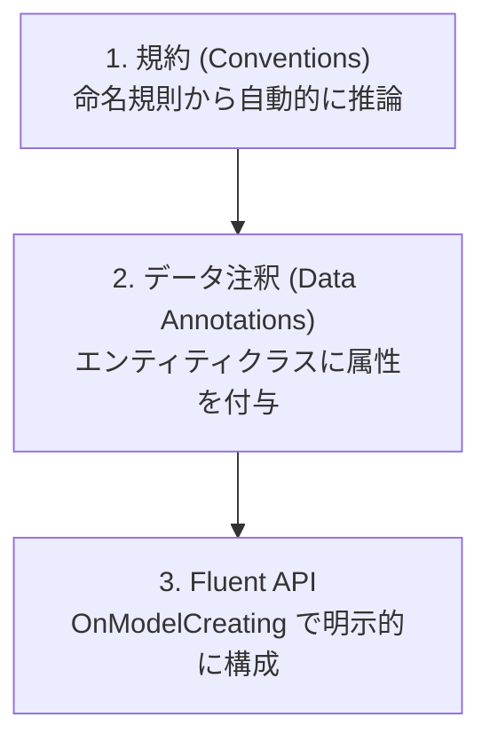

このページは [第8章：データベースアクセスと ORM (Entity Framework Core)](../08-entity-framework-core/index.md) の付録です。エンティティの構成方法、リレーションシップの定義、値の変換と継承のマッピングを扱います。

本編を先に読んでから、必要な項目をここで参照してください。

**第8章のほかの付録**

- [付録 EF Core 2：モデル定義（キー・採番・SQL Server 固有）](../appendix-efcore-02/index.md)
- [付録 EF Core 3：マイグレーションの詳細とクエリ](../appendix-efcore-03/index.md)
- [付録 EF Core 4：更新・トランザクション・レプリカ](../appendix-efcore-04/index.md)
- [付録 EF Core 5：パフォーマンスとテスト](../appendix-efcore-05/index.md)


---

## 目次

1. [エンティティの構成](#1-エンティティの構成)
   - [パラメーター付きコンストラクターへのバインド](#パラメーター付きコンストラクターへのバインド)
   - [Null 許容参照型がスキーマを決める](#null-許容参照型がスキーマを決める)
   - [規約・データ注釈・Fluent API](#規約データ注釈fluent-api)
   - [IEntityTypeConfiguration による構成の分割](#ientitytypeconfiguration-による構成の分割)
   - [同じ DbContext 型から複数のモデルを作る](#同じ-dbcontext-型から複数のモデルを作る)
2. [リレーションシップ](#2-リレーションシップ)
   - [リレーションシップの定義](#リレーションシップの定義)
3. [値の変換と型のマッピング](#3-値の変換と型のマッピング)
   - [値の変換・所有型・複合型](#値の変換所有型複合型)
   - [継承のマッピング](#継承のマッピング)
4. [参考ドキュメント](#4-参考ドキュメント)

---

## 1. エンティティの構成

### パラメーター付きコンストラクターへのバインド

EF Core は、エンティティを作るときに **パラメーター付きコンストラクターを呼ぶ**ことができます。公式ドキュメントによると、マップされたプロパティと名前・型が一致するパラメーターを持つコンストラクターが見つかれば、既定の引数なしコンストラクターの代わりにそちらが呼ばれます。

```csharp
public class Book
{
    public Book(int id, string title)
    {
        Id = id;
        Title = title;
    }

    public int Id { get; private set; }
    public string Title { get; private set; }
    public string Note { get; set; } = "";
    public string Computed => Title + "!";   // セッターがないのでマップされない
}
```

実測すると、データベースから読み込んだときに `(int id, string title)` が呼ばれ、コンストラクターで受け取らない `Note` はその後に設定されました。**`private set` でも設定できます。**

公式ドキュメントが挙げている注意点のうち、実務で効いてくるのは次の点です。

- すべてのプロパティにコンストラクターパラメーターが必要なわけではない。受け取らなかったプロパティは通常どおり後から設定される
- パラメーターの型と名前はプロパティと一致する必要がある。ただしプロパティがパスカルケース、パラメーターがキャメルケースという違いは許される
- **ナビゲーションプロパティはコンストラクターで設定できない**
- コンストラクターのアクセシビリティは何でもよい。ただし遅延読み込みプロキシを使う場合は、派生プロキシクラスからアクセスできる必要がある（通常は `public` か `protected`）
- **セッターを持たないプロパティは規約でマップされない。** 上の `Computed` は実測でも列が作られませんでした。読み取り専用にしたい場合は `private set` を使ってください
- 自動生成のキー値を使う場合、キープロパティは読み書き可能である必要がある

> [!WARNING]
> どのパラメーターもマップされたプロパティに結び付けられない場合、モデル構築の時点で失敗します。実際にエンティティのプロパティと無関係なパラメーターだけを持つコンストラクターを書いたところ、次の例外になりました。
>
> ```text
> No suitable constructor was found for the type 'WeirdBlog'. The following constructors had parameters
> that could not be bound to properties of the type:
>     Cannot bind 'somethingElse' in 'WeirdBlog(Guid somethingElse)'
> Note that only mapped properties can be bound to constructor parameters. Navigations to related
> entities, including references to owned types, cannot be bound.
> ```
>
> なお公式ドキュメントは「現時点でコンストラクターのバインドはすべて規約による。使用するコンストラクターを明示的に構成する機能は将来のリリースで予定されている」と述べています。複数のコンストラクターを持つ型では、どれが選ばれるかをコードで指定できません。

### Null 許容参照型がスキーマを決める

C# の **Null 許容参照型 (nullable reference types: NRT)** は、新規プロジェクトのテンプレートでは既定で有効です。EF Core はこの注釈を読んで、列を `NOT NULL` にするか `NULL` にするかを決めます。**同じプロパティ宣言でも、NRT の有効・無効で生成されるスキーマが変わります。**

```csharp
public class Customer
{
    public int Id { get; set; }
    public required string Name { get; set; }   // 非 null
    public string? Nickname { get; set; }       // null 許容
}
```

```sql
-- NRT が有効な場合（実測）
"Name"     TEXT NOT NULL,
"Nickname" TEXT NULL

-- NRT が無効な場合、同じ宣言でも
"Name"     TEXT NULL,
"Nickname" TEXT NULL
```

> [!WARNING]
> **既存のプロジェクトで NRT を後から有効にするときは注意してください。** それまで「省略可能」として扱われていた参照型のプロパティが一斉に「必須」になり、列を `NOT NULL` に変更するマイグレーションが生成されます。既存データに `NULL` が入っていれば、そのマイグレーションは本番で失敗します。有効化はモデル全体を見直す作業だと考え、生成されたマイグレーションを必ず目で確認してください。

NRT を有効にすると、初期化されていない非 null プロパティに対してコンパイラーが `CS8618` を出します。C# 11 以降なら `required` 修飾子が最も素直な解決策です。コンストラクターで初期化する方法もありますが、ナビゲーションプロパティには使えません。

ナビゲーションプロパティを null 許容にするかどうかは、公式が次の指針を示しています。

| 状況 | 推奨 |
| --- | --- |
| 読み込まずにナビゲーションへアクセスするのはプログラマーの誤りだと考える | 非 null にする（`= null!;` で初期化） |
| `null` かどうかで「読み込み済みか」を判定したい | null 許容にする |
| コレクションナビゲーション | **常に非 null。** 関連が無いことは空のコレクションで表す |

> [!NOTE]
> 省略可能なリレーションシップをたどるクエリでは、実際には `null` 参照例外が起きないのにコンパイラーが警告を出すことがあります。EF Core は SQL に変換して実行するため、関連エンティティが存在しなければナビゲーションを単に無視します。コンパイラーはそれを知らないので、null 免除演算子で黙らせる必要があります。
>
> ```csharp
> var orders = await context.Orders
>     .Where(o => o.OptionalInfo!.SomeProperty == "foo")
>     .ToListAsync(cancellationToken);
> ```

### 規約・データ注釈・Fluent API

EF Core はモデルを 3 段階で構成します。優先順位は下にあるものほど強くなります。



| 段階 | 例 | 特徴 |
| --- | --- | --- |
| 規約 | `Id` または `<型名>Id` という名前のプロパティが主キーになる | 記述不要。既定の動作 |
| データ注釈 | `[MaxLength(200)]`、`[Required]` | エンティティクラスを見れば制約が分かる |
| Fluent API | `modelBuilder.Entity<Blog>().Property(b => b.Name).HasMaxLength(200)` | 最も表現力が高く、エンティティクラスを変更せずに構成できる |

データ注釈による例です。

```csharp
using System.ComponentModel.DataAnnotations;
using System.ComponentModel.DataAnnotations.Schema;

public class Blog
{
    public int Id { get; set; }

    [MaxLength(200)]
    public required string Name { get; set; }

    [MaxLength(2000)]
    public required string Url { get; set; }

    [Column(TypeName = "datetimeoffset(0)")]
    public DateTimeOffset CreatedAt { get; set; }
}
```

同じ構成を Fluent API で書くと次のようになります。

```csharp
protected override void OnModelCreating(ModelBuilder modelBuilder)
{
    modelBuilder.Entity<Blog>(entity =>
    {
        entity.ToTable("Blogs");
        entity.HasKey(b => b.Id);

        entity.Property(b => b.Name)
            .IsRequired()
            .HasMaxLength(200);

        entity.Property(b => b.Url)
            .IsRequired()
            .HasMaxLength(2000);

        entity.Property(b => b.CreatedAt)
            .HasColumnType("datetimeoffset(0)");

        entity.HasIndex(b => b.Url).IsUnique();
    });
}
```

> [!TIP]
> データ注釈は検証（`System.ComponentModel.DataAnnotations`）とマッピングの両方で使われる属性が混在しており、意味が重なって分かりにくくなることがあります。永続化に関する構成は Fluent API に寄せ、エンティティクラスをドメインモデルとして保つ設計が扱いやすくなります。

### IEntityTypeConfiguration による構成の分割

エンティティが増えると `OnModelCreating` が肥大化します。エンティティごとに `IEntityTypeConfiguration<T>` を実装したクラスへ切り出せます。

```csharp
using Microsoft.EntityFrameworkCore;
using Microsoft.EntityFrameworkCore.Metadata.Builders;
using BloggingApi.Models;

namespace BloggingApi.Data.Configurations;

public class BlogConfiguration : IEntityTypeConfiguration<Blog>
{
    public void Configure(EntityTypeBuilder<Blog> builder)
    {
        builder.ToTable("Blogs");
        builder.HasKey(b => b.Id);

        builder.Property(b => b.Name)
            .IsRequired()
            .HasMaxLength(200);

        builder.Property(b => b.Url)
            .IsRequired()
            .HasMaxLength(2000);

        builder.HasIndex(b => b.Url).IsUnique();

        builder.HasMany(b => b.Posts)
            .WithOne(p => p.Blog)
            .HasForeignKey(p => p.BlogId)
            .OnDelete(DeleteBehavior.Cascade);
    }
}
```

アセンブリ内のすべての構成クラスをまとめて適用します。

```csharp
protected override void OnModelCreating(ModelBuilder modelBuilder)
{
    modelBuilder.ApplyConfigurationsFromAssembly(typeof(BloggingContext).Assembly);
}
```

> [!NOTE]
> `ApplyConfigurationsFromAssembly` が適用する順序は未定義です。構成の適用順に依存する記述は避けてください。また、パラメーターなしのコンストラクターを持つ型だけがインスタンス化され、引数が必要な型はスキップされて `SkippedEntityTypeConfigurationWarning` がログに記録されます。そのような構成クラスは `ApplyConfiguration` に手動で渡します。

### 同じ DbContext 型から複数のモデルを作る

`OnModelCreating` の中でコンテキストのプロパティを見て、モデルの構築内容を切り替えたくなることがあります。ところが公式ドキュメントが説明しているとおり、**EF はモデルを一度だけ構築し、性能のために結果をキャッシュします。** そのため、素直に書いても切り替わりません。

実際に、同じ DbContext 型でプロパティだけを変えた 2 つのインスタンスを作って比べたところ、**2 つ目も 1 つ目と同じモデルになりました。**

```text
ファクトリーなし UseIntProperty=true  → IntValue あり
ファクトリーなし UseIntProperty=false → IntValue あり（切り替わっていない）
```

モデルのキャッシュキーは `IModelCacheKeyFactory` サービスが生成します。既定の実装はコンテキストの型だけをキーにするため、同じ型からは 1 つのモデルしか作られません。切り替えたい場合は、モデルに影響する変数をすべて含んだキーを返す実装に差し替えます。

```csharp
public class DynamicModelCacheKeyFactory : IModelCacheKeyFactory
{
    public object Create(DbContext context, bool designTime)
        => context is DynamicContext dynamicContext
            ? (context.GetType(), dynamicContext.UseIntProperty, designTime)
            : (object)context.GetType();
}
```

```csharp
protected override void OnConfiguring(DbContextOptionsBuilder options)
    => options.ReplaceService<IModelCacheKeyFactory, DynamicModelCacheKeyFactory>();
```

差し替えた後に同じ検証を行うと、意図どおり別々のモデルになりました。

```text
UseIntProperty=true  → Value なし / IntValue: Int32
UseIntProperty=false → Value: String / IntValue なし
```

> [!TIP]
> 公式ドキュメントは、設計時のモデルキャッシュも扱えるよう `designTime` を受け取るオーバーロードも実装するよう案内しています。上の例のようにキーへ `designTime` を含めてください。
>
> この仕組みは、マルチテナントでテナントごとにスキーマが違う場合などに使えます。一方で、**検証コードで「構成を変えて 2 パターン試したのに 2 つ目が効かない」という現象の原因もこれです。** 単に挙動を比べたいだけなら、DbContext の型自体を分けるほうが簡単です。

## 2. リレーションシップ

### リレーションシップの定義

EF Core は、ナビゲーションプロパティと外部キープロパティの命名規約からリレーションシップを推論します。明示的に指定する場合は Fluent API を使います。

| 関係 | Fluent API | 例 |
| --- | --- | --- |
| 1 対多 | `HasMany(...).WithOne(...)` | Blog 1 件に Post が複数 |
| 1 対 1 | `HasOne(...).WithOne(...)` | Blog 1 件に BlogImage が 1 件 |
| 多対多 | `HasMany(...).WithMany(...)` | Post と Tag |

多対多は結合エンティティを定義しなくても構成できます。

```csharp
public class Post
{
    public int Id { get; set; }
    public required string Title { get; set; }
    public List<Tag> Tags { get; set; } = [];
}

public class Tag
{
    public int Id { get; set; }
    public required string Name { get; set; }
    public List<Post> Posts { get; set; } = [];
}
```

結合テーブルの名前を明示したい場合は、`UsingEntity` で指定します。指定しない場合、EF Core は規約に従って `PostTag` という名前のテーブルを生成します。

```csharp
modelBuilder.Entity<Post>()
    .HasMany(p => p.Tags)
    .WithMany(t => t.Posts)
    .UsingEntity(join => join.ToTable("PostTags"));
```

このとき生成される結合テーブルの列名は、**ナビゲーションプロパティの名前**から作られます。実測した DDL は次のとおりでした。

```sql
CREATE TABLE [PostTag] (
    [PostsId] int NOT NULL,
    [TagsId] int NOT NULL,
    CONSTRAINT [PK_PostTag] PRIMARY KEY ([PostsId], [TagsId]),
    CONSTRAINT [FK_PostTag_Posts_PostsId] FOREIGN KEY ([PostsId]) REFERENCES [Posts] ([Id]) ON DELETE CASCADE,
    CONSTRAINT [FK_PostTag_Tag_TagsId] FOREIGN KEY ([TagsId]) REFERENCES [Tag] ([Id]) ON DELETE CASCADE
);
```

`Post.Tags` / `Tag.Posts` という複数形のナビゲーション名から `PostsId` / `TagsId` になっている点に注意してください。この結合エンティティには対応する CLR 型がなく、**共有型エンティティ (shared-type entity type)** として扱われます。

#### 結合テーブルに情報を持たせる

「いつタグ付けしたか」のような、関連そのものに紐づく情報を結合テーブルに持たせたい場合は、結合エンティティ用のクラスを定義して `UsingEntity<T>` に渡します。この追加情報を **ペイロード (payload)** と呼びます。

```csharp
public class PostTag
{
    public int PostId { get; set; }
    public int TagId { get; set; }
    public DateTime TaggedOn { get; set; }   // ペイロード
    public string Note { get; set; } = "";   // ペイロード
}

protected override void OnModelCreating(ModelBuilder modelBuilder)
{
    modelBuilder.Entity<Post>()
        .HasMany(p => p.Tags)
        .WithMany(t => t.Posts)
        .UsingEntity<PostTag>(
            j => j.Property(e => e.TaggedOn).HasDefaultValueSql("GETUTCDATE()"));
}
```

クラスを定義すると、外部キーの列名が**エンティティ型の名前**から作られるようになります。

```sql
CREATE TABLE [PostTag] (
    [PostId] int NOT NULL,
    [TagId] int NOT NULL,
    [TaggedOn] datetime2 NOT NULL DEFAULT (GETUTCDATE()),
    [Note] nvarchar(max) NOT NULL,
    CONSTRAINT [PK_PostTag] PRIMARY KEY ([PostId], [TagId]),
    ...
);
```

> [!WARNING]
> 結合エンティティのプロパティ名が外部キーの規約に合っていないと、EF Core は **その名前のシャドウプロパティ (shadow property) を別に作り、自分が定義したプロパティはただのデータ列になります。** 型名 `Article` に対して `PostId` というプロパティを定義したところ、`ArticlesId` というシャドウの外部キー列が追加で生成され、`PostId` は外部キーではない列として残りました。この状態で保存しようとすると次の例外になります。
>
> ```text
> InvalidOperationException: The value of 'ArticleTag.ArticlesId' is unknown when attempting
> to save changes. This is because the property is also part of a foreign key for which
> the principal entity in the relationship is not known.
> ```
>
> 意図しないシャドウプロパティの生成は、`ConfigureWarnings` で例外に変えて検知できます。
>
> ```csharp
> protected override void OnConfiguring(DbContextOptionsBuilder optionsBuilder)
>     => optionsBuilder.ConfigureWarnings(b => b.Throw(CoreEventId.ShadowPropertyCreated));
> ```
>
> 実測では、モデルを構築した時点で次のメッセージとともに例外が投げられました。
>
> ```text
> The property 'ArticleTag.ArticlesId' was created in shadow state because there are
> no eligible CLR members with a matching name.
> ```

#### スキップナビゲーションとペイロードの関係

`Post.Tags` のように、結合エンティティを飛び越えて相手側を直接指すナビゲーションを **スキップナビゲーション (skip navigation)** と呼びます。結合エンティティへのナビゲーション（`Post.PostTags`）は、スキップナビゲーションと**併存できます**。実測でも、`Include(x => x.Tags)` と `Include(x => x.PostTags)` の両方が同じクエリで機能しました。

ここに実務上の落とし穴があります。**スキップナビゲーションで関連付けたとき、EF Core が作る結合エンティティのペイロードには値が入りません。**

```csharp
post.Tags.Add(tag);
await context.SaveChangesAsync();
```

実測では、この操作で結合行が 1 行挿入され、`GETUTCDATE()` を既定値に設定した `TaggedOn` にはデータベース側で値が入りましたが、既定値を設定していない `Note` は空文字のままでした。公式ドキュメントも「ペイロードのプロパティは自動生成される値と組み合わせて使うのが最も一般的」としています。

生成値にできないペイロードを設定するには、結合エンティティを自分で追加してください。

```csharp
context.Add(new PostTag { PostId = post.Id, TagId = tag.Id, Note = "手動で設定" });
await context.SaveChangesAsync();
```

> [!TIP]
> スキップナビゲーションから相手を外す操作（`post.Tags.Remove(tag)`）では、**結合エンティティだけが `Deleted` になり、`Tag` 本体は残ります。** 実測でも結合行が 1 件減り、`Tag` は 2 件のまま残りました。一方で `Tag` 本体を削除すると、結合テーブルの外部キーが既定でカスケード削除に設定されているため、関連する結合行もデータベース側で削除されます。

削除時の動作は `OnDelete` で指定します。

| `DeleteBehavior` | 動作 |
| --- | --- |
| `Cascade` | 親を削除すると子も削除される |
| `Restrict` | 子が存在する場合、親の削除を拒否する |
| `SetNull` | 子の外部キーを NULL にする（外部キーが NULL 許容である必要がある） |
| `NoAction` | データベースに制約の判断を委ねる |

#### 自己参照の多対多は「対称」にならない

同じエンティティ型を多対多の両端に使うこともできます。公式ドキュメントが「自己参照 (self-referencing) リレーションシップ」と呼んでいる構成です。

```csharp
public class Person
{
    public int Id { get; set; }
    public string Name { get; set; } = "";
    public List<Person> Friends { get; } = new();
    public List<Person> FriendOf { get; } = new();
}

modelBuilder.Entity<Person>().HasMany(p => p.Friends).WithMany(p => p.FriendOf);
```

実測すると、`PersonPerson` という結合テーブルが作られ、2 つの外部キーがどちらも `People` を指しました。

```sql
CREATE TABLE [PersonPerson] (
    [FriendOfId] int NOT NULL,
    [FriendsId] int NOT NULL,
    CONSTRAINT [PK_PersonPerson] PRIMARY KEY ([FriendOfId], [FriendsId]),
    CONSTRAINT [FK_PersonPerson_People_FriendOfId] FOREIGN KEY ([FriendOfId]) REFERENCES [People] ([Id]) ON DELETE CASCADE,
    CONSTRAINT [FK_PersonPerson_People_FriendsId] FOREIGN KEY ([FriendsId]) REFERENCES [People] ([Id])
);
```

> [!WARNING]
> **「A と B は友達」のような対称な関係を、1 つのナビゲーションで表現することはできません。** 公式ドキュメントは「残念ながらこれは簡単にはマップできない。同じナビゲーションをリレーションシップの両端に使うことはできず、単方向の多対多としてマップするのが精一杯」と明言しています。
>
> 実測でも `a.Friends.Add(b)` としただけでは、`A.Friends = 1 / A.FriendOf = 0`、`B.Friends = 0 / B.FriendOf = 1` となり、`B` から見た `Friends` は空のままでした。公式が示しているとおり、双方向にしたい場合は両方のコレクションに手で追加する必要があります。
>
> ```csharp
> a.Friends.Add(b);
> b.Friends.Add(a);
> ```

#### カスケード削除は「子を読み込んでいるか」で主体が変わる

`OnDelete` を明示しなかった場合の既定値は、外部キーが NULL 許容かどうかで決まります。実測で確認した既定値は次のとおりです。

| リレーションシップ | 外部キー | 既定の `DeleteBehavior` |
| --- | --- | --- |
| 必須 | `int` | `Cascade` |
| 任意 | `int?` | `ClientSetNull` |

そして、**同じ設定でも子エンティティを `DbContext` に読み込んでいるかどうかで削除の主体が変わります。** 必須リレーションシップで親 1 件・子 2 件を削除したときの実測結果です。

| 操作 | `SaveChangesAsync` の戻り値 | 削除の主体 |
| --- | --- | --- |
| `Include` して親を `Remove` | 3 | EF Core（子を `Deleted` にして削除） |
| `Include` せずに親を `Remove` | 1 | データベース（`ON DELETE CASCADE`） |

`Include` した場合は、`Remove` を呼んだ時点で子の状態が `Deleted` に変わることを確認しました。EF Core が子の削除まで受け持つため、戻り値が 3 になります。読み込んでいない場合は EF Core は親の `DELETE` しか発行せず、データベース側の外部キー制約が子を削除します。

> [!WARNING]
> **必須リレーションシップでは、親を削除しなくても子がコレクションから外れただけで削除されます。** 実測では `blog.Posts.Remove(post)` を呼んだだけで、その `Post` の状態が `Deleted` になりました。外部キーが `int` である以上、親のいない子は存在できないためです。これを **孤児の削除 (delete orphans)** と呼びます。
>
> 任意リレーションシップ（`int?`）では挙動が変わり、親を削除しても子は `Modified` になって**外部キーが `null` に更新されるだけ**でした。実測でも 2 件の `Post` が残り、`BlogId` は両方とも `null` になりました。

> [!TIP]
> 削除の主体がデータベース側になるかどうかは、パフォーマンスにも例外の種類にも影響します。子を読み込んでいれば EF Core が不整合を検知して `InvalidOperationException` を投げますが、読み込んでいない場合はデータベースが制約違反を返し、`DbUpdateException` にラップされます。

#### カスケード削除のタイミングを制御する

追跡済みエンティティに対してカスケードの動作がいつ行われるかは、`ChangeTracker.CascadeDeleteTiming` と `ChangeTracker.DeleteOrphansTiming` で制御できます。指定できる値は公式 API リファレンスによると次の 3 つです。

| 値 | 意味 |
| --- | --- |
| `Immediate` | 主体・親エンティティが変更されたらすぐに、依存・子エンティティへカスケードの動作を行う |
| `OnSaveChanges` | `SaveChanges` の一部としてカスケードの動作を行う |
| `Never` | 自動的にはカスケードの動作を行わず、明示的な呼び出しで発生させる |

実測した既定値はどちらも `Immediate` で、`Remove` を呼んだ直後に子が `Deleted` になりました。

```text
既定 (Immediate):     Remove 直後の子の状態 = Deleted, Deleted
OnSaveChanges:        Remove 直後の子の状態 = Unchanged, Unchanged
Never:                Remove 直後の子の状態 = Unchanged
```

> [!WARNING]
> `Never` にすると、必須リレーションシップの子を残したまま保存しようとして次の例外になりました。カスケードを止めるのではなく「タイミングをずらす」だけの目的であれば `OnSaveChanges` を使ってください。
>
> ```text
> The association between entity types 'Parent' and 'Child' has been severed, but the relationship is
> either marked as required or is implicitly required because the foreign key is not nullable.
> ```
>
> `OnSaveChanges` が役に立つのは、「子を一時的に切り離して別の親に付け替える」といった操作を `SaveChanges` までの間に行いたい場合です。`Immediate` のままだと、切り離した瞬間に子が削除対象になってしまいます。

#### 参照を切っても子は削除されない

親子関係を切るときに、`Remove` ではなく**コレクションから外す**書き方をすることがあります。

```csharp
var blog = await db.Blogs.Include(b => b.Posts).SingleAsync(b => b.Id == 1);
blog.Posts.Clear();
await db.SaveChangesAsync();
```

このとき子（`Post`）がどうなるかは、リレーションシップが**必須か省略可能か**で変わります。EF Core 7 以降、**省略可能なリレーションシップでは子は削除されず、外部キーが `NULL` になるだけ**です。実測でも、`Clear()` して保存したあとに `Post` は 1 件残り、`BlogId` が `NULL` になっていました。

EF Core 6 までは、カスケード削除が構成されていれば子も削除されていました。**アップグレードすると、消えるはずだった行が孤児として残り続けます。**

必須のリレーションシップ（外部キーが `NOT NULL`）であれば、外部キーを `NULL` にできないため、これまでどおり子も削除されます。また、**主体（親）そのものを `Remove` した場合は、省略可能なリレーションシップでもカスケード削除が働きます**。

```csharp
db.Blogs.Remove(blog);   // → Post も削除される（構成に従う）
blog.Posts.Clear();      // → Post は残り、BlogId が NULL になる
```

子を確実に消したいのであれば、明示的に削除します。

```csharp
db.Posts.RemoveRange(blog.Posts);
await db.SaveChangesAsync();
```

#### SQL Server では循環するカスケードを作れない

必須リレーションシップは既定でカスケード削除になるため、3 つ以上のエンティティが輪を作ると SQL Server がテーブルを作成できません。ブログ・投稿・人物が互いに必須リレーションシップで結ばれたモデルでデータベースを作成しようとしたところ、次の例外になりました。

```text
Introducing FOREIGN KEY constraint 'FK_Posts_People_AuthorId' on table 'Posts'
may cause cycles or multiple cascade paths. Specify ON DELETE NO ACTION or
ON UPDATE NO ACTION, or modify other FOREIGN KEY constraints.
```

公式ドキュメントは対処として次の 2 つを挙げています。

1. いずれかのリレーションシップをカスケード削除しない設定に変える（外部キーを NULL 許容にするなど）
2. データベース側のカスケードを外したうえで、削除前に子エンティティをすべて読み込み、EF Core にカスケードを実行させる

## 3. 値の変換と型のマッピング

### 値の変換・所有型・複合型

列の型とプロパティの型が一致しない場合は **値の変換 (Value Conversion)** を使います。列挙型を文字列として保存する例です。

```csharp
public enum PostStatus
{
    Draft,
    Published,
    Archived
}

public class Post
{
    public int Id { get; set; }
    public required string Title { get; set; }
    public PostStatus Status { get; set; }

    // 一括更新・一括削除、関連データの読み込みで使う
    public DateTimeOffset CreatedAt { get; set; }
    public DateTimeOffset? ArchivedAt { get; set; }
    public List<Comment> Comments { get; set; } = [];
}

public class Comment
{
    public int Id { get; set; }
    public required string Body { get; set; }

    public int PostId { get; set; }
    public Post? Post { get; set; }

    public int AuthorId { get; set; }
    public Author? Author { get; set; }
}
```

> [!NOTE]
> 「エンティティクラスの定義」で示した `Post` に、`Status` と後続の節で使うプロパティを追加した形です。この付録では、説明する内容に応じてエンティティへプロパティを足しながら進めます。

`IEntityTypeConfiguration<Post>` の `Configure` メソッド（引数名 `builder`）の中で、次のように構成します。

```csharp
builder.Property(p => p.Status)
    .HasConversion<string>()
    .HasMaxLength(20);
```

これにより `Status` 列は `int` ではなく `"Draft"` のような文字列として保存され、SQL を直接見たときにも意味が分かるようになります。

> [!WARNING]
> **ミュータブルな型を値変換すると、変更が検知されずに失われます。** `List<string>` のようなコレクションを JSON に変換するケースがこれに当たります。EF Core は変更追跡のためにスナップショットを取りますが、`List<T>` は参照等価性を持ち、かつ内容を書き換えられるため、既定では「変更されていない」と判定されてしまいます。
>
> ここでは `Post` に、別テーブルにするほどではない検索キーワードの一覧を持たせる例で説明します。
>
> ```csharp
> public class Post
> {
>     // ...既存のプロパティ...
>     public List<string> Keywords { get; set; } = [];
> }
> ```
>
> ```csharp
> // 危険: 比較子を指定していない
> builder.Property(p => p.Keywords)
>     .HasConversion(
>         v => JsonSerializer.Serialize(v, (JsonSerializerOptions?)null),
>         v => JsonSerializer.Deserialize<List<string>>(v, (JsonSerializerOptions?)null)!);
> ```
>
> この状態で `post.Keywords.Add("csharp")` を実行し `SaveChanges` を呼んでも、実測では次のようになりました。
>
> | 構成 | `Entry(post).State` | `SaveChanges` の戻り値 | 再読み込みした結果 |
> | --- | --- | --- | --- |
> | 比較子なし | `Unchanged` | `0` | 追加した要素が**消える** |
> | 比較子あり | `Modified` | `1` | 追加した要素が保存される |
>
> 解決するには `HasConversion` の第 3 引数に `ValueComparer<T>`（`Microsoft.EntityFrameworkCore.ChangeTracking` 名前空間）を渡し、「等価判定」「ハッシュ計算」「スナップショット（複製）」の 3 つを指定します。
>
> ```csharp
> builder.Property(p => p.Keywords)
>     .HasConversion(
>         v => JsonSerializer.Serialize(v, (JsonSerializerOptions?)null),
>         v => JsonSerializer.Deserialize<List<string>>(v, (JsonSerializerOptions?)null)!,
>         new ValueComparer<List<string>>(
>             (a, b) => a!.SequenceEqual(b!),                                    // 中身で比較する
>             v => v.Aggregate(0, (acc, s) => HashCode.Combine(acc, s.GetHashCode())),
>             v => v.ToList()));                                                 // 複製してスナップショットを取る
> ```
>
> 公式ドキュメントは、そもそも**値変換には不変 (immutable) な型を使うことを推奨**しています。なお `HasConversion<string>()` のような列挙型から文字列への変換は、`string` も列挙型も不変なので比較子は不要です。

エンティティの一部を別のテーブルや別の型として切り出したい場合は **所有型 (Owned Entity Type)** を使います。所有型は独自の主キーを持たず、常に所有側のエンティティを通じてのみアクセスされます。

```csharp
modelBuilder.Entity<Author>()
    .OwnsOne(a => a.Address);
```

住所のように、それ自体は識別子を持たず、親エンティティのテーブルに展開したい値の集まりには **複合型 (Complex Type)** を使います。

```csharp
public class Address
{
    public required string PostalCode { get; set; }
    public required string Prefecture { get; set; }
    public required string Line1 { get; set; }
}

public class Author
{
    public int Id { get; set; }
    public required string Name { get; set; }
    public required Address Address { get; set; }
}
```

複合型は所有型と違って独立したエンティティにならないため、`OwnsOne` ではなく `ComplexProperty` で構成します。

```csharp
modelBuilder.Entity<Author>()
    .ComplexProperty(a => a.Address);
```

これにより `Authors` テーブルに `Address_PostalCode`、`Address_Prefecture`、`Address_Line1` という列が作られます。

> [!NOTE]
> EF Core 10 では複合型のサポートが大きく拡張され、`struct` や `record struct` を複合型として使えるようになったほか、JSON 列へのマッピングやテーブル分割にも対応しました。所有型と複合型はどちらも「エンティティの一部を別の型に切り出す」ものですが、所有型は内部的に独立したエンティティ型として扱われる（隠しキーを持つ）のに対し、複合型は識別子を持たない純粋な値です。**公式ドキュメントは、値としてのセマンティクスが欲しい用途ではすでに所有型を使っている場合も複合型への移行を推奨しています。**

> [!WARNING]
> EF Core 9 以前から複合型を使っている場合、**EF Core 10 へのアップグレードで列名が変わることがあります。** 公式の破壊的変更として次の 2 点が挙げられています。
>
> **1. ネストした複合型の列名がフルパスになる**
>
> `Entity.Complex.NestedComplex.Property` は、EF Core 9 までは直近の型名だけを使って `NestedComplex_Property` にマッピングされていましたが、EF Core 10 では途中の複合型もすべて含めた `Complex_NestedComplex_Property` になります。実際に SQL Server 2022 に対して生成された DDL は次のとおりでした（実測で確認）。
>
> ```sql
> CREATE TABLE [Holders] (
>     [Id] int NOT NULL IDENTITY,
>     [Complex_Own] nvarchar(max) NOT NULL,
>     [Complex_NestedComplex_Value] nvarchar(max) NOT NULL,
>     CONSTRAINT [PK_Holders] PRIMARY KEY ([Id])
> );
> ```
>
> **2. 複合型の列名が一意化される**
>
> 別々の複合型のプロパティが同じ列名になる場合、EF Core 9 までは何も言わずに同じ列を共有していました。EF Core 10 では末尾に数字を付けて一意化します。**意図せず同じ列にマッピングされてデータが壊れるのを防ぐため**の変更です。
>
> どちらも、旧来の列名を維持したい場合は `Property(...).HasColumnName(...)` で明示します。逆に「複数のプロパティで意図的に同じ列を共有したい」場合も同じ方法で指定でき、実測では両方の複合型に `HasColumnName("Street")` を指定すると `Street` 列 1 本だけが生成されました。
>
> ```csharp
> modelBuilder.Entity<Customer>(b =>
> {
>     b.ComplexProperty(c => c.ShippingAddress, p => p.Property(a => a.Street).HasColumnName("Street"));
>     b.ComplexProperty(c => c.BillingAddress, p => p.Property(a => a.Street).HasColumnName("Street"));
> });
> ```
>
> アップグレード時は `dotnet ef migrations add` で生成されるマイグレーションに `RenameColumn` が含まれていないかを必ず確認してください。

#### JSON の中の列挙型は数値になる

JSON にマッピングした型が列挙型 (enum) のプロパティを持つ場合、**EF Core 8 以降は既定で数値として保存されます**。EF Core 7 では文字列でした。

```csharp
public enum Status { Pending, Shipped, Delivered }
```

```json
{"Note":"出荷済み","Status":1}
```

実測でもこのとおりでした。文字列で保存したい場合は、変換を明示的に構成します。

```csharp
modelBuilder.Entity<Order>().OwnsOne(x => x.Detail, b =>
{
    b.ToJson();
    b.Property(d => d.Status).HasConversion<string>();
});
```

```json
{"Note":"出荷済み","Status":"Shipped"}
```

公式ドキュメントは、この変更の理由を「EF Core は昔からリレーショナルデータベースの列に対して列挙型を数値でマッピングしてきた。JSON の値と列やパラメーターの値が突き合わされるクエリを EF Core がサポートしている以上、**両者の表現が一致していることが重要**だから」と説明しています。

> [!WARNING]
> EF Core 7 で作成した JSON データが残っている状態で EF Core 8 以降に上げると、**既存の行には文字列が、新しい行には数値が入る**という混在が起こります。マイグレーションは JSON の中身までは書き換えません。上記の変換を構成して従来どおり文字列にするか、既存データを移行するかを選んでください。

#### EF Core 10 の JSON 列は `json` 型になる（Azure SQL の破壊的変更）

`OwnsMany(...).ToJson()` のように所有型を JSON として保存する場合や、`string[]` のようなプリミティブコレクションを保存する場合、EF Core 9 までの SQL Server プロバイダーはこれを `nvarchar(max)` 列に格納していました。

EF Core 10 では、`UseAzureSql` を使っているか、**互換性レベル 170 以上**を構成している場合に限り、SQL Server の新しい `json` データ型にマッピングされます。逆に言えば、この条件を満たさない環境では EF Core 10 でも従来どおり `nvarchar(max)` のままです。実際に SQL Server 2022（互換性レベル 160）に対して `ToJson()` を使った所有型を作成したところ、列は `nvarchar(max)` になり、`{"Author":"x","Tags":["t1","t2"]}` という JSON がそのまま格納されることを確認しています。

一方、Azure SQL Database（Business Critical、互換性レベル 170）に対して `UseAzureSql` で同じモデルを作成すると、生成される DDL と `sys.columns` の両方で `json` 型になりました。JSON 内のプロパティを条件にした `Where(d => d.Meta.Author == "x")` もそのまま動作します。

```sql
-- Azure SQL に UseAzureSql で作成したときの実際の DDL
CREATE TABLE [Docs] (
    [Id] int NOT NULL IDENTITY,
    [Title] nvarchar(max) NOT NULL,
    [Meta] json NOT NULL,
    CONSTRAINT [PK_Docs] PRIMARY KEY ([Id])
);
```

```sql
-- EF Core 9 まで
[Tags] nvarchar(max)

-- EF Core 10（UseAzureSql または互換性レベル 170 以上）
[Tags] json
```

> [!WARNING]
> **既存のテーブルがある状態で `UseAzureSql` を使って EF Core 10 にアップグレードすると、既存の `nvarchar(max)` の JSON 列をすべて `json` に変更するマイグレーションが生成されます。** 公式ドキュメントはこの変更操作自体は問題なく適用できるとしていますが、データベースに対する小さくない変更である点に注意してください。
>
> また、`json` 型には `nvarchar(max)` との**動作の違い**があります。たとえば SQL Server は JSON 配列に対する `DISTINCT` 演算子をサポートしていないため、それを行おうとするクエリは失敗します。
>
> 従来どおり `nvarchar(max)` を使いたい場合は、`UseAzureSql` ではなく `UseSqlServer` を使うか、次のように互換性レベルを明示的に 170 未満に構成します。
>
> ```csharp
> options.UseSqlServer(connectionString, o => o.UseCompatibilityLevel(160));
> ```

> [!NOTE]
> 同じく EF Core 10 では、Azure SQL Database と SQL Server 2025 の `vector` データ型がサポートされました。エンティティに `SqlVector<float>` 型のプロパティを持たせると埋め込み (embedding) を保存でき、`EF.Functions.VectorDistance` で類似度検索を書けます。セマンティック検索や RAG のような AI ワークロードで使う機能で、この付録の範囲を超えるためここでは紹介にとどめます。
>
> ```csharp
> public class Doc
> {
>     public int Id { get; set; }
>
>     [Column(TypeName = "vector(1536)")]
>     public SqlVector<float> Embedding { get; set; }
> }
>
> // コサイン距離が近い順に取得する
> var similar = await context.Docs
>     .OrderBy(d => EF.Functions.VectorDistance("cosine", d.Embedding, queryVector))
>     .Take(10)
>     .ToListAsync(cancellationToken);
> ```
>
> `SqlVector<T>` は `Microsoft.Data.SqlTypes` 名前空間にあります。Azure SQL Database に対して実際に動かしたところ、`vector(3)` 型の列が作られ、`VectorDistance("cosine", ...)` が距離を返して並べ替えが機能することを確認しました。

### 継承のマッピング

エンティティに継承関係がある場合、EF Core は 3 つのマッピング方法を提供します。既定は **TPH (table-per-hierarchy)** で、階層全体を 1 つのテーブルに格納し、行がどの型かを示す **識別子列 (discriminator)** を暗黙的に追加します。

```csharp
public abstract class Payment
{
    public int Id { get; set; }
    public decimal Amount { get; set; }
}

public class CreditCardPayment : Payment
{
    public string CardNumber { get; set; } = "";
}

public class BankTransferPayment : Payment
{
    public string BankName { get; set; } = "";
}
```

TPH では次の DDL が生成されます（SQL Server プロバイダーでの実測）。

```sql
CREATE TABLE [Payments] (
    [Id] int NOT NULL IDENTITY,
    [Amount] decimal(18,2) NOT NULL,
    [Discriminator] nvarchar(21) NOT NULL,
    [BankName] nvarchar(max) NULL,
    [CardNumber] nvarchar(max) NULL,
    CONSTRAINT [PK_Payments] PRIMARY KEY ([Id])
);
```

派生型だけが持つ列は自動的に NULL 許容になります。公式ドキュメントにも「TPH マッピングを使う場合、データベースの列は必要に応じて自動的に NULL 許容になる」と記載されています。

`UseTptMappingStrategy()` を指定すると **TPT (table-per-type)** になり、基底型と派生型がそれぞれのテーブルに分かれます。派生テーブルの主キーは基底テーブルへの外部キーを兼ねます。

```csharp
protected override void OnModelCreating(ModelBuilder modelBuilder)
    => modelBuilder.Entity<Payment>().UseTptMappingStrategy();
```

```sql
CREATE TABLE [Payments] (
    [Id] int NOT NULL IDENTITY,
    [Amount] decimal(18,2) NOT NULL,
    CONSTRAINT [PK_Payments] PRIMARY KEY ([Id])
);

CREATE TABLE [CreditCardPayments] (
    [Id] int NOT NULL,
    [CardNumber] nvarchar(max) NOT NULL,
    CONSTRAINT [PK_CreditCardPayments] PRIMARY KEY ([Id]),
    CONSTRAINT [FK_CreditCardPayments_Payments_Id] FOREIGN KEY ([Id])
        REFERENCES [Payments] ([Id]) ON DELETE CASCADE
);
```

`UseTpcMappingStrategy()` による **TPC (table-per-concrete-type)** では、具象型ごとに独立したテーブルを作り、それぞれが基底型の列も持ちます。主キーが階層全体で一意になるよう、EF Core は共有シーケンスを作成します。

```sql
CREATE SEQUENCE [PaymentSequence] START WITH 1 INCREMENT BY 1 NO CYCLE;

CREATE TABLE [CreditCardPayments] (
    [Id] int NOT NULL DEFAULT (NEXT VALUE FOR [PaymentSequence]),
    [Amount] decimal(18,2) NOT NULL,
    [CardNumber] nvarchar(max) NOT NULL,
    CONSTRAINT [PK_CreditCardPayments] PRIMARY KEY ([Id])
);
```

| 方式 | テーブル数 | 特徴 |
| --- | --- | --- |
| TPH（既定） | 1 | 結合が不要で最も速い。派生型固有の列は NULL 許容になる |
| TPT | 型の数だけ | 正規化されるが、取得のたびに結合が必要 |
| TPC | 具象型の数だけ | 結合が不要。公式は「TPT で起きがちな性能問題に対処するもの」と説明 |

> [!WARNING]
> 基底型だけを `DbSet` に登録し、派生型をモデルに含めないと、次の実行時エラーになります（実測で確認済み）。
>
> ```text
> The entity type 'Payment' cannot be instantiated because its corresponding CLR type is
> abstract and there is no derived entity type in the model that corresponds to a concrete
> CLR type. Add a concrete derived entity type to the model or change the entity type to
> use a concrete CLR type.
> ```
>
> 派生型ごとに `DbSet` を用意するか、`OnModelCreating` で `modelBuilder.Entity<CreditCardPayment>()` のように明示的に登録してください。

> [!TIP]
> Ruby on Rails の単一テーブル継承 (STI) は EF Core の TPH に、Django の多テーブル継承は TPT に相当します。Rails の STI が `type` 列を規約とするのに対し、EF Core の識別子列は既定で `Discriminator` という名前のシャドウプロパティになり、値には **CLR のクラス名がそのまま入ります**（実測でも `CreditCardPayment` / `BankTransferPayment` が格納されました）。`HasDiscriminator<string>("payment_type").HasValue<CreditCardPayment>("card")` のように列名と値を変更でき、エンティティの実プロパティにマッピングすることもできます。

派生型を絞り込むクエリでは、EF Core が識別子列の条件を自動的に付け加えます。実測した SQL は次のとおりです。

```sql
-- context.Payments.OfType<CreditCardPayment>() が生成する SQL
SELECT [p].[Id], [p].[Amount], [p].[Discriminator], [p].[CardNumber]
FROM [Payments] AS [p]
WHERE [p].[Discriminator] = N'CreditCardPayment'
```

#### 識別子列は必要な長さしか取らない

TPH の識別子列は、EF Core 8 以降、**既知の識別子値をすべて収められる最大長**で作られます。それより前は `nvarchar(max)` でした。実際に生成される DDL を型名の長さを変えて比べると、次のようになりました（実測）。

```text
識別子の値: Animal, Cat, Dog
  → [Discriminator] nvarchar(8) NOT NULL

識別子の値: Car, Vehicle, VeryLongVehicleTypeNameForTesting
  → [Discriminator] nvarchar(34) NOT NULL
```

インデックスを張れる、格納効率がよいといった利点がありますが、公式ドキュメントは注意点も挙げています。**既存のデータベースをアップグレードすると `AlterColumn` が生成され、識別子列がインデックスなどで制約されている場合には失敗することがある**という点です。既存のマイグレーションを持つプロジェクトでは、生成された `AlterColumn` を必ず目視で確認してください。

長さを固定したい場合は明示的に構成できます。

```csharp
modelBuilder.Entity<Animal>()
    .Property<string>("Discriminator")
    .HasMaxLength(50);
```

## 4. 参考ドキュメント

- [モデルの作成 | Microsoft Learn](https://learn.microsoft.com/ja-jp/ef/core/modeling/)
- [エンティティのプロパティ | Microsoft Learn](https://learn.microsoft.com/ja-jp/ef/core/modeling/entity-properties)
- [リレーションシップ | Microsoft Learn](https://learn.microsoft.com/ja-jp/ef/core/modeling/relationships)
- [多対多のリレーションシップ | Microsoft Learn](https://learn.microsoft.com/ja-jp/ef/core/modeling/relationships/many-to-many)
- [値の変換 | Microsoft Learn](https://learn.microsoft.com/ja-jp/ef/core/modeling/value-conversions)
- [値の比較子 | Microsoft Learn](https://learn.microsoft.com/ja-jp/ef/core/modeling/value-comparers)
- [継承 | Microsoft Learn](https://learn.microsoft.com/ja-jp/ef/core/modeling/inheritance)
- [Null 許容参照型の使用 | Microsoft Learn](https://learn.microsoft.com/ja-jp/ef/core/miscellaneous/nullable-reference-types)
- [エンティティ型のコンストラクター | Microsoft Learn](https://learn.microsoft.com/ja-jp/ef/core/modeling/constructors)
- [同じ DbContext 型で複数のモデルを切り替える | Microsoft Learn](https://learn.microsoft.com/ja-jp/ef/core/modeling/dynamic-model)
- [カスケード削除 | Microsoft Learn](https://learn.microsoft.com/ja-jp/ef/core/saving/cascade-delete)
- [外部キーと主キー | Microsoft Learn](https://learn.microsoft.com/ja-jp/ef/core/modeling/relationships/foreign-and-principal-keys)
- [高度なテーブルマッピング | Microsoft Learn](https://learn.microsoft.com/ja-jp/ef/core/modeling/table-splitting)
