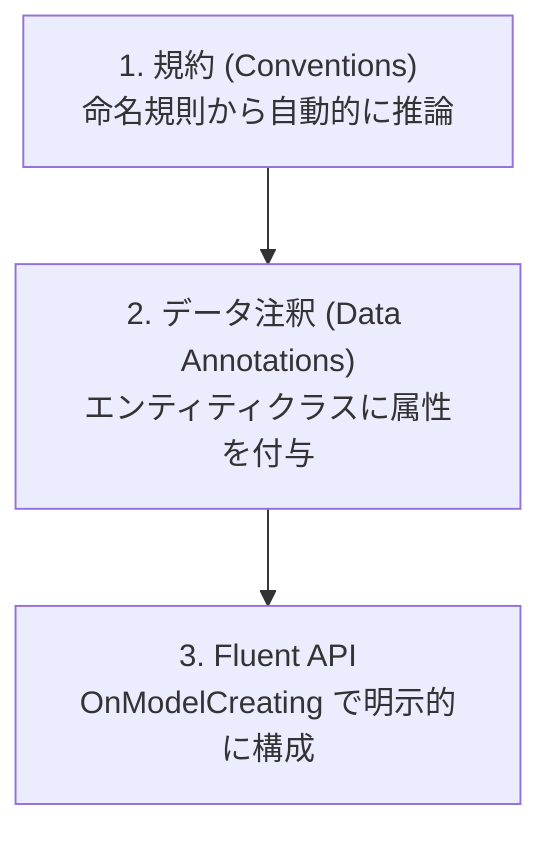

このページは [第8章：データベースアクセスと ORM (Entity Framework Core)](../08-entity-framework-core/index.md) の付録です。エンティティの構成方法、リレーションシップの定義、値の変換と継承のマッピングを扱います。

本編を先に読んでから、必要な項目をここで参照してください。

**第8章のほかの付録**

- [付録 EF Core 2：モデル定義（キー・採番・SQL Server 固有）](../appendix-efcore-02/index.md)
- [付録 EF Core 3：マイグレーションの詳細とクエリ](../appendix-efcore-03/index.md)
- [付録 EF Core 4：更新・トランザクション・レプリカ](../appendix-efcore-04/index.md)
- [付録 EF Core 5：パフォーマンス](../appendix-efcore-05/index.md)
- [付録 EF Core 6：テスト](../appendix-efcore-06/index.md)


---

## 目次

1. [エンティティの構成](#1-エンティティの構成)
   - [パラメーター付きコンストラクターへのバインド](#パラメーター付きコンストラクターへのバインド)
   - [Null 許容参照型がスキーマを決める](#null-許容参照型がスキーマを決める)
   - [規約・データ注釈・Fluent API](#規約データ注釈fluent-api)
   - [IEntityTypeConfiguration による構成の分割](#ientitytypeconfiguration-による構成の分割)
   - [同じ DbContext 型から複数のモデルを作る](#同じ-dbcontext-型から複数のモデルを作る)
   - [エンティティの等価性はオーバーライドしない](#エンティティの等価性はオーバーライドしない)
   - [組み上がったモデルを確認する](#組み上がったモデルを確認する)
2. [リレーションシップ](#2-リレーションシップ)
   - [リレーションシップの定義](#リレーションシップの定義)
3. [値の変換と型のマッピング](#3-値の変換と型のマッピング)
   - [値の変換・所有型・複合型](#値の変換所有型複合型)
   - [継承のマッピング](#継承のマッピング)
4. [参考ドキュメント](#4-参考ドキュメント)

---

## 1. エンティティの構成

### パラメーター付きコンストラクターへのバインド

EF Core は、エンティティを作るときに **パラメーター付きコンストラクターを呼ぶ**ことができます。[公式のコンストラクターの説明](https://learn.microsoft.com/ja-jp/ef/core/modeling/constructors#binding-to-mapped-properties)によると、マップされたプロパティと名前・型が一致するパラメーターを持つコンストラクターが見つかれば、既定の引数なしコンストラクターの代わりにそちらが呼ばれます。

```csharp
public class Book
{
    public Book(int id, string title)
    {
        Id = id;
        Title = title;
    }

    public int Id { get; private set; }
    public string Title { get; private set; }
    public string Note { get; set; } = "";
    public string Computed => Title + "!";   // セッターがないのでマップされない
}
```

上のモデルの確認例では、読込時に `(int id, string title)` が呼ばれ、コンストラクターで受け取らない `Note` は後から設定されることを確認できています。**`private set` も EF Core による設定の対象です。**

公式ドキュメントが挙げている注意点のうち、実務で効いてくるのは次の点です。

- すべてのプロパティにコンストラクターパラメーターが必要なわけではない。受け取らなかったプロパティは通常どおり後から設定される
- パラメーターの型と名前はプロパティと一致する必要がある。ただしプロパティがパスカルケース、パラメーターがキャメルケースという違いは許される
- **EF Core はナビゲーションプロパティをコンストラクター引数へバインドできない**（自分のコンストラクターのコードでコレクションを初期化することを禁止しているわけではない）
- 通常の実体化では `private` や `internal` のコンストラクターも使用できます。遅延読み込みプロキシでは、派生プロキシから呼び出せる `public` / `protected` などのコンストラクターが必要です。
- **セッターを持たないプロパティは規約でマップされない。** 上のモデルの確認例でも `Computed` の列は生成されていません。読み取り専用にしたい場合は `private set` を使ってください
- 自動生成のキー値を使う場合、キープロパティは読み書き可能である必要がある

> [!WARNING]
> 次は、マップされたプロパティにも EF Core のサービスにも結び付かないパラメーターだけを持つコンストラクターの確認例です。この構成では、モデル構築時の例外を確認できています。
>
> ```text
> No suitable constructor was found for the type 'WeirdBlog'. The following constructors had parameters
> that could not be bound to properties of the type:
>     Cannot bind 'somethingElse' in 'WeirdBlog(Guid somethingElse)'
> Note that only mapped properties can be bound to constructor parameters. Navigations to related
> entities, including references to owned types, cannot be bound.
> ```
>
> なお公式ドキュメントは「現時点でコンストラクターのバインドはすべて規約による。使用するコンストラクターを明示的に構成する機能は将来のリリースで予定されている」と述べています。複数のコンストラクターを持つ型では、どれが選ばれるかをコードで指定できません。

#### エンティティのコンストラクターにサービスを注入できる（が、勧められない）

EF Core はエンティティのコンストラクターに、**EF Core が知っているサービス**を注入できます。公式ドキュメントが挙げているのは `DbContext`、`ILazyLoader`（遅延読み込みサービス）、`Action<object, string>`（遅延読み込みデリゲート）、`IEntityType`（そのエンティティ型のメタデータ）の 4 つです。アプリケーション側のサービスは注入できません。

```csharp
public class Blog
{
    public Blog() { }

    private Blog(ShopDbContext context) => Context = context;   // EF Core によるマテリアライズ用

    private ShopDbContext? Context { get; set; }

    public int Id { get; set; }
    public ICollection<Post>? Posts { get; set; }

    // 記事を全件読み込まずに件数だけを取る
    public int PostsCount
        => Posts?.Count
           ?? Context?.Set<Post>().Count(p => Id == EF.Property<int?>(p, "BlogId"))
           ?? 0;
}
```

投稿 3 件を持つブログの確認例では、EF Core がクエリ結果として生成したインスタンスの `PostsCount` は **3**、`new Blog()` したインスタンスでは **0** です。上のコードが `Context?.` と null 条件演算子を使うのは、自分で `new Blog()` する経路では `Context` が注入されないためです。

> [!WARNING]
> 公式ドキュメントは、この `DbContext` の注入について「**エンティティ型を EF Core に直接結合させてしまうため、アンチパターンと見なされることが多い。** 使う前に他の選択肢を慎重に検討すること」と警告しています。件数だけが欲しいのであれば、クエリ側で投影する（`Select(b => new { b.Id, Count = b.Posts.Count })`）ほうが、エンティティを永続化技術から独立させたまま同じ結果を得られます。

### Null 許容参照型がスキーマを決める

C# の **Null 許容参照型 (nullable reference types: NRT)** は、新規プロジェクトのテンプレートでは既定で有効です。EF Core はこの注釈を読んで、列を `NOT NULL` にするか `NULL` にするかを決めます。**同じプロパティ宣言でも、NRT の有効・無効で生成されるスキーマが変わります。**

```csharp
public class Customer
{
    public int Id { get; set; }
    public required string Name { get; set; }   // 非 null
    public string? Nickname { get; set; }       // null 許容
}
```

```sql
-- SQLite。NRT が有効な場合（実測）
"Name"     TEXT NOT NULL,
"Nickname" TEXT NULL

-- NRT が無効な場合、同じ宣言でも
"Name"     TEXT NULL,
"Nickname" TEXT NULL
```

> [!WARNING]
> **既存のプロジェクトで NRT を後から有効にするときは注意してください。** 明示的な構成で上書きしていない非 null 許容の参照型プロパティは、規約上「必須」となり、列を `NOT NULL` に変更するマイグレーションが生成されることがあります。既存の `NULL` の扱いは、データの補完方法や生成されたマイグレーションによって変わります。有効化はモデル全体を見直す作業だと考え、生成コードと既存データへの影響を必ず確認してください。

NRT を有効にすると、初期化されていない非 null プロパティに対してコンパイラーが `CS8618` を出します。C# 11 以降なら `required` 修飾子が最も素直な解決策です。コンストラクターで初期化する方法もありますが、EF Core によるナビゲーションのコンストラクターバインドには対応していません。

ナビゲーションプロパティを null 許容にするかどうかは、公式が次の指針を示しています。

| 状況 | 推奨 |
| --- | --- |
| 読み込まずにナビゲーションへアクセスするのはプログラマーの誤りだと考える | 非 null にする（`= null!;` で初期化） |
| `null` かどうかで「読み込み済みか」を判定したい | null 許容にする |
| コレクションナビゲーション | **常に非 null。** 関連が無いことは空のコレクションで表す |

> [!NOTE]
> 省略可能なナビゲーションを含む式では、C# コンパイラーが null 参照の警告を出しても、EF Core が SQL に翻訳して実行する際には null が SQL の規則に従って扱われる場合があります。関連先の値で絞り込む確認例は例外なく実行でき、値だけを投影する確認例では関連先のない行に `null` が返ることを確認できています。「関連のない行を常に無視する」という意味ではありません。`!` はコンパイラーの警告を抑えるだけで、取得後の LINQ to Objects で null 参照例外を防ぐものではありません。
>
> ```csharp
> var orders = await context.Orders
>     .Where(o => o.OptionalInfo!.SomeProperty == "foo")
>     .ToListAsync(cancellationToken);
> ```

### 規約・データ注釈・Fluent API

EF Core はモデルを 3 段階で構成します。優先順位は下にあるものほど強くなります。



| 段階 | 例 | 特徴 |
| --- | --- | --- |
| 規約 | `Id` または `<型名>Id` という名前のプロパティが主キーになる | 記述不要。既定の動作 |
| データ注釈 | `[MaxLength(200)]`、`[Required]` | エンティティクラスを見れば制約が分かる |
| Fluent API | `modelBuilder.Entity<Blog>().Property(b => b.Name).HasMaxLength(200)` | 最も表現力が高く、エンティティクラスを変更せずに構成できる |

データ注釈による例です。

```csharp
using System.ComponentModel.DataAnnotations;
using System.ComponentModel.DataAnnotations.Schema;

public class Blog
{
    public int Id { get; set; }

    [MaxLength(200)]
    public required string Name { get; set; }

    [MaxLength(2000)]
    public required string Url { get; set; }

    [Column(TypeName = "datetimeoffset(0)")]
    public DateTimeOffset CreatedAt { get; set; }
}
```

同じ構成を Fluent API で書くと次のようになります。

```csharp
protected override void OnModelCreating(ModelBuilder modelBuilder)
{
    modelBuilder.Entity<Blog>(entity =>
    {
        entity.ToTable("Blogs");
        entity.HasKey(b => b.Id);

        entity.Property(b => b.Name)
            .IsRequired()
            .HasMaxLength(200);

        entity.Property(b => b.Url)
            .IsRequired()
            .HasMaxLength(2000);

        entity.Property(b => b.CreatedAt)
            .HasColumnType("datetimeoffset(0)");

        entity.HasIndex(b => b.Url).IsUnique();
    });
}
```

> [!TIP]
> データ注釈は検証（`System.ComponentModel.DataAnnotations`）とマッピングの両方で使われる属性が混在しており、意味が重なって分かりにくくなることがあります。永続化に関する構成は Fluent API に寄せ、エンティティクラスをドメインモデルとして保つ設計が扱いやすくなります。

### IEntityTypeConfiguration による構成の分割

エンティティが増えると `OnModelCreating` が肥大化します。エンティティごとに `IEntityTypeConfiguration<T>` を実装したクラスへ切り出せます。

```csharp
using Microsoft.EntityFrameworkCore;
using Microsoft.EntityFrameworkCore.Metadata.Builders;
using BloggingApi.Models;

namespace BloggingApi.Data.Configurations;

public class BlogConfiguration : IEntityTypeConfiguration<Blog>
{
    public void Configure(EntityTypeBuilder<Blog> builder)
    {
        builder.ToTable("Blogs");
        builder.HasKey(b => b.Id);

        builder.Property(b => b.Name)
            .IsRequired()
            .HasMaxLength(200);

        builder.Property(b => b.Url)
            .IsRequired()
            .HasMaxLength(2000);

        builder.HasIndex(b => b.Url).IsUnique();

        builder.HasMany(b => b.Posts)
            .WithOne(p => p.Blog)
            .HasForeignKey(p => p.BlogId)
            .OnDelete(DeleteBehavior.Cascade);
    }
}
```

アセンブリ内のすべての構成クラスをまとめて適用します。

```csharp
protected override void OnModelCreating(ModelBuilder modelBuilder)
{
    modelBuilder.ApplyConfigurationsFromAssembly(typeof(BloggingContext).Assembly);
}
```

> [!NOTE]
> `ApplyConfigurationsFromAssembly` が適用する順序は未定義です。構成の適用順に依存する記述は避けてください。また、パラメーターなしのコンストラクターを持つ型だけがインスタンス化され、引数が必要な型はスキップされて `SkippedEntityTypeConfigurationWarning` がログに記録されます。そのような構成クラスは `ApplyConfiguration` に手動で渡します。

### 同じ DbContext 型から複数のモデルを作る

`OnModelCreating` の中でコンテキストのプロパティを見て、モデルの構築内容を切り替えたくなることがあります。ところが公式ドキュメントが説明しているとおり、**EF はモデルを一度だけ構築し、性能のために結果をキャッシュします。** そのため、素直に書いても切り替わりません。

次は、同じ DbContext 型でプロパティだけを変えた 2 つのインスタンスの確認例です。**2 つ目も 1 つ目と同じモデル**を使うことを確認できています。

```text
ファクトリーなし UseIntProperty=true  → IntValue あり
ファクトリーなし UseIntProperty=false → IntValue あり（切り替わっていない）
```

モデルのキャッシュキーは `IModelCacheKeyFactory` サービスが生成します。既定の実装はコンテキストの型だけをキーにするため、同じ型からは 1 つのモデルしか作られません。切り替えたい場合は、モデルに影響する変数をすべて含んだキーを返す実装に差し替えます。

以下は本編の `BloggingContext` とは別の、[モデル切り替えの検証用定義](https://learn.microsoft.com/ja-jp/ef/core/modeling/dynamic-model#imodelcachekeyfactory)です。.NET 10 の検証用プロジェクトへ `dotnet add package Microsoft.EntityFrameworkCore.Sqlite --version 10.0.11` でプロバイダーを追加し、`DynamicModelSample` 名前空間の 1 つのファイルとして配置します。`UseIntProperty` に応じて `Value` または `IntValue` をモデルから外します。この比較はモデルの構築結果を調べるもので、データベースのテーブル作成は不要です。

```csharp
using Microsoft.EntityFrameworkCore;
using Microsoft.EntityFrameworkCore.Infrastructure;

namespace DynamicModelSample;

public class ConfigurableEntity
{
    public int Id { get; set; }
    public string? Value { get; set; }
    public int IntValue { get; set; }
}

public class DynamicContext(bool useIntProperty, bool replaceFactory) : DbContext
{
    public bool UseIntProperty { get; } = useIntProperty;

    protected override void OnConfiguring(DbContextOptionsBuilder options)
    {
        options.UseSqlite("Data Source=:memory:");
        if (replaceFactory)
            options.ReplaceService<IModelCacheKeyFactory, DynamicModelCacheKeyFactory>();
    }

    protected override void OnModelCreating(ModelBuilder modelBuilder)
    {
        if (UseIntProperty)
            modelBuilder.Entity<ConfigurableEntity>().Ignore(e => e.Value);
        else
            modelBuilder.Entity<ConfigurableEntity>().Ignore(e => e.IntValue);
    }
}

public class DynamicModelCacheKeyFactory : IModelCacheKeyFactory
{
    public object Create(DbContext context, bool designTime)
        => context is DynamicContext dynamicContext
            ? (context.GetType(), dynamicContext.UseIntProperty, designTime)
            : (object)context.GetType();
}
```

`OnConfiguring` と `OnModelCreating` は、いずれも上の `DynamicContext` のメソッドです。`new DynamicContext(useIntProperty: true, replaceFactory: false)` と、`useIntProperty` だけを `false` にしたインスタンスが、上の既定キャッシュによる比較に対応します。`replaceFactory: true` にすると、`OnConfiguring` 内の `ReplaceService` が適用されます。

キャッシュキーの生成処理を差し替えた確認例では、次のように別々のモデルが得られています。

```text
UseIntProperty=true  → Value なし / IntValue: Int32
UseIntProperty=false → Value: String / IntValue なし
```

> [!TIP]
> 公式ドキュメントは、設計時のモデルキャッシュも扱えるよう `designTime` を受け取るオーバーロードも実装するよう案内しています。上の例のようにキーへ `designTime` を含めてください。
>
> この仕組みは、実行時にモデルを切り替えたい場合に使えます。一方で、**検証コードで「構成を変えて 2 パターン試したのに 2 つ目が効かない」という現象の原因もこれです。** 単に挙動を比べたいだけなら、DbContext の型自体を分けるほうが簡単です。

> [!WARNING]
> これをマルチテナントで「テナントごとにスキーマを分ける」目的に使うのは避けてください。公式の[マルチテナントの複数スキーマに関する説明](https://learn.microsoft.com/ja-jp/ef/core/miscellaneous/multitenancy#multiple-schemas)は、テーブルスキーマでテナントを分ける方式について「**このシナリオは EF Core が直接サポートしているものではなく、推奨される解決策でもない**」と明記しています。マルチテナントは、テナント ID による[グローバルクエリフィルター](../appendix-efcore-02/index.md#グローバルクエリフィルターと名前付きクエリフィルター)か、テナントごとに接続文字列を切り替える方式が公式の想定です。

### エンティティの等価性はオーバーライドしない

EF Core はエンティティのインスタンスを比較するときに**参照等価性**を使います。エンティティ型が `Equals` をオーバーライドしていても、EF Core 自身の比較は変わりません。

ただし 1 か所だけ影響が出ます。**コレクションナビゲーションが参照等価性ではなく上書きされた等価性を使う場合**、別々のインスタンスが同じものとして扱われてしまいます。C# の `record` を `HashSet<T>` のナビゲーションと組み合わせると、これが起こります。

```csharp
public class Blog
{
    public int Id { get; set; }
    // record は値等価性を持つため、HashSet が別インスタンスを同じものと判定する
    public ICollection<Post> Posts { get; set; } = new HashSet<Post>();
}

public record Post
{
    public int Id { get; set; }
    public string Title { get; set; } = "";
    public int BlogId { get; set; }
}
```

SQL Server 2022 を使うこの確認例では、値の同じ `Post` を 2 つ追加しても `Posts.Count` は **1**、保存後の行も **1 件**です。コレクションへの追加時に同じ値と扱われるため、2 件として保持されません。

公式ドキュメントは**エンティティの等価性をオーバーライドしないこと**を推奨しています。どうしても使う場合は、コレクションナビゲーションに参照等価性を強制してください。.NET 5 以降は `ReferenceEqualityComparer` が BCL に含まれています。

```csharp
public ICollection<Post> Posts { get; set; }
    = new HashSet<Post>(ReferenceEqualityComparer.Instance);
```

同じ条件で比較子だけを差し替えた確認例では、`Posts.Count` と保存後の行数がともに 2 であることを確認できています。

> [!NOTE]
> キーは等価比較だけでなく、更新順序を決める比較にも使われます。[公式のキー比較の説明](https://learn.microsoft.com/ja-jp/ef/core/change-tracking/identity-resolution#comparing-key-properties)は、主キー・代替キー・外部キーおよび一意インデックスに使用する型に `IComparable<T>` と `IEquatable<T>` の実装を求めています。独自のキー型にも、この比較要件を満たす実装を用意してください。代替キーについては[付録2の「代替キーと一意インデックス」](../appendix-efcore-02/index.md#代替キーと一意インデックス)を参照してください。

### 組み上がったモデルを確認する

規約・データ注釈・Fluent API が最終的にどう解釈されたのかは、**モデルのデバッグビュー**で確認できます。「設定したはずの `HasMaxLength` が効いていない」「規約が張ったインデックスがどれか分からない」といったときに、推測せずに済みます。

```csharp
Console.WriteLine(context.Model.ToDebugString());
```

次は、`Blog` と `Post` の単純なモデルの出力例です。

```text
Model:
  EntityType: Blog
    Properties:
      Id (int) Required PK AfterSave:Throw ValueGenerated.OnAdd
      Name (string) Required MaxLength(200)
    Navigations:
      Posts (List<Post>) Collection ToDependent Post Inverse: Blog
    Keys:
      Id PK
  EntityType: Post
    Properties:
      Id (int) Required PK AfterSave:Throw ValueGenerated.OnAdd
      BlogId (int) Required FK Index
      Title (string) Required
    Foreign keys:
      Post {'BlogId'} -> Blog {'Id'} Required Cascade ToDependent: Posts ToPrincipal: Blog
    Indexes:
      BlogId
```

キー、外部キー、削除時の動作 (`Cascade`)、規約が自動で張ったインデックス (`BlogId`) まで一覧できます。

プロバイダー固有のメタデータまで見たい場合は、長い形式を指定します。

```csharp
Console.WriteLine(context.Model.ToDebugString(MetadataDebugStringOptions.LongDefault));
```

長い形式では、短い形式の情報に加えて注釈も表示されます。この確認例でも、モデルのカスタム注釈は `LongDefault` に表示され、短い形式には含まれていません。

```text
      Id (int) Required PK AfterSave:Throw ValueGenerated.OnAdd
        Annotations:
          SqlServer:ValueGenerationStrategy: IdentityColumn
      Name (string) Required MaxLength(200)
        Annotations:
          MaxLength: 200
          SqlServer:ValueGenerationStrategy: None
    Annotations:
      Relational:TableName: Blogs
```

`IdentityColumn` が選ばれていること、テーブル名が `Blogs` に決まっていることまで分かります。`MetadataDebugStringOptions` は `Microsoft.EntityFrameworkCore.Infrastructure` 名前空間にあります。

> [!TIP]
> このデバッグビューは、Visual Studio などの IDE のデバッガーからも参照できます。マイグレーションを生成する前にモデルを確認したいときにも使えます。実行時の**エンティティの状態**を見たい場合は、[付録4の `ChangeTracker.DebugView`](../appendix-efcore-04/index.md#チェンジトラッカーの中身を見る) を使ってください。用途が異なります。

---

## 2. リレーションシップ

### リレーションシップの定義

EF Core は、ナビゲーションプロパティと外部キープロパティの命名規約からリレーションシップを推論します。明示的に指定する場合は Fluent API を使います。

| 関係 | Fluent API | 例 |
| --- | --- | --- |
| 1 対多 | `HasMany(...).WithOne(...)` | Blog 1 件に Post が複数 |
| 1 対 1 | `HasOne(...).WithOne(...)` | Blog 1 件に対して BlogImage は最大 1 件。必須・任意の構成は別途確認する |
| 多対多 | `HasMany(...).WithMany(...)` | Post と Tag |

多対多は結合エンティティを定義しなくても構成できます。

```csharp
public class Post
{
    public int Id { get; set; }
    public required string Title { get; set; }
    public List<Tag> Tags { get; set; } = [];
}

public class Tag
{
    public int Id { get; set; }
    public required string Name { get; set; }
    public List<Post> Posts { get; set; } = [];
}
```

結合テーブルの名前を明示したい場合は、`UsingEntity` で指定します。指定しない場合、EF Core は規約に従って `PostTag` という名前のテーブルを生成します。

```csharp
modelBuilder.Entity<Post>()
    .HasMany(p => p.Tags)
    .WithMany(t => t.Posts)
    .UsingEntity(join => join.ToTable("PostTags"));
```

このとき生成される結合テーブルの列名は、**ナビゲーションプロパティの名前**から作られます。次は、上の明示設定を適用した SQL Server 向けの生成 DDL の確認例です。結合テーブル名と制約名には `PostTags` が使われます。

```sql
CREATE TABLE [PostTags] (
    [PostsId] int NOT NULL,
    [TagsId] int NOT NULL,
    CONSTRAINT [PK_PostTags] PRIMARY KEY ([PostsId], [TagsId]),
    CONSTRAINT [FK_PostTags_Posts_PostsId] FOREIGN KEY ([PostsId]) REFERENCES [Posts] ([Id]) ON DELETE CASCADE,
    CONSTRAINT [FK_PostTags_Tag_TagsId] FOREIGN KEY ([TagsId]) REFERENCES [Tag] ([Id]) ON DELETE CASCADE
);
```

`Post.Tags` / `Tag.Posts` という複数形のナビゲーション名から `PostsId` / `TagsId` になっている点に注意してください。この結合エンティティには対応する CLR 型がなく、**共有型エンティティ (shared-type entity type)** として扱われます。

#### 結合テーブルに情報を持たせる

「いつタグ付けしたか」のような、関連そのものに紐づく情報を結合テーブルに持たせたい場合は、結合エンティティ用のクラスを定義して `UsingEntity<T>` に渡します。この追加情報を **ペイロード (payload)** と呼びます。

```csharp
public class PostTag
{
    public int PostId { get; set; }
    public int TagId { get; set; }
    public DateTime TaggedOn { get; set; }   // ペイロード
    public string Note { get; set; } = "";   // ペイロード
}

protected override void OnModelCreating(ModelBuilder modelBuilder)
{
    modelBuilder.Entity<Post>()
        .HasMany(p => p.Tags)
        .WithMany(t => t.Posts)
        .UsingEntity<PostTag>(
            j => j.Property(e => e.TaggedOn).HasDefaultValueSql("GETUTCDATE()"));
}
```

クラスを定義すると、外部キーの列名が**エンティティ型の名前**から作られるようになります。SQL Server での DDL は次のとおりです。

```sql
CREATE TABLE [PostTag] (
    [PostId] int NOT NULL,
    [TagId] int NOT NULL,
    [TaggedOn] datetime2 NOT NULL DEFAULT (GETUTCDATE()),
    [Note] nvarchar(max) NOT NULL,
    CONSTRAINT [PK_PostTag] PRIMARY KEY ([PostId], [TagId]),
    ...
);
```

> [!WARNING]
> [外部キーの規約](https://learn.microsoft.com/ja-jp/ef/core/modeling/relationships/conventions#shadow-foreign-key-properties)で対応する CLR プロパティが見つからない場合、EF Core はシャドウ外部キーを作成します。型名 `Article` に対して `PostId` を定義した確認例では、`ArticlesId` がシャドウ外部キーとなり、`PostId` は通常の列です。詳細は[付録2の「シャドウプロパティとバッキングフィールド」](../appendix-efcore-02/index.md#シャドウプロパティとバッキングフィールド)を参照してください。EF Core 10.0.11 / SQLite で結合エンティティの `PostId` と `TagId` だけを設定し、`ArticlesId` に対応する主体を関連付けない確認例では、次の例外が確認できています。同じモデルでも `article.Tags.Add(tag)` で関連付ける確認例は保存成功ですが、`PostId` が外部キーになるわけではありません。
>
> ```text
> InvalidOperationException: The value of 'ArticleTag.ArticlesId' is unknown when attempting
> to save changes. This is because the property is also part of a foreign key for which
> the principal entity in the relationship is not known.
> ```
>
> 意図しないシャドウプロパティの生成は、`ConfigureWarnings` で例外に変えて検知できます。
>
> ```csharp
> protected override void OnConfiguring(DbContextOptionsBuilder optionsBuilder)
>     => optionsBuilder.ConfigureWarnings(b => b.Throw(CoreEventId.ShadowPropertyCreated));
> ```
>
> この設定でのモデル構築時に確認できている例外は、次のとおりです。
>
> ```text
> The property 'ArticleTag.ArticlesId' was created in shadow state because there are
> no eligible CLR members with a matching name.
> ```

#### スキップナビゲーションとペイロードの関係

`Post.Tags` のように、結合エンティティを飛び越えて相手側を直接指すナビゲーションを **スキップナビゲーション (skip navigation)** と呼びます。結合エンティティへのナビゲーション（`Post.PostTags`）は、スキップナビゲーションと**併存できます**。このモデルでも、`Include(x => x.Tags)` と `Include(x => x.PostTags)` を同じクエリで使えることを確認できています。

[公式のペイロードの説明](https://learn.microsoft.com/ja-jp/ef/core/modeling/relationships/many-to-many#many-to-many-and-join-table-with-payload)は、結合エンティティへのナビゲーションによる追加情報の読み書きと、タイムスタンプなどの生成値の構成を紹介しています。**この例の `Note` は結合エンティティに明示的に設定し、`TaggedOn` はデータベースの既定値で生成する**という違いがあります。

```csharp
post.Tags.Add(tag);
await context.SaveChangesAsync();
```

上の操作の確認結果では、結合行が 1 行挿入され、`GETUTCDATE()` を構成した `TaggedOn` に値が入り、`Note` は初期値の空文字のままです。

生成値にできないペイロードを設定する方法は 2 つあります。1 つは結合エンティティを自分で追加することです。

```csharp
context.Add(new PostTag { PostId = post.Id, TagId = tag.Id, Note = "手動で設定" });
await context.SaveChangesAsync();
```

もう 1 つは、スキップナビゲーションで関連付けたあとに `DetectChanges()` を呼び、EF Core が作った結合エンティティを `Find` で取り出して書き換える方法です。公式ドキュメントが示している手順です。

```csharp
post.Tags.Add(tag);

// これを呼ぶと、この時点で結合エンティティのインスタンスが作られる
context.ChangeTracker.DetectChanges();

var joinEntity = await context.Set<PostTag>().FindAsync(post.Id, tag.Id);
joinEntity!.Note = "手動で設定";

await context.SaveChangesAsync();
```

SQL Server 2022 の確認例では、`DetectChanges()` 後の `Find` による結合エンティティの取得と、`Note` の指定値の保存を確認できています。`TaggedOn` にはデータベースの既定値が格納されています。

> [!WARNING]
> 結合エンティティ用のクラスを定義しない場合、EF Core は規約で暗黙の結合エンティティ型を作ります。EF Core 10 の確認例では、その CLR 型は `Dictionary<string, object>`、モデル上の名前は `PostTag` です。
>
> ただし**この CLR 型に依存したコードを書かないでください。** 公式ドキュメントは、規約で使われる結合エンティティ型の CLR 型がパフォーマンス改善のために将来のリリースで変わる可能性があると明記しています。結合エンティティを型として扱いたい場合は、上のように `UsingEntity<PostTag>` でクラスを明示的に構成してください。

> [!TIP]
> スキップナビゲーションから相手を外す操作（`post.Tags.Remove(tag)`）では、**変更検出後に結合エンティティだけが `Deleted` になり、`Tag` 本体は残ります。** 明示的に `DetectChanges()` する確認例でも、保存後は結合行が 1 件減り、`Tag` は 2 件のままです。一方、`Tag` 本体の削除では、既定のカスケード削除により関連する結合行も削除対象になります。

削除時の動作は `OnDelete` で指定します。`DeleteBehavior` は **EF Core が追跡中の子に対して行うこと**と、**データベースに作られる外部キー制約**の 2 つを同時に決めます。

次の表の EF Core 側の動作は、**外部キーが null 許容の任意リレーションシップで、子を追跡したまま親を削除する場合**です。必須リレーションシップや子を読み込んでいない場合とは区別してください（[公式の条件別一覧](https://learn.microsoft.com/ja-jp/ef/core/saving/cascade-delete#impact-on-savechanges-behavior)）。

| `DeleteBehavior` | 上記の条件で EF Core が子にすること | SQL Server に作られる制約 |
| --- | --- | --- |
| `Cascade` | 子も削除する | `ON DELETE CASCADE` |
| `Restrict` | 子の外部キーを NULL にする | `ON DELETE NO ACTION` |
| `NoAction` | 子の外部キーを NULL にする | 指定なし（データベース既定） |
| `SetNull` | 子の外部キーを NULL にする | `ON DELETE SET NULL` |
| `ClientSetNull` | 子の外部キーを NULL にする | 指定なし（データベース既定） |
| `ClientCascade` | 子も削除する | 指定なし（データベース既定） |
| `ClientNoAction` | 子の外部キーを変更しない | 指定なし（データベース既定） |

`Client` で始まる 3 つはデータベース側にカスケード動作を設定せず、EF Core の追跡に作用します。上の表の制約は SQL Server 2022 向けに `GenerateCreateScript()` で実測したものです。`SetNull` は外部キー列が null 非許容だとデータベース作成時に失敗します。

`NoAction` の確認例（EF Core 10.0.11 / SQLite、子 2 件を追跡して親を削除）では、任意 FK は親だけが削除され、子の FK は NULL です。一方、CLR の FK 型が `int?` でも `IsRequired(true)` でモデルと列を必須にする条件では、保存は失敗し親と子が残ることを確認できています。**`NoAction` は「EF Core が何もしない」という意味ではなく、必須 FK にも NULL 更新を適用できるわけではありません。** 例外型も構成に依存するため、一律には扱わないでください。

> [!NOTE]
> **SQL Server は `ON DELETE RESTRICT` をサポートしていません。** そのため `Restrict` を指定しても `ON DELETE NO ACTION` が使われます。公式ドキュメントにもこの旨が明記されており、このモデルでも `NO ACTION` を確認できています。多くのデータベースで `NO ACTION` と `RESTRICT` は同じか非常に近い動作をします（違いがあるとすれば制約を検査する**タイミング**です）。

> [!WARNING]
> **同じ設定でも、子を読み込んでいるかどうかで結果が変わります。** 次は、null 許容の外部キーに `DeleteBehavior.Restrict` を指定した SQL Server 2022 での確認結果です。
>
> | 親を削除するときの状態 | 結果 |
> | --- | --- |
> | `Include` で子を読み込んでいる | 成功。EF Core が子の外部キーを NULL に更新する（Post 2 件が残り、どちらも `BlogId` は NULL） |
> | 子を読み込んでいない | `DbUpdateException`。EF Core は子の存在を知らないため、データベースの制約違反になる |
>
> 「開発中は動いていたのに本番で失敗する」の典型的な原因になります。削除の動作を設計するときは、子を読み込むかどうかまで含めて決めてください。

#### 自己参照の多対多は「対称」にならない

同じエンティティ型を多対多の両端に使うこともできます。公式ドキュメントが「自己参照 (self-referencing) リレーションシップ」と呼んでいる構成です。

```csharp
public class Person
{
    public int Id { get; set; }
    public string Name { get; set; } = "";
    public List<Person> Friends { get; } = new();
    public List<Person> FriendOf { get; } = new();
}

modelBuilder.Entity<Person>().HasMany(p => p.Friends).WithMany(p => p.FriendOf);
```

このモデルの SQL Server での確認結果では、結合テーブルは `PersonPerson` で、2 つの外部キーがともに `People` を指しています。

```sql
CREATE TABLE [PersonPerson] (
    [FriendOfId] int NOT NULL,
    [FriendsId] int NOT NULL,
    CONSTRAINT [PK_PersonPerson] PRIMARY KEY ([FriendOfId], [FriendsId]),
    CONSTRAINT [FK_PersonPerson_People_FriendOfId] FOREIGN KEY ([FriendOfId]) REFERENCES [People] ([Id]) ON DELETE CASCADE,
    CONSTRAINT [FK_PersonPerson_People_FriendsId] FOREIGN KEY ([FriendsId]) REFERENCES [People] ([Id])
);
```

> [!WARNING]
> **「A と B は友達」のような対称な関係を、1 つのナビゲーションで表現することはできません。** 公式ドキュメントは「残念ながらこれは簡単にはマップできない。同じナビゲーションをリレーションシップの両端に使うことはできず、単方向の多対多としてマップするのが精一杯」と明言しています。
>
> 公式が示すとおり、対称的な関係にしたい場合は両方の `Friends` コレクションに追加する必要があります。この確認例でも `a.Friends.Add(b)` だけでは、`A.Friends = 1 / A.FriendOf = 0`、`B.Friends = 0 / B.FriendOf = 1` で、`B.Friends` は空のままです。
>
> ```csharp
> a.Friends.Add(b);
> b.Friends.Add(a);
> ```

#### 同じ 2 つの型のあいだにリレーションシップが 2 つあると構築に失敗する

ブログに「記事の一覧」と「注目記事」の 2 つを持たせるように、**同じ 2 つの型のあいだにリレーションシップが 2 本ある**モデルは珍しくありません。ところが、これを規約任せにするとモデルの構築そのものが失敗します。

```csharp
public class Blog
{
    public int Id { get; set; }
    public List<Post> Posts { get; } = new();     // 記事の一覧
    public int? FeaturedPostId { get; set; }
    public Post? FeaturedPost { get; set; }       // 注目記事
}

public class Post
{
    public int Id { get; set; }
    public int BlogId { get; set; }
    public Blog? Blog { get; set; }
}
```

公式ドキュメントは「何も構成しないと、EF の規約は 2 つの型のあいだのどのナビゲーションどうしを対にすべきかを判断できない」と説明しています。次は、このモデルを構成せずに使う場合の例外の確認例です。

```text
System.InvalidOperationException: Unable to determine the relationship represented by
navigation 'Blog.FeaturedPost' of type 'Post'. Either manually configure the relationship,
or ignore this property using the '[NotMapped]' attribute or by using
'EntityTypeBuilder.Ignore' in 'OnModelCreating'.
```

Fluent API では、2 本のリレーションシップを個別に書けば解決します。

```csharp
protected override void OnModelCreating(ModelBuilder modelBuilder)
{
    modelBuilder.Entity<Blog>()
        .HasMany(b => b.Posts).WithOne(p => p.Blog).HasForeignKey(p => p.BlogId);

    modelBuilder.Entity<Blog>()
        .HasOne(b => b.FeaturedPost).WithOne().HasForeignKey<Blog>(b => b.FeaturedPostId);
}
```

データ注釈で書く場合は、対にしたい相手のナビゲーション名を `[InverseProperty]` で指定します。上のモデルなら `Blog.Posts` の相手が `Post.Blog` であることを教えます。

```csharp
[InverseProperty("Blog")]
public List<Post> Posts { get; } = new();
```

どちらの構成でも、`Post.BlogId → Blog` と `Blog.FeaturedPostId → Post` の 2 本の外部キーを確認できています。

> [!IMPORTANT]
> 公式ドキュメントは `[InverseProperty]` について「**同じ型どうしのあいだにリレーションシップが 2 つ以上あるときにのみ必要**であり、1 つしかない場合は 2 つのナビゲーションが自動的に対にされる」と明記しています。リレーションシップが 1 本しかないモデルに予防的に付ける必要はありません。

#### `[Required]` は付ける場所で効果が変わる

リレーションシップを必須にする（外部キーを `NOT NULL` にする）ために `[Required]` を使うことがあります。ただし**付ける場所によって、効くか黙って無視されるかが変わります。**

公式ドキュメントは、従属側（外部キーを持つ側）のナビゲーションに付けた場合は外部キーが `NOT NULL` になり、**主体側のナビゲーションに付けた場合は効果がない**と明記しています。次は、その確認例です。

| `[Required]` を付けた場所 | 外部キーの NULL 許容 |
| --- | --- |
| 従属側のナビゲーション（`Post.Blog`） | `NOT NULL` になる |
| 主体側のナビゲーション（`Blog.Posts`） | **`NULL` のまま（無視される）** |

この確認例では、主体側コレクションに `[Required]` を付けても外部キーは任意のままです。Debug レベルには `RequiredAttributeOnCollection` の診断が出ています。これは Warning レベルのログではないため、通常のログ設定では見落とし得ます。属性の見た目だけでなく、生成モデルの外部キーの必須性を確認してください。

> [!NOTE]
> NRT が有効でも、**非 null 許容のナビゲーションだけで、明示的に宣言した nullable な外部キーが必須になるわけではありません**。たとえば `int? BlogId` と `Blog Blog` の組み合わせは、規約では任意リレーションシップです。一方、外部キーの CLR プロパティがなくシャドウプロパティが作られる場合は、従属側ナビゲーションの null 許容性が外部キーの必須性に使われます。必須にしたい場合は、外部キーの型と `[Required]` / Fluent API の構成も確認してください。

#### カスケード削除は「子を読み込んでいるか」で主体が変わる

[公式のカスケード削除の説明](https://learn.microsoft.com/ja-jp/ef/core/saving/cascade-delete#impact-on-savechanges-behavior)では、必須リレーションシップの既定は `Cascade`、任意リレーションシップの既定は `ClientSetNull` です。明示的な構成がない場合、次の外部キー型はそれぞれの関係に対応します。

| リレーションシップ | 外部キー | 既定の `DeleteBehavior` |
| --- | --- | --- |
| 必須 | `int` | `Cascade` |
| 任意 | `int?` | `ClientSetNull` |

公式は、追跡中の子には EF Core がカスケード削除を適用し、未読込の子にはデータベースの `ON DELETE CASCADE` が必要と説明しています。**既定の `Cascade` を使う必須リレーションシップ**で、親 1 件・子 2 件を削除する確認例は次のとおりです。

| 操作 | `SaveChangesAsync` の戻り値 | 削除の主体 |
| --- | --- | --- |
| `Include` して親を `Remove` | 3 | EF Core（子を `Deleted` にして削除） |
| `Include` せずに親を `Remove` | 1 | データベース（`ON DELETE CASCADE`） |

この例では、`Include` した場合は `Remove` 直後の子の状態が `Deleted` で、保存の戻り値は 3 です。未読込の場合は EF Core が親の `DELETE` を発行し、子の削除はデータベース側の外部キー制約が受け持つことを確認できています。

> [!WARNING]
> [公式の関係変更の説明](https://learn.microsoft.com/ja-jp/ef/core/change-tracking/relationship-changes#required-relationships)では、既定のカスケード削除を使う必須関係を切ると、子は **孤児の削除 (delete orphans)** の対象になります。`blog.Posts.Remove(post)` の確認例でも、**変更検出後に** `Post` が `Deleted` になることを確認できています。通常の `List<Post>` から削除した瞬間ではなく、自動検出または明示的な `DetectChanges()` で変更を検出した時点です。
>
> 任意関係で既定の `ClientSetNull` を使い、子を追跡して親を削除する確認例では、子は `Modified` で **外部キーが `null` に更新されます**。保存後も 2 件の `Post` が残り、両方の `BlogId` が `null` であることを確認できています。

> [!TIP]
> 削除時の結果や例外は、外部キーの必須性、`DeleteBehavior`、子の追跡状態、データベース制約によって変わります。EF Core が追跡中の不整合を検出して `InvalidOperationException` になる場合も、保存時の制約違反が `DbUpdateException` になる場合もあります。**子を読み込んだかどうかだけで例外型を一律に決めることはできません**。

#### カスケード削除のタイミングを制御する

追跡済みエンティティに対してカスケードの動作がいつ行われるかは、`ChangeTracker.CascadeDeleteTiming` と `ChangeTracker.DeleteOrphansTiming` で制御できます。指定できる値は公式 API リファレンスによると次の 3 つです。

| 値 | 意味 |
| --- | --- |
| `Immediate` | 主体・親エンティティが変更されたらすぐに、依存・子エンティティへカスケードの動作を行う |
| `OnSaveChanges` | `SaveChanges` の一部としてカスケードの動作を行う |
| `Never` | 自動的にはカスケードの動作を行わず、明示的な呼び出しで発生させる |

[公式のタイミングの説明](https://learn.microsoft.com/ja-jp/ef/core/change-tracking/relationship-changes#cascade-delete-timing-and-re-parenting)では、既定のカスケード削除は親が `Deleted` になった時点、孤児の削除は関係変更を検出した時点で行われます。次は `CascadeDeleteTiming` を変え、追跡中の親に `Remove` を呼んだ直後の子の状態を確認した結果です。データベースへ DELETE を発行する時点ではありません。

```text
既定 (Immediate):     Remove 直後の子の状態 = Deleted, Deleted
OnSaveChanges:        Remove 直後の子の状態 = Unchanged, Unchanged
Never:                Remove 直後の子の状態 = Unchanged
```

> [!WARNING]
> 既定のカスケード削除を `Never` で無効にし、追跡中の必須リレーションシップの子を残したまま保存する確認例では、次の例外が確認できています。削除を無効にするのではなく「タイミングをずらす」目的であれば `OnSaveChanges` を使ってください。
>
> ```text
> The association between entity types 'Parent' and 'Child' has been severed, but the relationship is
> either marked as required or is implicitly required because the foreign key is not nullable.
> ```
>
> `OnSaveChanges` は、孤立した必須の子を `SaveChanges` まで削除対象にせず、その間に別の親へ付け替えたい場合などに使います。既定の `Immediate` は、EF Core が孤立化を検出した時点で処理します。通常の `List<T>` の変更では、`Remove` した瞬間ではなく、`DetectChanges()` などで変更が検出された時点で子が削除対象になります。

#### 参照を切っても子は削除されない

親子関係を切るときに、`Remove` ではなく**コレクションから外す**書き方をすることがあります。

```csharp
var blog = await db.Blogs.Include(b => b.Posts).SingleAsync(b => b.Id == 1);
blog.Posts.Clear();
await db.SaveChangesAsync();
```

[公式の任意関係の切断の説明](https://learn.microsoft.com/ja-jp/ef/core/change-tracking/relationship-changes#optional-relationships)では、既定の構成で子をコレクションから外すと、子を削除せずに外部キーを `null` にします。SQL Server でのこの確認例でも、`Clear()` 後の保存 SQL は `UPDATE [Posts] SET [BlogId] = @p0` で、`Post` は 1 件残り、`BlogId` は `NULL` です。

[公式の EF Core 7 の変更履歴](https://learn.microsoft.com/ja-jp/ef/core/what-is-new/ef-core-7.0/breaking-changes)は、`Cascade` を構成した任意の関係でも、関係の切断では子を削除せず、親の削除ではカスケード削除することを説明しています。EF Core 10 の対照でも、nullable な外部キーに `Cascade` を明示した構成で、`Clear()` 後には子と `null` の外部キーが残り、親の削除では子も削除されることを確認できています。

必須リレーションシップで既定の `Cascade` を使う場合は、関係を切ると孤児として子が削除対象になります。また、**任意リレーションシップで親を `Remove` したときに子も削除するには、`Cascade` などの構成が必要**です。任意関係の既定の `ClientSetNull` とは区別してください。

```csharp
db.Blogs.Remove(blog);   // → Post も削除される（構成に従う）
blog.Posts.Clear();      // → Post は残り、BlogId が NULL になる
```

子を確実に消したいのであれば、明示的に削除します。

```csharp
db.Posts.RemoveRange(blog.Posts);
await db.SaveChangesAsync();
```

#### SQL Server では循環するカスケードを作れない

必須リレーションシップは既定でカスケード削除になります。これらの外部キーが**循環または複数のカスケード経路**を作ると、SQL Server はその制約の作成を拒否します。次は、人物から投稿へ直接たどる経路と、ブログを経由する経路が重なるモデルでの、データベース作成時の例外の確認例です。

```text
Introducing FOREIGN KEY constraint 'FK_Posts_People_AuthorId' on table 'Posts'
may cause cycles or multiple cascade paths. Specify ON DELETE NO ACTION or
ON UPDATE NO ACTION, or modify other FOREIGN KEY constraints.
```

公式ドキュメントは対処として次の 2 つを挙げています。

1. いずれかのリレーションシップをカスケード削除しない設定に変える（外部キーを NULL 許容にするなど）
2. データベース側のカスケードを外したうえで、削除前に子エンティティをすべて読み込み、EF Core にカスケードを実行させる

## 3. 値の変換と型のマッピング

### 値の変換・所有型・複合型

列の型とプロパティの型が一致しない場合は **値の変換 (Value Conversion)** を使います。列挙型を文字列として保存する例です。

この節の `Post` は、状態・コメントを扱う独立した検証用定義です。本編の `Post` への差分ではありません。[付録4の一括更新・一括削除](../appendix-efcore-04/index.md#一括更新一括削除)で使用する場合は、ここに示す型と後掲の `Author` / `Address` を `PostStatusSample` 名前空間へまとめます。

```csharp
public enum PostStatus
{
    Draft,
    Published,
    Archived
}

public class Post
{
    public int Id { get; set; }
    public required string Title { get; set; }
    public int BlogId { get; set; }
    public PostStatus Status { get; set; }

    // 一括更新・一括削除、関連データの読み込みで使う
    public DateTimeOffset CreatedAt { get; set; }
    public DateTimeOffset? ArchivedAt { get; set; }
    public List<Comment> Comments { get; set; } = [];
}

public class Comment
{
    public int Id { get; set; }
    public required string Body { get; set; }

    public int PostId { get; set; }
    public Post? Post { get; set; }

    public int AuthorId { get; set; }
    public Author? Author { get; set; }
}
```

> [!NOTE]
> 以降の例でプロパティを追加する場合は、この節の検証用 `Post` を基にしてください。本編のモデルとは区別し、所有型と複合型などの代替構成も同時には適用しません。

`IEntityTypeConfiguration<Post>` の `Configure` メソッド（引数名 `builder`）の中で、次のように構成します。

```csharp
builder.Property(p => p.Status)
    .HasConversion<string>()
    .HasMaxLength(20);
```

これにより `Status` 列は `int` ではなく `"Draft"` のような文字列として保存され、SQL を直接見たときにも意味が分かるようになります。

> [!WARNING]
> **`List<string>` を値変換し、適切な `ValueComparer` を設定せずに同じリストインスタンスの中身を変更すると、その変更が検出されない場合があります。** 以下の JSON への変換例がこれに当たります。EF Core は変更追跡のためにスナップショットを取りますが、既定では同じリストへの参照が保持されます。`List<T>` の比較は参照等価性に基づくため、この構成では内容を書き換えても「変更されていない」と判定されます（[値の比較子の公式説明](https://learn.microsoft.com/ja-jp/ef/core/modeling/value-comparers#mutable-classes)）。
>
> ここでは `Post` に、別テーブルにするほどではない検索キーワードの一覧を持たせる例で説明します。
>
> ```csharp
> public class Post
> {
>     // ...既存のプロパティ...
>     public List<string> Keywords { get; set; } = [];
> }
> ```
>
> ```csharp
> // 危険: 比較子を指定していない
> builder.Property(p => p.Keywords)
>     .HasConversion(
>         v => JsonSerializer.Serialize(v, (JsonSerializerOptions?)null),
>         v => JsonSerializer.Deserialize<List<string>>(v, (JsonSerializerOptions?)null)!);
> ```
>
> 次は、この状態で `post.Keywords.Add("csharp")` を実行し `SaveChanges` を呼ぶ確認例です。
>
> | 構成 | `Entry(post).State` | `SaveChanges` の戻り値 | 再読み込みした結果 |
> | --- | --- | --- | --- |
> | 比較子なし | `Unchanged` | `0` | 追加した要素が**消える** |
> | 比較子あり | `Modified` | `1` | 追加した要素が保存される |
>
> これは、すべてのミュータブルな型や変更方法に当てはまるわけではありません。EF Core 10.0.11 / SQLite で別のリストインスタンスへ差し替える確認例では、比較子なしでも `Modified`、`SaveChangesAsync()` の戻り値は `1` で、再読取でも新しい要素を確認できています。同じインスタンスへの `Add` と、インスタンスの差し替えを区別してください。
>
> 解決するには `HasConversion` の第 3 引数に `ValueComparer<T>`（`Microsoft.EntityFrameworkCore.ChangeTracking` 名前空間）を渡し、「等価判定」「ハッシュ計算」「スナップショット（複製）」の 3 つを指定します。
>
> ```csharp
> builder.Property(p => p.Keywords)
>     .HasConversion(
>         v => JsonSerializer.Serialize(v, (JsonSerializerOptions?)null),
>         v => JsonSerializer.Deserialize<List<string>>(v, (JsonSerializerOptions?)null)!,
>         new ValueComparer<List<string>>(
>             (a, b) => a!.SequenceEqual(b!),                                    // 中身で比較する
>             v => v.Aggregate(0, (acc, s) => HashCode.Combine(acc, s.GetHashCode())),
>             v => v.ToList()));                                                 // 複製してスナップショットを取る
> ```
>
> 公式ドキュメントは、そもそも**値変換には不変 (immutable) な型を使うことを推奨**しています。なお `HasConversion<string>()` のような列挙型から文字列への変換は、`string` も列挙型も不変なので比較子は不要です。

エンティティの一部を別のテーブルや別の型として切り出したい場合は **所有型 (Owned Entity Type)** を使います。所有型は所有側のエンティティの一部として扱われますが、**EF Core のモデル上では主キーを持ちます。** 次の `OwnsOne` では、CLR 型にキープロパティを書かなくても、所有者のキーと同じ値を持つシャドウキーが構成されます。

```csharp
modelBuilder.Entity<Author>()
    .OwnsOne(a => a.Address);
```

> [!NOTE]
> 公式の[暗黙的なキー](https://learn.microsoft.com/ja-jp/ef/core/modeling/owned-entities#implicit-keys)・[所有型のコレクション](https://learn.microsoft.com/ja-jp/ef/core/modeling/owned-entities#collections-of-owned-types)の説明では、`OwnsMany` は既定で所有者への外部キーと追加の `Id` による複合主キーを使い、同じ所有者の複数の要素を区別します。「CLR 型にキーを書いていない」ことと「モデルにキーがない」ことは別です。EF Core 10 / SQLite の確認例でも、`OwnsOne` のシャドウキーと `OwnsMany` の複合主キー、および要素の `Id` を明示した保存後の住所と 2 要素の再取得を確認できています。

住所のように、それ自体は識別子を持たず、親エンティティのテーブルに展開したい値の集まりには **複合型 (Complex Type)** を使います。

```csharp
public class Address
{
    public required string PostalCode { get; set; }
    public required string Prefecture { get; set; }
    public required string Line1 { get; set; }
}

public class Author
{
    public int Id { get; set; }
    public required string Name { get; set; }
    public required Address Address { get; set; }
}
```

複合型は所有型と違って独立したエンティティにならないため、`OwnsOne` ではなく `ComplexProperty` で構成します。

```csharp
modelBuilder.Entity<Author>()
    .ComplexProperty(a => a.Address);
```

これにより `Authors` テーブルに `Address_PostalCode`、`Address_Prefecture`、`Address_Line1` という列が作られます。

> [!NOTE]
> EF Core 10 では複合型のサポートが大きく拡張され、`struct` や `record struct` を複合型として使えるようになったほか、JSON 列へのマッピングやテーブル分割にも対応しました。所有型と複合型はどちらも「エンティティの一部を別の型に切り出す」ものですが、所有型はキーと所有者との関連を持つエンティティ型として扱われるのに対し、複合型は識別子を持たない純粋な値です。**公式ドキュメントは、値としてのセマンティクスが欲しい用途ではすでに所有型を使っている場合も複合型への移行を推奨しています。**

> [!WARNING]
> EF Core 9 以前から複合型を使っている場合、**EF Core 10 へのアップグレードで列名が変わることがあります。** 公式の破壊的変更として次の 2 点が挙げられています。
>
> **1. ネストした複合型の列名がフルパスになる**
>
> `Entity.Complex.NestedComplex.Property` は、EF Core 9 までは直近の型名だけを使って `NestedComplex_Property` にマッピングされていましたが、EF Core 10 では途中の複合型もすべて含めた `Complex_NestedComplex_Property` になります。次は、SQL Server 2022 向けの生成 DDL の確認例です。
>
> ```sql
> CREATE TABLE [Holders] (
>     [Id] int NOT NULL IDENTITY,
>     [Complex_Own] nvarchar(max) NOT NULL,
>     [Complex_NestedComplex_Value] nvarchar(max) NOT NULL,
>     CONSTRAINT [PK_Holders] PRIMARY KEY ([Id])
> );
> ```
>
> **2. 複合型の列名が一意化される**
>
> 別々の複合型のプロパティの列名が衝突する場合、EF Core 10 では規約で生成する列名を一意化して、意図しない列の共有を避けます。具体的な生成名はモデルの形によるため、マイグレーションの列名を確認してください。複数のプロパティで同じ列を共有したい場合は、`HasColumnName` で明示的に構成します。
>
> どちらも、旧来の列名を維持したい場合は `Property(...).HasColumnName(...)` で明示します。逆に「複数のプロパティで意図的に同じ列を共有したい」場合も同じ方法で指定できます。次の両方の複合型に `HasColumnName("Street")` を指定する確認例では、生成される `Street` 列は 1 本です。
>
> ```csharp
> modelBuilder.Entity<Customer>(b =>
> {
>     b.ComplexProperty(c => c.ShippingAddress, p => p.Property(a => a.Street).HasColumnName("Street"));
>     b.ComplexProperty(c => c.BillingAddress, p => p.Property(a => a.Street).HasColumnName("Street"));
> });
> ```
>
> アップグレード時は `dotnet ef migrations add` で生成されるマイグレーションに `RenameColumn` が含まれていないかを必ず確認してください。

#### JSON の中の列挙型は数値になる

JSON にマッピングした型が列挙型 (enum) のプロパティを持つ場合、**EF Core 8 以降は既定で数値として保存されます**。EF Core 7 では文字列でした。

```csharp
public enum Status { Pending, Shipped, Delivered }
```

```json
{"Note":"出荷済み","Status":1}
```

上の JSON は、このモデルでの確認結果です。文字列で保存したい場合は、変換を明示的に構成します。

```csharp
modelBuilder.Entity<Order>().OwnsOne(x => x.Detail, b =>
{
    b.ToJson();
    b.Property(d => d.Status).HasConversion<string>();
});
```

```json
{"Note":"出荷済み","Status":"Shipped"}
```

公式ドキュメントは、この変更の理由を「EF Core は昔からリレーショナルデータベースの列に対して列挙型を数値でマッピングしてきた。JSON の値と列やパラメーターの値が突き合わされるクエリを EF Core がサポートしている以上、**両者の表現が一致していることが重要**だから」と説明しています。

#### JSON コレクションに LINQ 演算子を使うときは追跡動作に注意する

[EF Core 9 の破壊的変更](https://learn.microsoft.com/ja-jp/ef/core/what-is-new/ef-core-9.0/breaking-changes#some-notrackingwithidentityresolution-queries-are-now-prohibited-for-json-collections)では、JSON にマップしたエンティティのコレクションへ直接 LINQ 演算子を適用するクエリと、`AsNoTrackingWithIdentityResolution()` の組み合わせが禁止されています。次の `OrderBy` と `Take` を使う射影が該当します。

この組み合わせは EF Core 8 までは許可されていましたが、ストリーミングされる JSON の入れ子の要素と、ID の解決に必要なキー値の扱いにより、誤った結果やデータの破損を招く可能性がありました。公式は、これを防ぐために EF Core 9 で制限を加えたと説明しています。

```csharp
var blogs = await db.Blogs
    .AsNoTrackingWithIdentityResolution()
    .Select(b => new { Blog = b, Top = b.JsonPosts.OrderBy(p => p.Rating).Take(1).ToList() })
    .ToListAsync();
```

次は、上のクエリで確認できている例外です。

```text
InvalidOperationException: Projecting queryable operations on JSON collection is not
supported for 'NoTrackingWithIdentityResolution'.
```

公式は回避策として、通常の追跡クエリ、または ID の解決を行わない `AsNoTracking()` を案内しています。上の確認例でも `AsNoTracking()` での実行は成功しています。

#### EF Core 10 の JSON 列は `json` 型になる（Azure SQL の破壊的変更）

`OwnsMany(...).ToJson()` の所有コレクションや `string[]` のプリミティブコレクションについて、[公式の変更履歴](https://learn.microsoft.com/ja-jp/ef/core/what-is-new/ef-core-10.0/breaking-changes#sql-server-json-data-type-used-by-default-on-azure-sql-and-compatibility-level-170)は、EF Core 9 までの SQL Server プロバイダーが**既定で** `nvarchar(max)` 列を使用していたと説明しています。SQL Server 2025 上の EF Core 10 の確認例では、互換性レベル 160 の構成は `nvarchar(max)`、`UseAzureSql` の構成は `json` です。旧 EF Core の再実行ではなく、現行版の構成による違いの確認です。

EF Core 10 では、`UseAzureSql` を使うか、**互換性レベル 170 以上**を構成すると、既定で SQL Server の `json` データ型にマッピングされます。SQL Server 2022（互換性レベル 160）で `ToJson()` を使う所有型の確認例では、列は `nvarchar(max)` で、`{"Author":"x","Tags":["t1","t2"]}` の格納を確認できています。

次の Azure SQL Database / `UseAzureSql` の確認例は、JSON 所有型 `Meta` とベクトルを持つ別の `Doc` モデルによるものです。DDL と `sys.columns` の両方で `Meta` が `json` 型となり、`Where(d => d.Meta.Author == "x")` が実行できることを確認できています。前述の SQL Server 2022 のモデルとは、プロパティ構成が異なります。

```sql
-- Azure SQL に UseAzureSql で作成したときの実際の DDL
CREATE TABLE [Docs] (
    [Id] int NOT NULL IDENTITY,
    [Title] nvarchar(max) NOT NULL,
    [Meta] json NOT NULL,
    CONSTRAINT [PK_Docs] PRIMARY KEY ([Id])
);
```

```sql
-- EF Core 9 まで
[Tags] nvarchar(max)

-- EF Core 10（UseAzureSql または互換性レベル 170 以上）
[Tags] json
```

次は、複合型を `ToJson()` でマップした `Details` に対する `Where(b => b.Details.Viewers > 3)` の確認例です。同じモデル・同じ LINQ でも、以下の構成では生成 SQL が異なることを確認できています。

| 実行環境 | 生成された SQL |
| --- | --- |
| SQL Server 2022（`UseSqlServer`） | `WHERE CAST(JSON_VALUE([b].[Details], '$.Viewers') AS int) > 3` |
| Azure SQL Database（`UseAzureSql`） | `WHERE JSON_VALUE([b].[Details], '$.Viewers' RETURNING int) > 3` |

`json` 型では `JSON_VALUE()` の `RETURNING` 句が使われ、`CAST` が不要になります。**生成される SQL を文字列として比較するスナップショットテストを書いている場合は、接続先によって結果が変わる**点に注意してください。

> [!WARNING]
> EF Core 10 で `UseAzureSql` などの新しい JSON マッピングが有効になると、**規約による JSON 列の型が `nvarchar(max)` から `json` に変わる**マイグレーションが生成される場合があります。明示的に `HasColumnType("nvarchar(max)")` を指定した列まで無条件に変わるわけではありません。SQL Server 2025 の列型変更の確認例では、既存データの保持と、明示指定した列が `nvarchar(max)` のままであることを確認できています。実環境でも生成 SQL と既存データへの影響を確認してください。
>
> [公式の変更履歴](https://learn.microsoft.com/ja-jp/ef/core/what-is-new/ef-core-10.0/breaking-changes#sql-server-json-data-type-used-by-default-on-azure-sql-and-compatibility-level-170)は、`json` 型への移行でクエリの挙動に差が生じ、JSON 配列に対する `DISTINCT` がサポートされないことを注意点に挙げています。今回の確認でも、**JSON 列全体を投影して `Distinct()` する形**は `json` 型で比較不能のエラーになっています。`nvarchar(max)` で動作するクエリを、そのまま使用できるとは考えないでください。
>
> 従来どおり `nvarchar(max)` を使いたい場合は、`UseAzureSql` ではなく `UseSqlServer` を使うか、次のように互換性レベルを明示的に 170 未満に構成します。
>
> ```csharp
> options.UseSqlServer(connectionString, o => o.UseCompatibilityLevel(160));
> ```

> [!NOTE]
> 同じく EF Core 10 では、Azure SQL Database と SQL Server 2025 の `vector` データ型がサポートされました。エンティティに `SqlVector<float>` 型のプロパティを持たせると埋め込み (embedding) を保存でき、`EF.Functions.VectorDistance` で類似度検索を書けます。セマンティック検索や RAG のような AI ワークロードで使う機能で、この付録の範囲を超えるためここでは紹介にとどめます。
>
> ```csharp
> public class Doc
> {
>     public int Id { get; set; }
>
>     [Column(TypeName = "vector(1536)")]
>     public SqlVector<float> Embedding { get; set; }
> }
>
> // コサイン距離が近い順に取得する
> var similar = await context.Docs
>     .OrderBy(d => EF.Functions.VectorDistance("cosine", d.Embedding, queryVector))
>     .Take(10)
>     .ToListAsync(cancellationToken);
> ```
>
> `SqlVector<T>` は `Microsoft.Data.SqlTypes` 名前空間にあります。Azure SQL Database で次元数を 3 にした確認例では、`vector(3)` 列の作成と、`VectorDistance("cosine", ...)` による距離計算・並べ替えを確認できています。
>
> `VectorDistance` は 2 つのベクトルの距離を計算します。この例のように事前に候補を絞らず距離順で選ぶ場合は、候補行ごとの距離計算が必要です。ただし、関数を使うだけで常にテーブル全行を読むわけではありません。SQL Server 2025 の 3 行から主キー 1 件に絞る確認例では、実行計画はインデックスシーク、読み取りは 1 行です。大規模な検索では実行計画を確認してください。`VECTOR_SEARCH()` やベクトルインデックスなど別の機能を採用する場合は、対応する SQL Server / EF Core のバージョンと実験的機能についての注意を確認してください。

#### 日付と時刻の型は使い分ける

.NET 6 で追加された `DateOnly` と `TimeOnly` は、日付だけ・時刻だけを表す型です。次は SQL Server 2022 と SQLite の `GenerateCreateScript()` で確認できている列型です。

| .NET の型 | SQL Server の列型 | SQLite の列型 |
| --- | --- | --- |
| `DateOnly` | `date` | `TEXT` |
| `TimeOnly` | `time` | `TEXT` |
| `DateTime` | `datetime2` | `TEXT` |
| `TimeSpan` | `time` | `TEXT` |
| `DateTimeOffset` | `datetimeoffset` | `TEXT` |

`TimeSpan` も SQL Server では `time` になりますが、意味が違います。公式ドキュメントは、`DateTime` は使われない時刻成分を含むため `date` にマッピングすると混乱を招き、`TimeSpan` は「時刻」ではなく**時間の間隔**（日数を含むこともある）を表すと説明しています。日付だけ・時刻だけを扱う列には `DateOnly` / `TimeOnly` を使ってください。

> [!NOTE]
> SQLite にはこれらに対応するネイティブの型がなく、`Microsoft.Data.Sqlite` はすべて `TEXT` として格納します。テストで SQLite を使う場合、この差が原因で本番と挙動が変わることがあります（[付録 EF Core 6](../appendix-efcore-06/index.md) を参照）。

### 継承のマッピング

エンティティに継承関係がある場合、EF Core は 3 つのマッピング方法を提供します。既定は **TPH (table-per-hierarchy)** で、階層全体を 1 つのテーブルに格納し、行がどの型かを示す **識別子列 (discriminator)** を暗黙的に追加します。

```csharp
public abstract class Payment
{
    public int Id { get; set; }
    public decimal Amount { get; set; }
}

public class CreditCardPayment : Payment
{
    public string CardNumber { get; set; } = "";
}

public class BankTransferPayment : Payment
{
    public string BankName { get; set; } = "";
}
```

TPH では次の DDL が生成されます（SQL Server プロバイダーでの実測）。

```sql
CREATE TABLE [Payments] (
    [Id] int NOT NULL IDENTITY,
    [Amount] decimal(18,2) NOT NULL,
    [Discriminator] nvarchar(21) NOT NULL,
    [BankName] nvarchar(max) NULL,
    [CardNumber] nvarchar(max) NULL,
    CONSTRAINT [PK_Payments] PRIMARY KEY ([Id])
);
```

派生型だけが持つ列は自動的に NULL 許容になります。公式ドキュメントにも「TPH マッピングを使う場合、データベースの列は必要に応じて自動的に NULL 許容になる」と記載されています。

> [!NOTE]
> **識別子列に、モデルが知らない値が入っている場合に注意してください。** 既定の基底型クエリはその行も読み込み、対応する型を決められず例外になることがあります。テーブルの一部の型だけをモデル化する設計なら、`HasDiscriminator(...).IsComplete(false)` で不完全なマッピングであると指定できます。公式の継承ガイドが説明するように、基底型へのクエリにも識別子のフィルターが加わります。既知の `Cat` と未登録の `Dog` を含む表の確認例（EF Core 10.0.11 / SQL Server 2022）では、既定は例外、`IsComplete(false)` は既知の 1 行のみという結果です。意図せず混入したデータを隠すためではなく、モデルの対象範囲を限定する場合に使ってください。

`UseTptMappingStrategy()` を指定すると **TPT (table-per-type)** になり、基底型と派生型がそれぞれのテーブルに分かれます。派生テーブルの主キーは基底テーブルへの外部キーを兼ねます。SQL Server での DDL は次のとおりです。

```csharp
protected override void OnModelCreating(ModelBuilder modelBuilder)
    => modelBuilder.Entity<Payment>().UseTptMappingStrategy();
```

```sql
CREATE TABLE [Payments] (
    [Id] int NOT NULL IDENTITY,
    [Amount] decimal(18,2) NOT NULL,
    CONSTRAINT [PK_Payments] PRIMARY KEY ([Id])
);

CREATE TABLE [CreditCardPayments] (
    [Id] int NOT NULL,
    [CardNumber] nvarchar(max) NOT NULL,
    CONSTRAINT [PK_CreditCardPayments] PRIMARY KEY ([Id]),
    CONSTRAINT [FK_CreditCardPayments_Payments_Id] FOREIGN KEY ([Id])
        REFERENCES [Payments] ([Id]) ON DELETE CASCADE
);
```

`UseTpcMappingStrategy()` による **TPC (table-per-concrete-type)** では、具象型ごとに独立したテーブルを作り、それぞれが基底型の列も持ちます。主キーが階層全体で一意になるよう、EF Core は共有シーケンスを作成します（シーケンスの構成方法は[付録2の「シーケンスによる採番」](../appendix-efcore-02/index.md#シーケンスによる採番)を参照）。SQL Server での DDL は次のとおりです。

```sql
CREATE SEQUENCE [PaymentSequence] START WITH 1 INCREMENT BY 1 NO CYCLE;

CREATE TABLE [CreditCardPayments] (
    [Id] int NOT NULL DEFAULT (NEXT VALUE FOR [PaymentSequence]),
    [Amount] decimal(18,2) NOT NULL,
    [CardNumber] nvarchar(max) NOT NULL,
    CONSTRAINT [PK_CreditCardPayments] PRIMARY KEY ([Id])
);
```

| 方式 | テーブル数 | 特徴 |
| --- | --- | --- |
| TPH（既定） | 1 | 多くの用途で有力な既定の選択肢。派生型の情報を読むためのテーブル結合が不要。性能はモデルとクエリ次第。派生型固有の列は NULL 許容になる |
| TPT | 型の数だけ | 正規化されるが、取得のたびに結合が必要 |
| TPC | 具象型の数だけ | 結合が不要。公式は「TPT で起きがちな性能問題に対処するもの」と説明 |

> [!WARNING]
> [公式の継承マッピングの説明](https://learn.microsoft.com/ja-jp/ef/core/modeling/inheritance#entity-type-hierarchy-mapping)では、基底型の登録だけで派生型がすべてモデルに含まれるわけではありません。次は、**抽象基底型 `Payment` のみを登録し、具象派生型を含めない構成**で確認できているエラーです。具象の基底型だけを登録する場合まで、一律に失敗するという意味ではありません。
>
> ```text
> The entity type 'Payment' cannot be instantiated because its corresponding CLR type is
> abstract and there is no derived entity type in the model that corresponds to a concrete
> CLR type. Add a concrete derived entity type to the model or change the entity type to
> use a concrete CLR type.
> ```
>
> 派生型ごとに `DbSet` を用意するか、`OnModelCreating` で `modelBuilder.Entity<CreditCardPayment>()` のように明示的に登録してください。

> [!TIP]
> EF Core の TPH では、識別子列は既定で `Discriminator` という名前のシャドウプロパティになり、値には **CLR のクラス名が入ります**。このモデルの確認例でも `CreditCardPayment` / `BankTransferPayment` が格納されています。`HasDiscriminator<string>("payment_type").HasValue<CreditCardPayment>("card")` のように列名と値を変更でき、エンティティの実プロパティにマッピングすることもできます。

派生型を絞り込むクエリでは、EF Core が識別子列の条件を自動的に付け加えます。SQL Server で実測した SQL は次のとおりです。

```sql
-- context.Payments.OfType<CreditCardPayment>() が生成する SQL
SELECT [p].[Id], [p].[Amount], [p].[Discriminator], [p].[CardNumber]
FROM [Payments] AS [p]
WHERE [p].[Discriminator] = N'CreditCardPayment'
```

#### 識別子列には最大長が設定される

TPH の識別子列は、EF Core 8 以降、**既知の識別子値をすべて収められる最大長**で作られます。それより前は `nvarchar(max)` でした。次は、型名の長さを変えた場合の生成 DDL の確認例です。

```text
識別子の値: Animal, Cat, Dog
  → [Discriminator] nvarchar(8) NOT NULL

識別子の値: Car, Vehicle, VeryLongVehicleTypeNameForTesting
  → [Discriminator] nvarchar(34) NOT NULL
```

インデックスを張れる、格納効率がよいといった利点がありますが、公式ドキュメントは注意点も挙げています。**既存のデータベースをアップグレードすると `AlterColumn` が生成され、識別子列がインデックスなどで制約されている場合には失敗することがある**という点です。既存のマイグレーションを持つプロジェクトでは、生成された `AlterColumn` を必ず目視で確認してください。

長さを固定したい場合は明示的に構成できます。

```csharp
modelBuilder.Entity<Animal>()
    .Property<string>("Discriminator")
    .HasMaxLength(50);
```

## 4. 参考ドキュメント

- [モデルの作成 | Microsoft Learn](https://learn.microsoft.com/ja-jp/ef/core/modeling/)
- [ID 解決 | Microsoft Learn](https://learn.microsoft.com/ja-jp/ef/core/change-tracking/identity-resolution)
- [外部キーとナビゲーションの変更 | Microsoft Learn](https://learn.microsoft.com/ja-jp/ef/core/change-tracking/relationship-changes)
- [エンティティのプロパティ | Microsoft Learn](https://learn.microsoft.com/ja-jp/ef/core/modeling/entity-properties)
- [リレーションシップ | Microsoft Learn](https://learn.microsoft.com/ja-jp/ef/core/modeling/relationships)
- [多対多のリレーションシップ | Microsoft Learn](https://learn.microsoft.com/ja-jp/ef/core/modeling/relationships/many-to-many)
- [値の変換 | Microsoft Learn](https://learn.microsoft.com/ja-jp/ef/core/modeling/value-conversions)
- [値の比較子 | Microsoft Learn](https://learn.microsoft.com/ja-jp/ef/core/modeling/value-comparers)
- [継承 | Microsoft Learn](https://learn.microsoft.com/ja-jp/ef/core/modeling/inheritance)
- [Null 許容参照型の使用 | Microsoft Learn](https://learn.microsoft.com/ja-jp/ef/core/miscellaneous/nullable-reference-types)
- [リレーションシップのマッピング属性（データ注釈） | Microsoft Learn](https://learn.microsoft.com/ja-jp/ef/core/modeling/relationships/mapping-attributes)
- [エンティティ型のコンストラクター | Microsoft Learn](https://learn.microsoft.com/ja-jp/ef/core/modeling/constructors)
- [同じ DbContext 型で複数のモデルを切り替える | Microsoft Learn](https://learn.microsoft.com/ja-jp/ef/core/modeling/dynamic-model)
- [カスケード削除 | Microsoft Learn](https://learn.microsoft.com/ja-jp/ef/core/saving/cascade-delete)
- [外部キーと主キー | Microsoft Learn](https://learn.microsoft.com/ja-jp/ef/core/modeling/relationships/foreign-and-principal-keys)
- [高度なテーブルマッピング | Microsoft Learn](https://learn.microsoft.com/ja-jp/ef/core/modeling/table-splitting)
