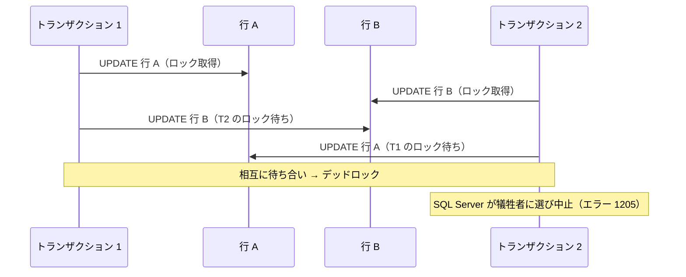
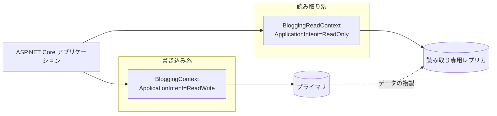

このページは [第8章：データベースアクセスと ORM (Entity Framework Core)](../08-entity-framework-core/index.md) の付録です。保存の応用、トランザクションと同時実行制御、イベントとインターセプター、読み取り専用レプリカを扱います。

本編を先に読んでから、必要な項目をここで参照してください。

**第8章のほかの付録**

- [付録 EF Core 1：モデル定義（エンティティとリレーションシップ）](../appendix-efcore-01/index.md)
- [付録 EF Core 2：モデル定義（キー・採番・SQL Server 固有）](../appendix-efcore-02/index.md)
- [付録 EF Core 3：マイグレーションの詳細とクエリ](../appendix-efcore-03/index.md)
- [付録 EF Core 5：パフォーマンス](../appendix-efcore-05/index.md)
- [付録 EF Core 6：テスト](../appendix-efcore-06/index.md)


---

## 目次

1. [保存の応用](#1-保存の応用)
   - [切断されたエンティティのグラフを保存する](#切断されたエンティティのグラフを保存する)
   - [保存のバッチ処理](#保存のバッチ処理)
   - [データベーストリガーがあるテーブルの保存](#データベーストリガーがあるテーブルの保存)
   - [保存をストアドプロシージャに割り当てる](#保存をストアドプロシージャに割り当てる)
   - [一括更新・一括削除](#一括更新一括削除)
   - [変更追跡の細かい挙動](#変更追跡の細かい挙動)
2. [トランザクションと同時実行制御](#2-トランザクションと同時実行制御)
   - [自動トランザクションの作成を制御する](#自動トランザクションの作成を制御する)
   - [セーブポイント](#セーブポイント)
   - [楽観的同時実行制御](#楽観的同時実行制御)
   - [分離レベルによる同時実行制御](#分離レベルによる同時実行制御)
   - [接続の回復性とトランザクションの併用](#接続の回復性とトランザクションの併用)
   - [デッドロックへの対処](#デッドロックへの対処)
3. [イベントとインターセプター](#3-イベントとインターセプター)
   - [変更追跡イベントで状態の変化を捕まえる](#変更追跡イベントで状態の変化を捕まえる)
   - [診断リスナーでプロセス全体のイベントを観測する](#診断リスナーでプロセス全体のイベントを観測する)
   - [インターセプターによる横断的な処理](#インターセプターによる横断的な処理)
4. [読み取り専用レプリカ (Read-Only Replica) の扱い](#4-読み取り専用レプリカ-read-only-replica-の扱い)
   - [読み取りスケールアウトの仕組み](#読み取りスケールアウトの仕組み)
   - [データ整合性と遅延の制約](#データ整合性と遅延の制約)
   - [EF Core 側での読み書き分離](#ef-core-側での読み書き分離)
   - [読み取り専用 DbContext の設計](#読み取り専用-dbcontext-の設計)
   - [どのクエリをレプリカに流すか](#どのクエリをレプリカに流すか)
5. [参考ドキュメント](#5-参考ドキュメント)

---

## 1. 保存の応用

### 切断されたエンティティのグラフを保存する

Web API では、親と子をまとめた JSON をクライアントから受け取り、そのグラフごと保存したい場面がよくあります。`Add` / `Attach` / `Update` はグラフを再帰的にたどり、エンティティごとに状態を決めます。

[公式の切断されたエンティティの説明](https://learn.microsoft.com/ja-jp/ef/core/saving/disconnected-entities)では、自動生成キー（`int` や `Guid` の主キー）を使う場合、**キー値が未設定のエンティティを新規として扱う**と説明しています。次は、`Id` を持つ子 2 件と `Id` 未設定の子 1 件を含むグラフを `Update` に渡した確認例です。

```csharp
var graph = new Blog
{
    Id = 1,
    Name = "更新後",
    Url = "https://example.com",
    Posts =
    {
        new Post { Id = 1, Title = "既存 1" },
        new Post { Id = 2, Title = "既存 2" },
        new Post { Title = "新規（Id 未設定）" },
    },
};
context.Update(graph);
```

```text
Blog {Id: 1} Modified
Post {Id: -2147482644} Added FK {BlogId: 1}
Post {Id: 1} Modified FK {BlogId: 1}
Post {Id: 2} Modified FK {BlogId: 1}
```

`Id` が未設定だった 1 件だけが `Added` になり、**一時キー値**（負の値）が割り当てられています。この値は `SaveChanges` までの間だけ使われ、保存後にデータベースが採番した実際の値へ置き換わります。`Attach` を使うと、既存のエンティティは `Modified` ではなく `Unchanged` になります（新規の判定は同じです）。

> [!WARNING]
> [公式の削除の扱い](https://learn.microsoft.com/ja-jp/ef/core/saving/disconnected-entities#handling-deletes)では、切断されたグラフからエンティティが欠けている場合、削除の意図をアプリケーション側で扱う方法として次の 2 つを挙げています。
>
> - **論理削除 (soft delete)** にして、削除を更新として扱う（[付録2の「グローバルクエリフィルターと名前付きクエリフィルター」](../appendix-efcore-02/index.md#グローバルクエリフィルターと名前付きクエリフィルター)と組み合わせる）
> - データベースを読み込んでグラフの差分を取り、消えている子に `Remove` を呼ぶ
>
> **未追跡の子を送信グラフから省くだけでは、`Update` は削除と判断しません。** 子 3 件のうち 1 件だけを含む切断グラフを `Update` して保存する確認例でも、テーブルの件数は 3 件のままです。これは追跡済みグラフのリレーションシップを切断する操作とは区別してください。

状態の決め方を自分で制御したい場合は `ChangeTracker.TrackGraph` を使います。グラフ内の各エンティティを追跡する直前にコールバックが呼ばれるため、DTO に持たせたフラグなどで判定できます。

```csharp
context.ChangeTracker.TrackGraph(graph, node =>
{
    var entry = node.Entry;
    var id = (int)entry.Property("Id").CurrentValue!;

    entry.State = id switch
    {
        0 => EntityState.Added,
        _ => EntityState.Modified,
    };
});
```

#### 同じキーのインスタンスが混ざったグラフ

[公式の ID 解決の説明](https://learn.microsoft.com/ja-jp/ef/core/change-tracking/identity-resolution)では、同じキーのエンティティを複数のインスタンスとして追跡できないとしています。クライアントから受け取った JSON では、この重複が生じることがあります。「投稿の一覧」を「それぞれの投稿が属するブログ」ごとシリアル化すると、同じブログが何度も現れるためです。

```csharp
// posts[0].Blog と posts[1].Blog が「同じ Id・別インスタンス」になっている
db.AttachRange(posts);
```

```text
InvalidOperationException: The instance of entity type 'Blog' cannot be tracked
because another instance with the same key value for {'Id'} is already being tracked.
When attaching existing entities, ensure that only one entity instance with a given
key value is attached.
```

対処は、公式が示す **シリアル化の側で参照を保持する設定**か、**追跡しながら行う ID 解決 (identity resolution)** です。上の例外は重複インスタンスを追跡する構成で確認できています。

> [!NOTE]
> 参照を保持する設定は、`System.Text.Json` では `ReferenceHandler.Preserve`、Json.NET では `JsonSerializerSettings.PreserveReferencesHandling = PreserveReferencesHandling.All` です。公式の[参照の保持](https://learn.microsoft.com/ja-jp/ef/core/change-tracking/identity-resolution#preserve-references)には両方の例があります。Json.NET でも、同じ `Blog` を 2 回含み、`Post.Blog` がその `Blog` に戻るグラフの往復で、同一インスタンスの復元とデータベースへの更新を確認できています（EF Core 10.0.11、SQLite）。
>
> これは**オブジェクト参照の保持**であり、EF Core の主キーを見て別インスタンスを統合する設定ではありません。シリアル化前から同じキーの別インスタンスが混在する確認例では、復元後も別インスタンスのままで、追跡時の例外が確認できています。また、参照形式は `$id` / `$ref` / `$values` を含むため、通常の JSON と同じ形にはなりません。

後者は `TrackGraph` で書けます。すでに同じキーが追跡されていれば、そのノードを追跡しないという判断をコールバックの中で下します。

```csharp
db.ChangeTracker.TrackGraph(root, node =>
{
    var entry = node.Entry;
    var keyValue = entry.Property("Id").CurrentValue;

    var existing = db.ChangeTracker.Entries().FirstOrDefault(
        e => e.Metadata == entry.Metadata
             && Equals(e.Property("Id").CurrentValue, keyValue));

    if (existing == null)
    {
        entry.State = EntityState.Unchanged;
    }
});
```

次は、重複を含むグラフを 2 つ渡した確認例です。この条件では `Blog` が 1 つに集約され、合計 3 エンティティの追跡を確認できています。

```text
Blog {Id: 1} Unchanged
Post {Id: 1} Unchanged FK {BlogId: 1}
Post {Id: 2} Unchanged FK {BlogId: 1}
```

> [!WARNING]
> このやり方では、**先に見つかったインスタンスの値が採用され、後から来た重複インスタンスの値は捨てられます。** 重複の間で値が食い違っている可能性がある場合は、どちらを優先するかを明示的に決めてください。

#### チェンジトラッカーの中身を見る

思ったとおりの状態になっているかは、`ChangeTracker.DebugView` で確認できます。公式ドキュメントの説明どおり、**`ShortView` は追跡中のエンティティ・その状態・キー値だけ**を、**`LongView` はさらにすべてのプロパティ値とナビゲーションの状態まで**表示します。

次は、`Blog` を 1 件読み込んで `Name` を書き換えた状態で、両方を出力する確認例です。

```csharp
context.ChangeTracker.DetectChanges();
Console.WriteLine(context.ChangeTracker.DebugView.ShortView);
```

```text
Blog {Id: 1} Modified
Post {Id: 1} Unchanged FK {BlogId: 1}
```

```csharp
Console.WriteLine(context.ChangeTracker.DebugView.LongView);
```

```text
Blog {Id: 1} Modified
    Id: 1 PK
    Name: '書き換え後' Modified Originally '元の名前'
  Posts: [{Id: 1}]
Post {Id: 1} Unchanged
    Id: 1 PK
    BlogId: 1 FK
    Title: '投稿1'
  Blog: {Id: 1}
```

**「どのプロパティが変わったのか」を知りたいときは `LongView`** です。`ShortView` は件数が多いときに全体を俯瞰する用途に向いています。

> [!NOTE]
> 公式のサンプルと同じく、**表示する前に `DetectChanges()` を明示的に呼んでください。** `DebugView` を読むだけでは変更検出が走らないため、プロパティを書き換えた直後に表示すると、値は新しいのに状態が `Unchanged` のままという食い違いが起きます。前述した `SaveChanges` や `ChangeTracker.Entries()` を経由していれば、変更検出は自動的に済んでいます。

#### 保存前のキーには一時値が入る

[公式の一時値 (temporary value)](https://learn.microsoft.com/ja-jp/ef/core/change-tracking/miscellaneous#temporary-values)では、保存後のデータベース生成キーに代わる値を追跡内部に保持します。次は `int` 主キーで、`DebugView` の負の一時値を確認した例です。すべてのキーで同じ動作ではなく、SQL Server の [GUID 主キー](https://learn.microsoft.com/ja-jp/ef/core/providers/sql-server/value-generation#guids)のようにクライアント側で値を生成する場合もあります。

```text
Blog {Id: -2147482647} Added
Post {Id: -2147482647} Added FK {BlogId: -2147482647}
```

一方、エンティティのプロパティ自体は `0` のままです。一時値は変更追跡の内部にだけ保持され、エンティティには書き戻されません。

```csharp
db.Add(blog);
Console.WriteLine(blog.Id);                                        // 0
Console.WriteLine(db.Entry(blog).Property(x => x.Id).IsTemporary); // True

await db.SaveChangesAsync();
Console.WriteLine(blog.Id);                                        // 1
Console.WriteLine(db.Entry(blog).Property(x => x.Id).IsTemporary); // False
```

子の外部キー (`Post.BlogId`) にも同じ一時値が伝播しています。**保存前の親子関係は、この一時値によって結ばれています。** `SaveChanges` が親を挿入して本物のキーを受け取ると、EF Core は子の外部キーを実際の値に置き換えてから子を挿入します。

> [!WARNING]
> `SaveChanges` の前に主キーの値を読んで、それをログや外部システムに渡してはいけません。エンティティのプロパティは `0` のままですし、`DebugView` に見える負の数も保存後には存在しない値です。**キーが必要なら `SaveChanges` の後に読んでください。**

### 保存のバッチ処理

EF Core は `SaveChanges` で追跡している変更をバッチにまとめ、データベースとの往復回数を抑えます。ただし、すべての変更が 1 回の送信で完結するわけではありません。公式ドキュメントは SQL Server について「4 文未満ではバッチ処理は概して効率が悪く、40 文前後を超えると利点が薄れるため、**既定では 1 回のバッチで最大 42 文まで**を実行し、残りは別の往復で実行する」と説明しています。

次は、SQL Server 2022 に対して N 件の `Add` を保存したときの確認例です。このモデルでは、42 件と 43 件の間で保存 SQL の `DbCommand` が分割されることを確認できています。

| 保存した件数 | 発行された `DbCommand` |
| --- | --- |
| 42 | 1 回 |
| 43 | 2 回 |
| 84 | 2 回 |
| 85 | 3 回 |

この上限は `MaxBatchSize` で変更できます。`MinBatchSize` でバッチ処理を始める下限も指定できます。

```csharp
builder.Services.AddDbContext<BloggingContext>(options =>
    options.UseSqlServer(connectionString, sqlOptions => sqlOptions
        .MinBatchSize(1)
        .MaxBatchSize(100)));
```

> [!NOTE]
> [EF Core 10.0.11 の SQL Server プロバイダー実装](https://github.com/dotnet/efcore/blob/v10.0.11/src/EFCore.SqlServer/Update/Internal/SqlServerModificationCommandBatchFactory.cs)は `MaxMaxBatchSize = 1000` と定義し、指定値と 1000 の小さいほうを採用します。この版の 1,200 件保存の確認例でも、`MaxBatchSize(2000)` と `MaxBatchSize(1000)` の往復は同じ 2 回です。**この版では 1000 を超える指定で上限を増やせません。**

> [!WARNING]
> [公式のバッチ処理の説明](https://learn.microsoft.com/ja-jp/ef/core/performance/efficient-updating#batching)では、バッチの上限を超える文は追加の往復で実行されます。次は、Azure Container Instances 上の SQL Server 2022 に対して 1,000 件を挿入した条件での所要時間です（3 回測定の中央値）。
>
> | `MaxBatchSize` | 所要時間 |
> | --- | --- |
> | 1 | 209,354 ms |
> | 既定（42） | 5,542 ms |
> | 1000 | 272 ms |
>
> この数値は、当時の接続経路で 1,000 件を挿入し、`SaveChangesAsync` の時間を 3 回測った中央値です。この測定には、同一ネットワーク内での対照や通信遅延だけの切り分けは含まれていないため、別の環境でも同じ差が出るとは限りません。公式が「40 文前後を超えると利点が薄れる」としているとおり、既定値を変えるかどうかは必ず自分の環境で計測してから判断してください。

> [!TIP]
> そもそも大量の行を同じ条件で更新・削除するなら、バッチサイズを調整するより `ExecuteUpdate` / `ExecuteDelete` を使うほうが効果的です。公式も、変更追跡を経由せず 1 回の往復で完結する点を利点として挙げています。詳しくは後述の [一括更新・一括削除](#一括更新一括削除) を参照してください。

### データベーストリガーがあるテーブルの保存

EF Core は `SaveChanges` のとき、SQL Server では T-SQL の **`OUTPUT` 句** を使って生成された値（`IDENTITY` の主キーなど）を効率よく取得します。ところが **`INTO` のない `OUTPUT` 句は、その操作に対応するトリガーが有効なテーブルには使えません**。`OUTPUT ... INTO` とは制約が異なります。

[公式の保存時の破壊的変更](https://learn.microsoft.com/ja-jp/ef/core/what-is-new/ef-core-7.0/breaking-changes#sqlserver-tables-with-triggers)に対応する確認例では、トリガー付きテーブルを未構成のまま保存すると、次の `DbUpdateException` が確認できています（EF Core 10.0.11、SQL Server 2022）。この例のエラー番号 334 と詳細メッセージは**内部例外の `SqlException`** にあります。

```text
DbUpdateException: Could not save changes because the target table has database triggers.
Please configure your table accordingly, see
https://aka.ms/efcore-docs-sqlserver-save-changes-and-output-clause for more information.
→ SqlException (Number=334): The target table 'Blogs' of the DML statement cannot have any
enabled triggers if the statement contains an OUTPUT clause without INTO clause.
```

対処方法は 2 つあります。テーブルにトリガーがあることを EF Core に伝えるか、`UseSqlOutputClause(false)` で、`OUTPUT` による直接の結果返却を避ける保存方式へ切り替えます。以下の方法 1 または方法 2 のいずれかを使います。`OUTPUT ... INTO` まで一律に禁止する設定という意味ではありません。

```csharp
protected override void OnModelCreating(ModelBuilder modelBuilder)
{
    // 方法 1: トリガーの存在を宣言する
    modelBuilder.Entity<Blog>()
        .ToTable(tb => tb.HasTrigger("TR_Blogs_Insert"));

    // 方法 2: 直接結果を返す OUTPUT を避ける保存方式に切り替える
    modelBuilder.Entity<Blog>()
        .ToTable(tb => tb.UseSqlOutputClause(false));
}
```

どちらの構成でも、有効な `AFTER INSERT` トリガーがあるテーブルへの保存を確認できています。以下は、同じ `Blog` モデルで **2 件を保存したときの SQL の概略**です。比較用の既定方式の SQL は、トリガーなしの条件での出力です。生成される SQL の形は、保存する件数やモデルの構成にも依存します。

```sql
-- 2 件・トリガーなしの既定方式（観測した SQL の概略）
MERGE ... INSERT ([Name]) VALUES (i.[Name])
OUTPUT INSERTED.[Id], i._Position;

-- 2 件・トリガーありで方法 1 または方法 2 を構成（同一 DbCommand 内の SQL の概略）
INSERT INTO [Blogs] ([Name]) VALUES (@p0);
SELECT [Id] ...
INSERT INTO [Blogs] ([Name]) VALUES (@p1);
SELECT [Id] ...
```

> [!WARNING]
> これは EF Core 7 で入った破壊的変更です。公式の破壊的変更一覧でも影響度 **High** に分類されており、「既定でより効率的な手法で保存するようになったが、その手法は対象テーブルにトリガーがある場合 SQL Server ではサポートされない」と説明されています。EF Core 6 以前から移行してきて保存だけが失敗する場合は、まずトリガーの有無を疑ってください。

> [!NOTE]
> **SQL 文の数と、保存 SQL を送る `DbCommand` の数は別です。** 公式の[保存のバッチ処理](https://learn.microsoft.com/ja-jp/ef/core/performance/efficient-updating#batching)は、複数の SQL 文を 1 回の往復にまとめると説明しています。[EF Core 10.0.11 の SQL 生成実装](https://github.com/dotnet/efcore/blob/v10.0.11/src/EFCore.SqlServer/Update/Internal/SqlServerUpdateSqlGenerator.cs)には、`INSERT` と SELECT、または `MERGE ... OUTPUT ... INTO` を使う分岐があります。同じ `Blog` モデルでの確認では、上の 2 件保存も 10 件保存も両構成の保存 SQL は 1 つの `DbCommand` です（SQL Server 2022）。これはトランザクション制御を含む通信全体の往復数ではありません。
>
> 多くのテーブルにトリガーがある場合は、`IModelFinalizingConvention` を実装したモデル構築規約で全テーブルにまとめて適用する方法が公式に案内されています。

> [!TIP]
> SQLite では `RETURNING` 句の制限に注意が必要です。**AFTER トリガーが変更した値を保存時に読み戻す場合や、仮想テーブルを更新する場合**は、[公式の案内](https://learn.microsoft.com/ja-jp/ef/core/what-is-new/ef-core-7.0/breaking-changes#sqlite-tables-with-after-triggers-and-virtual-tables-now-require-special-ef-core-configuration)に従い、テーブルに `UseSqlReturningClause(false)` を設定します。EF Core 10.0.11 / SQLite の確認例では、既定の読み戻し値はトリガー変更前の `before` で、FTS5 仮想テーブルの更新は失敗です。同設定による変更後の値 `after` の読み戻しと更新成功を、それぞれ確認できています。

### 保存をストアドプロシージャに割り当てる

既存のデータベースで「テーブルへの直接の書き込みは禁止、更新はすべてストアドプロシージャ経由」という運用が決まっていることがあります。EF Core 7 以降は、`INSERT` / `UPDATE` / `DELETE` の各コマンドをストアドプロシージャに割り当てられます。

> [!IMPORTANT]
> 公式ドキュメントは「ストアドプロシージャのマッピングをサポートしていることは、ストアドプロシージャを推奨していることを意味しない」と明記しています。既存の運用ルールに合わせる必要がある場合の手段だと考えてください。

割り当ては `OnModelCreating` で行います。次は SQL Server の例です。

```csharp
protected override void OnModelCreating(ModelBuilder modelBuilder)
{
    modelBuilder.Entity<Person>()
        .InsertUsingStoredProcedure(
            "People_Insert",
            sp =>
            {
                sp.HasParameter(p => p.Name);
                sp.HasResultColumn(p => p.Id);     // IDENTITY で採番された値を受け取る
            })
        .UpdateUsingStoredProcedure(
            "People_Update",
            sp =>
            {
                sp.HasOriginalValueParameter(p => p.Id);
                sp.HasParameter(p => p.Name);
                sp.HasRowsAffectedResultColumn(); // 影響行数を返してもらう
            })
        .DeleteUsingStoredProcedure(
            "People_Delete",
            sp =>
            {
                sp.HasOriginalValueParameter(p => p.Id);
                sp.HasRowsAffectedResultColumn();
            });
}
```

この構成で `SaveChangesAsync` を呼ぶと、EF Core が発行する SQL（SQL Server）は次のようになります。この条件で、通常の `INSERT` 文ではなく `EXEC` が使われることを確認できています。

```sql
SET NOCOUNT ON;
EXEC [People_Insert] @p0;
```

```sql
SET NOCOUNT ON;
EXEC [People_Update] @p0, @p1;
```

ストアドプロシージャ側は次のように用意します（SQL Server の例）。

```sql
CREATE PROCEDURE [dbo].[People_Insert]
    @Name [nvarchar](max)
AS
BEGIN
      INSERT INTO [People] ([Name])
      OUTPUT INSERTED.[Id]
      VALUES (@Name);
END
```

構成を組み立てるうえで、公式ドキュメントが挙げている注意点は次のとおりです。

| 項目 | 内容 |
| --- | --- |
| 名前の省略 | 第 1 引数の名前は省略できます。省略するとテーブル名に `_Insert` / `_Update` / `_Delete` を付けた名前が使われます（このモデルの確認例では `Docs_Update`） |
| パラメーターの順序 | **ストアドプロシージャの定義と同じ順序**で追加します。EF Core は名前付き引数ではなく常に位置引数で呼び出すためです |
| キーの指定 | 更新・削除ではキーに `HasOriginalValueParameter` を使います。将来のバージョンで可変のキー値がサポートされたときに正しい行が更新されるようにするためです |
| 値の返し方 | 出力パラメーター、`HasResultColumn`（結果列）、`HasRowsAffectedReturnValue`（戻り値、影響行数のみ）の 3 とおりがあります |
| 継承 | TPH は 1 組、TPT は抽象型を含むすべての型、TPC は具象型ごとにストアドプロシージャが必要です |

> [!TIP]
> [公式のマッピングの説明](https://learn.microsoft.com/ja-jp/ef/core/what-is-new/ef-core-7.0/whatsnew#stored-procedure-mapping)のとおり、**すべての型・すべての操作に用意する必要はありません。** `UpdateUsingStoredProcedure` だけを構成した確認例でも、挿入は通常の `INSERT ... OUTPUT INSERTED.[Id]`、更新は `EXEC [Docs_Update]` です。

[公式のストアドプロシージャの同時実行制御](https://learn.microsoft.com/ja-jp/ef/core/what-is-new/ef-core-7.0/whatsnew#optimistic-concurrency)では、`HasRowsAffectedResultColumn` などで影響行数を返して期待行数と比較し、同時実行トークンも `WHERE` 条件に含めます。補足として、トークンを含めず `WHERE [Id] = @Id` と `SELECT @@ROWCOUNT` を使う確認例でも、別の操作で行を削除した後の更新は 0 行となり、`DbUpdateConcurrencyException` を確認できています。これは削除競合の確認であり、同時更新のトークンによる検出とは別です。

```text
The database operation was expected to affect 1 row(s), but actually affected 0 row(s);
data may have been modified or deleted since entities were loaded.
```

> [!WARNING]
> **ストアドプロシージャ本体の DDL は、自分でマイグレーションへ記述します。** [公式の任意 SQL による変更](https://learn.microsoft.com/ja-jp/ef/core/managing-schemas/migrations/managing#arbitrary-changes-via-raw-sql)は、ストアドプロシージャ・ビュー・トリガー・関数など、EF Core が関知しないオブジェクトを管理する方法を示しています。モデルを変更せずに空のマイグレーションを追加し、`migrationBuilder.Sql(...)` に DDL を書きます。保存操作のマッピングと、本体の作成は別の設定です。
>
> ```csharp
> migrationBuilder.Sql(
> @"
>     EXEC ('CREATE PROCEDURE getFullName
>         @LastName nvarchar(50),
>         @FirstName nvarchar(50)
>     AS
>         SELECT @LastName + @FirstName;')");
> ```
>
> 公式ドキュメントは、`CREATE PROCEDURE` のように「バッチの先頭でなければならない文」を実行するために `EXEC ('...')` で包む書き方を案内しています。またマイグレーションの一部の操作はトランザクション内で実行できないことがあり、その場合は `migrationBuilder.Sql(..., suppressTransaction: true)` でトランザクションから外します。

> [!NOTE]
> ストアドプロシージャに割り当てられるのは**保存（挿入・更新・削除）だけ**です。クエリは従来どおり通常の `SELECT` が発行されます。ストアドプロシージャからデータを読み取りたい場合は、[付録 EF Core 3 の「生の SQL を使う」](../appendix-efcore-03/index.md#生の-sql-を使う)で扱う `FromSql` を使います。

### 一括更新・一括削除

多数の行を更新・削除する場合、すべてのエンティティを読み込んで変更追跡させるのは非効率です。`ExecuteUpdateAsync` / `ExecuteDeleteAsync` は、エンティティを読み込まずに単一の SQL 文を発行します。

この節は[付録1の「値の変換・所有型・複合型」](../appendix-efcore-01/index.md#値の変換所有型複合型)に掲載した `PostStatus` / `Post` / `Comment` / `Author` / `Address` を使います。本編の同名エンティティとは混ぜず、これらの型を同じ `PostStatusSample` 名前空間に配置してください。`BlogId` はこの検証モデルでは対象ブログの識別値として持ち、`Blog` ナビゲーションは定義しません。

```csharp
using Microsoft.EntityFrameworkCore;

namespace PostStatusSample;

public class PostStatusContext(DbContextOptions<PostStatusContext> options) : DbContext(options)
{
    public DbSet<Post> Posts => Set<Post>();

    protected override void OnModelCreating(ModelBuilder modelBuilder)
    {
        modelBuilder.Entity<Post>()
            .Property(p => p.Status).HasConversion<string>().HasMaxLength(20);
        modelBuilder.Entity<Author>().OwnsOne(a => a.Address);
    }
}
```

以下の `context` は SQL Server を構成した `PostStatusContext`、`threshold` は `DateTimeOffset.UtcNow.AddYears(-1)`、`blogId` は対象ブログの ID です。

```csharp
// 1 年以上前の下書きを一括削除
var deleted = await context.Posts
    .Where(p => p.Status == PostStatus.Draft && p.CreatedAt < threshold)
    .ExecuteDeleteAsync(cancellationToken);

// 特定ブログの投稿をまとめてアーカイブ
var updated = await context.Posts
    .Where(p => p.BlogId == blogId)
    .ExecuteUpdateAsync(
        setters => setters
            .SetProperty(p => p.Status, PostStatus.Archived)
            .SetProperty(p => p.ArchivedAt, DateTimeOffset.UtcNow),
        cancellationToken);
```

EF Core 10 では `ExecuteUpdateAsync` が通常のラムダ（式ツリーでないもの）を受け付けるようになり、条件分岐を含む構築が書けるようになりました。

```csharp
await context.Posts
    .Where(p => p.BlogId == blogId)
    .ExecuteUpdateAsync(setters =>
    {
        setters.SetProperty(p => p.Status, PostStatus.Archived);

        if (includeTimestamp)
        {
            setters.SetProperty(p => p.ArchivedAt, DateTimeOffset.UtcNow);
        }
    },
    cancellationToken);
```

EF Core 10 では、**JSON 列にマッピングされた複合型のプロパティも `ExecuteUpdateAsync` で更新できる** ようになりました。従来の `ExecuteUpdateAsync` は JSON 列の更新に対応していませんでした。複合型と所有型の違いは[付録1の「値の変換・所有型・複合型」](../appendix-efcore-01/index.md#値の変換所有型複合型)で扱います。

```csharp
modelBuilder.Entity<Blog>().ComplexProperty(b => b.Details, bd => bd.ToJson());
```

```csharp
await context.Blogs.ExecuteUpdateAsync(s =>
    s.SetProperty(b => b.Details.Views, b => b.Details.Views + 1));
```

[公式の JSON 列の一括更新](https://learn.microsoft.com/ja-jp/ef/core/what-is-new/ef-core-10.0/whatsnew#executeupdate-support-for-relational-json-columns)に対応する確認例です。SQL Server 2022（JSON は `nvarchar(max)`）では、次の `JSON_MODIFY` を使う SQL と、`{"Title":"T","Views":10}` から `{"Title":"T","Views":11}` への更新を確認できています。

```sql
UPDATE [b]
SET [b].[Details] = JSON_MODIFY([b].[Details], '$.Views',
        CAST(JSON_VALUE([b].[Details], '$.Views') AS int) + 1)
FROM [Blogs] AS [b]
```

> [!NOTE]
> この機能は **複合型 (`ComplexProperty`) としてマッピングした場合にのみ動作します。** 公式ドキュメントは「所有型 (owned entity type) としてマッピングした場合は動作しない」と明記しています。既存のコードで `OwnsOne(...).ToJson()` を使っている場合は、複合型への移行が必要です。
>
> ネイティブの `json` 型に対応する SQL Server 2025 では、EF Core は `JSON_MODIFY` ではなく `modify` メソッドを使って更新できます。[公式ドキュメント](https://learn.microsoft.com/ja-jp/sql/t-sql/data-types/json-data-type?view=sql-server-ver17#the-modify-method)では、SQL Server 2025 の `json` 型と `modify` メソッドはプレビューとされています。EF Core 10.0.11 / SQL Server 2025 17.0.4085.5 の x64 環境で、`UseCompatibilityLevel(170)`、`json` 列、`.modify(...)` を使う SQL、`Views` の 10 から 11 への更新を確認できています。SQL Server 2022 の確認とは別条件であり、性能差の根拠にはしません。

> [!IMPORTANT]
> `ExecuteUpdateAsync` / `ExecuteDeleteAsync` はチェンジトラッカーを経由しません。そのため、`DbContext` がすでに追跡しているエンティティの状態は更新されず、`SaveChangesAsync` によるカスケード削除や監査ログ（`SaveChangesAsync` のオーバーライド）も動作しません。実行後は `ChangeTracker.Clear()` を呼ぶか、新しい `DbContext` を使って読み直してください。
>
> [公式の同時実行制御の説明](https://learn.microsoft.com/ja-jp/ef/core/saving/execute-insert-update-delete#concurrency-control-and-rows-affected)のとおり、**これらの API は同時実行トークンによる競合検出を自動では行いません。** SQL Server 2022 の確認例でも、先行更新で `Version` が変わった後にトークン条件なしの `ExecuteUpdateAsync` を実行すると、影響行数は 1 で上書きを確認できています。競合を検出するには条件と影響行数を自分で扱うか、同時実行トークンを構成して `SaveChangesAsync` を使います。

### 変更追跡の細かい挙動

#### 追跡済みインスタンスがクエリ結果を上書きする

追跡クエリでは、EF Core は同じキー値のエンティティを 1 つのインスタンスとしてしか追跡しません。これを **ID 解決 (identity resolution)** と呼びます。すでに追跡中のインスタンスがある場合、新しいインスタンスを作る代わりに既存のものが返されます。

ここに重要な副作用があります。**同じ `DbContext` で同じ行を読み直しても、データベース側の変更は結果に反映されません。**

```csharp
var first = await context.Blogs.FirstAsync();   // "元の名前"

// この間に別のセッションが Blogs を更新したとする

var second = await context.Blogs.FirstAsync();  // "元の名前" のまま
ReferenceEquals(first, second);                 // true
```

[公式の追跡クエリの説明](https://learn.microsoft.com/ja-jp/ef/core/change-tracking/identity-resolution#identity-resolution-and-queries)は、既存インスタンスを再利用し値を上書きしないことを、`DbContext` を作業単位ごとに新しくする理由に挙げています。別接続から更新した行を読む確認例でも、同じ `DbContext` は古い値、新しい `DbContext` または `ChangeTracker.Clear()` 後は更新後の値を返すことを確認できています。

> [!WARNING]
> 同じキー値を持つ別々のインスタンスを追跡させようとすると例外になります。クライアントから受け取った JSON を展開したときに同じエンティティが複数箇所に現れる場合などに起きます。
>
> ```text
> InvalidOperationException: The instance of entity type 'Blog' cannot be tracked because
> another instance with the same key value for {'Id'} is already being tracked. When
> attaching existing entities, ensure that only one entity instance with a given key value
> is attached.
> ```
>
> グラフを追跡させる前に、重複するインスタンスを 1 つにまとめておいてください。

#### リレーションシップ修正

EF Core は、読み込み時や変更検出時に外部キーの値とナビゲーションプロパティの整合を取ります。これを **リレーションシップ修正 (relationship fixup)** と呼びます。追跡中のエンティティ同士では、別々のクエリで読み込んだ場合にも働きます。

そのため、`Include` を書いていなくてもナビゲーションが埋まることがあります。

```csharp
var blog = await context.Blogs.FirstAsync();
Console.WriteLine(blog.Posts.Count); // 0

await context.Posts.ToListAsync();   // 別のクエリで Post を読む
Console.WriteLine(blog.Posts.Count); // 2 に増えている
```

[公式のリレーションシップ修正](https://learn.microsoft.com/ja-jp/ef/core/change-tracking/relationship-changes)は双方向に働きます。このモデルでも、変更検出後に外部キーとナビゲーションの相互の追従を確認できています。

> [!NOTE]
> 公式の[変更検出](https://learn.microsoft.com/ja-jp/ef/core/change-tracking/change-detection)は、CLR プロパティを直接変更する場合と EF Core の API を介する場合を区別しています。既定のスナップショット追跡では、代入と同時に整合が取れるわけではありません。`post.BlogId` を直接変更する確認例では、`DetectChanges()` の前は元のナビゲーション、呼び出し後は更新後のナビゲーションとコレクションを確認できています。

> [!TIP]
> この挙動は、テストで「`Include` を書き忘れているのに動いてしまう」原因になります。同じ `DbContext` でたまたま関連エンティティを読んでいるだけで、本番の経路では `null` になることがあります。関連データが必要な箇所では `Include` を明示してください。`AsNoTracking()` は**そのコンテキストがすでに追跡しているエンティティとの補完**を行わないため、付けて確認するのも有効です。ただし、同じ非追跡クエリで `Include` や `AutoInclude` により読み込んだ関連データまで無効になるわけではありません。

## 2. トランザクションと同時実行制御

### 自動トランザクションの作成を制御する

`SaveChangesAsync` は、自分でトランザクションを開始していない場合、**必要なときだけ**トランザクションを作ります。この判断は `Database.AutoTransactionBehavior` で変更できます。

```csharp
context.Database.AutoTransactionBehavior = AutoTransactionBehavior.Always;
```

| 値 | 公式ドキュメントの説明 |
| --- | --- |
| `WhenNeeded`（既定） | 必要なときだけ作る。単一の SQL 文はデータベース側で暗黙にトランザクションとして実行されるため、EF Core は明示的なトランザクションを作らない |
| `Always` | ユーザーのトランザクションがなければ常に作る。**往復が増えて性能が落ちる可能性がある** |
| `Never` | 自動では決して作らない |

次は、SQL Server 2022、`MaxBatchSize(1)`、保存 1 行または 3 行の条件で、`TransactionStarted` イベントから開始回数を確認した結果です。

| 設定 | 保存行数（`MaxBatchSize(1)`） | トランザクション開始 |
| --- | --- | --- |
| `WhenNeeded`（既定） | 1 | 0 回 |
| `WhenNeeded`（既定） | 3 | 1 回 |
| `Always` | 1 | **1 回** |
| `Always` | 3 | 1 回 |
| `Never` | 1 | 0 回 |
| `Never` | 3 | **0 回** |

[公式の `AutoTransactionBehavior` API](https://learn.microsoft.com/ja-jp/dotnet/api/microsoft.entityframeworkcore.autotransactionbehavior?view=efcore-10.0)では、`WhenNeeded` は必要な場合に作成する設定です。`DbCommand` 数だけの判定とはしません。EF Core 10.0.11 / SQL Server 2022 の 4 行更新の確認例では、**1 コマンドでもトランザクション開始は 1 回**です。上の表とは `MaxBatchSize` の条件が異なります。

> [!NOTE]
> [Microsoft のサポート対象は x86-64 の Linux ホストであり、エミュレーション環境は対象外](https://learn.microsoft.com/ja-jp/sql/linux/install-upgrade/quickstart-install-docker?view=sql-server-ver16)です。この追加対照と、後述のデッドロック再試行・保存ガードの追加対照は、ARM64 ホスト上の amd64 SQL Server 2022 コンテナーのエミュレーション環境での観測です。本番環境のサポートや性能を示すものではありません。

> [!WARNING]
> **`Never` は慎重に使ってください。** 公式ドキュメントは「`SaveChanges` が複数のコマンドを実行する必要があり、その途中で失敗した場合、先行するコマンドはすでにコミットされている可能性があり、データベースに部分的な変更が残る」と警告しています。上の確認例でも、`Never` では 3 コマンドに対する明示的なトランザクション開始は 0 回です。
>
> `Always` が役に立つのは、`IDbTransactionInterceptor` のトランザクション生成コールバックが `SaveChanges` のたびに呼ばれることをアプリケーションが前提にしている場合だと、公式ドキュメントは説明しています。

### セーブポイント

`SaveChangesAsync` は、すでにトランザクションが開始されている場合、自動的に **セーブポイント** を作成します。保存中にエラーが起きると、そのセーブポイントまでロールバックされ、トランザクション全体は維持されます。

セーブポイントは手動でも作成できます。

```csharp
await using var transaction = await context.Database.BeginTransactionAsync(cancellationToken);

context.Blogs.Add(new Blog { Name = "A", Url = "https://a.example.com" });
await context.SaveChangesAsync(cancellationToken);

await transaction.CreateSavepointAsync("BeforeOptionalWork", cancellationToken);

try
{
    await ImportOptionalDataAsync(context, cancellationToken);
    await context.SaveChangesAsync(cancellationToken);
}
catch
{
    // 任意処理だけを取り消し、それまでの変更は残す
    await transaction.RollbackToSavepointAsync("BeforeOptionalWork", cancellationToken);
}

await transaction.CommitAsync(cancellationToken);
```

> [!WARNING]
> [公式のセーブポイントの警告](https://learn.microsoft.com/ja-jp/ef/core/saving/transactions#savepoints)は、SQL Server の **MARS (Multiple Active Result Sets) とセーブポイントは非互換**としています。接続文字列に `MultipleActiveResultSets=true` を指定すると、実際に MARS を使用していなくても EF Core はセーブポイントを作成せず、保存エラー後にトランザクションの状態が不明になる可能性があります。
>
> EF Core は、アプリケーションが自分で開始したトランザクションの中で `SaveChanges` を呼ぶと、その直前に自動的にセーブポイントを作成します（前述のとおりです）。MARS が有効だとこの自動作成が行われず、次の警告がログに出ます（実測で取得）。
>
> ```text
> Savepoints are disabled because Multiple Active Result Sets (MARS) is enabled.
> If 'SaveChanges' fails, then the transaction cannot be automatically rolled back
> to a known clean state. Instead, the transaction should be rolled back by the
> application before retrying 'SaveChanges'.
> ```
>
> つまり MARS 有効時は、`SaveChanges` が失敗したらアプリケーション側でトランザクション全体をロールバックしてから再試行する必要があります。この状況をバグとして早期に検出したい場合は、警告を例外に昇格させられます。
>
> ```csharp
> options.UseSqlServer(connectionString)
>     .ConfigureWarnings(w => w.Throw(SqlServerEventId.SavepointsDisabledBecauseOfMARS));
> ```
>
> 手動のセーブポイント呼び出しを、MARS 有効時の回避策として扱わないでください。上の手動管理例も、公式の非互換条件に該当しない構成で使います。

### 楽観的同時実行制御

複数のユーザーが同じ行を同時に更新する状況では、後から保存した内容が先の変更を上書きしてしまう「ロストアップデート」が起こります。EF Core では **同時実行トークン** を使った楽観的同時実行制御で検出します。

SQL Server では `rowversion` 列を使うのが一般的です。

```csharp
using System.ComponentModel.DataAnnotations;

public class Blog
{
    public int Id { get; set; }
    public required string Name { get; set; }
    public required string Url { get; set; }

    [Timestamp]
    public byte[]? Version { get; set; }
}
```

Fluent API では次のように書きます。

```csharp
builder.Property(b => b.Version).IsRowVersion();
```

これにより、UPDATE 文の WHERE 句に読み込み時の `Version` が含まれ、更新対象の行が 0 行だった場合に `DbUpdateConcurrencyException` が発生します。実際に SQL Server 2022 に対して発行された SQL は次のとおりです。

```sql
UPDATE [Blogs] SET [Name] = @p0
OUTPUT INSERTED.[Version]
WHERE [Id] = @p1 AND [Version] = @p2;
```

`OUTPUT INSERTED.[Version]` によって、更新後に採番された新しい `Version` がその場でアプリケーション側に返され、追跡中のエンティティに反映されます。そのため、連続して更新しても再読み込みは不要です。

> [!NOTE]
> `[Timestamp]` を付けたプロパティに対して EF Core が生成する列の型は `rowversion` ですが、`INFORMATION_SCHEMA.COLUMNS` で確認すると `timestamp` と表示されます。これは `rowversion` の旧称が `timestamp` であるためで、両者は同じ型です。日付や時刻とはまったく関係がないため、名前に惑わされないでください。

例外の処理例です。ここでは「クライアント側の変更を採用して保存し直す」戦略 (Client Wins) を示します。

```csharp
public async Task<bool> UpdateBlogAsync(int id, string newName, CancellationToken cancellationToken)
{
    var blog = await context.Blogs.FirstAsync(b => b.Id == id, cancellationToken);
    blog.Name = newName;

    try
    {
        await context.SaveChangesAsync(cancellationToken);
        return true;
    }
    catch (DbUpdateConcurrencyException ex)
    {
        foreach (var entry in ex.Entries)
        {
            var databaseValues = await entry.GetDatabaseValuesAsync(cancellationToken);

            if (databaseValues is null)
            {
                // 他のユーザーによって削除されていた
                return false;
            }

            // 「元の値」だけをデータベースの現在値に差し替える。
            // 変更後の値 (CurrentValues) はクライアントのものが残るため、
            // 次の SaveChanges でクライアントの変更が採用される (Client Wins)
            entry.OriginalValues.SetValues(databaseValues);
        }

        await context.SaveChangesAsync(cancellationToken);
        return true;
    }
}
```

競合解決の方針は 3 つに整理できます。

| 戦略 | 内容 |
| --- | --- |
| Client Wins | クライアント側の値で上書きする。`entry.OriginalValues.SetValues(databaseValues)` の後にそのまま保存 |
| Store Wins | データベース側の値を採用し、クライアントの変更を破棄する。`entry.Reload()` |
| ユーザーに提示 | 現在値と変更値を画面に表示し、ユーザーに選択させる |

> [!WARNING]
> `OriginalValues.SetValues(databaseValues)` と `Reload()` は名前が似ていますが結果は正反対です。前者は「元の値」だけを差し替えるため、変更後の値 (`CurrentValues`) はクライアントのものが残り、保存するとデータベース側の変更が **上書きされて失われます**。後者は現在値ごと読み直すため、クライアントの変更が破棄されます。取り違えるとデータを失うため、どちらの動作を意図しているかを必ず確認してください。
>
> SQLite と `IsConcurrencyToken` を使う確認例でも、この 2 つの方針に応じて最終的に残る値の違いを確認できています。

Store Wins にしたい場合は、`OriginalValues.SetValues` の代わりに `ReloadAsync` を呼びます。エンティティの現在値がデータベースの値で置き換わるため、クライアントの変更は失われます。

```csharp
foreach (var entry in ex.Entries)
{
    // 現在値ごとデータベースから読み直す (Store Wins)
    await entry.ReloadAsync(cancellationToken);
}
```

`rowversion` が使えないプロバイダーでは、任意のプロパティを同時実行トークンにできます。次の例は、エンティティに `LastUpdatedAt` プロパティを追加したうえで、それをトークンとして使う想定です。

```csharp
builder.Property(b => b.LastUpdatedAt).IsConcurrencyToken();
```

> [!WARNING]
> [公式のアプリケーション管理トークン](https://learn.microsoft.com/ja-jp/ef/core/saving/concurrency#application-managed-concurrency-tokens)では、**値の更新はアプリケーション側の責任**です。SQLite の確認例でも、先行更新でトークンを変えない条件は上書き、下記の更新処理で値が変わる条件は `DbUpdateConcurrencyException` です。この結果を、オーバーライドだけが検出の実装方法であるという意味にはしません。
>
> ```csharp
> public override Task<int> SaveChangesAsync(CancellationToken cancellationToken = default)
> {
>     foreach (var entry in ChangeTracker.Entries<Blog>()
>                  .Where(e => e.State == EntityState.Modified))
>     {
>         entry.Entity.LastUpdatedAt = DateTime.UtcNow;
>     }
>
>     return base.SaveChangesAsync(cancellationToken);
> }
> ```

> [!NOTE]
> EF Core が既定で提供するのは楽観的同時実行制御です。公式ドキュメントも、悲観的な手法がデータを先にロックしてから変更するのに対し、楽観的同時実行制御は事前にそのようなロックを取らない、と説明しています。

### 分離レベルによる同時実行制御

同時実行制御の手段は同時実行トークンだけではありません。公式ドキュメントは、**トランザクションの分離レベル**を上げる方法も紹介しています。同時実行トークンが不要になり、トランザクション内で常に同じデータが見えるという利点があります。

分離レベルは `BeginTransactionAsync` に渡します。

```csharp
using var transaction = await context.Database
    .BeginTransactionAsync(IsolationLevel.RepeatableRead, cancellationToken);

var account = await context.Accounts.FirstAsync(a => a.Id == id, cancellationToken);
account.Balance += amount;

await context.SaveChangesAsync(cancellationToken);
await transaction.CommitAsync(cancellationToken);
```

公式ドキュメントによると、データベースの実装によって次の 2 通りに分かれます。

| 動作 | 該当する分離レベル | 分類 |
| --- | --- | --- |
| 読み取った行に共有ロックを取り、外部の更新をブロックする | SQL Server の `RepeatableRead`（`Serializable` も同様） | 悲観的ロック |
| ロックは取らず、自分が更新する時点でシリアル化エラーにする | SQL Server の `Snapshot`、PostgreSQL の repeatable read | 楽観的ロック |

以下は、SQL Server 2022 でこの違いを確認した条件付きの結果です。

- **`RepeatableRead`** — トランザクション内で 1 行を読んだ状態を保持した場合、別接続から同じ行への `UPDATE` のブロックと、コマンドタイムアウト（`Number=-2`）を確認できています。
- **`Snapshot`** — 同じ条件で別接続からの `UPDATE` は 0.2 秒で成功し、その後の自分の更新・保存はエラーです。以下は、この確認例の例外チェーン内の `SqlException` です。

```text
SqlException Number=3960: Snapshot isolation transaction aborted due to update conflict.
You cannot use snapshot isolation to access table 'dbo.Accounts' directly or indirectly
in database 'v26' to update, delete, or insert the row that has been modified or deleted
by another transaction. Retry the transaction or change the isolation level for the
update/delete statement.
```

> [!WARNING]
> 公式はこの方式の欠点を 2 つ挙げています。1 つは、ロックで実装される分離レベルでは、同じ行を変更しようとする他のトランザクションが**トランザクションの間ずっとブロックされる**こと（トランザクションは短く保つ必要があります）。もう 1 つは、**すべての操作を 1 つのトランザクションに含める必要がある**ことです。画面に表示してユーザーの入力を待つような場合、トランザクションが長時間生き続けてしまうため避けるべきで、この方式は「含まれる操作がすべて即座に実行され、トランザクションの長さが外部入力に左右されない場合」に適するとされています。

> [!NOTE]
> `Snapshot` を使うには、あらかじめデータベース側で有効にしておく必要があります。上の確認例も `ALTER DATABASE [DbName] SET ALLOW_SNAPSHOT_ISOLATION ON` を適用した条件です。

### 接続の回復性とトランザクションの併用

クラウド上のデータベースでは、一時的な接続エラー（トランジェントエラー）が避けられません。SQL Server プロバイダーの `EnableRetryOnFailure` を有効にすると、EF Core が自動的に再試行します。

```csharp
builder.Services.AddDbContext<BloggingContext>(options =>
    options.UseSqlServer(connectionString, sqlOptions =>
        sqlOptions.EnableRetryOnFailure(
            maxRetryCount: 5,
            maxRetryDelay: TimeSpan.FromSeconds(30),
            errorNumbersToAdd: null)));

```

> [!WARNING]
> 再試行はあらゆる接続エラーで働くわけではありません。[EF Core 10.0.11 の SQL Server プロバイダー実装](https://github.com/dotnet/efcore/blob/v10.0.11/src/EFCore.SqlServer/Storage/Internal/SqlServerTransientExceptionDetector.cs)では、SQL Server の**特定のエラー番号**や .NET の **`TimeoutException`** などが対象です。後述の障害注入でも `TimeoutException` に対する再試行を確認できています。再試行対象であることと、接続が必ず回復することは別です。
>
> 自社環境で固有のエラー番号を再試行対象に加えたい場合は、`errorNumbersToAdd` にエラー番号を渡してください。「再試行を有効にしたから接続断はすべて吸収される」と考えるのは危険で、アプリケーション側での例外処理は依然として必要です。

> [!TIP]
> [公式の SQL Server プロバイダーの案内](https://learn.microsoft.com/ja-jp/ef/core/providers/sql-server/)では、Azure SQL Database には **`UseAzureSql`**、Azure Synapse には `UseAzureSynapse` を用意しています。対象固有の SQL 生成に加え、これらは **再試行を既定で有効にします**。次は、EF Core 10.0.11 で各構成の実行戦略を確認した結果です。
>
> | 構成 | `Database.CreateExecutionStrategy()` の型 |
> | --- | --- |
> | `UseSqlServer(...)` | `SqlServerExecutionStrategy`（再試行しない） |
> | `UseSqlServer(..., s => s.EnableRetryOnFailure())` | `SqlServerRetryingExecutionStrategy` |
> | `UseAzureSql(...)` | `SqlServerRetryingExecutionStrategy` |
> | `ConfigureSqlEngine(c => c.EnableRetryOnFailureByDefault())` ＋ `UseSqlServer(...)` | `SqlServerRetryingExecutionStrategy` |
>
> この確認例では、`UseSqlServer` の `RetriesOnFailure` は `false`、`UseAzureSql` は `true` です。独自の実行戦略を指定する構成まで同じ型になるという保証ではありません。
>
> 表の最後の行は、公式が案内する **`UseSqlServer` の呼び出しを変更できない場合**の構成です。事前に `ConfigureSqlEngine(c => c.EnableRetryOnFailureByDefault())` を呼びます。この順序で `SqlServerRetryingExecutionStrategy` が選ばれることを確認できています。
>
> ```csharp
> builder.Services.AddDbContext<BloggingContext>(options => options
>     .ConfigureSqlEngine(c => c.EnableRetryOnFailureByDefault())
>     .UseSqlServer(connectionString));
> ```

> [!WARNING]
> [公式の実行戦略とトランザクションの説明](https://learn.microsoft.com/ja-jp/ef/core/miscellaneous/connection-resiliency#execution-strategies-and-transactions)では、再試行を有効にして明示的トランザクションを使う場合、**全操作を実行戦略のデリゲートに含める**必要があります。個々の操作を再試行するだけでは、トランザクション全体を再実行できないためです。
>
> これに従わない確認例では、`BeginTransactionAsync` は成功し、その後の `SaveChangesAsync` で次の例外を確認できています。**例外が必ず保存時まで遅れるという契約ではありません。** クエリなども再試行の対象です。
>
> ```text
> System.InvalidOperationException: The configured execution strategy 'SqlServerRetryingExecutionStrategy'
> does not support user-initiated transactions. Use the execution strategy returned by
> 'DbContext.Database.CreateExecutionStrategy()' to execute all the operations in the transaction
> as a retriable unit.
> ```

この場合は、[公式の例](https://learn.microsoft.com/ja-jp/ef/core/miscellaneous/connection-resiliency#execution-strategies-and-transactions)と同様に、実行戦略を取得するコンテキストと、**試行ごとに作るコンテキスト**を分けます。トランザクションをロールバックしても、変更トラッカーの `Added` などの状態まで初期化されるわけではありません。

次は、試行間で追跡状態を持ち越さないための例です。`options` は、前述の `UseSqlServer(..., s => s.EnableRetryOnFailure())` を設定した `DbContextOptions<BloggingContext>` とし、`BloggingContext` はこの型を受け取るコンストラクターを持つものとします。`Statistics` には `BlogCount` を保持する集計行が 1 行だけある前提です。

```csharp
static async Task AddBlogAndUpdateStatisticsAsync(
    DbContextOptions<BloggingContext> options,
    CancellationToken cancellationToken)
{
    await using var strategyContext = new BloggingContext(options);
    var strategy = strategyContext.Database.CreateExecutionStrategy();

    await strategy.ExecuteAsync(async () =>
    {
        await using var context = new BloggingContext(options);
        await using var transaction = await context.Database.BeginTransactionAsync(cancellationToken);

        context.Blogs.Add(new Blog { Name = "A", Url = "https://a.example.com" });
        await context.SaveChangesAsync(cancellationToken);

        await context.Database.ExecuteSqlAsync(
            $"UPDATE [Statistics] SET [BlogCount] = [BlogCount] + 1",
            cancellationToken);

        await transaction.CommitAsync(cancellationToken);
    });
}
```

EF Core 10.0.11 の `SqlServerRetryingExecutionStrategy` を SQLite の実トランザクションと組み合わせた障害注入の確認例では、同じコンテキストを再利用すると、保存途中の `TimeoutException` 後にデータベースの行はロールバックされても `Added` が残り、再試行後は Blog が 2 行、統計値が 1 になることを確認できています。上のように試行ごとに作り直すと、コミット前に失敗してロールバックされる条件では 1 行・統計値 1 に戻せています。これは追跡状態と再実行の制御を調べる確認例であり、SQL Server の接続障害を再現したものではありません。

> [!WARNING]
> **この例だけでは、コミット成否不明時の二重登録・二重加算は防げません。** `Blog.Id` はデータベース生成の `int` のままで、同じ論理操作を識別する一意キーもありません。上のローカル確認例でも、コミット直後に例外を注入すると、新しいコンテキストで再実行して Blog が 2 行・統計値が 2 になります。
>
> 再試行する処理は **冪等 (idempotent)** に設計する必要があります。後述する既知の GUID キーと `ExecuteInTransactionAsync` の成功確認や、公式の[トランザクションを識別する行を保存する方法](https://learn.microsoft.com/ja-jp/ef/core/miscellaneous/connection-resiliency#option-4---manually-track-the-transaction)を使い、挿入と統計更新を同じトランザクションに含めて、既にコミットされた操作を再適用しないようにします。単にコンテキストを作り直すだけでは、この成功確認の代わりにはなりません。ブロック内で外部 API の呼び出しやメール送信などの副作用を伴う処理を行わないでください。

> [!NOTE]
> **コミット時に例外になっても、「保存されていない」とは限りません。** 公式の[コミット失敗と冪等性の問題](https://learn.microsoft.com/ja-jp/ef/core/miscellaneous/connection-resiliency#transaction-commit-failure-and-the-idempotency-issue)は、成否不明のままデータベース生成キーで挿入を再実行すると、二重作成になり得ると説明しています。
>
> 次は、EF Core 10.0.11 と SQL Server 2022 で、コミット直前または直後に `DbTransactionInterceptor` から `TimeoutException` を 1 回だけ投げる確認例です。成功確認なしの構成は、試行ごとに新しいコンテキストと IDENTITY キーの行を作り、同じ論理データに一意制約を設けていません。成功確認ありの構成は、既知の GUID キーを使い、`ExecuteInTransactionAsync` の `verifySucceeded` で `AsNoTracking().AnyAsync()` による保存状態を確認します。
>
> | 障害の位置 | 成功確認なし：操作回数 / 最終行数 | 成功確認あり：操作回数 / 検証回数 / 最終行数 |
> | --- | --- | --- |
> | 障害なし | 1 回 / 1 行 | 1 回 / 0 回 / 1 行 |
> | コミット前 | 2 回 / 1 行 | 2 回 / 1 回 / 1 行 |
> | コミット後 | 2 回 / **2 行** | 1 回 / 1 回 / **1 行** |
>
> 公式の[状態検証を追加する方法](https://learn.microsoft.com/ja-jp/ef/core/miscellaneous/connection-resiliency#option-3---add-state-verification)にならい、保存時は `SaveChangesAsync(acceptAllChangesOnSuccess: false)` で追跡状態を残し、実行戦略の成功後に `AcceptAllChanges()` で確定します。この確認例では、コミット前の障害は検証が `false` で再実行、コミット後は `true` で再挿入なしです。
>
> **これは実 SQL Server のコミット前後でクライアント側に障害を注入した試験です。** 実際に通信を切断して応答を失わせた試験や、成功確認クエリ自体が失敗した場合の復旧試験ではありません。

#### 接続を自前で扱う場合の開閉と所有権

[公式の `SetConnectionString` API](https://learn.microsoft.com/ja-jp/dotnet/api/microsoft.entityframeworkcore.relationaldatabasefacadeextensions.setconnectionstring?view=efcore-10.0)は、接続が開いていると変更できない場合があると説明しています。EF Core 10.0.11 / SQL Server 2022 の確認例では、開いた接続の `ApplicationName` 変更は `InvalidOperationException`、閉じた後の同じ変更と SQL 実行は成功です。

また、外部で作った接続を `SetDbConnection(connection, contextOwnsConnection: false)` で渡す場合、**接続の所有者と破棄責任は呼び出し側に残ります**。この条件の確認例でも、アプリ側で開いた `SqlConnection` は `DbContext.DisposeAsync()` 後も開いており、`SELECT 1` の成功を確認できています。呼び出し側の `using` / `await using` で寿命を管理してください。

`contextOwnsConnection: true` では、[公式 API の契約](https://learn.microsoft.com/ja-jp/dotnet/api/microsoft.entityframeworkcore.relationaldatabasefacadeextensions.setdbconnection?view=efcore-10.0)どおり EF Core に所有権を引き渡します。所有権だけを切り替えた確認例では、`DbContext.DisposeAsync()` 後の接続は `Closed` で、そのままの `SELECT 1` は失敗です。**どちらの設定でも、破棄済みの `DbContext` 自体でクエリを実行することはできません。** 外部接続の状態とコンテキストの寿命は別です。

### デッドロックへの対処

複数のトランザクションが互いの保持するロックを待ち合う状態を **デッドロック (deadlock)** と呼びます。SQL Server はデッドロックを検出すると、片方を強制的に中止して **デッドロックの犠牲者 (deadlock victim)** に選び、もう片方を進めます。



[公式のデッドロックガイド](https://learn.microsoft.com/ja-jp/sql/relational-databases/sql-server-deadlocks-guide?view=sql-server-ver16)では、犠牲者側にエラー番号 **1205** が返ると説明しています。次は、SQL Server 2022 で行 A → B と行 B → A の順に更新するトランザクションを重ねた確認例のメッセージです。

```text
SqlException Number=1205
Transaction (Process ID 65) was deadlocked on lock resources with another process
and has been chosen as the deadlock victim. Rerun the transaction.
```

デッドロックは、犠牲者となったトランザクション全体の再実行で**復旧できる場合があります**。[SQL Server プロバイダーの実装](https://github.com/dotnet/efcore/blob/v10.0.11/src/EFCore.SqlServer/Storage/Internal/SqlServerTransientExceptionDetector.cs)は 1205 を一時的エラーとして扱うため、`EnableRetryOnFailure` と `CreateExecutionStrategy()` を組み合わせて再試行できます。EF Core 10.0.11 / SQL Server 2022 の確認例でも、1205、犠牲者側の 2 回目の操作、両方のコミット成功を確認できています。競合が続く場合などの成功を保証するものではありません。

```csharp
var strategy = context.Database.CreateExecutionStrategy();

await strategy.ExecuteAsync(async () =>
{
    await using var transaction = await context.Database.BeginTransactionAsync();

    // デッドロックの犠牲者になっても、このブロック全体が再実行される
    await context.Database.ExecuteSqlAsync($"UPDATE Blogs SET Rating = Rating + 1 WHERE Id = {firstId}");
    await context.Database.ExecuteSqlAsync($"UPDATE Blogs SET Rating = Rating + 1 WHERE Id = {secondId}");

    await transaction.CommitAsync();
});
```

ただし再試行は最後の手段です。設計でデッドロックそのものを減らすほうが確実です。

| 対策 | 内容 |
| --- | --- |
| 更新順序を揃える | すべてのトランザクションで、同じ種類のリソースを同じ順序（例: 常に主キーの昇順）で更新する |
| トランザクションを短くする | ロックを保持する時間を最小化する。トランザクション内で外部 API 呼び出しやユーザー入力待ちをしない |
| 読み取りと書き込みのロック競合を減らす | ワークロードに合う場合は [READ_COMMITTED_SNAPSHOT](https://learn.microsoft.com/ja-jp/sql/relational-databases/sql-server-deadlocks-guide?view=sql-server-ver16#use-a-row-versioning-based-isolation-level) を検討する。`AsNoTracking` は変更追跡の設定であり、データベースの共有ロックを抑止する設定ではない |
| 必要な行だけロックする | 広い範囲を `UPDATE` せず、主キーで対象を絞る |

> [!WARNING]
> SQL Server が返すデッドロック番号は 1205 ですが、**呼び出し側で受け取る例外の外側の型は実行経路や再試行設定に依存します。** [EF Core 10.0.11 の `SqlServerExecutionStrategy` 実装](https://github.com/dotnet/efcore/blob/v10.0.11/src/EFCore.SqlServer/Storage/Internal/SqlServerExecutionStrategy.cs)にも、一時的エラーを `InvalidOperationException` で包む処理があります。次は SQL Server 2022 での個別の観測で、発生箇所だけから型を決める対応表ではありません。
>
> | 観測した実行箇所 | この確認例の例外 |
> | --- | --- |
> | クエリ（`ToListAsync` など）の実行中 | `SqlException`（`Number = 1205`）が直接 |
> | `SaveChangesAsync` の実行中 | `InvalidOperationException` → `DbUpdateException` → `SqlException` の 3 層 |
>
> 保存側の 3 層は、この版の保存処理と一時的エラーのラップに対応する観測です。クエリ側も実行戦略を経由する構成ではラップされ得るため、上の「直接」の結果をすべてのクエリへ当てはめないでください。
>
> ```text
> System.InvalidOperationException: An exception has been raised that is likely due to a
> transient failure. Consider enabling transient error resiliency by adding
> 'EnableRetryOnFailure' to the 'UseSqlServer' call.
>  ---> Microsoft.EntityFrameworkCore.DbUpdateException: An error occurred while saving
>       the entity changes. See the inner exception for details.
>  ---> Microsoft.Data.SqlClient.SqlException: Transaction (Process ID 58) was deadlocked
>       on lock resources with another process and has been chosen as the deadlock victim.
> ```
>
> このようなラップがある場合、外側の型だけを `catch` しても対象を捕捉できません。次は `InnerException` の連鎖にある `SqlException.Number` を調べる例です。すべての例外構造を網羅する汎用判定ではありません。
>
> ```csharp
> static bool IsDeadlock(Exception? ex)
> {
>     for (; ex is not null; ex = ex.InnerException)
>     {
>         if (ex is SqlException { Number: 1205 })
>         {
>             return true;
>         }
>     }
>
>     return false;
> }
> ```
>
> `SqlException` は `Microsoft.Data.SqlClient` 名前空間にあります。

## 3. イベントとインターセプター

### 変更追跡イベントで状態の変化を捕まえる

インターセプターより手軽に「エンティティが追跡されたとき」「状態が変わったとき」に処理を挟みたい場合は、`DbContext` が公開している .NET イベントを使います。EF Core が発行するイベントは次の 5 つです。

| イベント | 発行されるタイミング |
| --- | --- |
| `DbContext.SavingChanges` | `SaveChanges` / `SaveChangesAsync` の開始時 |
| `DbContext.SavedChanges` | `SaveChanges` / `SaveChangesAsync` の成功時 |
| `DbContext.SaveChangesFailed` | `SaveChanges` / `SaveChangesAsync` の失敗時 |
| `ChangeTracker.Tracked` | エンティティがコンテキストに追跡されたとき |
| `ChangeTracker.StateChanged` | 追跡済みエンティティの状態が変わったとき |

イベントは `DbContext` インスタンスごとに登録します。プロセス内のすべての `DbContext` で同じ情報を取りたい場合は診断リスナーを使ってください。

```csharp
public class BlogsContext : DbContext
{
    public BlogsContext()
    {
        ChangeTracker.Tracked += (s, e) =>
            Console.WriteLine($"Tracked: {e.Entry.Entity.GetType().Name} 状態={e.Entry.State} クエリ由来={e.FromQuery}");
        ChangeTracker.StateChanged += (s, e) =>
            Console.WriteLine($"StateChanged: {e.Entry.Entity.GetType().Name} {e.OldState} -> {e.NewState}");
    }
}
```

`EntityTrackedEventArgs.FromQuery` は、公式 API リファレンスによると「エンティティがデータベースクエリの一部として追跡されている場合は `true`」を返します。次の確認例では、`Add` による追跡は `False`、クエリ結果の追跡は `True` です。

```text
-- 新規追加 --
Tracked: Blog 状態=Added クエリ由来=False
Tracked: Post 状態=Added クエリ由来=False
StateChanged: Blog Added -> Unchanged      ← SaveChanges の成功後に発行される
StateChanged: Post Added -> Unchanged

-- 読み込みと変更 --
Tracked: Blog 状態=Unchanged クエリ由来=True
Tracked: Post 状態=Unchanged クエリ由来=True
StateChanged: Post Unchanged -> Deleted
StateChanged: Blog Unchanged -> Modified
Tracked: Post 状態=Added クエリ由来=False   ← 追加した子は StateChanged ではなく Tracked
StateChanged: Blog Modified -> Unchanged
StateChanged: Post Deleted -> Detached      ← 削除されたエンティティは追跡から外れる
```

> [!IMPORTANT]
> **`Tracked` と `StateChanged` の両方を登録しないと、変化を取りこぼします。** 公式ドキュメントが説明しているとおり、新しいエンティティが最初に追跡されるときは `Tracked` が発行され、`StateChanged` は **すでに追跡されている** エンティティの状態が変わったときにしか発行されません。上の実測でも、新規追加した `Post` は `Tracked` でしか観測できていません。
>
> 削除されたエンティティが保存後に `Deleted -> Detached` になる点にも注意してください。データベースから消えた行はもう追跡する必要がないためです。

保存そのものを捕まえる 3 つのイベントは次のように使います。

```csharp
context.SavingChanges += (s, e) =>
    Console.WriteLine($"保存開始: AcceptAllChangesOnSuccess = {e.AcceptAllChangesOnSuccess}");
context.SavedChanges += (s, e) =>
    Console.WriteLine($"保存成功: 保存されたエンティティ数 = {e.EntitiesSavedCount}");
context.SaveChangesFailed += (s, e) =>
    Console.WriteLine($"保存失敗: {e.Exception.GetType().Name}");
```

`AcceptAllChangesOnSuccess` は公式 API リファレンスによると「`SaveChanges` または `SaveChangesAsync` に渡された値」、`EntitiesSavedCount` は「保存されたエンティティの数」です。この確認例では、成功時は `SavingChanges` → `SavedChanges`、失敗時は `SavingChanges` → `SaveChangesFailed` の順で、後者に `SavedChanges` の通知はありません。

> [!NOTE]
> **データベースへの保存成功と、変更追跡上の状態の確定は分けられます。** [公式の状態検証の説明](https://learn.microsoft.com/ja-jp/ef/core/miscellaneous/connection-resiliency#option-3---add-state-verification)では、`SaveChangesAsync(acceptAllChangesOnSuccess: false)` で追跡状態を残し、成功確認後に `AcceptAllChanges()` で確定します。この確認例でも、INSERT 後は `Added`、確定後は `Unchanged`、次の保存件数は 0 です。通常の保存は既定の `true` を使い、`false` は状態の確定を自分で管理する場合に使います。[障害注入の確認例](#接続の回復性とトランザクションの併用)も、実際の通信切断からの復旧保証ではありません。

> [!WARNING]
> 公式ドキュメントは、イベントについて「インターセプターより単純で、登録の自由度が高い。ただし **同期専用なのでブロッキングしない非同期 I/O を実行できない**」と説明しています。イベントハンドラーの中でデータベースアクセスや HTTP 呼び出しを行いたい場合はインターセプターを使ってください。

### 診断リスナーでプロセス全体のイベントを観測する

前節のイベントは `DbContext` インスタンスごとの登録です。**プロセス内で発生するすべての EF Core イベント**を観測したい場合は、`DiagnosticListener` を使います。公式ドキュメントによると、これは .NET 全体で共通の仕組みで、稼働中のアプリケーションから診断情報を取得するためのものです。

購読は 2 段階です。まず `DiagnosticListener` そのものの観測者を作り、EF Core のリスナー（名前は `Microsoft.EntityFrameworkCore`、`DbLoggerCategory.Name` から取得できます）を見つけたら、そのリスナーを購読します。

次は、[公式の診断イベントの観測例](https://learn.microsoft.com/ja-jp/ef/core/logging-events-diagnostics/diagnostic-listeners#example-observing-diagnostic-events)に対応する 2 段階の観測者です。`KeyValueObserver` がイベント名を記録し、`CompleteDiagnosticObserver` が各リスナーの購読を保持して、破棄時に解除します。どちらの `OnError` も、通知された例外を `Console.Error` に渡します。`DiagnosticSample` 名前空間の独立したファイルとして配置します。

この実装は、診断対象の操作を**逐次実行する有限の検証用**です。記録先の `List<string>` と購読一覧を並行アクセスから保護しておらず、複数のスレッドでイベントが発生する本番アプリケーションへそのまま組み込む例ではありません。

```csharp
using System;
using System.Collections.Generic;
using System.Diagnostics;
using Microsoft.EntityFrameworkCore;

namespace DiagnosticSample;

public class CompleteDiagnosticObserver(List<string> events)
    : IObserver<DiagnosticListener>, IDisposable
{
    private readonly List<IDisposable> subscriptions = [];

    public void OnCompleted() { }
    public void OnError(Exception error) => Console.Error.WriteLine(error);

    public void OnNext(DiagnosticListener value)
    {
        if (value.Name == DbLoggerCategory.Name)
            subscriptions.Add(value.Subscribe(new KeyValueObserver(events)));
    }

    public void Dispose()
    {
        foreach (var s in subscriptions) s.Dispose();
    }
}

public class KeyValueObserver(List<string> events)
    : IObserver<KeyValuePair<string, object?>>
{
    public void OnCompleted() { }
    public void OnError(Exception error) => Console.Error.WriteLine(error);

    public void OnNext(KeyValuePair<string, object?> value) => events.Add(value.Key);
}
```

呼び出し側では、`AllListeners` の購読も保持します。次の `context` は、`Blogs` を公開する呼び出し側の `BloggingContext` です。接続先のテーブルは準備済みとし、このインスタンスではまだ EF Core の操作を実行していない状態で購読を開始します。[`using` の範囲](https://learn.microsoft.com/ja-jp/dotnet/csharp/language-reference/statements/using)で `Count()` を 1 回実行し、成功時も例外時も、`AllListeners`、各 EF Core リスナーの順に購読を解除します。イベント名の表示は解除後に行います。受信するイベント名や件数は検証条件に依存するため、次の実測記録を固定の期待値にはしません。

```csharp
using System;
using System.Collections.Generic;
using System.Diagnostics;
using System.Linq;
using DiagnosticSample;

var events = new List<string>();
using (var observer = new CompleteDiagnosticObserver(events))
using (DiagnosticListener.AllListeners.Subscribe(observer))
{
    _ = context.Blogs.Count();
}

foreach (var name in events.Distinct())
    Console.WriteLine(name);
```

掲載した購読保持・解除と `OnError` 実装は、EF Core 10.0.11 と SQLite で動作を確認できています。`OnError` はインターフェイスからの直接呼び出しによる標準エラー出力の確認で、EF Core がエラー通知を発行した事例ではありません。

以下は、それとは別の既存の観測記録です。`Count()` 1 回の実行で受信した 19 種類のイベント名のうち、一部を示します。

```text
Microsoft.EntityFrameworkCore.Infrastructure.ContextInitialized
Microsoft.EntityFrameworkCore.Query.QueryCompilationStarting
Microsoft.EntityFrameworkCore.Query.QueryExecutionPlanned
Microsoft.EntityFrameworkCore.Database.Connection.ConnectionCreating
Microsoft.EntityFrameworkCore.Database.Connection.ConnectionCreated
Microsoft.EntityFrameworkCore.Database.Connection.ConnectionOpening
```

> [!IMPORTANT]
> 公式ドキュメントは診断リスナーの使いどころについて、2 つの注意を明記しています。
>
> - **単一の `DbContext` インスタンスからイベントを取得する用途には向かない。** その場合はインターセプターを使う（同じイベントにコンテキストごとの登録でアクセスできる）
> - **ログ記録のために設計されたものではない。** ログには簡易ログか `Microsoft.Extensions.Logging` を使う

### インターセプターによる横断的な処理

作成日時の自動設定、監査ログ、クエリへのヒント付与のような **すべての操作に共通する処理** は、個々のリポジトリやサービスに書くと漏れが生じます。EF Core は **インターセプター (Interceptor)** を提供しており、低レベルの操作に割り込んで処理を追加したり、操作そのものを抑制・変更したりできます。

公式ドキュメントが挙げるインターセプターは次のとおりです。

| インターフェイス | 割り込める操作 | シングルトン |
| --- | --- | --- |
| `IDbCommandInterceptor` | コマンドの生成・実行・失敗、`DbDataReader` の破棄 | いいえ |
| `IDbConnectionInterceptor` | 接続の生成・開閉、接続の失敗 | いいえ |
| `IDbTransactionInterceptor` | トランザクションの生成・使用・コミット・ロールバック、セーブポイント、失敗 | いいえ |
| `ISaveChangesInterceptor` | `SavingChanges` / `SavedChanges`、`SaveChangesFailed`、楽観的同時実行の処理 | いいえ |
| `IMaterializationInterceptor` | クエリ結果からのエンティティの生成・初期化・確定 | はい |
| `IQueryExpressionInterceptor` | クエリがコンパイルされる前の LINQ 式ツリーの変更 | はい |
| `IIdentityResolutionInterceptor` | エンティティ追跡時の ID 競合の解決 | はい |

登録は `DbContextOptionsBuilder.AddInterceptors` で行います。`OnConfiguring` は `AddDbContext` を使う場合でも呼ばれるため、`DbContext` の構築方法によらず設定を適用できる場所として公式が推奨しています。

次は `ISaveChangesInterceptor` を使って、作成日時と更新日時を自動で設定する例です（`SaveChangesInterceptor` は空実装を持つ基底クラスで、必要なメソッドだけをオーバーライドできます）。

[公式の監査例](https://learn.microsoft.com/ja-jp/ef/core/logging-events-diagnostics/interceptors#the-interceptor)に従い、同期の `SaveChanges` と非同期の `SaveChangesAsync` のどちらでも処理するため、`SavingChanges` と `SavingChangesAsync` の両方を実装します。日時を設定する共通処理は `SetAuditTimestamps` にまとめます。

この例は、`AuditSample` 名前空間にまとめた独立した監査用モデルです。`CreatedAt` と `UpdatedAt` を持つ `Blog` を、この例の `BloggingContext` に登録します。本編の同名型へメンバーを追加する差分ではありません。呼び出し側で `DbContextOptionsBuilder<AuditSample.BloggingContext>` にプロバイダーと接続値を設定し、その `Options` をコンストラクターへ渡します。インターセプターの登録先は、このコンテキストの `OnConfiguring` です（[公式の登録方法](https://learn.microsoft.com/ja-jp/ef/core/logging-events-diagnostics/interceptors#registering-interceptors)）。

```csharp
using System;
using System.Threading;
using System.Threading.Tasks;
using Microsoft.EntityFrameworkCore;
using Microsoft.EntityFrameworkCore.Diagnostics;

namespace AuditSample;

public class Blog
{
    public int Id { get; set; }
    public required string Name { get; set; }
    public DateTime CreatedAt { get; set; }
    public DateTime? UpdatedAt { get; set; }
}

public class AuditInterceptor : SaveChangesInterceptor
{
    public override InterceptionResult<int> SavingChanges(
        DbContextEventData eventData,
        InterceptionResult<int> result)
    {
        SetAuditTimestamps(eventData.Context);
        return base.SavingChanges(eventData, result);
    }

    public override ValueTask<InterceptionResult<int>> SavingChangesAsync(
        DbContextEventData eventData,
        InterceptionResult<int> result,
        CancellationToken cancellationToken = default)
    {
        SetAuditTimestamps(eventData.Context);
        return base.SavingChangesAsync(eventData, result, cancellationToken);
    }

    private static void SetAuditTimestamps(DbContext? context)
    {
        if (context is not null)
        {
            var now = DateTime.UtcNow;
            foreach (var entry in context.ChangeTracker.Entries<Blog>())
            {
                if (entry.State == EntityState.Added)
                {
                    entry.Entity.CreatedAt = now;
                }
                else if (entry.State == EntityState.Modified)
                {
                    entry.Entity.UpdatedAt = now;
                }
            }
        }
    }
}

public class BloggingContext(DbContextOptions<BloggingContext> options) : DbContext(options)
{
    public DbSet<Blog> Blogs => Set<Blog>();

    // インターセプターは多くの場合ステートレスなので、
    // 1 つのインスタンスをすべての DbContext で共有できます
    private static readonly AuditInterceptor Audit = new();

    protected override void OnConfiguring(DbContextOptionsBuilder optionsBuilder)
        => optionsBuilder.AddInterceptors(Audit);
}
```

掲載した `AuditSample` は、EF Core 10.0.11 と SQLite で、同期・非同期の両方について追加・更新時の日時設定と再読み取りを確認できています。以下の日時は、別の SQL Server 2022 での観測記録です。この条件では、追加時は `CreatedAt` だけが設定され（`UpdatedAt` は `null`）、その後の更新で `UpdatedAt` だけが変わることを確認できています。

```text
after insert: CreatedAt=2026-09-01T08:23:51.0828970 UpdatedAt=null
after update: CreatedAt=2026-09-01T08:23:51.0828970 UpdatedAt=2026-09-01T08:23:51.7206710
```

> [!WARNING]
> [公式のシングルトンインターセプターの指針](https://learn.microsoft.com/ja-jp/ef/core/logging-events-diagnostics/interceptors#singleton-interceptors)では、**常に同じインスタンスを再利用する**よう求めています。上の表で「シングルトン」が **はい** のものは内部サービス構成の一部となり、別インスタンスを渡すと新しい内部サービスプロバイダーが構築されるためです。`AddInterceptors(new MatInterceptor())` を 30 回のスコープで繰り返す確認例では、次の警告を確認できています（`ConfigureWarnings` で例外化）。
>
> ```text
> An error was generated for warning 'Microsoft.EntityFrameworkCore.Infrastructure.ManyServiceProvidersCreatedWarning':
> More than twenty 'IServiceProvider' instances have been created for internal use by Entity Framework.
> This is commonly caused by injection of a new singleton service instance into every DbContext instance.
> ```
>
> `static readonly` なフィールドか、DI コンテナーに Singleton として登録したインスタンスを渡してください。

#### 読み込み時に処理を挟む（`IMaterializationInterceptor`）

`ISaveChangesInterceptor` が「書き込み」に割り込むのに対し、`IMaterializationInterceptor` は **クエリ結果からエンティティが組み立てられる過程** に割り込みます。データベースの列にマッピングしていないプロパティを、読み込み時に初期化するといった用途に使えます。

この例も本編と別の `StampSample` 名前空間に配置します。`LoadedAt` は検証用 `Blog` のプロパティで、`StampContext.OnModelCreating` の [`Ignore`](https://learn.microsoft.com/ja-jp/ef/core/modeling/entity-properties#included-and-excluded-properties) により列へのマッピングから外します。呼び出し側で `DbContextOptionsBuilder<StampContext>` にプロバイダーと接続値を設定して `Options` を渡してください。`OnConfiguring` で登録する `LoadStampInterceptor` は、[Singleton インターセプターの指針](https://learn.microsoft.com/ja-jp/ef/core/logging-events-diagnostics/interceptors#singleton-interceptors)に従って同じインスタンスを再利用します。

```csharp
using System;
using Microsoft.EntityFrameworkCore;
using Microsoft.EntityFrameworkCore.Diagnostics;

namespace StampSample;

public class Blog
{
    public int Id { get; set; }
    public required string Name { get; set; }
    public DateTime LoadedAt { get; set; }
}

public sealed class LoadStampInterceptor : IMaterializationInterceptor
{
    public object InitializedInstance(MaterializationInterceptionData data, object instance)
    {
        if (instance is Blog blog)
        {
            blog.LoadedAt = DateTime.UtcNow;
        }

        return instance;
    }
}

public class StampContext(DbContextOptions<StampContext> options) : DbContext(options)
{
    private static readonly LoadStampInterceptor Stamp = new();

    public DbSet<Blog> Blogs => Set<Blog>();

    protected override void OnConfiguring(DbContextOptionsBuilder options)
        => options.AddInterceptors(Stamp);

    protected override void OnModelCreating(ModelBuilder modelBuilder)
        => modelBuilder.Entity<Blog>().Ignore(b => b.LoadedAt);
}
```

このインターフェイスには次の 4 つのメソッドがあり、公式ドキュメントはそれぞれの呼び出しタイミングを次のように定義しています。

| メソッド | 呼び出しタイミング |
| --- | --- |
| `CreatingInstance` | エンティティのインスタンスを生成する直前（コンストラクターの呼び出し前） |
| `CreatedInstance` | インスタンスの生成直後（コンストラクターで設定されなかったプロパティ値が設定される前） |
| `InitializingInstance` | プロパティ値を設定する直前（コンストラクターが設定した値はすでに入っている） |
| `InitializedInstance` | プロパティ値の設定が完了した直後 |

掲載した `StampSample` は、EF Core 10.0.11 と SQLite で、`LoadedAt` の非マップと読み取り時の値設定を確認できています。以下の SQL Server 2022 の出力は、4 コールバックを記録する別実装の観測です。掲載した `LoadStampInterceptor` 自体が、この順序ログを出力するわけではありません。

この確認例では SQL Server 2022 から未追跡の 2 件を読み込み、新規インスタンス 1 件ごとの呼び出し順序と、`Ignore` でマッピングから外した `LoadedAt` への値設定を確認できています。

```text
CreatingInstance
CreatedInstance
InitializingInstance
InitializedInstance: Blog
CreatingInstance
CreatedInstance
InitializingInstance
InitializedInstance: Blog
  b1 LoadedAt=2026-09-01T08:42:58.3176110Z
  b2 LoadedAt=2026-09-01T08:42:58.3226340Z
```

> [!WARNING]
> 4 つのコールバックは、[インスタンスの生成と初期化の各段階](https://learn.microsoft.com/ja-jp/dotnet/api/microsoft.entityframeworkcore.diagnostics.imaterializationinterceptor?view=efcore-10.0)を対象とします。上の実装の `InitializedInstance` が、1 件につき 4 回呼ばれるわけではありません。また、[追跡済みインスタンスを再利用するクエリ](https://learn.microsoft.com/ja-jp/ef/core/querying/tracking#tracking-queries)では、新規インスタンスの生成が不要です。
>
> EF Core 10.0.11 / SQLite の確認例では、初回生成は計 4 回、同じ追跡済み `Blog` の再取得と列投影は各 0 回、`AsNoTracking()` による新規生成は計 4 回です。件数の 4 倍が固定回数とは考えないでください。新規生成ごとに実装したコールバックが繰り返されるため、重い処理は避けてください。

> [!NOTE]
> EF Core のインターセプターは、`SaveChanges` だけでなく、**コマンド・接続・トランザクション・マテリアライゼーション・LINQ 式ツリー** といった層ごとに用意されています。目的に合うインターセプターを選んでください。

---

## 4. 読み取り専用レプリカ (Read-Only Replica) の扱い

参照系のトラフィックが書き込みを大きく上回るアプリケーションでは、読み取りを **レプリカ** に逃がすことでプライマリの負荷を下げられます。

> [!IMPORTANT]
> EF Core には「読み取りはレプリカ、書き込みはプライマリ」を自動的に振り分ける組み込み機能はありません。この分離は、**データベース側の機能（接続文字列）と、アプリケーション側の DbContext の使い分け** の組み合わせで実現します。以下はその設計パターンの一例です。

### 読み取りスケールアウトの仕組み

Azure SQL Database の **読み取りスケールアウト (Read Scale-Out)** では、高可用性のために維持されているレプリカを読み取り専用ワークロードに開放できます。接続文字列に `ApplicationIntent=ReadOnly` を指定すると、読み取り専用レプリカにルーティングされます。



読み取り側のレプリカに接続するには、接続文字列に `ApplicationIntent=ReadOnly` を指定します。

```text
Server=tcp:myserver.database.windows.net,1433;Database=Blogging;Authentication=Active Directory Default;ApplicationIntent=ReadOnly;
```

読み取りスケールアウトが利用できるサービスレベルには制限があります。

| サービスレベル | 読み取りスケールアウト |
| --- | --- |
| Premium / Business Critical | 利用可能。新規データベースでは既定で有効 |
| Hyperscale | セカンダリレプリカを 1 つ以上追加すると利用可能。新規データベースでは既定で有効だが、セカンダリレプリカが 0 の構成では自動的に無効になる |
| Basic / Standard / General Purpose | 利用不可（代替として geo レプリカを検討する） |

> [!NOTE]
> Premium と Business Critical では、読み取り専用レプリカのうち**同時にアクセスできるのは 1 つだけ**です。複数の読み取り専用レプリカを使い分けたい場合は Hyperscale を選びます。
>
> また、Premium や Business Critical に上げたあとも、**`ApplicationIntent` の指定にかかわらずすべての接続をプライマリへ向けたい場合**は、読み取りスケールアウトを明示的に無効化する必要があります。有効なままでも、指定なしまたは `ReadWrite` ならプライマリへ接続します。`ReadOnly` を指定した接続が読み取り専用レプリカへ振り分けられます。

接続先がレプリカであることは、次のクエリで確認できます。

```csharp
var updateability = await context.Database
    .SqlQuery<string>(
        $"SELECT CAST(DATABASEPROPERTYEX(DB_NAME(), 'Updateability') AS nvarchar(128)) AS [Value]")
    .FirstAsync(cancellationToken);

// 読み取り専用レプリカに接続していれば "READ_ONLY" が返る
```

次は Azure SQL Database の Business Critical（2 vCore）に SqlClient で接続し、`ApplicationIntent` の値だけを変えた確認例です。`ExecuteScalarAsync` による `DATABASEPROPERTYEX` の結果で、上の EF Core コード自体の Azure 上での実行記録ではありません。

| `ApplicationIntent` | `Updateability` |
| --- | --- |
| 指定なし | `READ_WRITE` |
| `ReadWrite` | `READ_WRITE` |
| `ReadOnly` | `READ_ONLY` |

> [!NOTE]
> SQL Server では、[Always On 可用性グループの読み取り可能セカンダリと読み取り専用ルーティング](https://learn.microsoft.com/ja-jp/sql/database-engine/availability-groups/windows/configure-read-only-routing-for-an-availability-group-sql-server?view=sql-server-ver16)を利用できます。読み取り可能セカンダリ、リスナー、ルーティング先を構成し、読み取り側の接続文字列に `ApplicationIntent=ReadOnly` を指定します。接続先サーバー名を別々にする方式だけでなく、同じリスナーへの接続を読み取り先へ振り分ける方式です。

> [!NOTE]
> [公式の読み取りスケール用構成](https://learn.microsoft.com/ja-jp/sql/linux/business-continuity/availability-groups/configure-read-scale?view=sql-server-ver16)は、Linux の `CLUSTER_TYPE=NONE` による可用性グループを説明しています。Azure の 1 台の x64 VM 上に SQL Server 2022 を 2 インスタンス置いた確認例では、EF Core 10.0.8 から同じリスナーへ接続し、`ApplicationIntent` による振り分け、セカンダリへの書き込み拒否、手動切替後の接続先を確認できています。
>
> ただし、公式が説明するように、**`CLUSTER_TYPE=NONE` は高可用性を提供する構成ではありません。** この試験も単一ホスト上の機能確認であり、独立した 2 台のホスト障害や Windows WSFC、自動フェールオーバーの検証ではありません。

> [!WARNING]
> **`EnableRetryOnFailure()` は、インフラの構成変更を代行するものではありません。** [EF Core 10.0.8 の公式実装](https://github.com/dotnet/efcore/blob/v10.0.8/src/EFCore.SqlServer/Storage/Internal/SqlServerTransientExceptionDetector.cs)では、エラー 983 は標準の再試行対象に含まれません。上の条件でも同番号の再試行なしを確認できています。読み取り回復の観測には、追加対象の設定だけでなく、リスナーの再構成、名前解決先の手動更新、データ移動の再開を含みます。この操作列を一般的な復旧手順として示すものではありません。
>
> この試験では接続プールと SqlClient の接続再試行を無効にして、EF の再試行とインフラ側の操作を区別しています。**EF はリスナーや名前解決、レプリカの同期状態を自動修復しません。** 上の結果を、既定の接続設定で透過的に切り替わるという保証には使わないでください。

### データ整合性と遅延の制約

ここでは Azure SQL Database の読み取りスケールアウトに戻って説明します。読み取り側へのデータ反映は即時とは限らず、レプリカのデータはプライマリより遅れることがあります。

> [!WARNING]
> レプリカへの反映遅延には上限の保証がありません。公式ドキュメントも「一般的な反映遅延は数十ミリ秒から 1 桁秒の範囲だが、**反映遅延に固定の上限はない**」「レプリカのリソース使用率が高いなどの状況では遅延が大幅に増加することがある」と明記しています。「書き込んだ直後に自分の変更を読み返す」処理をレプリカに向けると、古いデータが返る可能性があります。また、複数のレプリカがある構成では、連続したリクエストが別々のレプリカに振り分けられ、時間が巻き戻ったように見えることもあります。公式も「セッション間で保証された整合性が必要な場合や、コミット済みのデータをすぐに読める必要がある場合はプライマリレプリカを使うこと」としています。

> [!NOTE]
> ただし、**1 つのレプリカに接続した 1 つのセッションの中では、読み取りは常にトランザクション整合性を保ちます**。時間が巻き戻って見えるのは、あくまで別々のレプリカに振り分けられた場合です。
>
> なお、反映遅延にはログレコードの送信・永続化に加えて、それをデータページに適用する時間も含まれます。トランザクションが大きいほど実効的な遅延は大きくなります。

| ユースケース | 接続先 |
| --- | --- |
| 更新処理と、その直後の再読み込み | プライマリ |
| 同時実行トークンの検証を伴う読み取り | プライマリ |
| 一覧・検索・ダッシュボード・レポート | レプリカ |
| 分析・集計バッチ | レプリカ |

また、[公式の読み取りスケールアウトの説明](https://learn.microsoft.com/ja-jp/azure/azure-sql/database/read-scale-out?view=azuresql)では、読み取り専用レプリカ上のトランザクションは、**セッションの分離レベル設定やクエリヒントに関係なくスナップショット分離レベル**で実行され、書き込みはできません。次は Business Critical のレプリカへ `ApplicationIntent=ReadOnly` で接続し、SqlClient の `ExecuteNonQueryAsync` でテーブル作成を試みた確認例です。`SaveChangesAsync` の例外ではありません。

```text
Microsoft.Data.SqlClient.SqlException: Failed to update database "BloggingBC"
because the database is read-only.
```

> [!WARNING]
> ただし、**`ApplicationIntent=ReadOnly` は書き込み権限を制限する設定ではありません。** 公式の[読み取り専用ルーティング](https://learn.microsoft.com/ja-jp/sql/database-engine/availability-groups/windows/configure-read-only-routing-for-an-availability-group-sql-server?view=sql-server-ver16)が説明する接続先選択の指定です。書き込みの拒否はレプリカや権限で扱います。可用性グループのない SQL Server 2022 の単体インスタンスへの確認例では、同指定でも `SaveChangesAsync` による書き込み成功を確認できています。
>
> つまり、読み取り専用のつもりで書いたコードに書き込みが紛れ込んでいても、開発環境では気づけず本番で初めて失敗する可能性があります。後述の読み取り用 `DbContext` の型分離や追跡無効化は、用途を明確にするための設計です。書き込みの禁止そのものは、保存メソッドのガードの適用範囲と、データベース側の制約を分けて考えてください。

### EF Core 側での読み書き分離

最も分かりやすいのは、**読み取り用の DbContext 型を別に定義する** 方法です。型が分かれていれば、どちらに接続しているかをコード上で区別しやすくなります。ただし、型を分けるだけで書き込みが禁止されるわけではありません。

この節では、[本編の「エンティティクラスの定義」](../08-entity-framework-core/index.md#エンティティクラスの定義)にある `Blog` / `Post` / `Contributor` を使います。`Blog.Posts` と `Post.BlogId` / `Post.Blog` もその定義に含まれます。直前の `AuditSample.Blog` とは別のモデルです。

```csharp
using Microsoft.EntityFrameworkCore;
using BloggingApi.Models;

namespace BloggingApi.Data;

// 書き込みを含む通常のコンテキスト（プライマリに接続）
public class BloggingContext(DbContextOptions<BloggingContext> options) : DbContext(options)
{
    public DbSet<Blog> Blogs => Set<Blog>();
    public DbSet<Post> Posts => Set<Post>();

    protected override void OnModelCreating(ModelBuilder modelBuilder)
        => modelBuilder.ApplyConfigurationsFromAssembly(typeof(BloggingContext).Assembly);
}

// 読み取り専用コンテキスト（レプリカに接続）
public class BloggingReadContext(DbContextOptions<BloggingReadContext> options) : DbContext(options)
{
    public DbSet<Blog> Blogs => Set<Blog>();
    public DbSet<Post> Posts => Set<Post>();

    protected override void OnModelCreating(ModelBuilder modelBuilder)
        => modelBuilder.ApplyConfigurationsFromAssembly(typeof(BloggingContext).Assembly);
}
```

### 読み取り専用 DbContext の設計

読み取り用コンテキストでは、追跡を既定で無効化し、`SaveChanges` / `SaveChangesAsync` の各オーバーロードをガードして、通常の保存経路での誤用を防ぎます。引数なしの経路だけでなく、`acceptAllChangesOnSuccess` を受け取る経路も対象にします。

```csharp
public class BloggingReadContext(DbContextOptions<BloggingReadContext> options) : DbContext(options)
{
    public DbSet<Blog> Blogs => Set<Blog>();
    public DbSet<Post> Posts => Set<Post>();

    protected override void OnModelCreating(ModelBuilder modelBuilder)
        => modelBuilder.ApplyConfigurationsFromAssembly(typeof(BloggingContext).Assembly);

    public override int SaveChanges()
        => throw new InvalidOperationException("読み取り専用コンテキストでは保存できません。");

    public override Task<int> SaveChangesAsync(CancellationToken cancellationToken = default)
        => throw new InvalidOperationException("読み取り専用コンテキストでは保存できません。");

    public override int SaveChanges(bool acceptAllChangesOnSuccess)
        => throw new InvalidOperationException("読み取り専用コンテキストでは保存できません。");

    public override Task<int> SaveChangesAsync(
        bool acceptAllChangesOnSuccess, CancellationToken cancellationToken = default)
        => throw new InvalidOperationException("読み取り専用コンテキストでは保存できません。");
}
```

> [!WARNING]
> このガードが対象にするのは、変更追跡を経由する保存メソッドです。[`ExecuteUpdate` / `ExecuteDelete`](https://learn.microsoft.com/ja-jp/ef/core/saving/execute-insert-update-delete#change-tracking) は `SaveChanges` を呼ばず、このガードでは禁止できません。EF Core 10.0.11 / SQL Server 2022 の確認例でも、4 つの保存経路の拒否と `ExecuteUpdateAsync` の成功を確認できています。書き込みを禁止する必要がある接続では、読み取り専用レプリカや[データベース側の権限](https://learn.microsoft.com/ja-jp/sql/relational-databases/security/authentication-access/database-level-roles?view=sql-server-ver16)で制約してください。

DI への登録では、それぞれ別の接続文字列を割り当てます。

```csharp
var writeConnection = builder.Configuration.GetConnectionString("BloggingPrimary")
    ?? throw new InvalidOperationException("接続文字列 'BloggingPrimary' が見つかりません。");
var readConnection = builder.Configuration.GetConnectionString("BloggingReplica")
    ?? writeConnection; // レプリカ未構成の環境ではプライマリにフォールバックする

builder.Services.AddDbContext<BloggingContext>(options =>
    options.UseSqlServer(writeConnection, sql => sql.EnableRetryOnFailure()));

builder.Services.AddDbContext<BloggingReadContext>(options =>
    options.UseSqlServer(readConnection, sql => sql.EnableRetryOnFailure())
           .UseQueryTrackingBehavior(QueryTrackingBehavior.NoTracking));
```

対応する `appsettings.json` は次のようになります。

```json
{
  "ConnectionStrings": {
    "BloggingPrimary": "Server=tcp:myserver.database.windows.net,1433;Database=Blogging;Authentication=Active Directory Default;",
    "BloggingReplica": "Server=tcp:myserver.database.windows.net,1433;Database=Blogging;Authentication=Active Directory Default;ApplicationIntent=ReadOnly;"
  }
}
```

利用側では、目的に応じてコンテキストを注入します。一覧はレプリカから取得し、作成直後の確認にも使う 1 件取得はプライマリから取得します。[`CreatedAtAction` の公式説明](https://learn.microsoft.com/ja-jp/aspnet/core/tutorials/first-web-api?view=aspnetcore-10.0#examine-the-posttodoitem-create-method)に従い、POST の `Location` ヘッダーには、この 1 件取得の URI を返します。

```csharp
using BloggingApi.Data;
using BloggingApi.Models;
using Microsoft.AspNetCore.Mvc;
using Microsoft.EntityFrameworkCore;

[ApiController]
[Route("api/blogs")]
public class BlogsController(
    BloggingContext writeContext,
    BloggingReadContext readContext) : ControllerBase
{
    // 一覧はレプリカから読む
    [HttpGet]
    public async Task<ActionResult<IEnumerable<BlogSummary>>> GetBlogs(
        CancellationToken cancellationToken)
        => await readContext.Blogs
            .Select(b => new BlogSummary(b.Id, b.Name, b.Posts.Count))
            .ToListAsync(cancellationToken);

    // 作成直後でも取得できるように、1 件取得はプライマリから読む
    [HttpGet("{id:int}")]
    public async Task<ActionResult<Blog>> GetBlog(
        int id,
        CancellationToken cancellationToken)
    {
        var blog = await writeContext.Blogs.AsNoTracking()
            .SingleOrDefaultAsync(b => b.Id == id, cancellationToken);

        if (blog is null)
            return NotFound();

        return blog;
    }

    // 書き込みと、その直後の応答はプライマリを使う
    [HttpPost]
    public async Task<ActionResult<Blog>> CreateBlog(
        CreateBlogRequest request,
        CancellationToken cancellationToken)
    {
        var blog = new Blog { Name = request.Name, Url = request.Url };
        writeContext.Blogs.Add(blog);
        await writeContext.SaveChangesAsync(cancellationToken);

        return CreatedAtAction(nameof(GetBlog), new { id = blog.Id }, blog);
    }
}

public record CreateBlogRequest(string Name, string Url);
public record BlogSummary(int Id, string Name, int PostCount);
```

> [!TIP]
> ローカル開発やテスト環境ではレプリカが存在しないことがほとんどです。上の例のように、レプリカの接続文字列が未設定ならプライマリにフォールバックしておくと、環境ごとの分岐をコードに書かずに済みます。

### どのクエリをレプリカに流すか

読み書き分離は「導入すればすべてが速くなる」仕組みではありません。次の点を踏まえて対象を選びます。

- **書き込み直後の読み取りは対象外にする** — POST / PUT のレスポンスとして返す内容は、プライマリから取得する
- **ユーザーが自分の操作結果を確認する画面は慎重に** — 「保存しました」の直後に一覧へ戻るような導線では、古いデータが見えると不具合として認識される
- **集計・レポート・全文検索のような重いクエリを優先的に移す** — プライマリの負荷低減効果が最も大きい
- **レプリカ障害時のフォールバックを用意する** — レプリカに接続できない場合にプライマリへ切り替えるか、機能を縮退させるかをあらかじめ決めておく

> [!NOTE]
> 読み書きの経路を分離する設計は、より一般的には **CQRS (Command Query Responsibility Segregation)** と呼ばれるパターンにつながります。ここで扱ったのは同じスキーマに対する物理的な接続の分離ですが、読み取り専用のモデルやデータストアそのものを分ける発展形もあります。

---

## 5. 参考ドキュメント

- [ASP.NET Core を使用して Web API を作成する | Microsoft Learn](https://learn.microsoft.com/ja-jp/aspnet/core/tutorials/first-web-api?view=aspnetcore-10.0)
- [切断されたエンティティ | Microsoft Learn](https://learn.microsoft.com/ja-jp/ef/core/saving/disconnected-entities)
- [チェンジトラッカーのデバッグ | Microsoft Learn](https://learn.microsoft.com/ja-jp/ef/core/change-tracking/debug-views)
- [変更の検出と通知 | Microsoft Learn](https://learn.microsoft.com/ja-jp/ef/core/change-tracking/change-detection)
- [ID 解決 | Microsoft Learn](https://learn.microsoft.com/ja-jp/ef/core/change-tracking/identity-resolution)
- [追跡クエリと非追跡クエリ | Microsoft Learn](https://learn.microsoft.com/ja-jp/ef/core/querying/tracking)
- [外部キーとナビゲーションの変更 | Microsoft Learn](https://learn.microsoft.com/ja-jp/ef/core/change-tracking/relationship-changes)
- [その他の変更追跡機能 | Microsoft Learn](https://learn.microsoft.com/ja-jp/ef/core/change-tracking/miscellaneous)
- [データの保存 | Microsoft Learn](https://learn.microsoft.com/ja-jp/ef/core/saving/)
- [マイグレーションの管理 | Microsoft Learn](https://learn.microsoft.com/ja-jp/ef/core/managing-schemas/migrations/managing)
- [EF Core 7.0 の新機能 | Microsoft Learn](https://learn.microsoft.com/ja-jp/ef/core/what-is-new/ef-core-7.0/whatsnew)
- [EF Core 10.0 の新機能 | Microsoft Learn](https://learn.microsoft.com/ja-jp/ef/core/what-is-new/ef-core-10.0/whatsnew)
- [トランザクションの使用 | Microsoft Learn](https://learn.microsoft.com/ja-jp/ef/core/saving/transactions)
- [同時実行の競合の処理 | Microsoft Learn](https://learn.microsoft.com/ja-jp/ef/core/saving/concurrency)
- [インターセプター | Microsoft Learn](https://learn.microsoft.com/ja-jp/ef/core/logging-events-diagnostics/interceptors)
- [IMaterializationInterceptor インターフェイス | Microsoft Learn](https://learn.microsoft.com/ja-jp/dotnet/api/microsoft.entityframeworkcore.diagnostics.imaterializationinterceptor?view=efcore-10.0)
- [EF Core の .NET イベント | Microsoft Learn](https://learn.microsoft.com/ja-jp/ef/core/logging-events-diagnostics/events)
- [EF Core での診断リスナーの使用 | Microsoft Learn](https://learn.microsoft.com/ja-jp/ef/core/logging-events-diagnostics/diagnostic-listeners)
- [DiagnosticListener.Subscribe メソッド | Microsoft Learn](https://learn.microsoft.com/ja-jp/dotnet/api/system.diagnostics.diagnosticlistener.subscribe?view=net-10.0)
- [using ステートメント | Microsoft Learn](https://learn.microsoft.com/ja-jp/dotnet/csharp/language-reference/statements/using)
- [エンティティのプロパティ | Microsoft Learn](https://learn.microsoft.com/ja-jp/ef/core/modeling/entity-properties)
- [接続の回復性 | Microsoft Learn](https://learn.microsoft.com/ja-jp/ef/core/miscellaneous/connection-resiliency)
- [SetConnectionString メソッド | Microsoft Learn](https://learn.microsoft.com/ja-jp/dotnet/api/microsoft.entityframeworkcore.relationaldatabasefacadeextensions.setconnectionstring?view=efcore-10.0)
- [SetDbConnection メソッド | Microsoft Learn](https://learn.microsoft.com/ja-jp/dotnet/api/microsoft.entityframeworkcore.relationaldatabasefacadeextensions.setdbconnection?view=efcore-10.0)
- [読み取りスケール可用性グループの構成 | Microsoft Learn](https://learn.microsoft.com/ja-jp/sql/linux/business-continuity/availability-groups/configure-read-scale?view=sql-server-ver16)
- [可用性グループの読み取り専用ルーティングの構成 | Microsoft Learn](https://learn.microsoft.com/ja-jp/sql/database-engine/availability-groups/windows/configure-read-only-routing-for-an-availability-group-sql-server?view=sql-server-ver16)
- [EnableRetryOnFailure メソッド | Microsoft Learn](https://learn.microsoft.com/ja-jp/dotnet/api/microsoft.entityframeworkcore.infrastructure.sqlserverdbcontextoptionsbuilder.enableretryonfailure?view=efcore-10.0)
- [効率的な更新 | Microsoft Learn](https://learn.microsoft.com/ja-jp/ef/core/performance/efficient-updating)
- [レプリカからのクエリ読み取り | Microsoft Learn](https://learn.microsoft.com/ja-jp/azure/azure-sql/database/read-scale-out?view=azuresql)
- [アクティブ geo レプリケーション | Microsoft Learn](https://learn.microsoft.com/ja-jp/azure/azure-sql/database/active-geo-replication-overview?view=azuresql)
- [ワークロードをセカンダリ可用性グループレプリカにオフロードする | Microsoft Learn](https://learn.microsoft.com/ja-jp/sql/database-engine/availability-groups/windows/active-secondaries-readable-secondary-replicas-always-on-availability-groups?view=sql-server-ver17)
- [SQL Server / Azure SQL データベース プロバイダー | Microsoft Learn](https://learn.microsoft.com/ja-jp/ef/core/providers/sql-server/)
