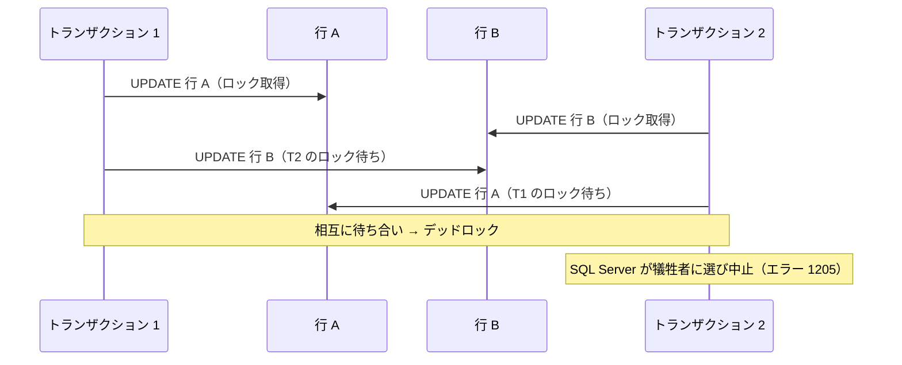
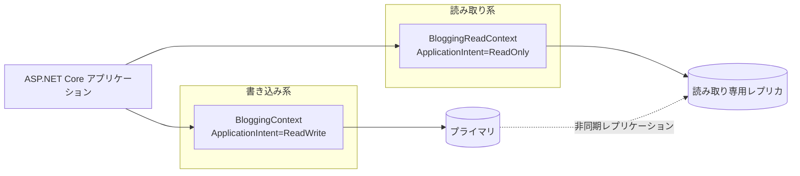

このページは [第8章：データベースアクセスと ORM (Entity Framework Core)](../08-entity-framework-core/index.md) の付録です。保存の応用、トランザクションと同時実行制御、イベントとインターセプター、読み取り専用レプリカを扱います。

本編を先に読んでから、必要な項目をここで参照してください。

**第8章のほかの付録**

- [付録 EF Core 1：モデル定義（エンティティとリレーションシップ）](../appendix-efcore-01/index.md)
- [付録 EF Core 2：モデル定義（キー・採番・SQL Server 固有）](../appendix-efcore-02/index.md)
- [付録 EF Core 3：マイグレーションの詳細とクエリ](../appendix-efcore-03/index.md)
- [付録 EF Core 5：パフォーマンス](../appendix-efcore-05/index.md)
- [付録 EF Core 6：テスト](../appendix-efcore-06/index.md)


---

## 目次

1. [保存の応用](#1-保存の応用)
   - [切断されたエンティティのグラフを保存する](#切断されたエンティティのグラフを保存する)
   - [保存のバッチ処理](#保存のバッチ処理)
   - [データベーストリガーがあるテーブルの保存](#データベーストリガーがあるテーブルの保存)
   - [保存をストアドプロシージャに割り当てる](#保存をストアドプロシージャに割り当てる)
   - [一括更新・一括削除](#一括更新一括削除)
   - [変更追跡の細かい挙動](#変更追跡の細かい挙動)
2. [トランザクションと同時実行制御](#2-トランザクションと同時実行制御)
   - [自動トランザクションの作成を制御する](#自動トランザクションの作成を制御する)
   - [セーブポイント](#セーブポイント)
   - [楽観的同時実行制御](#楽観的同時実行制御)
   - [分離レベルによる同時実行制御](#分離レベルによる同時実行制御)
   - [接続の回復性とトランザクションの併用](#接続の回復性とトランザクションの併用)
   - [デッドロックへの対処](#デッドロックへの対処)
3. [イベントとインターセプター](#3-イベントとインターセプター)
   - [変更追跡イベントで状態の変化を捕まえる](#変更追跡イベントで状態の変化を捕まえる)
   - [診断リスナーでプロセス全体のイベントを観測する](#診断リスナーでプロセス全体のイベントを観測する)
   - [インターセプターによる横断的な処理](#インターセプターによる横断的な処理)
4. [読み取り専用レプリカ (Read-Only Replica) の扱い](#4-読み取り専用レプリカ-read-only-replica-の扱い)
   - [読み取りスケールアウトの仕組み](#読み取りスケールアウトの仕組み)
   - [データ整合性と遅延の制約](#データ整合性と遅延の制約)
   - [EF Core 側での読み書き分離](#ef-core-側での読み書き分離)
   - [読み取り専用 DbContext の設計](#読み取り専用-dbcontext-の設計)
   - [どのクエリをレプリカに流すか](#どのクエリをレプリカに流すか)
5. [参考ドキュメント](#5-参考ドキュメント)

---

## 1. 保存の応用

### 切断されたエンティティのグラフを保存する

Web API では、親と子をまとめた JSON をクライアントから受け取り、そのグラフごと保存したい場面がよくあります。`Add` / `Attach` / `Update` はグラフを再帰的にたどり、エンティティごとに状態を決めます。

自動生成キー（`int` や `Guid` の主キー）を使っている場合、**キー値が設定されていないことが「まだ挿入されていない」ことの目印**になります。EF Core はこれを利用して、切断されたグラフの中で新規と既存を自動的に区別します。実際に、`Id` を持つ子 2 件と `Id` 未設定の子 1 件を含むグラフを `Update` に渡したところ、次のようになりました。

```csharp
var graph = new Blog
{
    Id = 1,
    Name = "更新後",
    Posts =
    {
        new Post { Id = 1, Title = "既存 1" },
        new Post { Id = 2, Title = "既存 2" },
        new Post { Title = "新規（Id 未設定）" },
    },
};
context.Update(graph);
```

```text
Blog {Id: 1} Modified
Post {Id: -2147482644} Added FK {BlogId: 1}
Post {Id: 1} Modified FK {BlogId: 1}
Post {Id: 2} Modified FK {BlogId: 1}
```

`Id` が未設定だった 1 件だけが `Added` になり、**一時キー値**（負の値）が割り当てられています。この値は `SaveChanges` までの間だけ使われ、保存後にデータベースが採番した実際の値へ置き換わります。`Attach` を使うと、既存のエンティティは `Modified` ではなく `Unchanged` になります（新規の判定は同じです）。

> [!WARNING]
> **グラフから子を取り除いても、その子は削除されません。** 子 3 件のうち 1 件だけを含むグラフを `Update` して保存しても、実測ではテーブルの件数は 3 件のままでした。届かなかったエンティティは、そもそも追跡対象にならないためです。
>
> 公式ドキュメントも「削除は扱いが難しい。エンティティが存在しないことが削除を意味することが多いためだ」と述べ、次の 2 つを挙げています。
>
> - **論理削除 (soft delete)** にして、削除を更新として扱う（[付録2の「グローバルクエリフィルターと名前付きクエリフィルター」](../appendix-efcore-02/index.md#グローバルクエリフィルターと名前付きクエリフィルター)と組み合わせる）
> - データベースを読み込んでグラフの差分を取り、消えている子に `Remove` を呼ぶ
>
> エンティティを削除するには `Deleted` 状態で追跡されている必要があります。「送られてこなかった」という情報だけで EF Core が削除を判断することはありません。

状態の決め方を自分で制御したい場合は `ChangeTracker.TrackGraph` を使います。グラフ内の各エンティティを追跡する直前にコールバックが呼ばれるため、DTO に持たせたフラグなどで判定できます。

```csharp
context.ChangeTracker.TrackGraph(graph, node =>
{
    var entry = node.Entry;
    var id = (int)entry.Property("Id").CurrentValue!;

    entry.State = id switch
    {
        0 => EntityState.Added,
        _ => EntityState.Modified,
    };
});
```

#### 同じキーのインスタンスが混ざったグラフ

クライアントから受け取った JSON をそのまま追跡させようとすると、**同じキーを持つ複数のインスタンス**が混ざっていることがあります。「投稿の一覧」を「それぞれの投稿が属するブログ」ごとシリアル化すると、同じブログが何度も現れるためです。

```csharp
// posts[0].Blog と posts[1].Blog が「同じ Id・別インスタンス」になっている
db.AttachRange(posts);
```

```text
InvalidOperationException: The instance of entity type 'Blog' cannot be tracked
because another instance with the same key value for {'Id'} is already being tracked.
When attaching existing entities, ensure that only one entity instance with a given
key value is attached.
```

実測でもこの例外が発生しました。公式ドキュメントは 2 つの対処を挙げています。**シリアル化の側で参照を保持する設定にする**か、**追跡しながら ID 解決 (identity resolution) を行う**かです。

後者は `TrackGraph` で書けます。すでに同じキーが追跡されていれば、そのノードを追跡しないという判断をコールバックの中で下します。

```csharp
db.ChangeTracker.TrackGraph(root, node =>
{
    var entry = node.Entry;
    var keyValue = entry.Property("Id").CurrentValue;

    var existing = db.ChangeTracker.Entries().FirstOrDefault(
        e => e.Metadata == entry.Metadata
             && Equals(e.Property("Id").CurrentValue, keyValue));

    if (existing == null)
    {
        entry.State = EntityState.Unchanged;
    }
});
```

重複を含むグラフを 2 つ渡して実行したところ、`Blog` は 1 つに集約され、合計 3 エンティティが正しく追跡されました（実測）。

```text
Blog {Id: 1} Unchanged
Post {Id: 1} Unchanged FK {BlogId: 1}
Post {Id: 2} Unchanged FK {BlogId: 1}
```

> [!WARNING]
> このやり方では、**先に見つかったインスタンスの値が採用され、後から来た重複インスタンスの値は捨てられます。** 重複の間で値が食い違っている可能性がある場合は、どちらを優先するかを明示的に決めてください。

#### チェンジトラッカーの中身を見る

思ったとおりの状態になっているかは、`ChangeTracker.DebugView` で確認できます。公式ドキュメントの説明どおり、**`ShortView` は追跡中のエンティティ・その状態・キー値だけ**を、**`LongView` はさらにすべてのプロパティ値とナビゲーションの状態まで**表示します。

`Blog` を 1 件読み込んで `Name` を書き換えた状態で、両方を出力して比べました（実測）。

```csharp
context.ChangeTracker.DetectChanges();
Console.WriteLine(context.ChangeTracker.DebugView.ShortView);
```

```text
Blog {Id: 1} Modified
Post {Id: 1} Unchanged FK {BlogId: 1}
```

```csharp
Console.WriteLine(context.ChangeTracker.DebugView.LongView);
```

```text
Blog {Id: 1} Modified
    Id: 1 PK
    Name: '書き換え後' Modified Originally '元の名前'
  Posts: [{Id: 1}]
Post {Id: 1} Unchanged
    Id: 1 PK
    BlogId: 1 FK
    Title: '投稿1'
  Blog: {Id: 1}
```

**「どのプロパティが変わったのか」を知りたいときは `LongView`** です。`ShortView` は件数が多いときに全体を俯瞰する用途に向いています。

> [!NOTE]
> 公式のサンプルと同じく、**表示する前に `DetectChanges()` を明示的に呼んでください。** `DebugView` を読むだけでは変更検出が走らないため、プロパティを書き換えた直後に表示すると、値は新しいのに状態が `Unchanged` のままという食い違いが起きます。前述した `SaveChanges` や `ChangeTracker.Entries()` を経由していれば、変更検出は自動的に済んでいます。

#### 保存前のキーには一時値が入る

`Add` した直後のエンティティは、まだデータベースに行がないため主キーの値が決まっていません。このとき EF Core は **一時値 (temporary value)** を割り当てます。`DebugView` を見ると、実際の値とはかけ離れた大きな負の数が表示されます（実測）。

```text
Blog {Id: -2147482647} Added
Post {Id: -2147482647} Added FK {BlogId: -2147482647}
```

一方、エンティティのプロパティ自体は `0` のままです。一時値は変更追跡の内部にだけ保持され、エンティティには書き戻されません。

```csharp
db.Add(blog);
Console.WriteLine(blog.Id);                                        // 0
Console.WriteLine(db.Entry(blog).Property(x => x.Id).IsTemporary); // True

await db.SaveChangesAsync();
Console.WriteLine(blog.Id);                                        // 1
Console.WriteLine(db.Entry(blog).Property(x => x.Id).IsTemporary); // False
```

子の外部キー (`Post.BlogId`) にも同じ一時値が伝播しています。**保存前の親子関係は、この一時値によって結ばれています。** `SaveChanges` が親を挿入して本物のキーを受け取ると、EF Core は子の外部キーを実際の値に置き換えてから子を挿入します。

> [!WARNING]
> `SaveChanges` の前に主キーの値を読んで、それをログや外部システムに渡してはいけません。エンティティのプロパティは `0` のままですし、`DebugView` に見える負の数も保存後には存在しない値です。**キーが必要なら `SaveChanges` の後に読んでください。**

### 保存のバッチ処理

EF Core は `SaveChanges` の呼び出しごとに、追跡している変更をまとめて 1 回の往復で送ります。ただし何件でも 1 回にまとめるわけではありません。公式ドキュメントは SQL Server について「4 文未満ではバッチ処理は概して効率が悪く、40 文前後を超えると利点が薄れるため、**既定では 1 回のバッチで最大 42 文まで**を実行し、残りは別の往復で実行する」と説明しています。

実際に SQL Server 2022 に対して N 件の `Add` を保存し、発行された `DbCommand` の回数を数えたところ、公式の説明どおり 42 と 43 の間で分割されました（実測）。

| 保存した件数 | 発行された `DbCommand` |
| --- | --- |
| 42 | 1 回 |
| 43 | 2 回 |
| 84 | 2 回 |
| 85 | 3 回 |

この上限は `MaxBatchSize` で変更できます。`MinBatchSize` でバッチ処理を始める下限も指定できます。

```csharp
builder.Services.AddDbContext<BloggingContext>(options =>
    options.UseSqlServer(connectionString, sqlOptions => sqlOptions
        .MinBatchSize(1)
        .MaxBatchSize(100)));
```

> [!NOTE]
> SQL Server プロバイダーの `MaxBatchSize` には実装上の上限があります。`SqlServerModificationCommandBatchFactory` は `MaxMaxBatchSize = 1000` と定義しており、指定値と 1000 の小さいほうを採用します。実測でも、1,200 件の保存で `MaxBatchSize(2000)` を指定したときの往復は 2 回で、`MaxBatchSize(1000)` と同じでした。**1000 を超える値を指定しても意味がありません。**

> [!WARNING]
> `MaxBatchSize` を小さくすると往復回数がそのまま増えます。ネットワーク遅延のある環境では影響が非常に大きく、Azure Container Instances 上の SQL Server 2022 に対して 1,000 件を挿入した実測では次のようになりました（3 回測定の中央値）。
>
> | `MaxBatchSize` | 所要時間 |
> | --- | --- |
> | 1 | 209,354 ms |
> | 既定（42） | 5,542 ms |
> | 1000 | 272 ms |
>
> この数値はネットワーク遅延が大きい構成での測定であり、往復回数の削減がそのまま効いています。**同一ネットワーク内のデータベースでは差はここまで大きくなりません。**公式が「40 文前後を超えると利点が薄れる」としているとおり、既定値を変えるかどうかは必ず自分の環境で計測してから判断してください。

> [!TIP]
> そもそも大量の行を同じ条件で更新・削除するなら、バッチサイズを調整するより `ExecuteUpdate` / `ExecuteDelete` を使うほうが効果的です。公式も、変更追跡を経由せず 1 回の往復で完結する点を利点として挙げています。詳しくは後述の [一括更新・一括削除](#一括更新一括削除) を参照してください。

### データベーストリガーがあるテーブルの保存

EF Core は `SaveChanges` のとき、SQL Server では T-SQL の **`OUTPUT` 句** を使って生成された値（`IDENTITY` の主キーなど）を効率よく取得します。ところが `OUTPUT` 句には制約があり、**トリガーが有効なテーブルには使えません**。

トリガーを付けたテーブルに対して何も構成せずに保存すると、実測では次の例外が発生しました。

```text
DbUpdateException: The target table 'Blogs' of the DML statement cannot have any
enabled triggers if the statement contains an OUTPUT clause without INTO clause.
```

対処方法は 2 つあります。テーブルにトリガーがあることを EF Core に伝えるか、`OUTPUT` 句の使用を直接無効にします。

```csharp
protected override void OnModelCreating(ModelBuilder modelBuilder)
{
    // 方法 1: トリガーの存在を宣言する
    modelBuilder.Entity<Blog>()
        .ToTable(tb => tb.HasTrigger("TR_Blogs_Insert"));

    // 方法 2: OUTPUT 句の使用を無効にする
    modelBuilder.Entity<Blog>()
        .ToTable(tb => tb.UseSqlOutputClause(false));
}
```

どちらを構成しても保存は成功しました（実測）。SQL Server で生成される SQL は次のように変わります。

```sql
-- 既定: MERGE と OUTPUT 句で複数行をまとめて挿入し、生成された Id を一度に受け取る
MERGE ... INSERT ([Name]) VALUES (i.[Name])
OUTPUT INSERTED.[Id], i._Position;

-- 構成後: 1 行ずつ INSERT し、その都度 SELECT で Id を取得する
INSERT INTO [Blogs] ([Name]) VALUES (@p0);
SELECT [Id] ...
INSERT INTO [Blogs] ([Name]) VALUES (@p1);
SELECT [Id] ...
```

> [!WARNING]
> これは EF Core 7 で入った破壊的変更です。公式の破壊的変更一覧でも影響度 **High** に分類されており、「既定でより効率的な手法で保存するようになったが、その手法は対象テーブルにトリガーがある場合 SQL Server ではサポートされない」と説明されています。EF Core 6 以前から移行してきて保存だけが失敗する場合は、まずトリガーの有無を疑ってください。

> [!NOTE]
> 上の SQL のとおり、構成すると **1 行ずつの往復に戻る**ため、まとめて挿入する場合の性能は落ちます。公式もこの手法を「以前の、効率の劣る手法」と表現しています。トリガーがあるテーブルは必要な範囲に限定するのが望ましいです。
>
> 多くのテーブルにトリガーがある場合は、`IModelFinalizingConvention` を実装したモデル構築規約で全テーブルにまとめて適用する方法が公式に案内されています。

> [!TIP]
> SQLite にも同種の制限があります。EF Core は `RETURNING` 句を使うため、**AFTER トリガーを持つテーブルや仮想テーブル**では同じ構成が必要です。こちらも EF Core 7 の破壊的変更として影響度 High で挙げられています。

### 保存をストアドプロシージャに割り当てる

既存のデータベースで「テーブルへの直接の書き込みは禁止、更新はすべてストアドプロシージャ経由」という運用が決まっていることがあります。EF Core 7 以降は、`INSERT` / `UPDATE` / `DELETE` の各コマンドをストアドプロシージャに割り当てられます。

> [!IMPORTANT]
> 公式ドキュメントは「ストアドプロシージャのマッピングをサポートしていることは、ストアドプロシージャを推奨していることを意味しない」と明記しています。既存の運用ルールに合わせる必要がある場合の手段だと考えてください。

割り当ては `OnModelCreating` で行います。次は SQL Server の例です。

```csharp
protected override void OnModelCreating(ModelBuilder modelBuilder)
{
    modelBuilder.Entity<Person>()
        .InsertUsingStoredProcedure(
            "People_Insert",
            sp =>
            {
                sp.HasParameter(p => p.Name);
                sp.HasResultColumn(p => p.Id);     // IDENTITY で採番された値を受け取る
            })
        .UpdateUsingStoredProcedure(
            "People_Update",
            sp =>
            {
                sp.HasOriginalValueParameter(p => p.Id);
                sp.HasParameter(p => p.Name);
                sp.HasRowsAffectedResultColumn(); // 影響行数を返してもらう
            })
        .DeleteUsingStoredProcedure(
            "People_Delete",
            sp =>
            {
                sp.HasOriginalValueParameter(p => p.Id);
                sp.HasRowsAffectedResultColumn();
            });
}
```

この構成で `SaveChangesAsync` を呼ぶと、EF Core が発行する SQL（SQL Server）は次のようになります。通常の `INSERT` 文ではなく `EXEC` になっていることが実測でも確認できました。

```sql
SET NOCOUNT ON;
EXEC [People_Insert] @p0;
```

```sql
SET NOCOUNT ON;
EXEC [People_Update] @p0, @p1;
```

ストアドプロシージャ側は次のように用意します（SQL Server の例）。

```sql
CREATE PROCEDURE [dbo].[People_Insert]
    @Name [nvarchar](max)
AS
BEGIN
      INSERT INTO [People] ([Name])
      OUTPUT INSERTED.[Id]
      VALUES (@Name);
END
```

構成を組み立てるうえで、公式ドキュメントが挙げている注意点は次のとおりです。

| 項目 | 内容 |
| --- | --- |
| 名前の省略 | 第 1 引数の名前は省略できます。省略するとテーブル名に `_Insert` / `_Update` / `_Delete` を付けた名前が使われます（実測でも `Docs_Update` が呼ばれました） |
| パラメーターの順序 | **ストアドプロシージャの定義と同じ順序**で追加します。EF Core は名前付き引数ではなく常に位置引数で呼び出すためです |
| キーの指定 | 更新・削除ではキーに `HasOriginalValueParameter` を使います。将来のバージョンで可変のキー値がサポートされたときに正しい行が更新されるようにするためです |
| 値の返し方 | 出力パラメーター、`HasResultColumn`（結果列）、`HasRowsAffectedReturnValue`（戻り値、影響行数のみ）の 3 とおりがあります |
| 継承 | TPH は 1 組、TPT は抽象型を含むすべての型、TPC は具象型ごとにストアドプロシージャが必要です |

> [!TIP]
> **すべての型・すべての操作に用意する必要はありません。** たとえば `DeleteUsingStoredProcedure` だけを構成すれば、挿入と更新は通常どおり EF Core が SQL を生成し、削除だけがストアドプロシージャになります。実際に `UpdateUsingStoredProcedure` だけを構成したところ、挿入は通常の `INSERT ... OUTPUT INSERTED.[Id]` のままで、更新だけが `EXEC [Docs_Update]` になりました。

`HasRowsAffectedResultColumn` などで影響行数を返すようにしておくと、[楽観的同時実行制御](#楽観的同時実行制御)はストアドプロシージャでもそのまま機能します。ストアドプロシージャ側で `WHERE` に同時実行トークンを含め、`SELECT @@ROWCOUNT` で影響行数を返す構成にしておき、他のトランザクションが先に行を削除した状態で更新を試みたところ、期待どおり `DbUpdateConcurrencyException` が発生しました（実測）。

```text
The database operation was expected to affect 1 row(s), but actually affected 0 row(s);
data may have been modified or deleted since entities were loaded.
```

> [!WARNING]
> **ストアドプロシージャ本体はマイグレーションでは作られません。** マッピングを構成しても、EF Core が生成するのはテーブルの DDL だけです（`GenerateCreateScript()` の出力に `CREATE PROCEDURE` は含まれませんでした）。ストアドプロシージャ・ビュー・トリガー・関数のように EF Core が関知しないオブジェクトは、モデルを変更せずに空のマイグレーションを追加し、`migrationBuilder.Sql(...)` に自分で DDL を書いて管理します。
>
> ```csharp
> migrationBuilder.Sql(
> @"
>     EXEC ('CREATE PROCEDURE getFullName
>         @LastName nvarchar(50),
>         @FirstName nvarchar(50)
>     AS
>         SELECT @LastName + @FirstName;')");
> ```
>
> 公式ドキュメントは、`CREATE PROCEDURE` のように「バッチの先頭でなければならない文」を実行するために `EXEC ('...')` で包む書き方を案内しています。またマイグレーションの一部の操作はトランザクション内で実行できないことがあり、その場合は `migrationBuilder.Sql(..., suppressTransaction: true)` でトランザクションから外します。

> [!NOTE]
> ストアドプロシージャに割り当てられるのは**保存（挿入・更新・削除）だけ**です。クエリは従来どおり通常の `SELECT` が発行されます。ストアドプロシージャからデータを読み取りたい場合は、[付録 EF Core 3 の「生の SQL を使う」](../appendix-efcore-03/index.md#生の-sql-を使う)で扱う `FromSql` を使います。

### 一括更新・一括削除

多数の行を更新・削除する場合、すべてのエンティティを読み込んで変更追跡させるのは非効率です。`ExecuteUpdateAsync` / `ExecuteDeleteAsync` は、エンティティを読み込まずに単一の SQL 文を発行します。

```csharp
// 1 年以上前の下書きを一括削除
var deleted = await context.Posts
    .Where(p => p.Status == PostStatus.Draft && p.CreatedAt < threshold)
    .ExecuteDeleteAsync(cancellationToken);

// 特定ブログの投稿をまとめてアーカイブ
var updated = await context.Posts
    .Where(p => p.BlogId == blogId)
    .ExecuteUpdateAsync(
        setters => setters
            .SetProperty(p => p.Status, PostStatus.Archived)
            .SetProperty(p => p.ArchivedAt, DateTimeOffset.UtcNow),
        cancellationToken);
```

EF Core 10 では `ExecuteUpdateAsync` が通常のラムダ（式ツリーでないもの）を受け付けるようになり、条件分岐を含む構築が書けるようになりました。

```csharp
await context.Posts
    .Where(p => p.BlogId == blogId)
    .ExecuteUpdateAsync(setters =>
    {
        setters.SetProperty(p => p.Status, PostStatus.Archived);

        if (includeTimestamp)
        {
            setters.SetProperty(p => p.ArchivedAt, DateTimeOffset.UtcNow);
        }
    },
    cancellationToken);
```

EF Core 10 では、**JSON 列にマッピングされた複合型のプロパティも `ExecuteUpdateAsync` で更新できる** ようになりました。EF Core 9 以前は JSON 列を一括更新できず、エンティティを読み込んで `SaveChangesAsync` するしかありませんでした。複合型と所有型の違いは[付録1の「値の変換・所有型・複合型」](../appendix-efcore-01/index.md#値の変換所有型複合型)で扱います。

```csharp
modelBuilder.Entity<Blog>().ComplexProperty(b => b.Details, bd => bd.ToJson());
```

```csharp
await context.Blogs.ExecuteUpdateAsync(s =>
    s.SetProperty(b => b.Details.Views, b => b.Details.Views + 1));
```

SQL Server 2022（JSON が `nvarchar(max)` に格納される環境）で実行したところ、`JSON_MODIFY` を使う次の SQL が発行され、`{"Title":"T","Views":10}` が `{"Title":"T","Views":11}` に更新されました。

```sql
UPDATE [b]
SET [b].[Details] = JSON_MODIFY([b].[Details], '$.Views',
        CAST(JSON_VALUE([b].[Details], '$.Views') AS int) + 1)
FROM [Blogs] AS [b]
```

> [!NOTE]
> この機能は **複合型 (`ComplexProperty`) としてマッピングした場合にのみ動作します。** 公式ドキュメントは「所有型 (owned entity type) としてマッピングした場合は動作しない」と明記しています。既存のコードで `OwnsOne(...).ToJson()` を使っている場合は、複合型への移行が必要です。
>
> なお、生成される SQL はデータベースのバージョンによって変わります。ネイティブの `json` 型が使える SQL Server 2025 では、上の `JSON_MODIFY` ではなく、より効率的な `modify` 関数が使われます。

> [!IMPORTANT]
> `ExecuteUpdateAsync` / `ExecuteDeleteAsync` はチェンジトラッカーを経由しません。そのため、`DbContext` がすでに追跡しているエンティティの状態は更新されず、`SaveChangesAsync` によるカスケード削除や監査ログ（`SaveChangesAsync` のオーバーライド）も動作しません。実行後は `ChangeTracker.Clear()` を呼ぶか、新しい `DbContext` を使って読み直してください。
>
> **さらに重要な点として、これらは後述する同時実行トークン (`rowversion`) も検証しません。** SQL Server 2022 で実際に確認したところ、他のユーザーが先に更新して `Version` が変化したあとでも `ExecuteUpdateAsync` は影響行数 1 を返し、例外を出さずに相手の変更を上書きしました。生成される UPDATE 文の WHERE 句には、ラムダで指定した条件しか含まれないためです。ロストアップデートを防ぎたい行の更新には、一括更新ではなくエンティティを読み込む通常の `SaveChangesAsync` を使ってください。

### 変更追跡の細かい挙動

#### 追跡済みインスタンスがクエリ結果を上書きする

追跡クエリでは、EF Core は同じキー値のエンティティを 1 つのインスタンスとしてしか追跡しません。これを **ID 解決 (identity resolution)** と呼びます。すでに追跡中のインスタンスがある場合、新しいインスタンスを作る代わりに既存のものが返されます。

ここに重要な副作用があります。**同じ `DbContext` で同じ行を読み直しても、データベース側の変更は結果に反映されません。**

```csharp
var first = await context.Blogs.FirstAsync();   // "元の名前"

// この間に別のセッションが Blogs を更新したとする

var second = await context.Blogs.FirstAsync();  // "元の名前" のまま
ReferenceEquals(first, second);                 // true
```

実測でも、別の接続から `UPDATE` を実行したあとに同じ `DbContext` で読み直すと古い値が返り、新しい `DbContext` では更新後の値が返りました。`ChangeTracker.Clear()` を呼んだ場合も更新後の値になります。

公式ドキュメントはこれを「`DbContext` を作業単位ごとに新しく作るべき十分な理由」として挙げています。1 つのインスタンスを長く使い回すと、意図せず古いデータを読み続けることになります。

> [!WARNING]
> 同じキー値を持つ別々のインスタンスを追跡させようとすると例外になります。クライアントから受け取った JSON を展開したときに同じエンティティが複数箇所に現れる場合などに起きます。
>
> ```text
> InvalidOperationException: The instance of entity type 'Blog' cannot be tracked because
> another instance with the same key value for {'Id'} is already being tracked. When
> attaching existing entities, ensure that only one entity instance with a given key value
> is attached.
> ```
>
> グラフを追跡させる前に、重複するインスタンスを 1 つにまとめておいてください。

#### リレーションシップ修正

EF Core は、外部キーの値とナビゲーションプロパティを常に一致させます。これを **リレーションシップ修正 (relationship fixup)** と呼び、追跡中のエンティティに対して自動的に働きます。

そのため、`Include` を書いていなくてもナビゲーションが埋まることがあります。

```csharp
var blog = await context.Blogs.FirstAsync();
blog.Posts.Count;                    // 0

await context.Posts.ToListAsync();   // 別のクエリで Post を読む
blog.Posts.Count;                    // 2 に増えている
```

修正は双方向に働きます。実測では、`post.BlogId` を別の値に書き換えると `post.Blog` と両方のブログの `Posts` コレクションが追従し、逆に `post.Blog` に別のブログを代入すると `post.BlogId` が追従しました。

> [!TIP]
> この挙動は、テストで「`Include` を書き忘れているのに動いてしまう」原因になります。同じ `DbContext` でたまたま関連エンティティを読んでいるだけで、本番の経路では `null` になることがあります。関連データが必要な箇所では `Include` を明示してください。非追跡クエリではリレーションシップ修正が働かないため、`AsNoTracking()` を付けて確認するのも有効です。

## 2. トランザクションと同時実行制御

### 自動トランザクションの作成を制御する

`SaveChangesAsync` は、自分でトランザクションを開始していない場合、**必要なときだけ**トランザクションを作ります。この判断は `Database.AutoTransactionBehavior` で変更できます。

```csharp
context.Database.AutoTransactionBehavior = AutoTransactionBehavior.Always;
```

| 値 | 公式ドキュメントの説明 |
| --- | --- |
| `WhenNeeded`（既定） | 必要なときだけ作る。単一の SQL 文はデータベース側で暗黙にトランザクションとして実行されるため、EF Core は明示的なトランザクションを作らない |
| `Always` | ユーザーのトランザクションがなければ常に作る。**往復が増えて性能が落ちる可能性がある** |
| `Never` | 自動では決して作らない |

SQL Server 2022 に対して、保存する行数とバッチサイズを変えながらトランザクションの開始回数を実測しました。

| 設定 | 送るコマンド数 | トランザクション開始 |
| --- | --- | --- |
| `WhenNeeded`（既定） | 1 | 0 回 |
| `WhenNeeded`（既定） | 3 | 1 回 |
| `Always` | 1 | **1 回** |
| `Always` | 3 | 1 回 |
| `Never` | 1 | 0 回 |
| `Never` | 3 | **0 回** |

既定の `WhenNeeded` は、複数のコマンドに分かれるときだけトランザクションを張ります。なお EF Core は複数行の変更を 1 つのバッチにまとめるため、行数が増えてもコマンドが 1 つに収まるうちはトランザクションを作りません（上の表の「コマンド数」は `MaxBatchSize` を調整して分けたものです）。

> [!WARNING]
> **`Never` は慎重に使ってください。** 公式ドキュメントは「`SaveChanges` が複数のコマンドを実行する必要があり、その途中で失敗した場合、先行するコマンドはすでにコミットされている可能性があり、データベースに部分的な変更が残る」と警告しています。上の実測でも、`Never` ではコマンドが 3 つに分かれてもトランザクションが張られませんでした。
>
> `Always` が役に立つのは、`IDbTransactionInterceptor` のトランザクション生成コールバックが `SaveChanges` のたびに呼ばれることをアプリケーションが前提にしている場合だと、公式ドキュメントは説明しています。

### セーブポイント

`SaveChangesAsync` は、すでにトランザクションが開始されている場合、自動的に **セーブポイント** を作成します。保存中にエラーが起きると、そのセーブポイントまでロールバックされ、トランザクション全体は維持されます。

セーブポイントは手動でも作成できます。

```csharp
await using var transaction = await context.Database.BeginTransactionAsync(cancellationToken);

context.Blogs.Add(new Blog { Name = "A", Url = "https://a.example.com" });
await context.SaveChangesAsync(cancellationToken);

await transaction.CreateSavepointAsync("BeforeOptionalWork", cancellationToken);

try
{
    await ImportOptionalDataAsync(context, cancellationToken);
    await context.SaveChangesAsync(cancellationToken);
}
catch
{
    // 任意処理だけを取り消し、それまでの変更は残す
    await transaction.RollbackToSavepointAsync("BeforeOptionalWork", cancellationToken);
}

await transaction.CommitAsync(cancellationToken);
```

> [!WARNING]
> SQL Server で **MARS (Multiple Active Result Sets)** が有効な接続、つまり接続文字列に `MultipleActiveResultSets=true` を指定している場合、**EF Core の自動セーブポイントが無効になります**。
>
> EF Core は、アプリケーションが自分で開始したトランザクションの中で `SaveChanges` を呼ぶと、その直前に自動的にセーブポイントを作成します（前述のとおりです）。MARS が有効だとこの自動作成が行われず、次の警告がログに出ます（実測で取得）。
>
> ```text
> Savepoints are disabled because Multiple Active Result Sets (MARS) is enabled.
> If 'SaveChanges' fails, then the transaction cannot be automatically rolled back
> to a known clean state. Instead, the transaction should be rolled back by the
> application before retrying 'SaveChanges'.
> ```
>
> つまり MARS 有効時は、`SaveChanges` が失敗したらアプリケーション側でトランザクション全体をロールバックしてから再試行する必要があります。この状況をバグとして早期に検出したい場合は、警告を例外に昇格させられます。
>
> ```csharp
> options.UseSqlServer(connectionString)
>     .ConfigureWarnings(w => w.Throw(SqlServerEventId.SavepointsDisabledBecauseOfMARS));
> ```
>
> なお、無効になるのは EF Core による**自動**セーブポイントだけです。`CreateSavepointAsync` / `RollbackToSavepointAsync` を明示的に呼ぶ分には MARS が有効でも動作します。ただし `IDbContextTransaction.SupportsSavepoints` は `false` を返すため、このプロパティで分岐しているコードがあると挙動が変わります（MARS の有無で実測して確認）。

### 楽観的同時実行制御

複数のユーザーが同じ行を同時に更新する状況では、後から保存した内容が先の変更を上書きしてしまう「ロストアップデート」が起こります。EF Core では **同時実行トークン** を使った楽観的同時実行制御で検出します。

SQL Server では `rowversion` 列を使うのが一般的です。

```csharp
using System.ComponentModel.DataAnnotations;

public class Blog
{
    public int Id { get; set; }
    public required string Name { get; set; }
    public required string Url { get; set; }

    [Timestamp]
    public byte[]? Version { get; set; }
}
```

Fluent API では次のように書きます。

```csharp
builder.Property(b => b.Version).IsRowVersion();
```

これにより、UPDATE 文の WHERE 句に読み込み時の `Version` が含まれ、更新対象の行が 0 行だった場合に `DbUpdateConcurrencyException` が発生します。実際に SQL Server 2022 に対して発行された SQL は次のとおりです。

```sql
UPDATE [Blogs] SET [Name] = @p0
OUTPUT INSERTED.[Version]
WHERE [Id] = @p1 AND [Version] = @p2;
```

`OUTPUT INSERTED.[Version]` によって、更新後に採番された新しい `Version` がその場でアプリケーション側に返され、追跡中のエンティティに反映されます。そのため、連続して更新しても再読み込みは不要です。

> [!NOTE]
> `[Timestamp]` を付けたプロパティに対して EF Core が生成する列の型は `rowversion` ですが、`INFORMATION_SCHEMA.COLUMNS` で確認すると `timestamp` と表示されます。これは `rowversion` の旧称が `timestamp` であるためで、両者は同じ型です。日付や時刻とはまったく関係がないため、名前に惑わされないでください。

例外の処理例です。ここでは「クライアント側の変更を採用して保存し直す」戦略 (Client Wins) を示します。

```csharp
public async Task<bool> UpdateBlogAsync(int id, string newName, CancellationToken cancellationToken)
{
    var blog = await context.Blogs.FirstAsync(b => b.Id == id, cancellationToken);
    blog.Name = newName;

    try
    {
        await context.SaveChangesAsync(cancellationToken);
        return true;
    }
    catch (DbUpdateConcurrencyException ex)
    {
        foreach (var entry in ex.Entries)
        {
            var databaseValues = await entry.GetDatabaseValuesAsync(cancellationToken);

            if (databaseValues is null)
            {
                // 他のユーザーによって削除されていた
                return false;
            }

            // 「元の値」だけをデータベースの現在値に差し替える。
            // 変更後の値 (CurrentValues) はクライアントのものが残るため、
            // 次の SaveChanges でクライアントの変更が採用される (Client Wins)
            entry.OriginalValues.SetValues(databaseValues);
        }

        await context.SaveChangesAsync(cancellationToken);
        return true;
    }
}
```

競合解決の方針は 3 つに整理できます。

| 戦略 | 内容 |
| --- | --- |
| Client Wins | クライアント側の値で上書きする。`entry.OriginalValues.SetValues(databaseValues)` の後にそのまま保存 |
| Store Wins | データベース側の値を採用し、クライアントの変更を破棄する。`entry.Reload()` |
| ユーザーに提示 | 現在値と変更値を画面に表示し、ユーザーに選択させる |

> [!WARNING]
> `OriginalValues.SetValues(databaseValues)` と `Reload()` は名前が似ていますが結果は正反対です。前者は「元の値」だけを差し替えるため、変更後の値 (`CurrentValues`) はクライアントのものが残り、保存するとデータベース側の変更が **上書きされて失われます**。後者は現在値ごと読み直すため、クライアントの変更が破棄されます。取り違えるとデータを失うため、どちらの動作を意図しているかを必ず確認してください。
>
> なお、この 2 つの挙動は SQLite に `IsConcurrencyToken` を設定したエンティティで実際に競合させ、最終的にデータベースへ残る値が入れ替わることを確認しています。

Store Wins にしたい場合は、`OriginalValues.SetValues` の代わりに `ReloadAsync` を呼びます。エンティティの現在値がデータベースの値で置き換わるため、クライアントの変更は失われます。

```csharp
foreach (var entry in ex.Entries)
{
    // 現在値ごとデータベースから読み直す (Store Wins)
    await entry.ReloadAsync(cancellationToken);
}
```

`rowversion` が使えないプロバイダーでは、任意のプロパティを同時実行トークンにできます。次の例は、エンティティに `LastUpdatedAt` プロパティを追加したうえで、それをトークンとして使う想定です。

```csharp
builder.Property(b => b.LastUpdatedAt).IsConcurrencyToken();
```

> [!WARNING]
> `rowversion` と違い、この方式では **値の更新はアプリケーション側の責任** です。設定を忘れるとトークンが変化せず、競合が検出されないまま上書きが起こります。実際に SQLite で、トークンを更新しない場合は競合が検出されずに上書きされ、下記のように `SaveChangesAsync` をオーバーライドして毎回更新した場合にのみ `DbUpdateConcurrencyException` が発生することを確認しています。
>
> ```csharp
> public override Task<int> SaveChangesAsync(CancellationToken cancellationToken = default)
> {
>     foreach (var entry in ChangeTracker.Entries<Blog>()
>                  .Where(e => e.State == EntityState.Modified))
>     {
>         entry.Entity.LastUpdatedAt = DateTime.UtcNow;
>     }
>
>     return base.SaveChangesAsync(cancellationToken);
> }
> ```

> [!NOTE]
> **Hibernate / JPA** の `@Version` と `jakarta.persistence.OptimisticLockException`（Hibernate 固有の例外ではなく Jakarta Persistence 仕様の標準例外です）、**Django** の `select_for_update()`（こちらは悲観的ロック）が対応する仕組みです。EF Core が既定で提供するのは楽観的同時実行制御であり、公式ドキュメントも「悲観的な手法がデータを先にロックしてから変更するのに対し、楽観的同時実行制御はロックを取らない」と説明しています。

### 分離レベルによる同時実行制御

同時実行制御の手段は同時実行トークンだけではありません。公式ドキュメントは、**トランザクションの分離レベル**を上げる方法も紹介しています。同時実行トークンが不要になり、トランザクション内で常に同じデータが見えるという利点があります。

分離レベルは `BeginTransactionAsync` に渡します。

```csharp
using var transaction = await context.Database
    .BeginTransactionAsync(IsolationLevel.RepeatableRead, cancellationToken);

var account = await context.Accounts.FirstAsync(a => a.Id == id, cancellationToken);
account.Balance += amount;

await context.SaveChangesAsync(cancellationToken);
await transaction.CommitAsync(cancellationToken);
```

公式ドキュメントによると、データベースの実装によって次の 2 通りに分かれます。

| 動作 | 該当する分離レベル | 分類 |
| --- | --- | --- |
| 読み取った行に共有ロックを取り、外部の更新をブロックする | SQL Server の `RepeatableRead`（`Serializable` も同様） | 悲観的ロック |
| ロックは取らず、自分が更新する時点でシリアル化エラーにする | SQL Server の `Snapshot`、PostgreSQL の repeatable read | 楽観的ロック |

SQL Server 2022 に対して実測したところ、公式の説明どおりの結果になりました。

- **`RepeatableRead`** — トランザクション内で 1 行を読んだだけの状態で、別の接続から同じ行を `UPDATE` すると**ブロックされ**、コマンドタイムアウト（`Number=-2`）に至りました。
- **`Snapshot`** — 同じ状況で別の接続からの `UPDATE` は**即座に成功**（0.2 秒）しました。その後で自分が更新して保存すると、次の例外になりました。

```text
SqlException Number=3960: Snapshot isolation transaction aborted due to update conflict.
You cannot use snapshot isolation to access table 'dbo.Accounts' directly or indirectly
in database 'v26' to update, delete, or insert the row that has been modified or deleted
by another transaction. Retry the transaction or change the isolation level for the
update/delete statement.
```

> [!WARNING]
> 公式はこの方式の欠点を 2 つ挙げています。1 つは、ロックで実装される分離レベルでは、同じ行を変更しようとする他のトランザクションが**トランザクションの間ずっとブロックされる**こと（トランザクションは短く保つ必要があります）。もう 1 つは、**すべての操作を 1 つのトランザクションに含める必要がある**ことです。画面に表示してユーザーの入力を待つような場合、トランザクションが長時間生き続けてしまうため避けるべきで、この方式は「含まれる操作がすべて即座に実行され、トランザクションの長さが外部入力に左右されない場合」に適するとされています。

> [!NOTE]
> `Snapshot` を使うには、あらかじめデータベース側で有効にしておく必要があります（実測でも `ALTER DATABASE [DbName] SET ALLOW_SNAPSHOT_ISOLATION ON` が必要でした）。

### 接続の回復性とトランザクションの併用

クラウド上のデータベースでは、一時的な接続エラー（トランジェントエラー）が避けられません。SQL Server プロバイダーの `EnableRetryOnFailure` を有効にすると、EF Core が自動的に再試行します。

```csharp
builder.Services.AddDbContext<BloggingContext>(options =>
    options.UseSqlServer(connectionString, sqlOptions =>
        sqlOptions.EnableRetryOnFailure(
            maxRetryCount: 5,
            maxRetryDelay: TimeSpan.FromSeconds(30),
            errorNumbersToAdd: null)));

```

> [!WARNING]
> 再試行はあらゆる接続エラーで働くわけではありません。EF Core の SQL Server プロバイダーは、SQL Server が返す**特定のエラー番号**（一時的エラーとして既知のもの）だけを再試行の対象にします。実際にコンテナーを再起動して接続を切断したところ、`EnableRetryOnFailure` を有効にしていても「ログイン前のハンドシェイク中にエラーが発生しました」という `SqlException` が再試行されずに即座に投げられました。このときメトリクス `microsoft.entityframeworkcore.execution_strategy_operation_failures` も 0 のままで、再試行戦略がそもそも起動していないことが確認できます。
>
> 自社環境で固有のエラー番号を再試行対象に加えたい場合は、`errorNumbersToAdd` にエラー番号を渡してください。「再試行を有効にしたから接続断はすべて吸収される」と考えるのは危険で、アプリケーション側での例外処理は依然として必要です。

> [!TIP]
> 接続先が **Azure SQL Database** の場合は、`UseSqlServer` ではなく **`UseAzureSql`** を使います（Azure Synapse には `UseAzureSynapse` があります）。EF Core はこれによって、対象データベース固有の機能を活かした SQL を生成できます。加えて `UseAzureSql` は **再試行を既定で有効にします**。実際に生成される実行戦略の型を確認したところ、次のようになりました（実測で確認）。
>
> | 構成 | `Database.CreateExecutionStrategy()` の型 |
> | --- | --- |
> | `UseSqlServer(...)` | `SqlServerExecutionStrategy`（再試行しない） |
> | `UseSqlServer(..., s => s.EnableRetryOnFailure())` | `SqlServerRetryingExecutionStrategy` |
> | `UseAzureSql(...)` | `SqlServerRetryingExecutionStrategy` |
> | `ConfigureSqlEngine(c => c.EnableRetryOnFailureByDefault())` ＋ `UseSqlServer(...)` | `SqlServerRetryingExecutionStrategy` |
>
> EF Core のソースでも、実行戦略が指定されていない場合にエンジンの種類が Azure SQL / Azure Synapse であれば `SqlServerRetryingExecutionStrategy` を既定にする実装になっています。実測でも、`UseSqlServer` では `SqlServerExecutionStrategy`（`RetriesOnFailure = false`）が、`UseAzureSql` では `SqlServerRetryingExecutionStrategy`（`RetriesOnFailure = true`）が選ばれることを確認しました。
>
> 表の最後の行は、**`UseSqlServer` の呼び出しが自分で変更できないコードの中にある場合**の逃げ道です。公式ドキュメントは「制御できないコードで `UseSqlServer` が呼ばれることがある。EF Core 9 以降、そうした状況で接続の回復性を有効にするには、事前に `ConfigureSqlEngine(c => c.EnableRetryOnFailureByDefault())` を呼ぶ」と説明しています。実測でも、この順番で構成すると `UseSqlServer` のまま `SqlServerRetryingExecutionStrategy` が選ばれました。
>
> ```csharp
> builder.Services.AddDbContext<BloggingContext>(options => options
>     .ConfigureSqlEngine(c => c.EnableRetryOnFailureByDefault())
>     .UseSqlServer(connectionString));
> ```

> [!WARNING]
> 再試行を有効にした状態で `BeginTransactionAsync` による明示的トランザクションを使うと、`InvalidOperationException` が発生します。再試行戦略は個々の操作を再実行するため、トランザクション全体をやり直す必要があることを EF Core が判断できないためです。
>
> 注意したいのは **例外が出るタイミング** です。`BeginTransactionAsync` の時点では何も起きず、その後の `SaveChangesAsync` で初めて次の例外になります（実測で確認）。
>
> ```text
> System.InvalidOperationException: The configured execution strategy 'SqlServerRetryingExecutionStrategy'
> does not support user-initiated transactions. Use the execution strategy returned by
> 'DbContext.Database.CreateExecutionStrategy()' to execute all the operations in the transaction
> as a retriable unit.
> ```

この場合は、実行戦略を取得してトランザクション全体をその中で実行します。

```csharp
var strategy = context.Database.CreateExecutionStrategy();

await strategy.ExecuteAsync(async () =>
{
    await using var transaction = await context.Database.BeginTransactionAsync(cancellationToken);

    context.Blogs.Add(new Blog { Name = "A", Url = "https://a.example.com" });
    await context.SaveChangesAsync(cancellationToken);

    await context.Database.ExecuteSqlAsync(
        $"UPDATE [Statistics] SET [BlogCount] = [BlogCount] + 1",
        cancellationToken);

    await transaction.CommitAsync(cancellationToken);
});
```

> [!WARNING]
> 再試行によってブロック全体が再実行されるため、その中の処理は **冪等 (idempotent)** である必要があります。ブロック内で外部 API の呼び出しやメール送信などの副作用を伴う処理を行わないでください。

### デッドロックへの対処

複数のトランザクションが互いの保持するロックを待ち合う状態を **デッドロック (deadlock)** と呼びます。SQL Server はデッドロックを検出すると、片方を強制的に中止して **デッドロックの犠牲者 (deadlock victim)** に選び、もう片方を進めます。



犠牲者になった側では、エラー番号 **1205** が返ります。SQL Server 2022 上で、行 A → 行 B の順に更新するトランザクションと、行 B → 行 A の順に更新するトランザクションを同時に実行したところ、次のメッセージが得られました。

```text
SqlException Number=1205
Transaction (Process ID 65) was deadlocked on lock resources with another process
and has been chosen as the deadlock victim. Rerun the transaction.
```

メッセージの末尾が示すとおり、デッドロックは **再実行すれば成功する** 種類のエラーです。そして SQL Server プロバイダーはエラー番号 1205 を一時的エラーとして扱うため（EF Core の `SqlServerTransientExceptionDetector` に `case 1205` が含まれています）、`EnableRetryOnFailure` と `CreateExecutionStrategy()` を組み合わせれば自動的に再試行されます。同じ 2 つのトランザクションを実行戦略で包んで実行したところ、犠牲者になった側も再試行されて **両方ともコミットに成功しました**。

```csharp
var strategy = context.Database.CreateExecutionStrategy();

await strategy.ExecuteAsync(async () =>
{
    await using var transaction = await context.Database.BeginTransactionAsync();

    // デッドロックの犠牲者になっても、このブロック全体が再実行される
    await context.Database.ExecuteSqlAsync($"UPDATE Blogs SET Rating = Rating + 1 WHERE Id = {firstId}");
    await context.Database.ExecuteSqlAsync($"UPDATE Blogs SET Rating = Rating + 1 WHERE Id = {secondId}");

    await transaction.CommitAsync();
});
```

ただし再試行は最後の手段です。設計でデッドロックそのものを減らすほうが確実です。

| 対策 | 内容 |
| --- | --- |
| 更新順序を揃える | すべてのトランザクションで、同じ種類のリソースを同じ順序（例: 常に主キーの昇順）で更新する |
| トランザクションを短くする | ロックを保持する時間を最小化する。トランザクション内で外部 API 呼び出しやユーザー入力待ちをしない |
| 読み取りのロックを避ける | 参照だけの処理は `AsNoTracking` を使い、必要なら Read Committed Snapshot 分離を有効にする |
| 必要な行だけロックする | 広い範囲を `UPDATE` せず、主キーで対象を絞る |

> [!WARNING]
> デッドロックの例外は、**どこで起きたかによって型が変わります。** 実測では次のように分かれました。
>
> | 発生箇所 | 投げられる例外 |
> | --- | --- |
> | クエリ（`ToListAsync` など）の実行中 | `SqlException`（`Number = 1205`）が直接 |
> | `SaveChangesAsync` の実行中 | `InvalidOperationException` → `DbUpdateException` → `SqlException` の 3 層 |
>
> `SaveChangesAsync` 側で 3 層になるのは、EF Core が保存時のエラーを `DbUpdateException` で包み（`RelationalStrings.UpdateStoreException`）、さらに SQL Server プロバイダーが一時的エラーを検出して次のメッセージを付け加えるためです（`SqlServerStrings.TransientExceptionDetected`）。
>
> ```text
> System.InvalidOperationException: An exception has been raised that is likely due to a
> transient failure. Consider enabling transient error resiliency by adding
> 'EnableRetryOnFailure' to the 'UseSqlServer' call.
>  ---> Microsoft.EntityFrameworkCore.DbUpdateException: An error occurred while saving
>       the entity changes. See the inner exception for details.
>  ---> Microsoft.Data.SqlClient.SqlException: Transaction (Process ID 58) was deadlocked
>       on lock resources with another process and has been chosen as the deadlock victim.
> ```
>
> したがって `catch (SqlException)` だけでも `catch (DbUpdateException)` だけでも取りこぼします。確実に判定するには、内側をたどって `Number` を調べてください。
>
> ```csharp
> static bool IsDeadlock(Exception? ex)
> {
>     for (; ex is not null; ex = ex.InnerException)
>     {
>         if (ex is SqlException { Number: 1205 })
>         {
>             return true;
>         }
>     }
>
>     return false;
> }
> ```
>
> `SqlException` は `Microsoft.Data.SqlClient` 名前空間にあります。

## 3. イベントとインターセプター

### 変更追跡イベントで状態の変化を捕まえる

インターセプターより手軽に「エンティティが追跡されたとき」「状態が変わったとき」に処理を挟みたい場合は、`DbContext` が公開している .NET イベントを使います。EF Core が発行するイベントは次の 5 つです。

| イベント | 発行されるタイミング |
| --- | --- |
| `DbContext.SavingChanges` | `SaveChanges` / `SaveChangesAsync` の開始時 |
| `DbContext.SavedChanges` | `SaveChanges` / `SaveChangesAsync` の成功時 |
| `DbContext.SaveChangesFailed` | `SaveChanges` / `SaveChangesAsync` の失敗時 |
| `ChangeTracker.Tracked` | エンティティがコンテキストに追跡されたとき |
| `ChangeTracker.StateChanged` | 追跡済みエンティティの状態が変わったとき |

イベントは `DbContext` インスタンスごとに登録します。プロセス内のすべての `DbContext` で同じ情報を取りたい場合は診断リスナーを使ってください。

```csharp
public class BlogsContext : DbContext
{
    public BlogsContext()
    {
        ChangeTracker.Tracked += (s, e) =>
            Console.WriteLine($"Tracked: {e.Entry.Entity.GetType().Name} 状態={e.Entry.State} クエリ由来={e.FromQuery}");
        ChangeTracker.StateChanged += (s, e) =>
            Console.WriteLine($"StateChanged: {e.Entry.Entity.GetType().Name} {e.OldState} -> {e.NewState}");
    }
}
```

`EntityTrackedEventArgs.FromQuery` は、公式 API リファレンスによると「エンティティがデータベースクエリの一部として追跡されている場合は `true`」を返します。実測すると、`Add` による追跡では `False`、クエリ結果の追跡では `True` になりました。

```text
-- 新規追加 --
Tracked: Blog 状態=Added クエリ由来=False
Tracked: Post 状態=Added クエリ由来=False
StateChanged: Blog Added -> Unchanged      ← SaveChanges の成功後に発行される
StateChanged: Post Added -> Unchanged

-- 読み込みと変更 --
Tracked: Blog 状態=Unchanged クエリ由来=True
Tracked: Post 状態=Unchanged クエリ由来=True
StateChanged: Post Unchanged -> Deleted
StateChanged: Blog Unchanged -> Modified
Tracked: Post 状態=Added クエリ由来=False   ← 追加した子は StateChanged ではなく Tracked
StateChanged: Blog Modified -> Unchanged
StateChanged: Post Deleted -> Detached      ← 削除されたエンティティは追跡から外れる
```

> [!IMPORTANT]
> **`Tracked` と `StateChanged` の両方を登録しないと、変化を取りこぼします。** 公式ドキュメントが説明しているとおり、新しいエンティティが最初に追跡されるときは `Tracked` が発行され、`StateChanged` は **すでに追跡されている** エンティティの状態が変わったときにしか発行されません。上の実測でも、新規追加した `Post` は `Tracked` でしか観測できていません。
>
> 削除されたエンティティが保存後に `Deleted -> Detached` になる点にも注意してください。データベースから消えた行はもう追跡する必要がないためです。

保存そのものを捕まえる 3 つのイベントは次のように使います。

```csharp
context.SavingChanges += (s, e) =>
    Console.WriteLine($"保存開始: AcceptAllChangesOnSuccess = {e.AcceptAllChangesOnSuccess}");
context.SavedChanges += (s, e) =>
    Console.WriteLine($"保存成功: 保存されたエンティティ数 = {e.EntitiesSavedCount}");
context.SaveChangesFailed += (s, e) =>
    Console.WriteLine($"保存失敗: {e.Exception.GetType().Name}");
```

`AcceptAllChangesOnSuccess` は公式 API リファレンスによると「`SaveChanges` または `SaveChangesAsync` に渡された値」、`EntitiesSavedCount` は「保存されたエンティティの数」です。実測では、成功時に `SavingChanges` → `SavedChanges`、失敗時に `SavingChanges` → `SaveChangesFailed` の順で発行され、`SaveChangesFailed` が発行されたケースでは `SavedChanges` は発行されませんでした。

> [!NOTE]
> **データベースへの保存成功と、変更追跡上の状態の確定は分けられます。** `SaveChangesAsync(acceptAllChangesOnSuccess: false)` を使った実測では、INSERT 済みでもエンティティは `Added` のままでした。`ChangeTracker.AcceptAllChanges()` の後は `Unchanged` になり、次の保存件数は 0 でした。公式の接続回復ガイドも、状態を残して成功確認後に確定する使い方を説明しています。通常の保存では既定の `true` を使い、`false` は保存結果の確認と状態の確定を自分で管理する場合に限定してください。この実測は、コミット時の通信切断からの復旧まで確認したものではありません。

> [!WARNING]
> 公式ドキュメントは、イベントについて「インターセプターより単純で、登録の自由度が高い。ただし **同期専用なのでブロッキングしない非同期 I/O を実行できない**」と説明しています。イベントハンドラーの中でデータベースアクセスや HTTP 呼び出しを行いたい場合はインターセプターを使ってください。

### 診断リスナーでプロセス全体のイベントを観測する

前節のイベントは `DbContext` インスタンスごとの登録でした。**プロセス内で発生するすべての EF Core イベント**を観測したい場合は、`DiagnosticListener` を使います。公式ドキュメントによると、これは .NET 全体で共通の仕組みで、稼働中のアプリケーションから診断情報を取得するためのものです。

購読は 2 段階です。まず `DiagnosticListener` そのものの観測者を作り、EF Core のリスナー（名前は `Microsoft.EntityFrameworkCore`、`DbLoggerCategory.Name` から取得できます）を見つけたら、そのリスナーを購読します。

```csharp
public class DiagnosticObserver : IObserver<DiagnosticListener>
{
    public void OnCompleted() { }
    public void OnError(Exception error) { }

    public void OnNext(DiagnosticListener value)
    {
        if (value.Name == DbLoggerCategory.Name)   // "Microsoft.EntityFrameworkCore"
        {
            value.Subscribe(new KeyValueObserver());
        }
    }
}
```

```csharp
DiagnosticListener.AllListeners.Subscribe(new DiagnosticObserver());
```

`Count()` を 1 回実行しただけで 19 種類のイベント名を受信しました。実測で観測できたものの一部を挙げます。

```text
Microsoft.EntityFrameworkCore.Infrastructure.ContextInitialized
Microsoft.EntityFrameworkCore.Query.QueryCompilationStarting
Microsoft.EntityFrameworkCore.Query.QueryExecutionPlanned
Microsoft.EntityFrameworkCore.Database.Connection.ConnectionCreating
Microsoft.EntityFrameworkCore.Database.Connection.ConnectionCreated
Microsoft.EntityFrameworkCore.Database.Connection.ConnectionOpening
```

> [!IMPORTANT]
> 公式ドキュメントは診断リスナーの使いどころについて、2 つの注意を明記しています。
>
> - **単一の `DbContext` インスタンスからイベントを取得する用途には向かない。** その場合はインターセプターを使う（同じイベントにコンテキストごとの登録でアクセスできる）
> - **ログ記録のために設計されたものではない。** ログには簡易ログか `Microsoft.Extensions.Logging` を使う

### インターセプターによる横断的な処理

作成日時の自動設定、監査ログ、クエリへのヒント付与のような **すべての操作に共通する処理** は、個々のリポジトリーやサービスに書くと漏れが生じます。EF Core は **インターセプター (Interceptor)** を提供しており、低レベルの操作に割り込んで処理を追加したり、操作そのものを抑制・変更したりできます。

公式ドキュメントが挙げるインターセプターは次のとおりです。

| インターフェイス | 割り込める操作 | シングルトン |
| --- | --- | --- |
| `IDbCommandInterceptor` | コマンドの生成・実行・失敗、`DbDataReader` の破棄 | いいえ |
| `IDbConnectionInterceptor` | 接続の生成・開閉、接続の失敗 | いいえ |
| `IDbTransactionInterceptor` | トランザクションの生成・使用・コミット・ロールバック、セーブポイント、失敗 | いいえ |
| `ISaveChangesInterceptor` | `SavingChanges` / `SavedChanges`、`SaveChangesFailed`、楽観的同時実行の処理 | いいえ |
| `IMaterializationInterceptor` | クエリ結果からのエンティティの生成・初期化・確定 | はい |
| `IQueryExpressionInterceptor` | クエリがコンパイルされる前の LINQ 式ツリーの変更 | はい |
| `IIdentityResolutionInterceptor` | エンティティ追跡時の ID 競合の解決 | はい |

登録は `DbContextOptionsBuilder.AddInterceptors` で行います。`OnConfiguring` は `AddDbContext` を使う場合でも呼ばれるため、`DbContext` の構築方法によらず設定を適用できる場所として公式が推奨しています。

次は `ISaveChangesInterceptor` を使って、作成日時と更新日時を自動で設定する例です（`SaveChangesInterceptor` は空実装を持つ基底クラスで、必要なメソッドだけをオーバーライドできます）。

```csharp
public class AuditInterceptor : SaveChangesInterceptor
{
    public override ValueTask<InterceptionResult<int>> SavingChangesAsync(
        DbContextEventData eventData,
        InterceptionResult<int> result,
        CancellationToken cancellationToken = default)
    {
        var context = eventData.Context;
        if (context is not null)
        {
            var now = DateTime.UtcNow;
            foreach (var entry in context.ChangeTracker.Entries<Blog>())
            {
                if (entry.State == EntityState.Added)
                {
                    entry.Entity.CreatedAt = now;
                }
                else if (entry.State == EntityState.Modified)
                {
                    entry.Entity.UpdatedAt = now;
                }
            }
        }

        return base.SavingChangesAsync(eventData, result, cancellationToken);
    }
}

public class BloggingContext(DbContextOptions<BloggingContext> options) : DbContext(options)
{
    // インターセプターは多くの場合ステートレスなので、
    // 1 つのインスタンスをすべての DbContext で共有できます
    private static readonly AuditInterceptor Audit = new();

    protected override void OnConfiguring(DbContextOptionsBuilder optionsBuilder)
        => optionsBuilder.AddInterceptors(Audit);
}
```

SQL Server 2022 に対して実際に動かしたところ、追加時は `CreatedAt` だけが設定され（`UpdatedAt` は `null`）、その後の更新で `UpdatedAt` だけが設定されて `CreatedAt` は変わらないことを確認しました。

```text
after insert: CreatedAt=2026-09-01T08:23:51.0828970 UpdatedAt=null
after update: CreatedAt=2026-09-01T08:23:51.0828970 UpdatedAt=2026-09-01T08:23:51.7206710
```

> [!WARNING]
> 上の表で「シングルトン」が **はい** になっているインターセプターは、EF Core の内部サービスプロバイダーに登録されます。そのため、`DbContext` を構成するたびに `new` したインスタンスを渡すと、**そのたびに新しい内部サービスプロバイダーが構築されます。** 実際に `AddDbContext` の中で `AddInterceptors(new MatInterceptor())` と毎回生成するコードを 30 回のスコープで実行したところ、次の警告が発生しました（`ConfigureWarnings` で例外化して観測）。
>
> ```text
> An error was generated for warning 'Microsoft.EntityFrameworkCore.Infrastructure.ManyServiceProvidersCreatedWarning':
> More than twenty 'IServiceProvider' instances have been created for internal use by Entity Framework.
> This is commonly caused by injection of a new singleton service instance into every DbContext instance.
> ```
>
> 公式ドキュメントも「シングルトンインターセプターは常に同じインスタンスを再利用し、コンテキストを構成するたびに新しいインスタンスを作ってはならない」と明記しています。`static readonly` なフィールドか、DI コンテナーに Singleton として登録したインスタンスを渡してください。

#### 読み込み時に処理を挟む（`IMaterializationInterceptor`）

`ISaveChangesInterceptor` が「書き込み」に割り込むのに対し、`IMaterializationInterceptor` は **クエリ結果からエンティティが組み立てられる過程** に割り込みます。データベースの列にマッピングしていないプロパティを、読み込み時に初期化するといった用途に使えます。

```csharp
public sealed class LoadStampInterceptor : IMaterializationInterceptor
{
    public object InitializedInstance(MaterializationInterceptionData data, object instance)
    {
        if (instance is Blog blog)
        {
            blog.LoadedAt = DateTime.UtcNow;
        }

        return instance;
    }
}
```

このインターフェイスには次の 4 つのメソッドがあり、公式ドキュメントはそれぞれの呼び出しタイミングを次のように定義しています。

| メソッド | 呼び出しタイミング |
| --- | --- |
| `CreatingInstance` | エンティティのインスタンスを生成する直前（コンストラクターの呼び出し前） |
| `CreatedInstance` | インスタンスの生成直後（コンストラクターで設定されなかったプロパティ値が設定される前） |
| `InitializingInstance` | プロパティ値を設定する直前（コンストラクターが設定した値はすでに入っている） |
| `InitializedInstance` | プロパティ値の設定が完了した直後 |

SQL Server 2022 から 2 件を読み込んで実際に呼び出し順序を出力したところ、エンティティ 1 件ごとにこの順で呼ばれ、`Ignore` でマッピングから外した `LoadedAt` に値が入ることを確認しました（実測で確認）。

```text
CreatingInstance
CreatedInstance
InitializingInstance
InitializedInstance: Blog
CreatingInstance
CreatedInstance
InitializingInstance
InitializedInstance: Blog
  b1 LoadedAt=2026-09-01T08:42:58.3176110Z
  b2 LoadedAt=2026-09-01T08:42:58.3226340Z
```

> [!WARNING]
> `IMaterializationInterceptor` は **読み込んだエンティティ 1 件ごとに 4 回呼ばれます。** 数万件を読み込むクエリでは呼び出し回数がそのまま増えるため、ここに重い処理を書かないでください。

> [!NOTE]
> **Hibernate** には同様の目的で `org.hibernate.Interceptor` があり、`onPersist` などで永続化操作に割り込めます（Hibernate 6 で `onSave` は非推奨になり、`onPersist` に置き換えられました）。また **Jakarta Persistence** の仕様には `@PrePersist` / `@PreUpdate` などの **ライフサイクルコールバック** が定義されており、エンティティ自身またはリスナークラスのメソッドとして作成日時・更新日時の設定を行えます。EF Core のインターセプターは、これらと違って `SaveChanges` だけでなく **コマンド・接続・トランザクション・マテリアライゼーション・LINQ 式ツリー** といった層ごとに用意されている点が特徴です。

---

## 4. 読み取り専用レプリカ (Read-Only Replica) の扱い

参照系のトラフィックが書き込みを大きく上回るアプリケーションでは、読み取りを **レプリカ** に逃がすことでプライマリの負荷を下げられます。

> [!IMPORTANT]
> EF Core には「読み取りはレプリカ、書き込みはプライマリ」を自動的に振り分ける組み込み機能はありません。この分離は、**データベース側の機能（接続文字列）と、アプリケーション側の DbContext の使い分け** の組み合わせで実現します。以下はその設計パターンの一例です。

### 読み取りスケールアウトの仕組み

Azure SQL Database の **読み取りスケールアウト (Read Scale-Out)** では、高可用性のために維持されているレプリカを読み取り専用ワークロードに開放できます。接続文字列に `ApplicationIntent=ReadOnly` を指定すると、読み取り専用レプリカにルーティングされます。



読み取り側のレプリカに接続するには、接続文字列に `ApplicationIntent=ReadOnly` を指定します。

```text
Server=tcp:myserver.database.windows.net,1433;Database=Blogging;Authentication=Active Directory Default;ApplicationIntent=ReadOnly;
```

読み取りスケールアウトが利用できるサービスレベルには制限があります。

| サービスレベル | 読み取りスケールアウト |
| --- | --- |
| Premium / Business Critical | 利用可能。新規データベースでは既定で有効 |
| Hyperscale | セカンダリレプリカを 1 つ以上追加すると利用可能。新規データベースでは既定で有効だが、セカンダリレプリカが 0 の構成では自動的に無効になる |
| Basic / Standard / General Purpose | 利用不可（代替として geo レプリカを検討する） |

> [!NOTE]
> Premium と Business Critical では、読み取り専用レプリカのうち**同時にアクセスできるのは 1 つだけ**です。複数の読み取り専用レプリカを使い分けたい場合は Hyperscale を選びます。
>
> また、Premium や Business Critical に上げたあとも必ずプライマリに接続させたい場合は、読み取りスケールアウトを明示的に無効化する必要があります。有効なままだと接続文字列の `ApplicationIntent=ReadOnly` によってレプリカに振り分けられます。

接続先がレプリカであることは、次のクエリで確認できます。

```csharp
var updateability = await context.Database
    .SqlQuery<string>(
        $"SELECT CAST(DATABASEPROPERTYEX(DB_NAME(), 'Updateability') AS nvarchar(128)) AS [Value]")
    .FirstAsync(cancellationToken);

// 読み取り専用レプリカに接続していれば "READ_ONLY" が返る
```

Azure SQL Database の Business Critical（2 vCore）に対して実際に接続し、`ApplicationIntent` の値だけを変えて比較した結果は次のとおりです。

| `ApplicationIntent` | `Updateability` |
| --- | --- |
| 指定なし | `READ_WRITE` |
| `ReadWrite` | `READ_WRITE` |
| `ReadOnly` | `READ_ONLY` |

> [!NOTE]
> オンプレミスの SQL Server では Always On 可用性グループの読み取り可能セカンダリと読み取り専用ルーティング、PostgreSQL ではストリーミングレプリケーションのホットスタンバイ、MySQL ではリードレプリカが同様の役割を果たします。いずれの場合も、アプリケーション側から見れば「別の接続文字列で読み取り専用のエンドポイントに接続する」という点は共通です。

> [!NOTE]
> **Always On の読み取り専用ルーティングと手動切替も、Azure 上で実測しました。** 1 台の x64 VM 上に SQL Server 2022 の 2 インスタンスを置き、Linux の `CLUSTER_TYPE=NONE` の読み取りスケール用可用性グループへ EF Core 10.0.8 から接続しました。同じリスナーに対して `ApplicationIntent` を変えると、プライマリと読み取り可能セカンダリへ振り分けられ、後者への書き込みは拒否されました。手動で役割を切り替えた後も、読み取りと書き込みの接続先を確認できました。
>
> ただし、公式が説明するように、**`CLUSTER_TYPE=NONE` は高可用性を提供する構成ではありません。** この試験も単一ホスト上の機能確認であり、独立した 2 台のホスト障害や Windows WSFC、自動フェールオーバーの検証ではありません。

> [!WARNING]
> **`EnableRetryOnFailure()` だけで手動切替の問題がすべて解決するわけではありません。** 上の試験では、旧プライマリをオフラインにしたときの SQL エラー 983 は標準設定で再試行されませんでした。これは[EF Core 10.0.8 の公式実装](https://github.com/dotnet/efcore/blob/v10.0.8/src/EFCore.SqlServer/Storage/Internal/SqlServerTransientExceptionDetector.cs)の対象エラー一覧とも一致します。追加の再試行対象を設定し、リスナーの再構成、クライアント側の名前解決先の手動更新、データ移動の再開を行うと、読み取り操作が回復しました。
>
> この試験では接続プールと SqlClient の接続再試行を無効にして、EF の再試行とインフラ側の操作を区別しています。**EF はリスナーや名前解決、レプリカの同期状態を自動修復しません。** 上の結果を、既定の接続設定で透過的に切り替わるという保証には使わないでください。

### データ整合性と遅延の制約

ここでは Azure SQL Database の読み取りスケールアウトに戻って説明します。読み取り側へのデータ反映は即時とは限らず、レプリカのデータはプライマリより遅れることがあります。

> [!WARNING]
> レプリカへの反映遅延には上限の保証がありません。公式ドキュメントも「一般的な反映遅延は数十ミリ秒から 1 桁秒の範囲だが、**反映遅延に固定の上限はない**」「レプリカのリソース使用率が高いなどの状況では遅延が大幅に増加することがある」と明記しています。「書き込んだ直後に自分の変更を読み返す」処理をレプリカに向けると、古いデータが返る可能性があります。また、複数のレプリカがある構成では、連続したリクエストが別々のレプリカに振り分けられ、時間が巻き戻ったように見えることもあります。公式も「セッション間で保証された整合性が必要な場合や、コミット済みのデータをすぐに読める必要がある場合はプライマリレプリカを使うこと」としています。

> [!NOTE]
> ただし、**1 つのレプリカに接続した 1 つのセッションの中では、読み取りは常にトランザクション整合性を保ちます**。時間が巻き戻って見えるのは、あくまで別々のレプリカに振り分けられた場合です。
>
> なお、反映遅延にはログレコードの送信・永続化に加えて、それをデータページに適用する時間も含まれます。トランザクションが大きいほど実効的な遅延は大きくなります。

| ユースケース | 接続先 |
| --- | --- |
| 更新処理と、その直後の再読み込み | プライマリ |
| 同時実行トークンの検証を伴う読み取り | プライマリ |
| 一覧・検索・ダッシュボード・レポート | レプリカ |
| 分析・集計バッチ | レプリカ |

また、読み取り専用レプリカ上のトランザクションは、**セッションの分離レベル設定やクエリヒントに関係なく常にスナップショット分離レベル**で実行され、書き込みはできません。レプリカに接続した `DbContext` で `SaveChangesAsync` を呼ぶとエラーになります。実際に Business Critical のレプリカへ `ApplicationIntent=ReadOnly` で接続して書き込みを試みたところ、次の例外が発生しました。

```text
Microsoft.Data.SqlClient.SqlException: Failed to update database "BloggingBC"
because the database is read-only.
```

> [!WARNING]
> ただし、**`ApplicationIntent=ReadOnly` そのものに書き込みを禁止する働きはありません。** これは「読み取り専用のエンドポイントにルーティングしてほしい」という接続時のヒントにすぎず、書き込みを拒否しているのはルーティング先のレプリカ側です。ローカル開発環境の SQL Server のように可用性グループも読み取りスケールアウトも構成されていないサーバーに対しては、この指定は単に無視されます。実際に SQL Server 2022 の単体インスタンスへ `ApplicationIntent=ReadOnly` を付けて接続し、`SaveChangesAsync` で行を追加したところ、例外は発生せず **書き込みが成功しました**。
>
> つまり、読み取り専用のつもりで書いたコードに書き込みが紛れ込んでいても、開発環境では気づけず本番で初めて失敗します。この点からも、後述する読み取り専用 `DbContext` を型として分離し、`AsNoTracking` を既定にして設計段階で防ぐ方法が有効です。

### EF Core 側での読み書き分離

最も分かりやすいのは、**読み取り専用の DbContext 型を別に定義する** 方法です。型が分かれていれば、どちらに接続しているかがコード上で明確になり、レプリカに向けた `DbContext` で誤って書き込むことを設計で防げます。

```csharp
using Microsoft.EntityFrameworkCore;

namespace BloggingApi.Data;

// 書き込みを含む通常のコンテキスト（プライマリに接続）
public class BloggingContext(DbContextOptions<BloggingContext> options) : DbContext(options)
{
    public DbSet<Blog> Blogs => Set<Blog>();
    public DbSet<Post> Posts => Set<Post>();

    protected override void OnModelCreating(ModelBuilder modelBuilder)
        => modelBuilder.ApplyConfigurationsFromAssembly(typeof(BloggingContext).Assembly);
}

// 読み取り専用コンテキスト（レプリカに接続）
public class BloggingReadContext(DbContextOptions<BloggingReadContext> options) : DbContext(options)
{
    public DbSet<Blog> Blogs => Set<Blog>();
    public DbSet<Post> Posts => Set<Post>();

    protected override void OnModelCreating(ModelBuilder modelBuilder)
        => modelBuilder.ApplyConfigurationsFromAssembly(typeof(BloggingContext).Assembly);
}
```

### 読み取り専用 DbContext の設計

読み取り専用コンテキストでは、追跡を既定で無効化し、`SaveChangesAsync` を封じておくと事故を防げます。

```csharp
public class BloggingReadContext(DbContextOptions<BloggingReadContext> options) : DbContext(options)
{
    public DbSet<Blog> Blogs => Set<Blog>();
    public DbSet<Post> Posts => Set<Post>();

    protected override void OnModelCreating(ModelBuilder modelBuilder)
        => modelBuilder.ApplyConfigurationsFromAssembly(typeof(BloggingContext).Assembly);

    public override int SaveChanges()
        => throw new InvalidOperationException("読み取り専用コンテキストでは保存できません。");

    public override Task<int> SaveChangesAsync(CancellationToken cancellationToken = default)
        => throw new InvalidOperationException("読み取り専用コンテキストでは保存できません。");
}
```

DI への登録では、それぞれ別の接続文字列を割り当てます。

```csharp
var writeConnection = builder.Configuration.GetConnectionString("BloggingPrimary")
    ?? throw new InvalidOperationException("接続文字列 'BloggingPrimary' が見つかりません。");
var readConnection = builder.Configuration.GetConnectionString("BloggingReplica")
    ?? writeConnection; // レプリカ未構成の環境ではプライマリにフォールバックする

builder.Services.AddDbContext<BloggingContext>(options =>
    options.UseSqlServer(writeConnection, sql => sql.EnableRetryOnFailure()));

builder.Services.AddDbContext<BloggingReadContext>(options =>
    options.UseSqlServer(readConnection, sql => sql.EnableRetryOnFailure())
           .UseQueryTrackingBehavior(QueryTrackingBehavior.NoTracking));
```

対応する `appsettings.json` は次のようになります。

```json
{
  "ConnectionStrings": {
    "BloggingPrimary": "Server=tcp:myserver.database.windows.net,1433;Database=Blogging;Authentication=Active Directory Default;",
    "BloggingReplica": "Server=tcp:myserver.database.windows.net,1433;Database=Blogging;Authentication=Active Directory Default;ApplicationIntent=ReadOnly;"
  }
}
```

利用側では、目的に応じてコンテキストを注入します。

```csharp
[ApiController]
[Route("api/blogs")]
public class BlogsController(
    BloggingContext writeContext,
    BloggingReadContext readContext) : ControllerBase
{
    // 一覧はレプリカから読む
    [HttpGet]
    public async Task<ActionResult<IEnumerable<BlogSummary>>> GetBlogs(
        CancellationToken cancellationToken)
        => await readContext.Blogs
            .Select(b => new BlogSummary(b.Id, b.Name, b.Posts.Count))
            .ToListAsync(cancellationToken);

    // 書き込みと、その直後の応答はプライマリを使う
    [HttpPost]
    public async Task<ActionResult<Blog>> CreateBlog(
        CreateBlogRequest request,
        CancellationToken cancellationToken)
    {
        var blog = new Blog { Name = request.Name, Url = request.Url };
        writeContext.Blogs.Add(blog);
        await writeContext.SaveChangesAsync(cancellationToken);

        return CreatedAtAction(nameof(GetBlogs), new { id = blog.Id }, blog);
    }
}

public record CreateBlogRequest(string Name, string Url);
```

> [!TIP]
> ローカル開発やテスト環境ではレプリカが存在しないことがほとんどです。上の例のように、レプリカの接続文字列が未設定ならプライマリにフォールバックしておくと、環境ごとの分岐をコードに書かずに済みます。

### どのクエリをレプリカに流すか

読み書き分離は「導入すればすべてが速くなる」仕組みではありません。次の点を踏まえて対象を選びます。

- **書き込み直後の読み取りは対象外にする** — POST / PUT のレスポンスとして返す内容は、プライマリから取得する
- **ユーザーが自分の操作結果を確認する画面は慎重に** — 「保存しました」の直後に一覧へ戻るような導線では、古いデータが見えると不具合として認識される
- **集計・レポート・全文検索のような重いクエリを優先的に移す** — プライマリの負荷低減効果が最も大きい
- **レプリカ障害時のフォールバックを用意する** — レプリカに接続できない場合にプライマリへ切り替えるか、機能を縮退させるかをあらかじめ決めておく

> [!NOTE]
> 読み書きの経路を分離する設計は、より一般的には **CQRS (Command Query Responsibility Segregation)** と呼ばれるパターンにつながります。ここで扱ったのは同じスキーマに対する物理的な接続の分離ですが、読み取り専用のモデルやデータストアそのものを分ける発展形もあります。

---

## 5. 参考ドキュメント

- [切断されたエンティティ | Microsoft Learn](https://learn.microsoft.com/ja-jp/ef/core/saving/disconnected-entities)
- [チェンジトラッカーのデバッグ | Microsoft Learn](https://learn.microsoft.com/ja-jp/ef/core/change-tracking/debug-views)
- [変更の検出と通知 | Microsoft Learn](https://learn.microsoft.com/ja-jp/ef/core/change-tracking/change-detection)
- [ID 解決 | Microsoft Learn](https://learn.microsoft.com/ja-jp/ef/core/change-tracking/identity-resolution)
- [外部キーとナビゲーションの変更 | Microsoft Learn](https://learn.microsoft.com/ja-jp/ef/core/change-tracking/relationship-changes)
- [その他の変更追跡機能 | Microsoft Learn](https://learn.microsoft.com/ja-jp/ef/core/change-tracking/miscellaneous)
- [データの保存 | Microsoft Learn](https://learn.microsoft.com/ja-jp/ef/core/saving/)
- [トランザクションの使用 | Microsoft Learn](https://learn.microsoft.com/ja-jp/ef/core/saving/transactions)
- [同時実行の競合の処理 | Microsoft Learn](https://learn.microsoft.com/ja-jp/ef/core/saving/concurrency)
- [インターセプター | Microsoft Learn](https://learn.microsoft.com/ja-jp/ef/core/logging-events-diagnostics/interceptors)
- [EF Core の .NET イベント | Microsoft Learn](https://learn.microsoft.com/ja-jp/ef/core/logging-events-diagnostics/events)
- [EF Core での診断リスナーの使用 | Microsoft Learn](https://learn.microsoft.com/ja-jp/ef/core/logging-events-diagnostics/diagnostic-listeners)
- [接続の回復性 | Microsoft Learn](https://learn.microsoft.com/ja-jp/ef/core/miscellaneous/connection-resiliency)
- [読み取りスケール可用性グループの構成 | Microsoft Learn](https://learn.microsoft.com/ja-jp/sql/linux/business-continuity/availability-groups/configure-read-scale?view=sql-server-ver16)
- [可用性グループの読み取り専用ルーティングの構成 | Microsoft Learn](https://learn.microsoft.com/ja-jp/sql/database-engine/availability-groups/windows/configure-read-only-routing-for-an-availability-group-sql-server?view=sql-server-ver16)
- [EnableRetryOnFailure メソッド | Microsoft Learn](https://learn.microsoft.com/ja-jp/dotnet/api/microsoft.entityframeworkcore.infrastructure.sqlserverdbcontextoptionsbuilder.enableretryonfailure?view=efcore-10.0)
- [効率的な更新 | Microsoft Learn](https://learn.microsoft.com/ja-jp/ef/core/performance/efficient-updating)
- [レプリカからのクエリ読み取り | Microsoft Learn](https://learn.microsoft.com/ja-jp/azure/azure-sql/database/read-scale-out?view=azuresql)
- [アクティブ geo レプリケーション | Microsoft Learn](https://learn.microsoft.com/ja-jp/azure/azure-sql/database/active-geo-replication-overview?view=azuresql)
- [ワークロードをセカンダリ可用性グループレプリカにオフロードする | Microsoft Learn](https://learn.microsoft.com/ja-jp/sql/database-engine/availability-groups/windows/active-secondaries-readable-secondary-replicas-always-on-availability-groups?view=sql-server-ver17)
- [SQL Server / Azure SQL データベース プロバイダー | Microsoft Learn](https://learn.microsoft.com/ja-jp/ef/core/providers/sql-server/)
